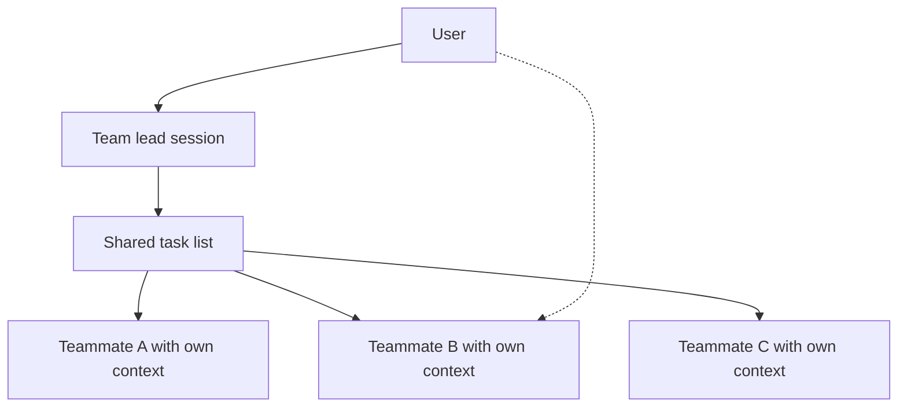

# Claude Code Agent Teams: Lead, Teammates and Limits

> Created by **Anthropic** - [https://www.anthropic.com/](https://www.anthropic.com/)

## Overview

Claude Code Agent Teams is an experimental feature of Anthropic's coding agent that runs several Claude Code sessions as one coordinated team. The [Claude Code agent teams documentation](https://code.claude.com/docs/en/agent-teams) describes it as a way to coordinate multiple Claude Code instances working together, with shared tasks, inter-agent messaging and centralized management. The [Claude Code glossary](https://code.claude.com/docs/en/glossary) puts it more structurally: multiple independent sessions coordinated by a team lead, with a shared task list and peer-to-peer messaging. The point is to split a job that is too broad for one context window into pieces that separate sessions can work on at the same time, while one session keeps the overall picture.

The architecture has three parts. One session acts as the team lead, which, according to [Anthropic's agent teams docs](https://code.claude.com/docs/en/agent-teams), coordinates work, assigns tasks and synthesizes results. Teammates are independent sessions, each operating in its own context window, and they can message each other directly instead of routing every question through the lead. The shared task list is the coordination surface: the lead writes tasks into it, teammates claim and complete them, and dependent tasks wait until their prerequisites are done. You can talk to the lead or to any individual teammate, which the [glossary](https://code.claude.com/docs/en/glossary) names as a key difference from subagents.

Anthropic introduced agent teams on February 5, 2026, in the [Claude Opus 4.6 announcement](https://anthropic.com/news/claude-opus-4-6), labelling them a research preview and saying they are best for tasks that split into independent, read-heavy work such as codebase reviews. A companion engineering post, [Building a C compiler with a team of parallel Claudes](https://anthropic.com/engineering/building-c-compiler), described a more ambitious use: multiple Claude instances working in parallel on a shared codebase without active human intervention, applied to building a C compiler. The [current documentation](https://code.claude.com/docs/en/agent-teams) has since turned the announcement into operational guidance on leads, teammates, shared tasks, messaging, activation and limits. The two launch framings differ in emphasis. The announcement stresses read-heavy review work, while the compiler write-up shows parallel agents writing code together, so treat write-heavy use as possible but harder to get right.

The feature is experimental and disabled by default. You enable it by setting CLAUDE\_CODE\_EXPERIMENTAL\_AGENT\_TEAMS=1 in your environment or settings.json, and without that variable Claude Code does not set up a team, write team directories, or spawn or propose teammates, per the [agent teams docs](https://code.claude.com/docs/en/agent-teams). A [June 2026 practitioner comparison](https://developersdigest.tech/blog/claude-code-subagents-vs-agent-teams-vs-workflows) notes the variable applies on v2.1.32 or later and lists further constraints, such as a fixed lead and permissions inherited when a teammate is created. The documented limitations shape how you plan a session:

| Limitation           | Practical effect                                                                                                                                                           |
| -------------------- | -------------------------------------------------------------------------------------------------------------------------------------------------------------------------- |
| No session resume    | In-process teammates are not restored by /resume or /rewind, and the lead may message teammates that no longer exist ([docs](https://code.claude.com/docs/en/agent-teams)) |
| One team per session | You cannot run a second team or share a team across sessions ([docs](https://code.claude.com/docs/en/agent-teams))                                                         |
| No nested teams      | Only the lead manages the team; teammates cannot spawn teammates ([docs](https://code.claude.com/docs/en/agent-teams))                                                     |
| Slow shutdown        | Teammates finish their current request or tool call before stopping ([docs](https://code.claude.com/docs/en/agent-teams))                                                  |
| Task status lag      | Teammates sometimes fail to mark tasks complete, which blocks dependent tasks ([docs](https://code.claude.com/docs/en/agent-teams))                                        |

The published evidence is thin and points mostly at cost. Anthropic states that teams use significantly more tokens than a single session because every teammate has its own context window, and that token costs scale linearly with the number of teammates ([agent teams docs](https://code.claude.com/docs/en/agent-teams)). It also flags coordination overhead, possible conflicts and diminishing returns. A [Reddit post reporting 52 controlled benchmarks](https://reddit.com/r/ClaudeAI/comments/1ss7f38/we_ran_52_controlled_benchmarks_on_claude_code) claims agent teams cost 73-124% more than sequential execution with zero quality gain, blaming each agent loading the full codebase context; that is practitioner evidence, not a peer-reviewed or Anthropic evaluation. On adoption, Anthropic's [analysis of roughly 400,000 Claude Code sessions](https://anthropic.com/research/claude-code-expertise) from about 235,000 people between October 2025 and April 2026 does not report what share used agent teams, so no published figure shows how widely the feature is used.

The closest alternative is subagents. The [glossary](https://code.claude.com/docs/en/glossary) describes subagents as running within a single session and reporting only to the parent, while teammates have separate context windows and can be reached directly; the [parallel agents overview](https://code.claude.com/docs/en/agents) frames agent teams as multiple coordinated sessions managed by a lead. Use subagents for focused helpers that return a summary, and a team when workers need to talk to each other about overlapping questions. The skill page on [choosing agent teams versus subagents](https://tryhamster.com/skills/choosing-agent-teams-versus-subagents) walks through that decision. Teams that track agent work next to human work can mirror the lead's task list in a shared workspace such as Hamster Studio, so the plan stays visible outside the terminal.

## Core Principles

### The lead owns the plan

One session acts as team lead, and [Anthropic's docs](https://code.claude.com/docs/en/agent-teams) give it three jobs: coordinating work, assigning tasks and synthesizing results. Only the lead can manage the team, and teammates cannot spawn their own teammates. That makes the lead's decomposition the single biggest lever on quality. If the task list is vague, every teammate inherits the vagueness.

### Separate context windows are both the feature and the bill

Each teammate runs in its own context window, which lets a team hold more of a large codebase in view than one session can, as the [glossary](https://code.claude.com/docs/en/glossary) describes. The same property is why [Anthropic warns](https://code.claude.com/docs/en/agent-teams) that token costs scale linearly with teammate count. Every teammate you add pays to load its own context. Add one only when it will read or change something the others are not already covering.

### Split along independent, read-heavy seams

The [launch announcement](https://anthropic.com/news/claude-opus-4-6) says agent teams are best for tasks that split into independent, read-heavy work, such as codebase reviews. A [practitioner guide](https://github.com/FlorianBruniaux/claude-code-ultimate-guide/blob/main/guide/workflows/agent-teams.md) reports the corollary: teams struggle with write-heavy tasks where multiple agents modify the same files. Review, research and investigation parallelize cleanly because agents do not overwrite each other's output. When writing is unavoidable, give each teammate its own files.

### Message the session that holds the context

Teammates can message each other directly, and you can interact with any of them rather than only the lead, per the [glossary](https://code.claude.com/docs/en/glossary). Send a question to the teammate whose task holds the answer when it concerns that task's details, such as why a test fails in its module. Send it to the lead when it changes scope, priorities or a decision that crosses tasks, because the lead assigns work and synthesizes results. Routing everything through the lead wastes its context, and routing cross-task decisions around it leaves the plan out of date.

### Treat it as experimental

Agent teams are experimental and disabled by default, according to the [agent teams docs](https://code.claude.com/docs/en/agent-teams). Documented gaps include teammates that are not restored on resume, lagging task status and slow shutdown. Plan sessions you can finish in one sitting and verify the task list yourself before trusting it. Build workflows that still hold up if the feature changes.

### Prove the speedup before scaling

Anthropic flags diminishing returns: adding teammates does not speed work up proportionally ([docs](https://code.claude.com/docs/en/agent-teams)). A [community benchmark report](https://reddit.com/r/ClaudeAI/comments/1ss7f38/we_ran_52_controlled_benchmarks_on_claude_code) went further, claiming agent teams cost 73-124% more than sequential runs with zero quality gain, though that is unreviewed practitioner evidence. Run the same task once with a single session and once with a small team before making teams your default. Keep the team only if it finishes faster or catches things the single session missed.

## Steps

1. **Check that the task splits**
   Before enabling anything, write the objective in one sentence and list the pieces it breaks into. Mark which pieces mostly read and which write, and which touch the same files. If most pieces share files or wait on one decision, stay with a single session or subagents. If you can name several independent slices, a team is worth trying, and [choosing agent teams versus subagents](https://tryhamster.com/skills/choosing-agent-teams-versus-subagents) covers the full decision.

2. **Enable the feature**
   Set CLAUDE_CODE_EXPERIMENTAL_AGENT_TEAMS=1 in your shell or settings.json; without it Claude Code will not spawn or propose teammates, per the [agent teams docs](https://code.claude.com/docs/en/agent-teams). Confirm your Claude Code version is recent enough, since a [practitioner comparison](https://developersdigest.tech/blog/claude-code-subagents-vs-agent-teams-vs-workflows) cites v2.1.32 or later. Start a fresh session so the team is set up at session start. If the lead never offers teammates, check the variable first.

3. **Plan the task list with the lead**
   Ask the lead for a planning pass that produces tasks with clear inputs, outputs and dependencies before any teammate starts. Review the list yourself and push back on tasks that are vague or overlap. If the lead creates too few tasks, ask it explicitly to split the work into smaller pieces. The [task decomposition skill](https://tryhamster.com/skills/decomposing-tasks-for-agent-teams) covers how to test each subtask.

   A good sign is that you could hand any single task to a stranger and they would know when it is done.

4. **Define teammate roles and file ownership**
   Give each teammate one focus, a set of files or modules it owns, and a list of areas it must leave alone. Keep review roles separate from implementation so the check stays independent. Where teammates must interoperate, agree interfaces or stubs before parallel work begins. The [roles and scopes skill](https://tryhamster.com/skills/designing-agent-roles-and-scopes) has a role catalog and sizing guidance.

5. **Run, monitor and route messages**
   Let teammates claim tasks and watch the shared task list and message traffic rather than each terminal. Answer task-specific questions by messaging the teammate directly, and send scope changes to the lead. Look for tasks that seem finished but are still open, because [task status can lag](https://code.claude.com/docs/en/agent-teams) and block dependents. See [managing shared task state](https://tryhamster.com/skills/managing-shared-task-state) and [coordinating inter-agent communication](https://tryhamster.com/skills/coordinating-inter-agent-communication) for the details.

6. **Synthesize, validate and shut down**
   When tasks complete, have the lead combine changes, resolve conflicts and run checks that span modules. Review the integrated result yourself before accepting it, because the lead's summary is not a test run. Shut teammates down deliberately and allow time, since they finish their current request or tool call first ([docs](https://code.claude.com/docs/en/agent-teams)). Record the tokens spent and whether the team beat a single session, and see [reviewing and synthesizing teammate outputs](https://tryhamster.com/skills/reviewing-and-synthesizing-teammate-outputs) for the acceptance review.

## When to Use

- A codebase review or audit that splits by module, because the launch guidance names independent, read-heavy work as the best fit and reviewers do not edit shared files.
- Debugging with several competing hypotheses, since teammates can pursue separate theories in their own context windows and message each other when their evidence overlaps.
- A feature that divides cleanly into backend, frontend and tests living in separate directories, so each teammate owns distinct files and the lead integrates at the end.
- Research across a repository too large to reason about in one context window, because each teammate loads only its slice and reports back.
- Work where workers genuinely need to ask each other questions mid-task, which subagents cannot do because they report only to the parent session.

## When Not to Use

- Small or strictly sequential changes a single session can finish, because each teammate adds token cost and coordination overhead with no parallelism to gain.
- Write-heavy refactors where several agents would edit the same files, since teammates share one working tree and concurrent edits collide.
- Long-running work you expect to pause and resume later, because in-process teammates are not restored after /resume or /rewind.
- Budget-constrained tasks where token spend matters more than wall-clock time, since costs scale with the number of teammates.
- Tasks that hinge on one design decision nobody has made yet, because parallel workers will each guess differently and force rework.

## Skills

This method includes the following skills:

- [Decomposing Tasks for Agent Teams](../../skills/decomposing-tasks-for-agent-teams/SKILL.md): Break a large objective into clearly bounded, parallelizable units of work while identifying dependencies and sequencing constraints across multiple Claude Code sessions.
- [Designing Agent Roles and Scopes](../../skills/designing-agent-roles-and-scopes/SKILL.md): Define non-overlapping responsibilities, expertise areas, and operational boundaries for each teammate session so that every Claude Code agent contributes distinct value.
- [Coordinating Inter-Agent Communication](../../skills/coordinating-inter-agent-communication/SKILL.md): Use peer-to-peer messaging between teammate sessions to share findings, clarify assumptions, resolve blockers, and maintain alignment without routing everything through the team lead.
- [Reviewing and Synthesizing Teammate Outputs](../../skills/reviewing-and-synthesizing-teammate-outputs/SKILL.md): Evaluate completed work from teammate sessions, reconcile conflicting results, validate correctness, and combine individual contributions into a coherent final deliverable as the team lead.
- [Parallelizing Independent Work Across Sessions](../../skills/parallelizing-independent-work-across-sessions/SKILL.md): Identify which subtasks can safely run concurrently in separate Claude Code sessions without conflicting file edits or missing intermediate results, maximizing throughput while avoiding unsafe parallelization.
- [Choosing Agent Teams Versus Subagents](../../skills/choosing-agent-teams-versus-subagents/SKILL.md): Decide when to use multi-session Agent Teams with peer-to-peer communication versus lightweight single-session subagents that report only to a parent, based on task complexity and coordination needs.
- [Managing Shared Task State](../../skills/managing-shared-task-state/SKILL.md): Track task ownership, progress, completion status, and dependencies through the shared task list so that parallel work across independent sessions remains organized and conflict-free.

## FAQ

**Are Claude Code Agent Teams generally available?**

No. Anthropic introduced them as a research preview in the [Claude Opus 4.6 announcement](https://anthropic.com/news/claude-opus-4-6), and the [docs](https://code.claude.com/docs/en/agent-teams) still describe them as experimental and disabled by default. You turn them on with the CLAUDE_CODE_EXPERIMENTAL_AGENT_TEAMS environment variable. Expect behavior and limits to change.

**How do agent teams differ from subagents?**

Subagents run inside a single session and report only to the parent, while teammates are separate sessions with their own context windows, according to the [Claude Code glossary](https://code.claude.com/docs/en/glossary). Teammates share a task list and can message each other and you directly. Subagents are cheaper and simpler for focused lookups. Teams fit work where the workers need to coordinate among themselves.

**Do agent teams cost more than a single session?**

Yes. Anthropic states that token costs scale linearly with the number of teammates because each has its own context window ([docs](https://code.claude.com/docs/en/agent-teams)). A [community benchmark post](https://reddit.com/r/ClaudeAI/comments/1ss7f38/we_ran_52_controlled_benchmarks_on_claude_code) claims teams cost 73-124% more than sequential runs with no quality gain, though it is not peer reviewed. Measure on your own tasks before committing.

**Should I message a teammate or the lead?**

You can message any teammate directly, as the [glossary](https://code.claude.com/docs/en/glossary) notes. Go to the teammate when the question is about its own task, such as a failing test in its module. Go to the lead when the answer changes scope, priorities or anything another teammate depends on, so the task list stays accurate.

**What happens to my team if I resume a session?**

In-process teammates are not restored by /resume or /rewind, per the [agent teams docs](https://code.claude.com/docs/en/agent-teams). After resuming, the lead may try to message teammates that no longer exist. Tell it to spawn new teammates for unfinished tasks. Plan team sessions so they can finish without a pause where possible.

**Is there evidence that agent teams produce better code?**

Not yet in any independent, controlled form. The only benchmark in circulation is a [practitioner Reddit report](https://reddit.com/r/ClaudeAI/comments/1ss7f38/we_ran_52_controlled_benchmarks_on_claude_code) claiming zero quality gain at higher cost. Anthropic's [usage analysis of roughly 400,000 sessions](https://anthropic.com/research/claude-code-expertise) does not break out agent teams, so adoption is also unmeasured. Treat quality gains as something to verify on your own work.

## Sources

- [Claude Opus 4.6](https://anthropic.com/news/claude-opus-4-6)
- [Building a C compiler with a team of parallel Claudes - Anthropic](https://anthropic.com/engineering/building-c-compiler)
- [Orchestrate teams of Claude Code sessions - Claude Code Docs](https://code.claude.com/docs/en/agent-teams)
- [Glossary - Claude Code Docs](https://code.claude.com/docs/en/glossary)
- [Agent Teams Workflow - claude-code-ultimate-guide - GitHub](https://github.com/FlorianBruniaux/claude-code-ultimate-guide/blob/main/guide/workflows/agent-teams.md)
- [Subagents vs Agent Teams vs Workflows: Claude Code's](https://developersdigest.tech/blog/claude-code-subagents-vs-agent-teams-vs-workflows)
- [Run agents in parallel - Claude Code Docs](https://code.claude.com/docs/en/agents)
- [How Claude Code is used in practice](https://anthropic.com/research/claude-code-expertise)
- [We ran 52 controlled benchmarks on Claude Code. Agent Teams cost 73-124% more than sequential with zero quality gain.](https://reddit.com/r/ClaudeAI/comments/1ss7f38/we_ran_52_controlled_benchmarks_on_claude_code)

---

*[Import this method into Hamster](https://tryhamster.com) to share it with your team, customize it for your workflow, and let AI agents use it automatically.*
