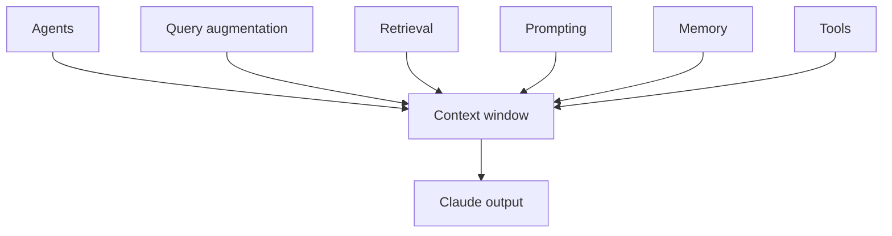

# Context Engineering for Claude AI: The 6 Pillars

> Created by **Anthropic \(Claude Code team\)** — [https://www.anthropic.com/](https://www.anthropic.com/)

## Overview

Context engineering, in the wording of the [ClaudeFast six pillars guide](https://claudefa.st/blog/guide/mechanics/context-engineering), is "the discipline of architecting how information flows to your AI model." The framework starts from a constraint every Claude AI user runs into: the context window is a finite workspace, and instructions, retrieved documents, tool outputs and conversation history all compete for it. Anthropic's documentation describes that window as holding [everything Claude knows about your session](https://code.claude.com/docs/en/context-window), including your instructions, the files it reads, its own responses and content that never appears in the terminal. The ClaudeFast guide frames agents as the orchestrators of that space, [deciding what surfaces, persists, or is discarded](https://claudefa.st/blog/guide/mechanics/context-engineering). The practical goal is predictable output: the model should see the facts it needs for the current task, and little else.

The framework names six interconnected pillars. In the [ClaudeFast description](https://claudefa.st/blog/guide/mechanics/context-engineering), agents distribute context across specialists, query augmentation refines messy input, retrieval surfaces relevant information (including through CLAUDE.md files and skills), prompting layers information strategically, memory maintains state across sessions, and tools extend capabilities efficiently. A second practitioner guide, [BuildThisNow's context engineering explainer](https://buildthisnow.com/blog/guide/mechanics/context-engineering), lists the same six and presents them as a conceptual model rather than a tested procedure. Each pillar is a separate route into the same window, as the diagram shows.

The table maps each pillar to the Claude Code mechanism practitioners usually reach for. The retrieval mapping follows [ClaudeFast](https://claudefa.st/blog/guide/mechanics/context-engineering), the memory, interview and MCP mappings follow a [Claude Code six pillars roundup](https://mindpattern.ai/f/10213), and subagent delegation follows [Anthropic's best practices](https://code.claude.com/docs/en/best-practices).

| Pillar | Role | Claude Code mechanism |
|---|---|---|
| Agents | Split work across specialists | Subagents |
| Query augmentation | Turn messy input into a clear task | Interview workflow before coding |
| Retrieval | Surface relevant information | CLAUDE.md files and skills |
| Prompting | Layer instructions strategically | CLAUDE.md plus the turn prompt |
| Memory | Keep state across sessions | CLAUDE.md as project memory |
| Tools | Extend capabilities efficiently | MCP servers and CLI tools |

Attribution needs care. The framework is often credited to Anthropic's Claude Code team, but the original source located for the six-pillar formulation is a [ClaudeFast article](https://claudefa.st/blog/guide/mechanics/context-engineering) with no Anthropic authorship, dated September 15, 2026 with a listed last update of July 29, 2026 and no revision history. Anthropic's own [effective context engineering article](https://anthropic.com/engineering/effective-context-engineering-for-ai-agents) covers the discipline and defines compaction, but neither it nor Anthropic's [Claude Code best practices](https://anthropic.com/engineering/claude-code-best-practices?s=09) ([source](https://anthropic.com/engineering/effective-context-engineering-for-ai-agents)) publishes a six-pillar framework under this title. The label itself is unstable: a [separate practitioner roundup](https://mindpattern.ai/f/10213) describes a different six-part list made of CLAUDE.md, /init, /rewind with selective summarization, an interview workflow, CLI tools with MCP servers, and memory compounding. Treat the six pillars as a community taxonomy, not a specification.

The evidence base is thin at the level of the whole framework. Neither [BuildThisNow](https://buildthisnow.com/blog/guide/mechanics/context-engineering) nor the [six pillars roundup](https://mindpattern.ai/f/10213) reports an experiment, sample size, task-success rate or controlled comparison. Evidence exists for individual components, and it cuts both ways. Anthropic reported that it [removed over 80% of Claude Code's system prompt](https://claude.com/blog/the-new-rules-of-context-engineering-for-claude-5-generation-models) for Claude Opus 5 and Claude Fable 5 with no measurable loss on its coding evaluations, which supports lean persistent instructions. A report on an [ETH Zurich study of repository context files](https://marktechpost.com/2026/09/12/context-engineering-inside-the-harness-4-mechanisms-that-beat-context-overflow-and-goal-loss-on-long-horizon-tasks/amp) found that files like AGENTS.md did not generally improve task success while raising inference cost, with LLM-generated files adding 20% and 23% on two benchmarks and developer-committed files up to 19% ([source](https://marktechpost.com/2026/09/12/context-engineering-inside-the-harness-4-mechanisms-that-beat-context-overflow-and-goal-loss-on-long-horizon-tasks/amp)). That study did not test CLAUDE.md or this framework directly, but it is a reason to measure rather than assume that more persistent context helps.

Much of the framework exists to stop context going bad. [Simon Willison's summary](https://simonwillison.net/2025/Jun/29/how-to-fix-your-context) names four failure modes: poisoning, where a hallucination or error enters the context and is repeatedly referenced; distraction, where a long context makes the model over-focus on it and neglect what it learned in training; confusion, where superfluous information produces a low-quality response; and clash, where accumulated information and tools conflict with other parts of the prompt. The [ClaudeFast guide](https://claudefa.st/blog/guide/mechanics/context-engineering) pairs these with remedies: a fresh session or /clear for poisoning, strategic chunking for distraction, and CLAUDE.md as the single source of truth for clashes. In practice the pillars resolve into three layers. The persistent layer, typically CLAUDE.md, loads every session and should hold project purpose, conventions and codebase gotchas, as [Anthropic's Claude 5 context guidance](https://claude.com/blog/the-new-rules-of-context-engineering-for-claude-5-generation-models) frames it; the on-demand layer holds skills and reference files read only when needed; the turn layer carries the exact inputs and definition of done for the current task.

The main alternative is a persistent representation of the codebase. An [independent comparison of Claude Code and Google Antigravity](https://augmentcode.com/tools/google-antigravity-vs-claude-code) describes Claude Code as relying on CLAUDE.md plus just-in-time glob and grep search, with no embedding, syntax-tree or vector index, and no controlled head-to-head result exists between the two approaches. Harness choice matters too: [OpenCode](https://pub.towardsai.net/opencode-vs-claude-code-the-complete-terminal-ai-alternatives-guide-2026-4ca00893ce51) offers support for more than 75 model providers and local models, while Claude Code is optimized around Anthropic features such as prompt caching and deferred tool search. Hamster Studio, an AI-first team workspace, is one place teams can keep that shared persistent layer current for people and agents alike.

## Core Principles

### Treat context as a scarce budget

Every file Claude reads, every command output and every message stays in the window, and [Anthropic's best practices](https://code.claude.com/docs/de/best-practices) warn that the window fills quickly and performance drops as it fills. That makes admission the core decision: before adding material, ask what the next step actually needs. Bulk that might be useful later belongs in a file Claude can search, not in the session. If answers start ignoring earlier instructions, the budget has been overspent.

### Keep the persistent layer lean

Instructions that load every session are paid for on every turn. Anthropic's [Claude 5 context guidance](https://claude.com/blog/the-new-rules-of-context-engineering-for-claude-5-generation-models) recommends a lightweight CLAUDE.md focused on purpose, conventions and gotchas, and reports cutting over 80% ([source](https://claude.com/blog/the-new-rules-of-context-engineering-for-claude-5-generation-models)) of Claude Code's own system prompt without measurable loss. The [ETH Zurich findings on context files](https://marktechpost.com/2026/09/12/context-engineering-inside-the-harness-4-mechanisms-that-beat-context-overflow-and-goal-loss-on-long-horizon-tasks/amp) point the same way, with extra persistent text raising cost without reliably improving success. A useful test is whether a line changes behavior on most tasks; if not, move it to an on-demand layer.

### Disclose detail progressively

Detail that only some tasks need should live in skills, reference files or commands that Claude opens when relevant. [ClaudeFast](https://claudefa.st/blog/guide/mechanics/context-engineering) treats CLAUDE.md files and skills as the retrieval pillar precisely because they surface information on demand. This keeps the starting context short while leaving depth reachable. The warning sign is a CLAUDE.md that reads like a wiki.

### Keep one source of truth

Contradictions are harder to spot than noise, because each instruction looks reasonable on its own. [ClaudeFast](https://claudefa.st/blog/guide/mechanics/context-engineering) recommends treating CLAUDE.md as the single source of truth and retiring obsolete guidance elsewhere. When a rule changes, update it in one place and delete the old wording rather than appending a correction. If Claude alternates between two behaviors, search for duplicate rules before rewriting prompts.

### Reset instead of arguing with bad context

Once an error is in the context, [Willison's taxonomy](https://simonwillison.net/2025/Jun/29/how-to-fix-your-context) explains why it spreads: the model keeps referencing it. Correcting it in the next message leaves the original error in the window. Anthropic's [best practices](https://code.claude.com/docs/en/best-practices) recommend running /clear between unrelated tasks, and ClaudeFast recommends a fresh session for poisoned context. Carry forward only a short, verified summary.

### Isolate exploration in subagents

Broad investigations fill the window with material the main task will never use. Anthropic's [best practices](https://code.claude.com/docs/en/best-practices) recommend delegating research to subagents, which matches the agents pillar of distributing context across specialists in [ClaudeFast's framework](https://claudefa.st/blog/guide/mechanics/context-engineering). The main session receives a summary rather than every file the subagent read. If the main thread still grows fast during research, the delegation boundary is in the wrong place.

### Verify every output

Anthropic describes a [trust-then-verify gap](https://code.claude.com/docs/de/best-practices) in which Claude produces plausible implementations that miss edge cases. Claude Code's working loop is to [gather context, take action, verify work and repeat](https://anthropic.com/engineering/building-agents-with-the-claude-agent-sdk?_bhlid=8a187456873bf69500724d5a5a72d17bad7aab3f), and verification is where context engineering either pays off or fails visibly. Give Claude a test, script or screenshot to check against. Without one, even a well-engineered context yields unchecked output.

## Steps

1. **Inventory what enters the context**
   List every source that can reach the window in a typical session: CLAUDE.md files, skills, MCP servers, file reads, command output, pasted errors and conversation history. For each one, note whether it loads always, on demand or per turn. The output is a simple map of sources and owners. This makes invisible consumers visible, especially tool output that never appears in the terminal.

   For tracking what fills the window over a session, see [managing context window token budgets](https://tryhamster.com/skills/managing-context-window-token-budgets).

2. **Trim the persistent layer**
   Read CLAUDE.md line by line and keep only project purpose, conventions and gotchas that apply to most tasks. Move everything else into a candidate list for on-demand files. Remove duplicated rules so each instruction exists once. You know this went wrong if Claude starts missing conventions it previously followed, which means you cut a rule that really was global.

3. **Move detail to on-demand layers**
   Turn the candidate list into skills, reference documents or commands that Claude opens only when a task calls for them. Name and describe each one so the right trigger is obvious. For large document sets, chunk and index them rather than pasting them in. The patterns are covered in [structuring retrieval-augmented context](https://tryhamster.com/skills/structuring-retrieval-augmented-context) and [layering instruction hierarchies](https://tryhamster.com/skills/layering-instruction-hierarchies-in-prompts).

4. **Scope each turn prompt**
   For every task, supply the exact inputs: the target file, the full error, the constraints and any reference material. State what done looks like, including format and the tests Claude must run. This is the query augmentation pillar in practice, turning a vague request into a checkable one. Detailed guidance lives in [writing system prompts for Claude](https://tryhamster.com/skills/writing-system-prompts-for-claude).

5. **Control tool and subagent flows**
   Decide which tools the agent needs and what their output should look like when it returns. Filter or truncate long results before they land in the main context. Send broad research to subagents and ask for a summary back. The loop and filtering patterns are in [engineering tool output context flows](https://tryhamster.com/skills/engineering-tool-output-context-flows).

6. **Reset, compact and verify**
   Clear the session between unrelated tasks and start fresh when an error has taken hold. Compact with an explicit focus when a long task must continue. Check each result against a test or script before moving on. If the same conflict returns after a reset, the cause is in a persistent source, which [preventing context poisoning and clashes](https://tryhamster.com/skills/preventing-context-poisoning-and-clashes) and [designing multi-turn conversation context](https://tryhamster.com/skills/designing-multi-turn-conversation-context) show how to trace.

## When to Use

- Long Claude Code sessions in a large repository where answers begin ignoring earlier decisions, because the framework gives each failure a name and a matching remedy instead of guesswork.
- First-time setup of CLAUDE.md, skills and MCP servers for a shared repository, because deciding which layer each instruction belongs to prevents a bloated persistent file that every session pays for.
- Building an agent that calls many tools or subagents, because the tools and agents pillars force an explicit decision about what output flows back into the main context.
- Auditing a context setup that has grown expensive or inconsistent, because separating persistent, on-demand and turn layers shows which instructions can be trimmed or consolidated.
- Onboarding a team to Claude-assisted development, because a shared vocabulary for poisoning, distraction, confusion and clash makes context problems easier to report and fix.

## When Not to Use

- One-off questions in a short chat, because the context never gets close to full and the overhead of layering instructions outweighs any benefit.
- Justifying tooling spend with proven results, because the framework itself reports no experiment or benchmark, as [BuildThisNow](https://buildthisnow.com/blog/guide/mechanics/context-engineering) makes clear by presenting it as a conceptual model.
- Workflows built around a persistent vector or syntax-tree index of the codebase, because the Claude Code mappings assume just-in-time search, an approach an [independent comparison](https://augmentcode.com/tools/google-antigravity-vs-claude-code) contrasts with indexing.
- Citing the six pillars as an official Anthropic standard in policy or compliance documents, because the located source is [ClaudeFast](https://claudefa.st/blog/guide/mechanics/context-engineering), not Anthropic.

## Skills

This method includes the following skills:

- [Writing Effective System Prompts for Claude AI](skills/writing-system-prompts-for-claude/SKILL.md) — How to craft precise, well-structured system prompts that set behavioral guardrails and task framing within Claude's finite context window.
- [Structuring Retrieval-Augmented Context for Claude](skills/structuring-retrieval-augmented-context/SKILL.md) — How to design and format retrieved documents, knowledge chunks, and external data so Claude can reliably extract and synthesize the most relevant information.
- [Preventing Context Poisoning, Distraction, and Clashes](skills/preventing-context-poisoning-and-clashes/SKILL.md) — How to identify and resolve conflicting, redundant, or misleading information in your context that causes Claude to produce unreliable outputs.
- [Engineering Tool Output Context Flows for Claude Agents](skills/engineering-tool-output-context-flows/SKILL.md) — How to design and constrain tool call outputs so they integrate cleanly into Claude's context without overwhelming or displacing critical instructions.
- [Managing Context Window Token Budgets in Claude](skills/managing-context-window-token-budgets/SKILL.md) — How to audit, allocate, and optimize token usage across instructions, retrieved documents, tool outputs, and conversation history to maximize Claude's output quality.
- [Layering Instruction Hierarchies in Claude Prompts](skills/layering-instruction-hierarchies-in-prompts/SKILL.md) — How to organize system-level, task-level, and turn-level instructions into clear priority layers so Claude resolves competing directives predictably.
- [Designing Multi-Turn Conversation Context Strategies](skills/designing-multi-turn-conversation-context/SKILL.md) — How to manage conversation history across long interactions by summarizing, pruning, and prioritizing prior turns to keep Claude focused and accurate.

## FAQ

**Did Anthropic create the 6 pillars framework?**

The available evidence says no. The original source located for the six-pillar formulation is a ClaudeFast article, and Anthropic's own writing on context engineering and Claude Code best practices does not publish a framework under this title. Anthropic's material does support several of the underlying practices, such as lean CLAUDE.md files and clearing context between tasks. Credit the taxonomy to ClaudeFast and the component practices to their individual sources.

**What are the six pillars?**

They are agents, query augmentation, retrieval, prompting, memory and tools. Agents spread work across specialists, query augmentation clarifies messy input, retrieval surfaces relevant information, prompting layers instructions, memory carries state across sessions, and tools extend what the model can do. Some practitioner write-ups use a different six-part list built around Claude Code commands, so check which version a source means.

**Is there evidence the framework improves results?**

Not for the framework as a whole. The practitioner guides that describe it report no experiments, sample sizes or task-success rates. Some components have evidence: Anthropic reported trimming its system prompt heavily without measurable loss, while an ETH Zurich study found repository context files raised cost without generally improving success. Treat it as a useful checklist and measure the effect on your own tasks.

**How is context engineering different from prompt engineering?**

Prompt engineering focuses on the wording of a single instruction. Context engineering covers everything that reaches the model: persistent files, retrieved documents, tool output, subagent summaries and conversation history. In the six pillars model, prompting is only one of six pillars. Many failures blamed on a bad prompt are really caused by stale or contradictory material elsewhere in the window.

**Should I still write a CLAUDE.md file?**

Yes, but keep it short and specific. Anthropic's guidance reserves it for project purpose, conventions and codebase gotchas, and pushes task-specific detail into files or skills loaded on demand. The ETH Zurich findings on AGENTS.md style files suggest that long persistent files can add cost without adding success, though that study did not test CLAUDE.md directly. Review it whenever Claude repeats an outdated behavior.

**Does the framework only apply to Claude Code?**

The pillars are general, but most published mappings target Claude Code mechanisms such as CLAUDE.md, skills, MCP servers and subagents. Other harnesses, such as OpenCode with its multi-provider support, expose different mechanisms for the same ideas. The failure taxonomy of poisoning, distraction, confusion and clash applies to any long-context model workflow.

## Sources

- [Claude Code Context Engineering: 6 Pillars Framework](https://claudefa.st/blog/guide/mechanics/context-engineering)
- [Claude Code Best Practices](https://anthropic.com/engineering/claude-code-best-practices?s=09)
- [Building agents with the Claude Agent SDK \\ Anthropic](https://anthropic.com/engineering/building-agents-with-the-claude-agent-sdk?_bhlid=8a187456873bf69500724d5a5a72d17bad7aab3f)
- [Effective context engineering for AI agents - Anthropic](https://anthropic.com/engineering/effective-context-engineering-for-ai-agents)
- [How to Fix Your Context](https://simonwillison.net/2025/Jun/29/how-to-fix-your-context)
- [Context Engineering \| Build This Now - BuildThisNow](https://buildthisnow.com/blog/guide/mechanics/context-engineering)
- [Context Engineering Inside the Harness: 4 Mechanisms That Beat](https://marktechpost.com/2026/09/12/context-engineering-inside-the-harness-4-mechanisms-that-beat-context-overflow-and-goal-loss-on-long-horizon-tasks/amp)
- [Best Practices für Claude Code](https://code.claude.com/docs/de/best-practices)
- [Best practices for Claude Code](https://code.claude.com/docs/en/best-practices)
- [OpenCode vs Claude Code: The Complete Terminal AI Alternatives Guide \(2026\)](https://pub.towardsai.net/opencode-vs-claude-code-the-complete-terminal-ai-alternatives-guide-2026-4ca00893ce51)
- [The new rules of context engineering for Claude 5 generation](https://claude.com/blog/the-new-rules-of-context-engineering-for-claude-5-generation-models)
- [Context Engineering for Claude Code: The Six Pillars Framework — CLAUDE.md, /init, /rewind, Interview Workflow, MCP Servers, Memory Compounding](https://mindpattern.ai/f/10213)
- [Google Antigravity vs Claude Code: Agent-First](https://augmentcode.com/tools/google-antigravity-vs-claude-code)
- [Explore the context window - Claude Code Docs](https://code.claude.com/docs/en/context-window)

---

*[Import this method into Hamster](https://tryhamster.com) to share it with your team, customize it for your workflow, and let AI agents use it automatically.*
