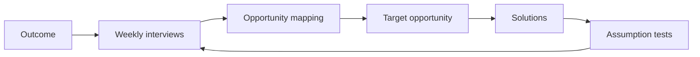

# Continuous Discovery Habits: A Practitioner's Guide

> Created by **Teresa Torres** - [https://www.producttalk.org/](https://www.producttalk.org/)

## Overview

Continuous Discovery Habits is a structured approach to product development that answers a deceptively simple question: how do product teams make better decisions about what to build? It was created and popularized by Teresa Torres, a product discovery coach who first defined continuous discovery in a [2017 Product Talk article on adopting continuous product discovery](https://producttalk.org/adopting-continuous-product-discovery) and codified the framework in her [2021 book *Continuous Discovery Habits: Discover Products that Create Customer Value and Business Value*](https://openlibrary.org/books/OL32480798M/Continuous_Discovery_Habits). The method emerged from her work with product trios (a product manager, a designer, and a software engineer working together). Torres developed the framework in response to a persistent failure mode she observed across the industry: teams that conducted discovery in large, infrequent batches (or skipped it entirely) consistently built products that missed the mark, regardless of how well they executed delivery. Her canonical definition is [at a minimum, weekly touch points with customers by the team building the product, where they conduct small research activities in pursuit of a desired product outcome](https://producttalk.org/getting-started-with-discovery), and she later paired it with [three supporting mindsets: collaborative, continuous, and experimental](https://producttalk.org/continuous-discovery-mindsets).

The core mental model underlying Continuous Discovery Habits is that product decisions are bets, and the quality of those bets improves dramatically when teams maintain a continuous, structured connection to customer reality. Torres draws a sharp distinction between *output-focused* teams, those measured by features shipped, story points completed, or roadmap items delivered, and *outcome-focused* teams that orient around measurable changes in customer or business behavior. The framework argues that when teams pursue outcomes rather than outputs, they gain the strategic latitude to discover the best path forward rather than marching toward a predetermined solution. This is not merely a philosophical stance; it's an operational one that restructures how teams spend their time week to week. The habit loop looks like this:

What sets Continuous Discovery Habits apart from adjacent methods like Design Thinking, Lean Startup, or Jobs to Be Done is its emphasis on *habit formation* over heroic effort. Design Thinking provides a process for creative problem-solving but doesn't prescribe a cadence. Lean Startup introduced the build-measure-learn loop but left teams struggling with how to run that loop sustainably alongside delivery work. JTBD offers a powerful lens for understanding customer motivation but is primarily a research framework, not an operating rhythm. Torres synthesized ideas from all of these, along with cognitive science research on decision-making biases, into a system designed to be practiced weekly by a small, empowered team without requiring a dedicated research department or months-long discovery phases. The Opportunity Solution Tree, the method's signature visual artifact, gives teams a shared map connecting their desired outcome to the customer opportunities (needs, pain points, desires) they've uncovered and the solutions they're considering, making the logic behind product decisions visible and debatable. The closest named alternative, [dual-track agile, is described as an organizational arrangement rather than a team habit](https://koji.so/docs/discovery-vs-delivery):

| Dimension | Continuous discovery | Dual-track agile |
|---|---|---|
| Unit of practice ([comparison](https://koji.so/docs/discovery-vs-delivery)) | Recurring product-team habit | Organizational arrangement of parallel streams |
| Cadence ([Torres](https://producttalk.org/getting-started-with-discovery)) | At minimum weekly customer touchpoints | Parallel streams, no set interview cadence stated |
| Discovery-delivery handoff ([comparison](https://koji.so/docs/discovery-vs-delivery)) | Same trio does both continuously | Explicit handoff points between streams |

Since its publication, the framework has evolved in practice. Early adopters often started with the weekly customer interview habit and gradually layered on assumption testing and structured decision-making. The community of practitioners, facilitated through Torres's Product Talk platform, coaching programs, and conference workshops, has contributed patterns for adapting the method to B2B enterprise contexts (where customer access is gated), platform teams (where the "customer" is an internal engineer), and regulated industries (where experimentation faces compliance constraints). The method has also increasingly intersected with the AI-assisted product development movement, as teams explore how AI tools can help synthesize interview notes, generate assumption maps, and maintain living opportunity solution trees. Hamster offers a workspace where teams can run Continuous Discovery Habits with AI agents, keeping the discovery rhythm alive alongside daily delivery work.

Continuous Discovery Habits benefits most teams that own a product outcome and have some access to customers, but it particularly shines in organizations where the gap between "what we think customers want" and "what customers actually need" is costing real money. Teams building new products in uncertain markets, teams trying to reduce churn by understanding unmet needs, and teams drowning in stakeholder feature requests all find the framework transformative. It works less well when imposed top-down without genuine team empowerment, when customer access is truly impossible (not just inconvenient), or when the problem space is so well-understood that the overhead of continuous discovery exceeds its informational value. [One practitioner review argues](https://inigomedina.co/library/work/torres-continuous-discovery-habits) that weekly interviewing may be difficult in regulated industries, enterprise B2B settings with limited user access, and organizations under intense delivery pressure. The method's power lies not in any single technique but in the compounding effect of small, frequent, structured learning, the same principle that makes compound interest powerful in finance.

## Core Principles

### Outcome Over Output Orientation

Teams should be measured by the customer and business outcomes they drive, not by the features they ship or the stories they complete. When teams pursue outcomes, they retain the freedom to explore multiple solutions and pivot when evidence demands it. When teams skip this principle and default to output metrics, they build exactly what was specified on the roadmap regardless of whether it moves the needle, creating a false sense of progress. The tradeoff is real: outcome orientation requires leadership to tolerate ambiguity and trust teams with strategic latitude, which is uncomfortable in organizations accustomed to top-down feature roadmaps.

### The Product Trio as the Unit of Discovery

Discovery is not something a product manager does alone and then hands off. It's a collaborative activity for a trio of a product manager, a designer, and a software engineer. This trio structure ensures that customer insights are interpreted through three complementary lenses: business viability, user experience, and technical feasibility. When only one discipline participates in discovery, the resulting decisions carry blind spots that surface late in delivery as scope creep, rework, or missed opportunities.

The tradeoff is coordination cost: keeping three people aligned on a weekly discovery cadence requires deliberate scheduling and shared context, which feels expensive until teams realize it's far cheaper than the rework that siloed discovery produces.

### Weekly Cadence of Customer Interaction

Teams should talk to customers every single week, not in marathon research sprints separated by months of silence, but in small, frequent touchpoints that keep customer reality fresh in the team's mental model. This weekly habit is the engine that powers everything else in the framework; without it, opportunity maps go stale, assumptions go untested, and teams drift back toward building based on internal opinions. The principle draws on habit formation research: a weekly cadence is frequent enough to become automatic but infrequent enough to be sustainable alongside delivery work. Teams that skip weeks consistently find themselves back in big-batch mode within a quarter.

### Externalize Your Thinking with Visual Artifacts

The Opportunity Solution Tree is the framework's signature artifact, a visual map that connects a desired outcome to customer opportunities to potential solutions to assumption tests. Externalizing this thinking serves two purposes: it makes the team's reasoning visible and debatable (reducing the influence of the loudest voice in the room), and it creates a shared memory that persists across weeks of iterating. Teams that keep their discovery logic in their heads or buried in documents lose the connective tissue between what they learned last week and what they're building this week. The tradeoff is maintenance: the tree must be updated regularly to remain useful, and a stale tree is worse than no tree because it creates false confidence.

### Compare and Contrast, Don't Pick the First Idea

When evaluating solutions, teams should generate and compare at least three options rather than falling in love with the first idea that feels promising. This principle directly combats confirmation bias, the tendency to seek evidence that supports what we already believe. Research in decision science shows that people who consider multiple alternatives simultaneously make better choices than those who evaluate options sequentially. Teams that skip this habit consistently over-invest in their first idea, discover its flaws late, and then face the sunk-cost fallacy of abandoning work they've already started.

The tradeoff is that generating multiple options feels slower upfront, even though it's faster across the full build cycle.

### Test Assumptions Before Building Solutions

Every solution is built on a stack of assumptions about customer behavior, technical feasibility, business viability, usability, and ethics. Teams should identify and test the riskiest assumptions with the smallest possible investment before committing to full implementation. This is not the same as building an MVP; assumption tests can be as simple as a one-question survey, a concierge test, or a paper prototype. Teams that skip assumption testing routinely discover that their most dangerous assumption was wrong only after they've invested weeks or months of engineering effort.

The tradeoff is discipline: it requires the team to slow down and disaggregate their solution into testable components, which feels pedantic until it saves them from a costly miss.

### Continuous Means Sustainable, Not Exhausting

The word 'continuous' in the framework's name does not mean 'constant' or 'all-consuming.' It means small, regular, sustainable, like exercising three times a week rather than running a marathon once a quarter. Each discovery activity should be small enough to fit alongside delivery work without requiring heroic effort. Teams that interpret 'continuous' as 'do everything all the time' burn out within weeks and abandon discovery entirely, which is worse than never starting.

The framework is explicitly designed to be layered in gradually: start with the weekly interview habit, then add opportunity mapping, then structured decision-making, then assumption testing.

## Steps

1. **Define a Clear Product Outcome**
   Begin by identifying the specific, measurable outcome your product trio will pursue: not a feature to build, but a change in customer or business behavior you want to drive. Good outcomes look like 'increase the percentage of new users who complete onboarding within their first week' rather than 'build an onboarding wizard.' The outcome should be within the team's sphere of influence (they can affect it through product changes) but not entirely within their control (customer behavior is always a factor). You know you've defined a good outcome when the team can brainstorm multiple, genuinely different approaches to achieving it.

   Watch out for proxy metrics that are easy to game: if the team can move the metric without actually improving customer experience, the outcome is poorly defined. A common variation is negotiating the outcome with leadership iteratively: the team proposes an outcome, leadership pushes back on scope or ambition, and they converge on something the team owns and leadership values.

2. **Establish a Weekly Customer Interview Habit**
   Set up a sustainable system for conducting at least one customer interview per week, every week. This is the single most important habit in the entire framework; everything else depends on maintaining a fresh, continuous stream of customer insight. Start by automating recruitment: embed intercepts in your product, partner with customer success to identify willing participants, or use a research recruitment tool to maintain a standing panel. Each interview should be 20-30 minutes, conducted by at least two members of the product trio, and focused on understanding the customer's current experience rather than pitching solutions or gathering feature requests.

   You know the habit is working when the team starts referencing specific customers by name in sprint planning and design reviews. Watch out for interviewing only power users or only unhappy users; systematically vary your participant profile. A common gotcha is canceling interviews when delivery deadlines loom; protect the interview slot like you'd protect a production deployment.

3. **Map the Opportunity Space**
   After several weeks of interviews, begin synthesizing what you've learned into an Opportunity Solution Tree. Start with your desired outcome at the top, then map the customer opportunities (needs, pain points, and desires) you've uncovered beneath it. Opportunities should be framed from the customer's perspective, 'I can't tell which notifications are urgent' rather than 'we need notification categories.' Cluster related opportunities and look for parent-child relationships: a broad opportunity like 'I waste time on low-priority tasks' might have children like 'I can't distinguish urgent from non-urgent items' and 'I get interrupted by every notification.'

   You know you've mapped well when a new team member could look at the tree and understand the customer landscape without attending the interviews. Watch out for jumping to solutions prematurely; the opportunity space should feel uncomfortably problem-rich before you start brainstorming solutions. Update the tree after every interview; it's a living artifact, not a one-time deliverable.

4. **Prioritize Target Opportunities**
   With a populated opportunity space, select the specific opportunity (or small cluster of related opportunities) the team will focus on. Prioritization should weigh three factors: how much addressing this opportunity could move your target outcome, how frequently and intensely customers experience the need, and how feasible it is to address given your team's current capabilities and constraints. Avoid prioritizing by gut feeling alone; use the evidence from your interviews to assess frequency and intensity. Torres recommends assessing opportunities against your outcome directly: 'If we fully addressed this opportunity, how much would our outcome metric move?'

   You know you've prioritized well when the team feels genuine conviction, not just compliance, about the chosen focus area. Watch out for the trap of picking the most interesting opportunity rather than the most impactful one, and for spreading focus across too many opportunities simultaneously. Revisit prioritization monthly as new interview data shifts your understanding.

5. **Generate Multiple Solutions Using Compare-and-Contrast**
   For your target opportunity, generate at least three meaningfully different solution concepts before evaluating any of them. This is where the compare-and-contrast decision-making principle becomes operational: the team brainstorms diverse approaches, then evaluates them side by side against explicit criteria (impact on the target opportunity, technical effort, risk, alignment with product vision). Use structured comparison, a simple table with solutions as columns and criteria as rows, rather than unstructured debate. You know you've done this well when at least one of the three solutions surprises the team; if all three are variations of the obvious first idea, you haven't diverged enough.

   Watch out for anchoring on the first idea discussed and generating two weak alternatives as straw men. A useful variation is including one 'wild card' solution that the team considers unrealistic; it often contains a kernel of insight that improves the chosen approach. The output is a selected solution (or hybrid) with clear rationale for why it was chosen over the alternatives.

6. **Identify and Map Assumptions**
   Before building anything, disaggregate your chosen solution into its underlying assumptions. Every solution depends on beliefs about customer behavior ('users will notice and click this new button'), technical feasibility ('our API can handle this query in under 200ms'), business viability ('this feature won't increase support costs'), usability ('users will understand this new workflow without instruction'), and sometimes ethics ('this nudge isn't manipulative'). List every assumption you can identify, then plot them on a two-by-two matrix: importance (how catastrophic if wrong) versus evidence (how much evidence you have that it's true). Focus your testing effort on the assumptions in the high-importance, low-evidence quadrant; these are your leap-of-faith assumptions.

   You know you've mapped well when you've identified at least one assumption that, if wrong, would invalidate the entire solution. Watch out for assuming that desirability assumptions are always the riskiest; sometimes the biggest risk is technical or regulatory.

7. **Run Rapid Assumption Tests**
   Design and run the smallest possible test for each high-risk assumption. Assumption tests are not MVPs or prototypes of the full solution; they're targeted experiments designed to generate evidence about one specific belief. A desirability assumption ('users want to see their spending trends') might be tested with a one-question survey or a fake door test. A usability assumption ('users can complete this flow in under 3 minutes') might require a 5-user prototype test.

   A feasibility assumption might be a technical spike. Each test should have a clear hypothesis ('We believe that enough users shown this option will click it to clear the threshold we set in advance'), a method, and a success criterion defined before running the test. You know you're doing this well when tests take days, not weeks, and when the team kills at least one idea per quarter based on test results. Watch out for confirmation bias in interpreting results; define success criteria upfront and stick to them.

   A common gotcha is testing only the assumptions you're confident about, which generates reassurance rather than learning.

8. **Iterate and Evolve the Opportunity Solution Tree**
   After each round of interviews, assumption tests, and delivery, return to your Opportunity Solution Tree and update it. Add new opportunities discovered in recent interviews, prune solutions that failed assumption tests, note which assumptions have been validated, and reassess your target opportunity in light of new evidence. This is the 'continuous' in Continuous Discovery Habits: the tree is never done, and the cycle of interview → map → prioritize → ideate → test → build → learn repeats weekly. You know the system is working when the tree visibly evolves month over month, when team members reference it naturally in planning conversations, and when the team can trace a clear line from a customer quote to a shipped feature to a metric movement.

   Watch out for letting the tree become a static artifact that gets updated only before stakeholder reviews; it should change every week. The most common failure mode at this stage is abandoning the rhythm when delivery pressure mounts; the antidote is keeping each activity small enough that skipping it feels like skipping a workout, not canceling a project.

## When to Use

- When your product team is drowning in dozens of competing feature requests from sales, support, and executives, and you have no shared framework for deciding which opportunities actually matter most to customers. Continuous Discovery Habits gives you the Opportunity Solution Tree as a visible, debatable map that connects business outcomes to real customer needs, replacing opinion-driven prioritization with evidence-based reasoning.
- When customer churn is rising and your team can't articulate why users leave beyond vague themes from quarterly NPS surveys. Weekly customer interviews and continuous opportunity mapping surface the specific unmet needs and friction points that drive attrition, giving the team actionable problems to solve rather than dashboard numbers to stare at.
- When your team has been shipping features on schedule but the product metrics haven't moved in two or more quarters. This signals an output trap where the team is building what's specified rather than what matters. Continuous Discovery Habits reorients the team around measurable outcomes, creating space to discover that the right solution might look nothing like what's on the current roadmap.
- When you're entering a new market segment or launching a new product area where your existing assumptions about customer needs are untested. The framework's assumption testing discipline prevents the expensive mistake of building a full solution based on internal hypotheses that haven't been validated with real users in the new context.
- When your organization is transitioning from a project-based delivery model (where work is scoped upfront and handed off) to an empowered product team model. Continuous Discovery Habits provides the concrete weekly practices that make empowerment real rather than aspirational, giving teams a way to fill the strategic vacuum that opens when you stop telling them exactly what to build.
- When you have a mature product with diminishing returns on obvious improvements and need to uncover non-obvious opportunities. The weekly interview habit and opportunity mapping discipline help teams see patterns in customer behavior that don't show up in analytics or support tickets, revealing adjacent opportunities that quantitative data alone would miss.

## When Not to Use

- When your team has no access to real customers and no realistic path to gaining it, for example, building infrastructure tools for a government agency where end users are behind security clearances and procurement barriers prevent any form of direct contact. The entire framework depends on the weekly interview habit as its foundation; without customer access, the Opportunity Solution Tree becomes a map built on assumptions about assumptions, and the compounding benefit of continuous learning never materializes.
- When you're executing a well-understood technical migration or compliance requirement where the problem and solution are both known, for instance, migrating a database to meet a regulatory deadline. In these contexts, the customer opportunity space is already fully mapped (the regulation IS the requirement), and the overhead of weekly discovery activities diverts attention from execution without generating new information. Discovery is valuable when there's genuine uncertainty about what to build; it's waste when the path is clear.
- When leadership has already committed to a specific feature roadmap with fixed scope and dates, and has no intention of allowing the team to deviate based on customer evidence. Continuous Discovery Habits requires that teams have the authority to change course based on what they learn. In feature-factory environments where the team's job is to implement predetermined specifications, introducing discovery creates frustration without enabling action, because the team gathers evidence it cannot act on.
- When you're a solo founder in the first two weeks of validating a brand-new idea and need rapid, unstructured customer development conversations. The framework's structured artifacts (opportunity solution trees, assumption maps, compare-and-contrast evaluations) add overhead that's premature before you've even confirmed there's a problem worth solving. Start with Customer Development or Lean Startup practices to validate the basic premise, then graduate to Continuous Discovery Habits once you have a team and a product outcome to pursue.
- When the discovery-to-delivery ratio is already healthy and well-embedded in your team's culture through other methods. If your team already conducts regular user research, tests assumptions before building, and makes evidence-based decisions, adopting the full Continuous Discovery Habits framework may restructure practices that are already working. Borrow specific techniques (like the Opportunity Solution Tree) rather than overhauling a system that isn't broken.

## Skills

This method includes the following skills:

- [Building Opportunity Solution Trees](../../skills/building-opportunity-solution-trees/SKILL.md): How to visually map desired outcomes to customer opportunities and potential solutions using Teresa Torres' opportunity solution tree framework.
- [Conducting Weekly Customer Interviews](../../skills/conducting-weekly-customer-interviews/SKILL.md): How to establish and sustain a habit of weekly customer touchpoints by automating recruitment, keeping interviews short, and integrating them into regular product development cadence.
- [Defining Product Outcomes Over Outputs](../../skills/defining-product-outcomes-over-outputs/SKILL.md): How to shift from output-focused roadmaps to outcome-driven product goals that guide meaningful discovery work and measurable business impact.
- [Mapping and Prioritizing Customer Opportunities](../../skills/mapping-customer-opportunities/SKILL.md): How to synthesize customer interview insights into distinct opportunity spaces, assess their relative importance, and decide which opportunities to pursue.
- [Running Assumption Tests](../../skills/running-assumption-tests/SKILL.md): How to identify the riskiest assumptions behind product ideas and design small, fast experiments to validate or invalidate them before committing to building.
- [Story Mapping Customer Experiences](../../skills/story-mapping-customer-experiences/SKILL.md): How to use experience mapping and story mapping techniques to capture the customer's current journey and identify gaps, pain points, and unmet needs.
- [Automating Continuous Research Recruitment](../../skills/automating-participant-recruitment/SKILL.md): How to set up automated pipelines for recruiting interview participants from your existing customer base so that weekly discovery conversations happen effortlessly.
- [Comparing Solutions with Compare-and-Contrast Decisions](../../skills/comparing-solutions-with-compare-and-contrast/SKILL.md): How to evaluate multiple potential solutions simultaneously rather than pursuing a single idea, using structured compare-and-contrast techniques to make better product bets.

## FAQ

**What is Continuous Discovery Habits in simple terms?**

Continuous Discovery Habits is a way of building products where the team talks to real customers every week and uses what they learn to decide what to build. Instead of doing a big research phase once and then building for months, you do small research activities constantly: interviewing customers, mapping their needs, testing your riskiest assumptions, and comparing multiple solutions before committing. The goal is to make better product decisions by staying continuously connected to customer reality rather than relying on internal opinions or outdated research.

**How is Continuous Discovery Habits different from Design Thinking or Lean Startup?**

Design Thinking provides a creative problem-solving process (empathize, define, ideate, prototype, test) but doesn't prescribe how often to do it or how to sustain it alongside delivery work. Lean Startup introduced the build-measure-learn loop and MVP concept but focuses more on business model validation than on weekly team practices. Continuous Discovery Habits explicitly addresses the sustainability gap: it gives teams a weekly operating rhythm, specific artifacts like the Opportunity Solution Tree, and structured decision-making practices that prevent the common failure mode of doing one big discovery effort and then reverting to building based on opinions. Think of it as the operating system that makes Design Thinking and Lean Startup ideas actually run week after week.

**Does Continuous Discovery Habits work for small teams or solo product managers?**

Yes, but with adaptation. The framework is designed around a product trio (PM, designer, engineer), and that's the ideal unit because it brings three perspectives to every customer interaction. Solo PMs can still practice the weekly interview habit and build opportunity solution trees; they just need to be more deliberate about seeking technical and design input at key decision points. For very small startups (under 5 people), the trio might be the entire team, which actually makes adoption easier because there's no organizational resistance to overcome.

The key constraint isn't team size but customer access: if you can interview one customer per week, you can practice the framework.

**How does Continuous Discovery Habits work alongside Scrum sprints or Kanban delivery?**

The framework is delivery-method agnostic: it runs in parallel with whatever delivery process your team uses. In a Scrum context, the product trio conducts discovery activities throughout the sprint (not just during sprint planning), and the insights feed into backlog refinement and sprint planning naturally. Torres explicitly argues that discovery and delivery should happen simultaneously every week, not in alternating phases. The weekly interview might happen on Tuesday, the team discusses findings on Wednesday, and those insights inform what gets built in the current or next sprint.

In Kanban environments, discovery work can be tracked as its own work type flowing through the board. The critical point is that discovery is not a separate phase that precedes delivery; it's a parallel, ongoing activity.

**Why does Continuous Discovery Habits fail in practice?**

The most common failure mode is losing the weekly interview habit when delivery pressure mounts: teams treat customer interviews as optional when deadlines loom, which breaks the continuous feedback loop the entire framework depends on. The second most common failure is organizational: teams adopt the practices but leadership continues to dictate a feature roadmap, making discovery feel like theater because the team can't act on what they learn. Third, teams sometimes over-invest in the artifacts (spending hours perfecting their Opportunity Solution Tree) instead of using them as lightweight thinking tools. Finally, some teams struggle with the cultural shift from 'build what stakeholders ask for' to 'discover what customers need'; this requires coaching, air cover from leadership, and patience measured in quarters, not weeks.

**How does Continuous Discovery Habits connect to OKRs and product roadmaps?**

The framework dovetails naturally with OKRs when implemented well. The team's product outcome (the top of the Opportunity Solution Tree) should align with or directly be one of the team's key results. OKRs set the measurable target; Continuous Discovery Habits provides the operating rhythm for figuring out how to hit it. For roadmaps, the shift is from a feature-based roadmap ('Q2: build notification center') to an outcome-based roadmap ('Q2: reduce time-to-first-value for new users').

The Opportunity Solution Tree then serves as the living document showing the team's current best understanding of how to achieve that outcome, which is far more informative to stakeholders than a list of features with arbitrary dates.

**Can Continuous Discovery Habits work for B2B enterprise products where customer access is difficult?**

Yes, but it requires creative recruitment strategies. B2B enterprise teams often assume they can't talk to customers weekly because access is gated through account managers, procurement processes, or contractual restrictions. Torres and the practitioner community have documented several workarounds: partnering with customer success teams to identify champions willing to chat regularly, attending QBRs and industry events to build direct relationships, recruiting through in-product intercepts that reach end users (not just buyers), and using internal stakeholders (support agents, solutions engineers) as proxies when direct access is truly blocked. The cadence might be biweekly rather than weekly, and a single interview might cover more ground, but the principle of continuous customer connection still applies.

Teams that succeed in B2B enterprise contexts often find that the bottleneck was perceived rather than real; customers are more willing to share feedback than gatekeepers assume.

**What tools do teams use to practice Continuous Discovery Habits?**

The framework is deliberately tool-agnostic; Torres recommends starting with whatever the team already uses. Many teams build Opportunity Solution Trees in Miro, FigJam, or even physical whiteboards. Interview notes might live in Dovetail, Notion, Google Docs, or a shared spreadsheet. Assumption test tracking can happen in a simple spreadsheet or in the team's existing project management tool.

The important thing is that the artifacts are visible and accessible to the entire trio, not locked in one person's notebook. Some teams have started using AI tools to help synthesize interview transcripts and maintain living opportunity maps, which reduces the overhead of the continuous rhythm without losing the depth of human judgment that makes the framework effective.

## Sources

- [Continuous Discovery Habits by Teresa Torres \| Open Library](https://openlibrary.org/books/OL32480798M/Continuous_Discovery_Habits)
- [3 Best Practices for Adopting Continuous Product Discovery](https://producttalk.org/adopting-continuous-product-discovery)
- [Everyone Can Do Continuous Discovery - Even You\!](https://producttalk.org/getting-started-with-discovery)
- [The Best Continuous Discovery Teams Cultivate These Mindsets](https://producttalk.org/continuous-discovery-mindsets)
- [Continuous Discovery Habits: Discover Products that Create](https://inigomedina.co/library/work/torres-continuous-discovery-habits)
- [Discovery vs Delivery: Dual-Track Product Teams \(2026\)](https://koji.so/docs/discovery-vs-delivery)

---

*[Import this method into Hamster](https://tryhamster.com) to share it with your team, customize it for your workflow, and let AI agents use it automatically.*
