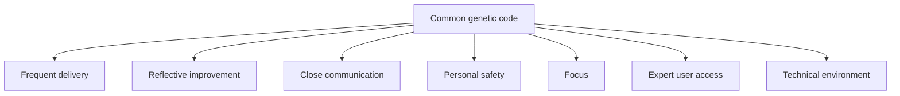

# Crystal Agile Framework explained for the product manager

> Created by **Alistair Cockburn** — [https://www.alistair.cockburn.us](https://www.alistair.cockburn.us)

## Overview

Crystal is not a single process. In [Crystal Clear: A Human-Powered Methodology for Small Teams](https://barnesandnoble.com/w/crystal-clear-alistair-paul-becker/1138695701), Alistair Cockburn describes Crystal as "a family of methodologies with a common genetic code, one that emphasizes frequent delivery, close communication and reflective improvement," and states plainly that "There is no one Crystal methodology." The family adapts to the project type instead of prescribing one universal lifecycle, according to [the same book](https://barnesandnoble.com/w/crystal-clear-alistair-paul-becker/1138695701). Its emphasis stays on people, communication, frequent delivery and learning, with practices selected for the project rather than followed mechanically, as Cockburn's chapter on the Crystal methodologies sets out. For a product manager, that means the team, not a rulebook, decides how much ceremony a project needs, and the product manager's job is to keep users, feedback and priorities close to the people building the software.

Cockburn created the family, and his biography lists Agile Software Development in 2001 and Crystal Clear in 2005. Publisher records disagree on that date: [Barnes & Noble](https://barnesandnoble.com/w/crystal-clear-alistair-paul-becker/1138695701) and [Amazon UK](https://amazon.co.uk/Crystal-Clear-Human-Powered-Methodology-Small/dp/0201699478) give Addison-Wesley's release as October 19, 2004, while [Cockburn's homepage](https://alistaircockburn.com) dates it to 2003 ([source](https://amazon.co.uk/Crystal-Clear-Human-Powered-Methodology-Small/dp/0201699478)). The book was described as [carefully researched over ten years](https://barnesandnoble.com/w/crystal-clear-alistair-paul-becker/1138695701), and one practitioner source traces Crystal to [mid-1990s research at IBM](https://tms-outsource.com/blog/posts/scrum-vs-crystal-methodology). The sources here do not show a Crystal paper or talk earlier than the book. Cockburn's later treatment covers Crystal Clear, Crystal Orange, Crystal Orange Web and stretching Clear to Crystal Yellow, and the colors represent different team and project conditions, not stages of one mandatory lifecycle.

The [seven properties listed for Crystal](https://barnesandnoble.com/w/crystal-clear-alistair-paul-becker/1138695701) are frequent delivery, reflective improvement, close communication, personal safety, focus, easy access to expert users, and a technical environment with automated testing, configuration management and frequent integration. The same book calls personal safety [the first step in trust](https://barnesandnoble.com/w/crystal-clear-alistair-paul-becker/1138695701).

Each property has its own skill page: [implementing frequent delivery cycles](https://tryhamster.com/skills/implementing-frequent-delivery-cycles), [running reflection workshops](https://tryhamster.com/skills/running-reflection-workshops), [facilitating osmotic communication](https://tryhamster.com/skills/facilitating-osmotic-communication), [establishing personal safety](https://tryhamster.com/skills/establishing-personal-safety-in-teams), [designing technical environments for focus](https://tryhamster.com/skills/designing-technical-environments-for-focus) (which covers both focus and the technical environment) and [integrating expert user access](https://tryhamster.com/skills/integrating-expert-user-access). Two further skills cover [selecting a Crystal color variant](https://tryhamster.com/skills/selecting-crystal-color-variant) and [tailoring processes to team context](https://tryhamster.com/skills/tailoring-processes-to-team-context).

For example, a [2024 comparison of agile methods](https://pdfs.semanticscholar.org/57b4/6f23ff3328f09661d83ef1f590536c323e90.pdf) places Crystal among its peers as follows.

| Method  | Team size | Teams | Volatility | Distributed | Source                                                                                       |
| ------- | --------- | ----- | ---------- | ----------- | -------------------------------------------------------------------------------------------- |
| XP      | 3-16      | 1     | High       | No          | [comparison](https://pdfs.semanticscholar.org/57b4/6f23ff3328f09661d83ef1f590536c323e90.pdf) |
| Scrum   | 5-9       | 1-4   | High       | No          | [comparison](https://pdfs.semanticscholar.org/57b4/6f23ff3328f09661d83ef1f590536c323e90.pdf) |
| DSDM    | 2-6       | 1-6   | Low        | Yes         | [comparison](https://pdfs.semanticscholar.org/57b4/6f23ff3328f09661d83ef1f590536c323e90.pdf) |
| Crystal | 4-8       | 1-10  | High       | Yes         | [comparison](https://pdfs.semanticscholar.org/57b4/6f23ff3328f09661d83ef1f590536c323e90.pdf) |
| FDD     | 6-15      | 1-3   | Low        | Yes         | [comparison](https://pdfs.semanticscholar.org/57b4/6f23ff3328f09661d83ef1f590536c323e90.pdf) |

The distribution column conflicts with other sources: a DiVA thesis reports that Cockburn considered Crystal most useful for co-located teams. A [2020 security-practice evaluation](https://scitepress.org/Papers/2020/93564/93564.pdf) scored Crystal's agility at 0.70 against 0.53 for DSDM, but that measures coverage of criteria, not delivery success.

The outcome evidence is thin. The [Dybå and Dingsøyr systematic review](https://scirp.org/pdf/JCC_2017033115471602.pdf) covered 36 empirical studies from 2001 to 2005, and the [review itself](https://citeseerx.ist.psu.edu/document?repid=rep1\&type=pdf\&doi=652db5cfe6f3c217710f40b62800d878a2183016) grouped them into adoption, human and social factors, perceptions and comparisons, without large controlled trials of Crystal. Adoption is small: one [empirical survey](https://research.ijcaonline.org/volume84/number8/pxc3892832.pdf) found Scrum at 47%, XP at 26%, DSDM at 7% and the Crystal family at 1%, while a practitioner source cites [around 7% using Crystal or a hybrid](https://tms-outsource.com/blog/posts/scrum-vs-crystal-methodology) in a 2024 ([source](https://research.ijcaonline.org/volume84/number8/pxc3892832.pdf)) survey.

The documented limits are specific. According to the DiVA thesis, Crystal does not cover life-critical projects because it lacks enough validation elements, Crystal Clear assumes one team in one office, and Crystal Orange suits up to 40 people but lacks sub-team structure and verification activities. The broader criticism that agile methods struggle with [criticality, reliability and safety requirements](https://cs.umd.edu/~mvz/pub/agile.pdf) applies too. Remote channels are the open question: practitioner guidance treats [physical proximity and shared space](https://projectmanagementformula.com/crystal-agile-methodology) as the normal basis for overhearing. A shared workspace such as Hamster Studio can make work visible to a distributed team, but treat any remote setup as a substitute you must test, not an equivalent.

## Core Principles

### People and interactions before process

Crystal's core emphasis is on people, communication, frequent delivery and learning, with practices selected or adapted to the project. Cockburn's own framing is that [there is no one Crystal methodology](https://barnesandnoble.com/w/crystal-clear-alistair-paul-becker/1138695701). The reasoning is that skilled people talking directly will outperform a heavier process they only half follow. If your team is filling in artifacts nobody reads, the principle has been lost.

### Deliver usable software on a steady rhythm

Frequent delivery means running, tested, usable software reaching real users, not a demo. Published intervals vary: Cockburn's Crystal talk says every month or two, while [another Cockburn presentation](https://uxhh.de/roundtable/archiv/_media/2008/HO08-21_CockburnAlistairASD.pdf) says every two to four months. Pick the shortest interval at which your team can ship something genuinely usable. When users have not touched a new increment in a long stretch, feedback has stalled.

### Reflect and change the way you work

Reflective improvement is one of the three genetic-code properties in [Crystal Clear](https://barnesandnoble.com/w/crystal-clear-alistair-paul-becker/1138695701). Cockburn's talk describes the reflection workshop as taking an hour a month and stresses using the ideas it produces. The value comes from changed conventions, not from the meeting itself. A workshop whose action list never alters the next cycle is a warning sign.

### Let information travel by proximity

Close or osmotic communication lets people overhear relevant discussion instead of routing everything through handoffs. Practitioner guidance frames co-location as a way to [answer questions quickly and surface problems sooner](https://projectmanagementformula.com/crystal-agile-methodology). That benefit depends on shared space, which is why Cockburn's model favoured co-located teams. Balance it with quiet periods so ambient awareness does not destroy concentration.

### Personal safety is the first step in trust

Crystal describes personal safety as [the first step in trust](https://barnesandnoble.com/w/crystal-clear-alistair-paul-becker/1138695701). People who fear reprisal will not report bad news, so every other property degrades without it. Reflection workshops turn polite and delivery problems stay hidden until late. A product manager can model safety by treating an honest status report as useful information rather than a failure.

### Protect focus and the technical base

Focus and a technical environment with [automated testing, configuration management and frequent integration](https://barnesandnoble.com/w/crystal-clear-alistair-paul-becker/1138695701) are part of the seven properties. One Crystal checklist asks whether each person knows their top two priorities and has [two consecutive days with two uninterrupted hours a day](https://scribd.com/document/95144672/Agile-2007) to work on them. Constant reprioritisation by a product manager directly breaks this property. Keep the priority list stable within a cycle.

### Scale ceremony to size and criticality

Crystal variants scale their practices by [team size and project criticality](https://projectmanagementformula.com/crystal-agile-methodology). The colors represent different conditions, from Crystal Clear to Orange and Yellow, rather than a sequence every team must pass through. Bigger or more critical projects need more structure, and small low-risk ones need less. Choosing too heavy a variant wastes effort, while too light a variant leaves risk unmanaged.

## Steps

1. **Assess team size and criticality**
   Start by mapping how many people are on the project and what a failure would cost, because Crystal variants [scale practices by size and criticality](https://projectmanagementformula.com/crystal-agile-methodology). Count people who work on the product daily, not everyone on the distribution list. Rate criticality honestly, from lost comfort up to lost money or safety. If the answer is life-critical, stop here and choose a method with stronger validation.

   The output is a short written statement of size, criticality and location.

2. **Select a Crystal variant**
   Use the assessment to pick a color, following the [selecting a Crystal color variant](https://tryhamster.com/skills/selecting-crystal-color-variant) skill. Cockburn's later work discusses Crystal Clear, Orange, Orange Web and Yellow as variants for different conditions. Lean toward the lightest variant that still covers your risk. The decision is reversible, so record why you chose it and what would make you switch.

3. **Shape the methodology**
   Agree which practices the team will use and which it will drop. Crystal Clear lists [methodology shaping as its first technique](https://pearson.de/media/muster/toc/toc_9780321349682.pdf), ahead of reflection workshops and blitz planning. Interview the team about what worked on past projects and write down a few starting conventions. Keep the list short enough that everyone remembers it.

   The [tailoring processes to team context](https://tryhamster.com/skills/tailoring-processes-to-team-context) skill covers this in depth.

4. **Set the delivery rhythm**
   Choose a cadence that produces running, tested, usable software each cycle. Practitioner guidance says teams should deliver to real users [at least every two months, ideally more frequently](https://projectmanagementformula.com/crystal-agile-methodology). As a product manager, slice scope so each cycle ends with something a user can actually try. If production delivery is blocked, plan a fallback before the first cycle ends.

   See [implementing frequent delivery cycles](https://tryhamster.com/skills/implementing-frequent-delivery-cycles) for cadence choices.

5. **Secure communication and expert access**
   Arrange the workspace for overhearing and line up a real expert user who can answer questions during development. Crystal guidance describes the expert as [an actual user, not a tester from the development team](https://en.wikiversity.org/wiki/Crystal_Methods). Book recurring time with that person rather than relying on ad hoc favours. Protect quiet periods too, so communication does not consume focus.

   The skill pages on [osmotic communication](https://tryhamster.com/skills/facilitating-osmotic-communication) and [expert user access](https://tryhamster.com/skills/integrating-expert-user-access) give the detail.

6. **Reflect and adjust**
   Hold a reflection workshop on a regular schedule, which Cockburn describes as an hour a month. Ask what to keep, what to change and what to try next. Turn each agreed change into a named action with an owner. Review those actions at the next workshop to see whether they stuck.

   The [running reflection workshops](https://tryhamster.com/skills/running-reflection-workshops) skill provides a facilitation format.

## When to Use

- A small, trusted product team sits together and wants minimal process, because Crystal Clear was written for [small teams](https://barnesandnoble.com/w/crystal-clear-alistair-paul-becker/1138695701) and relies on people rather than scaffolding.
- Requirements change often and you need a method rated for [high volatility](https://pdfs.semanticscholar.org/57b4/6f23ff3328f09661d83ef1f590536c323e90.pdf), since Crystal's frequent delivery and reflection absorb change without heavy replanning.
- Your team has outgrown a rigid framework's ceremonies and wants to keep only the practices that earn their place, because Crystal expects practices to be tailored rather than followed mechanically.
- You can give developers regular access to a real expert user, which Crystal treats as a core property and which makes short feedback loops practical.
- Leadership wants to improve how the team works from its own experience, since monthly reflection gives a lightweight, repeatable place to change conventions.

## When Not to Use

- The system is life-critical, because Crystal is documented as not covering life-critical projects due to insufficient validation elements.
- The team is fully distributed with no plan to replace overhearing, since Cockburn's model considered Crystal most useful for co-located teams.
- You need a large, multi-team structure with defined sub-teams, because Crystal Orange is described as lacking sub-team structure and design and code verification activities.
- The organisation needs a widely known playbook, shared vocabulary and easy hiring, because Crystal's reported adoption is [far below Scrum and XP](https://research.ijcaonline.org/volume84/number8/pxc3892832.pdf).

## Skills

This method includes the following skills:

- [Selecting the Right Crystal Color Variant for Your Team](skills/selecting-crystal-color-variant/SKILL.md) — How to assess team size, project criticality, and priorities to choose the appropriate Crystal variant \(Clear, Yellow, Orange, or Red\).
- [Implementing Frequent Delivery Cycles in Crystal Projects](skills/implementing-frequent-delivery-cycles/SKILL.md) — How to plan and execute short, regular delivery increments to get working software to users quickly and incorporate feedback continuously.
- [Designing Technical Environments That Support Team Focus](skills/designing-technical-environments-for-focus/SKILL.md) — How to configure workspaces, tools, and automated testing/integration infrastructure to minimize distractions and maximize sustained developer focus and productivity.
- [Facilitating Osmotic Communication in Agile Teams](skills/facilitating-osmotic-communication/SKILL.md) — How to design team environments and communication practices so that information flows passively to team members through proximity and ambient awareness.
- [Integrating Expert User Access into Development Workflow](skills/integrating-expert-user-access/SKILL.md) — How to establish and maintain direct, ongoing access to real expert users so the team can validate requirements, test assumptions, and refine features collaboratively.
- [Tailoring Agile Processes to Your Specific Team Context](skills/tailoring-processes-to-team-context/SKILL.md) — How to apply Crystal's methodology-tuning principles to strip away unnecessary process overhead and adopt only the practices that fit your team's unique situation.
- [Establishing Personal Safety for Honest Team Collaboration](skills/establishing-personal-safety-in-teams/SKILL.md) — How to create a psychologically safe environment where team members feel comfortable raising concerns, admitting mistakes, and providing candid feedback.
- [Running Reflective Improvement Workshops in Crystal](skills/running-reflection-workshops/SKILL.md) — How to conduct structured reflection workshops where teams identify what is working, what needs adjustment, and commit to specific process improvements each iteration.

## FAQ

**Is Crystal a framework or a family of methods?**

It is a family. Cockburn describes Crystal as [a family of methodologies with a common genetic code](https://barnesandnoble.com/w/crystal-clear-alistair-paul-becker/1138695701) and says there is no single Crystal methodology. Each color variant fits different team and project conditions. People call it the Crystal Agile Framework for convenience, but in practice you adopt one variant and tailor it.

**How does Crystal differ from Scrum?**

Scrum defines roles, events and artifacts, while Crystal defines properties and leaves practice choice to the team. A [2024 comparison](https://pdfs.semanticscholar.org/57b4/6f23ff3328f09661d83ef1f590536c323e90.pdf) lists Scrum teams at 5-9 people and Crystal teams at 4-8, with both rated for high volatility. Scrum is also far more widely used, at 47% versus 1% for Crystal in [one survey](https://research.ijcaonline.org/volume84/number8/pxc3892832.pdf). Choose Crystal if you want less prescribed structure and trust the team to shape its own process.

**What does a product manager do on a Crystal team?**

Crystal does not define a product manager role, so the work maps onto its properties. You keep priorities stable enough to protect focus, slice scope so each cycle delivers usable software, and secure regular access to a real expert user. You also take part in reflection workshops and act on what they surface. If you are the main channel to users, make sure you are not becoming a bottleneck that replaces direct expert access.

**Can Crystal work for remote teams?**

Sources disagree. For example, a [2024 comparison](https://pdfs.semanticscholar.org/57b4/6f23ff3328f09661d83ef1f590536c323e90.pdf) marks Crystal as supporting distributed teams, while a DiVA thesis reports Cockburn considered it most useful for co-located teams. Practitioner guidance treats [physical proximity](https://projectmanagementformula.com/crystal-agile-methodology) as the normal basis for osmotic communication. If you go remote, design deliberate replacements for overhearing and check in reflection workshops whether they work.

**Is there evidence that Crystal works?**

Not much that is Crystal-specific. The [Dybå and Dingsøyr review](https://scirp.org/pdf/JCC_2017033115471602.pdf) of 36 studies from 2001 to 2005 looked at agile methods broadly rather than running controlled evaluations of Crystal. A [2020 evaluation](https://scitepress.org/Papers/2020/93564/93564.pdf) rated Crystal highly on agility criteria, but that measures framework coverage, not project success. Treat claims that Crystal outperforms Scrum or XP with caution.

**When was Crystal first published?**

Publisher records give October 19, 2004 for [Crystal Clear from Addison-Wesley](https://amazon.co.uk/Crystal-Clear-Human-Powered-Methodology-Small/dp/0201699478). [Cockburn's biography](https://alistaircockburn.com/Bio) lists the book under 2005, and [his homepage](https://alistaircockburn.com) says 2003. A practitioner source places its origins in [mid-1990s research at IBM](https://tms-outsource.com/blog/posts/scrum-vs-crystal-methodology). The sources here do not identify an earlier Crystal-specific paper.

**What are Crystal's main weaknesses?**

It is documented as unsuitable for life-critical systems and as best suited to co-located teams. Crystal Orange lacks sub-team structure and verification activities according to the same source. Its low adoption also means fewer practitioners and less shared vocabulary than Scrum. Some teams find it too light when they need external scaffolding.

## Sources

- [Crystal Clear: A Human-Powered Methodology for Small Teams\|eBook](https://barnesandnoble.com/w/crystal-clear-alistair-paul-becker/1138695701)
- [Crystal Clear: A Human-Powered Methodology for Small Teams Paperback – 19 Oct. 2004](https://amazon.co.uk/Crystal-Clear-Human-Powered-Methodology-Small/dp/0201699478)
- [Bio](https://alistaircockburn.com/Bio)
- [AlistairCockburn](https://alistaircockburn.com)
- [\[PDF\] Agile Software Development Methodologies: Survey of Surveys](https://scirp.org/pdf/JCC_2017033115471602.pdf)
- [Agility of Security Practices and Agile Process Models: An Evaluation](https://scitepress.org/Papers/2020/93564/93564.pdf)
- [\[PDF\] Empirical Findings in Agile Methods](https://cs.umd.edu/~mvz/pub/agile.pdf)
- [An Empirical Study of Agile Software Development](https://research.ijcaonline.org/volume84/number8/pxc3892832.pdf)
- [Effective Implementation of Agile Practices](https://pdfs.semanticscholar.org/57b4/6f23ff3328f09661d83ef1f590536c323e90.pdf)
- [Scrum vs Crystal Methodology: What's the Difference?](https://tms-outsource.com/blog/posts/scrum-vs-crystal-methodology)
- [Crystal Agile Methodology – Project Management Formula](https://projectmanagementformula.com/crystal-agile-methodology)
- [Agile Software Development The Cooperative Game:](https://uxhh.de/roundtable/archiv/_media/2008/HO08-21_CockburnAlistairASD.pdf)
- [Crystal Methods - Wikiversity](https://en.wikiversity.org/wiki/Crystal_Methods)
- [Agile 2007](https://scribd.com/document/95144672/Agile-2007)
- [\[PDF\] Crystal Clear: A Human-Powered Methodology for Small Teams](https://pearson.de/media/muster/toc/toc_9780321349682.pdf)

---

*[Import this method into Hamster](https://tryhamster.com) to share it with your team, customize it for your workflow, and let AI agents use it automatically.*
