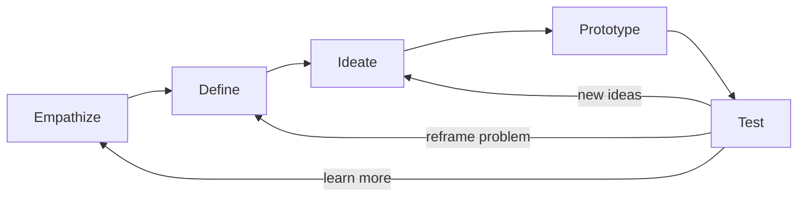

# What Is Design Thinking? Modes, Origins and Evidence

> Created by **Herbert A. Simon, with later development and popularization by IDEO and Stanford d.school** — [https://en.wikipedia.org/wiki/Herbert\_A.\_Simon](https://en.wikipedia.org/wiki/Herbert_A._Simon)

## Overview

Design Thinking is a human-centered, collaborative and iterative way of working on complex problems, using the methods designers use to understand people and shape solutions. [IDEO states plainly that there is no one definition of design thinking](https://designthinking.ideo.com/faq/how-do-people-define-design-thinking) and describes it as a set of mindsets and design-based activities that foster the collaboration needed to solve problems in human-centered ways. The most quoted version comes from IDEO's Tim Brown, who calls it [a human-centered approach to innovation that draws from the designer's toolkit to integrate the needs of people, the possibilities of technology, and the requirements for business success](https://designthinking.ideo.com/faq/how-do-people-define-design-thinking). IDEO compresses that into three tests a solution must pass: [desirable for people, feasible with technology and viable for the organization](https://designthinking.ideo.com).

The method has no single inventor. [Herbert A. Simon was the first to mention design as a way of thinking in his 1969 book, The Sciences of the Artificial](https://ixdf.org/literature/article/design-thinking-get-a-quick-overview-of-the-history), and through the 1970s he contributed ideas now regarded as principles of design thinking. A review of early design research places Simon's book alongside other foundational works in design methodology and notes that Simon's approach sought to formalize design through engineering, rational problem-solving and human psychology. Simon's definition, "Everyone designs who devises courses of action aimed at changing existing situations into preferred ones," treated design as any intentional change, not just the making of objects. The contemporary version moved that theory into practice. Tim Brown's [Change by Design](https://ideo.com/journal/change-by-design) presented design thinking to business readers as a collaborative process for matching people's needs with what is technically feasible and a viable business strategy, and [a CCA conversation about the book](https://cca.edu/newsroom/ideo-tim-brown-change-by-design) sums up its inspiration, ideation and implementation cycle.

Stanford's d.school gave the method its best-known classroom shape. [The d.school identifies five modes](https://dschool.stanford.edu/tools/design-thinking-bootleg): Empathize, Define, Ideate, Prototype and Test. In Empathize, the team studies the people affected, and [the d.school's bootleg deck calls empathy the foundation of human-centered design](https://dschool.sfo3.digitaloceanspaces.com/documents/dschool_bootleg_deck_2018_final_sm2-6.pdf) because the problems you solve are rarely your own. Define synthesizes that research into a clear problem. Ideate goes wide on radical alternatives. Prototype makes ideas tangible, from an object to a role-play, and Test puts prototypes in front of users to refine both the solution and the team's grasp of the problem. The modes are not a checklist. [The d.school itself argues against talking about THE design process](https://dschool.stanford.edu/stories/lets-stop-talking-about-the-design-process), noting that intro workshops rush a linear five-step sequence in about 90 minutes, and [IxDF describes the phases as non-linear and iterative](https://ixdf.org/literature/topics/design-thinking).

The closest alternative is the UK Design Council's Double Diamond. [Its history](https://designcouncil.org.uk/resources/the-double-diamond/history-of-the-double-diamond) describes four phases, Discover, Define, Develop and Deliver, chosen as a deliberately memorable device. [The Design Council's framework](https://designcouncil.org.uk/resources/framework-for-innovation) treats each diamond as divergent exploration followed by convergent action, and its first diamond exists to help people understand, rather than simply assume, what the problem is. The two map closely: Discover and Define cover Empathize and Define, Develop covers Ideate, Prototype and Test, and Deliver covers the implementation that the d.school modes leave implicit. Reach for the Double Diamond when stakeholders need the diverge and converge rhythm made explicit, and for the d.school modes when a team needs named activities it can practice.

The evidence is real but uneven. Most studies measure short-term, perceived or educational outcomes rather than market results.

| Source                                                                                                                                                       | Sample                          | Main finding                                                 | Limitation                             |
| ------------------------------------------------------------------------------------------------------------------------------------------------------------ | ------------------------------- | ------------------------------------------------------------ | -------------------------------------- |
| [Engineering education review, 2026](https://tandfonline.com/doi/full/10.1080/03043797.2026.2640060)                                                         | Review of 76 studies, 2003-2023 | Strongest evidence for engagement, motivation, self-efficacy | Weakest evidence for long-term effects |
| [Pedagogy review, 2026](https://link.springer.com/article/10.1007/s44217-026-02088-3?error=cookies_not_supported\&code=558aa8d4-ddc5-41a8-95ae-322719c549ee) | Review of studies            | Linked to motivation, collaboration, creativity              | Reported associations only             |
| [K-12 review, 2022](https://oamonitor.ireland.openaire.eu/rfo/sfi_rfo/search/publication?pid=10.3390/app12168077)                                            | Review of 43 papers             | Great educational potential                                  | Empirical support still limited        |
| [Theory review, 2025](https://onlinelibrary.wiley.com/doi/full/10.1111/caim.12626)                                                                           | Review of 69 articles           | Four mechanisms, including reframing                         | Explains impact, does not measure it   |
| [Global organizational study](https://publishup.uni-potsdam.de/files/53466/design_thinking_study.pdf)                                                        | Survey respondents              | Better team culture for 71%, faster innovation for 69%       | Perceived, not causal ([source](https://publishup.uni-potsdam.de/files/53466/design_thinking_study.pdf)) |
| [Practitioner survey, 2026](https://designsprintx.com/articles/is-design-thinking-dead-in-2026)                                                              | Survey of 100 practitioners     | Still relevant for 85%                                       | Only 12% reliably ship session output ([source](https://designsprintx.com/articles/is-design-thinking-dead-in-2026)) |

Read these figures carefully. [The organizational study asked respondents about perceived impact](https://publishup.uni-potsdam.de/files/53466/design_thinking_study.pdf), so its percentages are self-reports, not controlled comparisons, and [the engineering review](https://tandfonline.com/doi/full/10.1080/03043797.2026.2640060) ([source](https://publishup.uni-potsdam.de/files/53466/design_thinking_study.pdf)) examined differing implementation strategies and core elements, which makes studies hard to compare. The sources establish no accepted success rate against Agile, Lean Startup or traditional R\&D, so treat any such headline with suspicion. The same discipline belongs inside a project: [the d.school describes synthesis](https://dschool.stanford.edu/stories/lets-stop-talking-about-the-design-process) as frameworks, maps and abductive thinking, so keep observed behavior in the research record and hold explanations of why it happened as interpretations still to test. Hamster Studio teams can keep research notes, insights and test results side by side in one shared workspace so that line stays visible.

## Core Principles

### Start with the people who have the problem

The team's own assumptions are the least reliable input, because [the problems you are solving are rarely your own](https://dschool.sfo3.digitaloceanspaces.com/documents/dschool_bootleg_deck_2018_final_sm2-6.pdf). Research means observing and talking with the people affected, in their context, before proposing anything. If the first artifact a team produces is a solution sketch rather than notes about users, this principle has been skipped.

### Pass all three tests, not just one

A good solution is [desirable for people, feasible with technology and viable for the organization](https://designthinking.ideo.com). Users loving a concept does not make it buildable or sustainable, and a profitable idea nobody wants fails too. Evaluate candidates against all three lenses together so trade-offs surface early instead of at launch.

### Reframe the problem before solving it

The Define mode exists because the first statement of a problem is usually a symptom or a disguised solution. [A 2025 review of 69 articles](https://onlinelibrary.wiley.com/doi/full/10.1111/caim.12626) names reframing as one of four mechanisms through which the method may create impact. A useful frame names a specific user, a need and an insight that shifts the team's perspective.

### Diverge before you converge

Generating options and choosing between them are different activities, and [separating idea generation from idea selection strengthens both](https://hci.stanford.edu/courses/cs247/2011/readings/dschool-brainstorming.pdf). Judging ideas as they appear kills the unusual ones that often lead somewhere. Hold a clear boundary between the wide phase and the narrowing phase, and announce when you cross it.

### Make ideas tangible early

A prototype turns an argument into something people can react to, and [the d.school counts a role-play or an object](https://dschool.sfo3.digitaloceanspaces.com/documents/dschool_bootleg_deck_2018_final_sm2-6.pdf) as a prototype alongside more familiar forms. Rough and cheap is the point, because it keeps the team willing to throw weak ideas away. When a team spends weeks polishing before anyone outside sees it, learning has stalled.

### Move between modes as evidence demands

[The d.school cautions against treating design as one fixed process](https://dschool.stanford.edu/stories/lets-stop-talking-about-the-design-process), and [IxDF calls the phases non-linear and iterative](https://ixdf.org/literature/topics/design-thinking). A failed test might send you back to Define because the problem was wrong, or to Empathize because you misread users. Running the five modes once, in order, and calling it done is the most common way the method degrades into theater.

### Keep evidence separate from interpretation

Synthesis relies on [frameworks, maps and abductive thinking](https://dschool.stanford.edu/stories/lets-stop-talking-about-the-design-process), which means reasoning to the most plausible explanation. That explanation is a hypothesis, not a finding. Record what people did and said apart from why you think they did it, so later tests can confirm or overturn the interpretation.

## Steps

1. **Empathize with the people affected**
   Observe and interview the people who experience the problem, ideally in the setting where it happens. Capture quotes, behaviors, workarounds and emotional moments rather than feature requests. Include people at the edges, not just typical users, because extremes reveal needs the average hides. The output is a research record of what you saw and heard.

   If your notes are mostly opinions about what users should want, go back into the field.

2. **Synthesize and define the problem**
   Cluster observations into patterns, then interpret those patterns into insights about needs, as covered in [synthesizing user insights](https://tryhamster.com/skills/synthesizing-user-insights). Choose the insight that most shifts the team's perspective and write a point-of-view statement naming a specific user, their need and that insight; see [framing human-centered problems](https://tryhamster.com/skills/framing-human-centered-problems). Turn the statement into a focused prompt such as a How Might We question. The frame is wrong if it smuggles in a solution or describes a generic customer.

3. **Ideate widely**
   Run a time-boxed session that aims for many varied ideas and defers judgment, following the practices in [generating divergent ideas](https://tryhamster.com/skills/generating-divergent-ideas). Invite people from different functions and look for inspiration from other domains. Capture every idea visibly, including the absurd ones. Only after generation stops should the group select a handful of promising directions to prototype.

4. **Prototype cheaply**
   Turn the selected ideas into rough artifacts that someone else can use or react to: paper screens, a storyboard, a role-played service, a cardboard object. Build only what the question you are testing requires, as described in [building rapid prototypes](https://tryhamster.com/skills/building-rapid-prototypes). Make more than one version where you can, so users compare rather than just approve. If building takes longer than testing, you are over-investing.

5. **Test with real users**
   Put the prototype in users' hands, or put users in the prototype, and give only the context they need to start. Watch what they do before asking what they think, because behavior is more reliable than stated preference. Record what worked, what confused people and what surprised the team. Evaluate surviving concepts against desirability, feasibility and viability together, using [balancing desirability, feasibility, and viability](https://tryhamster.com/skills/balancing-desirability-feasibility-and-viability).

6. **Loop back or move to implementation**
   Decide from the test evidence where to go next: refine the prototype, generate new ideas, reframe the problem or return to research. [Iterating from evidence](https://tryhamster.com/skills/iterating-from-evidence) covers how to make that call deliberately. When a concept has passed tests on all three lenses, turn it into a concrete plan with an owner, scope and timeline. A cycle that ends in a presentation with no owner has not finished.

## When to Use

- The problem is ill-defined or contested, because the method is built to challenge assumptions and redefine the problem before committing to a solution.
- You are designing a new product, service or experience for people whose lives and constraints the team does not share, so direct research will correct blind spots.
- Several functions (design, engineering, business) must agree on a direction, because the desirability, feasibility and viability lenses give them a shared vocabulary for trade-offs.
- Early concepts can be tested cheaply with paper, role-play or mockups before significant investment, which lets you learn fast and discard bad ideas.
- A team keeps shipping features that users ignore, a sign that the problem framing rather than the execution is failing.

## When Not to Use

- The problem is well-understood and the solution is known, such as a routine compliance update, where research and ideation add cost without changing the answer.
- An emergency requires immediate action, because the method's research and iteration loops assume time to learn before committing.
- You have no access to real users and no way to get it, since empathy and testing are the core inputs and substituting team opinion defeats the purpose.
- Nobody owns implementation after the workshop, since [only 12% of surveyed teams reliably ship what their design sessions produce](https://designsprintx.com/articles/is-design-thinking-dead-in-2026) and without an owner the output becomes a wall of sticky notes.

## Skills

This method includes the following skills:

- [Generating Divergent Ideas](skills/generating-divergent-ideas/SKILL.md) — Learn to produce many varied solution concepts using brainstorming, ideation prompts, analogies, and collaborative co-creation before narrowing the field.
- [Building Rapid Prototypes](skills/building-rapid-prototypes/SKILL.md) — Learn to create quick, low-cost representations of ideas such as sketches, storyboards, role-plays, and mock-ups for exploration and communication.
- [Balancing Desirability, Feasibility, and Viability](skills/balancing-desirability-feasibility-and-viability/SKILL.md) — Learn to evaluate ideas across human desirability, technical feasibility, and business viability to ensure well-rounded, sustainable solutions.
- [Iterating from Evidence](skills/iterating-from-evidence/SKILL.md) — Learn to use test results and new discoveries to revise prototypes, reframe the problem, abandon weak assumptions, and move flexibly between Design Thinking modes.
- [Synthesizing User Insights](skills/synthesizing-user-insights/SKILL.md) — Learn to organize qualitative evidence, identify patterns, distinguish observations from assumptions, and turn raw research findings into actionable insights.
- [Framing Human-Centered Problems](skills/framing-human-centered-problems/SKILL.md) — Learn to define the underlying challenge as a focused problem statement or point of view rather than prematurely jumping to solutions.

## FAQ

**Who invented Design Thinking?**

No single person did. [Herbert A. Simon first described design as a way of thinking in his 1969 book The Sciences of the Artificial](https://ixdf.org/literature/article/design-thinking-get-a-quick-overview-of-the-history), and IDEO and Stanford's d.school later developed the practical versions most teams use today. Tim Brown's [Change by Design](https://ideo.com/journal/change-by-design) was especially influential with business audiences.

**What are the five stages of Design Thinking?**

[Stanford's d.school names five modes](https://dschool.stanford.edu/tools/design-thinking-bootleg): Empathize, Define, Ideate, Prototype and Test. The d.school deliberately calls them modes rather than stages. Teams move between them as they learn, for example returning to Define when a test shows the problem was framed wrongly.

**Is Design Thinking the same as human-centered design?**

They overlap heavily, and IDEO treats them as closely related. [IDEO describes human-centered design](https://designthinking.ideo.com/faq/whats-the-difference-between-human-centered-design-and-design-thinking) as a process that starts with the people you are designing with and ends with solutions built for their needs. Design Thinking adds explicit weight on technical feasibility and business viability alongside that human focus.

**How is Design Thinking different from the Double Diamond?**

The Double Diamond uses [four phases, Discover, Define, Develop and Deliver](https://designcouncil.org.uk/resources/the-double-diamond/history-of-the-double-diamond), and makes the alternation between divergent and convergent thinking its central visual idea. The d.school modes instead name concrete activities such as prototyping and testing. The two cover similar ground, and the Double Diamond is more explicit about delivery.

**Does Design Thinking actually work?**

The evidence is strongest for short-term outcomes. [A 2026 review of 76 engineering education studies](https://tandfonline.com/doi/full/10.1080/03043797.2026.2640060) found the strongest support for engagement, motivation and self-efficacy and the weakest for long-term effects. Organizational figures, such as [71% of respondents reporting improved team culture](https://publishup.uni-potsdam.de/files/53466/design_thinking_study.pdf), are perceptions rather than controlled comparisons.

**Is Design Thinking dead?**

Practitioners do not think so, but they want it to change. In [a 2026 survey of 100 practitioners](https://designsprintx.com/articles/is-design-thinking-dead-in-2026), 85% called it still relevant, 52% said it needs to evolve, 56% said their teams use it selectively and 21% ([source](https://designsprintx.com/articles/is-design-thinking-dead-in-2026)) use it religiously. The bigger problem that survey flags is follow-through, since few teams reliably ship what their sessions produce.

**How long does a Design Thinking project take?**

It depends on the problem, and the sources set no standard duration. [The d.school notes that intro workshops](https://dschool.stanford.edu/stories/lets-stop-talking-about-the-design-process) squeeze a linear pass through all five modes into about 90 minutes, which is a teaching exercise rather than a real project. Real work loops through the modes repeatedly until a concept survives testing.

## Sources

- [Change By Design - IDEO](https://ideo.com/journal/change-by-design)
- [Design Thinking Bootleg \| Stanford d.school](https://dschool.stanford.edu/tools/design-thinking-bootleg)
- [IDEO's Tim Brown and Barry Katz discuss Change by Design](https://cca.edu/newsroom/ideo-tim-brown-change-by-design)
- [How do people define design thinking? \| IDEO](https://designthinking.ideo.com/faq/how-do-people-define-design-thinking)
- [Let's Stop Talking about THE Design Process \| Stanford d.school](https://dschool.stanford.edu/stories/lets-stop-talking-about-the-design-process)
- [Design Thinking by IDEO: Human-Centered Innovation](https://designthinking.ideo.com)
- [What's the difference between human-centered design and design](https://designthinking.ideo.com/faq/whats-the-difference-between-human-centered-design-and-design-thinking)
- [What is Design Thinking? — updated 2026 \| IxDF](https://ixdf.org/literature/topics/design-thinking)
- [dschool\_bootleg\_deck\_2018\_final\_sm2-6.pdf](https://dschool.sfo3.digitaloceanspaces.com/documents/dschool_bootleg_deck_2018_final_sm2-6.pdf)
- [1987: Design Thinking was](https://ixdf.org/literature/article/design-thinking-get-a-quick-overview-of-the-history)
- [Design Thinking: a Global Study on Implementation Practices in Organizations : Past - Present - Future](https://publishup.uni-potsdam.de/files/53466/design_thinking_study.pdf)
- [Full article: A systematic review of design thinking](https://tandfonline.com/doi/full/10.1080/03043797.2026.2640060)
- [The impact of design thinking and its underlying theoretical](https://onlinelibrary.wiley.com/doi/full/10.1111/caim.12626)
- [A Systematic Review on Design Thinking Integrated Learning in K](https://oamonitor.ireland.openaire.eu/rfo/sfi_rfo/search/publication?pid=10.3390/app12168077)
- [Is design thinking dead in 2026? What 100 practitioners](https://designsprintx.com/articles/is-design-thinking-dead-in-2026)
- [Microsoft Word - dschool-brainstorming.doc - Stanford University](https://hci.stanford.edu/courses/cs247/2011/readings/dschool-brainstorming.pdf)
- [Framework for Innovation](https://designcouncil.org.uk/resources/framework-for-innovation)
- [History of the Double Diamond - Design Council](https://designcouncil.org.uk/resources/the-double-diamond/history-of-the-double-diamond)

---

*[Import this method into Hamster](https://tryhamster.com) to share it with your team, customize it for your workflow, and let AI agents use it automatically.*
