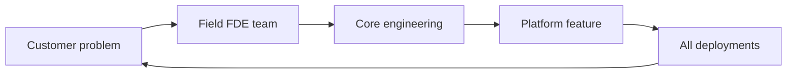

# Forward Deployed Engineer Model: How FDE Works

> Created by **Shyam Sankar** — [https://www.palantir.com/leadership/shyam-sankar/](https://www.palantir.com/leadership/shyam-sankar/)

## Overview

A forward deployed engineer (FDE) is an engineer who works directly inside a customer's operation to understand a messy problem, build software against it in the customer's environment, and stay accountable for whether it works. Palantir's community forum describes the role as [a hybrid of software engineer and consultant who works directly with clients](https://community.palantir.com/t/who-are-palantir-fdes/6847), and Palantir stresses that the point is the verb: Forward Deployed Engineering means [working deeply with customers in the field, signing up for the outcome rather than delivering preexisting components, and feeding lessons back into the core platforms](https://community.palantir.com/t/who-are-palantir-fdes/6847/4). Shyam Sankar summarized the role as one that ["absorbs pain and excretes product"](https://resolve.ai/blog/why-enterprise-ai-needs-forward-deployed-engineers). The distinguishing feature is not proximity alone. It is ownership deep enough that field pain turns into product change.

The model comes from Palantir Technologies. Sankar joined Palantir [in 2006 as employee number 13 and became its first forward deployed engineer](https://meta.com/blog/boz-to-the-future-the-power-of-innovation-heresy-and-fighting-for-the-future-with-palantirs-shyam-sankar), and a 2013 post on the [TED Blog identified him as Director of Forward Deployed Engineering](https://blog.ted.com/tag/shyam-sankar). Palantir says this is how it has [built its platforms since the earliest days of Gotham](https://community.palantir.com/t/who-are-palantir-fdes/6847/4). Public sources do not show that Sankar personally invented the practice, and there is no founding book or paper; the clearest primary documentation is Palantir's own [Architecture Center overview](https://palantir.com/docs/foundry/architecture-center/overview) and community explanations. Over time the idea widened from one role into an organization-wide methodology involving [field teams, core product engineers and internal operations, with FDEs at the tip of the spear](https://community.palantir.com/t/who-are-palantir-fdes/6847/4). Palantir's current description also includes [human-plus-agent collaboration](https://community.palantir.com/t/who-are-palantir-fdes/6847/4), and the role has been [rebranded across the industry as the Agent Engineer and similar titles](https://resolve.ai/blog/why-enterprise-ai-needs-forward-deployed-engineers).

Palantir's Architecture Center calls the practice [the human equivalent of backpropagation](https://palantir.com/docs/foundry/architecture-center/overview): engineers get as close as possible to a problem while working with core engineering teams to synthesize feedback and ship new features. Inside the field team, one practitioner account splits the work into two roles, with [Deployment Strategists focused on the problem space and Forward Deployed Engineers building in the solution space](https://forwarddeployedbook.com/chapter-3). The handoff between them is where engagements succeed or stall, so a useful anchor is to [choose one high-value outcome and define its success metric before building](https://blockchain-council.org/ai/forward-deployed-engineering-playbook-best-practices-shipping-fast-enterprise). That turns the strategist's framing into a target the engineer can test against, and it gives both sides a shared way to tell whether the deployment worked. SVPG describes the same core: send [empowered engineers to spend intense time embedded with customers](https://svpg.com/forward-deployed-engineers) so they can discover a solution that achieves the necessary outcome.

FDE is easy to confuse with adjacent customer-facing roles. Practitioner guides from [Netguru](https://netguru.com/blog/forward-deployed-engineer-role-guide) and [Magma](https://magmainc.ca/guides/forward-deployed-engineering-model) draw the line at output and ownership: the FDE writes and owns production code in the customer environment, while the other roles produce designs, demos, recommendations or scoped tickets. Engagement length is only documented for some roles, so treat blank cells as unknown rather than comparable.

| Role | Primary output | Ownership | Engagement length | Source |
|---|---|---|---|---|
| Forward deployed engineer | Working production system | Owns deployed code | Weeks to months | [Netguru](https://netguru.com/blog/forward-deployed-engineer-role-guide) |
| Solutions architect | Design or recommendation | Owns the design | Not documented | [Magma](https://magmainc.ca/guides/forward-deployed-engineering-model) |
| Sales engineer | Demo or won deal | Owns the technical win | Not documented | [Netguru](https://netguru.com/blog/forward-deployed-engineer-role-guide) |
| Management consultant | Report or roadmap | Owns recommendations | Typically fixed | [Netguru](https://netguru.com/blog/forward-deployed-engineer-role-guide) |
| Staff augmentation | Scoped tickets | Client directs work | Potentially open-ended | [Netguru](https://netguru.com/blog/forward-deployed-engineer-role-guide) |

The evidence is mostly operational and anecdotal. Palantir's Q1 2026 release reported [85% year-over-year revenue growth, 84% growth in U.S. government revenue and 133% growth in U.S. commercial revenue](https://marktechpost.com/2026/05/20/what-is-a-forward-deployed-engineer-the-ai-role-openai-anthropic-and-google-are-hiring-in-2026), which one article reads as support for the embedded model, though it also notes critics' view that [FDE looked too expensive and did not scale like pure SaaS](https://marktechpost.com/2026/05/20/what-is-a-forward-deployed-engineer-the-ai-role-openai-anthropic-and-google-are-hiring-in-2026). Demand is rising: one report counts [a 729% rise in FDE postings on Indeed in the first half of 2026](https://forbes.com/sites/gelilabekele/2026/09/04/ai-deployment-and-the-forward-deployed-engineering-model), though its survey of 180 companies has no published methodology. Broader AI data cuts the other way, with an MIT Media Lab report cited as finding [95% of generative AI pilots fail to deliver business value](https://forbes.com/sites/stevebanker/2026/07/10/palantir-and-forward-deployed-engineering-what-should-we-believe) and an IBM CEO study reporting [only 16% of AI initiatives scaled enterprise-wide](https://appinventiv.com/blog/how-forward-deployed-engineers-accelerate-ai); neither measures FDE directly, and no source offers a controlled comparison against conventional delivery. Fit is conditional: a venture critique argues FDE works only with [complex workflows, expansion potential, reusable IP and a strong modular platform](https://flybridge.com/ideas/the-bow/why-95-of-startups-get-the-forward-deployed-engineer-role-completely-wrong), and deep embedding can leave customers with [maintenance-transfer and lock-in problems](https://idsa.in/publisher/issuebrief/forward-deployed-engineering-and-ai-in-defence-operations). Teams running FDE engagements in Hamster can keep field notes, customer-specific work and platform candidates in one shared workspace so the feedback loop stays visible.

## Core Principles

### Sign up for the outcome, not the deliverable

Palantir defines the practice as [signing up for the outcome rather than simply delivering preexisting technical components or services](https://community.palantir.com/t/who-are-palantir-fdes/6847/4). That changes what counts as done: a shipped feature nobody uses is a failure, even if it matches the spec. Write the outcome and its metric down before building, and review progress against it rather than against tasks closed. If the team cannot say what number or behavior should change at the customer, the engagement has drifted into project delivery.

### Build in the customer's real environment

The FDE's output is [a working product in the client environment](https://netguru.com/blog/forward-deployed-engineer-role-guide), not a demo in a vendor sandbox. Real data, real permissions and real users expose the edge cases that requirements documents miss. Working there also forces early contact with security, access and integration blockers, which are often what sink deployments. A sign this is going wrong is weeks of progress that has never touched production data.

### Backpropagate field learning into the platform

Palantir frames FDE as [the human equivalent of backpropagation](https://palantir.com/docs/foundry/architecture-center/overview), where problems found in the field flow back into core engineering and return as new features. Without that loop, FDEs become a bespoke services team and every customer costs as much as the first. The core team must have a standing channel to receive field patterns and a bias toward generalizing them. Watch for FDE code that lives only in customer repositories and never reaches the product.

### Separate the problem space from the solution space

One practitioner account pairs [Deployment Strategists who understand the problem space with Forward Deployed Engineers who build in the solution space](https://forwarddeployedbook.com/chapter-3). The split keeps discovery from collapsing into the first technically interesting fix. Whether it is two people or one person wearing both hats, name who owns each side and when framing hands off to building. Engagements that jump straight to code usually end up solving a problem the customer did not rank highly.

### Qualify before you deploy

A venture critique argues FDE [only works under very specific conditions and destroys value fast outside them](https://flybridge.com/ideas/the-bow/why-95-of-startups-get-the-forward-deployed-engineer-role-completely-wrong), naming complex workflows, expansion potential, reusable IP and a strong platform. Another analysis notes the model requires [significant human capital investment that may not be economically viable for most companies](https://zenml.io/llmops-database/evolution-of-forward-deployed-engineering-and-agent-engineering-in-the-ai-era). Treat FDE capacity as scarce and assign it to accounts where learning compounds. Low-value accounts with no path to expansion are where the cost shows up first.

### Plan the exit from day one

Embedded engineers eventually leave, and the customer may [inherit a system requiring skills it does not have, plus vendor dependence](https://idsa.in/publisher/issuebrief/forward-deployed-engineering-and-ai-in-defence-operations). The same analysis recommends engagements be time-bound around explicit milestones such as successful deployment. Build runbooks, observability and customer ownership into the plan instead of bolting them on at the end. If nobody at the customer can operate the system without the FDE, the engagement is not finished.

## Steps

1. **Qualify the account and platform**
   Before assigning engineers, check the account against the conditions critics say FDE needs: complex workflows, expansion potential, reusable IP and a modular platform. Deploying to [low-value accounts with limited expansion can destroy value](https://flybridge.com/ideas/the-bow/why-95-of-startups-get-the-forward-deployed-engineer-role-completely-wrong) because the work never pays back. Ask what the platform would gain if this deployment succeeds. The output is a go or no-go decision with the reasoning written down.

2. **Staff the problem and solution roles**
   Decide who owns understanding the problem and who owns building the solution, following the [Deployment Strategist and FDE split](https://forwarddeployedbook.com/chapter-3). In small teams one person may do both, but the responsibilities should still be named. The strategist leads [domain discovery](https://tryhamster.com/skills/conducting-domain-discovery-with-customers) with users and sponsors. The engineer prepares to build against what that discovery finds.

3. **Define one outcome and its metric**
   Pick a single high-value outcome and [define its success metric before deployment begins](https://blockchain-council.org/ai/forward-deployed-engineering-playbook-best-practices-shipping-fast-enterprise). This is the handoff point between problem space and solution space. Use it to [translate operational pain into buildable requirements](https://tryhamster.com/skills/translating-operational-problems-into-technical-requirements). If the sponsor and the users disagree on the metric, resolve that before writing code.

4. **Embed and prototype in the live workflow**
   Work inside the customer's environment to [fill the gap between what the product does and what the customer needs](https://posthog.com/blog/forward-deployed-engineer). Start with a narrow workflow and [prototype it with the people who do the work](https://tryhamster.com/skills/prototyping-solution-workflows-with-users). Expect to spend real effort [integrating the customer's data sources](https://tryhamster.com/skills/integrating-heterogeneous-data-sources) before anything useful runs. Progress is measured by users relying on the system, not by demos delivered.

5. **Route learnings back to core engineering**
   Feed field patterns to the core team so the platform improves, which is the loop Palantir describes as [backpropagation](https://palantir.com/docs/foundry/architecture-center/overview). One critique warns that [customer requirements should improve the underlying platform, not remain isolated within a single deployment](https://legionintel.com/command-papers/forward-deployed-engineering). The detailed practice is covered in [generalizing deployment learnings into platform capabilities](https://tryhamster.com/skills/generalizing-deployment-learnings-into-platform-capabilities). If nothing from this deployment reached the roadmap, the loop is broken.

6. **Harden, hand over and exit on a milestone**
   Bring the system to production quality and [deploy and operate it on site](https://tryhamster.com/skills/deploying-and-operating-production-systems-on-site) until the customer can run it. Bind the engagement to [explicit milestones such as successful deployment rather than leaving it open-ended](https://idsa.in/publisher/issuebrief/forward-deployed-engineering-and-ai-in-defence-operations). Measure the outcome against the metric set earlier, as described in [owning outcome-oriented delivery](https://tryhamster.com/skills/owning-outcome-oriented-delivery-end-to-end). A clean exit leaves runbooks, trained owners and no single engineer the system depends on.

## When to Use

- The customer's workflow is complex or ambiguous enough that requirements cannot be written upfront, because discovery through building is the core advantage of the model.
- The account has real expansion potential, so the high cost of embedding engineers can be recovered through growth rather than one contract.
- Your platform is modular and mature enough that field work can be turned into reusable components instead of one-off code.
- Deployments keep stalling on integration, data access or trust issues that a remote support team cannot see or resolve.
- You are deploying AI or data systems into live operations where success depends on adapting real workflows, not just installing software.

## When Not to Use

- The product is simple and self-serve, since embedding engineers adds cost where standard onboarding would work.
- The account has low contract value and little expansion potential, because the custom work will not generate enough commercial leverage to pay back.
- The core platform is weak or immature, which pushes FDEs into brittle one-off builds that never generalize back into the product.
- The customer cannot staff anyone to own the system after handover, which sets up a maintenance-transfer failure and long-term vendor dependence.

## Skills

This method includes the following skills:

- [Generalizing Deployment Learnings into Platform Capabilities](skills/generalizing-deployment-learnings-into-platform-capabilities/SKILL.md) — Learning how to extract reusable abstractions, engineering patterns, and product improvements from individual customer deployments and feed them back into the core platform.
- [Prototyping Solution Workflows with Users](skills/prototyping-solution-workflows-with-users/SKILL.md) — Learning how to rapidly build testable prototypes that connect data, logic, and interfaces so stakeholders can evaluate and iterate on a solution in their actual operational context.
- [Integrating Heterogeneous Data Sources](skills/integrating-heterogeneous-data-sources/SKILL.md) — Learning how to discover, clean, model, and connect data from multiple enterprise or operational systems so that deployed solutions can support reliable, real-time decision-making.
- [Facilitating Technical Customer Collaboration](skills/facilitating-technical-customer-collaboration/SKILL.md) — Learning how to work directly with technical and nontechnical stakeholders, communicate trade-offs clearly, manage expectations, and run feedback loops that align teams around implementation decisions.
- [Conducting Domain Discovery with Customers](skills/conducting-domain-discovery-with-customers/SKILL.md) — Learning how to embed with customers, interview users, observe operations, identify bottlenecks, and build an accurate understanding of the domain and its real problems through direct engagement.
- [Owning Outcome-Oriented Delivery End to End](skills/owning-outcome-oriented-delivery-end-to-end/SKILL.md) — Learning how to take full responsibility for results from problem definition through user adoption, measuring success by operational outcomes and mission impact rather than code completion.
- [Translating Operational Problems into Technical Requirements](skills/translating-operational-problems-into-technical-requirements/SKILL.md) — Learning how to convert messy, ambiguous real-world problems into precise technical requirements, data models, system boundaries, and measurable objectives that engineering teams can act on.
- [Deploying and Operating Production Systems On-Site](skills/deploying-and-operating-production-systems-on-site/SKILL.md) — Learning how to move prototypes into dependable production environments within customer infrastructure, including configuration, monitoring, security hardening, and ongoing operational support.

## FAQ

**What does a forward deployed engineer actually do day to day?**

An FDE works inside a customer's team to learn its stack, pain points and implementation challenges, then configures the product, builds integrations and ships working software there. PostHog describes the job as [filling the gap between what your product does and what the customer needs](https://posthog.com/blog/forward-deployed-engineer). The work mixes engineering with stakeholder conversations and validation in the live environment. The FDE also carries field learnings back to the core product team.

**How is an FDE different from a consultant or solutions architect?**

The difference is ownership of working software. Practitioner guides describe consultants as delivering reports or roadmaps and solutions architects as producing designs, while the FDE [writes and owns production code in the client environment](https://netguru.com/blog/forward-deployed-engineer-role-guide). Sales engineers aim at a demo or a won deal, not a running system. Staff augmentation fills a seat under the client's direction rather than owning the outcome.

**Did Shyam Sankar invent Forward Deployed Engineering?**

Sankar is strongly associated with it: he was [Palantir's first forward deployed engineer after joining as employee number 13 in 2006](https://meta.com/blog/boz-to-the-future-the-power-of-innovation-heresy-and-fighting-for-the-future-with-palantirs-shyam-sankar). However, public sources do not establish that he personally created the model or identify a canonical first definition. Palantir presents it as an organizational practice used [since the earliest days of Gotham](https://community.palantir.com/t/who-are-palantir-fdes/6847/4). It is best treated as a Palantir practice rather than one person's published method.

**Is there proof that the FDE model works?**

There is operational evidence but no rigorous study. Palantir's [Q1 2026 results showed 85% total year-over-year revenue growth](https://marktechpost.com/2026/05/20/what-is-a-forward-deployed-engineer-the-ai-role-openai-anthropic-and-google-are-hiring-in-2026), but that figure does not isolate the contribution of FDE. No available source offers a controlled comparison against consulting, solutions architecture or standard SaaS implementation. Treat claims of FDE success rates with caution.

**Should a startup hire forward deployed engineers?**

Often not. One venture investor argues that [for the vast majority of startups, hiring an FDE is the wrong strategy, and often a very expensive one](https://flybridge.com/ideas/the-bow/why-95-of-startups-get-the-forward-deployed-engineer-role-completely-wrong), and puts the share getting it wrong at 95%, which is an opinion rather than a measured statistic. The model pays off when workflows are complex, accounts can expand and the platform can absorb reusable work. Without those, FDEs end up building brittle one-off systems.

**What risks does FDE create for the customer?**

The main risks are maintenance transfer and lock-in. When the embedded team leaves, the customer may [inherit an AI or ML environment requiring skills it does not have](https://idsa.in/publisher/issuebrief/forward-deployed-engineering-and-ai-in-defence-operations), and engineers who shaped the requirements can become hard to replace. The same analysis recommends time-bound engagements around explicit milestones. Customers should ask for handover plans and ownership transfer upfront.

**How does AI change the FDE role?**

Palantir's current description of the practice includes [human-plus-agent collaboration rather than only human engineering teams](https://community.palantir.com/t/who-are-palantir-fdes/6847/4). The role has also been [rebranded as the Agent Engineer and similar titles](https://resolve.ai/blog/why-enterprise-ai-needs-forward-deployed-engineers) as AI companies adopt it. Demand has grown quickly, with one report citing [a 729% rise in Indeed postings in the first half of 2026](https://forbes.com/sites/gelilabekele/2026/09/04/ai-deployment-and-the-forward-deployed-engineering-model). The core loop of embedding, building and feeding back is unchanged.

## Sources

- [Boz to the Future: The Power of Innovation, Heresy, and Fighting for](https://meta.com/blog/boz-to-the-future-the-power-of-innovation-heresy-and-fighting-for-the-future-with-palantirs-shyam-sankar)
- [Why enterprise AI needs Forward Deployed Engineers - Resolve.ai](https://resolve.ai/blog/why-enterprise-ai-needs-forward-deployed-engineers)
- [Shyam Sankar - TED Blog](https://blog.ted.com/tag/shyam-sankar)
- [Who are Palantir FDEs? - Ask the Community](https://community.palantir.com/t/who-are-palantir-fdes/6847)
- [Overview • Architecture center - Palantir](https://palantir.com/docs/foundry/architecture-center/overview)
- [Who are Palantir FDEs? - \#4 by akshayk](https://community.palantir.com/t/who-are-palantir-fdes/6847/4)
- [FDE \& Deployment Strategist in Action \(Free Chapter\)](https://forwarddeployedbook.com/chapter-3)
- [Forward-Deployed Engineering and AI in Defence Operations](https://idsa.in/publisher/issuebrief/forward-deployed-engineering-and-ai-in-defence-operations)
- [Why 95%+ of Startups Get the Forward Deployed Engineer](https://flybridge.com/ideas/the-bow/why-95-of-startups-get-the-forward-deployed-engineer-role-completely-wrong)
- [What is a Forward Deployed Engineer: The AI Role OpenAI, Anthropic, and Google Are Hiring in 2026](https://marktechpost.com/2026/05/20/what-is-a-forward-deployed-engineer-the-ai-role-openai-anthropic-and-google-are-hiring-in-2026)
- [Evolution of Forward Deployed Engineering and Agent](https://zenml.io/llmops-database/evolution-of-forward-deployed-engineering-and-agent-engineering-in-the-ai-era)
- [What Is a Forward Deployed Engineer? The Complete Guide](https://netguru.com/blog/forward-deployed-engineer-role-guide)
- [Forward Deployed Engineer: Enterprise AI Deployment](https://appinventiv.com/blog/how-forward-deployed-engineers-accelerate-ai)
- [Palantir And Forward Deployed Engineering: What Should ... - Forbes](https://forbes.com/sites/stevebanker/2026/07/10/palantir-and-forward-deployed-engineering-what-should-we-believe)
- [Forward Deployed Engineers - Silicon Valley Product](https://svpg.com/forward-deployed-engineers)
- [The Forward-Deployed Engineering Model: A Buyer's Field Guide](https://magmainc.ca/guides/forward-deployed-engineering-model)
- [AI Deployment And The Forward-Deployed Engineering Model](https://forbes.com/sites/gelilabekele/2026/09/04/ai-deployment-and-the-forward-deployed-engineering-model)
- [The Forward Deployed Engineering Model Is Backward](https://legionintel.com/command-papers/forward-deployed-engineering)
- [WTF is a forward deployed engineer? \(and why everyone](https://posthog.com/blog/forward-deployed-engineer)
- [Forward Deployed Engineering Playbook for Enterprise](https://blockchain-council.org/ai/forward-deployed-engineering-playbook-best-practices-shipping-fast-enterprise)

---

*[Import this method into Hamster](https://tryhamster.com) to share it with your team, customize it for your workflow, and let AI agents use it automatically.*
