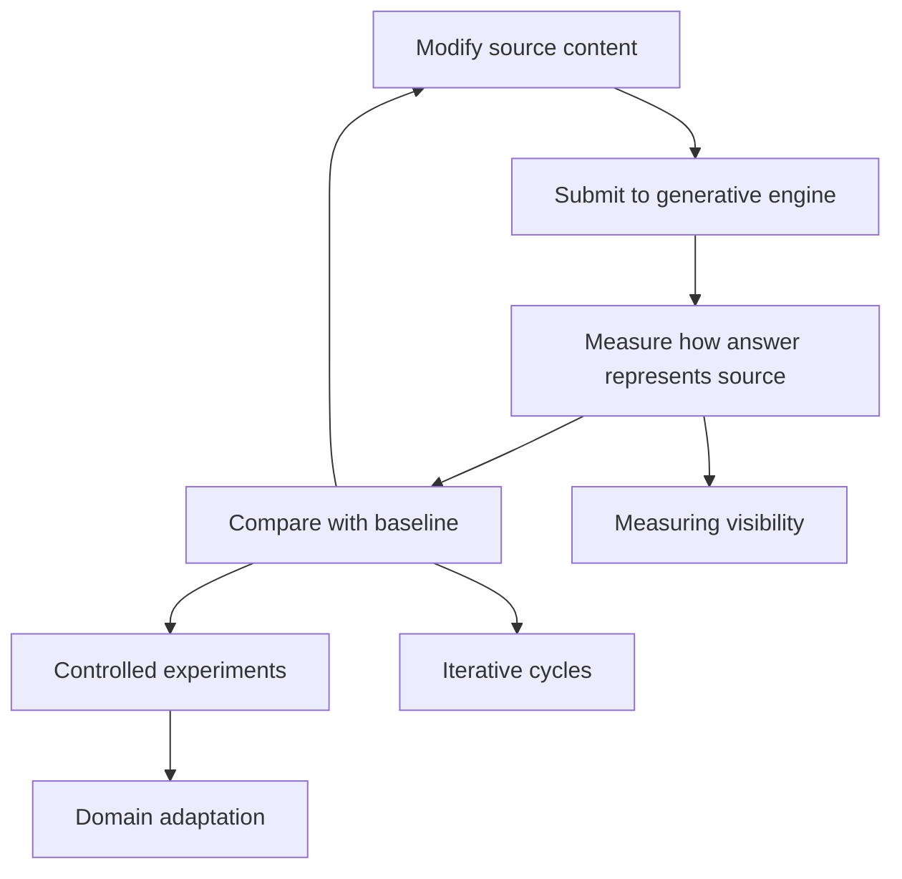

# Generative Engine Optimization: AI Search Optimization

> Created by **Pranjal Aggarwal, Vishvak Murahari, Tanmay Rajpurohit, Ashwin Kalyan, Karthik Narasimhan, and Ameet Deshpande** — [https://arxiv.org/abs/2311.09735](https://arxiv.org/abs/2311.09735)

## Overview

Generative Engine Optimization (GEO) is a form of AI search optimization that aims to raise how visible a piece of content is inside answers written by generative engines, rather than where it ranks in a list of links. The [original paper on the GEO repository](https://github.com/GEO-optim/GEO) describes generative engines as systems that gather and summarize information to answer queries, and a [later study summarizing the work](https://arxiv.org/html/2509.08919v1) calls GEO a framework to help content creators improve their visibility in generative engine responses. The unit of success is not a position on a page but how much of the answer draws on your source, and how early.

The term was coined by Pranjal Aggarwal, Vishvak Murahari, Tanmay Rajpurohit, Ashwin Kalyan, Karthik Narasimhan and Ameet Deshpande, as listed in the [citation on the GEO GitHub repository](https://github.com/GEO-optim/GEO). According to [one history of the label](https://wetheflywheel.com/en/ai-search/generative-engine-optimization), it entered the literature on 16 November 2023 when the authors posted the preprint to arXiv as [GEO: Generative Engine Optimization](https://arxiv.org/pdf/2311.09735). The researchers came from Princeton University, Georgia Tech, the Allen Institute for AI and IIT Delhi, per [this definition page](https://everything-pr.com/what-is-generative-engine-optimization-geo), and the paper was later presented at KDD '24 in Barcelona, as [the GEO community's summary](https://thegeocommunity.com/blogs/generative-engine-optimization/geo-princeton-paper-original-study) records.

To test the idea, the authors built GEO-bench, a [collection of diverse user queries tagged with categories and corresponding search results](https://github.com/GEO-optim/GEO). The [GEO Wiki paper summary](https://geo.wiki/papers/aggarwal-geo-benchmark-2024) describes it as 10,000 queries across 25 domains, while [another account](https://wetheflywheel.com/en/ai-search/generative-engine-optimization) describes roughly 10,000 queries across nine domains, so secondary sources disagree on the domain count and the paper itself is the reference to check. The study tested nine content-rewriting strategies and reported [visibility gains of up to 40%, with results varying by domain](https://geo.wiki/papers/aggarwal-geo-benchmark-2024). A [practitioner analysis](https://seo-kreativ.de/en/blog/generative-engine-optimization) reports that Cite Sources, Quotation Addition and Statistics Addition produced a 30-40% relative improvement on Position-Adjusted Word Count, while Keyword Stuffing produced little to no improvement.

The headline number needs careful reading. [Rich Sanger's critical look](https://richsanger.com/generative-engine-optimization-a-critical-look) points out that the study does not evaluate the complete path from publishing a webpage to appearing in an AI-generated answer. A [2026 critical survey](https://arxiv.org/abs/2607.14035) goes further: the gains are valid within the experimental setting but conditional on a source already being present in a fixed context, and they establish neither organic discoverability nor durable traffic effects. The same survey finds topical relevance and context position to be the most reproducible levers, notes that generic heuristics transfer poorly, and warns that citation-oriented rewrites can impair retrieval. Adoption interest is high, with a [BrightEdge survey of over 750 professionals](https://brightedge.com/news/press-releases/brightedge-survey-reveals-68-marketers-are-embracing-ai-search-shift) reporting that 68% of marketers are embracing the AI search shift, but that measures attitude toward AI search, not proof that GEO works.

GEO is easiest to understand next to SEO. A [bibliometric analysis of SEO and GEO](https://webbut.unitbv.ro/index.php/Series_V/article/download/11675/6950/22149) puts it simply: SEO aims for the best ranking in results, while GEO focuses on how visible content is in AI answers and how likely a source is to be referenced.

| Dimension | SEO | GEO |
|---|---|---|
| Goal | Best ranking in results ([analysis](https://webbut.unitbv.ro/index.php/Series_V/article/download/11675/6950/22149)) | Being referenced in AI answers ([analysis](https://webbut.unitbv.ro/index.php/Series_V/article/download/11675/6950/22149)) |
| Measurement target | Position in a results list | Share and prominence of a source in the answer |
| Output format | Ranked links, more elaborate detail ([CMR](https://cmr.berkeley.edu/2025/11/will-geo-overtake-seo)) | Summarized answer that may omit detail ([CMR](https://cmr.berkeley.edu/2025/11/will-geo-overtake-seo)) |
| Evidence base | Rank is directly observable | Up to 40% in a benchmark ([GEO Wiki](https://geo.wiki/papers/aggarwal-geo-benchmark-2024)), conditional on retrieval ([survey](https://arxiv.org/abs/2607.14035)) |

In practice GEO runs as a loop, which the [GEO Wiki summary](https://geo.wiki/papers/aggarwal-geo-benchmark-2024) describes as modifying content, running it through a generative engine and scoring the resulting answer with impression metrics.

Each node maps to a skill: [measuring generative engine visibility](https://tryhamster.com/skills/measuring-generative-engine-visibility), [designing controlled GEO experiments](https://tryhamster.com/skills/designing-controlled-geo-experiments), [running iterative black-box optimization cycles](https://tryhamster.com/skills/running-iterative-black-box-optimization-cycles) and [adapting GEO tactics across domains](https://tryhamster.com/skills/adapting-geo-tactics-across-domains), supported by content skills for [structuring content for AI retrieval](https://tryhamster.com/skills/structuring-content-for-ai-retrieval), [strengthening AI answer integration](https://tryhamster.com/skills/strengthening-ai-answer-integration), [optimizing presentation](https://tryhamster.com/skills/optimizing-content-presentation-for-generative-search) and [building source authority](https://tryhamster.com/skills/building-source-authority-and-citation-signals). Teams using Hamster Studio can keep the prompt set, snapshots and change log for this loop in one shared workspace.

## Core Principles

### Optimize for representation, not rank

The target in GEO is how a source shows up inside a generated answer, not where a link sits on a page. The [bibliometric comparison of SEO and GEO](https://webbut.unitbv.ro/index.php/Series_V/article/download/11675/6950/22149) frames the goal as visibility in AI answers and the likelihood of being referenced. That changes what you inspect: the text of the answer, which sentences draw on you, and how early they appear. If your reporting still ends at a rank number, you are not doing GEO yet.

### Treat the engine as a black box

You cannot see how a commercial engine weighs sources, so GEO works by changing inputs and observing outputs. The [overview of GEO papers](https://navirang-ai.com/en/research/papers) describes the original framework as a black-box optimization method for raising content visibility. This means every tactic is a hypothesis until you measure it against a baseline. Claims that a tactic works everywhere should be read as untested until you reproduce them on your own prompts.

### Measure prominence, not inclusion

A source can be cited once at the end of an answer and barely shape it. The original study's primary metric, Position-Adjusted Word Count, [weights information presented earlier in the answer more heavily](https://richsanger.com/generative-engine-optimization-maximizing-visibility-in-ai). Tracking only whether you appear hides the difference between leading an answer and trailing it. Pair inclusion counts with a measure of share and position.

### Retrieval comes before representation

The benchmark gains assume the engine already has your page in its context. A [2026 critical survey](https://arxiv.org/abs/2607.14035) states that the widely cited gains are conditional on a source already being present in a fixed context. The same survey notes that citation-oriented rewrites can impair retrieval, so an edit that improves how you are quoted may reduce how often you are found. Check discoverability first, then tune presentation.

### Add evidence, not keywords

The strongest tested additions made content more verifiable. A [practitioner reading of the paper](https://seo-kreativ.de/en/blog/generative-engine-optimization) reports that Cite Sources, Quotation Addition and Statistics Addition led the results, while Keyword Stuffing produced little to no improvement and ran 10% ([source](https://seo-kreativ.de/en/blog/generative-engine-optimization)) below the unmodified version on Perplexity.ai. The practical rule is to add sourced facts and attributable quotes rather than repeating target phrases.

### Expect results to vary by domain and engine

The original study itself reported [gains that varied by domain](https://geo.wiki/papers/aggarwal-geo-benchmark-2024). A [2025 study of AI search services](https://arxiv.org/abs/2509.08919) found they differ significantly from each other and show a strong preference for earned, third-party media over brand-owned content. A tactic that works for one engine, topic or language is a local finding, not a law. Plan to re-test when any of those change.

### Keep visibility separate from business outcomes

A rise in answer prominence is not the same as more traffic or revenue. The [critical survey](https://arxiv.org/abs/2607.14035) finds the foundational gains establish neither organic discoverability nor durable traffic effects, and [Rich Sanger's review](https://richsanger.com/generative-engine-optimization-a-critical-look) notes the study does not cover the full path from publishing to appearing in an answer. Report visibility metrics and downstream metrics side by side, and do not let one stand in for the other.

## Steps

1. **Define target information needs**
   List the questions your audience actually asks an AI assistant about your topic, grouped by intent. Write each as a fixed prompt plus a few paraphrases, because wording changes which sources an engine selects. Record which engines, locales and dates you will test so later runs are comparable. The output is a versioned prompt set, for example 30-50 prompts per important page, that stays stable between cycles.

2. **Capture a baseline snapshot**
   Run every prompt against each target engine and save the full answer text and its cited sources. Note which of your pages appear, which competitors appear, and where each sits in the answer. If your page never appears, stop and fix retrieval before touching presentation, since presentation edits only help content already in context. This snapshot is the reference every later change is judged against.

3. **Score visibility with more than one metric**
   Compute inclusion rate, a position-weighted share such as Position-Adjusted Word Count, and a qualitative impression judgment for each prompt. Using several metrics prevents a single late citation from looking like a win. Report rates, not raw counts, so prompt sets of different sizes stay comparable. The detailed formulas live in the [measuring generative engine visibility](https://tryhamster.com/skills/measuring-generative-engine-visibility) skill.

4. **Form a single-change hypothesis**
   Pick one intervention per test, such as adding sourced statistics or attributable quotations to a section. State the expected effect on a named metric before running anything. Changing wording, structure and facts at once makes it impossible to know which edit mattered. If you cannot write the hypothesis in one sentence, the change is too broad.

5. **Run a controlled comparison**
   Compare the original page with an otherwise identical variant, holding prompts, engines and evaluation fixed. Where possible, add a placebo edit of similar length to rule out effects of length alone. Blind any judging so scorers do not know which version produced which answer. The [designing controlled GEO experiments](https://tryhamster.com/skills/designing-controlled-geo-experiments) skill covers baselines, placebos and judge separation.

6. **Adapt to domain and engine**
   Break results down by topic group, engine and language instead of averaging them. A tactic that helps in one domain may do nothing or harm results in another, as domain-varying gains in the original study suggest. Keep a short record of which tactics hold where. The [adapting GEO tactics across domains](https://tryhamster.com/skills/adapting-geo-tactics-across-domains) skill explains how to decide what transfers.

7. **Keep, revert and re-measure on a cadence**
   Keep a change only if it improves the target metric across several prompts and repeated runs, not a single lucky answer. Revert changes that hurt retrieval or produce no consistent gain. Re-run the full prompt set on a fixed schedule, for example weekly or monthly, because engines change without notice. The [running iterative black-box optimization cycles](https://tryhamster.com/skills/running-iterative-black-box-optimization-cycles) skill covers cadence and variability.

## When to Use

- Your buyers or readers increasingly ask AI assistants instead of scanning search results, and you need to know whether your pages shape those answers, because rank reports cannot show that.
- You already have well-indexed, relevant pages that engines retrieve but rarely quote prominently, which is exactly the setting where the tested rewrites showed gains.
- You are deciding between content tactics such as adding statistics, quotations or citations and want evidence from your own prompts rather than generic advice.
- A competitor is consistently named first in AI answers for your category and you need a repeatable way to track position and share over time.
- You run a research or analytics function that must evaluate vendor claims about AI search visibility and needs a vocabulary for what was actually measured.

## When Not to Use

- Your pages are not being retrieved or indexed at all, because GEO gains assume the source is already in the engine's context and rewrites cannot fix absence.
- You need a guaranteed traffic or revenue lift on a deadline, since the evidence does not establish durable traffic or conversion effects from GEO edits.
- You plan to test a single prompt once and act on the result, because run-to-run variability in AI engines makes one observation unreliable.
- Your main problem is a lack of third-party coverage for a niche brand, where AI search's preference for earned media makes off-site authority work a better first investment than on-page rewrites.

## Skills

This method includes the following skills:

- [Designing Controlled GEO Experiments](skills/designing-controlled-geo-experiments/SKILL.md) — Teaches how to construct systematic tests across queries, content variants, and generative engines using GEO-bench so that changes in source visibility can be compared with confidence.
- [Measuring Generative Engine Visibility](skills/measuring-generative-engine-visibility/SKILL.md) — Teaches how to define and calculate metrics like position-adjusted word count and impression scores to quantify whether and how prominently a source appears in AI-generated answers.
- [Adapting GEO Tactics Across Domains](skills/adapting-geo-tactics-across-domains/SKILL.md) — Teaches how to select and validate different optimization strategies for different subject areas, query types, and generative engines rather than applying a single universal approach.
- [Running Iterative Black-Box Optimization Cycles](skills/running-iterative-black-box-optimization-cycles/SKILL.md) — Teaches how to execute repeated cycles of baseline measurement, content revision, engine testing, and metric comparison when the generative engine's internal algorithms are inaccessible.
- [Optimizing Content Presentation for Generative Search](skills/optimizing-content-presentation-for-generative-search/SKILL.md) — Teaches how to test and refine wording, headings, formatting, statistics, quotations, and information density to determine which presentation choices improve visibility in generated answers.
- [Building Source Authority and Citation Signals](skills/building-source-authority-and-citation-signals/SKILL.md) — Teaches how to improve evidence quality, factual support, and source attribution so that generative systems treat content as authoritative and reliable enough to cite.
- [Strengthening AI Answer Integration](skills/strengthening-ai-answer-integration/SKILL.md) — Teaches how to write content with direct answers, contextual explanations, and clearly attributable claims so generative engines can accurately synthesize and cite the source in responses.
- [Structuring Content for AI Retrieval](skills/structuring-content-for-ai-retrieval/SKILL.md) — Teaches how to organize pages so that claims, entities, definitions, and relationships are explicit and easily identifiable by retrieval-augmented generation systems.

## FAQ

**Who created Generative Engine Optimization?**

GEO was introduced by Pranjal Aggarwal, Vishvak Murahari, Tanmay Rajpurohit, Ashwin Kalyan, Karthik Narasimhan and Ameet Deshpande, as the [GEO repository citation](https://github.com/GEO-optim/GEO) shows. The preprint [GEO: Generative Engine Optimization](https://arxiv.org/pdf/2311.09735) was posted to arXiv and later presented at KDD '24, according to [the GEO community summary](https://thegeocommunity.com/blogs/generative-engine-optimization/geo-princeton-paper-original-study). It began as an academic study, not a marketing playbook.

**Does GEO really increase visibility by 40%?**

The original study reported [visibility gains of up to 40%](https://geo.wiki/papers/aggarwal-geo-benchmark-2024) on its benchmark, with results varying by domain. That is a ceiling from controlled tests, not an average you should expect. A [2026 critical survey](https://arxiv.org/abs/2607.14035) stresses that the gains apply when a source is already present in a fixed context and do not establish discoverability or traffic effects. Treat the figure as evidence that presentation can matter, not as a forecast.

**How is AI search optimization different from SEO?**

SEO aims for the best ranking in search results, while GEO measures how visible and referenced a source is inside AI-generated answers, as a [bibliometric analysis](https://webbut.unitbv.ro/index.php/Series_V/article/download/11675/6950/22149) describes. The output also differs: generated answers are summarized and [may omit detail that ordinary search provides](https://cmr.berkeley.edu/2025/11/will-geo-overtake-seo). In practice the two overlap, because a page usually has to be retrievable before an engine can quote it.

**Which content changes worked best in the original study?**

A [practitioner reading of the paper](https://seo-kreativ.de/en/blog/generative-engine-optimization) reports that Cite Sources, Quotation Addition and Statistics Addition performed best, with a 30-40% relative improvement on Position-Adjusted Word Count. The same analysis reports Keyword Stuffing gave little to no improvement. These results come from one benchmark setup, so confirm them on your own prompts and engines before rolling them out broadly.

**Does GEO replace SEO?**

Nothing in the evidence supports dropping SEO. The GEO gains assume your content is already retrieved, and the [2026 critical survey](https://arxiv.org/abs/2607.14035) identifies topical relevance as one of the most reproducible levers, which is also core SEO work. Treat GEO as an added measurement and editing layer on top of discoverable, relevant pages.

**How do I know whether GEO is working for my content?**

Define a fixed prompt set, capture a baseline of full answers, and track position-weighted visibility rather than simple inclusion. Re-run on a schedule and look for consistent changes across many prompts, since single answers vary between runs. Report traffic and conversions separately, because visibility gains do not automatically translate into them. The [measuring generative engine visibility](https://tryhamster.com/skills/measuring-generative-engine-visibility) skill gives the metrics.

**Do GEO tactics work the same on every AI search engine?**

No. A [2025 study of AI search services](https://arxiv.org/abs/2509.08919) found they differ significantly and show a strong bias toward earned third-party media over brand-owned content. That means results from one engine, language or topic may not carry over. Test on each engine that matters to your audience and keep results separate.

## Sources

- [\[PDF\] GEO: Generative Engine Optimization - arXiv](https://arxiv.org/pdf/2311.09735)
- [GitHub - GEO-optim/GEO](https://github.com/GEO-optim/GEO)
- [GEO: Generative Engine Optimization \(Aggarwal et al. 2024\)](https://geo.wiki/papers/aggarwal-geo-benchmark-2024)
- [Generative Engine Optimization: How to Dominate AI Search - arXiv](https://arxiv.org/html/2509.08919v1)
- [The Original GEO Paper: Princeton \& IIT Delhi Study Findings](https://thegeocommunity.com/blogs/generative-engine-optimization/geo-princeton-paper-original-study)
- [Generative Engine Optimization \(GEO\): The 2026 Playbook](https://wetheflywheel.com/en/ai-search/generative-engine-optimization)
- [What Is Generative Engine Optimization? Definition \& Pillars](https://everything-pr.com/what-is-generative-engine-optimization-geo)
- [\[2607.14035\] Optimizing Visibility in Generative Engines: A Critical](https://arxiv.org/abs/2607.14035)
- [BrightEdge Survey Reveals 68% of Marketers Are](https://brightedge.com/news/press-releases/brightedge-survey-reveals-68-marketers-are-embracing-ai-search-shift)
- [Generative Engine Optimization: How to Dominate AI Search](https://arxiv.org/abs/2509.08919)
- [Will GEO Overtake SEO? - California Management Review](https://cmr.berkeley.edu/2025/11/will-geo-overtake-seo)
- [from seo to geo: a bibliometric analysis of search engine](https://webbut.unitbv.ro/index.php/Series_V/article/download/11675/6950/22149)
- [13 AEO · GEO Papers — What Is Established and Where They Diverge](https://navirang-ai.com/en/research/papers)
- [Generative Engine Optimization: Visible in AI Answers - SEO-Kreativ](https://seo-kreativ.de/en/blog/generative-engine-optimization)
- [Generative Engine Optimization: A Critical Look at the GEO Study](https://richsanger.com/generative-engine-optimization-a-critical-look)
- [Generative Engine Optimization: What the GEO Study Found](https://richsanger.com/generative-engine-optimization-maximizing-visibility-in-ai)

---

*[Import this method into Hamster](https://tryhamster.com) to share it with your team, customize it for your workflow, and let AI agents use it automatically.*
