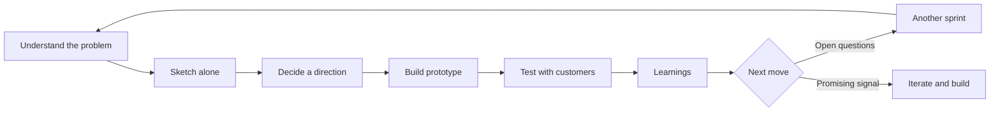

# GV Design Sprint: The Timeboxed Design Process Explained

> Created by **Jake Knapp** — [https://jakeknapp.com/](https://jakeknapp.com/)

## Overview

The GV Design Sprint is a timeboxed design process for answering a critical business or product question with evidence before a team commits to building anything. In [Knapp's own description during the Sprint book launch](https://youtube.com/watch?v=v1HBqlxQjZI), a team takes a big challenge, clears its calendar for five days, works through a fixed sequence of steps, builds a realistic prototype, tests it with five customers, and learns what to do next. The immediate output, as framed in [Knapp's original recipe for startups](https://jakek.medium.com/the-product-design-sprint-a-five-day-recipe-for-startups-84fde3e97d79), is a tested prototype and a clearer decision, not a shipped feature. That is also what separates it from an Agile or Scrum sprint: [its purpose is problem understanding, solution exploration, prototyping and user validation](https://jakek.medium.com/the-product-design-sprint-a-five-day-recipe-for-startups-84fde3e97d79) rather than implementing production code.

[GV states](https://gv.com/sprint) that Jake Knapp began running design sprints at Google in 2010. The Brazilian publisher's page for the book says he used the method on everything from Google Search to Google X, then joined Google Ventures, where he and colleagues completed more than one hundred sprints with startups. His earliest located write-up, [The product design sprint: a five-day recipe for startups](https://jakek.medium.com/the-product-design-sprint-a-five-day-recipe-for-startups-84fde3e97d79), was published on October 2, 2012. [Google Design credits](https://design.google/library/design-sprints) the GV sprinting blog by Knapp and John Zeratsky with spreading the method further, and [a research dossier drawing on the Wikipedia record](https://geyfman.org/dossiers/gv-design-sprint-deep-research-report) also credits GV researcher Michael Margolis, who built much of the customer-testing discipline, and designer Daniel Burka. The book Sprint, by Knapp, Zeratsky and Braden Kowitz, was [published on March 8, 2016](https://amazon.sg/Sprint-Solve-Problems-Test-Ideas/dp/150112174X).

The stage names shifted as the method matured. [Knapp's 2012 post](https://jakek.medium.com/the-product-design-sprint-a-five-day-recipe-for-startups-84fde3e97d79) named the days Understand, Diverge, Decide, Prototype and Validate, preceded by a preparation phase to get the right people and materials. [The later GV formulation described by Zapier](https://zapier.com/blog/google-ventures-design-sprint) runs Monday Understand, Tuesday Sketch, Wednesday Decide, Thursday Prototype and Friday Test, although the same write-up labels Wednesday Storyboard, because the day ends with a storyboard for the prototype. The newer names describe what people actually do each day rather than abstract phases.

[Knapp recommends](https://design-sprint.com/jake-knapp-itoday-design-sprint-the-innovation-cookbook) a team of five to seven people, noting that more than seven slows things down too much. A designated Decider holds final authority, which [keeps unresolved debate from stalling the week](https://geyfman.org/dossiers/gv-design-sprint-deep-research-report) because the team never needs consensus. The format is not cheap: [a Proto.io practitioner account](https://blog.proto.io/a-skeptics-guide-to-design-sprints) reported a GV sprint facilitator recommending a fee of $9,000-$15,000, while salaries for five participants came to roughly $20,000, ([source](https://blog.proto.io/a-skeptics-guide-to-design-sprints)) excluding preparation. [A 2025 experimental study](https://cris.fbk.eu/retrieve/883a8fe4-957f-44fa-af9e-6159cfa53bd4/1-s2.0-S0166497225000719-main.pdf) adds that user involvement can be costly and difficult despite the short schedule.

The evidence is thinner than the method's visibility suggests. [A recent research review](https://geyfman.org/dossiers/gv-design-sprint-deep-research-report) concludes that rigorous empirical evidence is scarce, consisting mainly of practitioner testimony, vendor case studies and a few academic studies. [The 2025 study of Design Sprint innovation contests](https://cris.fbk.eu/retrieve/883a8fe4-957f-44fa-af9e-6159cfa53bd4/1-s2.0-S0166497225000719-main.pdf) found a 19% increase in SMEs' understanding of the method and a 12% ([source](https://cris.fbk.eu/retrieve/883a8fe4-957f-44fa-af9e-6159cfa53bd4/1-s2.0-S0166497225000719-main.pdf)) improvement in their ability to implement it, but no significant change in attitudes or intentions to adopt design practices, and it sampled innovation-inclined firms without follow-up. [A 2020 startup case study](https://portal.abepro.org.br/ijcieom/restrito/arquivos/icieom2020/FULL_0005_37190.pdf) reported fast learning from interviews and prototype tests but did not reach full validation of the product vision. Treat a sprint as a way to align a team and get early feedback, not as proof of product-market fit.

On comparison, [a 2022 study in the International Journal of Agile Systems and Management](https://inderscienceonline.com/doi/10.1504/IJASM.2022.124916) found that design thinking, agile and design sprint differ on time, team composition, flexibility, main focus, goal setting and challenges, while sharing collaborative, user-centred problem solving. A Design Sprint versus Design Thinking analysis positions the sprint as an initial requirements or product-development stage and recommends combining the two, and [a 2024 working paper](https://dies.uniud.it/it/ricerca/allegati_wp/wp_2024/wp05_2024) frames Lean Startup around iterative learning and Agile around incremental delivery.

| Method          | Time                                                                                               | Primary focus         | Output             | Typical use              |
| --------------- | -------------------------------------------------------------------------------------------------- | --------------------- | ------------------ | ------------------------ |
| Design Sprint   | Five days ([GV week](https://zapier.com/blog/google-ventures-design-sprint))                       | One critical question | Tested prototype   | Early product decision   |
| Design Thinking | Open-ended (USP analysis)                                                                          | Broad exploration     | Ideas and insights | Finding what to solve    |
| Lean Startup    | Repeated cycles ([Uniud paper](https://dies.uniud.it/it/ricerca/allegati_wp/wp_2024/wp05_2024))    | Business hypotheses   | Validated learning | Testing a business model |
| Agile           | Ongoing increments ([Uniud paper](https://dies.uniud.it/it/ricerca/allegati_wp/wp_2024/wp05_2024)) | Implementation        | Working software   | Delivering the product   |

Teams that run sprints in Hamster can keep the problem map, sketches, decision notes and test findings in one shared workspace so Friday's learnings feed straight into the next cycle.

## Core Principles

### Answer one critical question with evidence

A sprint exists to get evidence on a question that matters before the team spends months building, which is the core purpose in [Knapp's original recipe](https://jakek.medium.com/the-product-design-sprint-a-five-day-recipe-for-startups-84fde3e97d79). Every activity in the week should trace back to that question. If the team cannot state what it will know on Friday that it does not know on Monday, the sprint is not ready. A vague goal produces a vague prototype and a test nobody can interpret.

### Work alone together

On Tuesday each participant [sketches a solution individually, on paper, with no group brainstorming](https://designelite.co/en/blog/design-sprint). This produces several competing concepts instead of a committee compromise shaped by the loudest voice. Quiet specialists get the same weight as senior people because the sketches are judged on the page. The detailed technique lives on the [solution sketching skill page](https://tryhamster.com/skills/sketching-competing-solutions-individually).

### A Decider, not consensus

The team votes to surface opinions, but [a designated Decider makes the final call](https://geyfman.org/dossiers/gv-design-sprint-deep-research-report) on what gets prototyped. This removes the need for everyone to agree, which is what usually stalls product decisions. The Decider must be in the room and genuinely empowered, or the choice will be reopened after the sprint. The mechanics are covered in [making structured decisions under time constraints](https://tryhamster.com/skills/making-structured-decisions-under-time-constraints).

### Prototype only what the question needs

Thursday's prototype is realistic enough to draw honest reactions but deliberately narrow. [Practitioner analysis on the Proto.io blog](https://blog.proto.io/a-skeptics-guide-to-design-sprints) describes the output as a limited working prototype built to answer a specific question, not a complete product. Anything a customer will not touch during the test is wasted effort. Build the facade, not the engine.

### Clear the calendar and keep the team small

The method depends on uninterrupted focus, which is why [Knapp describes teams clearing their calendars for the week](https://youtube.com/watch?v=v1HBqlxQjZI). He also [recommends five to seven people](https://design-sprint.com/jake-knapp-itoday-design-sprint-the-innovation-cookbook), because larger groups slow every exercise. People drifting in and out for meetings break the shared context the later days rely on. Protecting time is a leadership decision made before the sprint, not during it.

### Treat Friday as learning, not a verdict

Customer tests at the end of the week reveal what works and what does not, but they are not conclusive validation. [The research review](https://geyfman.org/dossiers/gv-design-sprint-deep-research-report) and [a 2020 startup case study](https://portal.abepro.org.br/ijcieom/restrito/arquivos/icieom2020/FULL_0005_37190.pdf) both frame the result as input to further iteration or another sprint. A handful of interviews can kill a bad idea quickly, yet a positive signal still needs confirmation at scale. Write down what you learned and what remains uncertain.

### Preparation sets the ceiling

A sprint solves and de-risks; it does not find problems. [Practitioners report](https://geyfman.org/dossiers/gv-design-sprint-deep-research-report) that sprints are not worth the effort without enough data on the problem, and a badly framed challenge leads the team to optimize an answer to the wrong question. Gather existing research, analytics and customer insight before Monday. See [mapping the challenge and setting sprint goals](https://tryhamster.com/skills/mapping-the-challenge-and-setting-sprint-goals) for how to frame it.

## Steps

1. **Prepare the sprint**
   Before the week starts, pick a challenge worth the investment and confirm there is enough existing data to work from. Recruit a small cross-functional team and name the Decider. Book the room, block calendars and schedule customer tests for Friday so recruiting does not become a mid-week scramble. Collect prior research, analytics and customer feedback so Monday starts from evidence rather than opinions.

   If you cannot find target customers to test with, reconsider the sprint.

2. **Map the challenge and set goals**
   On Monday the team investigates the problem through research, competitive review, strategy exercises, expert interviews and problem mapping, as described in [the GV framework](https://zapier.com/blog/google-ventures-design-sprint). Agree a long-term goal and the specific questions the sprint must answer. Draw a simple map of how customers move through the experience and pick a target moment to focus on. The output is a narrow, agreed target, and a sign of trouble is a team that ends Monday still arguing about what the problem is.

   Details are on the [problem mapping skill page](https://tryhamster.com/skills/mapping-the-challenge-and-setting-sprint-goals).

3. **Sketch competing solutions**
   On Tuesday, the team reviews existing ideas and products for inspiration, then each person works independently. Everyone produces one detailed, self-explanatory solution sketch rather than contributing to a group whiteboard. The point is breadth: several fully considered alternatives, each owned by one person. Watch for people collaborating quietly or deferring to the most senior sketch, which collapses the options.

   See [sketching competing solutions individually](https://tryhamster.com/skills/sketching-competing-solutions-individually).

4. **Decide and storyboard**
   On Wednesday morning the team reviews the sketches, marks promising parts, critiques each concept briefly and takes a nonbinding poll. The Decider then chooses what to prototype, possibly combining compatible elements. In the afternoon, the team turns the chosen direction into a step-by-step storyboard of what the customer will see. The storyboard becomes the build plan for Thursday, so gaps left here become improvisation later.

   The decision mechanics are covered in [making structured decisions under time constraints](https://tryhamster.com/skills/making-structured-decisions-under-time-constraints).

5. **Build a realistic prototype**
   On Thursday the team builds [a quick, realistic prototype that can be shown to prospective users](https://jakek.medium.com/the-product-design-sprint-a-five-day-recipe-for-startups-84fde3e97d79). Split the storyboard into pieces and assign makers, a stitcher who keeps it consistent, and someone writing the interview guide. Fake anything the customer will not inspect closely. The test is whether a customer would react to it as if it were real, not whether engineers could ship it.

   Run a full rehearsal before the end of the day.

6. **Test with target customers**
   On Friday, one person interviews customers one at a time while the rest of the team watches and takes notes. [Knapp's formulation](https://youtube.com/watch?v=v1HBqlxQjZI) is to test with five customers, which is usually enough for patterns to emerge. Ask customers to complete tasks and think aloud rather than asking whether they like it. Observers tally where people succeed, stumble or express interest.

   Patterns that repeat across interviews matter more than any single reaction.

7. **Decide the next move**
   Close the week by reviewing the patterns against the sprint questions set on Monday. For each question, record whether the evidence answered it, contradicted the team's assumption, or left it open. Choose one path: iterate the concept, run a follow-up sprint on what remains uncertain, move into build, or drop the idea. Write the learnings down immediately, because the value of the week decays fast once people return to their usual work.

## When to Use

- A high-stakes product or feature bet is about to consume months of engineering, because a week of prototyping and testing is cheaper than building the wrong thing.
- The team is stuck in circular debate between several plausible directions, because independent sketches plus a Decider force a choice that can then be tested.
- You have solid prior research on the problem but no agreed solution, because the sprint is built to turn understanding into a testable concept quickly.
- A new market or customer segment needs a first read on how people react to a concept, because a realistic prototype draws more honest feedback than a survey about hypotheticals.
- Cross-functional stakeholders need to align on one direction, because working the same problem together for a week builds shared context that documents rarely do.

## When Not to Use

- The problem itself is still unknown or poorly framed, because the sprint is a solving tool and [practitioners warn](https://viima.com/blog/design-sprint-101) it tends to fail on ambiguous problems without clear solutions.
- The change is a small iteration the team could simply ship and measure, because the cost of a facilitated week outweighs what a quick release would teach.
- No one with real decision authority can commit to the whole week, because without an empowered Decider the choice gets reopened afterward.
- The question requires long-term behavioural or market data, because a single round of customer tests cannot establish retention, pricing power or product-market fit.

## Skills

This method includes the following skills:

- [Making Structured Decisions Under Time Constraints](skills/making-structured-decisions-under-time-constraints/SKILL.md) — Learn to evaluate multiple competing concepts using structured critique, dot voting, and a designated Decider role to select one direction without letting discussion stall progress.
- [Sketching Competing Solutions Individually](skills/sketching-competing-solutions-individually/SKILL.md) — Learn to generate detailed solution concepts through structured individual sketching — researching precedents, producing rough alternatives, and creating a coherent final sketch — rather than relying on unstructured group brainstorming.
- [Mapping the Challenge and Setting Sprint Goals](skills/mapping-the-challenge-and-setting-sprint-goals/SKILL.md) — Learn to visualize the system surrounding a business challenge by identifying users, stakeholders, and failure points, then converting that understanding into a specific long-term goal, sprint questions, and a focused target for the week.

## FAQ

**How is a design sprint different from an Agile or Scrum sprint?**

They share a name but not a purpose. An Agile or Scrum sprint delivers working software in increments. The design sprint, [per Knapp's original description](https://jakek.medium.com/the-product-design-sprint-a-five-day-recipe-for-startups-84fde3e97d79), is about understanding the problem, exploring solutions, prototyping and testing with users before production work begins. Many teams run a design sprint to decide what the development sprints should build.

**Who invented the GV Design Sprint?**

[GV credits Jake Knapp](https://gv.com/sprint), who began running design sprints at Google in 2010 and developed the process further at Google Ventures. [A research dossier](https://geyfman.org/dossiers/gv-design-sprint-deep-research-report) also credits researcher Michael Margolis for much of the customer-testing discipline and designer Daniel Burka. The method was codified in the book Sprint with John Zeratsky and Braden Kowitz.

**How many people should be on a sprint team?**

[Knapp recommends five to seven people](https://design-sprint.com/jake-knapp-itoday-design-sprint-the-innovation-cookbook) and says more than seven slows things down too much. Include the Decider, someone who understands the customer, someone who understands the technology, and someone with design skills. Extra experts can join briefly for interviews on Monday without staying for the whole week.

**How much does a design sprint cost?**

More than the short duration suggests. [A Proto.io practitioner account](https://blog.proto.io/a-skeptics-guide-to-design-sprints) reported a facilitator recommending $9,000-$15,000 per sprint, with salaries for five participants around $20,000, ([source](https://blog.proto.io/a-skeptics-guide-to-design-sprints)) not counting preparation. [A 2025 study](https://cris.fbk.eu/retrieve/883a8fe4-957f-44fa-af9e-6159cfa53bd4/1-s2.0-S0166497225000719-main.pdf) also notes that recruiting and involving users can be costly and difficult. Weigh that against the cost of building the wrong thing.

**Is there evidence that design sprints work?**

Evidence is limited. [A recent review](https://geyfman.org/dossiers/gv-design-sprint-deep-research-report) finds rigorous studies scarce, with most support coming from practitioner testimony and case studies. [A 2025 experiment](https://cris.fbk.eu/retrieve/883a8fe4-957f-44fa-af9e-6159cfa53bd4/1-s2.0-S0166497225000719-main.pdf) found SMEs gained 19% in understanding the method and 12% in ability to implement it, yet their intentions to adopt design practices did not change significantly. No study establishes that sprints reliably improve commercial success.

**Should a design sprint replace design thinking or Lean Startup?**

No, they solve different problems. A comparative analysis positions the sprint as an initial requirements or product-development stage and recommends using it alongside design thinking. Design thinking is broader and more exploratory, while Lean Startup focuses on iterative testing of business hypotheses. A sprint fits once you know the problem and need to choose and test a solution.

**What are the main criticisms of the method?**

Participants in an engineering-education study, [summarized in a research dossier](https://geyfman.org/dossiers/gv-design-sprint-deep-research-report), called it rigid and said it forces people through obligatory stages. The same source notes it is a solving tool, so weak research leads to good answers to the wrong question. The tight schedule can also [shorten user interaction](https://cris.fbk.eu/retrieve/883a8fe4-957f-44fa-af9e-6159cfa53bd4/1-s2.0-S0166497225000719-main.pdf) before a solution is chosen.

## Sources

- [The Design Sprint — GV](https://gv.com/sprint)
- [Dossier — The GV Design Sprint · Igor Geyfman](https://geyfman.org/dossiers/gv-design-sprint-deep-research-report)
- [Sprint: How to Solve Big Problems and Test New Ideas in Just Five Days Hardcover – Illustrated, 8 March 2016](https://amazon.sg/Sprint-Solve-Problems-Test-Ideas/dp/150112174X)
- [Kevin Rose talks 'Sprint' with GV's Jake Knapp and Daniel Burka](https://youtube.com/watch?v=v1HBqlxQjZI)
- [The product design sprint: A five-day recipe for startups - Jake Knapp](https://jakek.medium.com/the-product-design-sprint-a-five-day-recipe-for-startups-84fde3e97d79)
- [Design Sprint \& The Innovation Cookbook](https://design-sprint.com/jake-knapp-itoday-design-sprint-the-innovation-cookbook)
- [5-Day UX Design Sprint - Google Design](https://design.google/library/design-sprints)
- [Solve Problems and Test Ideas Faster with Google](https://zapier.com/blog/google-ventures-design-sprint)
- [Design Thinking, Lean Startup and Agile Development](https://dies.uniud.it/it/ricerca/allegati_wp/wp_2024/wp05_2024)
- [\[PDF\] Experimental evidence from design sprint innovation contests](https://cris.fbk.eu/retrieve/883a8fe4-957f-44fa-af9e-6159cfa53bd4/1-s2.0-S0166497225000719-main.pdf)
- [Design Sprint 101: How to Innovate Faster and Find Winning Solutions](https://viima.com/blog/design-sprint-101)
- [A Skeptic's Guide to Design Sprints - Proto.io Blog](https://blog.proto.io/a-skeptics-guide-to-design-sprints)
- [A comparative study between design thinking, agile, and design sprint methodologies \| International Journal of Agile Systems and Management](https://inderscienceonline.com/doi/10.1504/IJASM.2022.124916)
- [\[PDF\] Using Google Design Sprint method to validate a startup product](https://portal.abepro.org.br/ijcieom/restrito/arquivos/icieom2020/FULL_0005_37190.pdf)
- [Design Sprint: The Five-Day Method](https://designelite.co/en/blog/design-sprint)

---

*[Import this method into Hamster](https://tryhamster.com) to share it with your team, customize it for your workflow, and let AI agents use it automatically.*
