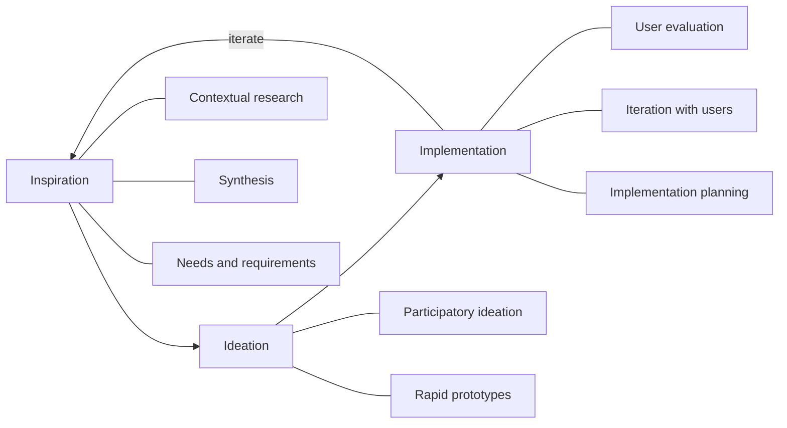

# Human-Centered Design: The People-First Design Process

> Created by **IDEO, with major popularization by Tim Brown** - [https://www.ideo.com/about](https://www.ideo.com/about)

## Overview

[IDEO defines human-centered design](https://ideo.com) as a creative approach to problem-solving that starts with understanding people's needs, motivations and behaviors, and ends with solutions that are meaningful and effective for them. The formal version, [quoted by NIST from ISO 9241-210](https://nist.gov/itl/iad/human-centered-technologies/human-factors-human-centered-design), describes an approach to interactive systems that aims to make them usable and useful by focusing on users and their requirements and by applying human factors, ergonomics and usability knowledge. Both definitions put the same input first: evidence about real people, gathered before and throughout the work, instead of a technology choice or business constraint fixed at the outset. In practice HCD is less a recipe than a discipline in which every significant decision gets checked against the people who will live with the result.

No single person invented HCD, and [the standard's own framing](https://evs.ee/en/StandardDownload/DownloadPreview?productId=114103\&language=EnglishLanguage) points to roots in human factors, ergonomics, participatory design and usability engineering; the sources do not identify one founding book or paper. IDEO describes itself as an early leader of human-centered design, and its toolkits did much to popularize the innovation-oriented version. In [IDEO's account](https://ideo.com), Inspiration means engaging directly with people to uncover unmet needs, Ideation means generating and testing a wide range of ideas grounded in that research, and Implementation means bringing solutions to life through rapid prototyping, iteration and collaboration with partners and communities. On a separate track, [ISO 9241-210:2019](https://iso.org/standard/77520.html) specifies human-centred design principles and activities across the life cycle of computer-based interactive systems, turning an agency practice into a formal set of requirements.

The phases are a loop, not a relay: implementation findings routinely send a team back to research. Each phase maps to discrete skills: [conducting contextual user research](https://tryhamster.com/skills/conducting-contextual-user-research), [synthesizing qualitative research into insights](https://tryhamster.com/skills/synthesizing-qualitative-research-into-insights) and [defining user needs and design requirements](https://tryhamster.com/skills/defining-user-needs-and-design-requirements) in Inspiration; [facilitating participatory ideation](https://tryhamster.com/skills/facilitating-participatory-ideation) and [building rapid prototypes](https://tryhamster.com/skills/building-rapid-prototypes) in Ideation; [conducting user-centered evaluation](https://tryhamster.com/skills/conducting-user-centered-evaluation), [iterating design solutions with users](https://tryhamster.com/skills/iterating-design-solutions-with-users) and [planning human-centered implementation](https://tryhamster.com/skills/planning-human-centered-implementation) in Implementation. Teams running this loop in Hamster can keep research notes, insights and prototype feedback in one shared workspace so each decision traces back to evidence.

The standard adds principles that hold whatever phase labels a team uses. According to [NIST's summary](https://nist.gov/itl/iad/human-centered-technologies/human-factors-human-centered-design) and [the 2010 edition](https://standards.iteh.ai/catalog/standards/iso/f476aadb-0ef4-4d4d-8049-139bd94b5a05/iso-9241-210-2010), the design should rest on an explicit understanding of users, tasks and environments, involve users throughout, be driven and refined by user-centred evaluation, and be iterative. It should also address the whole user experience, and [NHS England Digital](https://digital.nhs.uk/blog/design-matters/2022/how-a-20-year-old-standard-is-still-relevant-today) highlights the requirement for multidisciplinary skills and perspectives on the team. [The 2010 edition](https://standards.iteh.ai/catalog/standards/iso/f476aadb-0ef4-4d4d-8049-139bd94b5a05/iso-9241-210-2010) further asks that human-centred activity be planned across conception, analysis, design, implementation, testing and maintenance.

The evidence is real but uneven. Don Norman, in [Human-Centered Design Considered Harmful](https://web.mit.edu/~zoz/Public/p14-norman.pdf), credits HCD with improved usability, fewer usage errors and faster learning times. A [2017 scoping review of HCD in global health](https://journals.plos.org/plosone/article?id=10.1371/journal.pone.0186744) found many published applications but pervasive gaps in replicable methods, effectiveness evaluation and scale-up assessment, and it could not establish a general effect size. A [2022 eHealth analysis](https://pmc.ncbi.nlm.nih.gov/articles/PMC9582917) adds that HCD usually studies small samples in depth, which invites sampling bias. Adoption lags intent: in [one market survey](https://progress.com/docs/default-source/default-document-library/human-centered_software_design_a_state_of_the_marketplace.pdf?sfvrsn=c0a5ec4d_2), 98% of respondents called human-centric software development important, but only 34% said their organizations addressed it through tools, training and policy.

The critiques go beyond method quality. [Norman](https://web.mit.edu/~zoz/Public/p14-norman.pdf) warns that focusing on particular people can improve things for them while making them worse for others, and that chasing individual needs can erode cohesion and add complexity. [Design researchers](https://dl.designresearchsociety.org/cgi/viewcontent.cgi?article=3333\&context=drs-conference-papers) criticize HCD's anthropocentrism, which can privilege a select group of humans over marginalized people and non-human life, and a [scholarly critique](https://arxiv.org/html/2402.11576v1) argues HCD delivers usability but is not enough on its own to meet human needs in a deeper moral sense.

HCD sits among close relatives, and the lines blur. [IDEO](https://designthinking.ideo.com/introduction) treats HCD as the belief that design should start with people and design thinking as how that belief is put into action. A scoping review of technologies for older adults shows user-centered design drawing on the same methods, from field studies to contextual inquiry. None of these approaches has shown reliable superiority, and the [2017 review](https://journals.plos.org/plosone/article?id=10.1371/journal.pone.0186744) found the same gaps for HCD and design thinking.

| Approach             | Focus                             | Origin                                                                                                                       | Evidence gap                                                                                                      |
| -------------------- | --------------------------------- | ---------------------------------------------------------------------------------------------------------------------------- | ----------------------------------------------------------------------------------------------------------------- |
| HCD                  | Needs, contexts, whole experience | Ergonomics and IDEO, codified in [ISO 9241-210](https://iso.org/standard/77520.html)                                         | No general effect size ([2017 review](https://journals.plos.org/plosone/article?id=10.1371/journal.pone.0186744)) |
| Design thinking      | Methods that apply HCD            | IDEO, defined by Tim Brown ([IDEO](https://designthinking.ideo.com/faq/how-do-people-define-design-thinking))                | Same gaps as HCD ([2017 review](https://journals.plos.org/plosone/article?id=10.1371/journal.pone.0186744))       |
| User-centered design | Usability for the product's users | Usability practice (review)                                                                                                  | Methods overlap, no head-to-head data                                                                             |
| Participatory design | Users as co-designers             | A root of HCD ([ISO preview](https://evs.ee/en/StandardDownload/DownloadPreview?productId=114103\&language=EnglishLanguage)) | Involvement can turn shallow ([2025 study](https://pmc.ncbi.nlm.nih.gov/articles/PMC12402732))                    |

## Core Principles

### Understand users, tasks and environments explicitly

[ISO 9241-210](https://standards.iteh.ai/catalog/standards/iso/f476aadb-0ef4-4d4d-8049-139bd94b5a05/iso-9241-210-2010) requires the design to rest on an explicit understanding of users, tasks and environments. Explicit means written down and shared, so anyone can point to the observation behind a decision. Assumptions held only in a stakeholder's head fail that test. If nobody can say where a requirement came from, the understanding was never explicit.

### Involve users throughout, not at the end

[The standard](https://nist.gov/itl/iad/human-centered-technologies/human-factors-human-centered-design) requires users to be involved throughout design and development. Late involvement is the common failure: a [2025 assistive-technology study](https://pmc.ncbi.nlm.nih.gov/articles/PMC12402732) found user input was often superficial or late-stage. Bring users into research, ideation and evaluation, not only a final sign-off test. The warning sign is that users first see the work when it is too expensive to change.

### Let user evaluation drive decisions

[ISO 9241-210](https://standards.iteh.ai/catalog/standards/iso/f476aadb-0ef4-4d4d-8049-139bd94b5a05/iso-9241-210-2010) requires design decisions to be driven and refined by user-centred evaluation. The benefits [Norman](https://web.mit.edu/~zoz/Public/p14-norman.pdf) credits to HCD, fewer errors and faster learning, come from watching real use rather than debating opinions. Treat a disagreement between stakeholders as a question to test. When debates are settled by seniority, evaluation is not driving anything.

### Iterate with cheap prototypes

[IDEO](https://ideo.com/methodologies) emphasizes prototyping and testing early and often, refining until the design addresses a genuine human need. A [2025 public-health review](https://pmc.ncbi.nlm.nih.gov/articles/PMC12352946) found rapid, low-fidelity prototyping effective because it brings quick feedback while keeping costs down. Keep early prototypes rough enough that users feel free to criticize them. A polished first prototype usually means the team committed before it learned.

### Design for the whole experience and the wider system

[NIST's summary of the standard](https://nist.gov/itl/iad/human-centered-technologies/human-factors-human-centered-design) says design should address the whole user experience, not a single screen or task. [IDEO's systems design writing](https://ideo.com/journal/a-not-quite-textbook-definition-of-systems-design) extends the lens to all stakeholders in a system, not just end users. This guards against the risk [Norman](https://web.mit.edu/~zoz/Public/p14-norman.pdf) names, where improving things for one group makes them worse for another. Map who else is affected before optimizing for the primary user.

### Staff the team across disciplines

[NHS England Digital](https://digital.nhs.uk/blog/design-matters/2022/how-a-20-year-old-standard-is-still-relevant-today) highlights the ISO requirement that the design team include multidisciplinary skills and perspectives. Designers alone miss the operational, technical and legal constraints that decide whether a solution survives. Bring in the people who will build, run and support the result from the start. If engineering or operations first hears about a concept at handoff, the team was too narrow.

### Treat small-sample findings as hypotheses

A [2022 eHealth analysis](https://pmc.ncbi.nlm.nih.gov/articles/PMC9582917) notes that HCD typically studies small samples in depth, which makes it prone to sampling bias. Depth is the point of qualitative research, but it does not show how common a need is. Recruit deliberately across the range of users and check big claims against broader data before scaling. The 2017 global-health review is a reminder that HCD projects often lack rigorous outcome evaluation.

## Steps

1. **Frame the challenge and scope**
   Start by naming the decision the work must support, then set boundaries such as target population, time horizon, geography and operational limits, as [one HCD process guide](https://umbrex.com/resources/frameworks/design-thinking-frameworks/ideo-human-centered-design-process) recommends. Choose a unit of analysis, such as a customer segment, a service moment, a workflow or an end-to-end journey. Write the initial problem statement down, knowing research will probably change it. The output is a short brief the team and sponsor agree on.

   If the brief already prescribes a solution, rewrite it as an open question before going further.

2. **Research people in context**
   Go where the activity happens and combine interviews, observation and shadowing with existing evidence such as complaint data and call-center themes, following the mix in [this HCD toolkit](https://umbrex.com/resources/frameworks/design-thinking-frameworks/human-centered-design-toolkit). Invite staff who will implement the solution to observe too, as the [CCDF toolkit](https://childcareta.acf.hhs.gov/sites/default/files/new-occ/resource/files/CCDF_Human_Centered_Design_Toolkit_0.pdf) advises, so findings do not need selling later. Record frustrations, successful interactions and missed opportunities. The full method is in [conducting contextual user research](https://tryhamster.com/skills/conducting-contextual-user-research).

   A warning sign is that every insight comes from one convenient group of users.

3. **Synthesize insights and define needs**
   Cluster raw notes into themes, then look for recurring needs, tensions, contradictions and moments that matter disproportionately. Write insight statements that connect what people did or said to the need underneath. Reframe the problem statement and turn the strongest needs into opportunity areas and How might we questions, as covered in [synthesizing qualitative research into insights](https://tryhamster.com/skills/synthesizing-qualitative-research-into-insights) and [defining user needs and design requirements](https://tryhamster.com/skills/defining-user-needs-and-design-requirements). The output is a short set of needs and design principles the team can repeat from memory.

   If the reframed problem matches the original brief word for word, the synthesis probably confirmed assumptions instead of testing them.

4. **Generate ideas with users and stakeholders**
   Run sessions that bring users, frontline staff and decision makers into idea generation. Push for many options before judging any, because the first idea usually mirrors the original brief. A [2025 public-health review](https://pmc.ncbi.nlm.nih.gov/articles/PMC12352946) lists encouraging participation across diverse cultural groups and resolving conflicts in views and priorities as core staff skills. Session design is covered in [facilitating participatory ideation](https://tryhamster.com/skills/facilitating-participatory-ideation).

   Leave with a few concepts worth prototyping, each tied to a named need.

5. **Prototype, evaluate and iterate**
   Build the cheapest artifact that can answer the riskiest question about a concept, whether a paper sketch, a role-play or a clickable mock. Test it with users where it will actually be used, watch what they do, and revise. Repeat until the concept reliably meets the need, then raise fidelity. The skills [building rapid prototypes](https://tryhamster.com/skills/building-rapid-prototypes), [conducting user-centered evaluation](https://tryhamster.com/skills/conducting-user-centered-evaluation) and [iterating design solutions with users](https://tryhamster.com/skills/iterating-design-solutions-with-users) break this loop down.

   If every round confirms what the team already believed, the tests are too leading or the participants too friendly.

6. **Plan implementation and pilot**
   Assess the preferred concept for desirability, feasibility and viability, the lenses [this toolkit](https://umbrex.com/resources/frameworks/design-thinking-frameworks/human-centered-design-toolkit) uses to ask whether people want it, whether the organization can deliver it, and whether it can be sustained. Align sponsors, operations, technology and compliance early, and share prototypes and evidence so disagreements get settled by testing. Pilot before scaling, define success metrics in advance, and watch for unintended consequences. The plan itself is covered in [planning human-centered implementation](https://tryhamster.com/skills/planning-human-centered-implementation).

   Treating implementation as a handoff is the classic error, since [IDEO](https://ideo.com) frames it as iterative and collaborative.

## When to Use

- The problem is fuzzy and success depends on how people behave, for example low uptake of a service nobody has watched people use. Field research reveals the real blocker before you spend on a solution.
- You are building or redesigning an interactive system where usability errors are costly, such as clinical, financial or safety tools, because evaluation with users catches errors that reviews miss.
- Several groups, such as customers, frontline staff and partners, must accept the result. Involving them during design surfaces conflicts early, while they are still cheap to resolve.
- An initial brief prescribes a solution you suspect is wrong. Research and reframing let you test the brief's assumptions instead of executing them.
- Your organization must show a documented human-centred process for interactive systems, since ISO 9241-210 gives a recognized structure to plan and audit against.

## When Not to Use

- Requirements are fixed and well understood, such as a mandated regulatory field change, because research and ideation add cost without changing the decision.
- You cannot legally or ethically reach the people affected in time, for example when ethics approval is pending, since HCD without real users turns into guesswork dressed as empathy.
- You need statistically generalizable answers about prevalence or impact, because HCD's small, deep samples are not designed to deliver them; use surveys or experiments instead or alongside.
- The main consequences fall on people or systems outside the user group, such as environmental or community effects, where a user focus alone can optimize for users at others' expense.

## Skills

This method includes the following skills:

- [Building Rapid Prototypes](../../skills/building-rapid-prototypes/SKILL.md): Learn to make ideas tangible through low- and high-fidelity prototypes, storyboards, service models, and mock-ups that can be shared, examined, and tested with real users.
- [Conducting Contextual User Research](../../skills/conducting-contextual-user-research/SKILL.md): Learn to investigate people's real behaviors, needs, and lived experiences through observation, interviews, immersion, and contextual inquiry in their natural environments.
- [Planning Human-Centered Implementation](../../skills/planning-human-centered-implementation/SKILL.md): Learn to move validated design concepts toward real-world delivery by addressing feasibility, stakeholder alignment, adoption strategies, operational constraints, and impact measurement.
- [Conducting User-Centered Evaluation](../../skills/conducting-user-centered-evaluation/SKILL.md): Learn to plan and perform usability tests, prototype evaluations, and design reviews with representative users to assess desirability, usefulness, usability, and accessibility.
- [Synthesizing Qualitative Research into Insights](../../skills/synthesizing-qualitative-research-into-insights/SKILL.md): Learn to organize research evidence, identify patterns and tensions, develop themes, and distinguish observed behavior from assumptions to generate actionable design insights.
- [Facilitating Participatory Ideation](../../skills/facilitating-participatory-ideation/SKILL.md): Learn to generate and develop diverse ideas collaboratively with users, stakeholders, and multidisciplinary teams while deferring judgment and building on identified opportunities.
- [Defining User Needs and Design Requirements](../../skills/defining-user-needs-and-design-requirements/SKILL.md): Learn to translate research insights into clearly framed user needs, opportunity areas, design principles, and measurable success criteria that guide solution development.
- [Iterating Design Solutions with Users](../../skills/iterating-design-solutions-with-users/SKILL.md): Learn to use evaluation findings and emerging evidence to revise assumptions, prototypes, and requirements through repeated design cycles that keep users at the center.

## FAQ

**What is the difference between human-centered design and design thinking?**

[IDEO](https://designthinking.ideo.com/introduction) presents human-centered design as the core belief that design should start with people, and design thinking as the mindsets and methods that put that belief into action. The widely quoted definition from [IDEO's Tim Brown](https://designthinking.ideo.com/faq/how-do-people-define-design-thinking) calls design thinking a human-centered approach to innovation that integrates people's needs, technology's possibilities and business requirements. In practice teams use the terms almost interchangeably. Researchers do too: the [2017 global-health review](https://journals.plos.org/plosone/article?id=10.1371/journal.pone.0186744) searched both together.

**Is human-centered design the same as user-centered design?**

They overlap heavily. A scoping review shows user-centered design using the same core methods, including iterative design, field studies, usability evaluation and contextual inquiry. The difference is mostly scope: HCD, as [NIST summarizes the ISO standard](https://nist.gov/itl/iad/human-centered-technologies/human-factors-human-centered-design), asks for the whole user experience, and [IDEO's systems work](https://ideo.com/journal/a-not-quite-textbook-definition-of-systems-design) extends attention to every stakeholder in a system. If your problem touches people beyond the direct user, the HCD framing fits better.

**Does human-centered design actually work?**

It has documented benefits: [Norman](https://web.mit.edu/~zoz/Public/p14-norman.pdf) cites improved usability, fewer usage errors and faster learning times. Practitioners also value it, with a [2025 digital-government study](https://proceedings.open.tudelft.nl/DGO2025/article/download/1027/1061/1433) finding staff considered the methods relevant and capable of improving their initiatives. However, the [2017 global-health review](https://journals.plos.org/plosone/article?id=10.1371/journal.pone.0186744) found insufficient effectiveness evidence and no general effect size. Treat HCD as a sound way to reduce usability risk, and measure outcomes yourself rather than assuming them.

**What does ISO 9241-210 require?**

[ISO 9241-210:2019](https://iso.org/standard/77520.html) sets requirements and recommendations for human-centred design across the life cycle of computer-based interactive systems. Per [the 2010 edition](https://standards.iteh.ai/catalog/standards/iso/f476aadb-0ef4-4d4d-8049-139bd94b5a05/iso-9241-210-2010), designs must rest on an explicit understanding of users, tasks and environments, involve users throughout, be driven by user-centred evaluation and be iterative. [NHS England Digital](https://digital.nhs.uk/blog/design-matters/2022/how-a-20-year-old-standard-is-still-relevant-today) also stresses addressing the whole experience and staffing multidisciplinary teams. A [2025 study](https://pmc.ncbi.nlm.nih.gov/articles/PMC12402732) notes the standard offers little practical guidance on how to do this, so teams still need concrete methods.

**Who invented human-centered design?**

Nobody individually. [The ISO standard's framing](https://evs.ee/en/StandardDownload/DownloadPreview?productId=114103\&language=EnglishLanguage) reflects roots in human factors, ergonomics, participatory design and usability engineering, and no single founding publication can be identified. IDEO was an early leader and did much to popularize the innovation-oriented version through its toolkits. Its chair [Tim Brown](https://designthinking.ideo.com/faq/how-do-people-define-design-thinking) is credited with the best-known definition of the related concept of design thinking.

**What are the main criticisms of human-centered design?**

[Norman](https://web.mit.edu/~zoz/Public/p14-norman.pdf) argues that serving particular users can harm others and that chasing individual needs can add complexity and erode cohesion. A [2022 eHealth analysis](https://pmc.ncbi.nlm.nih.gov/articles/PMC9582917) flags limited reach, sampling bias and a narrow contextual and temporal focus. [Design researchers](https://dl.designresearchsociety.org/cgi/viewcontent.cgi?article=3333&context=drs-conference-papers) criticize its anthropocentrism, which can sideline marginalized people and non-human life. You can mitigate these by widening who counts as a stakeholder and checking findings against broader data.

**How many people should an HCD project involve in research?**

The sources give no fixed number, and depth matters more than headcount. Aim for range: [IDEO's Field Guide](https://slideshare.net/slideshow/the-field-guide-to-humancentered-designby-idedocx/254207561) lists a method called Extremes and Mainstreams, which recruits both typical users and people at the edges. Keep in mind that small samples are prone to bias, as the [2022 eHealth analysis](https://pmc.ncbi.nlm.nih.gov/articles/PMC9582917) warns. Stop recruiting when new sessions stop producing new needs, and verify prevalence with other data.

## Sources

- [IDEO : Human-centered design](https://ideo.com)
- [ISO 9241-210:2019](https://iso.org/standard/77520.html)
- [ISO 9241-210:2010 - Ergonomics of human-system](https://standards.iteh.ai/catalog/standards/iso/f476aadb-0ef4-4d4d-8049-139bd94b5a05/iso-9241-210-2010)
- [How a 20-year-old standard is still relevant today - NHS England Digital](https://digital.nhs.uk/blog/design-matters/2022/how-a-20-year-old-standard-is-still-relevant-today)
- [History](https://designthinking.ideo.com/introduction)
- [Human Centered Design \(HCD\) - NIST](https://nist.gov/itl/iad/human-centered-technologies/human-factors-human-centered-design)
- [IDEO Design Methodologies](https://ideo.com/methodologies)
- [How do people define design thinking? \| IDEO](https://designthinking.ideo.com/faq/how-do-people-define-design-thinking)
- [A not-quite-textbook definition of systems design](https://ideo.com/journal/a-not-quite-textbook-definition-of-systems-design)
- [Narrative Review of Human-Centered Design in Public Health](https://pmc.ncbi.nlm.nih.gov/articles/PMC12352946)
- [Challenges and Opportunities of the Human-Centered Design ... - NIH](https://pmc.ncbi.nlm.nih.gov/articles/PMC12402732)
- [The Limitations of User-and Human-Centered Design in an eHealth](https://pmc.ncbi.nlm.nih.gov/articles/PMC9582917)
- [Toward Humanity-Centered Design without Hubris](https://arxiv.org/html/2402.11576v1)
- [\[PDF\] Human-Centered Design Considered Harmful - MIT](https://web.mit.edu/~zoz/Public/p14-norman.pdf)
- [Reflections on the Usefulness and Limitations of Tools for Life-Centred Design](https://dl.designresearchsociety.org/cgi/viewcontent.cgi?article=3333&context=drs-conference-papers)
- [Human-centred design in global health: A scoping review of](https://journals.plos.org/plosone/article?id=10.1371/journal.pone.0186744)
- [Practitioners’ Perceptions on Human-Centered Design](https://proceedings.open.tudelft.nl/DGO2025/article/download/1027/1061/1433)
- [\[PDF\] Human-Centered Software Design:](https://progress.com/docs/default-source/default-document-library/human-centered_software_design_a_state_of_the_marketplace.pdf?sfvrsn=c0a5ec4d_2)
- [Human-Centered Design Toolkit - Umbrex](https://umbrex.com/resources/frameworks/design-thinking-frameworks/human-centered-design-toolkit)
- [CCDF Human-Centered Design Toolkit](https://childcareta.acf.hhs.gov/sites/default/files/new-occ/resource/files/CCDF_Human_Centered_Design_Toolkit_0.pdf)
- [IDEO Human-Centered Design Process](https://umbrex.com/resources/frameworks/design-thinking-frameworks/ideo-human-centered-design-process)
- [slideshare.net](https://slideshare.net/slideshow/the-field-guide-to-humancentered-designby-idedocx/254207561)

---

*[Import this method into Hamster](https://tryhamster.com) to share it with your team, customize it for your workflow, and let AI agents use it automatically.*
