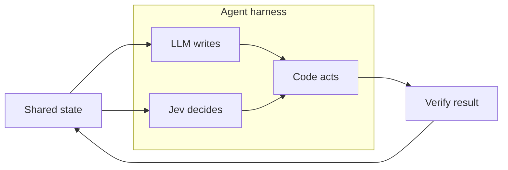

# What Is Jev Engineering? A Guide for Agent Builders

> Created by **Diogo Almeida** — [https://madewithjev.com/jev-engineering](https://madewithjev.com/jev-engineering)

## Overview

Jev Engineering is [a way to build AI agents: an LLM writes, Jev decides, and code acts](https://madewithjev.com/what-is-jev-engineering). According to that page, every point where an agent picks a worker, scores a source or approves a tool call goes to Jev, which [TypeSafe AI calls its System One model](https://madewithjev.com/what-is-jev-engineering), instead of going to a model that generates text. The split gives each kind of work to the component built for it. Language models produce briefings, drafts and code. Jev handles bounded decisions such as routing, scoring, approving and escalating. Deterministic code executes those decisions and enforces exact rules. The code that holds these pieces together is [an agent harness](https://madewithjev.com/what-is-jev).

The decision component behaves differently from a chat model. You send it text and typed questions, and it returns [a typed answer, a probability for every option and a confidence score, in 70 to 500 milliseconds](https://madewithjev.com/how-to-use-jev). One practitioner thread describes it as answering several questions in [a single pass instead of generating text token by token](https://x.com/eng_khairallah1/status/2102767762829447540). It [cannot generate text](https://knolli.ai/post/jev-ai-alternatives). That limit is deliberate. The method keeps a larger model in the loop for anything that has to be written and treats Jev as [a specialized decision layer, not a replacement for generative models](https://madewithjev.com/what-is-jev).

The term is very new. The model [launched on September 15, 2026](https://x.com/rvaniaaaa/status/2101709732314558639), when TypeSafe AI [came out of stealth with $40M led by DCVC](https://x.com/eng_khairallah1/status/2102767762829447540). Its creator, Diogo Almeida, [co-invented RLHF during his time at OpenAI](https://x.com/rvaniaaaa/status/2101709732314558639). The earliest identifiable use of the term is the creator-associated page [What is Jev Engineering?](https://madewithjev.com/what-is-jev-engineering), dated September 19, 2026. No earlier book, paper or talk turns up. [One thread](https://x.com/eng_khairallah1/status/2102767762829447540) reports that the phrase started trending the week the model launched. Since then the material has grown from a three-part slogan into an implementation method covering typed questions, parallel decisions, calibrated probabilities, confidence thresholds and deterministic execution. The [creator's reading list](https://madewithjev.com/jev-engineering) was still being updated at the time of writing, so expect the vocabulary to shift.

Most of the published evidence comes from the vendor's orbit or from individual practitioners. On a 400-item reference set, [one report](https://orcarouter.ai/blog/jev-typesafe-system-one-what-we-know) compared zero-shot Jev with two classic baselines:

| Approach | Accuracy, 400-item set | Source |
|---|---|---|
| Jev, zero-shot | 95.9% | [OrcaRouter report](https://orcarouter.ai/blog/jev-typesafe-system-one-what-we-know) |
| Hand-written keyword rules | 77.2% | [OrcaRouter report](https://orcarouter.ai/blog/jev-typesafe-system-one-what-we-know) |
| Supervised TF-IDF baseline | 66.0% | [OrcaRouter report](https://orcarouter.ai/blog/jev-typesafe-system-one-what-we-know) |

The reports disagree on calibration. [One benchmark](https://archerhume.com/posts/jevs-architecture-unmasked?v=3) found a ten-bin expected calibration error of 0.0313 on a 1,200-item MMLU sample. [The OrcaRouter tests](https://orcarouter.ai/blog/jev-typesafe-system-one-what-we-know) found the error rising to 0.107, against a 0.024 noise floor, on 900 synthetic support tickets whose deciding policy was not in the text. Treat the headline speed claims with care. TypeSafe reportedly claimed significant performance improvements, and a practitioner write-up notes that the widely quoted figures came from a founder's talk, not from an independently replicated benchmark.

Several alternatives cover similar ground. [Comparison pages](https://systemonemodels.org/compare) set Jev beside zero-shot and fine-tuned classifiers, named-entity recognition models, and language models asked for structured output. One roundup names managed structured-output features and libraries such as BAML, Instructor and Outlines as [the closest alternatives](https://eesel.ai/blog/typesafe-jev-alternatives). Open clones exist as well. [One architecture comparison](https://lilting.ch/en/articles/jev-clones-architecture-comparison) describes Laya as a ModernBERT backbone with a candidate-scoring head and Kev-0.5B as Qwen2.5-0.5B with a custom decision head. The same comparison says none of these clones show equivalence to Jev's base model, training data or recipe. The practical difference from schema-constrained generation is that decisions sit in a separate component that returns probabilities your code can threshold.

No independent adoption survey or peer-reviewed evaluation turns up in current coverage ([Knolli's overview](https://knolli.ai/post/jev-ai-alternatives)). Treat Jev Engineering as a pattern to test in shadow mode before you trust it. The skill pages break the method into parts, starting with [separating generation from decision-making](https://tryhamster.com/skills/separating-generation-from-decision-making) and [benchmarking and observing agent loops](https://tryhamster.com/skills/benchmarking-and-observing-agent-loops). Teams planning a migration in Hamster can track each moved decision as its own task, with its shadow-mode results attached.

## Core Principles

### Give each kind of work to the component built for it

The canonical rule is that [an LLM writes, Jev decides, and code acts](https://madewithjev.com/what-is-jev-engineering). A generator is slow and costly when all you need is a pick from a known list. A decision model cannot write a paragraph. Code alone cannot interpret messy text. Misassignment shows up as token spend on routing, or as a model trying to do date math.

### Decisions have fixed answer spaces

A Jev question is posed as a yes/no, a complete list of options, or ordered score levels, and it returns [a typed answer with a probability for every option](https://madewithjev.com/how-to-use-jev). Fixing the answer space in advance is what lets code branch on the result safely. If you find yourself wanting an explanation back, the task belongs to the LLM. See [formulating atomic decision questions](https://tryhamster.com/skills/formulating-atomic-decision-questions).

### Typed is not the same as correct

The founder has pitched the model as having [zero hallucination](https://x.com/0xCodez/status/2101294219633529030). Coverage of the method counters that Jev cannot return an answer outside the requested type, but [the decision can still be wrong](https://madewithjev.com/what-is-jev-engineering). Independent tests also found [confidence drifting from accuracy](https://orcarouter.ai/blog/jev-typesafe-system-one-what-we-know) when the deciding policy was missing from the input. Design every decision point on the assumption that some answers will be confidently wrong.

### Code holds the final say on actions

The model interprets requests and proposes actions, while [application code checks permissions and validates arguments before invoking tools](https://vercel.com/i/jev-agent-control). A high-confidence decision never overrides the action policy. This keeps irreversible side effects behind rules you can read and test. It also means a bad decision fails at the gate, not in production data.

### Prove a decision in shadow mode before it acts

Start by running Jev [beside the existing workflow without changing real behavior](https://jev-tutorial.org/guides/agent-decision-layer). One practitioner logs [Jev's choice next to the current fixed choice](https://wayneh.tw/posts/tech/jev-system-one-agent-reflex-layer), then calibrates the threshold using rework, human escalations and task success. The same guide says this is easier to attribute than changing the model and the effort level at once. Shadow mode turns adoption into a measured comparison instead of a leap.

### Batch independent questions and measure the whole loop

Questions that do not depend on each other can be asked together. [One engineering example](https://github.com/Foadsf/jev-for-engineers) measured a 13-question briefing as 12.2x cheaper and 10.0x faster in one call, with no change in the answers. The creator also advises [benchmarking the whole loop, not just individual model calls](https://madewithjev.com/x-posts). A faster router is worthless if task completion drops.

## Steps

1. **Log and label every model call**
   Run one representative agent task end to end and log every model call it makes. Label each operation as text, decision or rule, following the [creator's first classification step](https://madewithjev.com/what-is-jev-engineering). Text means open-ended output someone reads. Decision means a pick from known outcomes that needs understanding of the situation.

   Rule means anything exact enough to write as code, which you should move out of the model right away.

2. **Pick the first decision to migrate**
   Choose the decision that runs most often, as the [creator recommends](https://madewithjev.com/what-is-jev-engineering). Prefer [one bounded, low-risk decision with clear possible answers](https://x.com/akshay_pachaar/status/2101037514945597645) over the most valuable one. Frequency gives you data quickly, and low risk means a wrong answer costs little while you learn. If you cannot list every possible answer, the candidate is not bounded yet.

3. **Write the state and the rubric**
   Write down the state the decision reads: the goal, work already done, available evidence and what is still missing, per the [method's guidance](https://madewithjev.com/what-is-jev-engineering). Then [write the rubric before calling the model](https://x.com/akshay_pachaar/status/2101037514945597645), defining what qualifies for each option. The rubric doubles as the labeling guide for your eval set. Collect representative examples with expected answers, including ambiguous and adversarial ones.

4. **Define typed questions and batch them**
   Turn the decision into a question with a fixed answer space, such as a yes/no, a full choice list or ordered levels. The creator's workflow is to [define questions in code and ask independent questions together](https://madewithjev.com/x-posts), so one state snapshot can feed routing, risk and relevance at once. Keep dependent questions in sequence, because batching them hides the dependency. Version every question so later comparisons stay fair.

5. **Run in shadow mode**
   Wire the decision in so it is [logged but does not change real behavior](https://jev-tutorial.org/guides/agent-decision-layer). Record Jev's choice, the production choice and the eventual outcome, along with [rework, human escalation and task success](https://wayneh.tw/posts/tech/jev-system-one-agent-reflex-layer). Change only the decision layer, not the model and effort level together. Disagreements between the two choices are your most useful review queue.

6. **Set thresholds and fallbacks from data**
   Group shadow results by probability band and [measure observed accuracy in each band](https://jev-tutorial.org/guides/agent-decision-layer) instead of trusting the raw confidence. Automate only the bands that meet your accuracy bar, starting with the safest branch. Send uncertain cases to a human or a stronger model. Add [fallbacks for request failure, malformed output or insufficient savings](https://jev-tutorial.org/guides/agent-decision-layer), and test each of them deliberately.

7. **Gate actions in code and verify results**
   Let the decision propose, and let code [check permissions and validate arguments before any tool runs](https://vercel.com/i/jev-agent-control). After execution, record what the tool actually did, including failures, and write the result back into state. Verify against evidence, for example [checking a tool-call trace against its intent](https://gist.github.com/pedramamini/014676fa8684d91bf7000f4623701ada). Stale state after an action is a common source of wrong next decisions.

8. **Benchmark and log the full loop**
   Measure whether the agent reached its goal, plus [cost, latency, approvals and failed actions](https://madewithjev.com/x-posts), not just per-call accuracy. Log [model version, question version, threshold, action and overrides](https://jev-tutorial.org/guides/agent-decision-layer) for every decision. Reuse a fixed eval set when you compare thresholds or versions, so any change can be traced to the decision layer. Then pick the next decision and repeat.

## When to Use

- Your agent makes the same fixed-choice decision many times a day, such as a guardrail or model-routing check, because [repeated fixed-answer decisions are its strongest fit](https://kanerika.com/blogs/jev-ai-use-cases) and per-call LLM cost adds up fast.
- You need verification or scoring passes over large document sets within a tight latency budget, since reports describe Jev-style systems as suited to [verification passes and scoring many documents in parallel](https://orcarouter.ai/blog/jev-typesafe-system-one-what-we-know).
- You run online evals of agent output and want a cheaper, more repeatable judge, given that [LangChain's comparison found Jev the cheaper and more consistent judge](https://github.com/yibie/awesome-jev) against LLM judges.
- An LLM currently picks the next tool, worker or specialist agent in your loop and those picks come from a known set, which makes each pick a bounded decision that can be typed and thresholded.
- You need auditable decisions with a probability attached, so you can route low-confidence cases to a human and show reviewers why an action ran.

## When Not to Use

- The correct output is a sentence, a draft or a multi-turn reply, because reports list [open-ended generation, long-context reasoning and multi-turn dialogue](https://orcarouter.ai/blog/jev-typesafe-system-one-what-we-know) as poor fits.
- The task is arithmetic, counting or date math, which one overview calls [a poor fit for Jev](https://firecrawl.dev/blog/what-is-jev). Plain code does these exactly.
- You need PII span extraction, image understanding, payment-fraud scoring or a fully self-hosted stack, where [specialist tools still lead](https://kanerika.com/blogs/jev-ai-use-cases).
- The rule that decides the outcome lives outside the text you can send, since [calibration degraded sharply](https://orcarouter.ai/blog/jev-typesafe-system-one-what-we-know) in tests where the deciding policy was absent.
- The decision is a permission check or an exact business rule, because those belong in deterministic code where they can be tested, not in a probabilistic model.

## Skills

This method includes the following skills:

- [Benchmarking and Observing Agent Loops](skills/benchmarking-and-observing-agent-loops/SKILL.md) — Learn to evaluate the full State-Questions-Action-Verify protocol end to end, measuring decision accuracy, task completion, latency, cost, fallback rates, and real-world outcomes with shadow-mode evaluation and logging.
- [Formulating Atomic Decision Questions](skills/formulating-atomic-decision-questions/SKILL.md) — Learn to convert agent decision points into precise, typed questions that return a Choice, Score, or probability judgment with a clearly defined interpretation.
- [Separating Generation from Decision-Making](skills/separating-generation-from-decision-making/SKILL.md) — Learn to identify which parts of an AI-agent system require open-ended LLM generation, which are bounded judgments delegated to Jev, and which are deterministic actions handled by conventional code.
- [Designing Routing and Ranking Policies](skills/designing-routing-and-ranking-policies/SKILL.md) — Learn to use Jev at bounded decision points for selecting workers, models, tools, data sources, and candidate results according to explicit options and evaluation criteria.
- [Batching and Parallelizing Decisions](skills/batching-and-parallelizing-decisions/SKILL.md) — Learn to identify independent judgments within an agent loop, issue them concurrently or in batches, and combine their outputs in deterministic code to reduce latency and cost.
- [Enforcing Deterministic Execution Boundaries](skills/enforcing-deterministic-execution-boundaries/SKILL.md) — Learn to keep permissions, arithmetic, side effects, rollback logic, and irreversible actions strictly in conventional code rather than allowing probabilistic models to execute them directly.
- [Calibrating Confidence Thresholds and Escalation Paths](skills/calibrating-confidence-thresholds-and-escalation-paths/SKILL.md) — Learn to translate Jev's confidence and probability outputs into operating thresholds that govern acceptance, rejection, fallback behavior, human review, and escalation policies.
- [Structuring Shared Agent State](skills/structuring-shared-agent-state/SKILL.md) — Learn to construct compact, typed representations of the situation context that Jev needs for a particular judgment, replacing unstructured conversation history or excessive prompt context.

## FAQ

**Who created Jev Engineering?**

The framework is attributed to Diogo Almeida, founder of TypeSafe AI, who [co-invented RLHF at OpenAI](https://x.com/rvaniaaaa/status/2101709732314558639). The term appears on the creator-associated page [What is Jev Engineering?](https://madewithjev.com/what-is-jev-engineering), dated September 19, 2026. The model it builds on [launched on September 15, 2026](https://x.com/eng_khairallah1/status/2102767762829447540). No earlier academic source for the term has been found.

**Does Jev eliminate hallucinations?**

Sources disagree. The founder has described it as having [0 hallucination](https://x.com/0xCodez/status/2101294219633529030), while coverage of the method says it cannot answer outside the requested type but [can still be wrong](https://madewithjev.com/what-is-jev-engineering). Calibration results also vary by test, with [one report](https://orcarouter.ai/blog/jev-typesafe-system-one-what-we-know) finding confidence drifting from accuracy on hard cases. Plan thresholds and fallbacks as though some errors will get through.

**How is this different from asking an LLM for structured output?**

Structured output constrains a text generator to a schema. Jev returns [a typed answer plus a probability for every option](https://madewithjev.com/how-to-use-jev) without generating text at all. [Comparison pages](https://systemonemodels.org/compare) treat structured-output LLMs as one of the closest alternatives, alongside zero-shot and fine-tuned classifiers. If you mainly need valid JSON from a model that also writes, structured output may be enough.

**Can I apply the method without TypeSafe's model?**

The three-way split between writing, deciding and acting does not depend on any one vendor. Open implementations such as Laya and Kev exist, but [one comparison](https://lilting.ch/en/articles/jev-clones-architecture-comparison) says they do not show equivalence to Jev's base model, training data or recipe. [One awesome list](https://github.com/robokrunch/awesome-jev) suggests local models for latency, privacy and cost at volume, and hosted models when accuracy and safety calibration matter. Benchmark any substitute on your own eval set.

**Can Jev be fine-tuned for my domain?**

According to [Made with Jev](https://madewithjev.com/what-is-jev), the model itself cannot be fine-tuned. Domain fit therefore comes from how you write state, questions and rubrics. If your decision needs a trained model, a fine-tuned classifier is one of the [listed alternatives](https://systemonemodels.org/compare). Choose based on measured accuracy by probability band.

**How much faster and cheaper is it in practice?**

Independent numbers are smaller than the headlines. [One practitioner test](https://thierry-gilgen-ict.ch/field-notes/the-decision-layer) measured a median 0.35 seconds per passage against 8.83 seconds for a frontier LLM at high effort on four writing checks. The widely quoted performance figures came from a founder's talk, not a replicated benchmark. Measure savings on your own full loop.

**What is shadow mode and why start there?**

Shadow mode runs the new decision layer [beside the existing workflow without changing real behavior](https://jev-tutorial.org/guides/agent-decision-layer). You log both choices and the outcome, then compare. [One practitioner](https://wayneh.tw/posts/tech/jev-system-one-agent-reflex-layer) notes this is easier to attribute than changing model and effort together. It gives you calibration data before any user sees a Jev-driven action.

## Sources

- [What is Jev Engineering?](https://madewithjev.com/what-is-jev-engineering)
- [Jev Engineering reading list: 15 guides, talks and builds](https://madewithjev.com/jev-engineering)
- [What is Jev? TypeSafe AI's 70 ms decision model](https://madewithjev.com/what-is-jev)
- [rvaniaaa on X: https://t.co/bsCE3rbpdK / X](https://x.com/rvaniaaaa/status/2101709732314558639)
- [Codez on X: Jev Founder, Diogo Almeida \(ex-OpenAI\): The](https://x.com/0xCodez/status/2101294219633529030)
- [Jev Engineering: How to Actually Build Your First AI Agent Brain ... - X](https://x.com/eng_khairallah1/status/2102767762829447540)
- [How to use Jev: first call in 5 minutes](https://madewithjev.com/how-to-use-jev)
- [8 Best Jev AI Alternatives: Open-Source \& Local Options](https://knolli.ai/post/jev-ai-alternatives)
- [Jev: TypeSafe's Decision Model, Speed and Cost Explained](https://orcarouter.ai/blog/jev-typesafe-system-one-what-we-know)
- [The Decision Layer \| Thierry Gilgen](https://thierry-gilgen-ict.ch/field-notes/the-decision-layer)
- [Jev comparisons \| System One Models](https://systemonemodels.org/compare)
- [Comparing 6 Open-Source Jev Clones: Architecture, State](https://lilting.ch/en/articles/jev-clones-architecture-comparison)
- [TypeSafe Jev alternatives \(2026\): 8 typed-decision options](https://eesel.ai/blog/typesafe-jev-alternatives)
- [Jev's Architecture Unmasked — archerhume](https://archerhume.com/posts/jevs-architecture-unmasked?v=3)
- [Benchmarks \& Evaluations](https://github.com/robokrunch/awesome-jev)
- [GitHub - yibie/awesome-jev: A curated list of public projects, integrations, and discussions built on Jev — TypeSafe AI's System One model for typed decisions.](https://github.com/yibie/awesome-jev)
- [What Is Jev? Inside TypeSafe's Decision-Only AI Model](https://firecrawl.dev/blog/what-is-jev)
- [Top Jev AI Use Cases and How it Compares With Other](https://kanerika.com/blogs/jev-ai-use-cases)
- [Jev for engineers — eight minimal working examples - GitHub](https://github.com/Foadsf/jev-for-engineers)
- [Jev 是什麼？價格、限制與Agent 工作流的整合方向 - Wayneh](https://wayneh.tw/posts/tech/jev-system-one-agent-reflex-layer)
- [Jev Agent engineering: separate decisions from LLM generation](https://jev-tutorial.org/guides/agent-decision-layer)
- [jev: calibrated decisions for agents - Gist - GitHub](https://gist.github.com/pedramamini/014676fa8684d91bf7000f4623701ada)
- [Jev demos and threads on X: 239 posts with video](https://madewithjev.com/x-posts)
- [Akshay on X: https://t.co/haL8IGhx3h / X](https://x.com/akshay_pachaar/status/2101037514945597645)
- [Where does Jev fit in an AI agent loop? - Vercel](https://vercel.com/i/jev-agent-control)

---

*[Import this method into Hamster](https://tryhamster.com) to share it with your team, customize it for your workflow, and let AI agents use it automatically.*
