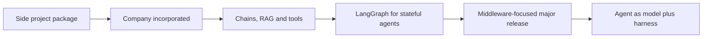

# LangChain: What It Is, How It Evolved, How It Compares

> Created by **Harrison Chase** — [https://www.langchain.com](https://www.langchain.com)

## Overview

LangChain is an open-source orchestration framework for building applications on large language models, available in Python and JavaScript. It gives developers standard interfaces for models, prompts, retrievers, tools and memory so those pieces can be swapped and composed instead of rewritten for each project. In [his own retrospective on the project](https://langchain.com/blog/three-years-langchain), Harrison Chase does not offer a formal definition; he describes pushing the first lines of code to an open-source package that captured patterns he kept seeing people use when building with language models. That framing is still the most useful one: LangChain is a library of recurring LLM application patterns, not a model or a hosted service.

The origin is modest. Chase wrote that LangChain [launched as a single, roughly 800-line Python package in fall 2022 from his personal GitHub account, hwchase17, as a side project](https://frenxt.com/cables/claude-code/chase-01-langchain-origin), inspired by meetups where a few people were building experimental things with language models. One history places the [first GitHub release in October 2022, about six weeks before OpenAI launched ChatGPT on November 30, 2022](https://taskade.com/blog/langchain-history), which pushed a wave of developers toward exactly the problems the package addressed. LangChain was [incorporated as a company in January 2023](https://frederick.ai/blog/harrison-chase-langchain), and by October 2025 it had announced a [$125M Series B at a $1.25B valuation](https://linkedin.com/posts/harrison-chase-961287118_today-were-excited-to-announce-new-funding-activity-7386446903250608128-vWzN).

Over that period the scope widened from a thin package into a framework covering [chains, RAG, vector stores and tool use, with LangGraph adding stateful multi-agent workflows](https://developersdigest.tech/blog/pizza-bot-agent-inbox-background-work). The 1.0 release then narrowed the core: according to [one 2026 comparison](https://analyticsinsight.net/artificial-intelligence/langgraph-vs-langchain-which-ai-agent-framework-should-you-choose), LangChain reduced its package surface, moved older features into langchain-classic, refocused the 1.x line on the agent loop and middleware, and began requiring Python 3.10 ([source](https://analyticsinsight.net/artificial-intelligence/langgraph-vs-langchain-which-ai-agent-framework-should-you-choose)) or newer. The current docs express this as [Agent = Model + Harness](https://docs.langchain.com/oss/python/langchain/agents), where the harness is the prompt, tools and middleware around the loop.

The most common adoption question is how LangChain compares with LlamaIndex and Haystack. The evidence is practitioner testing, not a standardized benchmark, and setups differ between frameworks, so treat the figures below as directional.

| Framework | Best-fit use | Tokens per query | Top-5 retrieval precision | Time to working pipeline |
|---|---|---|---|---|
| LangChain | [Multi-step, tool-using agents](https://ovaledge.com/blog/rag-frameworks) | [2,400](https://checkthat.ai/brands/langchain/alternatives) | [71%, default splitter](https://dev.to/synsun/langchain-vs-llamaindex-vs-haystack-what-two-weeks-in-production-actually-taught-me-1kl6) | [3 days](https://dev.to/synsun/langchain-vs-llamaindex-vs-haystack-what-two-weeks-in-production-actually-taught-me-1kl6) |
| LlamaIndex | [Document-heavy Q&A](https://ovaledge.com/blog/rag-frameworks) | [1,600](https://checkthat.ai/brands/langchain/alternatives) | [84%, with reranking](https://dev.to/synsun/langchain-vs-llamaindex-vs-haystack-what-two-weeks-in-production-actually-taught-me-1kl6) | [4.5 days](https://dev.to/synsun/langchain-vs-llamaindex-vs-haystack-what-two-weeks-in-production-actually-taught-me-1kl6) ([source](https://checkthat.ai/brands/langchain/alternatives)) |
| Haystack | [Inspectable, auditable pipelines](https://ovaledge.com/blog/rag-frameworks) | [1,570](https://checkthat.ai/brands/langchain/alternatives) | [82%, hybrid plus reranking](https://dev.to/synsun/langchain-vs-llamaindex-vs-haystack-what-two-weeks-in-production-actually-taught-me-1kl6) | [4 days](https://dev.to/synsun/langchain-vs-llamaindex-vs-haystack-what-two-weeks-in-production-actually-taught-me-1kl6) |

Note that the precision test ran LangChain with default settings and the others with reranking, so the gap says as much about configuration as about framework. The pattern across sources is consistent, though: [LlamaIndex wins on speed through proven defaults, while LangChain wins on control because you wire each component explicitly](https://learnwithparam.com/blog/choosing-rag-framework-langchain-llamaindex-haystack).

The criticisms are just as consistent. Practitioners cite [too many abstractions, dependency bloat, fast-changing APIs, documentation drift, hidden control flow and debugging friction](https://designveloper.com/blog/is-langchain-bad). A [2026 paper on LangChain in production](https://aijcst.org/index.php/aijcst/article/download/298/280) found high orchestration cost under concurrency, especially for sequential reasoning, external API calls and dynamic tool selection, and flagged limited native observability and nondeterministic execution as obstacles to debugging. At the anecdotal end, [one developer reported cutting API latency by 1.3 seconds by removing LangChain's memory wrapper](https://linkedin.com/posts/leadgenmanthan_never-use-langchain-in-production-45-of-activity-7367864422226112513-tMI4). Widely shared adoption statistics exist, but [the surveys behind them](https://zipdo.co/langchain-statistics) come without enough detail on populations or sampling to rely on.

The practical reading: LangChain earns its overhead when your application needs many integrations, tool calls and multi-step control, and costs you when a simple retrieval or single prompt would do. The skills that make up the method are covered separately, starting with [designing autonomous agents](https://tryhamster.com/skills/designing-autonomous-agents) and [managing memory and conversation state](https://tryhamster.com/skills/managing-memory-and-conversation-state). Hamster Studio lists each of these skills as its own page so a team can assign, practice and review them one at a time.

## Core Principles

### Encode recurring patterns, not one-off code

LangChain began as an attempt to capture [development patterns Chase kept seeing](https://langchain.com/blog/three-years-langchain) in reusable open-source code. Use it the same way: reach for a component when your problem matches a known pattern such as retrieval, tool calling or summarization. If you find yourself fighting an abstraction to express something simple, that is a sign the pattern does not fit and plain code may be clearer.

### An agent is the model plus its harness

LangChain's docs define [Agent = Model + Harness](https://docs.langchain.com/oss/python/langchain/agents), where the harness is the prompt, tools and middleware, and its job is to get the model the right context at the right time. Treating the model alone as the agent leads to swapping models to fix problems that actually live in the prompt, tool descriptions or context flow. When an agent misbehaves, inspect the harness first.

### Start with the smallest useful harness

The recommended entry point is [create_agent as a minimal harness, extended incrementally through middleware](https://docs.langchain.com/oss/python/langchain/overview) for guardrails, retries or routing. Each added layer is more control flow you have to debug, which is exactly what critics complain about. Add a capability only when a concrete failure or requirement calls for it, and you keep the stack explainable.

### Draw a hard line between prompt and tools

Operations the model should be able to perform belong in [tools that let agents fetch real-time data, execute code, query databases and act in external systems](https://docs.langchain.com/oss/python/langchain/tools), each with a clear description and schema. The prompt describes the task and constraints; it should not try to simulate an API with instructions. Tool errors are handled in middleware, so failures become recoverable events rather than confusing text in the prompt.

### Separate short-term state from long-term memory

LangChain's context-engineering guide distinguishes [short-term memory, such as messages, files and tool results within a conversation, from long-term memory such as user preferences and extracted insights stored across conversations](https://docs.langchain.com/oss/python/langchain/context-engineering). Mixing the two either bloats every prompt with history or loses facts the user expects to be remembered. Decide deliberately what deserves persistence and retrieve it only when relevant.

### Keep the active context focused

Middleware can [hook into any lifecycle step to update context or jump to another step](https://docs.langchain.com/oss/python/langchain/context-engineering), which makes it the main tool for controlling what the model sees. For specialized work, [subagents isolate a delegated task's context](https://docs.langchain.com/oss/python/langchain/middleware/built-in) so the main agent's window stays clean. Unbounded context growth is one of the fastest ways to degrade quality and raise cost.

### Measure before you trust the abstraction

Performance claims about LangChain come from [practitioner tests](https://checkthat.ai/brands/langchain/alternatives) and a [production-focused paper](https://aijcst.org/index.php/aijcst/article/download/298/280), not a shared benchmark, and they show real overhead in some setups. Build a test harness for retrieval accuracy and hallucination early, because [RAG and agents fail silently without one](https://genai.qa/blog/haystack-vs-langchain). Measure your own latency and token use before and after each layer you add.

## Steps

1. **Define the application shape**
   Write down whether you are building a chain, a RAG pipeline or an agent, and list the external systems it must touch. This decides which parts of LangChain you need and which you can ignore. A fixed sequence of steps usually needs a chain; open-ended tasks with tool choice need an agent. If you cannot name at least one tool or data source, question whether you need a framework at all.

2. **Configure the model provider**
   Keep the provider and model identifier in configuration and pass either a chat model instance or an identifier string into your components. This keeps model swaps out of application code and makes cost and quality comparisons cheap. Test the bare model on a few representative inputs before adding anything else, so you have a baseline. The details are on the [configuring LLM providers and models](https://tryhamster.com/skills/configuring-llm-providers-and-models) skill page.

3. **Build the minimal harness**
   Start with a model, a prompt and the smallest set of tools that covers the task, using the framework's basic agent constructor. Write each tool with a precise description and argument schema, since the model chooses tools from those descriptions. Run the loop end to end on real inputs and read the full message trace. See [integrating external tools and APIs](https://tryhamster.com/skills/integrating-external-tools-and-apis) for the tool contract.

4. **Add retrieval where knowledge is missing**
   If the model lacks the facts it needs, load and split your source documents and wire a retriever over a vector store. Chunking choices drive retrieval quality, so treat the splitter as a tunable component rather than a default. Check whether the right document appears in the top results before judging generated answers. The [RAG pipeline skill](https://tryhamster.com/skills/building-rag-pipelines-with-langchain) covers this in depth.

5. **Design memory deliberately**
   Decide what lives in thread-scoped conversation state and what gets persisted across conversations. Configure persistence explicitly, since defining an agent does not by itself retain history across runs. Choose between trimming old messages and summarizing them based on whether exact recall matters. Store durable facts separately and retrieve them into context only when relevant.

6. **Add middleware for real failures**
   Once the minimal version works, add middleware only for problems you have observed: tool errors, runaway context, routing needs or guardrails. Each addition should map to a specific failure in your trace. If you cannot name the failure a layer fixes, leave it out. This keeps the control flow readable when you debug later.

7. **Evaluate and profile before shipping**
   Build a small evaluation set covering retrieval accuracy, faithfulness and tool-call correctness, and run it on every change. Profile latency and token use per request, since overhead can hide inside wrappers. Compare against a stripped-down direct implementation for your hottest path. If the framework version is clearly slower with no quality gain, replace that path with plain code.

## When to Use

- You are building an agent that calls several tools or external APIs in sequence, because multi-step, tool-using agents are where comparisons consistently place LangChain's strength.
- Your application needs to connect to many vector stores, model providers or data sources, since the integration breadth saves you writing and maintaining adapters.
- You expect to swap models or providers over time and want that change to live in configuration rather than in application logic.
- You need fine-grained control over each step of a pipeline, such as custom context injection, retries or routing, which middleware exposes at every lifecycle stage.
- Your workflow will grow into stateful or multi-agent behavior, since LangGraph extends the same ecosystem rather than forcing a rewrite.

## When Not to Use

- Your app is a single prompt or a thin wrapper over one model call, because the abstraction layers add dependencies and debugging surface with no payoff.
- Your core problem is document-heavy question answering and retrieval accuracy, where LlamaIndex's defaults for loading, chunking and reranking may get you further with less wiring.
- You operate under high concurrency with strict latency budgets and cannot afford orchestration overhead without first profiling it against a direct implementation.
- You need fully explicit, auditable pipelines for compliance review, where a framework oriented toward inspectable pipelines, such as Haystack, may be easier to defend.

## Skills

This method includes the following skills:

- [Designing Autonomous Agents with LangChain](skills/designing-autonomous-agents/SKILL.md) — How to build agents that use reasoning, tool selection, and memory to autonomously complete complex tasks using LangChain's agent framework.
- [Building RAG Pipelines with LangChain](skills/building-rag-pipelines-with-langchain/SKILL.md) — How to implement retrieval-augmented generation by connecting vector stores, document loaders, and LLMs to answer questions from custom data sources.
- [Managing Memory and Conversation State in LangChain](skills/managing-memory-and-conversation-state/SKILL.md) — How to implement different memory types—buffer, summary, and vector-backed—to maintain context across multi-turn conversations and long-running sessions.
- [Chaining Prompts and Composing LLM Workflows](skills/chaining-prompts-and-composing-workflows/SKILL.md) — How to use LangChain's chain abstractions \(including LCEL\) to sequence multiple LLM calls, transformations, and logic into multi-step workflows.
- [Configuring LLM Providers and Models in LangChain](skills/configuring-llm-providers-and-models/SKILL.md) — How to set up and swap between different LLM providers like OpenAI, Anthropic, and open-source models using LangChain's standardized model interfaces.
- [Integrating External Tools and APIs into LangChain](skills/integrating-external-tools-and-apis/SKILL.md) — How to connect LangChain applications with external services, databases, search engines, and custom APIs using built-in and custom tool integrations.
- [Loading and Splitting Documents for LLM Processing](skills/loading-and-splitting-documents/SKILL.md) — How to use LangChain's document loaders and text splitters to ingest, chunk, and prepare diverse data formats for embedding and retrieval.
- [Crafting Reusable Prompt Templates in LangChain](skills/crafting-prompt-templates/SKILL.md) — How to design, parameterize, and manage prompt templates including few-shot examples and dynamic variable injection for consistent LLM interactions.

## FAQ

**Who created LangChain and when?**

Harrison Chase created LangChain, [pushing the first lines of code as an open-source package](https://langchain.com/blog/three-years-langchain) almost exactly three years before his October 20, 2025 retrospective. He described it as a [roughly 800-line side project released in fall 2022](https://frenxt.com/cables/claude-code/chase-01-langchain-origin). The company was incorporated in January 2023.

**What changed in LangChain 1.0?**

The 1.0 release [reduced the package surface and moved older features into langchain-classic](https://analyticsinsight.net/artificial-intelligence/langgraph-vs-langchain-which-ai-agent-framework-should-you-choose), with the 1.x line focused on the agent loop and middleware. It also requires Python 3.10 ([source](https://analyticsinsight.net/artificial-intelligence/langgraph-vs-langchain-which-ai-agent-framework-should-you-choose)) or newer. If you learned LangChain from older tutorials, expect agent constructors and memory classes to have moved or been replaced.

**What is the difference between LangChain and LangGraph?**

LangChain provides the components and the standard agent harness, while LangGraph [adds stateful multi-agent workflows](https://developersdigest.tech/blog/pizza-bot-agent-inbox-background-work) with [durable, resumable state](https://ovaledge.com/blog/rag-frameworks). Use LangChain alone for linear chains and single agents. Move to LangGraph when you need explicit branching, long-running state or several cooperating agents.

**Is LangChain slower or more expensive than alternatives?**

Some practitioner tests say yes: one reported [2,400 tokens per query for LangChain versus 1,600 for LlamaIndex and 1,570 for Haystack](https://checkthat.ai/brands/langchain/alternatives). A [2026 paper](https://aijcst.org/index.php/aijcst/article/download/298/280) found high orchestration cost under concurrency. These are not standardized benchmarks, so profile your own workload before deciding.

**Should I use LangChain or LlamaIndex for RAG?**

It depends on where your difficulty lies. Comparisons describe [LlamaIndex as faster thanks to proven defaults for loading, chunking and embedding, and LangChain as offering more control through explicit wiring](https://learnwithparam.com/blog/choosing-rag-framework-langchain-llamaindex-haystack). If retrieval over messy documents is the whole product, start with LlamaIndex; if retrieval is one step inside a tool-using agent, LangChain fits better.

**Why do developers criticize LangChain?**

Common complaints are [too many abstractions, dependency bloat, fast-changing APIs, documentation drift, hidden control flow and debugging friction](https://designveloper.com/blog/is-langchain-bad). Many of these stem from the framework's rapid growth and its breadth of integrations. For example, the 1.0 shift toward a smaller core with middleware is partly a response, but you should still pin versions and read traces closely.

**How does LangChain handle memory?**

The docs separate [short-term memory scoped to one conversation from long-term memory such as preferences and insights stored across conversations](https://docs.langchain.com/oss/python/langchain/context-engineering). Short-term history can be trimmed to a recent window or summarized, and summaries are lossy. Durable facts should be stored separately and retrieved into context when needed.

## Sources

- [What We Actually Do With](https://frenxt.com/cables/claude-code/chase-01-langchain-origin)
- [What Is LangChain? Complete History \& LangGraph Guide \(2026\)](https://taskade.com/blog/langchain-history)
- [Leadership Philosophy](https://frederick.ai/blog/harrison-chase-langchain)
- [LangChain raises $1.25B, launches new features and products](https://linkedin.com/posts/harrison-chase-961287118_today-were-excited-to-announce-new-funding-activity-7386446903250608128-vWzN)
- [LangGraph vs LangChain: Which AI Agent Framework Should You Choose?](https://analyticsinsight.net/artificial-intelligence/langgraph-vs-langchain-which-ai-agent-framework-should-you-choose)
- [Reflections on Three Years of Building LangChain](https://langchain.com/blog/three-years-langchain)
- [Pizza Bot Shows Why Background Agents Need Inboxes](https://developersdigest.tech/blog/pizza-bot-agent-inbox-background-work)
- [Best RAG Frameworks for Enterprise Pipelines \(2026\)](https://ovaledge.com/blog/rag-frameworks)
- [Dependency Bloat And Extra](https://designveloper.com/blog/is-langchain-bad)
- [Choosing your RAG framework: LangChain vs. LlamaIndex vs](https://learnwithparam.com/blog/choosing-rag-framework-langchain-llamaindex-haystack)
- [LangChain Alternatives 2026: Top 5 Competitors Compared](https://checkthat.ai/brands/langchain/alternatives)
- [Never Use Langchain in Production \| Manthan Patel - LinkedIn](https://linkedin.com/posts/leadgenmanthan_never-use-langchain-in-production-45-of-activity-7367864422226112513-tMI4)
- [100+ Langchain Statistics \| Source-Cited 2026 - ZipDo](https://zipdo.co/langchain-statistics)
- [\[PDF\] Assessing the Limitations of LangChain in Production Environments](https://aijcst.org/index.php/aijcst/article/download/298/280)
- [Haystack vs LangChain \(2026\): Pick the Right LLM Framework](https://genai.qa/blog/haystack-vs-langchain)
- [LangChain vs LlamaIndex vs Haystack: What Two Weeks in](https://dev.to/synsun/langchain-vs-llamaindex-vs-haystack-what-two-weeks-in-production-actually-taught-me-1kl6)
- [Context engineering in agents - Docs by LangChain](https://docs.langchain.com/oss/python/langchain/context-engineering)
- [tools](https://docs.langchain.com/oss/python/langchain/tools)
- [Configure the harness](https://docs.langchain.com/oss/python/langchain/agents)
- [Prebuilt middleware - Docs by LangChain](https://docs.langchain.com/oss/python/langchain/middleware/built-in)
- [overview](https://docs.langchain.com/oss/python/langchain/overview)

---

*[Import this method into Hamster](https://tryhamster.com) to share it with your team, customize it for your workflow, and let AI agents use it automatically.*
