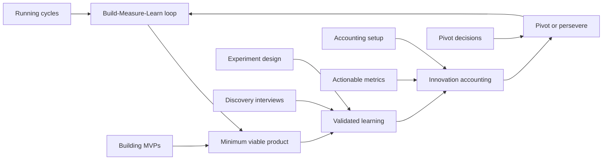

# The Lean Startup Framework for the Product Manager

> Created by **Eric Ries** — [https://theleanstartup.com](https://theleanstartup.com)

## Overview

The Lean Startup Framework is a way of building products under uncertainty by treating each idea as something to test rather than something to execute. The [Lean Enterprise Institute defines it](https://lean.org/lexicon-terms/lean-startup) as a methodology that treats ideas for launching businesses and products as hypotheses that must be validated by rapid experimentation in the marketplace. Eric Ries describes a startup as "a human institution designed to create a new product or service under conditions of extreme uncertainty" in [his canonical definition](https://mooncamp.com/blog/the-lean-startup-book-summary), which is why the framework fits a new product line inside a large company as well as a new venture. For a product manager, the practical shift is in what counts as progress: [the book's core summary](https://alumni.lincolncollege.ac.uk/files/2016/11/The-Lean-Startup-by-Eric-Ries-Book-Summary.pdf) says the fundamental activity is to turn ideas into products, measure how customers respond, and then learn whether to pivot or persevere.

Ries coined the term in a post titled "The lean startup" on his blog Startup Lessons Learned on 8 September 2008, as [the Wikipedia history of the method records](https://en.wikipedia.org/wiki/Lean_startup). The ideas grew out of his work as [co-founder and CTO of IMVU](https://steveblank.com/2015/07/07/episode-2-on-sirius-xm-channel-111-eric-ries-and-jon-sebastiani), and [Wharton's interview with Ries](https://knowledge.wharton.upenn.edu/article/eric-ries-on-the-lean-startup) describes the result as the application of lean manufacturing practices, and lean thinking generally, to the process of innovation, with Steve Blank's customer development work as a further influence. The first widely documented version was therefore a blog post, not a book: Ries expanded it into The Lean Startup, which [the Lean Enterprise Institute dates to 2011](https://lean.org/lexicon-terms/lean-startup). Since then, [the official Lean Startup site](https://theleanstartup.com) has presented it as a movement for transforming how new products and businesses are created, well beyond early-stage startups.

The method is usually summarized as [five core components](https://libraryofllm.com/sources/lean-startup-principles): the Build-Measure-Learn feedback loop, the minimum viable product, validated learning, innovation accounting, and the pivot-or-persevere decision. The map below shows how they feed each other and which skill trains each one: [running Build-Measure-Learn cycles](https://tryhamster.com/skills/running-build-measure-learn-cycles), [building minimum viable products](https://tryhamster.com/skills/building-minimum-viable-products), [designing validated learning experiments](https://tryhamster.com/skills/designing-validated-learning-experiments), [conducting customer discovery interviews](https://tryhamster.com/skills/conducting-customer-discovery-interviews), [setting up innovation accounting](https://tryhamster.com/skills/setting-up-innovation-accounting), [choosing actionable over vanity metrics](https://tryhamster.com/skills/choosing-actionable-over-vanity-metrics) and [making pivot-or-persevere decisions](https://tryhamster.com/skills/identifying-pivot-or-persevere-decisions).

The framework is often positioned against the traditional business plan, which commits to a forecast before customers have seen anything. The evidence favors combining the two more than replacing one with the other. A [2015 comparative study of mobile startups](https://scitepress.org/PublishedPapers/2015/53375) found that Business Model Design combined with a Lean Startup approach outperformed a traditional business plan in the cases analyzed, but its conclusion concerned the combination, not Lean Startup alone. The study [The Road to Entrepreneurial Success: Business Plans, Lean Startup, or Both?](https://digitalcommons.sacredheart.edu/cgi/viewcontent.cgi?article=1416&context=neje) found that talking to customers, collecting preorders and pivoting on customer feedback correlated with performance, and that writing a business plan was the only planning activity that did. A workable reading: write the plan, then treat its riskiest lines as hypotheses.

The empirical record is mixed, which matters before you promise stakeholders results.

| Study | Sample | Finding |
|---|---|---|
| 2015 BMD comparison | Mobile startup cases | [BMD plus Lean Startup beat a traditional plan](https://scitepress.org/PublishedPapers/2015/53375) |
| 2018 mobile startup survey | Survey of 272 mobile startups | [62% called the MVP vital, 82% saw MVP design as a drawback](https://hilarispublisher.com/open-access/lean-startup-as-an-entrepreneurial-strategy-limitations-outcomes-and-learnings-for-practitioners-52478.html) |
| Norwegian survey, Nilsen and Ramm | High-tech startups | [No significant link between use and success, r=0.091, p=0.542](https://gavinpublishers.com/article/view/the-limits-to-lean-startup-for-opportunity-identification-and-new-venture-creation) |
| 2025 debate article | Recent studies reviewed | [Training linked to growth, A/B tests lifted visits 10-100%](https://tandfonline.com/doi/full/10.1080/13662716.2025.2476431) |

A [2019 review of the method's limits](https://gavinpublishers.com/article/view/the-limits-to-lean-startup-for-opportunity-identification-and-new-venture-creation) reported inconsistent implementation and concluded the evidence did not establish Lean Startup as unequivocally successful, citing Heitmann's finding of little evidence either supporting or rejecting it. That review also argued it may not support breakthrough ventures and gives limited attention to marketing, sales and growth. [Other reviews](https://hilarispublisher.com/open-access/lean-startup-as-an-entrepreneurial-strategy-limitations-outcomes-and-learnings-for-practitioners.pdf) note it mainly addresses market uncertainty, not technological risk. The say-versus-do problem cuts both ways: the method prefers [experiments on real behavior over feature requests, surveys or focus groups](https://tessl.io/registry/skills/github/wondelai/skills/lean-startup), yet the customer discovery feeding those experiments can be skewed by [biased customer selection and biased responses](https://hilarispublisher.com/open-access/lean-startup-as-an-entrepreneurial-strategy-limitations-outcomes-and-learnings-for-practitioners.pdf). Hamster Studio is one place a team can keep assumptions, experiments and pivot decisions side by side so the learning survives the next planning cycle.

## Core Principles

### Treat every idea as a hypothesis

The [Lean Enterprise Institute](https://lean.org/lexicon-terms/lean-startup) frames the method around ideas that must be validated by rapid experimentation in the marketplace. For a product manager, that means a roadmap item is a bet with a stated expected outcome, not a commitment. Writing the bet down forces you to say what customer behavior would prove it wrong. If nobody on the team can name that behavior, the idea is not ready to build.

### Count validated learning, not output

The method's [publisher describes](https://penguinrandomhouse.com/books/210088/the-lean-startup-by-eric-ries) validated learning and rapid scientific experimentation as its foundation. A [book summary](https://mooncamp.com/blog/the-lean-startup-book-summary) puts it plainly: progress means demonstrating empirically that you learned something true, not shipping features. Velocity charts and release counts can rise while the team learns nothing about customers. A sprint review that cannot name one belief that changed is a warning sign.

### Test the riskiest assumption first

The [Lean Startup Co. process](https://leanstartup.co/resources/articles/lean-startup-method) moves from listing assumptions to homing in on the one that carries the biggest risk. Risk here combines uncertainty with consequence: an assumption that would sink the product if false and that nobody has evidence for. Testing a safe assumption first feels productive but spends a cycle confirming what you already knew. Rank before you build.

### Build only what the test needs

The [official principles page](https://theleanstartup.com/principles) says the MVP exists to begin the process of learning as quickly as possible. Anything that does not help answer the current question is waste at this stage, however good it would be later. Manual delivery, rough screens and mocked back ends are all legitimate if they produce the evidence. Over-building shows up as long lead times before the first customer touches anything.

### Measure behavior with actionable metrics

The method favors actionable, accessible and auditable metrics over vanity metrics, as [this summary of the book](https://mooncamp.com/blog/the-lean-startup-book-summary) explains. Cumulative signups or page views can climb while retention stays flat, so they rarely drive a decision. Prefer measures such as cohort conversion or repeat use that show cause and effect. Observed behavior outranks what customers say they would do.

### End every loop with a decision

Ries's formulation, per [the book summary](https://alumni.lincolncollege.ac.uk/files/2016/11/The-Lean-Startup-by-Eric-Ries-Book-Summary.pdf), is that each turn of the loop ends in learning whether to pivot or persevere. Data without a decision is just reporting. Set the pivot criteria before results arrive, so weak numbers cannot be explained away afterward. An inconclusive result is also a decision: redesign the test and run it again.

### Rigor decides whether it works

A [review of Lean Startup research](https://hilarispublisher.com/open-access/status-of-the-lean-startup-methodology-2021-from-theoretical-foundations-to-practice-experience-and-current-academic-dis.pdf) found mixed performance results, with the one significant study emphasizing a rigorous approach. [Other reviews](https://hilarispublisher.com/open-access/lean-startup-as-an-entrepreneurial-strategy-limitations-outcomes-and-learnings-for-practitioners.pdf) call experimentation, pivoting and MVP design implementation-sensitive. Adopting the vocabulary without falsifiable hypotheses, real customers and pre-set thresholds gives you the ritual without the benefit. Audit your experiments, not just your cadence.

## Steps

1. **Frame the problem and list assumptions**
   The [official principles](https://theleanstartup.com/principles) start with figuring out the problem that needs to be solved. Write down every belief that must be true for the product to work: target customer, problem, solution, acquisition channel, pricing and revenue model, the categories [Umbrex's guide](https://umbrex.com/resources/frameworks/organization-frameworks/lean-startup-build-measure-learn-loop) lists. The output is a short, explicit assumption list the whole team can see. If the list reads like a feature backlog, you have described solutions, not beliefs about customers.

2. **Pick the riskiest assumption**
   Rank the list by how uncertain each belief is and how badly the product fails if it is false. The [Lean Startup Co. process](https://leanstartup.co/resources/articles/lean-startup-method) then homes in on the assumption carrying the biggest risk. Choose one, not three, so the next test has a single question. A common failure, per this analysis, is testing a comfortable assumption instead of the one most able to disprove the idea.

3. **Write a falsifiable hypothesis and threshold**
   Turn the assumption into a prediction about observable behavior from a named customer group. Set the success metric and decision threshold before launch, as [Umbrex recommends](https://umbrex.com/resources/frameworks/organization-frameworks/lean-startup-build-measure-learn-loop), so the standard cannot drift after results arrive. For example, you might state that a set share of invited teams will complete a paid trial within two weeks. The [experiment design skill](https://tryhamster.com/skills/designing-validated-learning-experiments) covers this in depth.

4. **Build the smallest test**
   Design the MVP backward from the hypothesis and exclude every feature that does not help test it. A concierge MVP, where the team delivers the value manually, is often enough, and [Umbrex notes](https://umbrex.com/resources/frameworks/organization-frameworks/lean-startup-build-measure-learn-loop) it suits cases where value can be hand-delivered before automation. Instrument it so the metric you chose is captured automatically. See [building minimum viable products](https://tryhamster.com/skills/building-minimum-viable-products) for MVP types and scoping.

5. **Run it with real customers and measure**
   Put the test in front of the customers named in the hypothesis, not colleagues or friends. Track what they do, using actionable metrics rather than the cumulative totals [this framework guide](https://realgrowthmatters.com/learn/frameworks/lean-startup-build-measure-learn) calls vanity metrics. Break results out by cohort so you compare groups over time instead of watching an aggregate rise. If the only evidence is interview enthusiasm, you have measured stated intent, not demand.

6. **Decide to pivot, persevere or retest**
   Compare the evidence with the threshold you set in advance. If it supports the hypothesis, persevere; if it contradicts it, pivot while keeping what you learned; if it is inconclusive, fix the test and repeat, the three outcomes this analysis describes. Record the decision and the reasoning next to the hypothesis. The [pivot-or-persevere skill](https://tryhamster.com/skills/identifying-pivot-or-persevere-decisions) covers criteria and rationalization traps.

7. **Plan the next loop in reverse**
   Start the next cycle from what you now need to learn, then work back to what to measure and build, the reverse planning [this book summary](https://mooncamp.com/blog/the-lean-startup-book-summary) describes. Track each cycle against the behavioral baseline from your first MVP rather than a forecast. Keep cycles short, for example a two-week time box, so learning compounds. [Setting up innovation accounting](https://tryhamster.com/skills/setting-up-innovation-accounting) shows how to report this progress to stakeholders.

## When to Use

- You are launching a new product or entering a new segment where nobody has evidence about customer demand, because the method is built for decisions under extreme uncertainty about the market.
- Your roadmap is driven by stakeholder opinion or a business-plan forecast, and you need a way to replace projections with a baseline of real customer behavior.
- You can put a cheap version of the value in front of real target customers within days or weeks, so learning cycles stay short enough to change direction.
- A proposed feature is expensive to build and rests on one untested belief, such as willingness to pay, which a small test can check before engineering commits.
- You need to show progress to leadership before revenue exists, and validated learning gives a defensible account of what the team now knows.
- An established company is running an innovation program and wants a shared discipline for testing new product ideas without full-scale investment.

## When Not to Use

- The main risk is technical feasibility rather than demand, since [reviews note](https://hilarispublisher.com/open-access/lean-startup-as-an-entrepreneurial-strategy-limitations-outcomes-and-learnings-for-practitioners.pdf) the method primarily addresses market uncertainty and may not resolve technological risk.
- The product has found its market and is scaling, where a [2024 report](https://journalijar.com/uploads/2024/10/673c43eebb238_IJAR-48962.pdf) found a more structured approach becomes important.
- Regulation, safety or contracts make releasing an incomplete product to real customers unacceptable, because the loop depends on exposing experiments to the market.
- You are pursuing a breakthrough venture whose customers cannot yet judge it, a case where the [2019 review](https://gavinpublishers.com/article/view/the-limits-to-lean-startup-for-opportunity-identification-and-new-venture-creation) questions whether the method can help.

## Skills

This method includes the following skills:

- [Making Pivot-or-Persevere Decisions](skills/identifying-pivot-or-persevere-decisions/SKILL.md) — How to use experiment data and innovation accounting to determine whether to pivot your strategy or persevere with the current approach.
- [Running Build-Measure-Learn Cycles](skills/running-build-measure-learn-cycles/SKILL.md) — How to execute rapid iteration loops that move from building a product increment to measuring results to learning actionable insights.
- [Building Minimum Viable Products \(MVPs\)](skills/building-minimum-viable-products/SKILL.md) — How to design and build the smallest possible version of a product that allows you to test core business hypotheses with real customers.
- [Setting Up Innovation Accounting](skills/setting-up-innovation-accounting/SKILL.md) — How to define actionable metrics and milestones that measure real startup progress instead of relying on vanity metrics.
- [Conducting Customer Discovery Interviews](skills/conducting-customer-discovery-interviews/SKILL.md) — How to systematically interview potential customers to validate problem-solution fit and uncover unmet needs before building features.
- [Choosing Actionable Over Vanity Metrics](skills/choosing-actionable-over-vanity-metrics/SKILL.md) — How to distinguish between vanity metrics that look impressive and actionable metrics that drive real business decisions in a lean startup.
- [Designing Validated Learning Experiments](skills/designing-validated-learning-experiments/SKILL.md) — How to formulate testable business hypotheses and design experiments that produce validated learning about customer behavior and market demand.

## FAQ

**Who created the Lean Startup framework?**

Eric Ries coined the term in a September 2008 post on his blog Startup Lessons Learned, according to [the Wikipedia history](https://en.wikipedia.org/wiki/Lean_startup). He drew on his experience as co-founder and CTO of IMVU and on lean manufacturing ideas. The [Lean Enterprise Institute](https://lean.org/lexicon-terms/lean-startup) notes he published the book The Lean Startup in 2011.

**Is Lean Startup only for startups?**

No. Ries defines a startup by uncertainty, not size, so a new product inside an established company qualifies. The [official Lean Startup site](https://theleanstartup.com) presents it as a broad movement for creating new products and businesses. The fit weakens once a product has found its market and the main work becomes scaling.

**Is there evidence that Lean Startup works?**

The evidence is mixed. A [2025 debate article](https://tandfonline.com/doi/full/10.1080/13662716.2025.2476431) cites initial evidence that Lean Startup training is linked to greater venture growth. A [2019 review](https://gavinpublishers.com/article/view/the-limits-to-lean-startup-for-opportunity-identification-and-new-venture-creation) concluded the evidence did not establish it as unequivocally successful. Several reviews point to implementation rigor as the deciding factor.

**Should a product manager drop the business plan?**

Not necessarily. A study of business plans and Lean Startup found that writing a business plan was the only planning activity correlated with performance. The [2015 mobile startup comparison](https://scitepress.org/PublishedPapers/2015/53375) favored combining Business Model Design with Lean Startup. Use the plan to surface assumptions, then test them.

**How is an MVP different from a first release?**

A first release aims to be usable and complete enough to sell. An MVP aims to answer one question with the least effort, which is why [the official principles](https://theleanstartup.com/principles) describe it as a way to begin learning as quickly as possible. It can be a landing page, a manual service or a rough prototype. If you cannot name the hypothesis it tests, it is a release, not an MVP.

**Can customer interviews replace experiments?**

They complement experiments but cannot replace them. The method prefers [experiments on real behavior over surveys and focus groups](https://tessl.io/registry/skills/github/wondelai/skills/lean-startup), because stated intentions often differ from actions. Interviews are useful for finding problems and forming hypotheses. They are also prone to [biased selection and biased answers](https://hilarispublisher.com/open-access/lean-startup-as-an-entrepreneurial-strategy-limitations-outcomes-and-learnings-for-practitioners.pdf), so recruit carefully.

**Why do teams struggle with MVPs?**

Scoping is hard. In a survey of mobile startups, [62% called the MVP vital while 82% named defining and designing it a disadvantage](https://hilarispublisher.com/open-access/lean-startup-as-an-entrepreneurial-strategy-limitations-outcomes-and-learnings-for-practitioners-52478.html). The usual cause is starting from features instead of from one hypothesis. Tie every element of the MVP to the question it answers.

## Sources

- [Eric Ries on 'The Lean Startup'](https://knowledge.wharton.upenn.edu/article/eric-ries-on-the-lean-startup)
- [Lean startup - Wikipedia](https://en.wikipedia.org/wiki/Lean_startup)
- [The Lean Startup by Eric Ries: 9780307887894](https://penguinrandomhouse.com/books/210088/the-lean-startup-by-eric-ries)
- [\[PDF\] The Lean Startup by Eric Ries Book Summary](https://alumni.lincolncollege.ac.uk/files/2016/11/The-Lean-Startup-by-Eric-Ries-Book-Summary.pdf)
- [Hear how the Lean Startup began — and helped one company find](https://steveblank.com/2015/07/07/episode-2-on-sirius-xm-channel-111-eric-ries-and-jon-sebastiani)
- [The Lean Startup \| The Movement That Is Transforming How New](https://theleanstartup.com)
- [The Lean Startup Book Summary: 7 Key Takeaways](https://mooncamp.com/blog/the-lean-startup-book-summary)
- [Lean Startup - Lean Enterprise Institute](https://lean.org/lexicon-terms/lean-startup)
- [The Limits to Lean Startup for Opportunity Identification and New](https://gavinpublishers.com/article/view/the-limits-to-lean-startup-for-opportunity-identification-and-new-venture-creation)
- [The Road to Entrepreneurial Success: Business Plans, Lean Startup, or Both?](https://digitalcommons.sacredheart.edu/cgi/viewcontent.cgi?article=1416&context=neje)
- [Lean Startup as an Entrepreneurial Strategy: Limitations, Outcomes an](https://hilarispublisher.com/open-access/lean-startup-as-an-entrepreneurial-strategy-limitations-outcomes-and-learnings-for-practitioners.pdf)
- [A debate: does Lean Startup represent a giant leap?](https://tandfonline.com/doi/full/10.1080/13662716.2025.2476431)
- [Status of the Lean Startup Methodology \(2020\)](https://hilarispublisher.com/open-access/status-of-the-lean-startup-methodology-2021-from-theoretical-foundations-to-practice-experience-and-current-academic-dis.pdf)
- [A Comparative Study on the Impact of Business Model Design \& Lean Startup Approach versus Traditional Business Plan on Mobile Startups Performance](https://scitepress.org/PublishedPapers/2015/53375)
- [Lean Startup as an Entrepreneurial Strategy: Limitations, Outcomes, and Learnings for Practitioners](https://hilarispublisher.com/open-access/lean-startup-as-an-entrepreneurial-strategy-limitations-outcomes-and-learnings-for-practitioners-52478.html)
- [ISSN: 2320-5407 Int. J. Adv. Res. 12\(10\), 1694-1697](https://journalijar.com/uploads/2024/10/673c43eebb238_IJAR-48962.pdf)
- [The Lean Startup Method 101: The Essential Ideas](https://leanstartup.co/resources/articles/lean-startup-method)
- [lean-startup - wondelai • Skills • Registry](https://tessl.io/registry/skills/github/wondelai/skills/lean-startup)
- [Lean Startup Build–Measure–Learn Loop \| Agile - Umbrex](https://umbrex.com/resources/frameworks/organization-frameworks/lean-startup-build-measure-learn-loop)
- [Lean Startup \& Build-Measure-Learn · Eric Ries' Validated](https://realgrowthmatters.com/learn/frameworks/lean-startup-build-measure-learn)
- [Methodology - The Lean Startup](https://theleanstartup.com/principles)
- [The Lean Startup Principles — Eric Ries](https://libraryofllm.com/sources/lean-startup-principles)

---

*[Import this method into Hamster](https://tryhamster.com) to share it with your team, customize it for your workflow, and let AI agents use it automatically.*
