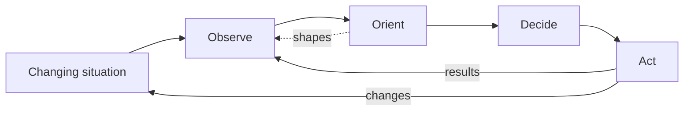

# What Is the OODA Loop? Observe, Orient, Decide, Act

> Created by **John Boyd**

## Overview

The OODA Loop is a decision cycle made of four activities: [Observe, Orient, Decide and Act](https://coljohnboyd.com/static/documents/2018-03__Boyd_John_R__edited_Hammond_Grant_T__A_Discourse_on_Winning_and_Losing.pdf). In the canonical description the cycle never stops: you observe changing circumstances, orient by interpreting them through experience and mental models, decide on a course of action, then act, and the consequences of that action generate [new observations that start the next pass](https://lesswrong.com/posts/hgttKuASB55zjoCKd/the-ooda-loop-observe-orient-decide-act). What made the model famous is its competitive claim. [Boyd's Patterns of Conflict briefing](https://coljohnboyd.com/static/documents/1986-12__Boyd_John_R__Patterns_of_Conflict__PPT-PDF.pdf) presents it as a way to get inside an opponent's decision cycle, where the side that cycles faster can create confusion and gain an advantage. Orient carries most of the weight. Boyd described orientation as [a set of filters built from genetic heritage, cultural predispositions, personal experience and knowledge](https://ooda.de/media/pj_tremblay_-_shaping_and_adapting.pdf), and those filters both shape what you notice and serve as the lens for interpreting it. Two teams looking at the same dashboard can therefore orient to very different pictures.

The diagram below draws the loop the way Boyd intended rather than as a straight line. Popular explanations often show four boxes in sequence, as if the acronym meant observe, then orient, then decide, then act, but an analysis of Boyd's model in Necesse points out that orientation also feeds back into what gets observed. That feedback is useful, because experience tells you where to look, and dangerous, because an existing view can steer the search toward confirming evidence. The dashed edge marks that path.

The model began in the cockpit. The loop was originally [a tactical concept Boyd derived from air-to-air combat](https://tandfonline.com/doi/full/10.1080/01495933.2022.2057733), and he later stretched it to strategy, command and control and competitive conflict, although those higher-level applications have been described in the same analysis as a looser analogy than the original. Boyd, a [U.S. Air Force colonel and strategist](https://coljohnboyd.com/static/documents/2018-03__Boyd_John_R__edited_Hammond_Grant_T__A_Discourse_on_Winning_and_Losing.pdf), developed the ideas in briefings he revised for years. [Science, Strategy and War, a study of Boyd's strategic theory](https://api.pageplace.de/preview/DT0400.9781134197095_A25035290/preview-9781134197095_A25035290.pdf), notes that the canonical source, A Discourse on Winning and Losing, consists of four briefings and an essay, was completed in 1987, ([source](https://api.pageplace.de/preview/DT0400.9781134197095_A25035290/preview-9781134197095_A25035290.pdf)) and had its slide wording revised frequently afterward. That history matters in practice: there is no single fixed text to appeal to, which partly explains why interpretations vary so widely. The table traces the main works.

| Work                              | Date              | Significance                                                                                                                                                                   |
| --------------------------------- | ----------------- | ------------------------------------------------------------------------------------------------------------------------------------------------------------------------------ |
| Destruction and Creation          | September 3, 1976 | Unpublished paper laying groundwork ([Strategic Studies analysis](https://tandfonline.com/doi/full/10.1080/01495933.2022.2057733))                                             |
| Patterns of Conflict              | 1977              | Briefing series where the concept developed ([Science, Strategy and War](https://api.pageplace.de/preview/DT0400.9781134197095_A25035290/preview-9781134197095_A25035290.pdf)) |
| Patterns of Conflict              | December 1986     | Documented version of the briefing ([Boyd archive](https://coljohnboyd.com/static/documents/1986-12__Boyd_John_R__Patterns_of_Conflict__PPT-PDF.pdf))                          |
| A Discourse on Winning and Losing | 1987              | Compilation treated as the canonical source ([Science, Strategy and War](https://api.pageplace.de/preview/DT0400.9781134197095_A25035290/preview-9781134197095_A25035290.pdf)) |
| A Discourse on Winning and Losing | 1987              | Compilation treated as the canonical source ([Science, Strategy and War](https://api.pageplace.de/preview/DT0400.9781134197095_A25035290/preview-9781134197095_A25035290.pdf)) |

Two ideas separate disciplined use from slogan use. The first is tempo. Speed alone is not the goal: one practitioner guide defines tempo as [the rate of completing full cycles relative to the rate at which the environment changes](https://goalsandprogress.com/ooda-loop-personal-decisions-master-rapid-decision-cycles), and Boyd himself described acting ['more inconspicuously, more quickly, and with more irregularity'](https://ooda.de/media/john_boyd_-_patterns_of_conflict.pdf) to retain initiative and exploit vulnerabilities. A team that decides instantly but never checks results has speed without tempo. The second idea is what you observe. [Practitioner guidance on the loop](https://umbrex.com/resources/frameworks/strategy-frameworks/ooda-loop) directs attention to leading indicators, anomalies and weak signals, and warns that overreliance on historical reports and lagging KPIs delays recognition of competitor moves and customer shifts. A lagging metric tells you the last cycle is over; a leading one tells you the next has started.

The critiques are serious and worth knowing before you adopt the model. A comparative command-and-control study found Boyd's definition rudimentary, with no explicit planning process, no representation of the opponent and no account of team collaboration or learning, and noted that a model derived from dogfights between few agents does not establish that it scales to large engagements. [Brehmer's Dynamic OODA Loop paper](https://ooda.de/media/berndt_brehmer_-_the_dynamic_ooda_loop.pdf) reports critics arguing that it describes neither decision-making in general nor military decision-making in particular, and a [Defense Technical Information Center report](https://apps.dtic.mil/sti/tr/pdf/ADA465834.pdf) calls it still popular but outdated as a model of human cognition. Evidence of effectiveness is thin. A [2024 conference paper](https://thinkmind.org/articles/achi_2024_3_30_20026.pdf) cites a study in which participants using an OODA sequence responded faster and more accurately than those using linear strategies, but it gives no sample size or effect sizes. The comparative study contrasts OODA with models that represent memory, attention and planning explicitly, yet reports no head-to-head performance figures, so the fair reading is that OODA is a conceptual framework for thinking about adaptation, not a validated method. In a workspace like Hamster, a team can keep each cycle's signals, working interpretation and decision on one shared page so the next loop starts from the last one's results.

## Core Principles

### Orientation drives everything

Orient is where observations become meaning, and Boyd treated it as far more than understanding the facts. His material describes orientation as [filters of heritage, culture, experience and knowledge](https://ooda.de/media/pj_tremblay_-_shaping_and_adapting.pdf) that shape observations as well as interpret them. In practice most loop failures are orientation failures: the data was there, but the model in people's heads filtered it out. Make the working interpretation explicit so others can challenge it, as covered in [building orientation mental models](https://tryhamster.com/skills/building-orientation-mental-models).

### A loop, not a checklist

Analysts of the popular diagram note that drawing OODA as four sequential boxes oversimplifies Boyd, whose model includes feedback from orientation into observation. You rarely finish one phase before touching another; you keep observing while you orient and let the results of action reshape your picture. Treating the phases as gates slows the cycle and hides the feedback path. If your team holds a separate meeting for each letter, you have built a pipeline rather than a loop.

### Tempo beats raw speed

What matters is whether your cycle keeps pace with change, which one guide frames as [tempo relative to environmental change rather than decision speed](https://goalsandprogress.com/ooda-loop-personal-decisions-master-rapid-decision-cycles). Boyd paired speed with [inconspicuousness and irregularity](https://ooda.de/media/john_boyd_-_patterns_of_conflict.pdf), so predictability can cost you as much as slowness. A team that responds within hours to a situation that changes weekly gains little by going faster still. Measure how long a full cycle takes from signal to observed result, not how fast a single decision is made.

### Action is a test

Boyd's Patterns of Conflict treats action as [the way you find out whether a decision was sound](https://ooda.de/media/john_boyd_-_patterns_of_conflict.pdf), through interaction with the environment. That reframes decisions as hypotheses, and [practitioner guidance](https://modelthinkers.com/mental-model/ooda-loop) recommends treating a decision in a changing environment as a current hypothesis rather than a permanent commitment. The practical rule is to act in ways that produce readable feedback. An action whose result you cannot observe breaks the loop.

### Watch leading signals, not just lagging ones

Fast orientation depends on early inputs. [Practitioner guidance](https://umbrex.com/resources/frameworks/strategy-frameworks/ooda-loop) recommends scanning internal and external sources and paying special attention to leading indicators, outliers and weak signals rather than only lagging KPIs. Lagging metrics confirm what already happened, which is too late for a loop meant to anticipate. Decide in advance which signals matter so observation stays focused rather than exhaustive.

### Respect the model's limits

OODA was derived from [air-to-air combat](https://tandfonline.com/doi/full/10.1080/01495933.2022.2057733), and the comparative literature notes it does not represent team negotiation, planning or multi-agent scale. A [DTIC report](https://apps.dtic.mil/sti/tr/pdf/ADA465834.pdf) calls it outdated as a model of cognition, and [Brehmer](https://ooda.de/media/berndt_brehmer_-_the_dynamic_ooda_loop.pdf) argues the generalized concept does not represent the environment affected by the decision-maker's actions. Use it as a thinking frame for adaptation and pair it with planning and collaboration methods where those gaps matter.

## Steps

1. **Set mission and guardrails**
   Before speeding anything up, write down what the loop serves. [Practitioner guidance](https://umbrex.com/resources/frameworks/strategy-frameworks/ooda-loop) recommends defining mission, metrics, scope, target outcomes, risk appetite and constraints first. The guardrails decide which actions can be taken without escalation, which is what later lets the cycle run fast without removing safeguards. The output is a short page anyone in the loop can check a decision against.

   If people keep asking permission for routine moves, the guardrails are too vague.

2. **Name the signals**
   List the specific signals that would change your view, favoring leading indicators and anomalies over lagging reports, as [loop guidance](https://umbrex.com/resources/frameworks/strategy-frameworks/ooda-loop) advises. For each signal, note its source and who watches it. Defining signals in advance keeps observation focused instead of collecting everything. You know this went wrong when the team learns about a shift from a quarterly report; see [scanning the environment for signals](https://tryhamster.com/skills/scanning-environment-for-signals) for the detail.

3. **Orient with a written working picture**
   Turn observations into a short written interpretation: what is happening, which assumptions it rests on, and what would change it. Orientation filters come from [experience, culture and knowledge](https://ooda.de/media/pj_tremblay_-_shaping_and_adapting.pdf), so name the favored explanation and look deliberately for contradicting evidence. A written picture lets others challenge it and becomes the baseline for the next cycle. The warning sign is that every new data point gets explained as confirming the old view, which [detecting orientation biases](https://tryhamster.com/skills/detecting-and-correcting-orientation-biases) addresses.

4. **Decide as a hypothesis**
   Choose a course of action and state it as a hypothesis with an expected result. [One guide](https://goalsandprogress.com/ooda-loop-personal-decisions-master-rapid-decision-cycles) suggests time-boxing orientation to a period suited to the stakes, such as 30 ([source](https://goalsandprogress.com/ooda-loop-personal-decisions-master-rapid-decision-cycles)) minutes, an hour or a day, and moving to a decision when the time expires. Framing the choice as provisional, as [practitioner sources](https://modelthinkers.com/mental-model/ooda-loop) recommend, avoids waiting for uncertainty to vanish. Record the result you expect so the next cycle has something to compare against.

5. **Act and observe the result**
   Execute the decision in a way that produces observable feedback, because in Boyd's framing [action is the test of whether the decision was sound](https://ooda.de/media/john_boyd_-_patterns_of_conflict.pdf). Keep the action small enough that its effect is easy to read. Route the result straight back into observation rather than into a report weeks later. If an action produces no signal you can read, the loop has broken.

6. **Review tempo and patterns**
   Periodically compare your full cycle time with how fast the situation is changing, since [tempo is relative to environmental change](https://goalsandprogress.com/ooda-loop-personal-decisions-master-rapid-decision-cycles). Review past decisions for [patterns you recognized or missed](https://hiperformanceculture.com/decisions/ooda-loop/decisions-ooda-loop-guide) to learn where intuition is reliable and where it needs checking. Adjust signals, guardrails and time boxes based on what the review shows. A healthy loop gets faster on routine cases and slows down only where the stakes rise.

## When to Use

- You face an active competitor or adversary whose moves you can observe, because the loop is framed for [uncertainty, ambiguity and active opposition](https://umbrex.com/resources/frameworks/strategy-frameworks/ooda-loop) and its core insight is about out-cycling an opponent.
- An incident or crisis is unfolding faster than your normal planning cadence, since the loop's value lies in acting provisionally and letting observed results update the picture.
- Your team keeps reopening the same analysis instead of acting, because framing each decision as a testable hypothesis gives permission to move and learn from the result.
- You are diagnosing why the team noticed a market or customer shift too late, since the Orient lens separates missing data from data that existing assumptions filtered out.
- A product or market bet depends on early evidence, because the loop pushes you to name leading indicators before lagging results arrive.

## When Not to Use

- The decision needs negotiation and consensus among many stakeholders, because the comparative literature finds OODA not directly applicable to collaborative team decision-making.
- The work is stable and rewards deliberate planning, since the model omits an explicit planning process and rapid cycling adds churn without benefit.
- The choice is irreversible and high-stakes, because misapplied OODA can raise the [risk of making decisions too soon](https://techtarget.com/it-strategy/definition/OODA-loop).
- You need a validated model of human cognition, for example to design decision-support tooling, because a [DTIC report](https://apps.dtic.mil/sti/tr/pdf/ADA465834.pdf) calls the loop outdated for that purpose.

## Skills

This method includes the following skills:

- [Detecting and Correcting Cognitive Biases in Orientation](skills/detecting-and-correcting-orientation-biases/SKILL.md) — How to identify confirmation bias, anchoring, and other cognitive traps that distort the Orient phase and lead to flawed decisions.
- [Scanning the Environment for Relevant Signals](skills/scanning-environment-for-signals/SKILL.md) — How to systematically gather raw information from your competitive environment, filtering noise from meaningful data during the Observe phase.
- [Accelerating Decision Tempo Under Uncertainty](skills/accelerating-decision-tempo/SKILL.md) — Techniques for making faster, higher-quality decisions by reducing analysis paralysis and leveraging pattern recognition in the Decide phase.
- [Building Mental Models for Rapid Orientation](skills/building-orientation-mental-models/SKILL.md) — How to synthesize observations using cultural traditions, previous experience, genetic heritage, and new information to form accurate situational awareness in the Orient phase.
- [Shortening Feedback Loop Cycles for Competitive Advantage](skills/shortening-feedback-loop-cycles/SKILL.md) — How to compress the time between each OODA iteration so you can adapt faster than competitors or adversaries.
- [Executing Actions with Implicit Guidance and Control](skills/executing-with-implicit-guidance/SKILL.md) — How to move from decision to swift, coordinated action while maintaining flexibility to feed results back into the next observation cycle.
- [Applying the OODA Loop to Business and Product Strategy](skills/applying-ooda-to-business-strategy/SKILL.md) — How to translate the military-origin OODA framework into practical business contexts like product development, marketing pivots, and startup iteration.
- [Disrupting an Opponent's Decision Cycle](skills/disrupting-opponent-ooda-loops/SKILL.md) — Strategies for creating ambiguity, surprise, and tempo changes that force adversaries into slower or broken decision loops.

## FAQ

**Who created the OODA Loop?**

U.S. Air Force colonel John Boyd created it, and it began as [a tactical concept derived from air-to-air combat](https://tandfonline.com/doi/full/10.1080/01495933.2022.2057733). He developed the ideas across briefings such as Patterns of Conflict and compiled them in A Discourse on Winning and Losing, which [Science, Strategy and War](https://api.pageplace.de/preview/DT0400.9781134197095_A25035290/preview-9781134197095_A25035290.pdf) dates to 1987. He later applied the loop to strategy, command and control and competitive conflict.

**Is the OODA Loop just about deciding faster?**

No. Boyd described acting ['more inconspicuously, more quickly, and with more irregularity'](https://ooda.de/media/john_boyd_-_patterns_of_conflict.pdf), so speed was one ingredient among several. Practitioner guides frame the goal as [tempo relative to how fast the environment changes](https://goalsandprogress.com/ooda-loop-personal-decisions-master-rapid-decision-cycles). Rushing every decision can simply mean acting faster on a poor orientation.

**Why is Orient considered the most important phase?**

Orientation determines [how observations are interpreted, what decisions are considered and how actions are shaped](https://modelthinkers.com/mental-model/ooda-loop). Boyd described it as [filters of heritage, culture, experience and knowledge](https://ooda.de/media/pj_tremblay_-_shaping_and_adapting.pdf) that also influence what you observe in the first place. Many loop failures trace back here, when an outdated model filters out what the data was saying.

**Is there evidence that the OODA Loop works?**

Evidence is limited. A [2024 paper](https://thinkmind.org/articles/achi_2024_3_30_20026.pdf) cites a study where participants using an OODA sequence were faster and more accurate than those using linear strategies, but it gives no sample size or effect sizes. Critics summarized by [Brehmer](https://ooda.de/media/berndt_brehmer_-_the_dynamic_ooda_loop.pdf) question whether it describes decision-making at all. The balance of sources supports treating it as a conceptual framework rather than a proven method.

**How does OODA compare with other decision models?**

A comparative command-and-control study contrasts it with models that explicitly represent memory, attention, domain knowledge, planning, collaboration and learning, all of which OODA lacks. The same study does not report head-to-head performance figures against a named alternative. In practice OODA is a simpler, more general frame, and teams often pair it with dedicated planning or group decision methods.

**What are the main criticisms of the OODA Loop?**

Critics say the definition is rudimentary and omits planning, the opponent and team collaboration. A [DTIC report](https://apps.dtic.mil/sti/tr/pdf/ADA465834.pdf) calls it outdated as a model of human cognition. Aviation historian Michael Hankins argues it is ['vague enough that its defenders and attackers can each see what they want to see in it'](https://en.wikipedia.org/wiki/OODA_loop).

**Is the OODA Loop a strict sequence?**

No. Diagrams often show it as observe, then orient, then decide, then act, but Boyd's model includes feedback in which orientation shapes subsequent observation. The results of action also feed back into observation. Treat the phases as overlapping activities rather than gates.

## Sources

- [\[PDF\] A Discourse on Winning and Losing - Colonel John Boyd](https://coljohnboyd.com/static/documents/2018-03__Boyd_John_R__edited_Hammond_Grant_T__A_Discourse_on_Winning_and_Losing.pdf)
- [\[PDF\] Patterns of Conflict - Colonel John Boyd](https://coljohnboyd.com/static/documents/1986-12__Boyd_John_R__Patterns_of_Conflict__PPT-PDF.pdf)
- [Science, Strategy and War: The strategic theory of John Boyd](https://api.pageplace.de/preview/DT0400.9781134197095_A25035290/preview-9781134197095_A25035290.pdf)
- [John Boyd on competition and conflict](https://tandfonline.com/doi/full/10.1080/01495933.2022.2057733)
- [The OODA Loop -- Observe, Orient, Decide, Act](https://lesswrong.com/posts/hgttKuASB55zjoCKd/the-ooda-loop-observe-orient-decide-act)
- [Patterns of Conflict](https://ooda.de/media/john_boyd_-_patterns_of_conflict.pdf)
- [1](https://apps.dtic.mil/sti/tr/pdf/ADA465834.pdf)
- [The Dynamic OODA Loop: Amalgamating Boyd’s OODA Loop and the](https://ooda.de/media/berndt_brehmer_-_the_dynamic_ooda_loop.pdf)
- [What is the OODA loop? \| Definition from TechTarget](https://techtarget.com/it-strategy/definition/OODA-loop)
- [Paper Title \(use style: paper title\)](https://thinkmind.org/articles/achi_2024_3_30_20026.pdf)
- [References](https://en.wikipedia.org/wiki/OODA_loop)
- [The OODA Loop - HiPerformance Culture](https://hiperformanceculture.com/decisions/ooda-loop/decisions-ooda-loop-guide)
- [Shaping and Adapting - OODA-Loop](https://ooda.de/media/pj_tremblay_-_shaping_and_adapting.pdf)
- [OODA Loop \(Observe-Orient-Decide-Act\) Explained](https://umbrex.com/resources/frameworks/strategy-frameworks/ooda-loop)
- [Frequently Asked Questions](https://goalsandprogress.com/ooda-loop-personal-decisions-master-rapid-decision-cycles)
- [OODA Loop - ModelThinkers](https://modelthinkers.com/mental-model/ooda-loop)

---

*[Import this method into Hamster](https://tryhamster.com) to share it with your team, customize it for your workflow, and let AI agents use it automatically.*
