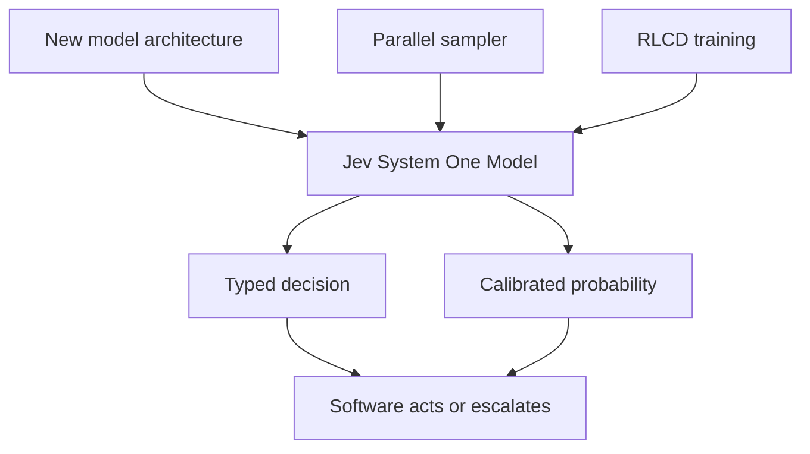

# Reinforcement Learning for Calibrated Decisions (RLCD)

> Created by **Diogo Almeida and TypeSafe AI** - [https://typesafe.ai/](https://typesafe.ai/)

## Overview

Reinforcement Learning for Calibrated Decisions (RLCD) is a post-training method in which the reward is tied to whether a model's stated probability matches how often its answer turns out to be correct, rather than to human preference ratings or automatic verification, as the [Sanity glossary entry on RLCD](https://sanity.io/glossary/rlcd-reinforcement-learning-for-calibrated-decisions) summarizes it. TypeSafe AI's own [machine learning primer](https://docs.typesafe.ai/introduction/machine-learning-primer) states the goal plainly: the model does not generate text, it returns decisions and probabilities, and a higher probability should correspond to a greater chance that the answer is correct. The launch material frames the target as "calibrated decisions: answers with epistemically honest probabilities on System One tasks," according to the [RLCD explainer guide](https://systemonemodels.org/guides/rlcd-explained). Put simply, when the model says 0.8, the thing should happen about 80% of the time, as [one practitioner write-up](https://dsebastien.net/reinforcement-learning-for-calibrated-decisions-rlcd) puts it.

TypeSafe AI introduced RLCD alongside Jev, which its [launch post, Introducing System One Models & Jev](https://typesafe.ai/blog/introducing-system-one-models-and-jev) describes as the company's first System One Model, released after two years in stealth. Sources disagree on the date: the [TypeSafe launch post](https://typesafe.ai/blog/introducing-system-one-models-and-jev) is dated September 21, 2026, while [RuntimeWire covered Jev's early access](https://runtimewire.com/article/typesafe-jev-system-one-ai-model-early-access) in mid-September and [a LinkedIn explainer](https://linkedin.com/posts/dpereirapaz_were-you-overwhelmed-by-all-the-terminology-activity-7505897578740326400-MYzT) says the company came out of stealth on September 15, 2026 ([source](https://typesafe.ai/blog/introducing-system-one-models-and-jev)). That explainer credits founder Diogo Almeida with co-inventing RLHF and InstructGPT, and [TechCrunch reports](https://techcrunch.com/2026/09/18/a-new-kind-of-ai-model-from-a-chatgpt-inventor-is-thrilling-developers) that Jev is trained exclusively on synthetic data. RLCD is one of three named parts of the stack, alongside a new model architecture and a parallel sampler, none of which is explained further, as [Digital Applied notes](https://digitalapplied.com/blog/typesafe-jev-system-one-model-typed-decisions).

TypeSafe positions RLCD as an alternative to RLHF. Where RLHF trains a model to produce answers human raters approve of, RLCD trains a model to produce a decision paired with a confidence value, according to [MindStudio's RLCD vs RLHF comparison](https://mindstudio.ai/blog/typesafe-jev-rlcd-vs-rlhf). The launch post also contrasts it with reinforcement learning from verifiable rewards (RLVR), a distinction [Pear Pages records](https://pearpages.com/blog/2026/09/16/jev-sorted-what-typesafes-system-one-model-actually-is-and-what-is-still-just-a-claim), and [DataCamp](https://datacamp.com/blog/system-one-models-jev) notes that leading chat models are trained with RLHF and verifiable rewards instead.

| Method | What it rewards | Output it targets |
|---|---|---|
| RLHF | Answers human raters approve of ([MindStudio](https://mindstudio.ai/blog/typesafe-jev-rlcd-vs-rlhf)) | Fluent conversational text |
| RLVR | Answers a program can check ([RLCD explained](https://systemonemodels.org/guides/rlcd-explained)) | Verifiably correct answers |
| RLCD | Probabilities that match observed correctness ([Sanity glossary](https://sanity.io/glossary/rlcd-reinforcement-learning-for-calibrated-decisions)) | Typed decision plus calibrated probability |

The output is not a paragraph. Coverage describes structured decisions such as a choice, a score or a yes/no probability ([ExplainX profile](https://explainx.ai/blog/diogo-almeida-typesafe-ai-rlhf-detour-profile-2026)). The [Jev RLCD page](https://jevtypesafeai.com/jev/rlcd) says each answer carries a probability distribution over possible outcomes plus a confidence value describing how concentrated that distribution is, and [one practitioner-facing description](https://laya.convaiinnovations.com) calls these confidence distributions and schema choices. Spreading uncertainty across alternatives lets downstream code see that a runner-up option was close, instead of receiving one unqualified answer. TypeSafe's stated intent is that software acts when confidence is high and escalates when it is not ([TypeSafe home page](https://typesafe.ai)). The motivation, per the [launch post](https://typesafe.ai/blog/introducing-system-one-models-and-jev), is that models prompted to give confidence estimates are often overconfident and inconsistent.

Searches for RLCD also surface an unrelated method. A paper by Yang and colleagues in 2023 ([source](https://gingerlabs.ai/blog/rlcd-vs-rlhf-how-does-typesafe-ai-jev-work)) introduced Reinforcement Learning from Contrastive Distillation, which generates preference pairs from contrastive prompts to simulate RLHF data without human labelers ([Ginger Labs](https://gingerlabs.ai/blog/rlcd-vs-rlhf-how-does-typesafe-ai-jev-work)). It shares the acronym and nothing else, so its results say nothing about TypeSafe's method.

RLCD is a proprietary term, not a standardized technique, as [Forbes coverage](https://forbes.com/sites/lanceeliot/2026/09/18/new-reinforcement-learning-for-calibrated-decisions-makes-ai-headlines-but-look-past-the-hype) points out, and [Forbes Japan](https://forbesjapan.com/articles/detail/105002) makes the same point. The evidence base is thin: there is no paper, no reliability curve, no expected-calibration-error number and no ablation separating RLCD from the architecture, per [Agentpedia's claim-versus-evidence guide](https://agentpedia.codes/blog/jev-system-one-models). Critics add that calibration describes a population of predictions and does not tell you whether one particular answer is right ([Anthony Maio](https://anthonymaio.substack.com/p/jev-the-language-model-that-wont)), and [a Japanese deep-research note](https://note.com/wayne_chang/n/n151303c2041a) warns about benchmarks that treat an average of generative-AI outputs as the correct answer. Until TypeSafe publishes results, treat RLCD as a stated objective with useful vocabulary and verify calibration on your own logged outcomes. Teams running that verification in Hamster can keep prediction logs, review decisions and open questions in the same shared workspace as the rest of the project.

## Core Principles

### Calibration is the objective, not eloquence

The [Jev RLCD page](https://jevtypesafeai.com/jev/rlcd) states the training objective as calibration rather than fluent writing, so that when Jev says 80% it should be right about 80% ([source](https://jevtypesafeai.com/jev/rlcd)) of the time. That changes what a good output looks like: a modest probability that is right about as often as it claims beats a confident one that overstates its hit rate. The [TypeSafe primer](https://docs.typesafe.ai/introduction/machine-learning-primer) makes the same promise in ordinal form, that higher probability should mean a greater chance of being correct. Treat the probability as a product feature you test, not decoration on the answer.

### Calibration lives in the aggregate

TypeSafe's documentation narrows its own claim, saying calibration is measured across groups of predictions, as [Agentpedia quotes it](https://agentpedia.codes/blog/jev-system-one-models). [Anthony Maio](https://anthonymaio.substack.com/p/jev-the-language-model-that-wont) stresses that this describes a population and does not tell you whether one particular answer is right. A single high-confidence decision can still be wrong while the model remains perfectly calibrated. Design review and rollback paths on the assumption that some confident answers will fail.

### Accuracy and calibration are different tests

A model that reports 85% confidence should be correct approximately 85% ([source](https://blockchain-council.org/ai/jev-calibrated-decisions-explained)) of the time across many similar cases, and being right more often overall is not enough if confidence does not track outcomes, per [Blockchain Council](https://blockchain-council.org/ai/jev-calibrated-decisions-explained). The common mistake is to see high overall accuracy and assume the probabilities are trustworthy. They can be systematically inflated in one band and deflated in another while the headline accuracy looks fine. You only find this by comparing stated confidence with observed accuracy inside confidence groups.

### Decisions are typed and bounded

RLCD-style models return decisions and probabilities instead of generated text, according to the [TypeSafe primer](https://docs.typesafe.ai/introduction/machine-learning-primer). Coverage lists the shapes as a choice, a score or a yes/no probability ([ExplainX](https://explainx.ai/blog/diogo-almeida-typesafe-ai-rlhf-detour-profile-2026)). A bounded answer space is what makes calibration measurable, because every output maps to an outcome you can later mark right or wrong. Open-ended prose has no such mapping, which is why the method starts from a schema.

### Confidence is part of the software contract

[MindStudio](https://mindstudio.ai/blog/typesafe-jev-rlcd-vs-rlhf) frames the contrast with RLHF as optimizing for being right with a numerical confidence that software can act on, rather than for human conversational preference. That means the probability field belongs in the interface specification alongside the decision itself. TypeSafe describes the intended use as acting when confidence is high and escalating when it is not ([TypeSafe](https://typesafe.ai)). If your integration discards the probability, you have thrown away the part RLCD exists to produce.

### Claims stay claims until evidence arrives

RLCD is a vendor-coined, proprietary term according to [Forbes](https://forbes.com/sites/lanceeliot/2026/09/18/new-reinforcement-learning-for-calibrated-decisions-makes-ai-headlines-but-look-past-the-hype), and no reliability curve, calibration error figure or ablation has been published ([Agentpedia](https://agentpedia.codes/blog/jev-system-one-models)). Do not borrow credibility from the unrelated 2023 contrastive distillation paper that shares the acronym ([Ginger Labs](https://gingerlabs.ai/blog/rlcd-vs-rlhf-how-does-typesafe-ai-jev-work)). The practical stance is to adopt the objective and the measurement habits, and to hold any specific model to your own logged outcomes.

## Steps

1. **Define the decision and its answer space**
   Write down exactly what the model must decide and the full set of permitted outcomes, such as a fixed list of queues or a yes/no flag. Specify field types so every output is machine-checkable and maps to an outcome you can later score. Avoid free-text answers, which force downstream code to parse and guess intent. The detailed practice is covered in [Designing Schema-Constrained Decisions](https://tryhamster.com/skills/designing-schema-constrained-decisions).

   You know this went wrong when reviewers argue about whether an output counts as correct.

2. **Attach a probability to every decision**
   Require the model to return a probability or distribution alongside each decision, not a verbal hedge. TypeSafe's [launch post](https://typesafe.ai/blog/introducing-system-one-models-and-jev) argues that simply prompting a model for a confidence number tends to produce overconfident, inconsistent values, which is why RLCD trains confidence against outcomes. Record the full distribution across alternatives when available, since a close runner-up is useful signal. See [Estimating Decision Confidence](https://tryhamster.com/skills/estimating-decision-confidence) for how the number gets produced and interpreted.

3. **Log predictions against outcomes**
   Store each decision, its stated probability and, once known, the true outcome, as the [RLCD explainer guide](https://systemonemodels.org/guides/rlcd-explained) recommends. Without the outcome column the probability cannot be validated from model output alone. Keep an identifier and task type on every row so you can slice later. The logging workflow is detailed in [Calibrating Confidence to Outcomes](https://tryhamster.com/skills/calibrating-confidence-to-outcomes).

   Tip: decide how long you wait for an outcome before labeling, and apply that window consistently.

4. **Measure calibration by task type**
   Group logged predictions into probability bins, compare each bin's mean stated confidence with its observed accuracy, and summarize the gap. The [RLCD explainer guide](https://systemonemodels.org/guides/rlcd-explained) advises measuring each question type separately because calibration varies by task. Pooling unlike tasks can hide a badly miscalibrated category behind a well-behaved one. [Evaluating Probabilistic Calibration](https://tryhamster.com/skills/evaluating-probabilistic-calibration) covers bins, reliability plots and expected calibration error.

   Tip: check that each bin holds enough decisions before trusting its accuracy figure.

5. **Set the act-or-escalate policy**
   Choose a confidence threshold per task above which software acts and below which it escalates, for example auto-applying above 0.9 and sending the rest to review. No source specifies a universal threshold, so derive yours from the measured accuracy in each band and the cost of an error. Revisit thresholds when calibration drifts or the input mix changes. [Handling Abstention and Uncertainty](https://tryhamster.com/skills/handling-abstention-and-uncertainty) walks through the routing design.

   You know the policy is wrong when the escalation queue is either empty or overwhelmed.

6. **Train or tune against outcomes**
   If you build your own calibrated model, reward the match between stated probability and realized outcome rather than rater preference. TypeSafe has not disclosed its reward function ([Anthony Maio](https://anthonymaio.substack.com/p/jev-the-language-model-that-wont)), but the open OpenJev reimplementation combines cross-entropy with a Brier score term ([OpenJev repository](https://github.com/Heman10x-NGU/Verdict-open-jev)). Treat such reimplementations as one reasonable design, not TypeSafe's recipe. [Designing Outcome-Based Reward Signals](https://tryhamster.com/skills/designing-outcome-based-reward-signals) covers scoring rules and post-hoc adjustments.

   Re-run the calibration measurement after every training change.

## When to Use

- An automated pipeline must act on a label without a human reading it, such as routing or approving items, because a calibrated probability tells the code when the label is safe to apply.
- You are designing an act-or-escalate workflow and need a principled way to decide which decisions go to human review rather than a gut-feel cutoff.
- You are evaluating a vendor's claim that its model is calibrated and need a checklist of what evidence to request and what to measure yourself.
- Your current system relies on a chat model's self-reported confidence and you suspect those numbers are overconfident or inconsistent across similar inputs.
- Ground-truth outcomes arrive after the decision, such as chargebacks, resolved tickets or confirmed labels, so you can compare stated probabilities with what actually happened.

## When Not to Use

- The task is open-ended writing, summarizing or conversation, because RLCD targets typed decisions and Jev is described as a specialized tool rather than a generative assistant.
- No outcome signal ever arrives to mark a decision right or wrong, because calibration cannot be checked without ground truth.
- Each decision is a rare one-off with no comparable population, because calibration is a property of many similar predictions and says little about a single case.
- You need a reproducible, peer-reviewed training recipe today, because TypeSafe has not published the RLCD algorithm, reward function or training details.

## Skills

This method includes the following skills:

- [Calibrating Confidence to Outcomes](../../skills/calibrating-confidence-to-outcomes/SKILL.md): Aligning predicted confidence values with empirical accuracy so that decisions at a stated confidence level are correct at approximately that rate in practice.
- [Structuring Machine-to-Machine Decision Outputs](../../skills/structuring-machine-to-machine-decision-outputs/SKILL.md): Integrating typed decisions, confidence metadata, and uncertainty states into downstream software workflows that programmatically consume and act on model outputs.
- [Designing Schema-Constrained Decisions](../../skills/designing-schema-constrained-decisions/SKILL.md): Defining permitted decision categories, output types, fields, and validation rules so that a model produces structured, machine-actionable results rather than unconstrained prose.
- [Handling Abstention and Uncertainty](../../skills/handling-abstention-and-uncertainty/SKILL.md): Configuring a decision system to defer, abstain, or route cases to alternative processes when available evidence does not justify a confident prediction.
- [Designing Outcome-Based Reward Signals](../../skills/designing-outcome-based-reward-signals/SKILL.md): Creating reinforcement learning reward functions that jointly incentivize correct decisions and statistically reliable confidence estimates.
- [Estimating Decision Confidence](../../skills/estimating-decision-confidence/SKILL.md): Producing well-formed confidence scores or probabilities that represent the model's belief in the correctness of each individual structured decision.
- [Evaluating Probabilistic Calibration](../../skills/evaluating-probabilistic-calibration/SKILL.md): Testing whether model confidence values track real-world correctness on held-out data using calibration curves, reliability diagrams, and discrimination analyses.

## FAQ

**What is RLCD in simple terms?**

RLCD is TypeSafe AI's name for training a model to return a decision plus a probability that matches how often such decisions turn out correct. The [TypeSafe primer](https://docs.typesafe.ai/introduction/machine-learning-primer) says the model does not generate text and returns decisions and probabilities instead. It is the training method behind Jev, TypeSafe's first System One Model. The goal is numbers software can act on, not persuasive prose.

**Is TypeSafe's RLCD the same as the 2023 RLCD paper?**

No. The 2023 ([source](https://gingerlabs.ai/blog/rlcd-vs-rlhf-how-does-typesafe-ai-jev-work)) paper by Yang and colleagues introduced Reinforcement Learning from Contrastive Distillation, which simulates RLHF preference data from contrastive prompts ([Ginger Labs](https://gingerlabs.ai/blog/rlcd-vs-rlhf-how-does-typesafe-ai-jev-work)). TypeSafe's RLCD stands for Reinforcement Learning for Calibrated Decisions and targets calibrated probabilities. Results from one say nothing about the other, so check the expansion before citing either.

**How does RLCD differ from RLHF and RLVR?**

RLHF rewards answers human raters approve of, while RLCD rewards a decision paired with a confidence value that matches reality ([MindStudio](https://mindstudio.ai/blog/typesafe-jev-rlcd-vs-rlhf)). RLVR rewards answers a program can automatically check. RLCD's target is the correspondence between stated confidence and actual correctness, not preference or pass/fail verification. No controlled head-to-head comparison of the three has been published.

**Is there evidence that RLCD works?**

Not publicly. [Agentpedia](https://agentpedia.codes/blog/jev-system-one-models) found no paper, reliability curve, expected-calibration-error figure or ablation separating RLCD from Jev's architecture. [RuntimeWire](https://runtimewire.com/article/typesafe-jev-system-one-ai-model-early-access) notes TypeSafe described the approach at a high level without weights or a detailed paper. Measure calibration on your own outcomes before relying on it.

**For example, if the model says 90%, is that answer right?**

Not necessarily. Calibration is a statement about many predictions, and [Anthony Maio](https://anthonymaio.substack.com/p/jev-the-language-model-that-wont) points out it does not tell you whether one particular answer is correct. A calibrated model assigning 90% will still be wrong on some of those cases. Build review and rollback paths for confident errors.

**Can I reproduce RLCD myself?**

Not TypeSafe's exact version, because the reward function, architecture and training procedure are undisclosed ([Anthony Maio](https://anthonymaio.substack.com/p/jev-the-language-model-that-wont)). You can pursue the same objective with proper scoring rules, as the [OpenJev repository](https://github.com/Heman10x-NGU/Verdict-open-jev) does with cross-entropy plus a Brier term. Treat that as an independent design rather than a replica.

**Who created RLCD?**

RLCD was named and introduced by TypeSafe AI with the Jev launch ([TypeSafe launch post](https://typesafe.ai/blog/introducing-system-one-models-and-jev)). Coverage attributes the work to founder Diogo Almeida, whom [a LinkedIn explainer](https://linkedin.com/posts/dpereirapaz_were-you-overwhelmed-by-all-the-terminology-activity-7505897578740326400-MYzT) credits with co-inventing RLHF and InstructGPT. [Forbes](https://forbes.com/sites/lanceeliot/2026/09/18/new-reinforcement-learning-for-calibrated-decisions-makes-ai-headlines-but-look-past-the-hype) describes RLCD as a proprietary term rather than a standardized technique.

## Sources

- [Introducing System One Models \& Jev - TypeSafe AI Blog](https://typesafe.ai/blog/introducing-system-one-models-and-jev)
- [Home - TypeSafe AI](https://typesafe.ai)
- [AI primer](https://docs.typesafe.ai/introduction/machine-learning-primer)
- [New ‘Reinforcement Learning For Calibrated Decisions’ Makes](https://forbes.com/sites/lanceeliot/2026/09/18/new-reinforcement-learning-for-calibrated-decisions-makes-ai-headlines-but-look-past-the-hype)
- [RLCD \(Reinforcement Learning for Calibrated Decisions\)](https://sanity.io/glossary/rlcd-reinforcement-learning-for-calibrated-decisions)
- [Jev: TypeSafe's System One Model Explained - DataCamp](https://datacamp.com/blog/system-one-models-jev)
- [TypeSafe opens Jev early access for fast, typed AI decisions](https://runtimewire.com/article/typesafe-jev-system-one-ai-model-early-access)
- [RLCD explained: Reinforcement Learning for Calibrated Decisions](https://systemonemodels.org/guides/rlcd-explained)
- [TypeSafe Jev: A Model That Returns Decisions, Not Text](https://digitalapplied.com/blog/typesafe-jev-system-one-model-typed-decisions)
- [新興TypeSafe AIが放つ新AI「Jev」、ハルシネーションなしは](https://forbesjapan.com/articles/detail/105002)
- [Laya - 33ms Multilingual System 1 Decision Engine](https://laya.convaiinnovations.com)
- [TypeSafe AI「Jev」モデルの訓練ロジックとRLCDアルゴリズム](https://note.com/wayne_chang/n/n151303c2041a)
- [RLCD vs RLHF: How Does Typesafe AI Jev Work](https://gingerlabs.ai/blog/rlcd-vs-rlhf-how-does-typesafe-ai-jev-work)
- [Jev: The Language Model That Won't Talk - Anthony Maio](https://anthonymaio.substack.com/p/jev-the-language-model-that-wont)
- [Jev \& System One Models: The Claim-vs-Evidence Guide](https://agentpedia.codes/blog/jev-system-one-models)
- [RLCD vs RLHF: What Is Typesafe's Jev Model Actually](https://mindstudio.ai/blog/typesafe-jev-rlcd-vs-rlhf)
- [Diogo Almeida on ChatGPT, RLHF, and TypeSafe AI \(2026\)](https://explainx.ai/blog/diogo-almeida-typesafe-ai-rlhf-detour-profile-2026)
- [Jev, Sorted: What TypeSafe's 'System One' Model Actually Is](https://pearpages.com/blog/2026/09/16/jev-sorted-what-typesafes-system-one-model-actually-is-and-what-is-still-just-a-claim)
- [GitHub - Heman10x-NGU/Verdict-open-jev: Non-autoregressive](https://github.com/Heman10x-NGU/Verdict-open-jev)
- [Jev Calibrated Decisions Explained](https://blockchain-council.org/ai/jev-calibrated-decisions-explained)
- [RLCD - the training method behind Jev - Jev by TypeSafe AI](https://jevtypesafeai.com/jev/rlcd)
- [Reinforcement Learning for Calibrated Decisions \(RLCD\)](https://dsebastien.net/reinforcement-learning-for-calibrated-decisions-rlcd)
- [A new kind of AI model from a ChatGPT inventor is thrilling developers \| TechCrunch](https://techcrunch.com/2026/09/18/a-new-kind-of-ai-model-from-a-chatgpt-inventor-is-thrilling-developers)
- [David Pereira's Post](https://linkedin.com/posts/dpereirapaz_were-you-overwhelmed-by-all-the-terminology-activity-7505897578740326400-MYzT)

---

*[Import this method into Hamster](https://tryhamster.com) to share it with your team, customize it for your workflow, and let AI agents use it automatically.*
