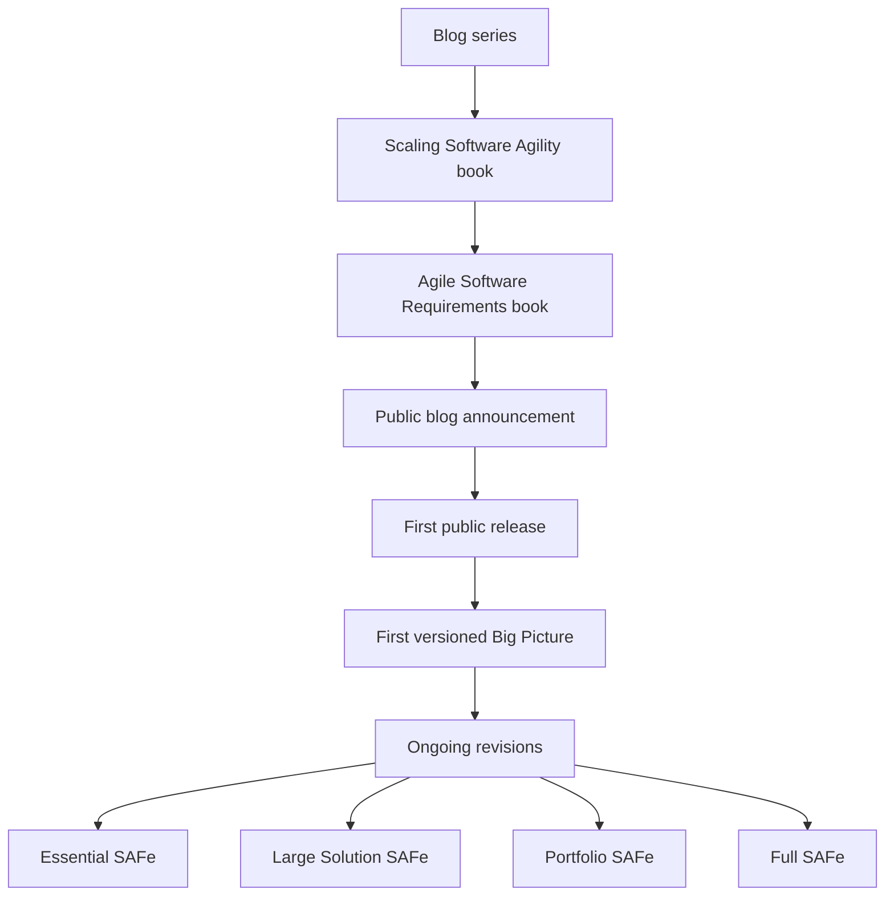

# Scaled Agile Framework: What SAFe Is and How It Works

> Created by **Dean Leffingwell** — [https://scaledagile.com](https://scaledagile.com)

## Overview

The Scaled Agile Framework (SAFe) is a knowledge base of patterns, principles, practices and competencies for running Lean, Agile and DevOps work across many teams at once. Scaled Agile describes it as [a system for scaling agile across teams of teams, business units, and even entire organizations](https://scaledagile.com/what-is-safe/safe-and-agile). Instead of asking each team to invent its own coordination, SAFe supplies shared roles, a common planning cadence, a delivery pipeline and portfolio-level decision structures. Its practices rest on [ten immutable Lean-Agile principles that evolved from Agile methods, Lean product development and systems thinking](https://framework.scaledagile.com/safe-lean-agile-principles), which is why the framework reads less like a single process and more like a layered operating model.

SAFe was created by Dean Leffingwell, whom Scaled Agile names as its [creator and chief methodologist](https://scaledagile.com/resources/safe-distilled). Its ideas were first worked out in a [blog series and then in the books Scaling Software Agility and Agile Software Requirements](https://scaledagile.com/blog/a-decade-in-adaptation-the-scaled-agile-framework-10-years-later), and Scaled Agile calls the second book [the foundation and initial version of the Scaled Agile Framework](https://scaledagile.com/blog/a-decade-in-adaptation-the-scaled-agile-framework-10-years-later). Sources disagree on that book's date: Scaled Agile's retrospective says it [had just been published in 2011](https://scaledagile.com/blog/a-decade-in-adaptation-the-scaled-agile-framework-10-years-later), while a [Korean SAFe community history lists it as 2010](https://medium.com/safe-community-kr/safe-history-%EC%95%8C%EC%95%84%EB%B3%B4%EA%B8%B0-2-safe-1-0-%EC%9D%B4%EC%A0%84%EC%97%90%EB%8A%94-e3476bfc512c). Leffingwell introduced the framework publicly in an [October 23, 2011 post titled Introducing the Scaled Agile Framework](https://scalingsoftwareagility.wordpress.com/2011/10/23/introducing-the-scaled-agile-framework%E2%84%A2), presenting it as a publicly available framework for applying Lean and Agile practices at enterprise scale. The same community history dates the [first planned public release to December 21, 2011](https://medium.com/safe-community-kr/safe-history-%EC%95%8C%EC%95%84%EB%B3%B4%EA%B8%B0-2-safe-1-0-%EC%9D%B4%EC%A0%84%EC%97%90%EB%8A%94-e3476bfc512c), and [version 1.0 of the SAFe Big Picture was announced at the Agile 2012 ([source](https://medium.com/safe-community-kr/safe-history-%EC%95%8C%EC%95%84%EB%B3%B4%EA%B8%B0-2-safe-1-0-%EC%9D%B4%EC%A0%84%EC%97%90%EB%8A%94-e3476bfc512c)) conference in Dallas](https://medium.com/lean-agile-mindset/a-brief-history-of-the-scaled-agile-framework-633665a73a37). The sequence below traces that path from early writing to today's configurations.

Scaled Agile describes the framework as [continuously adapted over its first decade](https://scaledagile.com/blog/a-decade-in-adaptation-the-scaled-agile-framework-10-years-later). The early model coordinated work across team, program and enterprise levels. The current framework is organized into [Essential, Large Solution, Portfolio and Full configurations](https://scaledagile.com/what-is-safe/safe-and-agile) and frames its guidance around competencies such as [Lean Portfolio Management, Agile Product Delivery and Organizational Agility](https://scaledagile.com/podcast/navigate-the-future-with-a-business-agility-value-stream). Along the way it absorbed DevOps and flow thinking, most visibly in the Continuous Delivery Pipeline, whose aspects run from [continuous exploration through release on demand](https://scaledagileframework.com/built-in-quality).

One distinction to hold onto before adopting any part of SAFe is that deployment and release are separate decisions. SAFe defines Continuous Deployment as [moving new functionality from a staging environment to production, where it is made available for release](https://scaledagileframework.com/continuous-deployment), and Release on Demand as [releasing functionality immediately or incrementally based on business and customer needs](https://scaledagileframework.com/release-on-demand). Teams that treat the two as synonyms lose the ability to ship code continuously while still timing what customers see.

Survey data places SAFe repeatedly at or near the top of enterprise scaling choices, although the share moves a lot between editions. VersionOne's 2018 report called it [the most widely used approach to scaling agile](https://eg.bucknell.edu/~cs479/common-files/resources/versionone-state-of-agile/versionone-12th-annual-state-of-agile-report.pdf).

| State of Agile edition | Share following SAFe | Source |
|---|---|---|
| 12th report, 2018 | 29% | [VersionOne 12th report](https://eg.bucknell.edu/~cs479/common-files/resources/versionone-state-of-agile/versionone-12th-annual-state-of-agile-report.pdf) |
| 14th report, 2020 | 35% | [14th report summary](https://agileasia.com/14th-annual-state-of-agile-report) |
| 15th report, 2021 | 37% | [15th report](https://agilizing.com/wp-content/uploads/2022/12/SOA15.pdf) |
| 17th report | 26% | [17th report](https://2288549.fs1.hubspotusercontent-na1.net/hubfs/2288549/RE-SA-17th-Annual-State-Of-Agile-Report.pdf) |

The 17th report called its figure [a drop of more than 50% from the previous year](https://2288549.fs1.hubspotusercontent-na1.net/hubfs/2288549/RE-SA-17th-Annual-State-Of-Agile-Report.pdf), while Scrum.org's summary of the 18th report says usage [rebounded to 44%, down from a 53% ([source](https://scrum.org/resources/blog/18th-state-agile-report)) peak](https://scrum.org/resources/blog/18th-state-agile-report). Because samples and wording differ, treat each figure as a snapshot. Vendor and critic data diverge as well: Scaled Agile's own report says [68% of respondents saw some or significant increase in employee satisfaction](https://scaledagile.com/resources/state-of-safe-report), while an independent practitioner survey of [505 ([source](https://medium.com/the-liberators/in-depth-is-safe-really-that-bad-ed5c5c706e42)) participants produced a Net Promoter Score of -56](https://medium.com/the-liberators/in-depth-is-safe-really-that-bad-ed5c5c706e42).

Whether SAFe outperforms alternatives is less clear. A 2019 literature review judged evidence on large-scale frameworks [still very much in its infancy](https://arxiv.org/pdf/1901.08130). A 2023 study comparing SAFe, LeSS, Scrum of Scrums and custom approaches concluded that [the choice of scaling strategy does not markedly influence team effectiveness](https://arxiv.org/html/2310.06599v1), with management support the main gap: SAFe scored 4.57 against 5.11 for Scrum of Scrums and 5.07 ([source](https://arxiv.org/html/2310.06599v1)) for LeSS [in the same study](https://arxiv.org/html/2310.06599v1). A comparative review placed [SAFe and Disciplined Agile at high scalability with deeper process change, and Nexus and the Spotify model at smaller teams with lower complexity](https://ejurnal.itats.ac.id/jasmet/article/download/1832/1581). Another study found [80% of its respondents used SAFe yet still struggled, mixing old and new methods and using only a subset of practices](https://helda.helsinki.fi/server/api/core/bitstreams/1307e358-dccc-4e97-828c-6d28a75ca624/content). The practical reading is to choose SAFe for fit with your structure and culture, then adopt its practices deliberately. Hamster Studio's skills library breaks SAFe into those discrete practices so teams can run each one with shared context.

## Core Principles

### Principles before practices

SAFe's roles and events are meant to express [ten underlying Lean-Agile principles](https://framework.scaledagile.com/safe-lean-agile-principles), not replace them. When a practice stops serving its principle, the practice is what should change. Organizations that copy the Big Picture without understanding the economics behind it tend to keep the ceremonies and lose the flow. Check any local adaptation against the principle it is supposed to serve.

### Teams of teams on a shared cadence

The core unit of SAFe is the Agile Release Train, a long-lived team of agile teams that plans and delivers together. Each train [builds and maintains a Continuous Delivery Pipeline so it can define, build, validate and release functionality that meets its PI objectives](https://scaledagileframework.com/planning-interval). A shared planning interval gives every team the same horizon, which makes cross-team dependencies visible early. If teams on one train plan on different rhythms, integration problems surface late.

### Flow in small batches

SAFe's pipeline stages are designed to [support the deployment of small batches of new functionality](https://v5.scaledagileframework.com/agile-release-train). Small batches shorten feedback loops and limit the cost of any single mistake. Large, bundled releases hide defects and delay learning about whether a feature was worth building. A rising batch size is an early warning that the train is drifting back toward phase-gated delivery.

### Separate deployment from release

Deployment puts [validated functionality into production](https://scaledagileframework.com/continuous-deployment); release makes it available to customers [immediately or incrementally based on business and customer needs](https://scaledagileframework.com/release-on-demand). Keeping these decisions apart lets engineering deploy continuously while the business chooses timing and exposure. It also reduces release risk, because code can be verified in production before anyone depends on it.

### Build quality in

SAFe treats built-in quality as a precondition for continuous delivery, which it describes as the [ability to release value to customers whenever they need it](https://scaledagileframework.com/built-in-quality). Quality that is inspected in at the end of a cycle cannot support frequent, low-risk releases. Integration and validation happen throughout development rather than in a separate hardening phase. If every release needs a stabilization sprint, quality is not yet built in.

### Centralize investment, decentralize execution

SAFe gives Lean Portfolio Management [the highest level of decision-making and financial accountability for a portfolio's products and solutions](https://scaledagileframework.com/glossary). Strategic funding and prioritization sit at the portfolio, while trains and teams decide how to deliver. This split keeps strategy coherent without routing daily decisions through steering committees. When portfolio leaders start assigning stories to teams, the balance has tipped too far.

### Fit over fidelity

The 2023 ([source](https://arxiv.org/html/2310.06599v1)) comparison study advises organizations to choose a scaling method that [aligns with their previous experiences with Agile, organizational culture, and management style](https://arxiv.org/html/2310.06599v1). The same research flags that SAFe requires major commitment at all levels and can inhibit agility when management misunderstands it. Adopting the whole framework on paper while practicing a fragment of it is a common outcome. Start with the configuration your structure actually needs and grow deliberately.

## Steps

1. **Test organizational fit**
   Start by listing the teams, the products they touch and where handoffs and waits occur today. Compare that picture with the commitment SAFe demands, which research describes as major effort across every level and substantial time. Decide whether the coordination problem is large enough to justify a framework, or whether a lighter approach would do. Write down the specific pain you expect SAFe to fix so you can check later whether it did.

   If nobody can name the pain, stop here.

2. **Choose a starting configuration**
   Pick the smallest configuration that covers your real coordination need, usually Essential SAFe for a single train. Move to Large Solution only when several trains build one system, and to Portfolio when investment decisions need restructuring. Starting with Full SAFe spreads change effort thin and multiplies unfamiliar roles at once. Record which parts you are deliberately leaving out and why.

   That record prevents the gradual accumulation of ceremony nobody chose.

3. **Launch the first release train**
   Identify the value stream the train will serve and the teams needed to deliver across it end to end. Fill the key roles, form or re-form teams around the value stream and set the planning cadence. The detailed practice is covered in [launching agile release trains](https://tryhamster.com/skills/launching-agile-release-trains). A good sign is that the train can deliver a feature without waiting on groups outside it.

   A bad sign is a train organized around components that still depends on external teams for every release.

4. **Plan the first increment together**
   Bring the whole train together to translate business context into team plans and objectives for the upcoming increment. Teams expose dependencies and risks while everyone is in the same room, rather than discovering them mid-increment. Use [PI planning](https://tryhamster.com/skills/planning-program-increments) for the event itself and [splitting features into stories](https://tryhamster.com/skills/splitting-features-into-stories) to get backlog items to a plannable size. The output is a set of committed objectives and a visible dependency map.

   If plans rely on unnamed teams or unsized features, the preparation was insufficient.

5. **Build the delivery pipeline**
   Set up the workflows and automation that carry functionality from exploration through integration, deployment and release. Keep deployment and release as separate decisions so the business controls customer exposure. Guidance lives in [implementing the SAFe Continuous Delivery Pipeline](https://tryhamster.com/skills/implementing-devops-with-continuous-delivery-pipeline). Measure how long a validated change takes to reach production.

   A long or manual path is the first thing to fix, because it caps every other improvement.

6. **Inspect and adapt each increment**
   Close each increment by demonstrating the integrated solution, reviewing measures and running structured problem solving. Feed the resulting improvement items into the next planning event so they get capacity. The facilitation is covered in [running Inspect and Adapt workshops](https://tryhamster.com/skills/running-inspect-and-adapt-workshops). Without this loop, SAFe hardens into a fixed process rather than an improving one.

   Watch for the same problems recurring across several increments.

7. **Extend to portfolio and multiple trains**
   Once a train runs reliably, connect it to portfolio decisions and, if needed, to other trains. Set up [Lean Portfolio Management](https://tryhamster.com/skills/managing-lean-portfolio-with-safe) with an active Portfolio Kanban, rank work with [Weighted Shortest Job First](https://tryhamster.com/skills/prioritizing-with-wsjf), and coordinate several trains through a [solution train](https://tryhamster.com/skills/coordinating-multiple-agile-release-trains) where one solution demands it. Extend only when the lower level is stable. Expanding a struggling train into a portfolio spreads its problems further.

## When to Use

- Several agile teams contribute to one product or system and repeatedly block each other, because SAFe's shared planning cadence and release train exist to surface and manage cross-team dependencies.
- Leadership needs a common vocabulary and published body of guidance for a large transformation, because SAFe provides defined roles, events and training that many people can learn at once.
- Portfolio funding still flows through annual projects and steering committees, because SAFe's Lean Portfolio Management offers a structured path toward value-stream funding and explicit decision rights.
- Large solutions combine software, hardware or regulated components built by multiple trains, because the Large Solution configuration adds coordination structures for work too big for one train.
- The organization already uses Scrum at team level but lacks alignment above it, because SAFe layers program and portfolio practices on top of existing team practices rather than replacing them.

## When Not to Use

- A handful of teams can coordinate directly through shared backlogs and conversation, because SAFe's roles and events add overhead that a small group does not need; lighter frameworks such as Nexus target smaller setups.
- Senior management is not willing to change how it funds, plans and makes decisions, because research lists major commitment across all organizational levels as a core SAFe requirement and misuse by management can inhibit agility.
- The goal is simply to add a label to existing waterfall planning, because renaming phases as increments keeps large batches and late integration while adding ceremony cost.
- The organization is still early in team-level agility, because scaling practices amplify whatever teams already do, including weak engineering and unclear ownership.

## Skills

This method includes the following skills:

- [Managing a Lean Portfolio in SAFe](skills/managing-lean-portfolio-with-safe/SKILL.md) — How to apply Lean Portfolio Management practices including strategy and investment funding, Lean budgets, and portfolio Kanban to connect strategy to execution.
- [Splitting Features into User Stories and Enablers](skills/splitting-features-into-stories/SKILL.md) — How to decompose epics into features and features into implementable user stories and enablers using SAFe's hierarchical backlog structure.
- [Launching and Running Agile Release Trains](skills/launching-agile-release-trains/SKILL.md) — How to form, launch, and operate an Agile Release Train \(ART\) as the primary value delivery mechanism that aligns cross-functional teams to a shared mission.
- [Running Inspect and Adapt Workshops](skills/running-inspect-and-adapt-workshops/SKILL.md) — How to facilitate the Inspect and Adapt \(I\&A\) event at the end of each Program Increment to demonstrate value, assess metrics, and conduct structured problem-solving.
- [Implementing the SAFe Continuous Delivery Pipeline](skills/implementing-devops-with-continuous-delivery-pipeline/SKILL.md) — How to build and operate the four-stage continuous delivery pipeline—continuous exploration, integration, deployment, and release on demand—within a SAFe environment.
- [Coordinating Multiple ARTs with Solution Trains](skills/coordinating-multiple-agile-release-trains/SKILL.md) — How to use Solution Trains and the Large Solution level to synchronize multiple Agile Release Trains and suppliers building complex, multi-ART solutions.
- [Prioritizing Work Using WSJF](skills/prioritizing-with-wsjf/SKILL.md) — How to calculate and apply Weighted Shortest Job First \(WSJF\) to sequence features, enablers, and epics for maximum economic benefit.
- [Planning Program Increments \(PI Planning\)](skills/planning-program-increments/SKILL.md) — How to organize and facilitate PI Planning events to align teams on shared objectives, dependencies, and delivery commitments across an Agile Release Train.

## FAQ

**Who created the Scaled Agile Framework?**

Dean Leffingwell created SAFe, and Scaled Agile describes him as its [creator and chief methodologist](https://scaledagile.com/resources/safe-distilled). He developed the ideas in his books Scaling Software Agility and Agile Software Requirements before announcing the framework in an [October 2011 blog post](https://scalingsoftwareagility.wordpress.com/2011/10/23/introducing-the-scaled-agile-framework%E2%84%A2). The framework has been revised continuously since then.

**What are the SAFe configurations?**

Current SAFe is offered in [Essential, Large Solution, Portfolio and Full configurations](https://scaledagile.com/what-is-safe/safe-and-agile). Essential covers a single release train and is the usual starting point. Large Solution adds coordination for several trains building one system, Portfolio adds Lean Portfolio Management, and Full combines them. Choose the smallest one that addresses your real coordination problem.

**Is SAFe better than LeSS or Nexus?**

The evidence does not show a clear winner. A 2023 study found that [the choice of scaling strategy does not markedly influence team effectiveness](https://arxiv.org/html/2310.06599v1), though SAFe teams reported lower management support. A comparative review describes SAFe as highly scalable but requiring [deeper organizational process changes](https://ejurnal.itats.ac.id/jasmet/article/download/1832/1581), while Nexus targets smaller team setups. Pick based on size, culture and prior agile experience.

**How widely is SAFe used?**

State of Agile surveys have repeatedly ranked SAFe as the leading scaling approach, but the share varies by edition. The 2018 report put it at [29%](https://eg.bucknell.edu/~cs479/common-files/resources/versionone-state-of-agile/versionone-12th-annual-state-of-agile-report.pdf) and the 17th report at [26%, with 22% ([source](https://2288549.fs1.hubspotusercontent-na1.net/hubfs/2288549/RE-SA-17th-Annual-State-Of-Agile-Report.pdf)) following no mandated enterprise framework](https://2288549.fs1.hubspotusercontent-na1.net/hubfs/2288549/RE-SA-17th-Annual-State-Of-Agile-Report.pdf). Samples and question wording differ, so compare editions cautiously.

**Why is SAFe criticized?**

Practitioners often see it as heavy and prescriptive, and one survey of [505 practitioners produced a Net Promoter Score of -56](https://medium.com/the-liberators/in-depth-is-safe-really-that-bad-ed5c5c706e42). Research also notes that SAFe demands major commitment and substantial time, and [can inhibit agility when misunderstood by management](https://arxiv.org/html/2310.06599v1). Many criticisms target poor implementations as much as the framework itself.

**What is the difference between deployment and release in SAFe?**

Deployment moves [validated functionality from staging into production](https://scaledagileframework.com/continuous-deployment), where it can be verified. Release makes that functionality available to users [immediately or incrementally based on business and customer needs](https://scaledagileframework.com/release-on-demand). Separating them lets teams deploy often while the business controls timing and risk.

## Sources

- [A Decade in SAFe Adaptation: The Scaled Agile Framework, 10](https://scaledagile.com/blog/a-decade-in-adaptation-the-scaled-agile-framework-10-years-later)
- [Introducing the Scaled Agile Framework™ \| Scaling Software Agility](https://scalingsoftwareagility.wordpress.com/2011/10/23/introducing-the-scaled-agile-framework%E2%84%A2)
- [Safe 6.0 \(2023\)](https://medium.com/lean-agile-mindset/a-brief-history-of-the-scaled-agile-framework-633665a73a37)
- [SAFe Distilled - Scaled Agile](https://scaledagile.com/resources/safe-distilled)
- [Safe Lean-Agile Principles](https://framework.scaledagile.com/safe-lean-agile-principles)
- [Business Agility Value Stream in Applying SAFe](https://scaledagile.com/podcast/navigate-the-future-with-a-business-agility-value-stream)
- [SAFe History 알아보기 — 2. SAFe 1.0 이전에는..](https://medium.com/safe-community-kr/safe-history-%EC%95%8C%EC%95%84%EB%B3%B4%EA%B8%B0-2-safe-1-0-%EC%9D%B4%EC%A0%84%EC%97%90%EB%8A%94-e3476bfc512c)
- [SAFe and Agile for Business Transformation \| Scaled Agile](https://scaledagile.com/what-is-safe/safe-and-agile)
- [17th State of Agile \| 1](https://2288549.fs1.hubspotusercontent-na1.net/hubfs/2288549/RE-SA-17th-Annual-State-Of-Agile-Report.pdf)
- [18th State of Agile Report - Scrum.org](https://scrum.org/resources/blog/18th-state-agile-report)
- [https://helda.helsinki.fi](https://helda.helsinki.fi/server/api/core/bitstreams/1307e358-dccc-4e97-828c-6d28a75ca624/content)
- [14th Annual State of Agile Report - AgileAsia](https://agileasia.com/14th-annual-state-of-agile-report)
- [Implementing Large-Scale Agile Frameworks](https://arxiv.org/pdf/1901.08130)
- [State of Safe Report 2025 - Scaled Agile](https://scaledagile.com/resources/state-of-safe-report)
- [Agile adoption accelerates across the enterprise](https://agilizing.com/wp-content/uploads/2022/12/SOA15.pdf)
- [\[PDF\] versionone-12th-annual-state-of-agile-report.pdf](https://eg.bucknell.edu/~cs479/common-files/resources/versionone-state-of-agile/versionone-12th-annual-state-of-agile-report.pdf)
- [In-Depth: Is SAFe® Really That Bad? \| by Christiaan Verwijs](https://medium.com/the-liberators/in-depth-is-safe-really-that-bad-ed5c5c706e42)
- [Do Agile Scaling Approaches Make A Difference? An](https://arxiv.org/html/2310.06599v1)
- [Almeida, Large-Scale Agile Frameworks: A Comparative Review 16](https://ejurnal.itats.ac.id/jasmet/article/download/1832/1581)
- [Release on Demand - Scaled Agile Framework](https://scaledagileframework.com/release-on-demand)
- [Continuous Deployment - Scaled Agile Framework](https://scaledagileframework.com/continuous-deployment)
- [Built-In Quality - Scaled Agile Framework](https://scaledagileframework.com/built-in-quality)
- [Planning Interval \(PI\) - Scaled Agile Framework](https://scaledagileframework.com/planning-interval)
- [SAFe Glossary](https://scaledagileframework.com/glossary)
- [Agile Release Train - Scaled Agile Framework](https://v5.scaledagileframework.com/agile-release-train)

---

*[Import this method into Hamster](https://tryhamster.com) to share it with your team, customize it for your workflow, and let AI agents use it automatically.*
