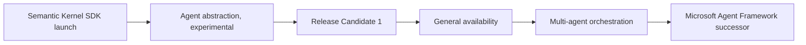

# Semantic Kernel Agent Framework: Microsoft's AI Agents SDK

> Created by **Microsoft** - [https://github.com/microsoft/semantic-kernel](https://github.com/microsoft/semantic-kernel)

## Overview

The Semantic Kernel Agent Framework is Microsoft's toolkit for building AI agents on top of the open-source Semantic Kernel SDK. [Microsoft Learn describes it](https://learn.microsoft.com/en-us/semantic-kernel/frameworks/agent) as a platform within the Semantic Kernel ecosystem for creating agents and adding agentic patterns to any application, using the same patterns and features as the core framework. In Microsoft's own framing, an agent has [three core elements](https://devblogs.microsoft.com/agent-framework/tag/agents): a system prompt or persona, plugins, and the ability to reason and create plans that address a user's goal. Agents built this way [use LLMs to interpret natural-language commands, combine them with predefined programming logic, and execute complex actions](https://devblogs.microsoft.com/semantic-kernel/announcement-agent-framework-documentation-updates) such as completing chats, running calculations and searching files.

Semantic Kernel came before its agents. Microsoft introduced it on March 17, 2023, in [Hello, Semantic Kernel!](https://devblogs.microsoft.com/agent-framework/hello-world), calling it a lightweight SDK that mixes conventional languages like C# and Python with LLM prompts, prompt templating, chaining and planning. First-class agents arrived on August 1, 2024, when Microsoft [announced enterprise multi-agent support in Semantic Kernel](https://devblogs.microsoft.com/agent-framework/introducing-agents-in-semantic-kernel), adding a standardized agent abstraction with Assistant API agents and chat-completion agents out of the box in the Python 1.6.0 and .NET 1.18 ([source](https://devblogs.microsoft.com/agent-framework/introducing-agents-in-semantic-kernel)).0 RC1 releases, and marking the framework experimental. It reached [Release Candidate 1](https://devblogs.microsoft.com/agent-framework/release-the-agents-sk-agents-framework-rc1) on February 28, 2025, with Semantic Kernel 1.40 for .NET and 1.22.0 for Python, then became [generally available on April 4, 2025](https://devblogs.microsoft.com/agent-framework/semantic-kernel-agents-are-now-generally-available) in Semantic Kernel 1.45 (.NET) and 1.27 ([source](https://devblogs.microsoft.com/agent-framework/release-the-agents-sk-agents-framework-rc1)) (Python). Microsoft then added a [multi-agent orchestration framework](https://devblogs.microsoft.com/agent-framework/semantic-kernel-multi-agent-orchestration) for building, managing and scaling complex agent workflows.

The story has a next chapter. [The Semantic Kernel GitHub repository](https://github.com/microsoft/semantic-kernel) now announces that Semantic Kernel is now Microsoft Agent Framework, the enterprise-ready successor, available at version 1.0 ([source](https://github.com/microsoft/semantic-kernel)) with stable APIs, a commitment to long-term support, multi-agent orchestration, multi-provider model support, and interoperability through A2A and MCP. Microsoft publishes a [migration guide from Semantic Kernel](https://learn.microsoft.com/en-us/agent-framework/migration-guide/from-semantic-kernel) for existing projects. The core vocabulary of kernels, plugins, function calling and a common agent abstraction carries over, so the concepts on this page remain useful, but a new project should decide early which package line it depends on.

At runtime, the kernel is the hub. In [Microsoft's Agents SDK integration](https://learn.microsoft.com/en-us/microsoft-365/agents-sdk/using-semantic-kernel-agent-framework), the kernel references the configured AI services, manages and publishes plugins, and provides execution context, while developers create a ChatHistory record and pass turn state into it so the kernel can use channel information during orchestration. Tool use then runs through [automatic function calling](https://learn.microsoft.com/en-us/semantic-kernel/concepts/planning): register plugins, enable automatic invocation in execution settings, and call the chat service with the history and the kernel. Persistence and long-term memory are covered in [adding memory and context to agents](https://tryhamster.com/skills/adding-memory-and-context-to-agents).

Independent evidence is mixed and not directly comparable. A [2026 empirical study of agentic frameworks](https://arxiv.org/html/2604.16646) that included Semantic Kernel found that frameworks completing all benchmarks averaged 44.35% accuracy on GSM8K, against 89.80% on BBH and 89.56% ([source](https://arxiv.org/html/2604.16646)) on ARC, concluding that mathematical reasoning remains a weakness across every framework tested. A [comparative thesis on multi-agent frameworks](https://doria.fi/bitstream/handle/10024/193122/serafim_de_oliveira_mariana_celi.pdf?sequence=2&isAllowed=y) reported that the Semantic Kernel Chat framework used roughly 6 million tokens for its TS10 optimization case and around 28 ([source](https://doria.fi/bitstream/handle/10024/193122/serafim_de_oliveira_mariana_celi.pdf?sequence=2&isAllowed=y)) million for TS50, substantially more than the others. A [simulated MCP and Semantic Kernel study](https://jisem-journal.com/index.php/journal/article/download/10385/6018/21794) reported better efficiency and robustness than rule-based systems but relied on artificial datasets. Maturity claims also conflict by date: a [2025 ([source](https://devblogs.microsoft.com/agent-framework/semantic-kernel-agents-are-now-generally-available)) practitioner review](https://dev.to/aakas/navigating-the-ai-agent-ecosystem-a-comprehensive-framework-analysis-5813) still called the Agent Framework experimental, while Microsoft had [declared it generally available](https://devblogs.microsoft.com/agent-framework/semantic-kernel-agents-are-now-generally-available).

Among alternatives, a [2026 practitioner comparison](https://linkedin.com/posts/sridhar-ch-290ba9206_agenticai-langgraph-crewai-activity-7488260643934892035-2tc3) credits Semantic Kernel with native .NET and Azure integration but warns Python-first teams that new community patterns may land elsewhere first.

| Framework | Orchestration style | Best fit | Main limitation | Source |
|---|---|---|---|---|
| Semantic Kernel | Plugin-led | Microsoft enterprise systems | Debugging can become complex | [TrueFoundry comparison](https://truefoundry.com/blog/agentic-ai-frameworks) |
| LangGraph | Explicit graph control flow | Conditional, cyclical workflows | Graph overhead on linear tasks | [practitioner comparison](https://linkedin.com/posts/sridhar-ch-290ba9206_agenticai-langgraph-crewai-activity-7488260643934892035-2tc3) |
| AutoGen | Conversation-driven | Open-ended exploration | Hard to constrain, audit, unit-test | [practitioner comparison](https://linkedin.com/posts/sridhar-ch-290ba9206_agenticai-langgraph-crewai-activity-7488260643934892035-2tc3) |
| CrewAI | Role-based crews | Fast prototyping | Complex state handoffs hard to control | [practitioner comparison](https://linkedin.com/posts/sridhar-ch-290ba9206_agenticai-langgraph-crewai-activity-7488260643934892035-2tc3) |

Teams planning agent builds in Hamster Studio can keep the framework decision, test results and migration notes in one shared workspace.

## Core Principles

### An agent is persona plus plugins plus planning

Microsoft defines an agent by [a persona, plugins, and the ability to plan toward a goal](https://devblogs.microsoft.com/agent-framework/tag/agents). The framework can [send one prompt combining the user request, plugins and persona](https://devblogs.microsoft.com/agent-framework/architecting-ai-apps-with-semantic-kernel) so the model plans how to reach the goal. Design all three together: a vague persona with sharp tools, or the reverse, produces erratic behavior. If an agent picks the wrong tool, check the persona and tool descriptions before blaming the model.

### Plugins are the agent's only way to act

Everything an agent does beyond generating text goes through plugins, which the [Semantic Kernel repository](https://github.com/microsoft/semantic-kernel) says can come from native code functions, prompt templates, OpenAPI specifications and MCP. Treat each plugin as a contract with clear names, typed inputs and structured outputs. Poorly named or loosely typed functions are hard for the model to select correctly. Details live in [integrating plugins and tools into agents](https://tryhamster.com/skills/integrating-plugins-and-tools-into-agents).

### Function calling is configured, not assumed

Current guidance replaces the old planners with [automatic function calling](https://learn.microsoft.com/en-us/semantic-kernel/concepts/planning), which you switch on in execution settings. Agent types differ here: [function calling must be explicitly enabled for ChatCompletionAgent](https://learn.microsoft.com/en-us/semantic-kernel/frameworks/agent/agent-functions), while an OpenAI Assistant agent always uses it. An agent that answers fluently but never touches its tools usually has this setting missing.

### One abstraction, service-specific agents

The [August 2024 release](https://devblogs.microsoft.com/agent-framework/introducing-agents-in-semantic-kernel) introduced a standardized agent abstraction with Assistant API and chat-completion agents as concrete types. The common interface lets you swap or combine agents, but each type still depends on a specific model service. Choose the type from the capabilities you need, not from familiarity, as shown in [selecting and comparing agent architectures](https://tryhamster.com/skills/selecting-and-comparing-agent-architectures).

### Orchestration is a separate layer from the agent

Single agents and coordination between agents are distinct concerns, and Microsoft shipped [multi-agent orchestration](https://devblogs.microsoft.com/agent-framework/semantic-kernel-multi-agent-orchestration) as its own framework for building, managing and scaling agent workflows. Guest material shows orchestration combining with the [Agent-to-Agent protocol](https://devblogs.microsoft.com/agent-framework/guest-blog-building-multi-agent-solutions-with-semantic-kernel-and-a2a-protocol) for interoperable systems. Get one agent reliable before adding more, since coordination multiplies cost and failure points.

### The framework supplies orchestration, not domain logic

Semantic Kernel gives you [agents and agentic patterns](https://learn.microsoft.com/en-us/semantic-kernel/frameworks/agent), kernels and plugin wiring. Data sources, business rules, validation and scoring are yours to build. Teams that expect the framework to know their domain end up with agents that improvise answers. Budget most engineering time for the tools the agent calls.

### Measure on your own workload

Published results vary widely: one [2026 benchmark study](https://arxiv.org/html/2604.16646) found sharp drops on mathematical reasoning across all frameworks, and a [comparative analysis](https://doria.fi/bitstream/handle/10024/193122/serafim_de_oliveira_mariana_celi.pdf?sequence=2&isAllowed=y) flagged high token use in Semantic Kernel Chat. Neither is a standardized ranking. [Dataiku recommends](https://dataiku.com/blog/ai-agent-frameworks) running the same agent workflow on two to three candidate frameworks against your actual data and tools, which is the only comparison that predicts your costs.

## Steps

1. **Define the task and required capabilities**
   Write down what the agent must accomplish, which tools it needs, what state it must keep, and which model service you can use. This description drives every later choice, including agent type. Keep it concrete: inputs the user provides, outputs they expect, and actions the agent may take. If you cannot list the tools, the agent is not ready to be built.

2. **Choose the package line**
   Decide between the Semantic Kernel packages and Microsoft Agent Framework before writing code. The [Semantic Kernel repository](https://github.com/microsoft/semantic-kernel) now points to Microsoft Agent Framework as the successor, and a [migration guide](https://learn.microsoft.com/en-us/agent-framework/migration-guide/from-semantic-kernel) covers moving existing code. Early agent APIs were [marked experimental](https://devblogs.microsoft.com/agent-framework/introducing-agents-in-semantic-kernel), so verify the version and package status you pin. Record the decision so the whole team builds against the same APIs.

3. **Build the kernel and add an AI service**
   The [quick start](https://learn.microsoft.com/en-us/semantic-kernel/get-started/quick-start-guide) sequence is to import packages, add AI services, build the kernel, add plugins, configure planning, and invoke. Keep service configuration outside code so you can swap models. Register one reusable kernel with your application builder instead of rebuilding it per request. A working kernel that returns a plain chat answer is your first checkpoint.

4. **Expose your code as plugins**
   Wrap each operation as a function, [decorate it with KernelFunction, and place it in a plugin](https://learn.microsoft.com/en-us/agent-framework/migration-guide/from-semantic-kernel) that you add to the kernel passed to the agent. Plugins can be added [before or after the agent is created, or passed to its constructor](https://learn.microsoft.com/en-us/semantic-kernel/frameworks/agent/agent-functions). Give functions descriptive names and structured inputs and outputs. Test each function directly before letting the model call it.

5. **Create the agent and enable function calling**
   Pick the agent type that matches your service, give it a persona and instructions, and attach the kernel. Enable [automatic function calling](https://learn.microsoft.com/en-us/semantic-kernel/concepts/planning) in execution settings so the model can select and invoke registered functions until it produces a result. Avoid the deprecated Stepwise and Handlebars planners, which current guidance says have been removed. Confirm in logs that tools are actually being invoked.

6. **Manage chat history**
   Keep a ChatHistory record per conversation so the agent sees prior turns. In the [Agents SDK integration](https://learn.microsoft.com/en-us/microsoft-365/agents-sdk/using-semantic-kernel-agent-framework), developers pass turn state into ChatHistory so the kernel can use channel information during orchestration. Decide early whether history must survive restarts, because sample in-memory storage will not. Watch history length, since long histories raise token cost on every call.

7. **Evaluate against real tasks and alternatives**
   Run the agent on a fixed set of representative tasks and inspect tool calls as well as final answers. Compare it with one or two alternative frameworks on the same tasks, as [Dataiku suggests](https://dataiku.com/blog/ai-agent-frameworks). Track accuracy, latency and token use, because [published benchmarks](https://arxiv.org/html/2604.16646) show large variation by task type. Add orchestration or more agents only after a single agent passes.

## When to Use

- Your application is built on .NET or runs in Azure, because practitioner comparisons rate native .NET and Azure integration as Semantic Kernel's main strength.
- You need an LLM to call existing business code, since the plugin model turns ordinary functions into tools with little glue.
- You are maintaining an existing Semantic Kernel codebase and need agents now, with a documented migration path to Microsoft Agent Framework later.
- You want both single agents and coordinated multi-agent workflows under one abstraction, so you can start small and add orchestration without switching libraries.
- Your enterprise requires plugin sources such as OpenAPI services or MCP tools, which the plugin ecosystem supports directly.

## When Not to Use

- You are starting a greenfield project today, because Microsoft now presents Microsoft Agent Framework as the successor with stable, long-term-supported APIs, so starting on the older line adds a migration.
- Your team is Python-first and wants the newest community patterns immediately, since comparisons note those often appear in other ecosystems first.
- Your workflow is heavily conditional and cyclical and you need explicit control over every branch, where graph-based frameworks like LangGraph are described as the stronger fit.
- Token budget is tight and you plan chatty multi-agent conversations, since one comparative study measured substantially higher token use for Semantic Kernel Chat.

## Skills

This method includes the following skills:

- [Designing Human-in-the-Loop Agent Workflows](../../skills/designing-human-in-the-loop-agent-workflows/SKILL.md): How to incorporate approval gates, termination strategies, and human feedback checkpoints into agent execution loops to maintain oversight and control.
- [Deploying AI Agents for SEO and Keyword Research Automation](../../skills/deploying-ai-agents-for-seo-automation/SKILL.md): How to build and deploy Semantic Kernel agents that autonomously perform keyword research, content optimization, and SEO auditing tasks.
- [Selecting and Comparing AI Agent Architectures](../../skills/selecting-and-comparing-agent-architectures/SKILL.md): How to evaluate Semantic Kernel's ChatCompletionAgent, OpenAIAssistantAgent, and custom agent types to choose the best architecture for your use case.
- [Building Autonomous AI Agents with Semantic Kernel](../../skills/building-autonomous-ai-agents-with-semantic-kernel/SKILL.md): How to define, configure, and instantiate autonomous AI agents using Semantic Kernel's agent abstractions, personas, and execution settings.
- [Orchestrating Multi-Agent Conversations and Collaboration](../../skills/orchestrating-multi-agent-conversations/SKILL.md): How to set up AgentGroupChat and agent channel patterns so multiple AI agents collaborate, delegate tasks, and resolve complex workflows together.
- [Integrating Plugins and Tools into Semantic Kernel Agents](../../skills/integrating-plugins-and-tools-into-agents/SKILL.md): How to register native functions, OpenAPI plugins, and external tools so agents can autonomously call APIs, databases, and services during execution.
- [Adding Memory and Context Management to AI Agents](../../skills/adding-memory-and-context-to-agents/SKILL.md): How to wire vector stores, chat history, and semantic memory into agents so they retain context across turns and retrieve relevant knowledge autonomously.
- [Implementing Agent Planning Strategies for Complex Tasks](../../skills/implementing-agent-planning-strategies/SKILL.md): How to configure and customize planning strategies—such as stepwise and function-calling planners—that enable agents to decompose goals into actionable steps.

## FAQ

**What are AI agents in Semantic Kernel?**

They are components that use an LLM to interpret requests, decide which plugins to call, and act on a user's behalf. Microsoft describes each agent as a persona, a set of plugins, and the ability to plan toward a goal. The framework wraps these in a common agent abstraction with service-specific implementations. That lets you mix agent types in one application.

**Is Semantic Kernel being replaced by Microsoft Agent Framework?**

The official GitHub repository now states that Semantic Kernel is now Microsoft Agent Framework, described as its enterprise-ready successor at version 1.0 ([source](https://github.com/microsoft/semantic-kernel)). Microsoft publishes a migration guide for moving existing Semantic Kernel code. Concepts like kernels, plugins and function calling carry over. New projects should evaluate the successor first.

**Which languages does it support?**

Microsoft's original announcement described mixing C# and Python with LLM prompts, and the agent framework shipped for both .NET and Python. A Microsoft overview of its agentic frameworks also lists Java for Semantic Kernel. Practitioner comparisons consider .NET and Azure its strongest fit. Python-first teams may find newer community patterns appear in other frameworks earlier.

**How does it compare with LangGraph, AutoGen and CrewAI?**

Comparisons describe Semantic Kernel as plugin-led and best for Microsoft enterprise systems, with debugging that can become complex. LangGraph uses explicit graph control flow for conditional, cyclical workflows. AutoGen is conversation-driven and suits exploratory tasks but is hard to audit, while CrewAI's role-based crews prototype quickly but struggle with complex state handoffs. These are qualitative judgments, so test on your own workload.

**Is it fast and accurate enough for production?**

Published evidence is limited and uses different setups, so it does not form a single ranking. One 2026 ([source](https://arxiv.org/html/2604.16646)) study found every framework tested degraded sharply on mathematical reasoning, and another measured high token use for Semantic Kernel Chat in optimization cases. Run your own benchmark on representative tasks before committing. Track tool-call correctness as well as final answers.

**Do I still need planners?**

No, current Semantic Kernel guidance says the Stepwise and Handlebars planners have been deprecated and removed from the packages. Automatic function calling is the documented approach: register plugins, enable automatic invocation, and call the model with history and kernel. The model then chooses and sequences functions itself. See the planning strategies skill for the full loop.

## Sources

- [Semantic Kernel Agents are now Generally Available](https://devblogs.microsoft.com/agent-framework/semantic-kernel-agents-are-now-generally-available)
- [Tag \| Microsoft Agent Framework](https://devblogs.microsoft.com/agent-framework/tag/agents)
- [How-To: Implementing](https://devblogs.microsoft.com/semantic-kernel/announcement-agent-framework-documentation-updates)
- [Introducing enterprise multi-agent support in Semantic Kernel](https://devblogs.microsoft.com/agent-framework/introducing-agents-in-semantic-kernel)
- [Semantic Kernel: Multi-agent Orchestration](https://devblogs.microsoft.com/agent-framework/semantic-kernel-multi-agent-orchestration)
- [Release the Agents\! SK Agents Framework RC1](https://devblogs.microsoft.com/agent-framework/release-the-agents-sk-agents-framework-rc1)
- [Hello, Semantic Kernel\! \| Microsoft Agent Framework](https://devblogs.microsoft.com/agent-framework/hello-world)
- [Guest Blog: Building Multi-Agent Solutions with Semantic](https://devblogs.microsoft.com/agent-framework/guest-blog-building-multi-agent-solutions-with-semantic-kernel-and-a2a-protocol)
- [Microsoft Semantic Kernel - GitHub](https://github.com/microsoft/semantic-kernel)
- [Agentic Frameworks for Reasoning Tasks: An Empirical Study](https://arxiv.org/html/2604.16646)
- [Agent Frameworks Break: Where Each One Fails](https://linkedin.com/posts/sridhar-ch-290ba9206_agenticai-langgraph-crewai-activity-7488260643934892035-2tc3)
- [A Comparative Analysis of LLM-Based Multi-Agent](https://doria.fi/bitstream/handle/10024/193122/serafim_de_oliveira_mariana_celi.pdf?sequence=2&isAllowed=y)
- [Multi-Agent AI Orchestration Using MCP and Semantic](https://jisem-journal.com/index.php/journal/article/download/10385/6018/21794)
- [Best AI agent frameworks \(2026\)](https://dataiku.com/blog/ai-agent-frameworks)
- [Best Agentic AI Frameworks Compared](https://truefoundry.com/blog/agentic-ai-frameworks)
- [Navigating the AI Agent Ecosystem: A Comprehensive](https://dev.to/aakas/navigating-the-ai-agent-ecosystem-a-comprehensive-framework-analysis-5813)
- [Semantic Kernel to Microsoft Agent Framework Migration Guide](https://learn.microsoft.com/en-us/agent-framework/migration-guide/from-semantic-kernel)
- [How to quickly start with Semantic Kernel \| Microsoft Learn](https://learn.microsoft.com/en-us/semantic-kernel/get-started/quick-start-guide)
- [Use Semantic Kernel and Agent Framework in Agents SDK](https://learn.microsoft.com/en-us/microsoft-365/agents-sdk/using-semantic-kernel-agent-framework)
- [Limitations For Agent](https://learn.microsoft.com/en-us/semantic-kernel/frameworks/agent/agent-functions)
- [What are Planners in Semantic Kernel](https://learn.microsoft.com/en-us/semantic-kernel/concepts/planning)
- [Semantic Kernel Agent Framework \| Microsoft Learn](https://learn.microsoft.com/en-us/semantic-kernel/frameworks/agent)
- [Architecting AI Apps with Semantic Kernel \| Microsoft Agent](https://devblogs.microsoft.com/agent-framework/architecting-ai-apps-with-semantic-kernel)

---

*[Import this method into Hamster](https://tryhamster.com) to share it with your team, customize it for your workflow, and let AI agents use it automatically.*
