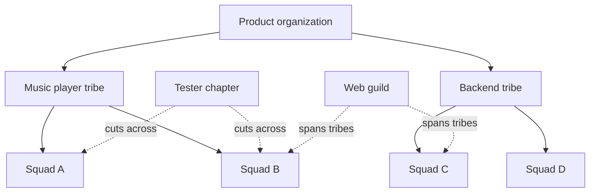

# Spotify Squads: what every product manager should know

> Created by **Spotify Engineering Team** — [https://blog.crisp.se/wp-content/uploads/2012/11/SpotifyScaling.pdf](https://blog.crisp.se/wp-content/uploads/2012/11/SpotifyScaling.pdf)

## Overview

Spotify Squads, usually called the Spotify Model, is a way of organizing product development around small, autonomous, cross-functional teams called squads. Squads are grouped into tribes, chapters handle discipline-based people management, and guilds act as voluntary communities of interest. In the [original Scaling Agile @ Spotify report](https://storage.ghost.io/c/73/a9/73a90ce4-1663-4169-a7cb-efdf906b6b25/content/files/2022/12/Scaling-Agile-@-Spotify-with-Tribes--Squads--Chapters---Guilds-Henrik-Kniberg---Anders-Ivarsson-Oct-2012.pdf), a squad is a self-organizing team with end-to-end responsibility for a product area, free to use Scrum, Kanban or a mix, and designed to feel like a "mini-startup" with the skills and tools to design, develop, test and release to production. For a product manager, the practical consequence is that you usually act as the squad's product owner: you set priorities for one long-lived team that owns its area, rather than feeding tickets to a pool of shared specialists.

The model comes from a white paper by Henrik Kniberg and Anders Ivarsson, agile coaches working with Spotify, titled Scaling Agile @ Spotify with Tribes, Squads, Chapters & Guilds and [dated October 2012](https://storage.ghost.io/c/73/a9/73a90ce4-1663-4169-a7cb-efdf906b6b25/content/files/2022/12/Scaling-Agile-@-Spotify-with-Tribes--Squads--Chapters---Guilds-Henrik-Kniberg---Anders-Ivarsson-Oct-2012.pdf). Kniberg posted it on the [Crisp blog on November 14, 2012](https://blog.crisp.se/2012/11/14/henrikkniberg/scaling-agile-at-spotify), noting that he wrote it with Ivarsson, one of the coaches he worked with. The document described an organization of [roughly 250 engineers, 30 squads, 6 tribes and 3 development offices](https://slideshare.net/slideshow/empowering-engineering-talent/41128818?nway-=,). The phrase "Spotify Model" is a later label; [Atlassian's account of its origins](https://atlassian.com/agile/agile-at-scale/spotify) traces it back to that white paper rather than to a formal methodology.

The authors never presented it as a blueprint. The paper called itself "only a snapshot of our current way of working" and a journey in progress, not a journey completed. Spotify's [2014 engineering culture write-up](https://engineering.atspotify.com/2014/3/spotify-engineering-culture-part-1) repeated that line and added that there was a lot of variation from squad to squad. By 2016, Spotify's own presentation told audiences [not to copy the model](https://infoq.com/news/2016/10/no-spotify-model), because it changed all the time and there was no single way software was developed at Spotify. [Later accounts](https://stratrix.com/vault/spotify-squad-model) describe Spotify adding more traditional management layers and more formal coordination as it grew, so the published arrangement no longer represents the company.

The units nest and cross in a particular way. Squads sit inside tribes, which group squads working in related areas such as the [music player or backend infrastructure](https://blog.crisp.se/wp-content/uploads/2012/11/SpotifyScaling.pdf). Chapters cut across the squads within one tribe, gathering people of the same discipline under a chapter lead, while guilds reach across tribes and are joined voluntarily.

| Unit    | Purpose                                     | Scope                      | Typical size (reported)                                                                                                                       |
| ------- | ------------------------------------------- | -------------------------- | --------------------------------------------------------------------------------------------------------------------------------------------- |
| Squad   | Owns a product area end to end              | One mission                | [6-12 people](https://stratrix.com/vault/spotify-squad-model)                                                                                 |
| Tribe   | Groups squads in related areas              | Several squads             | [Capped near 100 people](https://stratrix.com/vault/spotify-squad-model)                                                                      |
| Chapter | Same-discipline people under a chapter lead | Across squads in one tribe | [5-15](https://resources.rework.com/libraries/project-management/spotify-model) or [5-20](https://mooncamp.com/glossary/spotify-model) people |
| Guild   | Voluntary community of interest             | Whole organization         | Not reported                                                                                                                                  |

Size guidance differs between guides, so treat these as reported ranges, not rules.

The evidence base is thin. The report said the approach [seemed to be working quite well](https://storage.ghost.io/c/73/a9/73a90ce4-1663-4169-a7cb-efdf906b6b25/content/files/2022/12/Scaling-Agile-@-Spotify-with-Tribes--Squads--Chapters---Guilds-Henrik-Kniberg---Anders-Ivarsson-Oct-2012.pdf) based on surveys and retrospectives, but it published no sample sizes, response rates or comparative data. A practitioner review notes the model has not been academically evaluated and rests on an informal report. A [2023 exploratory study of a large-scale transformation](https://journals.sagepub.com/doi/full/10.1177/02683962231164428) found management failed to communicate the value of adopting the model in tangible terms, squads never bought into the rationale, and people reported added bureaucracy, more time in ceremonies and rising technical debt. Critics go further: [one practitioner](https://scrum.org/resources/blog/spotify-model-10-lessons-transplantology) calls it a snapshot of engineering culture and nothing more, and a [2023 critique](https://agilepainrelief.com/blog/the-spotify-model-of-scaling-spotify-doesnt-use-it-neither-should-you) argues Spotify does not practice the version others copy.

Compared with Scrum or Kanban, the model sits a layer above the team: a squad can run either or a hybrid, which is the main distinction [Spotify's report](https://storage.ghost.io/c/73/a9/73a90ce4-1663-4169-a7cb-efdf906b6b25/content/files/2022/12/Scaling-Agile-@-Spotify-with-Tribes--Squads--Chapters---Guilds-Henrik-Kniberg---Anders-Ivarsson-Oct-2012.pdf) drew. Scrum and Kanban shape how one team works; the Spotify arrangement shapes how many teams relate, who manages specialists and how knowledge spreads. The primary report offers no controlled comparison against Scrum, Kanban, SAFe, LeSS or any other scaling approach, so claims that it outperforms them lack published support. Treat it as a context-specific design to borrow from. Teams using Hamster often keep each squad's mission, ownership area and open dependencies in one shared workspace so the structure stays visible as it changes.

## Core Principles

### Autonomy balanced against alignment

The model's stated aim is to [balance team autonomy against company-wide alignment](https://mooncamp.com/glossary/spotify-model), not to maximize either one. Squads decide how to build within their area, while tribes, chapters and guilds keep them pointed in a common direction and technically consistent. Researchers have noted that, [lacking scientific research on the model](https://link.springer.com/chapter/10.1007/978-3-030-30126-2_3), there were no guidelines for building alignment between squads, so each organization has to design it. If squads keep asking permission for routine decisions, alignment has turned into control.

### End-to-end ownership without handoffs

A squad should have the skills and tools to [design, develop, test and release to production](https://storage.ghost.io/c/73/a9/73a90ce4-1663-4169-a7cb-efdf906b6b25/content/files/2022/12/Scaling-Agile-@-Spotify-with-Tribes--Squads--Chapters---Guilds-Henrik-Kniberg---Anders-Ivarsson-Oct-2012.pdf) on its own. Kniberg argued that [handoffs add cost and interrupt the learning loop](https://blog.crisp.se/2012/11/14/henrikkniberg/scaling-agile-at-spotify), because the team that ships no longer sees what happens next. For a product manager, this means scoping an area the squad can actually own, including release and operation. A squad that waits on another team for every deploy is autonomous in name only.

### Process is the squad's choice

The report let squads pick [Scrum, Kanban or a mix](https://storage.ghost.io/c/73/a9/73a90ce4-1663-4169-a7cb-efdf906b6b25/content/files/2022/12/Scaling-Agile-@-Spotify-with-Tribes--Squads--Chapters---Guilds-Henrik-Kniberg---Anders-Ivarsson-Oct-2012.pdf) instead of mandating one process. The reasoning is that the team closest to the work knows which cadence fits it. Consistency comes from shared outcomes and chapter standards, not from identical ceremonies. Imposing one process across all squads usually signals the structure has been copied rather than understood.

### Chapter leads manage and still contribute

Chapters separate people management from daily delivery: at Spotify, [every squad member belongs to a chapter whose lead acts as line manager](https://cisr.mit.edu/publication/2017_1201_DigitalDesignAtSpotify_BaiyereRossSebastian). The original material keeps the lead inside a squad doing day-to-day work so they stay close to real conditions. Practitioner guidance suggests a split of roughly [50-70% contributor and 30-50% people leadership](https://umbrex.com/resources/frameworks/organization-frameworks/spotify-model-squads-tribes-chapters-guilds), a figure not found in the original paper. Kniberg described chapter leads with [too many direct reports](https://infoq.com/jp/news/2013/04/scaling-agile-spotify-kniberg) struggling to find time for one-to-ones and coaching, which is the warning sign to watch.

### Guilds are voluntary, chapters are not

A guild is an informal, voluntary community of interest spanning the organization, built for knowledge sharing. A chapter is a discipline group [within one tribe with a line-management function](https://talkspirit.com/en/blog/spotify-squads), so membership follows from your role. Mixing the two produces guilds with management obligations nobody signed up for, or chapters that meet only when people feel like it. Keep performance and salary decisions in chapters and keep guilds optional.

### Remove blocking dependencies first

Spotify's aim was not zero dependencies but squads that are [as autonomous as possible](https://blog.crisp.se/wp-content/uploads/2012/11/SpotifyScaling.pdf), and the report states that squads sometimes need to work together. It regularly asked each squad which squads it depended on and whether each dependency blocked or merely slowed it down. Blocking dependencies and those crossing tribe boundaries got priority for elimination. Recording dependencies without that blocking versus slowing distinction hides which ones actually stop delivery.

### Adapt the snapshot, do not copy it

Spotify's own presentation advised that you [shouldn't copy the model in your own organization](https://infoq.com/news/2016/10/no-spotify-model). The [2023 transformation study](https://journals.sagepub.com/doi/full/10.1177/02683962231164428) shows what happens when the reason for change is unclear: squads did not accept the rationale and success was judged differently by each stakeholder group. Start from your own delivery problems and take the parts that address them. If you cannot name the problem a unit solves, leave it out.

## Steps

1. **Assess your context**
   Start by listing the delivery problems you want to fix, such as slow handoffs, unclear ownership or specialists without career support. Check whether your architecture allows teams to ship independently, since that determines how autonomous squads can be. Decide which units address your problems and which you can skip. Write the rationale in terms squads will recognize, because an unexplained restructure invites resistance.

   The [adaptation skill](https://tryhamster.com/skills/adapting-spotify-model-to-your-organization) covers this assessment in depth.

2. **Define missions and ownership areas**
   Split the product into areas a single team can own end to end, such as a user journey, feature set or service. Give each area a short mission that names the outcome the squad exists to improve. Assign a product owner to each area to hold priorities and stakeholder contact. Overlapping ownership shows up quickly as duplicated work or disputes, so resolve boundaries before staffing.

   See [defining squad missions and ownership](https://tryhamster.com/skills/defining-squad-missions-and-ownership).

3. **Form cross-functional squads**
   Staff each squad with the skills needed to design, build, test and release its area without routine handoffs. Keep squads long-lived so they accumulate context about their users and code. Let each squad choose Scrum, Kanban or a hybrid. If a squad regularly waits on another team for a core capability, its composition is incomplete.

   The [forming squads skill](https://tryhamster.com/skills/forming-autonomous-squads) covers composition and size.

4. **Group squads into tribes**
   Cluster squads that work in related areas into tribes so coordination happens among people who share context. Keep tribes small enough that members can still know each other. Place tightly coupled squads in the same tribe, since cross-tribe dependencies are the hardest to resolve. Revisit groupings when the product changes shape.

   See [organizing squads into tribes](https://tryhamster.com/skills/organizing-squads-into-tribes).

5. **Set up chapters and chapter leads**
   Within each tribe, group people of the same discipline into chapters led by a practising specialist who is also their line manager. Give chapter leads explicit responsibility for hiring, development, performance and standards. Keep each lead in a squad so they stay close to the work. Watch the number of direct reports, because an overloaded lead stops coaching.

   The [chapters skill](https://tryhamster.com/skills/running-chapters-for-discipline-excellence) explains the role.

6. **Seed voluntary guilds**
   Let people start guilds around shared interests or practices that span tribes, such as web development or testing. Keep membership optional and avoid attaching management duties. Support guilds with time and a place to share material rather than mandates. A guild nobody attends is a signal to retire it, not to make it compulsory.

   See [building guilds](https://tryhamster.com/skills/building-guilds-as-communities-of-practice).

7. **Triage dependencies and review regularly**
   Ask each squad which squads it depends on and whether each dependency blocks or slows it. Work first on removing blocking and cross-tribe dependencies, and convene the affected squads only when coordination is needed. Track unresolved items on a shared board so they stay visible. Periodically review whether the structure still fits and change it as the organization learns.

   The [dependency skill](https://tryhamster.com/skills/managing-dependencies-across-squads) and [autonomy and alignment skill](https://tryhamster.com/skills/balancing-autonomy-and-alignment) cover the mechanics.

## When to Use

- Your product organization has grown to several teams and specialists are spread across projects, because long-lived squads give each product manager a stable team and clear ownership.
- Your product can be cut into areas that a single team can build, release and operate with limited help, since end-to-end ownership is the core of the model.
- Specialists embedded in product teams lack a manager who understands their discipline, which is the gap chapters and chapter leads are designed to fill.
- Individual teams already run Scrum or Kanban well and the friction sits between teams, since tribes, dependency triage and guilds address cross-team coordination rather than team-level process.
- Leadership is willing to delegate product and release decisions to teams, because the model depends on squads deciding without routine approvals.

## When Not to Use

- You have a single product team or a very small startup, because tribes, chapters and guilds add coordination overhead with no cross-team problem to solve.
- Your architecture forces nearly every change through several teams, since squads cannot own outcomes end to end and dependencies will dominate the work.
- Leadership wants a validated, turnkey framework with prescribed roles, because the model is based on an informal report that has not been academically evaluated.
- A pattern the 2023 transformation study linked to squads rejecting the change involved lack of clear value communication.

## Skills

This method includes the following skills:

- [Running Chapters for Discipline-Based Management](skills/running-chapters-for-discipline-excellence/SKILL.md) — How to establish and facilitate chapters — groups of specialists across squads within a tribe — to ensure coaching, career growth, and technical consistency.
- [Defining Squad Missions and Product Ownership Areas](skills/defining-squad-missions-and-ownership/SKILL.md) — How to clearly delineate each squad's mission, scope, and product ownership boundaries to minimize dependencies and maximize accountability.
- [Forming Autonomous Cross-Functional Squads](skills/forming-autonomous-squads/SKILL.md) — How to compose, charter, and empower small cross-functional squads with end-to-end ownership of a product area or feature.
- [Managing Dependencies Across Squads and Tribes](skills/managing-dependencies-across-squads/SKILL.md) — Practices for identifying, visualizing, and resolving cross-squad dependencies including Scrum of Scrums, dependency boards, and liaison roles.
- [Organizing Squads into Tribes](skills/organizing-squads-into-tribes/SKILL.md) — How to group related squads into tribes of up to \~100 people to maintain alignment around a shared mission while preserving squad autonomy.
- [Building Guilds as Cross-Cutting Communities of Practice](skills/building-guilds-as-communities-of-practice/SKILL.md) — How to create and sustain voluntary, company-wide guilds that share knowledge, tools, and best practices across tribes and squads.
- [Balancing Squad Autonomy with Organizational Alignment](skills/balancing-autonomy-and-alignment/SKILL.md) — Techniques for setting strategic direction and guardrails so squads stay aligned on company goals without sacrificing their decision-making independence.
- [Adapting the Spotify Model to Your Organization](skills/adapting-spotify-model-to-your-organization/SKILL.md) — How to assess organizational readiness, selectively adopt elements of the Spotify model, and avoid common anti-patterns when scaling this framework beyond Spotify.

## FAQ

**Is the Spotify Model an official framework?**

No. It began as a white paper by Henrik Kniberg and Anders Ivarsson that called itself "only a snapshot of our current way of working". The "Spotify Model" name was applied later as others generalized the paper. Treat it as a set of ideas to adapt rather than a certified method with fixed rules.

**Does Spotify still use the Spotify Model?**

Not in its original form. [Later accounts](https://stratrix.com/vault/spotify-squad-model) describe Spotify adding more traditional management layers and formal coordination as it grew, while keeping some original elements. A [2023 critique](https://agilepainrelief.com/blog/the-spotify-model-of-scaling-spotify-doesnt-use-it-neither-should-you) argues the commonly copied version is not what Spotify practices today.

**What does a product manager do in a squad?**

The product manager usually takes the product owner role, guiding what the squad builds and representing product priorities. Because the squad owns its area end to end, the product manager works with one stable team instead of negotiating for shared resources. The job leans on writing a clear mission, keeping stakeholder contact direct and protecting the squad from approval creep.

**How is a chapter different from a guild?**

A chapter groups people of one discipline within a single tribe and has a [chapter lead who acts as line manager](https://cisr.mit.edu/publication/2017_1201_DigitalDesignAtSpotify_BaiyereRossSebastian). A guild is a [voluntary community of interest](https://usu.com/en/blog/the-spotify-model-magic-bullet-or-overrated) that can span the whole organization. Chapters carry responsibility for people and standards, while guilds exist for knowledge sharing.

**How big should a squad be?**

Sources disagree. One guide describes squads of [6-12 people](https://stratrix.com/vault/spotify-squad-model), while another cites fewer than eight. Size the squad by the skills its area needs to deliver without handoffs, and treat any published figure as a starting point rather than a Spotify rule.

**Is there evidence that the Spotify Model works?**

Very little. The original report said the approach [seemed to be working quite well](https://storage.ghost.io/c/73/a9/73a90ce4-1663-4169-a7cb-efdf906b6b25/content/files/2022/12/Scaling-Agile-@-Spotify-with-Tribes--Squads--Chapters---Guilds-Henrik-Kniberg---Anders-Ivarsson-Oct-2012.pdf) but published no sample sizes or comparative data. A [2023 study](https://journals.sagepub.com/doi/full/10.1177/02683962231164428) of one transformation reported added bureaucracy, lost motivation and rising technical debt, and found effectiveness hard to judge because stakeholder groups evaluated it differently.

**How does it compare with SAFe or LeSS?**

No controlled comparison exists; the [primary report](https://storage.ghost.io/c/73/a9/73a90ce4-1663-4169-a7cb-efdf906b6b25/content/files/2022/12/Scaling-Agile-@-Spotify-with-Tribes--Squads--Chapters---Guilds-Henrik-Kniberg---Anders-Ivarsson-Oct-2012.pdf) does not measure it against SAFe, LeSS, Scrum or Kanban. What sets it apart is that it describes one company's organizational design rather than a prescribed scaling process. Choose based on your own coordination problems rather than on claims of superiority.

## Sources

- [\[PDF\] Scaling Agile @ Spotify - Ghost](https://storage.ghost.io/c/73/a9/73a90ce4-1663-4169-a7cb-efdf906b6b25/content/files/2022/12/Scaling-Agile-@-Spotify-with-Tribes--Squads--Chapters---Guilds-Henrik-Kniberg---Anders-Ivarsson-Oct-2012.pdf)
- [Scaling Agile @ Spotify with Tribes, Squads, Chapters \& Guilds](https://blog.crisp.se/2012/11/14/henrikkniberg/scaling-agile-at-spotify)
- [Spotify's Squad Model of Organization \| Stratrix Vault](https://stratrix.com/vault/spotify-squad-model)
- [Discover the Spotify model](https://atlassian.com/agile/agile-at-scale/spotify)
- [Empowering Engineering Talent - an update from Spotify](https://slideshare.net/slideshow/empowering-engineering-talent/41128818?nway-=,)
- [What is the Spotify Model?](https://mooncamp.com/glossary/spotify-model)
- [Spotify Model: Squads, Tribes, Chapters, and Guilds Explained](https://resources.rework.com/libraries/project-management/spotify-model)
- [From transformation to normalisation: An exploratory study of a large-scale agile transformation - Noel Carroll, Kieran Conboy, Xiaofeng Wang, 2023](https://journals.sagepub.com/doi/full/10.1177/02683962231164428)
- [Don't Copy the Spotify Model](https://infoq.com/news/2016/10/no-spotify-model)
- [Spotify Model – 10 lessons in transplantology - Scrum.org](https://scrum.org/resources/blog/spotify-model-10-lessons-transplantology)
- [Spotify Doesn't Use the Spotify Model. Neither Should You](https://agilepainrelief.com/blog/the-spotify-model-of-scaling-spotify-doesnt-use-it-neither-should-you)
- [Spotify engineering culture \(part 1\)](https://engineering.atspotify.com/2014/3/spotify-engineering-culture-part-1)
- [Spotify Tailoring for Promoting Effectiveness in Cross-Functional Autonomous Squads](https://link.springer.com/chapter/10.1007/978-3-030-30126-2_3)
- [Spotify Model \(Squads, Tribes, Chapters, Guilds\) \| Agile](https://umbrex.com/resources/frameworks/organization-frameworks/spotify-model-squads-tribes-chapters-guilds)
- [Designing for Digital—Lessons from Spotify](https://cisr.mit.edu/publication/2017_1201_DigitalDesignAtSpotify_BaiyereRossSebastian)
- [What are Spotify Squads? - Talkspirit](https://talkspirit.com/en/blog/spotify-squads)
- [The Spotify Model: Magic Bullet or Overrated?](https://usu.com/en/blog/the-spotify-model-magic-bullet-or-overrated)
- [Spotifyはどうやってアジャイルをスケールアウトしたか: Henrik Kniberg氏へのインタビュー](https://infoq.com/jp/news/2013/04/scaling-agile-spotify-kniberg)
- [Scaling Agile @ Spotify - Crisp's Blog](https://blog.crisp.se/wp-content/uploads/2012/11/SpotifyScaling.pdf)

---

*[Import this method into Hamster](https://tryhamster.com) to share it with your team, customize it for your workflow, and let AI agents use it automatically.*
