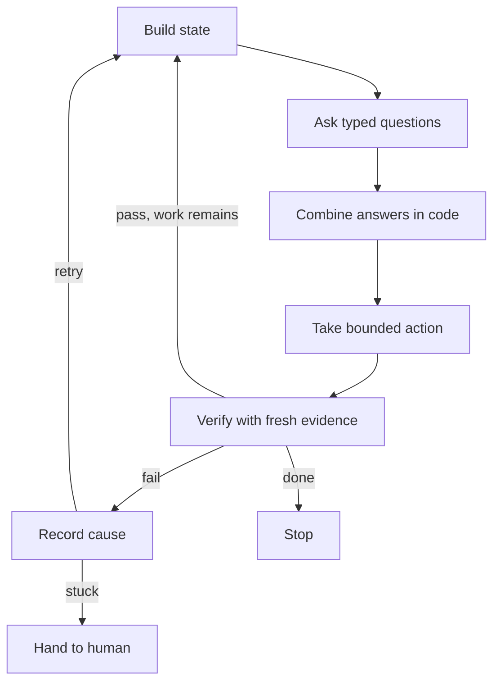

# What Is the State–Questions–Action–Verify Loop?

> Created by **TypeSafe AI** — [https://typesafe.ai](https://typesafe.ai)

## Overview

The State-Questions-Action-Verify Loop is a workflow pattern for AI agents and AI-assisted features. Each cycle builds an explicit state, asks narrow typed questions about it, and takes one bounded action chosen from the answers. It then checks the result with fresh evidence before deciding to continue, retry or stop. The name does not belong to an established framework with a documented creator. The four parts combine vocabulary from [TypeSafe AI's documentation on state](https://docs.typesafe.ai/concepts/state) with the generic agent loop described in research and practitioner writing. Treat the name as a convenient label for a set of practices, not as a standard you can cite for authority.

The state and questions half comes from TypeSafe. Its docs define state as [the content a System One model evaluates, such as a support message, a passage of text, or the current state of your application](https://docs.typesafe.ai/concepts/state). Each request evaluates one state against one or more questions. Its [primitives come in pairs](https://docs.typesafe.ai/primitives): a question defines one judgment to make about the state, and the answer is a typed value returned to your code. The [System One page](https://docs.typesafe.ai/concepts/system-one) describes the rest of the workflow. The application builds state, asks independent questions, combines the answers with deterministic checks in code, and routes the case for action or review. TypeSafe also documents verification as a separate use of the same primitives. Its [SDE cascade](https://docs.typesafe.ai/cookbooks/sde_cascade) extracts fields with a cheap model, checks each field with a yes/no question, and escalates to a more expensive model when a verifier fires. None of these pages uses the four-part name.

The action and verify half comes from the agent-loop literature. A [2026 review of agent systems](https://arxiv.org/html/2601.01743v1) describes the minimal loop as retrieve context, plan, act via tools, verify, update memory and repeat, and ties it to the ReAct and reflection patterns. A [practitioner guide to agent architecture](https://aakashx.com/blog/agent-architecture-loops-planning-verification) gives a longer version: observe, reason, choose action, act, observe result, update state, verify, then continue or terminate. This loop changes two things. It replaces open-ended reasoning with typed questions whose answers code can branch on, and it treats state as an artifact you build and persist, not as whatever sits in the context window.

The evidence that verification loops help is suggestive, not conclusive. A [2026 practitioner article](https://dev.to/mininglamp/loop-engineering-the-next-step-after-prompt-engineering-for-ai-agents-449m) reports higher OSWorld success for self-correcting loops than for sequential or single-step approaches. That article does not state the study design, sample size, benchmark version, model setup or cost. Its self-correcting loops are also not this exact pattern. Read the figures as a direction, not as proof that this loop causes the gain.

| Approach | Shape | Reported OSWorld result | Caveat |
|---|---|---|---|
| Single-step | One prompt, one action | About 30% per [this article](https://dev.to/mininglamp/loop-engineering-the-next-step-after-prompt-engineering-for-ai-agents-449m) | Method details not published |
| Multi-step sequential | Fixed chain, no checking | About 45% per [this article](https://dev.to/mininglamp/loop-engineering-the-next-step-after-prompt-engineering-for-ai-agents-449m) | Method details not published |
| Self-correcting loop | Act, check, revise | 58.2% per [this article](https://dev.to/mininglamp/loop-engineering-the-next-step-after-prompt-engineering-for-ai-agents-449m) | Not this exact pattern |
| ReAct-style loop | Plan, act, verify, update memory | Not reported | Verification often free-form |
| This loop | Typed questions on explicit state | Not reported | No published benchmarks |

If you adopt the loop, test it against baselines. A [loop-engineering roadmap](https://huggingface.co/datasets/cy0307/awesome-loop-engineering/blob/main/FUTURE-DIRECTIONS.md) recommends comparing recurring loops with the current human workflow, a single-agent run and a bounded fixed-retry policy. It also recommends reporting failed runs, costs, human interventions and state diffs. Two limits deserve attention. The first is verifier reliability. When static matching is not possible, [StateFlow uses an LLM to judge whether the problem is solved](https://openreview.net/pdf?id=CZAs3WFw5r), so your checker can be wrong in the same ways as your agent. The second is the gap between partial progress and success. [Attaching a check to every step](https://claudepluginhub.com/skills/vtroiswhite-andrej-karpathy-skills/karpathy-guidelines) lets you report which checks passed and which remain, instead of calling the task done. State format matters too. The [TypeSafe API accepts state as a string, object or array](https://docs.typesafe.ai/api). Structured state lets deterministic code check fields directly. Plain text leaves more of the judgment to the model.

In Hamster Studio, teams can keep the loop's state, questions and verification evidence in one shared workspace so agents and people read from the same record. The skill pages cover each step in detail: [defining verifiable success criteria](https://tryhamster.com/skills/defining-verifiable-success-criteria), [representing current agent state](https://tryhamster.com/skills/representing-current-agent-state), [formulating typed decision questions](https://tryhamster.com/skills/formulating-typed-decision-questions), [selecting and executing bounded actions](https://tryhamster.com/skills/selecting-and-executing-bounded-actions), [checking post-action results](https://tryhamster.com/skills/checking-post-action-results), [recovering from verification failures](https://tryhamster.com/skills/recovering-from-verification-failures) and [applying loop termination and continuation rules](https://tryhamster.com/skills/applying-loop-termination-and-continuation-rules).

## Core Principles

### State is an artifact, not a memory

Build the state from sources you control and keep it outside the model. Loop-engineering guidance lists [progress files, database checkpoints, traces and issue comments](https://huggingface.co/datasets/cy0307/awesome-loop-engineering/blob/refs%2Fpr%2F3/README.md) as the places state survives between runs. [TypeSafe's definition of state](https://docs.typesafe.ai/concepts/state) makes the same point from the other side: state is the concrete content being judged. If you cannot print the state a decision was made against, you cannot audit or reproduce that decision.

### One judgment per question

Each question should ask for exactly one decision. TypeSafe's primitives are designed this way: [a question defines one judgment about a state, and its answer is a typed value](https://docs.typesafe.ai/primitives). Compound questions blur which condition drove the answer and make thresholds impossible to tune. When a question needs the word and, split it into two.

### Code decides, the model judges

Typed answers feed deterministic logic. The model does not free-write the next move. The [System One workflow](https://docs.typesafe.ai/concepts/system-one) combines independent answers with deterministic checks in code before routing a case for action or review. This keeps policy in reviewable code and keeps the model's job narrow.

If business rules live only in a prompt, you have lost this property.

### Every consequential action has an expected outcome

Before acting, write down what should be different afterward. The [generic agent loop](https://aakashx.com/blog/agent-architecture-loops-planning-verification) places observe result and verify directly after act, and that only works if you know what you are verifying against. Checking that an action ran is not the same as checking that it worked. A missing expectation is the most common reason verification quietly becomes a formality.

### Evidence beats the agent's claim

Verification should rest on observable evidence. A [practitioner guide to loop engineering](https://changyou.medium.com/loop-engineering-turning-goal-and-loop-into-verifiable-ai-agent-workflows-0062fb44de92) names tests, builds, diffs, working links, screenshots and written acceptance criteria as acceptable evidence, and warns against the agent's unsupported judgment that it is done. Where only a model can judge, remember that [StateFlow falls back to an LLM evaluator](https://openreview.net/pdf?id=CZAs3WFw5r) in that situation. Your verifier then needs its own testing.

### Partial progress is not success

Track each required check separately so the loop can report exactly what passed and what remains. The pattern of [pairing every step with a verify check](https://claudepluginhub.com/skills/vtroiswhite-andrej-karpathy-skills/karpathy-guidelines) makes partial completion visible instead of rounding it up to done. This matters most when a loop stops on budget. A clear list of remaining checks lets a person pick up the work without redoing it.

### Exits and approvals are designed before the run

Decide in advance what done means, when to stop, and which actions need human approval. The [pre-start questions in loop-engineering guidance](https://changyou.medium.com/loop-engineering-turning-goal-and-loop-into-verifiable-ai-agent-workflows-0062fb44de92) cover scope, per-iteration work, verification, where progress is recorded and approval points. A [loop-engineering roadmap](https://huggingface.co/datasets/cy0307/awesome-loop-engineering/blob/main/FUTURE-DIRECTIONS.md) adds that a mature loop should show why each action was allowed and when control returned to a person. Improvised stop conditions tend to show up only after the budget is gone.

## Steps

1. **Define done and how it will be checked**
   Before anything runs, write the acceptance criteria as observable checks with pass thresholds. List the evidence each check will use, such as a test result, a field value or a reviewer sign-off. Decide what counts as partial progress and what counts as full success. Also record which actions will need human approval.

   The detailed method is on the [defining verifiable success criteria](https://tryhamster.com/skills/defining-verifiable-success-criteria) page.

2. **Build the state**
   Assemble the content the questions will be judged against: the input message, relevant records, the applicable policy and any progress from earlier iterations. Prefer structured fields over a text blob when code will need to check values directly. Keep it small enough that every item is relevant to at least one question. Persist it somewhere outside the model so the next iteration and any human reviewer see the same thing.

   See [representing current agent state](https://tryhamster.com/skills/representing-current-agent-state).

3. **Ask typed questions**
   Write one question per judgment and choose its answer type: a pick from options, a score on a described scale, or a yes/no probability. Batch questions that are independent of each other against the same state. Define in advance what each answer value means for the workflow. If you cannot say which branch a given answer triggers, the question is not ready.

   The [formulating typed decision questions](https://tryhamster.com/skills/formulating-typed-decision-questions) page covers phrasing.

4. **Choose one bounded action in code**
   Combine the typed answers with deterministic checks to select a single action from a fixed, validated set. Include a no-match or blocked outcome so the loop is never forced into an invalid choice. Use answer confidence to decide between acting, asking for confirmation and routing to a person. Validate arguments and scope before execution.

   See [selecting and executing bounded actions](https://tryhamster.com/skills/selecting-and-executing-bounded-actions).

5. **Execute and observe fresh results**
   Run the action, then gather new evidence about its effect instead of reusing observations taken before it. Compare that evidence with the expected outcome you wrote for the action. A successful API call or a finished command is not evidence that the intended change happened. Record the raw result alongside the state.

   The [checking post-action results](https://tryhamster.com/skills/checking-post-action-results) page covers picking the right signal.

6. **Handle a failed check**
   When verification fails, write the failure evidence and its likely cause into the state before trying again. Retry only within a bounded count, and change something between attempts rather than repeating the same action. Escalate to a stronger model or hand control to a person when retries stop producing progress. Preserve the full state at handoff so the person does not start from scratch.

   See [recovering from verification failures](https://tryhamster.com/skills/recovering-from-verification-failures).

7. **Persist and decide whether to continue**
   After each iteration, save the updated state and the evidence, then apply the exit rules you defined in the first step. Stop on success, continue if required checks remain and progress is being made, and stop with a handoff on stall, budget exhaustion or a pending approval. Report partial progress as a list of passed and outstanding checks. A loop that can only exit on success is incomplete.

   See [applying loop termination and continuation rules](https://tryhamster.com/skills/applying-loop-termination-and-continuation-rules).

## When to Use

- Recurring triage or routing decisions, such as support tickets or refund requests, where each case can be described as a bounded state and the next step is one of a known set of actions.
- Agent tasks with a cheap, objective check available after each action, such as tests, a build or a schema validation, because the loop's value depends on verification that can say yes or no.
- Extraction or classification pipelines where a cheap model does most of the work and you want per-field checks that escalate only suspicious items to a stronger model or a reviewer.
- Workflows that span several runs or sessions, where progress must survive restarts and a person may need to take over midway with a clear record of what passed.
- Situations where you need an audit trail of why an action was allowed, since typed answers, explicit state and stored evidence make each decision reviewable later.

## When Not to Use

- Open-ended creative or exploratory work, such as brainstorming, where no observable check can separate a good result from a bad one and verification would be theater.
- One-shot requests with no follow-up action, where the overhead of building state, typed questions and exit rules costs more than simply reviewing the single output.
- Tasks where the only available verifier is the same model grading its own work with no independent signal, because the loop then adds cost without adding reliability.
- High-stakes irreversible actions where no confidence level justifies automation, since the correct design there is human approval on every case rather than a loop.

## Skills

This method includes the following skills:

- [Recovering from Verification Failures](skills/recovering-from-verification-failures/SKILL.md) — Responding to failed verification checks by revising the plan, retrying safely with adjusted parameters, restoring a prior state, or escalating to human oversight.
- [Checking Post-Action Results](skills/checking-post-action-results/SKILL.md) — Inspecting the resulting state after action execution and comparing it against expected outcomes rather than assuming the operation succeeded.
- [Defining Verifiable Success Criteria](skills/defining-verifiable-success-criteria/SKILL.md) — Specifying objective tests, evidence thresholds, or conditions that clearly distinguish successful task completion from partial progress or outright failure.
- [Applying Loop Termination and Continuation Rules](skills/applying-loop-termination-and-continuation-rules/SKILL.md) — Determining whether the SQAV loop should iterate again, terminate successfully, halt with failure, or pause for human intervention based on accumulated state and verification results.
- [Formulating Typed Decision Questions](skills/formulating-typed-decision-questions/SKILL.md) — Translating goals and current state information into explicit, typed questions and decision criteria that constrain and guide the agent's next action selection.
- [Representing Current Agent State](skills/representing-current-agent-state/SKILL.md) — Maintaining a structured, accurate snapshot of task status, accumulated evidence, constraints, and execution history to ground all downstream decisions in the SQAV loop.
- [Selecting and Executing Bounded Actions](skills/selecting-and-executing-bounded-actions/SKILL.md) — Choosing an appropriate next operation that respects scope, permissions, and risk constraints, then carrying it out while recording its observable effects on the environment.

## FAQ

**Is the State-Questions-Action-Verify Loop an established framework?**

No. The research found no source that uses this exact four-part name or credits it to a creator. The state and typed-question mechanics come from [TypeSafe AI's documentation](https://docs.typesafe.ai/primitives), and the act and verify cycle comes from general agent-loop writing. Use the name as shorthand for the combined practice, not as an authority.

**How is it different from ReAct?**

ReAct-style loops interleave reasoning and tool use, and a [2026 review](https://arxiv.org/html/2601.01743v1) places verification and memory updates inside the minimal agent loop. This pattern keeps that cycle but narrows the reasoning step into typed questions whose answers deterministic code branches on. It also treats state as an explicit, persisted artifact. You trade some flexibility for decisions that are easier to test and audit.

**Does adding verification actually improve agent success rates?**

There is suggestive evidence. A [practitioner article](https://dev.to/mininglamp/loop-engineering-the-next-step-after-prompt-engineering-for-ai-agents-449m) reports 58.2% OSWorld success for self-correcting loops against about 45% for sequential and about 30% ([source](https://dev.to/mininglamp/loop-engineering-the-next-step-after-prompt-engineering-for-ai-agents-449m)) for single-step approaches. The article does not publish the study design, model setup or cost, and it does not test this exact loop. Run your own comparison against a single-agent baseline and a fixed-retry policy, as a [loop-engineering roadmap](https://huggingface.co/datasets/cy0307/awesome-loop-engineering/blob/main/FUTURE-DIRECTIONS.md) recommends.

**What if my verifier has to be a model too?**

That is common when no static check exists, and [StateFlow uses an LLM to judge whether a problem is solved](https://openreview.net/pdf?id=CZAs3WFw5r) in exactly that case. The risk is that the verifier shares the agent's blind spots. Keep verifier questions narrow and per-field, as in TypeSafe's [SDE cascade](https://docs.typesafe.ai/cookbooks/sde_cascade), and sample verifier decisions for human review. A [survey of robot-policy verifiers](https://arxiv.org/html/2609.09250v1) describes KnowNo, which requests human help when several actions remain plausible, as one way to contain this risk.

**Should state be plain text or structured data?**

Both work. The [TypeSafe API accepts state as a string, object or array](https://docs.typesafe.ai/api). Structured state lets code check specific fields deterministically and makes diffs between iterations readable. Plain text suits messages and documents where the judgment is inherently linguistic. Many loops mix the two, with structured records plus a text field for the raw input.

**How should the loop report partial progress?**

Track each acceptance check separately and report which have passed and which remain. The pattern of [attaching a verify check to every step](https://claudepluginhub.com/skills/vtroiswhite-andrej-karpathy-skills/karpathy-guidelines) makes this natural. Never collapse partial completion into done because the budget ran out. The outstanding checks are the handoff note for whoever continues.

**Do I need TypeSafe to use this loop?**

No. The pattern is tool-agnostic: any system that can hold explicit state, return typed answers and run checks after an action can implement it. TypeSafe's [System One workflow](https://docs.typesafe.ai/concepts/system-one) is simply the clearest documented example of the state and questions half. The action and verification half appears across general agent-loop guidance.

## Sources

- [SDE cascade - Introduction - TypeSafe AI](https://docs.typesafe.ai/cookbooks/sde_cascade)
- [API reference - TypeSafe AI](https://docs.typesafe.ai/api)
- [Primitives \(Questions\) - TypeSafe AI](https://docs.typesafe.ai/primitives)
- [System One - TypeSafe AI](https://docs.typesafe.ai/concepts/system-one)
- [State - TypeSafe AI](https://docs.typesafe.ai/concepts/state)
- [Agent Architecture: Loops, Planning, Verification, Termination](https://aakashx.com/blog/agent-architecture-loops-planning-verification)
- [Turning /goal and /loop into Verifiable AI Agent Workflows \| by](https://changyou.medium.com/loop-engineering-turning-goal-and-loop-into-verifiable-ai-agent-workflows-0062fb44de92)
- [StateFlow: Enhancing LLM Task-Solving through](https://openreview.net/pdf?id=CZAs3WFw5r)
- [FUTURE-DIRECTIONS.md · cy0307/awesome-loop-engineering](https://huggingface.co/datasets/cy0307/awesome-loop-engineering/blob/main/FUTURE-DIRECTIONS.md)
- [README.md · cy0307/awesome-loop-engineering at refs/pr/3](https://huggingface.co/datasets/cy0307/awesome-loop-engineering/blob/refs%2Fpr%2F3/README.md)
- [No Free Checker: A Survey of Verifiers for Robot Policies - arXiv](https://arxiv.org/html/2609.09250v1)
- [The Next Step After Prompt Engineering for AI Agents](https://dev.to/mininglamp/loop-engineering-the-next-step-after-prompt-engineering-for-ai-agents-449m)
- [AI Agent Systems: Architectures, Applications, and Evaluation](https://arxiv.org/html/2601.01743v1)
- [karpathy-guidelines](https://claudepluginhub.com/skills/vtroiswhite-andrej-karpathy-skills/karpathy-guidelines)

---

*[Import this method into Hamster](https://tryhamster.com) to share it with your team, customize it for your workflow, and let AI agents use it automatically.*
