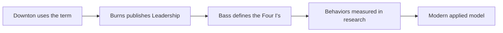

# Transformational Leadership: Origins, Four I's and Limits

> Created by **James MacGregor Burns**

## Overview

Transformational leadership describes leaders who move people by engaging their values, higher-order needs and sense of purpose, rather than relying only on a trade of pay or approval for effort. [Burns defined transforming leadership](https://is.muni.cz/el/fss/podzim2017/MVZ502/um/81507_CH06_Printer.pdf) as occurring when "one or more persons engage with others in such a way that leaders and followers raise one another to higher levels of motivation and morality." The SAGE Handbook of Leadership frames it in organizational terms as \[the process by which a leader fosters performance beyond expectation through strong emotional attachment and collective commitment to a higher moral cause]\( ([source](https://is.muni.cz/el/fss/podzim2017/MVZ502/um/81507_CH06_Printer.pdf)).\_Transformational\_Leadership).pdf). Notice the reciprocity in Burns's version: the leader is changed by the relationship too, which is what separates the idea from ordinary persuasion or motivational speaking.

The attribution needs to be stated precisely. [James MacGregor Burns coined the phrase in his seminal 1978 book, simply titled Leadership](https://open.edu/openlearncreate/mod/oucontent/view.php?id=105478\&section=1), where he contrasted transactional leadership, focused on self-interest and exchange, with leadership that engages people's deeper motivations. Yet [James V. Downton had already used the term in a 1973 paper on rebel leadership, and Burns's book is what brought the concept into wide use](https://mycourses.aalto.fi/pluginfile.php/1623877/mod_folder/content/0/The_SAGE_Handbook_of_Leadership_----_\(22._Transformational_Leadership\).pdf). Burns himself mostly wrote 'transforming leadership'; [later scholarship, particularly Bass's work, popularized 'transformational leadership'](https://open.edu/openlearncreate/mod/oucontent/view.php?id=105478\&section=1).

Burns was a political scientist writing about moral and political leadership. [Bernard Bass researched and expanded the theory in 1985](https://aeasseincludes.assp.org/proceedings/2012/docs/751.pdf), in his book [Leadership and Performance Beyond Expectations](https://archive.org/details/leadershipperfor0000bass), turning a moral theory into a model of leader behaviors meant to produce performance beyond expectations. Bass described transformational leaders as raising followers' awareness of the value of outcomes, encouraging them to transcend self-interest for the group, and stimulating higher-order needs. His more behaviorally specified model was then [applied widely to organizational, educational, military and business leadership](https://mycourses.aalto.fi/pluginfile.php/1623877/mod_folder/content/0/The_SAGE_Handbook_of_Leadership_----_\(22._Transformational_Leadership\).pdf), not only politics. The modern theory therefore blends Burns's reciprocal moral elevation with Bass's measurable behaviors.

Today the model is [commonly operationalized through four components](https://journals.sagepub.com/doi/10.1177/23792981241267758), usually called the Four I's. Each is a cluster of behaviors you can practice deliberately, and each has its own skill page in this library.

| Component                    | One-line definition                                                                                                                           | Skill page                                                                                                     |
| ---------------------------- | --------------------------------------------------------------------------------------------------------------------------------------------- | -------------------------------------------------------------------------------------------------------------- |
| Idealized Influence          | [Leader acts as a trusted, respected role model](https://aeasseincludes.assp.org/proceedings/2012/docs/751.pdf)                               | [Building Idealized Influence](https://tryhamster.com/skills/building-idealized-influence)                     |
| Inspirational Motivation     | [Leader articulates an appealing vision and builds commitment to shared goals](https://aeasseincludes.assp.org/proceedings/2012/docs/751.pdf) | [Crafting an Inspirational Vision](https://tryhamster.com/skills/crafting-inspirational-vision)                |
| Intellectual Stimulation     | [Leader encourages new ideas and questioning of assumptions](https://aeasseincludes.assp.org/proceedings/2012/docs/751.pdf)                   | [Stimulating Intellectual Challenge](https://tryhamster.com/skills/stimulating-intellectual-challenge)         |
| Individualized Consideration | [Leader attends to each person's needs and growth](https://aeasseincludes.assp.org/proceedings/2012/docs/751.pdf)                             | [Providing Individualized Consideration](https://tryhamster.com/skills/providing-individualized-consideration) |

Two distinctions keep the model honest in practice. First, [practitioners separate attributed idealized influence, whether followers see the leader as ethical, confident and trustworthy, from behavioral idealized influence, whether the leader's actions express shared values and mission](https://qic-wd.org/umbrella-summary/transformational-leadership); a leader can be admired without actually living the values, and that gap is where trust erodes. Second, transformation does not replace exchange. [Transactional leadership trades work for valued resources such as salary](https://journals.sagepub.com/doi/10.1177/23792981241267758), yet [transactional elements exist within transformational leadership](https://irmbrjournal.com/papers/1371451049.pdf), and [a 2025 public-administration meta-analysis found the two positively related](https://journals.sagepub.com/doi/10.1177/02750740241290810?icid=int.sj-abstract.citing-articles.14) ([source](https://my.carolinau.edu/ICS/icsfs/1_Judge___Piccolo_2004_Transformational_and_Transa.pdf?target=9fd48bd2-ed80-416f-b340-cf1b5a545655)). The full contrast is on the [transactional vs transformational skill page](https://tryhamster.com/skills/differentiating-transformational-from-transactional-leadership).

The evidence is broadly favorable. [A 2004 meta-analysis of 626 correlations from 87 sources reported an overall validity of .44 for transformational leadership](https://my.carolinau.edu/ICS/icsfs/1_Judge___Piccolo_2004_Transformational_and_Transa.pdf?target=9fd48bd2-ed80-416f-b340-cf1b5a545655), and [a 2011 meta-analysis found transactional leadership positively related to effectiveness as well](https://econtent.hogrefe.com/doi/10.1026/0932-4089/a000049). The critics are serious, though. [A 2013 critical assessment found no clear conceptual definition, underspecified causal mechanisms, a construct confounded with its effects, and measures that fail to reproduce its dimensions](https://journals.aom.org/doi/10.5465/19416520.2013.759433) ([source](https://journals.aom.org/doi/10.5465/19416520.2013.759433)). [A 2024 review names misuse for a leader's self-interest, often called pseudo-transformational leadership, as its central dark side](https://journals.sagepub.com/doi/10.1177/23792981241267758), and [reliance on one leader's charisma can make results hard to sustain when that leader leaves](https://eprajournals.com/pdf/fm/jpanel/upload/2024/June/202406-07-017284). In a shared workspace such as Hamster Studio, teams can keep the vision, experiments and coaching commitments visible so the behaviors do not live only in one person's head.

## Core Principles

### Raise motivation together, not just direct it

Burns's core idea is reciprocal: [leaders and followers raise one another to higher levels of motivation and morality](https://is.muni.cz/el/fss/podzim2017/MVZ502/um/81507_CH06_Printer.pdf). He added that it [raises the level of human conduct and ethical aspiration of both leader and led](https://files.eric.ed.gov/fulltext/EJ843441.pdf). In practice this means you expect to be changed by your team's input, not only to change them. If every conversation flows one way, you are directing, not transforming.

### Engage the full person

Burns described the transforming leader as one who [looks for potential motives in followers, seeks to satisfy higher needs, and engages the full person of the follower](https://journals.sagepub.com/doi/full/10.1177/17427150241232705). That requires knowing what each person cares about beyond the current task. A leader who only knows people's output metrics cannot connect work to their motives. The warning sign is a team that performs when watched and disengages otherwise.

### Treat the Four I's as behaviors, not traits

[Bass expanded Burns's theory](https://aeasseincludes.assp.org/proceedings/2012/docs/751.pdf) into specific leader behaviors, set out in [Leadership and Performance Beyond Expectations](https://archive.org/details/leadershipperfor0000bass). Framing them as behaviors makes them learnable and observable rather than a matter of innate charisma. You can check whether you coached someone this week or invited a challenge to your own plan. If you cannot name the behavior you practiced, you are relying on personality.

### Earn influence through conduct

Idealized influence has two faces: [what followers attribute to the leader and what the leader's actions actually express](https://qic-wd.org/umbrella-summary/transformational-leadership). Reputation built on the first without the second is fragile. [Acting as the example of the standards you expect](https://scu.edu/business/blog/leadership-ethics/what-is-transformational-leadership) rather than leaning on title closes the gap. When people start quoting your words back at you to point out inconsistencies, the gap is showing.

### Keep transactional clarity underneath

[Transactional elements exist within transformational leadership](https://irmbrjournal.com/papers/1371451049.pdf), and they matter. [Intellectual stimulation should be paired with clear roles, deadlines, standards and consequences](https://itechguides.com/what-is-transformational-leadership-a-model-for-sparking-innovation) so inspiration does not replace execution. Vision tells people why; agreements tell them what and by when. A team that is energized but keeps missing commitments has vision without structure.

### Test your purpose for self-interest

The model's power is also its risk: [it can be misused to serve a leader's self-interest at the expense of others](https://journals.sagepub.com/doi/10.1177/23792981241267758). [Power can be abused when motivation lacks moral responsibility](https://thescopes.org/assets/Uploads/SCOPE-LT-10-Chaplin-Cheyne-v2.pdf). Ask whether the vision serves the group and the people outside it, or mainly your career. If dissent is treated as disloyalty, you have drifted toward pseudo-transformational leadership.

### Hold the evidence with care

Positive findings are real, but [the construct lacks a clear definition and its measures do not separate it cleanly from other leadership concepts](https://journals.aom.org/doi/10.5465/19416520.2013.759433). Researchers also note [limited evidence distinguishing the four factors from one another](https://thescopes.org/assets/Uploads/SCOPE-LT-10-Chaplin-Cheyne-v2.pdf). Use the Four I's as a practical checklist, not as a precise diagnostic. Judge your own leadership by observable team outcomes, not by a survey score alone.

## When to Use

- Leading a team through a change that requires people to adopt new ways of working, because the model targets commitment to a shared purpose rather than grudging compliance.
- Stepping into a role where you have responsibility but little formal authority, because influence has to come from credibility and conduct rather than title.
- Building a team that must solve unfamiliar problems, because intellectual stimulation invites people to question assumptions instead of repeating old methods.
- Developing people with very different goals and skill levels, because individualized consideration replaces one-size-fits-all management with coaching matched to each person.
- Reviewing your own leadership habits, because the Four I's give a concrete checklist of behaviors to observe and improve.

## When Not to Use

- As a substitute for clear roles, deadlines and standards, because [inspiration should not replace reliable execution](https://itechguides.com/what-is-transformational-leadership-a-model-for-sparking-innovation) and a team without agreements will drift.
- When the real aim is to advance your own agenda, because [misuse for self-interest is the model's central dark side](https://journals.sagepub.com/doi/10.1177/23792981241267758) and people eventually see through it.
- When continuity depends on a single charismatic figure, because [reliance on one leader's personal influence may not be sustainable](https://eprajournals.com/pdf/fm/jpanel/upload/2024/June/202406-07-017284) once that person leaves.
- As a precise diagnostic for hiring or rating leaders, because [common measures do not achieve empirical distinctiveness from other aspects of leadership](https://journals.aom.org/doi/10.5465/19416520.2013.759433).

## Skills

This method includes the following skills:

- [Providing Individualized Consideration and Coaching](../../skills/providing-individualized-consideration/SKILL.md): Practices for recognizing each team member's unique needs, strengths, and development goals to mentor and support their personal growth.
- [Building Idealized Influence as a Role Model Leader](../../skills/building-idealized-influence/SKILL.md): How to cultivate trust, credibility, and ethical behavior that inspires followers to identify with and emulate your leadership.
- [Comparing Transformational Leadership to Servant and Authentic Leadership](../../skills/comparing-transformational-to-other-leadership-models/SKILL.md): How to evaluate and integrate transformational leadership alongside servant leadership, authentic leadership, and other modern leadership frameworks.
- [Applying Transformational Leadership in Industry-Specific Contexts](../../skills/applying-transformational-leadership-in-practice/SKILL.md): How to adapt transformational leadership principles to specific settings such as healthcare, education, and organizational change initiatives.
- [Stimulating Intellectual Challenge and Creative Problem-Solving](../../skills/stimulating-intellectual-challenge/SKILL.md): How to encourage followers to question assumptions, reframe problems, and approach work with innovation and critical thinking.
- [Differentiating Transformational from Transactional Leadership](../../skills/differentiating-transformational-from-transactional-leadership/SKILL.md): How to recognize when to use transformational versus transactional approaches and understand the full range leadership model.
- [Assessing Transformational Leadership Effectiveness](../../skills/assessing-transformational-leadership-effectiveness/SKILL.md): How to use the Multifactor Leadership Questionnaire \(MLQ\) and other tools to measure and improve your transformational leadership behaviors.
- [Crafting and Communicating an Inspirational Vision](../../skills/crafting-inspirational-vision/SKILL.md): Techniques for articulating a compelling future vision that energizes teams and aligns individual motivation with organizational goals.

## FAQ

**Who created transformational leadership?**

[James MacGregor Burns coined the phrase in his 1978 book Leadership](https://open.edu/openlearncreate/mod/oucontent/view.php?id=105478&section=1) and is usually credited as the originator. However, [James V. Downton used the term earlier, in a 1973 paper on rebel leadership](https://mycourses.aalto.fi/pluginfile.php/1623877/mod_folder/content/0/The_SAGE_Handbook_of_Leadership_----_(22._Transformational_Leadership).pdf). [Bernard Bass later researched and expanded the theory in 1985](https://aeasseincludes.assp.org/proceedings/2012/docs/751.pdf), producing the Four I's most people learn today.

**What are the Four I's of transformational leadership?**

They are [idealized influence, inspirational motivation, intellectual stimulation and individualized consideration](https://journals.sagepub.com/doi/10.1177/23792981241267758). Respectively, they cover being a trusted role model, articulating a compelling vision, encouraging people to question assumptions, and attending to each person's growth. [They were not Burns's formulation but came from Bass's later work](https://aeasseincludes.assp.org/proceedings/2012/docs/751.pdf). Each has a dedicated skill page linked in the table above.

**How is transformational leadership different from transactional leadership?**

Burns contrasted [transactional leadership, focused on self-interest and exchange, with leadership that engages people's deeper motivations](https://open.edu/openlearncreate/mod/oucontent/view.php?id=105478&section=1). In practice the two overlap: [transactional elements exist within transformational leadership](https://irmbrjournal.com/papers/1371451049.pdf). A [2011 meta-analysis found both positively related to effectiveness](https://econtent.hogrefe.com/doi/10.1026/0932-4089/a000049), so good leaders usually combine them. See the [transactional vs transformational skill page](https://tryhamster.com/skills/differentiating-transformational-from-transactional-leadership) for details.

**Does transformational leadership actually work?**

The meta-analytic evidence is broadly positive: [a 2004 meta-analysis reported an overall validity of .44, generalizing across longitudinal and multisource designs](https://my.carolinau.edu/ICS/icsfs/1_Judge___Piccolo_2004_Transformational_and_Transa.pdf?target=9fd48bd2-ed80-416f-b340-cf1b5a545655). Critics counter that [the construct is poorly defined and sometimes confounded with its own effects](https://journals.aom.org/doi/10.5465/19416520.2013.759433). Read the findings as evidence that these behaviors tend to help, not as proof of a precise causal mechanism. The [assessment skill page](https://tryhamster.com/skills/assessing-transformational-leadership-effectiveness) covers how to interpret the numbers.

**What is pseudo-transformational leadership?**

It is the use of transformational techniques, such as vision and inspiration, [to serve the leader's self-interest at the expense of followers or the organization](https://journals.sagepub.com/doi/10.1177/23792981241267758). The ethical risk is that [power can be abused when motivation lacks moral responsibility](https://thescopes.org/assets/Uploads/SCOPE-LT-10-Chaplin-Cheyne-v2.pdf). Warning signs include punishing dissent, a vision that mainly benefits the leader, and followers who cannot act without the leader's approval.

**Do you need charisma to be a transformational leader?**

Charisma helps but is not the foundation. [Idealized influence was originally associated with charisma in early versions of the model](https://aeasseincludes.assp.org/proceedings/2012/docs/751.pdf), but Bass's contribution was to describe learnable behaviors. Leaning on charisma is actually a known weakness, since [it may not be replicable or sustainable by others in the organization](https://eprajournals.com/pdf/fm/jpanel/upload/2024/June/202406-07-017284). Consistent conduct, coaching and honest challenge carry more weight over time.

**How is transformational leadership measured?**

Most research uses surveys; [most studies using the Multifactor Leadership Questionnaire and similar instruments find positive links with satisfaction, motivation and performance](https://dl.icdst.org/pdfs/files4/707d99a3fac5a0d94c58794462f64f75.pdf). These tools have limits, because [they fail to reproduce the proposed dimensions cleanly](https://journals.aom.org/doi/10.5465/19416520.2013.759433). Treat scores as one input alongside observed behavior and team outcomes.

## Sources

- [Leadership and performance beyond expectations : Bass](https://archive.org/details/leadershipperfor0000bass)
- [aeasseincludes.assp.org](https://aeasseincludes.assp.org/proceedings/2012/docs/751.pdf)
- [Instructional and Transformational Leadership: Burns, Bass](https://files.eric.ed.gov/fulltext/EJ843441.pdf)
- [1 Transformational leadership: origins and main features](https://open.edu/openlearncreate/mod/oucontent/view.php?id=105478&section=1)
- [is.muni.cz](https://is.muni.cz/el/fss/podzim2017/MVZ502/um/81507_CH06_Printer.pdf)
- [Advancing the democratization of work: A new intellectual history of transformational leadership theory - Lauren Eaton, Todd Bridgman, Stephen Cummings, 2024](https://journals.sagepub.com/doi/full/10.1177/17427150241232705)
- [What Is Transformational Leadership? Theory and Traits](https://scu.edu/business/blog/leadership-ethics/what-is-transformational-leadership)
- [A Critical Assessment of Charismatic - Transformational Leadership Research: Back to the Drawing Board?](https://journals.aom.org/doi/10.5465/19416520.2013.759433)
- [An Evaluation of Conceptual Weaknesses in](https://dl.icdst.org/pdfs/files4/707d99a3fac5a0d94c58794462f64f75.pdf)
- [Transformational vs. Transactional Leadership Theories](https://irmbrjournal.com/papers/1371451049.pdf)
- [THE LIMITATIONS OF TRANSFORMATIONAL LEADERSHIP Trish Chaplin](https://thescopes.org/assets/Uploads/SCOPE-LT-10-Chaplin-Cheyne-v2.pdf)
- [Transformationale, transaktionale und passiv-vermeidende Führung: Eine metaanalytische Untersuchung ihres Zusammenhangs mit Führungserfolg: Zeitschrift für Arbeits- und Organisationspsychologie A\&O: Vol 55, No 2](https://econtent.hogrefe.com/doi/10.1026/0932-4089/a000049)
- [A Review Ofthetransactional and Transformational Leadership on](https://eprajournals.com/pdf/fm/jpanel/upload/2024/June/202406-07-017284)
- [\[PDF\] A Meta-Analytic Test of Their Relative Validity](https://my.carolinau.edu/ICS/icsfs/1_Judge___Piccolo_2004_Transformational_and_Transa.pdf?target=9fd48bd2-ed80-416f-b340-cf1b5a545655)
- [Limitations and Potential Dark Sides of Transformational Leadership](https://journals.sagepub.com/doi/10.1177/23792981241267758)
- [A Meta-Analytic Review of Transformational Leadership Research in Public Administration - Yuanjie Bao, Zixu Zhang, Chang Yang, 2025](https://journals.sagepub.com/doi/10.1177/02750740241290810?icid=int.sj-abstract.citing-articles.14)
- [What Is Transformational Leadership? The Four I’s and Innovation](https://itechguides.com/what-is-transformational-leadership-a-model-for-sparking-innovation)
- [Transformational Leadership](https://qic-wd.org/umbrella-summary/transformational-leadership)

---

*[Import this method into Hamster](https://tryhamster.com) to share it with your team, customize it for your workflow, and let AI agents use it automatically.*
