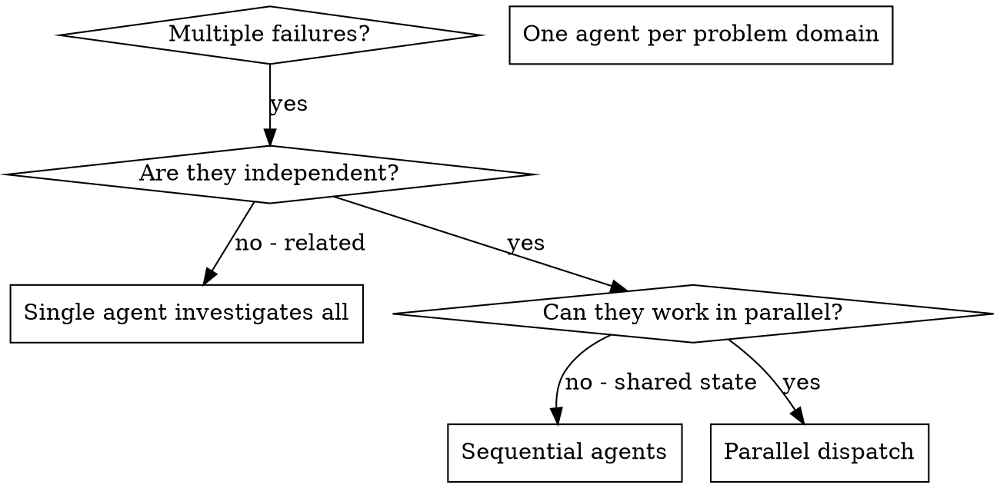

## When to Use

**Use when:**

- 3+ test files failing with different root causes
- Multiple subsystems broken independently
- Each problem can be understood without context from others
- No shared state between investigations

**Don't use when:**

- Failures are related (fix one might fix others)
- Need to understand full system state
- Agents would interfere with each other