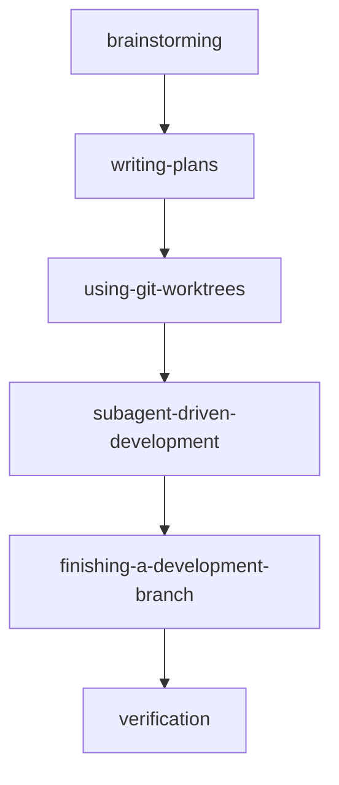
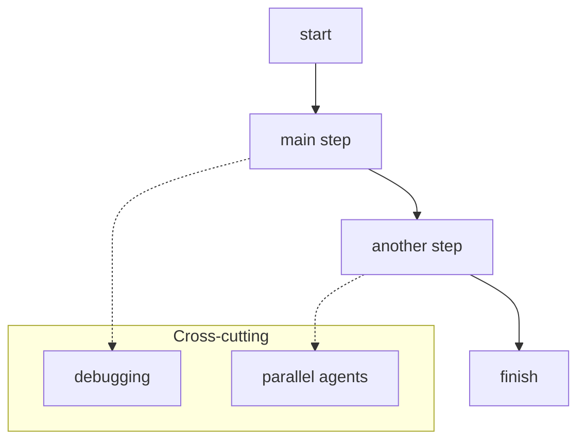
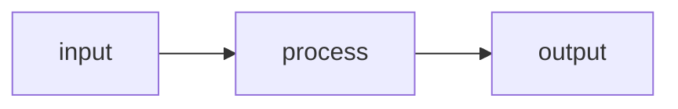

# Mermaid Diagrams

Best practices for when to create Mermaid diagrams and how to write good ones. Use when writing or reviewing blueprints, initiatives, or briefs that need visual structure.

## When to Create a Diagram

**Create a diagram when:**

- The relationships between 4+ entities matter and prose would bury the structure.
- A workflow has branching, parallelism, or conditional paths that are hard to follow linearly.

**Do NOT create a diagram when:**

- The content is a simple sequential list — a numbered list is better.
- A table communicates the same information more clearly — diagrams are for relationships, not tabular data.

### In blueprints

Use diagrams for: architecture, data flow, system relationships, workflow sequences.

### In initiatives

Use diagrams for: dependency chains, team handoff flows, milestone sequencing.

### In briefs

Use diagrams for: task dependency graphs, integration points, data flow within the feature.

## Mermaid Best Practices

### Direction

- Always set `TD` or `LR` explicitly — never rely on the default.
- Prefer `flowchart TD` (top-down) for pipelines with 5+ nodes. Horizontal diagrams become unreadably wide.
- Use `flowchart LR` (left-right) only when the diagram is naturally wide and shallow (2–3 rows of nodes).
- Aim for a roughly square aspect ratio. If the diagram is too wide or too tall, switch direction.

### Structure

- Use subgraphs to group related nodes and create visual structure.
- Use `direction LR` inside a subgraph to create horizontal sections within a vertical flow — good for grouping routines, side paths, or parallel tracks.

### Links

- Use solid links (`-->`) for the main flow.
- Use dashed links (`-.->`) for alternative paths, optional branches, or cross-cutting concerns.
- Never mix more than 2 link styles. Solid = main, dashed = alternatives. That's it.

### Labels and Shapes

- Keep node labels to 1–3 words. If a label needs more than 3–4 words, the diagram is too complex — split it.
- Use consistent node shapes: rectangles `[label]` for processes, rounded `(label)` for start/end, diamonds `{label}` for decisions.
- Add a brief one-line caption above the diagram explaining what it shows.

## Anti-Patterns

- **`flowchart LR` with 8+ nodes in a single row** — becomes an unreadable horizontal strip. Switch to `TD`.
- **Node labels that are full sentences** — keep them to 1–3 words.
- **Mixing too many link styles without clear meaning** — pick 2 max (solid for main, dashed for alternatives).
- **Diagrams that duplicate what a table or list already says** — diagrams are for relationships, not tabular data.
- **Overly nested subgraphs (3+ levels)** — flatten or split into multiple diagrams.
- **No direction specified** — always set `TD` or `LR` explicitly, never rely on default.

## Examples

### Example 1 — Vertical pipeline (good for workflows with many sequential steps)

### Example 2 — Vertical flow with horizontal subgraph (good for main flow + grouped side concerns)

### Example 3 — Horizontal flow (good for 2–3 wide, shallow diagrams)

## Decision Guide: Diagram vs Prose vs Table vs List

| Format | Use when |
| --- | --- |
| **Diagram** | 4+ entities with relationships that matter; branching/parallel/conditional workflows |
| **Prose** | Narrative explanation, context, rationale — when the *why* matters more than the *what connects to what* |
| **Table** | Comparing attributes across items; structured data with clear columns |
| **List** | Simple sequential steps; items with no meaningful relationships between them |
