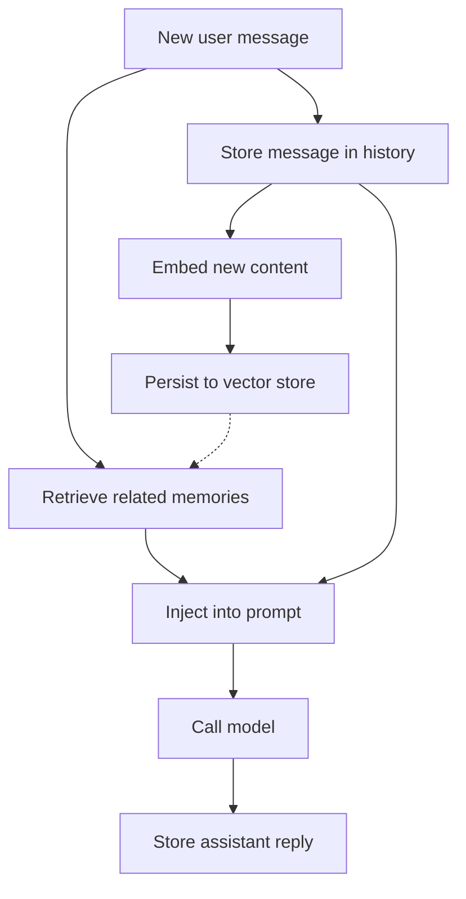

# What Are AI Agents Missing? Adding Memory and Context

> Give AI agents persistent chat history and retrievable vector memory, then inject the right context into every model call.

## At a Glance

| Field | Value |
|-------|-------|
| Difficulty | Intermediate |
| Time to Learn | 3-5 hours for a first working setup |
| Outcome | An agent whose conversations survive restarts and scale-out, and which retrieves and injects relevant stored knowledge before each model call. |
| Prerequisites | A working Semantic Kernel agent with a configured AI service, Access to a persistent store for conversation state, An embedding model and a vector database if cross-session recall is needed, Basic familiarity with prompts and chat-completion message roles |
| Part of | [Semantic Kernel Agent Framework](../../methods/semantic-kernel-agent-framework/METHOD.md) |

## Overview

When people ask what AI agents are, the answer usually covers a model, instructions and tools. Memory is the part that makes an agent useful across more than one message, and it is the part the application has to build. A model call only sees what the application sends in that call, so remembering means storing the right things and putting the right subset back into the prompt at the right moment. For background on the framework itself, see the [Semantic Kernel Agent Framework method page](https://tryhamster.com/methods/semantic-kernel-agent-framework).

This skill covers two layers. The first is conversation history: the running record of user and assistant messages within a session. In Microsoft's Agents SDK integration, developers [create a ChatHistory record and pass turnState information into it](https://learn.microsoft.com/en-us/microsoft-365/agents-sdk/using-semantic-kernel-agent-framework) so the kernel can use channel information during orchestration. The same guidance advises [replacing sample in-memory storage with persistent storage such as Blob or Cosmos DB](https://learn.microsoft.com/en-us/microsoft-365/agents-sdk/using-semantic-kernel-agent-framework) for production, which is the single most common gap between a demo and a deployed agent.

The second layer is long-term, retrievable memory: documents, facts and past interactions stored as embeddings in a vector database and pulled back by semantic similarity. The [DataStax case study](https://devblogs.microsoft.com/agent-framework/customer-case-study-datastax-and-semantic-kernel) shows the shape of this in Semantic Kernel: a vector memory store configured with connection, embedding and similarity settings, wrapped in a semantic memory object that uses the kernel's embedding service.

Know the limits before you design. An industry overview notes that Semantic Kernel memory [supports VolatileMemory and Qdrant, and that VolatileMemory is short-term and can incur repeated costs](https://turing.com/resources/ai-agent-frameworks). A practitioner comparison adds that [context and memory systems can cause performance issues, inaccurate outputs and high integration overhead](https://dev.to/aakas/navigating-the-ai-agent-ecosystem-a-comprehensive-framework-analysis-5813) in complex enterprise settings. Both point to the same discipline: pick durable storage deliberately and keep what you inject small and relevant.

The output of this skill is an agent that keeps its conversation after a restart or a hop to another instance, retrieves stored knowledge that matches the current request, and sends the model a prompt that contains that context without drowning in it. You can tell it went wrong when the agent forgets earlier turns after a deployment, re-asks questions the user already answered, ignores documents you know are in the store, or when prompt size and cost climb with every turn.

## How It Works

Memory in an agent is a pipeline the application runs around every model call. The framework supplies the pieces (a chat history type, memory abstractions, an embedding service slot on the kernel), but the order of operations and the storage choices are yours.

**Store the message.** Each turn starts by loading the conversation's history and appending the new user message. In the Agents SDK integration, a typical .NET initialization is [turnState.Conversation.GetValue("conversation.chatHistory", () => new ChatHistory())](https://learn.microsoft.com/en-us/microsoft-365/agents-sdk/using-semantic-kernel-agent-framework), which returns the existing history or creates an empty one. Where that turn state is backed matters: in-memory storage disappears on restart and is not shared across instances, which is why Microsoft recommends persistent storage for production.

**Embed and persist.** Content worth recalling later, such as a user's stated preferences, a resolved ticket summary or an uploaded document, is converted to a vector by an embedding model and written to a vector store. In the [AstraDB example](https://devblogs.microsoft.com/agent-framework/customer-case-study-datastax-and-semantic-kernel), the application creates an AstraDBMemoryStore with token, database ID, region, keyspace, embedding dimension and similarity settings, then constructs SemanticTextMemory from that store and an embedding generator taken from the kernel's text_embedding service. The embedding dimension on the store has to match the embedding model you actually use.

**Retrieve on the new request.** Before the model call, the application embeds the current request and queries the store for the closest matches. This is a search, not a lookup, so you control how many results come back and how similar they must be. Those values are project decisions; tune them against real queries.

**Inject into the prompt.** Retrieved items are added to the invocation context, typically as a clearly labelled system or context message ahead of the recent conversation turns. Registering a vector store does nothing on its own: the [application must configure embeddings, persist content, define retrieval and add the results to the invocation context](https://devblogs.microsoft.com/agent-framework/customer-case-study-datastax-and-semantic-kernel) for the agent to benefit.

**Call the model and store the reply.** The model sees persona, retrieved context and recent history together. Its reply is appended to the history and saved back to persistent storage, and if the reply contains something worth recalling later, it enters the embed-and-persist path too.

The two layers solve different problems. History keeps a session coherent; vector memory lets the agent recall things from outside the current window, including other sessions and documents. Mixing them up produces the classic failures: stuffing the entire history into every call inflates cost, while relying only on retrieval loses the thread of the current conversation. An industry overview warns that [short-term volatile memory can incur repeated costs](https://turing.com/resources/ai-agent-frameworks), which is another reason to persist once and retrieve selectively rather than rebuild context on every call.

## Step-by-Step Guide

### Step 1: Choose the session-storage model

Decide where conversation state lives before writing any memory code. Ask whether conversations must survive a process restart, whether several instances will serve the same user, and how long history must be kept. If the answer to either of the first two is yes, in-memory storage is ruled out, and Microsoft's guidance points to [persistent storage such as Blob or Cosmos DB](https://learn.microsoft.com/en-us/microsoft-365/agents-sdk/using-semantic-kernel-agent-framework). Record the retention period and who can read stored conversations, because history often contains personal data.

> **Pro tip:** Keep the in-memory store only for local tests, and make the storage backend a configuration switch so production cannot silently fall back to it.

### Step 2: Load or create the history per turn

At the start of every turn, fetch the conversation's history from turn state or your store, creating an empty one if none exists. In the Agents SDK integration this is the [GetValue pattern with a new ChatHistory fallback](https://learn.microsoft.com/en-us/microsoft-365/agents-sdk/using-semantic-kernel-agent-framework), and passing turnState information in lets the kernel use channel information during orchestration. Key the history by conversation, not by user, unless you deliberately want one thread per person. Confirm the object you append to is the same one that gets saved.

> **Pro tip:** Log the conversation key and history length on each turn during development; a length that resets to zero tells you the load path is broken.

### Step 3: Record user and assistant messages

Append the incoming user message before the model call and the assistant reply after it, then save. Include tool results if later turns depend on them, since the model cannot recall what a function returned otherwise. Decide how you will trim: keep the most recent turns verbatim and summarise or drop older ones once the history grows beyond a size you set. Without a trimming rule, prompt size and cost grow with every exchange.

> **Pro tip:** Pick a starting trim rule, for example the last 20 messages plus a running summary, and adjust after reviewing real transcripts.

### Step 4: Configure the vector memory backend

If the agent needs recall beyond the current session, set up a vector store. The [AstraDB example](https://devblogs.microsoft.com/agent-framework/customer-case-study-datastax-and-semantic-kernel) configures token, database ID, region, keyspace, embedding dimension and similarity settings; other backends need equivalent values. Set the embedding dimension from your embedding model's documentation, not by guess. Separate collections or keyspaces by tenant or data type so retrieval cannot leak one customer's content into another's prompt.

### Step 5: Wire embeddings and persist new content

Register an embedding service on the kernel and build the semantic memory object from the store and that generator, as the AstraDB example does with the kernel's text_embedding service. Decide which content gets embedded: documents at ingestion time, and selected facts or summaries from conversations as they happen. Store metadata such as source, date and conversation ID alongside each vector so you can filter and audit later. Embedding everything indiscriminately fills the store with noise that retrieval will later surface.

> **Pro tip:** Write a short rule for what qualifies as memorable, such as confirmed preferences and resolved outcomes, and embed only that.

### Step 6: Retrieve and inject before the model call

On each new request, query the store with the current message and take only the closest matches above a similarity cutoff you choose. Insert them into the prompt as a labelled context block so the model can distinguish recalled material from the live conversation. Place retrieval before the model call in code, not as an afterthought in the response handler. Remember that the store does nothing until [retrieved results are added to the invocation context](https://devblogs.microsoft.com/agent-framework/customer-case-study-datastax-and-semantic-kernel).

> **Pro tip:** Start with a small result count, for example three to five items, and raise it only if answers show missing context.

### Step 7: Verify persistence and recall

Test the failure modes directly. Restart the service mid-conversation and confirm the agent continues the thread; route consecutive turns to different instances and confirm the same. Seed the vector store with a known fact, ask a question that should retrieve it, and inspect the actual prompt sent to the model. Track prompt size per turn so you notice growth before the bill does.

> **Pro tip:** Keep a regression script of these checks and run it after every change to storage, embedding model or trimming rules.

## Best Practices

- Treat conversation history and vector memory as separate systems with separate jobs. History keeps the current session coherent, while vector memory recalls material from outside it, and designing them independently makes each easier to size and debug.
- Use persistent storage from the first deployed environment. Microsoft advises [replacing sample in-memory storage with persistent storage](https://learn.microsoft.com/en-us/microsoft-365/agents-sdk/using-semantic-kernel-agent-framework) for production, and staging should behave like production so restart bugs show up early.
- Inject less, but inject it deliberately. Practitioners report that [memory and context systems can cause performance issues and inaccurate outputs](https://dev.to/aakas/navigating-the-ai-agent-ecosystem-a-comprehensive-framework-analysis-5813), and a tight, relevant context block usually beats a long one the model must sift through.
- Label recalled content in the prompt. Marking retrieved items as background with their source helps the model weigh them correctly and helps you audit why an answer said what it said.
- Store metadata with every vector. Source, timestamp, tenant and conversation ID let you filter retrieval, delete a user's data on request and trace a bad answer back to the memory that caused it.
- Pin the embedding model and version. Vectors from different embedding models are not comparable, so changing the model means re-embedding the store, and pinning it prevents silent retrieval degradation.
- Inspect the final prompt, not just the answer. Most memory bugs are visible only in what was actually sent to the model: missing history, empty retrieval or duplicated context.

## Common Mistakes

- **Shipping with in-memory conversation storage.** — In-memory history vanishes on restart and is not shared across instances, so users lose their thread after a deploy or scale-out. Switch to a persistent store such as [Blob or Cosmos DB, as Microsoft recommends](https://learn.microsoft.com/en-us/microsoft-365/agents-sdk/using-semantic-kernel-agent-framework) for production.
- **Assuming a registered vector store gives the agent memory.** — The store is passive. You must [configure embeddings, persist content, define retrieval and add results to the invocation context](https://devblogs.microsoft.com/agent-framework/customer-case-study-datastax-and-semantic-kernel); check the outgoing prompt to confirm retrieved items appear.
- **Sending the entire conversation history on every call.** — Prompt size and cost grow with each turn until the context window or budget breaks. Keep recent turns verbatim, summarise older ones, and move durable facts into vector memory for selective recall.
- **Relying on volatile memory for knowledge that should persist.** — An industry overview notes that [VolatileMemory is short-term and can incur repeated costs](https://turing.com/resources/ai-agent-frameworks), because content must be re-embedded after every restart. Persist embeddings in a durable vector store instead.
- **Mismatching the embedding dimension or switching embedding models without re-indexing.** — The store's dimension setting must match the embedding model, and vectors from different models cannot be compared. When you change models, rebuild the collection rather than mixing old and new vectors.

## References

- [Examples](references/examples.md) — Worked examples and scenarios
- [FAQ](references/faq.md) — Frequently asked questions
- [Parent Method](../../methods/semantic-kernel-agent-framework/METHOD.md) — Semantic Kernel Agent Framework

## Related Skills

- [Designing Human-in-the-Loop Agent Workflows](../designing-human-in-the-loop-agent-workflows/SKILL.md)
- [Deploying AI Agents for SEO and Keyword Research Automation](../deploying-ai-agents-for-seo-automation/SKILL.md)
- [Selecting and Comparing AI Agent Architectures](../selecting-and-comparing-agent-architectures/SKILL.md)
- [Building Autonomous AI Agents with Semantic Kernel](../building-autonomous-ai-agents-with-semantic-kernel/SKILL.md)
- [Orchestrating Multi-Agent Conversations and Collaboration](../orchestrating-multi-agent-conversations/SKILL.md)
- [Integrating Plugins and Tools into Semantic Kernel Agents](../integrating-plugins-and-tools-into-agents/SKILL.md)
- [Implementing Agent Planning Strategies for Complex Tasks](../implementing-agent-planning-strategies/SKILL.md)

## Sources

- [Customer Case Study: DataStax and Semantic Kernel](https://devblogs.microsoft.com/agent-framework/customer-case-study-datastax-and-semantic-kernel)
- [Llamaindex](https://turing.com/resources/ai-agent-frameworks)
- [Navigating the AI Agent Ecosystem: A Comprehensive](https://dev.to/aakas/navigating-the-ai-agent-ecosystem-a-comprehensive-framework-analysis-5813)
- [Use Semantic Kernel and Agent Framework in Agents SDK](https://learn.microsoft.com/en-us/microsoft-365/agents-sdk/using-semantic-kernel-agent-framework)
