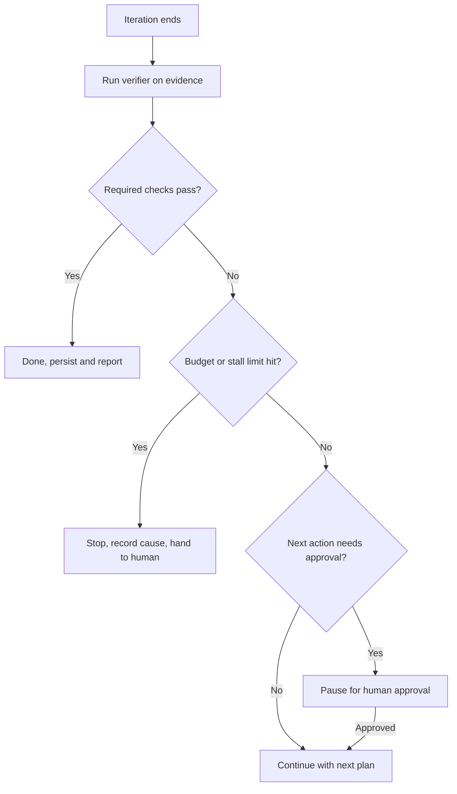

# Applying agent loop termination and continuation logic

> Write explicit done, failure, budget, stall and approval rules before an agent loop runs, then apply them after every iteration.

## At a Glance

| Field | Value |
|-------|-------|
| Difficulty | Intermediate |
| Time to Learn | 1-2 hours to draft rules for one loop |
| Outcome | A written set of exit and continuation rules that produces one recorded verdict per iteration and never leaves a loop running on a dead end. |
| Prerequisites | A goal with verifiable success criteria, A verifier that checks evidence such as tests, builds or diffs, A place to persist state between iterations |
| Part of | [State–Questions–Action–Verify Loop](../../methods/state-questions-action-verify-loop/METHOD.md) |

## Overview

Termination and continuation rules decide what happens after every pass through an agent loop: stop because the goal is met, run another iteration, stop because the loop is stuck or out of budget, or pause for a person. This page covers how to write those rules before a run and how to apply them at each decision point. For background on the full cycle, see the [State-Questions-Action-Verify Loop](https://tryhamster.com/methods/state-questions-action-verify-loop) method page.

A [practitioner guide to loop engineering](https://changyou.medium.com/loop-engineering-turning-goal-and-loop-into-verifiable-ai-agent-workflows-0062fb44de92) describes the pattern as read goal, act, verify, write state, then continue or stop. The same guide argues that a good loop answers its hard questions before the agent starts: what done means, the allowed scope, what happens in each iteration, how results are verified, where progress is recorded, when the agent should stop, and which actions require human approval. An [aman.ai primer on loop and graph engineering](https://aman.ai/primers/ai/loop-and-graph-engineering) makes the same point from the architecture side: a verified loop contains explicit execution, evaluation, revision, and termination logic. Termination is one of the parts that make a loop verifiable, not a patch added after a run misbehaves.

The skill matters because the default failure is quiet. A loop with only a success exit keeps spending time and money on a dead end, and a loop that stops when the agent says it is finished can stop with nothing proven. The [loop engineering guide](https://changyou.medium.com/loop-engineering-turning-goal-and-loop-into-verifiable-ai-agent-workflows-0062fb44de92) warns against both: asking a subjective question such as whether the agent thinks the task is done, and defining a success exit while omitting failure, escalation, budget or stall conditions.

The input to every decision is the accumulated state: the goal, current progress, recorded actions, verification evidence, remaining work, and any failure or retry history. The output is a single verdict per iteration, written back to that state along with the rule that produced it. The diagram shows the decision after each iteration.

If you get this right, every run ends in a state someone can read: either the evidence shows the goal is met, or the record shows why the loop stopped and what a person needs to decide next.

## How It Works

Treat the post-iteration decision as a small state machine with a fixed set of outcomes. The [little-loops documentation](https://docs.little-loops.ai/generalized-fsm-loop) takes this literally: its loop system uses finite state machines as the execution model for all loops. You do not need a framework to borrow the idea. What you need is a closed list of verdicts, a fixed order for evaluating them, and a rule that the loop cannot exit through any door you did not define.

A practical verdict set has four members. Done means every required check passed on fresh evidence. Continue means checks remain incomplete but the loop is still making progress and has budget left. Stop means a failure, budget or stall condition fired. Pause means the next planned action sits behind a human approval gate. Keep partial progress distinct from done: record which checks have passed and which remain, so a stopped run still tells the next person how far it got.

Order the evaluation so the cheapest safe outcome wins. Run the verifier first, because every other rule depends on its result. The [loop engineering guide](https://changyou.medium.com/loop-engineering-turning-goal-and-loop-into-verifiable-ai-agent-workflows-0062fb44de92) says the verifier should test evidence, such as whether tests and builds pass and whether the diff stays within permitted scope, rather than accept the agent's claim of completion. If all required checks pass, exit as done. If not, check hard limits: a budget ceiling on iterations, time or spend, and a stall rule that fires when successive iterations stop changing the evidence. Only if neither fires do you look at the next planned action and ask whether it needs approval.

Failure exits need an output shape, not just a trigger. The same guide recommends that a failed loop preserve the current state, record the cause, and return control to a human rather than keep consuming resources. Approval points follow the same discipline: the guide says actions requiring explicit approval should be defined before execution, not improvised mid-loop.

Each continuing iteration then runs the same cycle: a specific plan, the action, an independent verification check, and a state write before the next decision. That persistence step is what lets the rules work across runs, since stall detection and budget accounting both read history from state.

Finally, the rules themselves need review. A [loop engineering research agenda](https://huggingface.co/datasets/cy0307/awesome-loop-engineering/blob/main/FUTURE-DIRECTIONS.md) argues that recurring agent systems should show why an action was allowed, which evidence accepted it, what the run cost, and when control returned to a person, and it recommends reporting unsuccessful runs, costs and human interventions. The [Forward Future loop library](https://signals.forwardfuture.com/loop-library) includes a loop-auditor pattern that assigns every loop an evidence-backed KEEP, PIVOT, RETIRE, KILL, or insufficient status. Applying the same idea to your termination rules tells you whether limits are too tight, too loose, or firing for the wrong reasons.

## Step-by-Step Guide

### Step 1: Answer the pre-start questions

Before any code runs, write down answers to the questions the [loop engineering guide](https://changyou.medium.com/loop-engineering-turning-goal-and-loop-into-verifiable-ai-agent-workflows-0062fb44de92) lists: what done means, the allowed scope, what happens in each iteration, how results are verified, where progress is recorded, when to stop, and which actions need approval. Keep the answers in the same file or record the loop will read at runtime. If you cannot answer one, the loop is not ready to run. Unanswered questions become improvised decisions made by the agent mid-run.

> **Pro tip:** Store the answers as a short structured block at the top of the state file so every iteration reads the same rules.

### Step 2: Write the success exit as evidence checks

Express done as a list of required checks that a verifier can run, such as tests passing, a build succeeding, or a diff staying inside the allowed paths. Each check should return pass or fail without interpretation. Mark which checks are required and which are informational, so partial progress is visible. See [Defining Verifiable Success Criteria](https://tryhamster.com/skills/defining-verifiable-success-criteria) for writing the checks themselves.

> **Pro tip:** If a check needs someone to read prose and judge it, rewrite it or assign it to a named human reviewer.

### Step 3: Define failure and escalation exits

List the conditions under which the loop gives up: an unrecoverable error, a scope violation, a verifier that cannot run, or repeated failure of the same check. For each, specify the output: preserve current state, record the cause, and return control to a person. Name who receives the handoff and where the record lands. A failure exit without a destination is just a crash with extra steps.

### Step 4: Set budget and stall limits

Pick a ceiling for iterations, wall-clock time and spend, for example ten iterations or thirty minutes, whichever comes first. Define stall as a lack of change in the evidence, for example the same required check failing with the same error on two consecutive iterations. Budget protects cost; stall detection catches loops that are busy but not progressing. Both read from persisted history, so make sure each iteration records its checks and cost.

> **Pro tip:** Start with conservative limits and loosen them only after reviewing stopped runs, not before the first run.

### Step 5: Mark human approval points

Enumerate the actions that must not run without a person saying yes, such as merging to a main branch, sending external messages, deleting data, or spending above a threshold. Attach the approval rule to the action type, not to a moment in the plan, so it fires wherever the action appears. Define what the approver sees: the proposed action, the current state and the evidence so far. Decide what happens on rejection, usually stop or replan.

> **Pro tip:** Keep the approval list short and specific; a gate on everything trains approvers to click yes without reading.

### Step 6: Apply the decision after every iteration

At the end of each iteration, run the verifier, then evaluate rules in a fixed order: done, then budget and stall, then approval, then continue. Write the verdict, the rule that fired and the evidence to state before doing anything else. Never let the agent's own summary substitute for the verifier result. The [aman.ai primer](https://aman.ai/primers/ai/loop-and-graph-engineering) treats this explicit evaluation and termination logic as part of what makes a loop verified.

> **Pro tip:** Log the verdict even on continue; a run history with only final verdicts hides where stalls began.

### Step 7: Audit the rules across runs

After a batch of runs, review how each one ended and which rule fired. Look for loops that always hit the budget, stall rules that fire on legitimate slow progress, and approvals that are always granted. Borrow the [loop-auditor pattern](https://signals.forwardfuture.com/loop-library) and give each loop a KEEP, PIVOT, RETIRE, KILL or insufficient status based on the evidence. Adjust limits in versioned changes so you can compare before and after.

> **Pro tip:** Include failed and stopped runs in the review; judging rules only on successes hides the cases they exist for.

## Best Practices

- Define every exit before the first iteration. Rules written after a bad run tend to fix that run and nothing else, and the [loop engineering guide](https://changyou.medium.com/loop-engineering-turning-goal-and-loop-into-verifiable-ai-agent-workflows-0062fb44de92) frames them as questions a good loop answers before the agent starts.
- Make the verifier independent of the actor. The component that performed the action should not be the one declaring it successful, because an agent's report of completion is a claim, not evidence.
- Use a closed verdict set and a fixed evaluation order. A state-machine view, which [little-loops](https://docs.little-loops.ai/generalized-fsm-loop) uses for all its loops, prevents the loop from drifting into an undefined exit.
- Persist the verdict and its evidence on every iteration. Budget accounting and stall detection both depend on history, and a person picking up a stopped run needs to see what was tried.
- Give every stop a handoff. Preserve state, record the cause and name a recipient, so a failure becomes a decision for someone rather than a silent dead end.
- Attach approval gates to action types, not plan positions. The same risky action can appear in any iteration, and a gate tied to a step number will miss it when the plan changes.
- Track cost and human interventions per run. The [loop engineering research agenda](https://huggingface.co/datasets/cy0307/awesome-loop-engineering/blob/main/FUTURE-DIRECTIONS.md) recommends reporting both, and they are the data you need to tune budgets honestly.

## Common Mistakes

- **Asking the agent whether it thinks the task is done.** — Replace the subjective question with evidence checks the verifier runs, such as tests, builds and scope-limited diffs. The [loop engineering guide](https://changyou.medium.com/loop-engineering-turning-goal-and-loop-into-verifiable-ai-agent-workflows-0062fb44de92) names this as a common way loops end on nothing.
- **Defining only a success exit.** — Add failure, escalation, budget and stall exits alongside done. Without them, a loop that cannot succeed keeps consuming resources until someone notices.
- **Treating the agent's prose report as verification.** — Require machine-checkable or independently inspectable evidence for every required check. A summary saying tests passed is not the test result; read the result directly.
- **Improvising approval decisions mid-run.** — List approval-gated actions before execution and enforce them in the loop controller. If the agent decides when to ask, it will sometimes decide not to.
- **Stopping without preserving state.** — Write the current state, the triggering rule and the cause before exiting. A stopped run with no record forces the next person to rerun everything to learn where it failed.

## References

- [Examples](references/examples.md) — Worked examples and scenarios
- [FAQ](references/faq.md) — Frequently asked questions
- [Parent Method](../../methods/state-questions-action-verify-loop/METHOD.md) — State–Questions–Action–Verify Loop

## Related Skills

- [Recovering from Verification Failures](../recovering-from-verification-failures/SKILL.md)
- [Checking Post-Action Results](../checking-post-action-results/SKILL.md)
- [Defining Verifiable Success Criteria](../defining-verifiable-success-criteria/SKILL.md)
- [Formulating Typed Decision Questions](../formulating-typed-decision-questions/SKILL.md)
- [Representing Current Agent State](../representing-current-agent-state/SKILL.md)
- [Selecting and Executing Bounded Actions](../selecting-and-executing-bounded-actions/SKILL.md)

## Sources

- [FSM Loop - little-loops](https://docs.little-loops.ai/generalized-fsm-loop)
- [Turning /goal and /loop into Verifiable AI Agent Workflows \| by](https://changyou.medium.com/loop-engineering-turning-goal-and-loop-into-verifiable-ai-agent-workflows-0062fb44de92)
- [FUTURE-DIRECTIONS.md · cy0307/awesome-loop-engineering](https://huggingface.co/datasets/cy0307/awesome-loop-engineering/blob/main/FUTURE-DIRECTIONS.md)
- [Loop Library: Repeatable AI Agent Workflows \| Forward Future](https://signals.forwardfuture.com/loop-library)
- [Primers • Loop and Graph Engineering - aman.ai](https://aman.ai/primers/ai/loop-and-graph-engineering)
