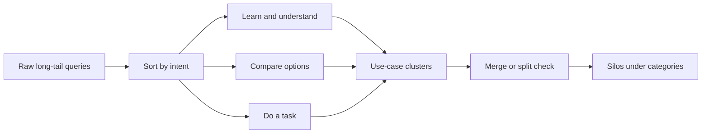

# Clustering Long-Tail Keywords: An SEO Keyword Strategy

> Sort raw long-tail queries by the job the searcher is trying to do, then roll those use-case clusters into silos a set of pages can own.

## At a Glance

| Field | Value |
|-------|-------|
| Difficulty | Intermediate |
| Time to Learn | 1-3 days for a first pass on one subject area |
| Outcome | A tagged keyword sheet in which every long-tail query belongs to one use-case cluster, every cluster maps to one page, and every page sits in a named silo. |
| Prerequisites | A defined subject area or category list for the site, Access to keyword research exports and your own search performance data, A spreadsheet or database for tagging queries, Working knowledge of search intent types |
| Part of | [David Bain SEO](../../methods/david-bain-seo/METHOD.md) |

## Overview

Long-tail keyword lists are long, messy and repetitive. A keyword export for one product area can hold hundreds of phrasings of the same few questions, and if you treat each row as a page brief you end up with dozens of near-duplicate pages competing with each other. Clustering long-tail use-case keywords is the skill of turning that list into a structure: queries grouped by what the searcher is trying to get done, clusters grouped into silos, and silos mapped onto the categories your site already wants to own. For the wider approach this skill belongs to, see the [David Bain SEO method page](https://tryhamster.com/methods/david-bain-seo).

The reasoning comes from how the source discussion frames keyword work. In the [Majestic SEO in 2023 Preview discussion](https://blog.majestic.com/training/seo-in-2023-preview), keywords are treated as a way to find topic clusters, and the content plan is organised around search intent, content gaps and a hierarchy of top-level categories and subcategories. The same [discussion argues writers should cover the concepts and questions behind keywords](https://blog.majestic.com/training/seo-in-2023-preview) rather than hit a fixed word count. Clustering is the step that surfaces those concepts: once twenty phrasings sit together, the underlying question is obvious.

The unit you cluster around is the use case, not the head term. A use case is a situation plus a goal: a small agency tracking billable hours, a landlord collecting rent from overseas tenants. Long-tail queries tend to describe these situations explicitly, which is why they convert well and why they cluster cleanly once you stop sorting them alphabetically by head keyword.

The skill also protects against the most common failure in long-tail work. [The SEO Handbook's content gap guide](https://seohandbook.co.uk/content-strategy/content-gap-analysis) warns against stopping at individual keywords, because the real gap is often a missing subject area, and [Webtonic's content gap guide](https://webtonic.io/blog/seo-content-gap-analysis) makes the same point by framing gaps as topics, questions and pain points rather than single terms. Clustering is how you see the subject area instead of the row.

Inputs are a raw query list, your existing URL list, and the category structure you intend to own. Outputs are a tagged sheet with intent, use case, cluster and silo columns, a one-page-per-cluster assignment, and a list of queries you deliberately dropped. You know it worked when a writer can take any cluster, read its queries, and describe the page it needs in one sentence.

## How It Works

Clustering runs in two passes over the same list. The first pass sorts queries by intent: what kind of result would satisfy this searcher. The second pass sorts within each intent by use case: what situation and goal the query describes. Clusters are the intersection, a set of queries with the same intent and the same use case, which one page can answer completely. Silos come last, grouping clusters that share a parent category so they can be linked and navigated together.

Intent comes first because it decides the page format. A query asking what something is wants an explainer, a query asking which option is better wants a comparison, and a query asking how to do something wants steps. Two queries about the same use case with different intents usually need different pages, so sorting by use case first would merge things that should stay apart.

Use case comes second because it decides the page scope. Within the task intent, queries about setting up recurring invoices and queries about chasing late payments are both invoicing, but they describe different jobs. If a single page cannot answer both without becoming a table of contents, they belong in separate clusters.

Discovery feeds the whole process, and keyword tools alone miss use cases. In a [Majestic discussion on AI for organic growth](https://blog.majestic.com/training/how-ai-is-being-used-to-power-organic-growth), the suggested approach to research for a specific market or ICP is to look at industry forums and communities rather than the whole internet. Those threads are where people describe their situation in their own words, which gives you use-case language before it shows up in keyword volume. Competitor pages are a second source: [Webtonic recommends examining competitor pages for missing subtopics, questions and use cases](https://webtonic.io/blog/seo-content-gap-analysis), not just their primary keyword.

The grouping itself should be judged by a person. [The SEO Handbook states that manual grouping is more accurate](https://seohandbook.co.uk/content-strategy/content-gap-analysis) than relying entirely on automated keyword clustering, and it names the failure modes: automated grouping can merge unrelated intents or split one topical cluster into several artificial groups. A reasonable workflow is to let a tool or similarity score propose groups, then review each one by reading the queries aloud and asking whether one page answers them all.

The merge or split check is where you decide page count. Merge when queries differ only in phrasing, modifiers or word order. Split when they differ in intent or in the reader's situation. Every cluster then gets one target URL, either an existing page to expand or a new page to create.

Finally, silos attach clusters to the category hierarchy. The SEO in 2023 Preview discussion describes organising subjects into top-level categories and subcategories; your silos are those subcategories, now populated with evidence from real queries. A silo that ends up with one thin cluster is a signal to either fold it into a neighbour or check whether the category deserves to exist.

## Step-by-Step Guide

### Step 1: Collect raw long-tail queries

Pull a keyword export for each category you plan to own, your own search performance queries, and phrases from the forums and communities your audience uses. Keep every source in one sheet with a column recording where each query came from. Remove exact duplicates, but keep near-duplicates for now because they are evidence of how people phrase the same need. Drop branded competitor terms you would never target.

The output is one flat list with source, query and any volume or impression data you have.

> **Pro tip:** Copy forum thread titles verbatim. They often name the situation and goal together, which makes the use-case step much faster.

### Step 2: Label intent for every query

Add an intent column and tag each query with the kind of result that would satisfy it, for example learn, compare, or do. Decide from the query wording and, for ambiguous cases, from what currently ranks for it. Keep the label set small so taggers agree with each other. Queries you cannot label confidently go into a review bucket rather than being forced into a category.

> **Pro tip:** For ambiguous queries, look at the format of the top results. If they are all step-by-step guides, the searcher wants to do something regardless of how the query reads.

### Step 3: Name the use case behind each query

Add a use-case column and write a short phrase describing the situation and goal, such as freelancer sending first invoice. Work within one intent at a time so you are comparing like with like. Reuse existing use-case phrases wherever they fit before inventing new ones, which keeps the list from fragmenting. When a query names no situation at all, tag it as general and treat it as a candidate for a hub page rather than a cluster page.

> **Pro tip:** Write use cases as a person plus a job. That phrasing makes it obvious when two labels actually describe the same reader.

### Step 4: Group queries into clusters and review by hand

Sort by intent, then by use case, and give every matching group a cluster name. If you used a tool to propose groups, open each one and read every query in it. Split a group when it mixes intents or readers in different situations, and merge groups that differ only in phrasing. The test for a valid cluster is that one page could answer every query in it without a section feeling bolted on.

### Step 5: Assign one target URL per cluster

Match each cluster to an existing page that already covers the use case, or mark it as needing a new page. Check your own performance data to see whether an existing page already receives impressions for queries in the cluster, since expanding it is usually cheaper than starting fresh. Never assign two clusters to the same URL unless you are deliberately merging them. Record the decision in a target URL column so the sheet becomes the brief list.

> **Pro tip:** If a cluster maps to three existing pages, that is a consolidation job, not a new page. Flag it before any writing starts.

### Step 6: Roll clusters into silos under your categories

Group clusters that share a parent topic into a silo, and attach each silo to a top-level category or subcategory in your site structure. Name the silo after the subject a reader would recognise, not after the head keyword. Check that each silo has enough clusters to justify its own section, and fold sparse silos into a neighbour. The silo column tells the linking and navigation work which pages belong together.

### Step 7: Filter and prioritise the clusters

Review every cluster for three things: whether it fits the subject area you have chosen to own, whether it has meaningful traffic potential, and whether it supports current priorities. Move clusters that fail the first test to a dropped list with a reason, so nobody re-adds them later. Order the rest by how directly they serve the use cases your product or service handles. The output is a ranked cluster list ready to hand to writers.

> **Pro tip:** Keep the dropped list visible. It prevents the same off-topic cluster from being rediscovered every quarter.

## Best Practices

- Sort by intent before use case. Intent decides the page format, so grouping by topic first merges queries that need different kinds of pages and produces pages that serve nobody well.
- Treat automated clusters as a draft. [The SEO Handbook notes manual grouping is more accurate](https://seohandbook.co.uk/content-strategy/content-gap-analysis) than fully automated clustering, so use tools for speed and people for the final call.
- Write briefs around the questions in each cluster, not a word count. The [SEO in 2023 Preview discussion](https://blog.majestic.com/training/seo-in-2023-preview) recommends covering the concepts and questions behind keywords, and the clustered queries are exactly that list.
- Mine communities for use-case language. Researching the [forums and communities where a target ICP gathers](https://blog.majestic.com/training/how-ai-is-being-used-to-power-organic-growth) surfaces situations that keyword tools show only once they already have volume.
- Keep an explicit dropped list with reasons. It makes the filtering auditable and stops off-topic clusters from creeping back into the plan.
- Name clusters and silos in the reader's words. Labels like freelancer chasing late payment keep writers focused on the situation, while labels copied from head keywords invite keyword stuffing.

## Common Mistakes

- **Creating a new page for every long-tail keyword.** — Consolidate closely related queries into one page per cluster, which [Webtonic's content gap guide](https://webtonic.io/blog/seo-content-gap-analysis) frames as covering the topic rather than the term. Near-duplicate pages split relevance signals and cost writing time for no extra coverage.
- **Accepting automated keyword clusters without review.** — Read every proposed cluster, because [automated grouping can merge unrelated intents or split one cluster into artificial groups](https://seohandbook.co.uk/content-strategy/content-gap-analysis). A quick human pass catches both errors before they become page briefs.
- **Grouping by shared words instead of shared intent.** — Two queries containing the same noun can want an explainer and a comparison respectively. Check the intent label first and only group queries whose intent and use case both match.
- **Keeping every cluster a tool surfaces, relevant or not.** — Filter clusters against the subject area you have chosen to own, as [The SEO Handbook advises](https://seohandbook.co.uk/content-strategy/content-gap-analysis). A cluster with volume but no fit dilutes the silo and attracts visitors you cannot serve.
- **Relying only on keyword tools for discovery.** — Add queries from your own search data and from audience communities. Tools lag behind new use cases, and the way people describe a problem in a forum often reveals a cluster no export shows yet.

## References

- [Examples](references/examples.md) — Worked examples and scenarios
- [FAQ](references/faq.md) — Frequently asked questions
- [Parent Method](../../methods/david-bain-seo/METHOD.md) — David Bain SEO

## Related Skills

- [Auditing Topical Gaps Against Competitor Sites](../auditing-topical-gaps-against-competitors/SKILL.md)
- [Designing FAQ-Based Site Architecture for SEO](../designing-faq-based-site-architecture/SKILL.md)
- [Building Topical Authority Maps for Niche Domination](../building-topical-authority-maps/SKILL.md)
- [Executing Brute-Force Niche Content Targeting at Scale](../executing-brute-force-niche-targeting/SKILL.md)
- [Creating SEO Strategy Templates for Full Topical Coverage](../creating-seo-strategy-templates-for-topical-coverage/SKILL.md)
- [Implementing Internal Linking Structures Across Topic Clusters](../implementing-internal-linking-for-topic-clusters/SKILL.md)

## Sources

- [SEO in 2023 Preview](https://blog.majestic.com/training/seo-in-2023-preview)
- [How AI is being used to power organic growth - Live Podcast](https://blog.majestic.com/training/how-ai-is-being-used-to-power-organic-growth)
- [Content Gap Analysis for SEO \| The SEO Handbook](https://seohandbook.co.uk/content-strategy/content-gap-analysis)
- [SEO Content Gap Analysis: The 2026 Marketer's Guide](https://webtonic.io/blog/seo-content-gap-analysis)
