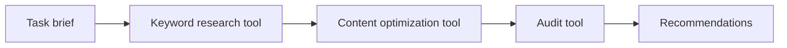

# Deploying AI Agents for SEO and Keyword Research

> Wrap keyword research, content optimization and SEO audits as agent tools, then let an agent chain them into ranked recommendations.

## At a Glance

| Field | Value |
|-------|-------|
| Difficulty | Intermediate |
| Time to Learn | 1-2 days for a first working keyword-to-audit pipeline |
| Outcome | An agent that takes an SEO task brief, calls your keyword, optimization and audit tools in sequence, and returns structured recommendations. |
| Prerequisites | Working knowledge of C# or Python, Access to a keyword data provider or search API, A basic Semantic Kernel agent that can already chat, Familiarity with on-page and technical SEO checks |
| Part of | [Semantic Kernel Agent Framework](../../methods/semantic-kernel-agent-framework/METHOD.md) |

## Overview

Deploying AI agents for SEO means turning the operations an SEO practitioner already performs, such as pulling keyword ideas, checking what ranks, rewriting a page for a target term and auditing a URL, into tools an agent can call on its own. The agent reads a task brief, decides which tools to invoke and in what order, passes the output of one tool into the next, and returns recommendations you can act on. For background on the framework itself, see the [Semantic Kernel Agent Framework method page](https://tryhamster.com/methods/semantic-kernel-agent-framework).

The mechanics are specific. To expose any function as a tool, you [decorate it with the KernelFunction attribute, place it in a plugin class or wrap it with KernelPluginFactory, add the plugin to a Kernel, and pass that Kernel to the agent](https://learn.microsoft.com/en-us/agent-framework/migration-guide/from-semantic-kernel). Plugins [can be added to the kernel before or after the agent is created, or passed directly to the agent constructor](https://learn.microsoft.com/en-us/semantic-kernel/frameworks/agent/agent-functions). That flexibility lets you keep a stable core of SEO tools and attach task-specific ones, such as a local-search checker, only when a brief needs them.

The most important thing to understand before you start is the division of labour. The framework supplies agents, kernels, plugins and orchestration. It does not supply search volumes, SERP snapshots, crawl data or ranking logic. The [agent framework documentation](https://learn.microsoft.com/en-us/semantic-kernel/frameworks/agent) describes a platform for creating agents and agentic patterns, not an SEO toolkit, so every keyword provider, crawler, HTML parser and audit rule is code you write or an API you connect. Teams that miss this build an agent that sounds confident and invents numbers.

The framework also does not define SEO thresholds. There is no built-in keyword-volume cutoff, density target, competitor count, crawl limit or scoring formula, so each of those is a project decision you encode in your own functions and document for the team.

This skill covers four things: designing SEO plugin functions with structured inputs and outputs, shaping keyword-research records so downstream tools can use them, sequencing the agent from brief to recommendations, and identifying the data sources your application must provide. The result is a pipeline where the language model handles judgement and phrasing, while deterministic code handles measurement.

## How It Works

An SEO agent works as a loop. You give it a brief in natural language, the model sees the list of registered functions, and it picks the ones that move the task forward. With automatic function calling, you [register the plugin with the kernel, create execution settings that enable automatic function calls, and invoke the chat-completion service with the chat history and the kernel](https://learn.microsoft.com/en-us/semantic-kernel/concepts/planning). The same guidance notes that the older Stepwise and Handlebars planners have been deprecated and removed, so automatic function calling is the approach to build on.

The model can plan because the framework [sends a single prompt that combines the user request, plugins and persona](https://devblogs.microsoft.com/agent-framework/architecting-ai-apps-with-semantic-kernel). Your persona text is where you state the SEO rules of the job: which market, which language, what counts as a good opportunity, and that every figure must come from a tool result.

A typical run follows this sequence. The brief arrives, the agent calls keyword research, passes the keyword records to content optimization, runs an audit on the target page, and only then composes recommendations. The model may skip or repeat steps, but your tool descriptions and persona should make this order the obvious one.

Each tool is a thin wrapper around data or logic you own. The table below shows the usual shape.

| Function | Typical inputs | Typical outputs | Developer must implement |
|---|---|---|---|
| Keyword research | Seed topic, market, language, competitor URLs, filters | Keyword records | Data provider calls, filtering |
| SERP collection | Keyword, market | Ranking URLs and titles | Search API integration |
| Content optimization | URL or draft, target keywords, competitor data | Recommendations or revised copy | Content extraction, comparison rules |
| Metadata generation | Page content, primary keyword | Title and description drafts | Length and format validation |
| Internal-link analysis | Site URL list, target page | Link suggestions | Crawl data, link graph |
| Technical audit | URL or page document | Findings list | Crawling, parsing, scoring |

Structured inputs and outputs matter because the kernel [manages and publishes plugins and provides execution context to functions](https://learn.microsoft.com/en-us/microsoft-365/agents-sdk/using-semantic-kernel-agent-framework), while the model decides what to call based on function definitions. A keyword tool that returns a clean list of records with named fields gives the optimization tool something it can consume directly. A tool that returns a paragraph of prose forces the model to reparse it, which is where numbers drift.

External services need configuration before the agent can use them. Microsoft's OpenAPI plugin sample [requires setup details such as service parameters in the appsettings.json file](https://devblogs.microsoft.com/agent-framework/how-to-use-plugins-with-semantic-kernel) before the plugin works, and a keyword API or crawler you import will be no different. Finally, register one reusable kernel in the application builder rather than rebuilding the kernel and plugins for every request, which the Agents SDK integration guidance supports.

## Step-by-Step Guide

### Step 1: Write the SEO task brief format

Define what a request to the agent must contain before you write any tools. A useful brief names the goal, the target URL or topic, the market and language, and any competitors to watch. This format becomes the agent's input and shapes which tools you need. If practitioners send vague briefs, the agent will guess the market or skip competitor analysis, so make the fields explicit in your chat interface or intake form.

> **Pro tip:** Keep a handful of real briefs from your team and test every later step against them rather than invented prompts.

### Step 2: Inventory your SEO data sources

List every piece of data the pipeline needs and where it comes from: keyword volumes and difficulty from a provider, ranking pages from a search API, page HTML from a crawler, site structure from your own crawl or CMS export. The framework supplies orchestration, not this data. For each source, note authentication, rate limits and cost per call. Any operation with no data source behind it should not become a tool yet, because the model will fill the gap with plausible guesses.

> **Pro tip:** Mark each source as live API, cached export or manual upload so you know which tool results can go stale.

### Step 3: Design keyword-research inputs and outputs

Build the keyword function first because every later step consumes its output. Accept a seed topic, market, language, optional competitor URLs and optional limits or filters as typed parameters. Return a list of keyword records with named fields such as term, volume, difficulty, intent and source, rather than free text. Put thresholds like minimum volume in parameters with documented defaults, since the framework prescribes none.

A good test is whether the content-optimization function can accept this output without the model rewriting it.

> **Pro tip:** Set a recommended result cap as a parameter, for example 50 keywords per call, so one broad seed does not flood the context window.

### Step 4: Wrap each operation as a KernelFunction

Decorate each SEO function with the KernelFunction attribute and give it a clear description of what it does and when to use it. Group related functions into plugin classes, for example a research plugin and an audit plugin, or wrap them with KernelPluginFactory. The description is what the model reads when choosing tools, so write it like instructions to a junior analyst. Keep business logic such as density calculation or scoring inside the function in deterministic code.

> **Pro tip:** Name functions with verbs that match how practitioners talk, such as get_keyword_ideas or audit_page, so tool choices in logs are easy to read.

### Step 5: Configure external services and register the kernel

Add endpoints, keys and service parameters for each imported API to application configuration before the agent runs. Add the plugins to a kernel, either before or after creating the agent, or pass them to the agent constructor. Register a single reusable kernel with the application builder so requests do not rebuild it. Confirm registration by asking the agent to list its available tools before testing real briefs.

> **Pro tip:** Fail fast at startup if a required API key or endpoint is missing, instead of letting the first tool call error mid-conversation.

### Step 6: Enable automatic function calling and set the persona

Create execution settings that turn on automatic function calling, then invoke the chat-completion service with the chat history and the kernel. Write a persona that states the expected sequence: research keywords, then optimize content, then audit, then recommend. Tell the agent that every metric in its answer must come from a tool result and should be attributed to that tool. Avoid the deprecated Stepwise and Handlebars planners, which are no longer in the packages.

### Step 7: Test the sequence and inspect tool calls

Run your saved briefs and review which tools the agent called, in what order, and with what arguments, not only the final text. Check that keyword records flow unchanged into the optimization step and that the audit ran on the right URL. If the agent skips a step, tighten the function description or persona rather than hard-coding the order. Compare any figure in the output against the raw tool responses to catch invented numbers.

> **Pro tip:** Log every function call with inputs and outputs so a practitioner can trace any recommendation back to its data.

## Best Practices

- Return structured records from every tool. The model chooses and chains functions based on their definitions, so named fields pass cleanly between keyword, optimization and audit steps while prose invites reinterpretation.
- Keep measurement in code and judgement in the model. Keyword density, title length and status-code checks belong in deterministic functions, while prioritisation and phrasing of recommendations suit the model.
- Expose thresholds as documented parameters. Because the framework sets no volume, density or crawl limits, putting them in function signatures makes project choices visible and adjustable per brief.
- Write tool descriptions for selection, not documentation. State when to call the function and what it needs, since that description is the main signal the model uses to decide.
- Register one reusable kernel at startup. Rebuilding the kernel and plugins per request adds overhead and makes configuration drift between requests more likely.
- Require source attribution in the persona. Instructing the agent to cite which tool produced each metric makes fabricated figures easy to spot during review.
- Start with three tools and add more later. A keyword, optimization and audit trio covers most briefs, and each extra tool widens the model's choice set and the room for wrong calls.

## Common Mistakes

- **Assuming the framework provides SEO data or SEO logic out of the box.** — Connect your own keyword provider, search API, crawler and audit rules. The framework only orchestrates tools, so without these the agent will produce plausible but unsourced numbers.
- **Building on the Stepwise or Handlebars planners from older tutorials.** — Use automatic function calling through execution settings. Those planners have been deprecated and removed from current packages, so code copied from old samples will not compile or will behave unpredictably.
- **Expecting the agent to call a plugin that was never registered on the kernel.** — Add the plugin to the kernel or agent constructor and pass the kernel during invocation. If the agent answers without calling a tool you wrote, check registration before rewriting prompts.
- **Importing an external SEO API without configuring its endpoint and parameters.** — Put endpoints, keys and required service parameters in application configuration before first use, and validate them at startup so failures surface immediately rather than mid-run.
- **Constructing a new kernel and plugin set for every request.** — Register a reusable kernel in the application builder. This avoids repeated setup work and keeps every request running against the same tool configuration.

## References

- [Examples](references/examples.md) — Worked examples and scenarios
- [FAQ](references/faq.md) — Frequently asked questions
- [Parent Method](../../methods/semantic-kernel-agent-framework/METHOD.md) — Semantic Kernel Agent Framework

## Related Skills

- [Designing Human-in-the-Loop Agent Workflows](../designing-human-in-the-loop-agent-workflows/SKILL.md)
- [Selecting and Comparing AI Agent Architectures](../selecting-and-comparing-agent-architectures/SKILL.md)
- [Building Autonomous AI Agents with Semantic Kernel](../building-autonomous-ai-agents-with-semantic-kernel/SKILL.md)
- [Orchestrating Multi-Agent Conversations and Collaboration](../orchestrating-multi-agent-conversations/SKILL.md)
- [Integrating Plugins and Tools into Semantic Kernel Agents](../integrating-plugins-and-tools-into-agents/SKILL.md)
- [Adding Memory and Context Management to AI Agents](../adding-memory-and-context-to-agents/SKILL.md)
- [Implementing Agent Planning Strategies for Complex Tasks](../implementing-agent-planning-strategies/SKILL.md)

## Sources

- [Semantic Kernel to Microsoft Agent Framework Migration Guide](https://learn.microsoft.com/en-us/agent-framework/migration-guide/from-semantic-kernel)
- [Use Semantic Kernel and Agent Framework in Agents SDK](https://learn.microsoft.com/en-us/microsoft-365/agents-sdk/using-semantic-kernel-agent-framework)
- [Limitations For Agent](https://learn.microsoft.com/en-us/semantic-kernel/frameworks/agent/agent-functions)
- [How to use plugins with Semantic Kernel \| Microsoft Agent Framework](https://devblogs.microsoft.com/agent-framework/how-to-use-plugins-with-semantic-kernel)
- [What are Planners in Semantic Kernel](https://learn.microsoft.com/en-us/semantic-kernel/concepts/planning)
- [Semantic Kernel Agent Framework \| Microsoft Learn](https://learn.microsoft.com/en-us/semantic-kernel/frameworks/agent)
- [Architecting AI Apps with Semantic Kernel \| Microsoft Agent](https://devblogs.microsoft.com/agent-framework/architecting-ai-apps-with-semantic-kernel)
