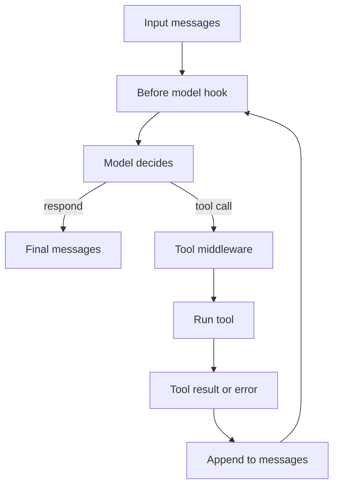

# Designing Autonomous Agents Around a LangChain LLM

> Build a LangChain agent by pairing a model with a harness of prompt, tools and middleware, then add control and delegation only where needed.

## At a Glance

| Field | Value |
|-------|-------|
| Difficulty | Intermediate |
| Time to Learn | 2-4 hours for a first working agent |
| Outcome | An agent definition with a named model, a scoped prompt, well-described tools, justified middleware and, where needed, persistence and subagents. |
| Prerequisites | Working knowledge of Python or JavaScript, Access to at least one chat model provider, Familiarity with calling external APIs, Basic understanding of prompts and message-based chat models |
| Part of | [LangChain](../../methods/langchain/METHOD.md) |

## Overview

An autonomous agent is not just a model with a long prompt. LangChain's documentation states it plainly: [Agent = Model + Harness](https://docs.langchain.com/oss/python/langchain/agents), where the harness is everything around the loop, meaning the prompt, the tools and any middleware that shapes the model's behavior. The same [JavaScript agents guide](https://docs.langchain.com/oss/javascript/langchain/agents) gives the harness one job: get the model the right context at the right time for the given task. Designing an agent is therefore mostly harness design. You pick a model, but you spend your effort deciding which tools it may call, what it sees before each call, and what happens when something fails.

This skill covers that design work: setting up a minimal agent, understanding the loop it runs, adding middleware to control each lifecycle step, and delegating specialised work to subagents. For the framework's origin and how it compares with alternatives, see the [LangChain method page](https://tryhamster.com/methods/langchain).

The current starting point is `create_agent`. The [LangChain overview](https://docs.langchain.com/oss/python/langchain/overview) describes it as a minimal harness to which you add capabilities incrementally through middleware, composing only what your use case needs, from guardrails and retries to routing. The v1 release notes call middleware [the defining feature of create_agent](https://docs.langchain.com/oss/python/releases/langchain-v1), which signals where the project expects custom behavior to live: in hooks around the loop, not in a hand-rolled loop of your own.

The practical consequence is a design order. Start with a model and a short list of well-described tools. Run it. Watch where it goes wrong: wrong tool choice, bloated context, unrecovered tool errors, forgotten conversation. Then add the one piece of middleware or configuration that fixes that failure. Teams that begin by stacking every available capability end up with an agent they cannot debug, because they cannot tell which layer changed the model's behavior.

The output of this skill is an agent definition you can reason about: a named model, a tool list with clear schemas and descriptions, a system prompt scoped to the task, a small set of middleware each justified by an observed need, and, where tasks are deep or noisy, subagents that keep the supervisor's context clean. When memory across turns matters, you also configure persistence, which is covered in depth on the [memory and conversation state skill](https://tryhamster.com/skills/managing-memory-and-conversation-state). Tool definitions themselves get their own treatment on the [external tools and APIs skill](https://tryhamster.com/skills/integrating-external-tools-and-apis); here the focus is how tools fit into the agent's decisions.

## How It Works

An agent built with `create_agent` takes a sequence of messages as input, representing the user request and any prior conversation, and returns a sequence of messages that includes the model's reply plus every tool call and tool result produced along the way. Between those two points it runs a loop, described in the [agent configuration guide](https://docs.langchain.com/oss/python/langchain/agents): on each turn the model decides whether to answer directly or call a tool. If it calls a tool, the harness executes it, appends the result to the message history, and hands control back to the model, which now reasons with the new information. The loop ends when the model responds without requesting a tool.

Three parts of the harness shape this loop.

**The prompt** sets the task, the constraints and how the model should behave. It should describe the job, not enumerate every operation. Operations belong in tools.

**The tools** are explicit capabilities the model can select. The [LangChain tools documentation](https://docs.langchain.com/oss/python/langchain/tools) describes tools as the way agents fetch real-time data, execute code, query databases and act in external systems. The contract is simple: the model supplies arguments that match the tool's schema, the tool returns an observation or an error, and the agent folds that result into its next decision. A vague description or loose schema shows up as wrong tool choice or malformed arguments.

**The middleware** wraps the lifecycle. According to the [context engineering guide](https://docs.langchain.com/oss/python/langchain/context-engineering), middleware can hook into any step of the agent lifecycle to update context or jump to a different step, which makes it the main mechanism for controlling what the model sees. A common pattern from that guide loads user preferences, selects or overrides the model, and passes the resulting context into the agent at runtime. Tool execution and tool-error handling are also configured through middleware, per the [tools documentation](https://docs.langchain.com/oss/python/langchain/tools), so recovery behavior is a design decision rather than an accident.

State is the next concern. Without a checkpointer, the agent keeps nothing between runs. The [agents guide](https://docs.langchain.com/oss/python/langchain/agents) shows that persistent conversation history needs a checkpointer and a `thread_id`, with `InMemorySaver()` given as a local example. Short-term state lives in the thread; durable facts should be stored separately and retrieved into context when relevant.

Finally, delegation. When one task needs deep, noisy work, such as reading many documents or running many searches, you can hand it to a subagent. The [prebuilt middleware reference](https://docs.langchain.com/oss/python/langchain/middleware/built-in) describes subagents as isolating the delegated task's context, which keeps the supervisor's context window clean while the subagent goes deep. The supervisor receives the subagent's result, not its full working history. The same reference shows a storage split in which files under `/memories/` can persist across threads while other files stay in ephemeral state, a useful boundary when subagents produce artifacts worth keeping.

## Step-by-Step Guide

### Step 1: Define the task boundary and success signal

Write down what the agent must accomplish, what it must never do, and how you will know a run succeeded. List the systems it needs to read from and act on, since each becomes a candidate tool. Decide whether a human reviews actions before they take effect. This boundary drives every later choice: prompt scope, tool list, middleware and whether you need subagents at all.

> **Pro tip:** If you cannot describe a successful run in two or three sentences, the task is too broad for one agent and should be split.

### Step 2: Pick the model and write a scoped prompt

Choose a model that supports tool calling and fits your latency and cost limits. Write a system prompt that states the role, the goal and the constraints, and leave operational detail to the tools. Keep the prompt short enough that you can read it in full while debugging. Treat the model as one configurable component, so you can swap it later without rewriting the harness.

> **Pro tip:** Keep the model identifier in configuration rather than hard-coding it, which makes comparisons between models a one-line change.

### Step 3: Expose tools as explicit capabilities

Turn each operation the agent needs into a tool with a clear name, a description of when to use it and a strict argument schema. Tools let the agent fetch data, run code, query databases and act in external systems, as the [tools documentation](https://docs.langchain.com/oss/python/langchain/tools) describes. Start with the fewest tools that cover the task, because every extra tool is another choice the model can get wrong. Make each tool return something the model can act on, including a readable error.

> **Pro tip:** Write tool descriptions as instructions to the model: when to call it, when not to, and what the output means.

### Step 4: Stand up the minimal harness with create_agent

Create the agent with just the model, the tools and the prompt. The [LangChain overview](https://docs.langchain.com/oss/python/langchain/overview) recommends starting with `create_agent` as a minimal harness and adding capabilities incrementally. Run it against a handful of realistic requests and read the full message trace, including each tool call and result. Note every failure by type: wrong tool, bad arguments, looping, missing context or a poor final answer.

### Step 5: Add middleware only for observed failures

Map each failure type from the previous step to one intervention. Middleware can hook into lifecycle steps to update context or jump to another step, per the [context engineering guide](https://docs.langchain.com/oss/python/langchain/context-engineering), and it is where tool-error handling is configured. Retries fit flaky APIs, guardrails fit unsafe actions, routing fits requests that need a different model, and context injection fits missing user data. Add one piece at a time and rerun the same requests so you can see what changed.

> **Pro tip:** Keep a short log of which middleware was added for which failure, so you can remove it later if the cause disappears.

### Step 6: Configure persistence where turns must carry over

If users return to a conversation, add a checkpointer and pass a consistent `thread_id` on every call, as the [agents guide](https://docs.langchain.com/oss/python/langchain/agents) shows. Use an in-memory saver locally and a durable backend in production. Keep only thread-scoped conversation in this state. Store durable facts such as preferences separately and retrieve them into context when they are relevant.

> **Pro tip:** Test persistence by ending a session, starting a new process and asking a question that depends on the earlier turn.

### Step 7: Delegate deep or noisy work to subagents

When one part of the task floods the context with intermediate results, move it to a subagent. The [prebuilt middleware reference](https://docs.langchain.com/oss/python/langchain/middleware/built-in) describes subagents as isolating that task's context so the main agent's window stays clean. Give the subagent its own focused prompt and tools, and define exactly what it returns to the supervisor. The supervisor should see a concise result, not the subagent's full history.

> **Pro tip:** Define the subagent's return format first; a vague handoff is the most common reason delegation makes answers worse.

## Best Practices

- Start with the smallest useful harness. The [LangChain overview](https://docs.langchain.com/oss/python/langchain/overview) frames `create_agent` as a minimal base you extend through middleware, and each layer you skip is one less place for unexpected behavior to hide.
- Treat model, prompt, tools, memory and control policies as separately configurable parts. The v1 direction puts [middleware at the center of create_agent](https://docs.langchain.com/oss/python/releases/langchain-v1) rather than a fixed loop, so designing the parts independently lets you change one without breaking the others.
- Put operations in tools, not in the prompt. A prompt that describes every API call is hard to maintain and easy for the model to misread, while a tool with a schema gives the model a clear choice and gives you a clear failure point.
- Make every tool failure recoverable by design. Because tool-error handling lives in middleware per the [tools documentation](https://docs.langchain.com/oss/python/langchain/tools), decide up front whether the agent retries, reports the error to the model or stops, and return errors the model can understand.
- Keep active context focused. Use middleware to control what enters each model call, as the [context engineering guide](https://docs.langchain.com/oss/python/langchain/context-engineering) describes, and retrieve durable information when relevant rather than carrying all history in every prompt.
- Read full traces before adding capability. Tool calls and results are part of the agent's output messages, so the trace shows exactly where a run went wrong and which fix to apply.

## Common Mistakes

- **Treating the model alone as the agent and tuning only the prompt when behavior is wrong.** — LangChain defines the agent as [model plus harness](https://docs.langchain.com/oss/python/langchain/agents). Check the tool descriptions, schemas and middleware before rewriting the prompt, because most misbehavior comes from what the model was given, not from the model.
- **Assuming a defined agent remembers past conversations.** — Without a checkpointer the agent keeps no state across runs. Configure a checkpointer and pass the same `thread_id` on every call in a conversation, as the [agents guide](https://docs.langchain.com/oss/python/langchain/agents) shows.
- **Exposing tools without deciding what happens when they fail.** — An unhandled error can stall the loop or send the model into repeated failing calls. Configure tool-error handling in middleware, per the [tools documentation](https://docs.langchain.com/oss/python/langchain/tools), so the agent retries, explains or stops by design.
- **Letting context grow without limits as tool results pile up.** — Long traces push relevant instructions out of focus and can exceed the context window. Use middleware to control what gets added or passed at each step, following the [context engineering guide](https://docs.langchain.com/oss/python/langchain/context-engineering).
- **Giving every specialist in a multi-agent design the full supervisor context.** — Shared context makes specialists slower and more distractible, and it floods the supervisor with their working notes. Use subagents that [isolate the delegated task's context](https://docs.langchain.com/oss/python/langchain/middleware/built-in) and return only a concise result.

## References

- [Examples](references/examples.md) — Worked examples and scenarios
- [FAQ](references/faq.md) — Frequently asked questions
- [Parent Method](../../methods/langchain/METHOD.md) — LangChain

## Related Skills

- [Building RAG Pipelines with LangChain](../building-rag-pipelines-with-langchain/SKILL.md)
- [Managing Memory and Conversation State in LangChain](../managing-memory-and-conversation-state/SKILL.md)
- [Chaining Prompts and Composing LLM Workflows](../chaining-prompts-and-composing-workflows/SKILL.md)
- [Configuring LLM Providers and Models in LangChain](../configuring-llm-providers-and-models/SKILL.md)
- [Integrating External Tools and APIs into LangChain](../integrating-external-tools-and-apis/SKILL.md)
- [Loading and Splitting Documents for LLM Processing](../loading-and-splitting-documents/SKILL.md)
- [Crafting Reusable Prompt Templates in LangChain](../crafting-prompt-templates/SKILL.md)

## Sources

- [Context engineering in agents - Docs by LangChain](https://docs.langchain.com/oss/python/langchain/context-engineering)
- [What's new in LangChain v1](https://docs.langchain.com/oss/python/releases/langchain-v1)
- [tools](https://docs.langchain.com/oss/python/langchain/tools)
- [agents](https://docs.langchain.com/oss/javascript/langchain/agents)
- [Configure the harness](https://docs.langchain.com/oss/python/langchain/agents)
- [Prebuilt middleware - Docs by LangChain](https://docs.langchain.com/oss/python/langchain/middleware/built-in)
- [overview](https://docs.langchain.com/oss/python/langchain/overview)
