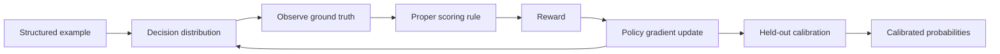

# Practical outcome based reinforcement learning reward design

> Build rewards that score a model's stated probabilities against realized outcomes so training pushes confidence toward observed correctness.

## At a Glance

| Field | Value |
|-------|-------|
| Difficulty | Advanced |
| Time to Learn | 2-4 weeks for a first working reward and calibration pass |
| Outcome | A reward signal and post-hoc calibration step that make a decision model's confidence values track how often its decisions turn out to be correct. |
| Prerequisites | Working knowledge of reinforcement learning and policy-gradient methods, Familiarity with softmax outputs and probability distributions, A decision task with a defined answer space and resolvable ground truth, Held-out data for post-training calibration |
| Part of | [Reinforcement Learning for Calibrated Decisions \(RLCD\)](../../methods/reinforcement-learning-for-calibrated-decisions-rlcd/METHOD.md) |

## Overview

Outcome-based reward design is the work of deciding what number a decision model receives after it commits to a probabilistic answer and the real outcome becomes known. In the calibrated-decision setting, the [RLCD glossary definition](https://sanity.io/glossary/rlcd-reinforcement-learning-for-calibrated-decisions) ties the reward to whether the model's stated probability matches how often its answer turns out to be correct, rather than to human preference ratings or automatic verification. For the definition and history of the approach, see the [RLCD method page](https://tryhamster.com/methods/reinforcement-learning-for-calibrated-decisions-rlcd); this page covers building the reward itself.

This is a design problem, not a configuration step, because TypeSafe has not published the reward it uses. Independent commentary notes that [the RLCD reward function and training procedure remain undisclosed](https://anthonymaio.substack.com/p/jev-the-language-model-that-wont). Practitioners therefore work from open reimplementations. The [OpenJev repository](https://github.com/Heman10x-NGU/Verdict-open-jev) trains with a composite of strictly proper scoring rules, cross-entropy plus a multi-class Brier score, and a separate write-up suggests an implementation [can apply the Brier score during training and again as a held-out objective for post-hoc calibration](https://di-zhang-llm.github.io/blog/what-is-rlcd-the-secret-behind-jev). Treat these as reference patterns you can test, not as the vendor's recipe.

The inputs are concrete. Each training example carries a state, a structured question, a correct answer and a defined output schema, as described in [this RLCD term explainer](https://globaladvisors.biz/2026/09/21/term-reinforcement-learning-for-calibrated-decisions-rlcd-artificial-intelligence). The model emits a probability distribution over the permitted answers, and the realized outcome arrives later. The outputs are a scalar reward per decision, a policy update, and optionally a calibration layer fitted after training.

The central decision is which scoring rule to use. A strictly proper rule gives its best expected score when the reported probability equals the true chance of the outcome, so a model cannot improve its reward by hedging toward the middle or by exaggerating certainty. A reward that only checks whether the top choice was right does not have this property: it pays the same for a correct answer at low and high confidence, so it gives no pressure toward honest probabilities.

You can tell the design went wrong when accuracy improves but confidence stops meaning anything, when one task type looks well calibrated and another drifts, or when your ground truth is itself shaky. Commentary on RLCD raises exactly this last risk, warning about [benchmark bias when the correct answer is defined by an average of generative-AI outputs](https://note.com/wayne_chang/n/n151303c2041a). A reward can only be as honest as the outcome it is scored against.

## How It Works

The reward loop has four stages that repeat for every batch: the model produces a distribution over candidate decisions, the true outcome is observed, a proper scoring rule converts the gap between the two into a reward, and a policy-gradient step shifts the model toward higher expected reward.

The [RLCD term explainer](https://globaladvisors.biz/2026/09/21/term-reinforcement-learning-for-calibrated-decisions-rlcd-artificial-intelligence) describes this shape: the model produces a probabilistic decision, a reward function evaluates how well its probability distribution matches the ground truth, and policy-gradient updates adjust the model to increase expected reward on future decisions. In practice the reward is the negative of a loss, so lowering the scoring-rule penalty and raising the reward are the same move.

The three components used in open implementations play different roles and run at different times.

| Component | Role | When applied |
|---|---|---|
| Cross-entropy | Penalizes low probability on the true outcome, part of [OpenJev's composite loss](https://github.com/Heman10x-NGU/Verdict-open-jev) | During training |
| Brier score | Squared probability error across all candidates, weighted 1.0 in [the OpenJev loss](https://github.com/Heman10x-NGU/Verdict-open-jev) | Training, and as [a held-out objective](https://di-zhang-llm.github.io/blog/what-is-rlcd-the-secret-behind-jev) |
| Temperature scaling | Rescales softmax outputs toward empirical accuracy via L-BFGS, per [OpenJev](https://github.com/Heman10x-NGU/Verdict-open-jev) | After training, on held-out data |

Cross-entropy looks only at the probability assigned to the outcome that happened. It punishes confident misses very hard, which gives strong gradients early in training but can make the model sensitive to mislabeled examples. The Brier score, which the [OpenJev repository](https://github.com/Heman10x-NGU/Verdict-open-jev) describes as penalizing squared probability discrepancies across all candidate outcomes, is bounded and looks at the whole distribution, so it cares whether the probability mass on wrong answers is sensibly spread. OpenJev adds the two with an equal weight of 1.0 in [its published loss](https://github.com/Heman10x-NGU/Verdict-open-jev); that weight is one project's choice and a reasonable starting point to tune, not a standard.

Temperature scaling sits outside the reward loop. After the policy is trained, you fit a single temperature on held-out data so that softmax probabilities line up with how often the model is actually right, which is how [OpenJev applies post-hoc L-BFGS temperature scaling](https://github.com/Heman10x-NGU/Verdict-open-jev). Using the Brier score as the held-out objective, as [one RLCD write-up suggests](https://di-zhang-llm.github.io/blog/what-is-rlcd-the-secret-behind-jev), keeps the calibration target consistent with the training signal. Because temperature scaling preserves the ranking of candidates, it changes confidence without changing which decision the model picks.

The design intent throughout matches the [glossary description](https://sanity.io/glossary/rlcd-reinforcement-learning-for-calibrated-decisions): the reward tracks whether stated probabilities match correctness rates, not whether a rater liked the answer or a program accepted it.

## Step-by-Step Guide

### Step 1: Define the outcome and when it resolves

Write down, for each decision type, what counts as correct and when that becomes known. Some outcomes resolve instantly from a label, while others arrive days later from a downstream system. The reward cannot be computed until the outcome exists, so your training data pipeline has to join decisions to outcomes reliably. If the definition of correct is ambiguous, the scoring rule will faithfully reward that ambiguity.

Document exclusions, such as cases that never resolve, instead of silently treating them as wrong.

> **Pro tip:** Keep a small set of hand-reviewed outcomes to spot-check the automated labels before they feed any reward.

### Step 2: Build structured training examples

Package each example with a state, a structured question, the correct answer and a defined output schema, the anatomy described in the [RLCD term explainer](https://globaladvisors.biz/2026/09/21/term-reinforcement-learning-for-calibrated-decisions-rlcd-artificial-intelligence). The schema fixes the candidate set the model distributes probability over, which is what makes a scoring rule computable. Without a closed answer space you cannot score probability mass on wrong answers. Schema design itself is covered in [designing schema-constrained decisions](https://tryhamster.com/skills/designing-schema-constrained-decisions).

### Step 3: Choose a strictly proper scoring rule

Pick cross-entropy, the Brier score, or a composite; the [OpenJev implementation](https://github.com/Heman10x-NGU/Verdict-open-jev) combines both. Cross-entropy gives sharp gradients but is harsh on confident mistakes and noisy labels. The Brier score is bounded and considers the full distribution. Avoid rewards based only on whether the top choice matched, because they carry no information about whether the stated confidence was right.

Record the rule and any weights so later calibration results can be traced back to them.

> **Pro tip:** Start with the composite and an equal weight, then compare variants on held-out calibration rather than training loss.

### Step 4: Turn the score into a reward and update the policy

Define the per-decision reward as the negative scoring-rule loss, so better-calibrated distributions earn more. Apply policy-gradient updates that raise expected reward on future decisions, the step the [RLCD explainer](https://globaladvisors.biz/2026/09/21/term-reinforcement-learning-for-calibrated-decisions-rlcd-artificial-intelligence) describes. Normalize or baseline the reward to keep gradient variance manageable. Watch both average reward and the spread of predicted probabilities, since a collapse toward uniform or toward extreme values signals a problem.

> **Pro tip:** Log the entropy of predicted distributions per batch; a steady slide toward zero usually means growing overconfidence.

### Step 5: Fit post-hoc temperature scaling on held-out data

After training, reserve data the policy never saw and fit a single temperature that aligns softmax probabilities with empirical accuracy, as [OpenJev does with L-BFGS](https://github.com/Heman10x-NGU/Verdict-open-jev). Use a proper scoring rule as the fitting objective; [one RLCD write-up](https://di-zhang-llm.github.io/blog/what-is-rlcd-the-secret-behind-jev) suggests reusing the Brier score. Temperature scaling does not change which decision is chosen, only how confident it looks. Refit whenever the input distribution shifts meaningfully.

> **Pro tip:** Never fit the temperature on training data; it will look perfect and fix nothing.

### Step 6: Audit the reward against calibration by task type

Check whether the reward actually produced calibrated probabilities by binning predictions and comparing stated confidence to observed accuracy. Do this separately for each decision type, because the [RLCD practitioner guide](https://systemonemodels.org/guides/rlcd-explained) warns that calibration can vary by task. If one type is badly off, inspect its outcome labels and its share of the training data before changing the scoring rule. The measurement mechanics are covered in [evaluating probabilistic calibration](https://tryhamster.com/skills/evaluating-probabilistic-calibration).

> **Pro tip:** Set a review cadence, for example after every retraining run, so drift is caught before software starts acting on stale confidence.

## Best Practices

- Score the whole distribution, not only the chosen answer. A reward that ignores the probability on wrong candidates cannot teach the model how to express uncertainty between close alternatives.
- Keep the scoring rule strictly proper, as the [OpenJev composite](https://github.com/Heman10x-NGU/Verdict-open-jev) does. Proper rules make honest probabilities the best expected strategy, so the model gains nothing by gaming its confidence.
- Separate training from calibration data. Fitting temperature or evaluating the Brier score on held-out data, as [suggested in one RLCD write-up](https://di-zhang-llm.github.io/blog/what-is-rlcd-the-secret-behind-jev), is the only way to see calibration the model has not memorized.
- Treat outcome quality as part of the reward. Commentary flags [bias when ground truth is an average of generative-AI outputs](https://note.com/wayne_chang/n/n151303c2041a), so prefer real resolved outcomes over proxy consensus labels.
- Label reference implementations for what they are. TypeSafe has not disclosed its reward, per [independent analysis](https://anthonymaio.substack.com/p/jev-the-language-model-that-wont), so document that your loss weights come from open projects and your own tuning.
- Report calibration per decision type alongside the reward curve. A rising average reward can hide one task type drifting while another improves.

## Common Mistakes

- **Rewarding only whether the top decision was correct.** — Use a proper scoring rule over the full distribution. The RLCD framing ties reward to [whether stated probability matches correctness rates](https://sanity.io/glossary/rlcd-reinforcement-learning-for-calibrated-decisions), which an accuracy-only reward cannot measure.
- **Copying the OpenJev loss weight as if it were a standard.** — The equal weighting in [OpenJev's composite loss](https://github.com/Heman10x-NGU/Verdict-open-jev) is one project's choice. Tune the balance against held-out calibration for your own task mix.
- **Fitting temperature scaling on the training set.** — Fit it on data the policy never saw, as post-hoc calibration intends. Training-set fits look well calibrated and fail in production.
- **Assuming a public reimplementation reproduces TypeSafe's method.** — Treat open code as a plausible pattern only. Analysts note [the reward function and training procedure are unpublished](https://anthonymaio.substack.com/p/jev-the-language-model-that-wont), so no public loss can be claimed as the original.
- **Pooling all decision types into one calibration check after training.** — Audit calibration separately per task, because the [practitioner guide](https://systemonemodels.org/guides/rlcd-explained) notes it can vary by question type. A pooled number can mask a badly calibrated minority task.

## References

- [Examples](references/examples.md) — Worked examples and scenarios
- [FAQ](references/faq.md) — Frequently asked questions
- [Parent Method](../../methods/reinforcement-learning-for-calibrated-decisions-rlcd/METHOD.md) — Reinforcement Learning for Calibrated Decisions \(RLCD\)

## Related Skills

- [Calibrating Confidence to Outcomes](../calibrating-confidence-to-outcomes/SKILL.md)
- [Structuring Machine-to-Machine Decision Outputs](../structuring-machine-to-machine-decision-outputs/SKILL.md)
- [Designing Schema-Constrained Decisions](../designing-schema-constrained-decisions/SKILL.md)
- [Handling Abstention and Uncertainty](../handling-abstention-and-uncertainty/SKILL.md)
- [Estimating Decision Confidence](../estimating-decision-confidence/SKILL.md)
- [Evaluating Probabilistic Calibration](../evaluating-probabilistic-calibration/SKILL.md)

## Sources

- [RLCD \(Reinforcement Learning for Calibrated Decisions\)](https://sanity.io/glossary/rlcd-reinforcement-learning-for-calibrated-decisions)
- [RLCD explained: Reinforcement Learning for Calibrated Decisions](https://systemonemodels.org/guides/rlcd-explained)
- [TypeSafe AI「Jev」モデルの訓練ロジックとRLCDアルゴリズム](https://note.com/wayne_chang/n/n151303c2041a)
- [Jev: The Language Model That Won't Talk - Anthony Maio](https://anthonymaio.substack.com/p/jev-the-language-model-that-wont)
- [Term: Reinforcement Learning for Calibrated Decisions \(RLCD\)](https://globaladvisors.biz/2026/09/21/term-reinforcement-learning-for-calibrated-decisions-rlcd-artificial-intelligence)
- [GitHub - Heman10x-NGU/Verdict-open-jev: Non-autoregressive](https://github.com/Heman10x-NGU/Verdict-open-jev)
- [What Is RLCD? The Secret Behind Jev \| Di Zhang](https://di-zhang-llm.github.io/blog/what-is-rlcd-the-secret-behind-jev)
