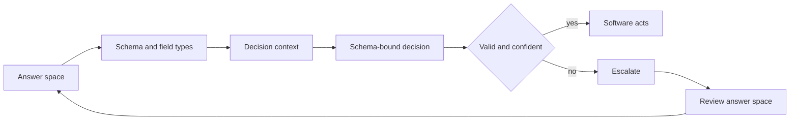

# Guide to schema constrained decision outputs for AI models

> Define a bounded answer space and typed schema so a model returns decisions and probabilities software can validate and act on.

## At a Glance

| Field | Value |
|-------|-------|
| Difficulty | Intermediate |
| Time to Learn | 2-4 hours for a first decision schema |
| Outcome | A versioned decision schema, a documented answer space with a fallback, and a set of structured examples ready for training or evaluation. |
| Prerequisites | A concrete downstream action that a model decision will trigger, Basic familiarity with typed data formats such as JSON Schema or enums, Access to historical cases with known correct answers |
| Part of | [Reinforcement Learning for Calibrated Decisions \(RLCD\)](../../methods/reinforcement-learning-for-calibrated-decisions-rlcd/METHOD.md) |

## Overview

A schema-constrained decision is a model output whose shape is fixed before the model ever sees an input: a bounded set of permitted answers, typed fields, and a probability attached to the answer the model picks. This skill is the design work that happens before any model call. You decide what the model is allowed to say, encode that as a schema, and write the examples that pair a situation with its correct answer. For background on the training method this skill supports, see the [RLCD method page](https://tryhamster.com/methods/reinforcement-learning-for-calibrated-decisions-rlcd).

The reason this work matters is that decision models of this kind do not talk. RLCD material describes them as systems that [return decisions and calibrated probabilities instead of generated text](https://systemonemodels.org/guides/rlcd-explained). One explainer lists the forms those decisions take as [a choice, a score, or a yes/no](https://explainx.ai/blog/diogo-almeida-typesafe-ai-rlhf-detour-profile-2026), and a community reference summarizes the category as [decision models that return typed values and probabilities instead of text](https://learnjev.com/concepts/rlcd). None of that works unless someone has decided which choices exist, what range a score lives in, and what exactly counts as yes. The schema is that decision, written down.

Skipping the design step pushes the cost downstream. A glossary entry on the method points out that [unconstrained prose forces the caller into parsing, intent guessing and detecting malformed or hallucinated entities](https://globaladvisors.biz/2026/09/21/term-reinforcement-learning-for-calibrated-decisions-rlcd-artificial-intelligence). A bounded answer space removes those failure modes by construction: an answer outside the enum is a validation error, not an ambiguity someone has to interpret at 2am.

The inputs to this skill are the downstream action the decision drives, the list of outcomes your software can actually handle, the context available at decision time, and historical cases with known correct answers. The outputs are a versioned schema with field types, a documented answer space that includes an explicit fallback value, a set of structured examples, and a validation rule that the consuming service enforces on every response.

This page stops at the schema boundary. Attaching and interpreting the probability is covered in [Estimating Decision Confidence](https://tryhamster.com/skills/estimating-decision-confidence), and deciding what to do with low-confidence outputs is covered in [Handling Abstention and Uncertainty](https://tryhamster.com/skills/handling-abstention-and-uncertainty). Here the focus is narrower and earlier: making sure the question has a finite, typed, checkable set of answers before anyone asks how confident the model is.

## How It Works

The glossary description of RLCD lays out a practical pipeline that doubles as a design checklist: [define the permitted answer space, specify the schema and field types, provide the decision context, obtain a schema-bound decision and probability, validate or threshold the result in software, and escalate low-confidence cases](https://globaladvisors.biz/2026/09/21/term-reinforcement-learning-for-calibrated-decisions-rlcd-artificial-intelligence). The first two stages are pure design work, and they determine whether the last three are even possible.

**Answer space.** This is the full set of values the model may return for one question. For a choice, it is an enum. For a score, it is a bounded numeric range with a defined meaning at each end. For a yes/no, it is a boolean plus a written definition of what yes means operationally. The answer space should be exhaustive for the situations software can handle, and it should include an explicit value for everything else, so the model is never forced to pick a wrong label because the right one does not exist.

**Schema and field types.** The schema turns the answer space into something a validator can check: field names, types, allowed values, and the probability field that accompanies the decision. The community summary of these systems as returning [typed values and probabilities instead of text](https://learnjev.com/concepts/rlcd) is the target shape. Keep the decision field and the probability field separate, so software can read either without parsing the other.

**Training example anatomy.** The same glossary describes a structured training example as containing [a state, a structured question, a correct answer, and a defined output schema](https://globaladvisors.biz/2026/09/21/term-reinforcement-learning-for-calibrated-decisions-rlcd-artificial-intelligence). The state is the context the model sees. The structured question names which decision is being asked. The correct answer must be a legal value in the schema. The schema travels with the example so the model learns the boundary, not just the label.

**Why bounding enables scoring.** In the glossary's account, [the model produces a probabilistic decision and a reward function evaluates how well its probability distribution matches the ground truth](https://globaladvisors.biz/2026/09/21/term-reinforcement-learning-for-calibrated-decisions-rlcd-artificial-intelligence), with policy-gradient updates adjusting the model afterwards. A distribution can only be compared with ground truth if the outcomes are enumerable and the correct answer is one of them. Free text has no such structure, which is why the practitioner guide frames the goal as [rewarding probabilities that match real outcomes](https://systemonemodels.org/guides/rlcd-explained) rather than grading prose.

**Validation and escalation.** Once outputs arrive, software checks them against the schema first and the probability second. A schema violation is a hard reject. A legal but low-probability answer goes to the escalation path. Both outcomes are signals back to design: frequent fallback answers or escalations clustered on one kind of input usually mean the answer space is missing a value.

## Step-by-Step Guide

### Step 1: Start from the downstream action

Write down the exact action software will take for each possible decision before you name any labels. If two labels trigger the same action, they are one label as far as the schema is concerned. If one label can trigger two different actions depending on context, it needs to be split. This keeps the answer space tied to what the system can do rather than to how a human would describe the situation.

> **Pro tip:** Draft the answer space as a two-column list: label on the left, the code path it triggers on the right. Any label without a code path gets cut.

### Step 2: Enumerate the permitted answer space

List every value the model may return and make the list exhaustive for the cases software handles. Add an explicit fallback value such as other or needs_review for inputs outside that set. Define each value in one sentence that a reviewer could apply consistently. Check that the values are mutually exclusive, because overlapping labels make ground truth ambiguous and any probability attached to them hard to interpret.

> **Pro tip:** Have two people label the same small batch of historical cases using only your definitions. Disagreements point to labels that overlap or are underspecified.

### Step 3: Choose the decision type and field types

Pick the decision form that matches the action: a choice, a score, or a yes/no, the three forms one explainer lists for [structured decisions of this kind](https://explainx.ai/blog/diogo-almeida-typesafe-ai-rlhf-detour-profile-2026). Encode choices as enums, scores as bounded numbers with documented endpoints, and yes/no as a boolean with a written operational meaning. Add a separate numeric field for the probability. Avoid free-text fields in the decision object, since anything the model can write freely is something downstream code has to parse.

> **Pro tip:** If you are tempted to add a free-text reason field, ask who reads it. If the answer is only software, replace it with an enum of reason codes.

### Step 4: Specify the decision context

Decide what state the model receives at decision time and limit it to information that will actually be available in production. Structure the state as named fields where possible rather than one blob of text, so you can later see which inputs drove errors. Record the context schema alongside the output schema, because a change to either changes what the model is being asked. Leave out fields that leak the answer, such as a status set after the decision was made.

> **Pro tip:** For each context field, note when it becomes available in the real workflow. Any field populated after the decision point should not be in the training state.

### Step 5: Build structured examples

Assemble examples with the four parts the glossary names: [a state, a structured question, a correct answer, and a defined output schema](https://globaladvisors.biz/2026/09/21/term-reinforcement-learning-for-calibrated-decisions-rlcd-artificial-intelligence). Validate every correct answer against the schema before it enters the set, so no example teaches an illegal value. Include cases whose correct answer is the fallback, otherwise the model learns that the fallback never happens. Keep the examples tagged by question type so they can be evaluated separately later.

> **Pro tip:** Run the schema validator over the whole example set as a build step. A single illegal label in the ground truth will quietly distort what the model learns.

### Step 6: Validate, threshold and escalate

Wire the consumer to reject any output that fails schema validation, then apply a confidence threshold to legal outputs, following the [validate, threshold and escalate stages](https://globaladvisors.biz/2026/09/21/term-reinforcement-learning-for-calibrated-decisions-rlcd-artificial-intelligence) of the pipeline. Route rejected and low-confidence cases to a defined escalation path rather than a default action. Log the input, the output, the probability and the eventual outcome for each case. Review escalations regularly, because clusters of them usually reveal a missing answer value.

### Step 7: Version the schema

Give each schema a version and store it with every logged decision. When you add, remove or redefine a value, bump the version and re-validate the example set against it. Keep old versions readable so historical decisions can still be interpreted. Treat schema changes like API changes, since every consumer depends on the answer space staying stable.

## Best Practices

- Design the answer space from the actions software can take, not from categories that sound natural to a human. Labels that map to no action add ambiguity to ground truth without adding value to the system.
- Always include an explicit fallback value. Without one, the model is forced to put inputs it cannot place into a real category, and those wrong labels look like confident, legal decisions.
- Keep the decision and its probability in separate typed fields. Models in this category are described as returning [typed values and probabilities instead of text](https://learnjev.com/concepts/rlcd), and consumers should be able to read each field without parsing the other.
- Validate ground-truth labels against the schema before training or evaluation. An example whose correct answer is not a legal value teaches the model an answer it can never be allowed to give.
- Restrict the context to information available at decision time. Leaked future fields make offline results look strong and production results collapse, and the schema review is the cheapest place to catch them.
- Tag each example with its question type from the start. Calibration and error patterns can differ by task, and the practitioner guide on [RLCD evaluation](https://systemonemodels.org/guides/rlcd-explained) recommends measuring them separately, which is only possible if the tags exist.

## Common Mistakes

- **Asking for unconstrained prose and parsing it afterwards.** — Define an enum, score or boolean up front. Prose output requires [parsing, intent guessing and catching malformed or hallucinated entities](https://globaladvisors.biz/2026/09/21/term-reinforcement-learning-for-calibrated-decisions-rlcd-artificial-intelligence), all of which a schema removes by construction.
- **Leaving out a fallback value so every input must map to a real category.** — Add an explicit other or needs_review value and include examples where it is correct. You will see how often the answer space fails instead of having those failures hidden inside wrong labels.
- **Letting labels overlap, such as billing and refund as separate values when refunds are a billing case.** — Make values mutually exclusive with one-sentence definitions and test them with two independent labelers. Overlap makes the correct answer ambiguous, so neither the decision nor its probability can be scored cleanly.
- **Adding a free-text explanation field to the decision object for software to read.** — Replace it with an enum of reason codes, or keep free text in a separate log that no code path depends on. Any field software reads should be typed and checkable.
- **Changing label definitions without versioning the schema.** — Version every schema and store the version with each decision. Otherwise historical logs silently mix two meanings of the same label and any later analysis of them is unreliable.

## References

- [Examples](references/examples.md) — Worked examples and scenarios
- [FAQ](references/faq.md) — Frequently asked questions
- [Parent Method](../../methods/reinforcement-learning-for-calibrated-decisions-rlcd/METHOD.md) — Reinforcement Learning for Calibrated Decisions \(RLCD\)

## Related Skills

- [Calibrating Confidence to Outcomes](../calibrating-confidence-to-outcomes/SKILL.md)
- [Structuring Machine-to-Machine Decision Outputs](../structuring-machine-to-machine-decision-outputs/SKILL.md)
- [Handling Abstention and Uncertainty](../handling-abstention-and-uncertainty/SKILL.md)
- [Designing Outcome-Based Reward Signals](../designing-outcome-based-reward-signals/SKILL.md)
- [Estimating Decision Confidence](../estimating-decision-confidence/SKILL.md)
- [Evaluating Probabilistic Calibration](../evaluating-probabilistic-calibration/SKILL.md)

## Sources

- [RLCD explained: Reinforcement Learning for Calibrated Decisions](https://systemonemodels.org/guides/rlcd-explained)
- [RLCD: how Jev is trained · Learn Jev](https://learnjev.com/concepts/rlcd)
- [Diogo Almeida on ChatGPT, RLHF, and TypeSafe AI \(2026\)](https://explainx.ai/blog/diogo-almeida-typesafe-ai-rlhf-detour-profile-2026)
- [Term: Reinforcement Learning for Calibrated Decisions \(RLCD\)](https://globaladvisors.biz/2026/09/21/term-reinforcement-learning-for-calibrated-decisions-rlcd-artificial-intelligence)
