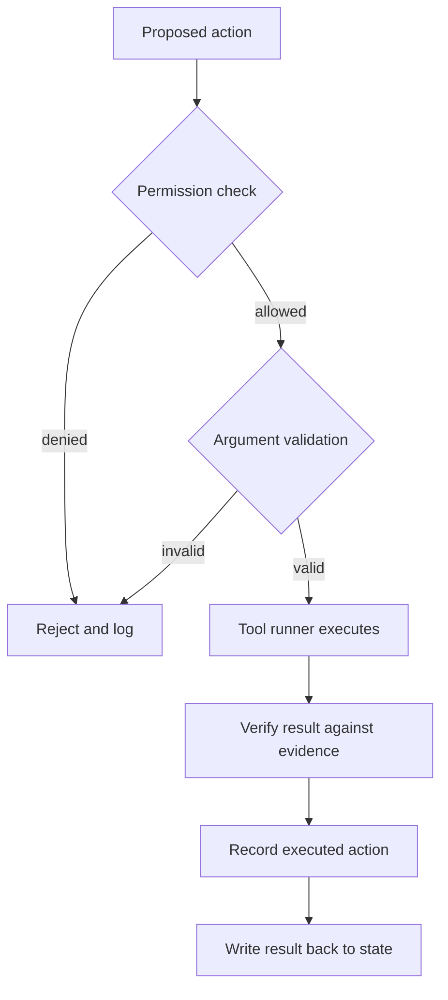

# Enforcing deterministic execution boundaries AI agents use

> Make code the only path to side effects: gate permissions, validate arguments, run tools, and verify and log real outcomes.

## At a Glance

| Field | Value |
|-------|-------|
| Difficulty | Intermediate |
| Time to Learn | 2-4 hours to gate one tool; ongoing as tools are added |
| Outcome | Every agent action passes a code-enforced permission and argument gate, runs through a tool runner, is verified against evidence, and is logged as executed. |
| Prerequisites | A working agent loop that calls at least one tool, A list of the tools the agent can invoke and what each one changes, Typed decision outputs from the model or decision layer, Familiarity with schema validation in your stack |
| Part of | [Jev Engineering](../../methods/jev-engineering/METHOD.md) |

## Overview

This skill covers the third part of the [Jev Engineering](https://tryhamster.com/methods/jev-engineering) split: the code that acts. A language model can draft, and a decision model can pick an option with a probability attached, but neither should be able to change the world directly. The boundary is the layer of ordinary application code that sits between a proposed action and its side effect.

The core rule comes from [Vercel's guidance on placing Jev in an agent loop](https://vercel.com/i/jev-agent-control): design the loop so the model interprets requests and proposes actions, while application code checks permissions and validates arguments before invoking a tool. A high-confidence decision does not override that policy. Confidence tells you how likely the choice is to be right; it says nothing about whether this user, in this context, is allowed to trigger this effect with these arguments.

The boundary has four jobs, drawn as one path below.

First, a permission gate decides whether the action is allowed at all. Second, argument validation checks that the inputs are well formed and within bounds. Third, a tool runner owned by your code performs the call, so retries, timeouts and side-effect rules live in one place. Fourth, verification checks what the tool actually did against evidence, and the outcome is written to the log and back into state.

Published builds show the shape. The [jevsor incident example](https://github.com/kleosr/jevsor/blob/main/README.md) states that its policy has no free-form agent chat loops or prompt-injected action scripts; the example supplies state and independently verifies the outcome in code. The [awesome-jev list](https://github.com/yibie/awesome-jev/blob/main/README.md) describes OpenWork wiring Jev into its eval testkit as a verification judge, so agent-produced work is gated by typed verdicts rather than by a text model.

You know the boundary is working when you can answer three questions from logs alone for any run: what was proposed, what actually executed, and what evidence confirmed the result. If any of those is missing, or if a tool can be reached without passing through the gate, the boundary is decorative.

## How It Works

The boundary works by treating every model output as a request, never as a command. Separating the parts means each check can be tested on its own and none of them depends on the model behaving well.

**Proposal.** The decision layer returns a typed choice, for example which tool to call, and a generating model may supply draft arguments. Nothing runs yet. The proposal is data that code will inspect.

**Permission gate.** Code decides whether the proposed action is allowed for the current actor, resource and context. This is where exact rules belong. The [Jev Engineering definition](https://madewithjev.com/what-is-jev-engineering) assigns code the job of carrying out decisions while enforcing exact rules, and [Vercel's agent-control guide](https://vercel.com/i/jev-agent-control) puts permission checks in application code before any tool is invoked. The gate reads the policy, not the model's confidence, so a probability near certainty on a forbidden action still produces a rejection.

**Argument validation.** Code parses the arguments against a schema: types, required fields, allowed values, ranges, and references that must exist. Invalid input is rejected, not repaired silently. A useful mental test is whether a malicious or confused proposal could pass; if a free-text field can smuggle a second instruction into the tool, the schema is too loose.

**Execution by a tool runner.** One component owned by your code performs the call. It applies timeouts, idempotency keys, rate limits and rules for irreversible effects. Centralising execution means there is exactly one place to audit and one place where side effects can happen.

**Verification against evidence.** After the call, check the result, not the plausibility of a response. The [calibrated-decisions gist](https://gist.github.com/pedramamini/014676fa8684d91bf7000f4623701ada) describes verification as checking a claim against its source with the outcomes supports, contradicts or says nothing, an extraction against the document, and a tool-call trace against its intent. Deterministic checks come first (did the record change, did the file exist afterwards, did the API return success); a typed verdict can then judge semantic questions such as whether the trace matches what was asked.

**Recording and write-back.** Log what actually executed, including failures, and update state before the next decision. The [Made with Jev threads](https://madewithjev.com/x-posts) frame the loop as State, Questions, Action, Verify, and the [agent decision-layer tutorial](https://jev-tutorial.org/guides/agent-decision-layer) recommends logging model version, question version, threshold, action and overrides. Pair the proposed action with the executed action in the same record so you can see where the gate intervened.

The failure signal for the whole design is simple: any path from model output to side effect that skips a layer. Search the codebase for direct tool invocations outside the runner and treat each one as a defect.

## Step-by-Step Guide

### Step 1: Inventory tools and their side effects

List every tool the agent can reach and write down what each one changes: records, files, messages, money, external systems. Mark each effect as read-only, reversible or irreversible. This inventory is the input to your permission policy, because the strictness of the gate should follow the cost of a wrong action. Tools you cannot classify are the ones most likely to bypass the boundary later.

> **Pro tip:** Start from the tool registry in code, not from documentation, so hidden or legacy tools show up.

### Step 2: Write the permission policy in code

For each tool, define who may call it, on which resources, and under what conditions, as ordinary code or a policy file evaluated by code. Keep the policy independent of the model's confidence score, since [Vercel's guidance](https://vercel.com/i/jev-agent-control) places permission checks in application code before invocation. Denials should return a structured reason that the agent loop can record and route. Irreversible actions usually need an extra condition, such as a human approval flag in state.

> **Pro tip:** Write a unit test per rule that feeds a maximally confident proposal for a forbidden action and asserts a rejection.

### Step 3: Validate arguments against a strict schema

Define a schema for each tool's inputs with types, required fields, enumerations and numeric bounds. Parse every proposal against it and reject anything that fails, recording which field broke. Check that referenced IDs exist and belong to the actor, because a well-typed ID can still point at the wrong customer. Avoid open free-text fields in tool arguments wherever an enumeration will do.

### Step 4: Route all execution through one tool runner

Build a single runner that is the only code allowed to invoke tools. It applies timeouts, retries with idempotency keys, and any rules for irreversible effects. The runner returns a structured result that includes success or failure and the raw evidence from the tool. Remove or wrap any direct tool calls elsewhere so the gate cannot be skipped.

> **Pro tip:** Add a lint rule or code search to CI that fails the build when a tool client is imported outside the runner.

### Step 5: Verify the result against evidence

After execution, check what actually happened rather than trusting the tool's or model's summary. Use deterministic checks first, such as reading back the changed record. For semantic questions, use a typed verdict in the pattern the [calibrated-decisions gist](https://gist.github.com/pedramamini/014676fa8684d91bf7000f4623701ada) describes, checking a tool-call trace against its intent with supports, contradicts or says nothing. A result that cannot be verified should be treated as a failure for routing purposes.

### Step 6: Record the executed action and update state

Write one record per action with the proposal, the gate decision, the executed call, its result, the verification outcome and any override. The [agent decision-layer tutorial](https://jev-tutorial.org/guides/agent-decision-layer) lists model version, question version, threshold, action and overrides as fields to log. Then update the agent's state with the real result, including failures, before the next decision runs. The next decision should never read a world that the last action has already changed.

> **Pro tip:** Store proposed and executed actions as separate fields so diffs between them are queryable.

### Step 7: Test the boundary with failure cases

Build a test set of proposals that should be stopped: forbidden actions, malformed arguments, references to missing resources, and tool errors. Include the fallback triggers the [tutorial](https://jev-tutorial.org/guides/agent-decision-layer) names, request failure and malformed output. Run these tests on every change to tools, policy or schemas. A boundary that has only been tested on happy paths has not been tested.

> **Pro tip:** Replay real rejected proposals from production logs into the test set as they appear.

## Best Practices

- Treat every model output as a proposal. Whether it comes from an LLM or a decision model, it is data for code to inspect, which keeps safety independent of model quality.
- Keep confidence out of the permission gate. [Vercel's guide](https://vercel.com/i/jev-agent-control) has code check permissions before invoking tools; confidence belongs in routing, while authority belongs in policy.
- Have a single execution path. One tool runner gives you one place to audit, rate-limit and log, and makes a bypass visible as a code smell rather than a hidden risk.
- Verify outcomes, not responses. Following the [calibrated-decisions gist](https://gist.github.com/pedramamini/014676fa8684d91bf7000f4623701ada), check traces against intent and claims against sources, because a plausible confirmation message proves nothing about the side effect.
- Keep the policy free of generated instructions. The [jevsor example](https://github.com/kleosr/jevsor/blob/main/README.md) excludes free-form chat loops and prompt-injected action scripts from its policy, which removes a whole class of injection paths.
- Gate agent-produced work with typed verdicts where semantic checks are needed. The [awesome-jev list](https://github.com/yibie/awesome-jev/blob/main/README.md) describes OpenWork doing this in its eval testkit, which gives a checkable pass or fail instead of prose.
- Write results back to state immediately. The State, Questions, Action, Verify loop in the [Made with Jev threads](https://madewithjev.com/x-posts) only works if the next decision reads the outcome of the last action.

## Common Mistakes

- **Letting the model's decision invoke a tool directly because it came back with high confidence.** — Route every call through the permission and validation gate regardless of confidence, as [Vercel's agent-control guide](https://vercel.com/i/jev-agent-control) describes. Confidence measures likely correctness, not authorisation.
- **Logging only the proposed action.** — Record the executed call, its failures, the verification evidence and any human override alongside the proposal. The [decision-layer tutorial](https://jev-tutorial.org/guides/agent-decision-layer) lists action and overrides as logged fields; without the executed record you cannot tell what the gate changed.
- **Checking that the tool returned a success message and calling it verified.** — Read back the effect or compare the tool-call trace to its intent, using the supports, contradicts or says nothing pattern from the [calibrated-decisions gist](https://gist.github.com/pedramamini/014676fa8684d91bf7000f4623701ada). Success codes can hide partial or wrong changes.
- **Leaving state unchanged after an action, especially a failed one.** — Write the real result back to state before the next decision, as the loop in the [Made with Jev threads](https://madewithjev.com/x-posts) requires. Stale state makes the next decision reason about a world that no longer exists.
- **Repairing invalid arguments silently so the call goes through.** — Reject and record invalid input, then let the loop decide whether to retry, fall back or escalate. Silent repair hides upstream defects and can turn a harmless error into a wrong side effect.

## References

- [Examples](references/examples.md) — Worked examples and scenarios
- [FAQ](references/faq.md) — Frequently asked questions
- [Parent Method](../../methods/jev-engineering/METHOD.md) — Jev Engineering

## Related Skills

- [Benchmarking and Observing Agent Loops](../benchmarking-and-observing-agent-loops/SKILL.md)
- [Formulating Atomic Decision Questions](../formulating-atomic-decision-questions/SKILL.md)
- [Separating Generation from Decision-Making](../separating-generation-from-decision-making/SKILL.md)
- [Designing Routing and Ranking Policies](../designing-routing-and-ranking-policies/SKILL.md)
- [Batching and Parallelizing Decisions](../batching-and-parallelizing-decisions/SKILL.md)
- [Calibrating Confidence Thresholds and Escalation Paths](../calibrating-confidence-thresholds-and-escalation-paths/SKILL.md)
- [Structuring Shared Agent State](../structuring-shared-agent-state/SKILL.md)

## Sources

- [What is Jev Engineering?](https://madewithjev.com/what-is-jev-engineering)
- [Jev Agent engineering: separate decisions from LLM generation](https://jev-tutorial.org/guides/agent-decision-layer)
- [jev: calibrated decisions for agents - Gist - GitHub](https://gist.github.com/pedramamini/014676fa8684d91bf7000f4623701ada)
- [Jev demos and threads on X: 239 posts with video](https://madewithjev.com/x-posts)
- [awesome-jev/README.md at main · yibie/awesome-jev](https://github.com/yibie/awesome-jev/blob/main/README.md)
- [Where does Jev fit in an AI agent loop? - Vercel](https://vercel.com/i/jev-agent-control)
- [README.md - kleosr/jevsor](https://github.com/kleosr/jevsor/blob/main/README.md)
