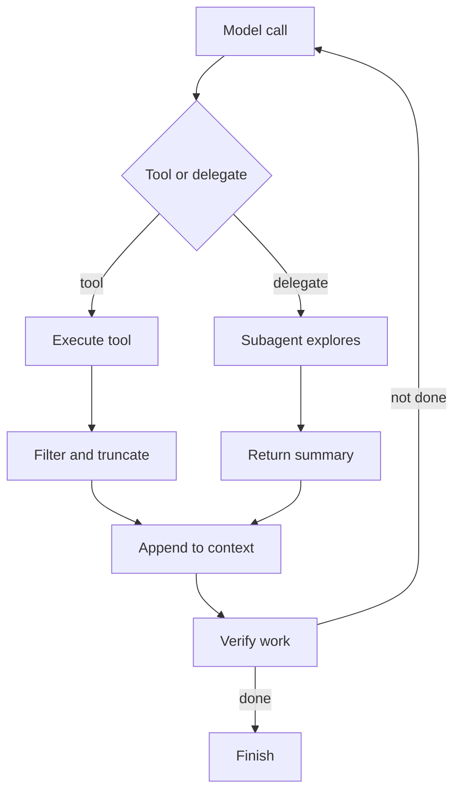

# Claude Skills SEO Guide to Tool Output Context Flows

> Control what tool results, command output and subagent findings flow back into a Claude agent's context so each loop stays focused.

## At a Glance

| Field | Value |
|-------|-------|
| Difficulty | Intermediate |
| Time to Learn | 2-3 hours to set up for one agent or repository, then minutes per review |
| Outcome | A documented tool set with per-tool filtering rules, delegation rules for subagents and a compact verification step, so tool output informs the agent without flooding its context. |
| Prerequisites | Working familiarity with an agent harness such as Claude Code or the Claude Agent SDK, Access to the tools the agent calls (shell, MCP servers, test runner), A task the agent runs repeatedly, so output patterns can be observed |
| Part of | [Claude Code Context Engineering: 6 Pillars Framework](../../methods/claude-code-context-engineering-6-pillars-framework/METHOD.md) |

## Overview

Every tool call an agent makes produces text, and in most harnesses that text lands in the conversation the model reads again on the next turn. Claude Code's documentation states that the context includes the conversation, every file Claude reads and every command output ([Claude Code best practices](https://code.claude.com/docs/en/best-practices)). A single unfiltered log or full-file read can therefore cost more context than the whole task description. This skill is about deciding, before a result lands, what shape it should take. For the framework this skill belongs to, see the [six pillars method page](https://tryhamster.com/methods/claude-code-context-engineering-6-pillars-framework).

Anthropic describes the loop Claude operates in as gather context, take action, verify work, repeat ([Building agents with the Claude Agent SDK](https://anthropic.com/engineering/building-agents-with-the-claude-agent-sdk?_bhlid=8a187456873bf69500724d5a5a72d17bad7aab3f)). Each phase generates its own output. Gathering produces search hits and file contents, acting produces diffs and command output, and verifying produces test results or screenshots. Engineering the flow means controlling volume and relevance in all three phases, not only the first.

The tools themselves are the pipes. An analysis of the Claude Code harness groups what the model can do into five categories of built-in tools, external MCP tools and subagent delegation ([Tencent Cloud harness analysis](https://developer.cloud.tencent.com/article/2689185)). Each pipe returns information differently. A shell command returns whatever the command prints. An MCP server returns whatever its author decided to return. A subagent does its exploration in a separate context and hands back only what it was asked to report, which makes delegation the strongest lever you have.

The reason to care is failure, not tidiness. Simon Willison collected common patterns of long-context failure, including context distraction, where a context grows so long the model over-focuses on it, and context poisoning, where an error enters the context and is referenced again and again ([Simon Willison on sub-agents](https://simonwillison.net/tags/sub-agents)). Noisy tool output feeds both: irrelevant lines crowd out the task, and a misleading result keeps getting cited. Diagnosing those failures after the fact is covered in [preventing context poisoning and clashes](https://tryhamster.com/skills/preventing-context-poisoning-and-clashes); this page is about stopping them at the tool boundary.

The output of this skill is concrete: a short list of tools the agent should use, a filtering rule for each one, a rule for when work goes to a subagent and what it must return, and a verification step that reports pass or fail compactly. You can tell it is working when transcripts show the agent reading targeted slices rather than whole files, compaction rarely fires mid-task, and the agent stops quoting output from ten turns ago.

## How It Works

The Claude Code harness runs a ReAct-style cycle: call the model, execute a tool, append the result, call the model again ([Tencent Cloud harness analysis](https://developer.cloud.tencent.com/article/2689185)). The append step is where this skill intervenes. Whatever gets appended stays until compaction or a reset removes it, so the question at every tool call is what the next model call actually needs.

A design-space paper on Claude Code places the agent loop and the compaction pipeline in a core layer, and puts the permission system, hooks, extensibility, tools, sandbox and subagents in a separate safety and action layer ([Dive into Claude Code](https://arxiv.org/html/2604.14228v2)). That split tells you where to shape output. You can shape it inside the tool, by writing commands and MCP tools that return less. You can shape it in the action layer, with hooks that post-process results. Or you can route it away entirely, to a subagent. Compaction in the core layer is the fallback when none of those happened.

Anthropic lists five harness extension points: CLAUDE.md files, hooks, skills, plugins and MCP servers, each serving a different function ([How Claude Code works in large codebases](https://claude.com/blog/how-claude-code-works-in-large-codebases-best-practices-and-where-to-start)). For tool output, hooks are the deterministic option, because they run the same way every time instead of relying on the model to remember an instruction. MCP servers are where you control the payload shape of external tools. Skills let you describe a procedure, including how to call a tool narrowly, that loads only when needed.

The loop with both paths looks like this:

Three levers do most of the work. The first is shrinking at the source. Claude Code relies on just-in-time search with glob and grep rather than a persistent index of the codebase ([Augment Code comparison](https://augmentcode.com/tools/google-antigravity-vs-claude-code)), so a well-scoped search pattern is the difference between ten relevant lines and a whole directory listing. The same applies to test runners, linters and API calls: ask for failures, counts and identifiers, not full dumps.

The second lever is redirecting. Anthropic recommends limiting broad investigations and delegating research to subagents ([Claude Code best practices](https://code.claude.com/docs/en/best-practices)). The subagent can read fifty files and throw most of them away; the parent sees only the findings.

The third lever is verifying compactly. The same guidance recommends checking generated work with tests, scripts or screenshots ([Claude Code best practices](https://code.claude.com/docs/en/best-practices)). Verification output needs the same discipline: a pass or fail line and the specific failing cases, not a thousand lines of green checkmarks. Truncation has a limit, though. When something breaks, Anthropic's guidance is to share the full error message, stack trace and the action that triggered it rather than a vague summary ([Scaling agentic coding](https://resources.anthropic.com/hubfs/Scaling%20agentic%20coding%20across%20your%20organization.pdf?hsLang=en)). Filter the noise around an error, never the error itself.

## Step-by-Step Guide

### Step 1: Inventory the tools and their output shapes

List every tool the agent can call: built-in file and shell tools, MCP servers, scripts and subagents. For each, run it once on a realistic input and look at what comes back, including length and structure. Note which tools return far more than the model uses, such as full-file reads, verbose build logs or API responses with nested metadata. This inventory is the input for every later decision.

> **Pro tip:** Pull a recent transcript and rank tool results by length. The top few are usually responsible for most of the context spent.

### Step 2: Choose between CLI, MCP and built-in tools

For each job the agent does, pick one tool rather than leaving several overlapping options. Prefer a CLI command when it already supports filtering flags, because the model can narrow output with arguments it knows. Prefer an MCP server when you need a structured external integration and can control what the server returns. Remove or disable tools that duplicate each other, since every available option is something the model may choose badly.

### Step 3: Set filtering and truncation rules

Write down, per tool, what a good result looks like: matching lines instead of files, failing tests instead of full runs, the fields you need instead of the whole record. Enforce the rule where it is most reliable, in the tool's own flags, an MCP server's response shape or a hook that post-processes output. Decide what happens to the overflow, for example writing full logs to a file the agent can read on request. Keep error messages and stack traces intact, because those are the part the model needs.

> **Pro tip:** A recommended default to adapt: cap command output at, for example, the last 100 lines, and write the full output to a file the agent can grep if needed.

### Step 4: Route broad research to subagents

Identify tasks that require reading widely to find a small answer: locating where a feature is implemented, surveying how an API is used across a repository, or comparing several libraries. Send those to a subagent with a clear question instead of letting the main agent explore. The subagent's reads stay in its own context. Keep narrow, known-location reads in the main agent, because delegation has overhead of its own.

> **Pro tip:** A useful test: if you cannot name the file the answer lives in, delegate the search.

### Step 5: Define the summary contract for subagents

Tell each subagent exactly what to return: the answer, the file paths and line references that support it, and anything it could not determine. Ask for a bounded format so the parent can act on it without rereading the sources. Require the subagent to flag uncertainty explicitly, since a confident but wrong summary becomes a poisoned fact in the parent's context. Review a few returned summaries to check they are specific enough to act on.

> **Pro tip:** Ask for paths and line numbers alongside every claim, so the parent can verify a single point cheaply instead of trusting the whole summary.

### Step 6: Build verification into the loop

Decide what closes each iteration: a test command, a type check, a script or a screenshot. Shape its output so the model sees pass or fail and the specific failures only. Make verification a required step in the task instructions rather than an optional one, so the loop does not end on a plausible but untested change. If verification fails, the failing detail should be the only new material appended before the next model call.

### Step 7: Audit a transcript and adjust

After a few real runs, read a full transcript from start to finish. Look for repeated reads of the same file, results the model never referred to again, and points where compaction fired. Each of those is a candidate for a tighter filter, a new delegation rule or a removed tool. Update the rules and repeat the audit after the next batch of runs.

## Best Practices

- Filter at the source before you filter in the context. A search pattern or a command flag that returns ten lines is cheaper and more reliable than returning a thousand and hoping compaction keeps the right ten later.
- Prefer deterministic shaping over instructions. A hook or a tool that always trims output does its job every time, while an instruction telling the model to read less competes with everything else in the prompt.
- Give each job exactly one tool. Overlapping tools make the model choose, and a poor choice often means the most verbose option. Fewer, sharper tools also make transcripts easier to audit.
- Delegate exploration, keep execution. Subagents are best at reading widely and returning a short answer; edits and final verification belong with the agent that holds the full task context.
- Never truncate the failure. Trim passing tests, progress bars and repeated warnings, but keep the full error message, stack trace and triggering action, which [Anthropic's guidance on scaling agentic coding](https://resources.anthropic.com/hubfs/Scaling%20agentic%20coding%20across%20your%20organization.pdf?hsLang=en) calls for instead of a vague summary.
- Treat MCP and web results as content you do not control. Anthropic's containment write-up lists the external content an agent can reach as one of the components to defend ([How we contain Claude](https://anthropic.com/engineering/how-we-contain-claude)), so validate or constrain what those tools return before it becomes a fact in context.

## Common Mistakes

- **Letting full command output into the session by default, such as complete build logs or test runs.** — Each output remains part of the conversation context, as the [Claude Code best practices](https://code.claude.com/docs/en/best-practices) note. Tail or grep the output, and write the full version to a file the agent can consult on request.
- **Reading whole files to find one function or setting.** — Search first with a scoped pattern, then read the matching region. Reserve full-file reads for files the agent is about to edit extensively.
- **Delegating to a subagent without specifying what it should return.** — An open-ended subagent tends to return a long narrative that recreates the context bloat you were avoiding. Define the answer format, required references and an explicit place for uncertainty.
- **Treating verification as optional or letting it produce verbose output.** — Make a test, script or screenshot the closing step of each loop, and shape its output to pass or fail plus failing cases. Otherwise the loop either ends untested or buries the one failure in noise.
- **Adding every available MCP server because it might be useful.** — Each server adds tools the model can choose and payloads you may not have shaped. Enable only the servers the current work needs, and check the response size of each before relying on it.

## References

- [Examples](references/examples.md) — Worked examples and scenarios
- [FAQ](references/faq.md) — Frequently asked questions
- [Parent Method](../../methods/claude-code-context-engineering-6-pillars-framework/METHOD.md) — Claude Code Context Engineering: 6 Pillars Framework

## Related Skills

- [Writing Effective System Prompts for Claude AI](../writing-system-prompts-for-claude/SKILL.md)
- [Structuring Retrieval-Augmented Context for Claude](../structuring-retrieval-augmented-context/SKILL.md)
- [Preventing Context Poisoning, Distraction, and Clashes](../preventing-context-poisoning-and-clashes/SKILL.md)
- [Managing Context Window Token Budgets in Claude](../managing-context-window-token-budgets/SKILL.md)
- [Layering Instruction Hierarchies in Claude Prompts](../layering-instruction-hierarchies-in-prompts/SKILL.md)
- [Designing Multi-Turn Conversation Context Strategies](../designing-multi-turn-conversation-context/SKILL.md)

## Sources

- [Pattern 3: The Local Vm](https://anthropic.com/engineering/how-we-contain-claude)
- [Simon Willison on sub-agents](https://simonwillison.net/tags/sub-agents)
- [Building agents with the Claude Agent SDK \\ Anthropic](https://anthropic.com/engineering/building-agents-with-the-claude-agent-sdk?_bhlid=8a187456873bf69500724d5a5a72d17bad7aab3f)
- [Scaling Agentic Coding Across Your Organization](https://resources.anthropic.com/hubfs/Scaling%20agentic%20coding%20across%20your%20organization.pdf?hsLang=en)
- [细节拉满：Claude Code 上下文压缩流水线与Prompt Cache 优化思路](https://developer.cloud.tencent.com/article/2689185)
- [Dive into Claude Code: The Design Space of Today's and Future AI](https://arxiv.org/html/2604.14228v2)
- [How Claude Code works in large codebases: Best practices and](https://claude.com/blog/how-claude-code-works-in-large-codebases-best-practices-and-where-to-start)
- [Best practices for Claude Code](https://code.claude.com/docs/en/best-practices)
- [Google Antigravity vs Claude Code: Agent-First](https://augmentcode.com/tools/google-antigravity-vs-claude-code)
