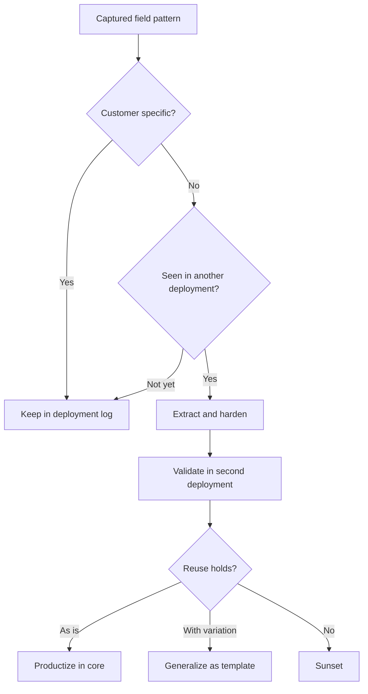

# Generalizing Customer Deployments into Product Capabilities

> Turn recurring integrations, mappings and workflows from customer deployments into reusable platform capabilities, not one-off custom work.

## At a Glance

| Field | Value |
|-------|-------|
| Difficulty | Advanced |
| Time to Learn | Ongoing during each deployment, with a short weekly capture and review session |
| Outcome | A steady flow of field-tested connectors, templates, APIs and playbooks into the core platform, so each new deployment starts from reusable parts instead of a blank repository. |
| Prerequisites | Hands-on work in at least one live customer deployment, Working knowledge of the core platform's architecture and extension points, A named platform or product lead who can accept roadmap input, Access to the deployment's code, configuration and integration history |
| Part of | [Forward Deployed Engineering \(FDE\)](../../methods/forward-deployed-engineering-fde/METHOD.md) |

## Overview

Every forward deployed engineer writes code that solves one customer's problem. This skill is the discipline of noticing which parts of that code, configuration and know-how would solve the next customer's problem too, and moving them into the platform. Practitioners describe the loop plainly: engineers embedded with customer teams learn their stack, pain points and implementation challenges, then [pass those learnings to core product teams for generalization](https://posthog.com/blog/forward-deployed-engineer). Palantir CTO Shyam Sankar's description of the role as one that ["absorbs pain and excretes product"](https://resolve.ai/blog/why-enterprise-ai-needs-forward-deployed-engineers) is the short version, and the same source frames the FDE's distinctive contribution as horizontalizing customer-specific domain and infrastructure knowledge back into the roadmap. For background on the model itself, see the [Forward Deployed Engineering method page](https://tryhamster.com/methods/forward-deployed-engineering-fde).

The raw material is whatever the deployment forced you to build: connectors to legacy systems, data mappings, evaluation setups, workflow adaptations and workarounds for deployment blockers. The outputs are reusable components, connectors, templates, APIs and implementation playbooks, which one [enterprise FDE playbook](https://blockchain-council.org/ai/forward-deployed-engineering-playbook-best-practices-shipping-fast-enterprise) names as the target of continuous conversion. A job description for an insurance and manufacturing FDE role adds configuration templates and integration patterns, and expects the engineer to [turn deployment feedback into product improvements, platform requirements and roadmap input](https://careers-inc.nttdata.com/job/Plano-Forward-Deployed-Engineer-(FDE)-Insurance-TX/1428689300).

Without this skill, an FDE team drifts into being an expensive services arm. One critique of the model argues that customer requirements should [improve the underlying platform rather than remain isolated within a single deployment](https://legionintel.com/command-papers/forward-deployed-engineering), and tells buyers to ask whether future customers benefit from work performed today. A practitioner summary of Palantir-style teams lists refusing the [systems-integrator role](https://getperspective.ai/blog/palantir-forward-deployed-engineering-playbook-anthropic-openai-copying) among the recurring lessons, alongside routing product feedback through the FDE.

The skill sits between the field and the platform team. The FDE does the capture and first-pass classification while the work is fresh, and a platform lead decides what earns roadmap space. It runs continuously during a deployment rather than as a retrospective at the end, because the details that make a pattern reusable, such as which fields varied or which step broke, fade quickly. You know it is working when the next deployment for a similar customer starts from a template, and when platform releases trace back to named field problems rather than to guesses about what customers need.

## How It Works

The mechanism is a funnel with three gates: capture, classification and proof of reuse. Most field work never leaves the first gate, and that is by design.

**Capture.** The enterprise playbook recommends [capturing patterns weekly](https://blockchain-council.org/ai/forward-deployed-engineering-playbook-best-practices-shipping-fast-enterprise): common integrations, data mappings and evaluation setups. A weekly rhythm is short enough that the engineer still remembers why a mapping was shaped a certain way, and long enough to notice repetition inside the deployment itself. Each entry records the problem, what was built, which parts are hard-coded to this customer and which assumptions would change elsewhere.

**Classification.** Every entry is sorted into customer-specific work or a candidate for broader reuse. The [same playbook](https://blockchain-council.org/ai/forward-deployed-engineering-playbook-best-practices-shipping-fast-enterprise) pairs pattern capture with separating customer-specific requirements from improvements likely to benefit a wider segment, and tells engineers to challenge each customization request for reuse potential. The working test: would another customer in the same segment need this with only parameters changed? A mapping of one customer's proprietary field names is specific. The shape of that mapping, source schema to canonical model with a validation step, is often reusable.

**Proof of reuse.** A candidate does not become platform work because it looks general. The playbook's threshold is to productize a pattern when it [appears in two or more deployments](https://blockchain-council.org/ai/forward-deployed-engineering-playbook-best-practices-shipping-fast-enterprise), and to validate reuse in a second workflow or second customer before deciding whether to productize, generalize or sunset. Once a pattern passes, the team standardizes the integration, hardens security, observability and reliability, and writes onboarding runbooks and implementation playbooks, per the [same guide](https://blockchain-council.org/ai/forward-deployed-engineering-playbook-best-practices-shipping-fast-enterprise).

The three outcomes mean different things. Productize means the capability ships in the core platform with the same support expectations as any other feature. Generalize means it becomes a parameterized template or connector that field teams configure per customer. Sunset means the pattern did not hold, so it stays in the original deployment and leaves the shared backlog, which keeps the platform from filling with near-duplicates nobody maintains.

Choosing the output type matters as much as the decision. The types below come from the lists in the [FDE playbook](https://blockchain-council.org/ai/forward-deployed-engineering-playbook-best-practices-shipping-fast-enterprise) and the [NTT DATA FDE role description](https://careers-inc.nttdata.com/job/Plano-Forward-Deployed-Engineer-(FDE)-Insurance-TX/1428689300); the guidance on when each applies is a recommendation.

| Output type | Use it when |
|---|---|
| Connector | Several customers run the same source system |
| Configuration template | Workflows match but parameters differ |
| API | Customers need the capability inside their own tools |
| Implementation playbook | The hard part is sequence and judgment, not code |
| Integration pattern | Systems differ but the mapping shape repeats |
| Reusable component | Logic is identical across deployments |

The last link is the roadmap. The NTT DATA role expects field engineers to [translate deployment feedback into product-improvement opportunities, platform requirements and roadmap changes](https://careers-inc.nttdata.com/job/Plano-Forward-Deployed-Engineer-(FDE)-Insurance-TX/1428689300). That handoff is what stops the loop from ending in the field team's private backlog.

## Step-by-Step Guide

### Step 1: Open a pattern log for the deployment

On day one of a deployment, create a shared log that both the field team and the platform lead can read. Give each entry fixed fields: the operational problem, what was built, which parts are hard-coded to this customer, and which assumptions would change for another customer. A fixed shape matters because free-form notes cannot be compared across deployments later. Link each entry to the actual code, configuration or document so a platform engineer can inspect it without asking.

> **Pro tip:** Keep the log outside the customer's systems, so it survives the end of the engagement and does not expose customer data.

### Step 2: Capture patterns every week

Set a recurring session to add that week's integrations, data mappings, evaluation setups and workarounds to the log, following the weekly cadence in the [enterprise FDE playbook](https://blockchain-council.org/ai/forward-deployed-engineering-playbook-best-practices-shipping-fast-enterprise). Include blockers you solved, not only things you shipped, because a repeated blocker is often the strongest platform signal. Write down what varied during the week, since variation tells you where parameters belong. If a week produces no entries, note that too; it usually means the team is heads-down on bespoke work and the classification step is being skipped.

> **Pro tip:** Time-box the session, for example to 30 minutes, so it actually happens during busy deployment weeks.

### Step 3: Classify each entry as specific or reusable

For every entry, decide whether it is customer-specific or a candidate for a wider segment, the separation the [playbook](https://blockchain-council.org/ai/forward-deployed-engineering-playbook-best-practices-shipping-fast-enterprise) treats as core practice. Ask whether another customer in the same segment would need it with only parameters changed. Split mixed entries: the customer's field names are specific, while the mapping structure and validation logic may be reusable. Record your reasoning in one line so the platform lead can challenge it.

> **Pro tip:** When unsure, label the entry as a candidate. Classification is cheap to reverse; forgetting a pattern is not.

### Step 4: Wait for the pattern to recur

Do not start platform work from a single deployment. Hold candidates in the log until the pattern [appears in two or more deployments](https://blockchain-council.org/ai/forward-deployed-engineering-playbook-best-practices-shipping-fast-enterprise), the productization threshold the playbook recommends. Search other teams' logs for matching entries before concluding a pattern is new. One occurrence tells you a customer needed something; a second tells you the need may be structural.

### Step 5: Extract and harden the capability

Once a pattern recurs, pull it out of the customer codebases into a standalone component, connector, template, API or playbook. Standardize the integration and harden security, observability and reliability before anyone else relies on it, as the [same guide](https://blockchain-council.org/ai/forward-deployed-engineering-playbook-best-practices-shipping-fast-enterprise) advises. Remove every customer-specific constant and expose it as configuration. Write the onboarding runbook alongside the code, because a capability that only its author can install is not reusable yet.

> **Pro tip:** Have an engineer who never saw either deployment try to install it from the runbook alone.

### Step 6: Validate reuse in a second workflow or customer

Deploy the extracted capability into a second workflow or second customer and watch what breaks. The playbook places this validation step [before the decision to productize, generalize or sunset](https://blockchain-council.org/ai/forward-deployed-engineering-playbook-best-practices-shipping-fast-enterprise). Track how much customer-specific code was still needed around it. If the field team had to fork or patch the capability heavily, the abstraction is wrong and needs another pass.

> **Pro tip:** Log every patch applied during validation; the patch list is your evidence for the decision in the next step.

### Step 7: Decide the outcome and route it to the roadmap

Choose one of three outcomes: productize into the core platform, generalize as a configurable template or connector, or sunset and leave it in the original deployments. Turn the decision into concrete product input, the translation of deployment feedback into [product-improvement opportunities, platform requirements and roadmap changes](https://careers-inc.nttdata.com/job/Plano-Forward-Deployed-Engineer-(FDE)-Insurance-TX/1428689300) that FDE role descriptions expect. Attach the log entries and validation notes so the product team sees the field evidence. Close the loop by telling field teams what shipped, so they stop rebuilding it.

> **Pro tip:** Sunsetting is a valid result. Record why, so the next team does not re-propose the same pattern without new evidence.

## Best Practices

- Capture during the deployment, not after it. Details such as which fields varied and which step failed are what make a pattern reusable, and they are gone by the retrospective.
- Classify at the finest useful grain. A single deliverable often mixes customer constants with reusable structure, and splitting them is where most platform value hides.
- Hold to the recurrence threshold before building platform features. Generalizing from one customer produces abstractions shaped around that customer's quirks, which the next customer then has to work around.
- Give a platform lead explicit ownership of accepting field input. The [NTT DATA role description](https://careers-inc.nttdata.com/job/Plano-Forward-Deployed-Engineer-(FDE)-Insurance-TX/1428689300) expects FDEs to feed roadmap changes, which only works if someone on the product side is accountable for receiving them.
- Harden before you share. A reusable connector without observability or security review spreads one deployment's risk into every deployment that adopts it.
- Treat the field engineer as the feedback channel, not a ticket source. Practitioner lessons from Palantir-style teams include [routing product feedback through the FDE](https://getperspective.ai/blog/palantir-forward-deployed-engineering-playbook-anthropic-openai-copying), because the person who built the workaround understands the underlying need best.

## Common Mistakes

- **Letting customer requirements stay inside one deployment. The work solves the customer's problem and then sits in their repository forever.** — Treat every requirement as a possible platform input, the standard one critique sets when it says requirements should [improve the underlying platform](https://legionintel.com/command-papers/forward-deployed-engineering). Log it, classify it, and revisit it when the next similar deployment starts.
- **Falling into the systems-integrator trap, where the FDE team builds custom projects that never feed back into the core product.** — Make refusing the [systems-integrator role](https://getperspective.ai/blog/palantir-forward-deployed-engineering-playbook-anthropic-openai-copying) explicit in how the team is measured. Track how many platform capabilities trace back to field work, not only how many deployments went live.
- **Productizing after a single deployment because the solution looks elegant and general.** — Wait for the pattern to recur in another deployment and validate it there first. Elegance in one context is not evidence of reuse.
- **Shipping extracted code without hardening or runbooks, so only its author can install or debug it.** — Standardize, harden security, observability and reliability, and write the onboarding runbook before calling it reusable, as the [enterprise playbook](https://blockchain-council.org/ai/forward-deployed-engineering-playbook-best-practices-shipping-fast-enterprise) recommends.
- **Never sunsetting anything, so the shared backlog fills with half-generalized candidates nobody maintains.** — Force a decision after validation: productize, generalize or sunset. Removing candidates that failed reuse keeps the platform team focused on patterns with real evidence.

## References

- [Examples](references/examples.md) — Worked examples and scenarios
- [FAQ](references/faq.md) — Frequently asked questions
- [Parent Method](../../methods/forward-deployed-engineering-fde/METHOD.md) — Forward Deployed Engineering \(FDE\)

## Related Skills

- [Prototyping Solution Workflows with Users](../prototyping-solution-workflows-with-users/SKILL.md)
- [Integrating Heterogeneous Data Sources](../integrating-heterogeneous-data-sources/SKILL.md)
- [Facilitating Technical Customer Collaboration](../facilitating-technical-customer-collaboration/SKILL.md)
- [Conducting Domain Discovery with Customers](../conducting-domain-discovery-with-customers/SKILL.md)
- [Owning Outcome-Oriented Delivery End to End](../owning-outcome-oriented-delivery-end-to-end/SKILL.md)
- [Translating Operational Problems into Technical Requirements](../translating-operational-problems-into-technical-requirements/SKILL.md)
- [Deploying and Operating Production Systems On-Site](../deploying-and-operating-production-systems-on-site/SKILL.md)

## Sources

- [Why enterprise AI needs Forward Deployed Engineers - Resolve.ai](https://resolve.ai/blog/why-enterprise-ai-needs-forward-deployed-engineers)
- [The Forward Deployed Engineering Model Is Backward](https://legionintel.com/command-papers/forward-deployed-engineering)
- [WTF is a forward deployed engineer? \(and why everyone](https://posthog.com/blog/forward-deployed-engineer)
- [Forward Deployed Engineering Playbook for Enterprise](https://blockchain-council.org/ai/forward-deployed-engineering-playbook-best-practices-shipping-fast-enterprise)
- [Palantir's Forward-Deployed Engineering Playbook - Perspective AI](https://getperspective.ai/blog/palantir-forward-deployed-engineering-playbook-anthropic-openai-copying)
