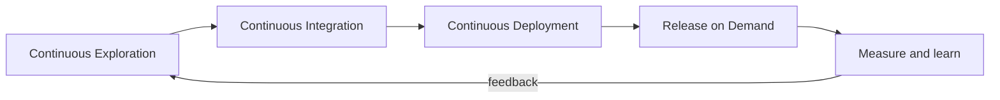

# How to Build a SAFe Continuous Delivery Pipeline

> Build and run the four-stage SAFe pipeline that moves small batches from customer insight to on-demand release, with feedback closing the loop.

## At a Glance

| Field | Value |
|-------|-------|
| Difficulty | Intermediate |
| Time to Learn | Several Program Increments to establish, then continuous refinement |
| Outcome | A connected pipeline in which validated features reach production continuously, customers receive them when the business chooses, and release results feed the next round of exploration. |
| Prerequisites | A working Agile Release Train with an ART backlog, Basic automated build and test capability, A staging environment that resembles production, Access to production monitoring and release controls such as feature toggles |
| Part of | [Scaled Agile Framework](../../methods/scaled-agile-framework/METHOD.md) |

## Overview

The [Continuous Delivery Pipeline](https://scaledagileframework.com/ja/continuous-delivery-pipeline) is the set of workflows, activities and automation that guides new functionality from ideation to an on-demand release of value. This page covers how an Agile Release Train and its DevOps leads actually build one; for background on the framework itself, see the [Scaled Agile Framework method page](https://tryhamster.com/methods/scaled-agile-framework). The skill is less about installing a build server than about connecting activities that many organizations run in separate departments, with separate queues and handoffs between them.

SAFe divides the pipeline into [four aspects: Continuous Exploration, Continuous Integration, Continuous Deployment and Release on Demand](https://scaledagileframework.com/release-on-demand). Exploration decides what to build by [continually exploring market and customer needs and defining a vision, roadmap and set of features](https://scaledagileframework.com/continuous-exploration). Integration is where [new functionality is developed, tested, integrated and validated in preparation for deployment and release](https://scaledagileframework.com/continuous-integration). Deployment [automates the migration of new functionality from a staging environment to production](https://scaledagileframework.com/continuous-deployment). Release on Demand [releases new functionality immediately or incrementally based on business and customer needs](https://scaledagileframework.com/release-on-demand).

The design choice that makes the pipeline useful is the split between deploying and releasing. Production can stay current with validated work while the business chooses timing, which lets it [release when market timing is optimal and manage the risk of each release](https://scaledagileframework.com/planning-interval). The first three stages together [support the deployment of small batches of new functionality](https://v5.scaledagileframework.com/agile-release-train), and small batches are what make frequent, low-risk releases practical.

What you produce by practicing this skill: a map of the pipeline with named inputs and outputs for each stage, explicit validation criteria for staging, automated promotion into production, release controls that allow incremental exposure, and measurements that return to exploration. SAFe treats [built-in quality as the enabler](https://scaledagileframework.com/built-in-quality) that lets the pipeline release value whenever customers need it.

You can tell the pipeline is not working when features wait in staging for weeks, when every deployment is also a customer-facing release, when exploration happens once a year in a planning offsite, or when nobody can say whether the last release confirmed its hypothesis. Each of these symptoms points to a broken connection between two stages rather than a failure inside one, which is why the work described below focuses on the handoffs.

## How It Works

The pipeline is a loop, not a line. Each stage consumes the previous stage's output, and the last stage produces learning that re-enters the first. An ART [builds and maintains its pipeline so it can define, build, validate and release functionality that meets its PI objectives](https://scaledagileframework.com/planning-interval), so the loop runs continuously inside the Program Increment cadence rather than once per increment.

The table below lists what enters and leaves each stage. Use it as the contract between the people who own adjacent stages: if an output does not meet the stated shape, the next stage should refuse it rather than absorb the rework.

| Stage | Main inputs | Main outputs |
|---|---|---|
| Continuous Exploration | Market and customer needs, value hypotheses ([CE guidance](https://scaledagileframework.com/continuous-exploration)) | Aligned vision, roadmap and features ([CE guidance](https://scaledagileframework.com/continuous-exploration)) |
| Continuous Integration | Backlog features and refined hypotheses ([ART guidance](https://v5.scaledagileframework.com/agile-release-train)) | Validated features in staging ([CD guidance](https://scaledagileframework.com/continuous-deployment)) |
| Continuous Deployment | Functionality validated in staging ([CD guidance](https://scaledagileframework.com/continuous-deployment)) | Functionality in production, ready for release ([CD guidance](https://scaledagileframework.com/continuous-deployment)) |
| Release on Demand | Deployed functionality plus market timing ([ART guidance](https://v5.scaledagileframework.com/agile-release-train)) | Customer value, hypothesis results, learning ([ART guidance](https://v5.scaledagileframework.com/agile-release-train)) |

In Continuous Exploration, teams [apply design thinking in the problem space, conduct user research and collect feedback to refine features](https://scaledagileframework.com/planning-interval). The handoff is a set of candidate features, each carrying a hypothesis about the value it should create, ready to enter the ART backlog. A feature without a hypothesis cannot be measured at release, so the loop breaks before it starts.

Continuous Integration takes those features and integrates and validates them continuously instead of waiting for the end of a long cycle, as the [CI guidance](https://scaledagileframework.com/continuous-integration) describes. The bar is validated functionality in staging, meaning it works as a system with the rest of the solution, not merely code that compiled or passed one developer's unit tests.

Continuous Deployment moves that validated functionality into production automatically. Once there, practitioners [verify and monitor it to ensure it is working correctly](https://scaledagileframework.com/planning-interval), even though customers may not see it yet. This is where operations and development share accountability.

Release on Demand is a business decision supported by technical controls. The functionality can be exposed [all at once or incrementally](https://scaledagileframework.com/release-on-demand), and the outputs include [measurements of the underlying hypotheses and operational learning](https://v5.scaledagileframework.com/agile-release-train). Those measurements are what flow back to exploration.

Batch size governs the speed of the whole loop. Because the first three stages exist to move [small batches](https://scaledagileframework.com/ja/continuous-delivery-pipeline), large features that sit in integration for a full increment stall deployment, delay release and starve exploration of feedback.

## Step-by-Step Guide

### Step 1: Map the current flow

Before changing anything, trace how a recent feature actually moved from idea to customers. Record where exploration, integration, deployment and release decisions happened, who owned each, and how long work waited between them. Compare what you find with the four stages in the [SAFe pipeline definition](https://scaledagileframework.com/ja/continuous-delivery-pipeline). The output is a one-page map with the longest waits marked, which tells you where to invest first.

> **Pro tip:** Pick two or three features that shipped in the last quarter and use real timestamps from your tracker and deploy logs, not people's memory of the process.

### Step 2: Establish a continuous exploration rhythm

Set up recurring research and feedback activities rather than a single requirements phase, since exploration is meant to [continually explore market and customer needs](https://scaledagileframework.com/continuous-exploration). Product management runs design-thinking sessions, user interviews and feedback reviews on a steady cadence. Every candidate feature leaves this stage with a stated hypothesis and a measure that would confirm or refute it. Only features written this way enter the ART backlog.

> **Pro tip:** Add a mandatory hypothesis field to your feature template, for example "We believe X will cause Y, measured by Z", and reject backlog items that leave it blank.

### Step 3: Define what validated in staging means

Write down the checks a feature must pass before it counts as integrated, covering system-level tests across teams, not just component tests. The [CI guidance](https://scaledagileframework.com/continuous-integration) treats development, testing, integration and validation as one stage, so the definition belongs to the whole ART. Automate as much of it as you can and run it on every merge. Publish the definition so every team applies the same bar.

> **Pro tip:** If a feature can pass your staging checks without anyone running it alongside the other teams' changes, your definition is too narrow.

### Step 4: Automate promotion to production

Build the automation that takes validated functionality from staging to production without manual packaging or ticket queues, as [Continuous Deployment](https://scaledagileframework.com/continuous-deployment) describes. Pair it with production verification and monitoring so the team knows within minutes whether the deployment behaves correctly. Keep deployments dark by default, meaning customers do not see new behavior yet. Track how often deployments need rollback to judge whether validation upstream is strong enough.

### Step 5: Separate release from deployment

Introduce release controls such as feature toggles, audience targeting or staged rollouts so exposing functionality becomes a deliberate choice. [Release on Demand](https://scaledagileframework.com/release-on-demand) supports immediate or incremental release based on business and customer needs. Agree who makes release decisions and what information they need, such as market timing and risk. Document the decision for each release so you can later connect it to results.

> **Pro tip:** Start with incremental release for anything customer-facing and risky, for example exposing it to an internal group first, then a small customer segment, then everyone.

### Step 6: Shrink the batch size

Review features entering integration and split any that cannot flow through staging and into production within a short window. The first three stages exist to support [the deployment of small batches](https://v5.scaledagileframework.com/agile-release-train), and oversized work blocks every stage behind it. Watch the age of items in staging as your leading indicator. When items routinely age past your target, splitting upstream is usually the fix.

### Step 7: Close the loop with measurement

After each release, compare actual results with the hypothesis written during exploration. Release on Demand is meant to produce [measurements of hypothesis results and operational learning](https://v5.scaledagileframework.com/agile-release-train), so treat a release without measurement as incomplete. Bring the findings to the next exploration session and let them reshape the roadmap. Over time, this is what turns the pipeline from a delivery conveyor into a learning system.

> **Pro tip:** Schedule a short hypothesis review a fixed interval after each significant release, for example two weeks, so measurement does not depend on someone remembering.

## Best Practices

- Treat each stage boundary as a contract with defined inputs and outputs. When the output of one stage is vague, the next stage absorbs rework invisibly and the pipeline looks slower in the wrong place.
- Attach a measurable hypothesis to every feature at exploration time. Release on Demand is meant to [measure the results of underlying hypotheses](https://v5.scaledagileframework.com/agile-release-train), and that is impossible if nobody wrote one down.
- Keep exploration continuous rather than front-loaded. SAFe describes it as [continually exploring market and customer needs](https://scaledagileframework.com/continuous-exploration), so a yearly requirements phase recreates the waterfall handoff the pipeline is meant to remove.
- Set the staging bar at system-level validation. Continuous Integration exists to [develop, test, integrate and validate](https://scaledagileframework.com/continuous-integration) functionality, and a narrow unit-test gate lets integration defects surface in production instead.
- Deploy dark and release deliberately. Keeping production current while choosing exposure lets the business [release when market timing is optimal and manage risk](https://scaledagileframework.com/planning-interval).
- Monitor production before customers see anything. Verifying deployed functionality early catches defects while the exposure is still zero, which is far cheaper than a public rollback.
- Measure queue age between stages, not just throughput. Work waiting in staging or behind a release decision reveals batch-size and ownership problems that raw deployment counts hide.

## Common Mistakes

- **Building large batches and pushing them through the pipeline once per increment.** — Split work so the first three stages can move [small batches of new functionality](https://scaledagileframework.com/ja/continuous-delivery-pipeline). Smaller items integrate with fewer conflicts and give faster feedback.
- **Treating deployment and release as the same event.** — SAFe defines [deployment as moving functionality to production](https://scaledagileframework.com/continuous-deployment) and [release as making it available to customers](https://scaledagileframework.com/release-on-demand). Use release controls so the two can happen at different times.
- **Running Continuous Exploration as a fixed upfront planning exercise.** — Keep research and feedback on a recurring cadence and revise the vision, roadmap and features as evidence arrives. A frozen roadmap ignores what releases teach you.
- **Letting feedback stop once development is done.** — Connect validation, production monitoring, release and measurement back to exploration. If nobody reviews release results, the pipeline delivers output without learning whether it created value.
- **Counting code that compiles or passes one developer's tests as integrated.** — Require validated functionality in staging, tested together with the rest of the solution. The narrow definition simply relocates integration failures to production.

## References

- [Examples](references/examples.md) — Worked examples and scenarios
- [FAQ](references/faq.md) — Frequently asked questions
- [Parent Method](../../methods/scaled-agile-framework/METHOD.md) — Scaled Agile Framework

## Related Skills

- [Managing a Lean Portfolio in SAFe](../managing-lean-portfolio-with-safe/SKILL.md)
- [Splitting Features into User Stories and Enablers](../splitting-features-into-stories/SKILL.md)
- [Launching and Running Agile Release Trains](../launching-agile-release-trains/SKILL.md)
- [Running Inspect and Adapt Workshops](../running-inspect-and-adapt-workshops/SKILL.md)
- [Coordinating Multiple ARTs with Solution Trains](../coordinating-multiple-agile-release-trains/SKILL.md)
- [Prioritizing Work Using WSJF](../prioritizing-with-wsjf/SKILL.md)
- [Planning Program Increments \(PI Planning\)](../planning-program-increments/SKILL.md)

## Sources

- [Extended Guidance - Continuous Integration](https://scaledagileframework.com/continuous-integration)
- [Release on Demand - Scaled Agile Framework](https://scaledagileframework.com/release-on-demand)
- [Continuous Deployment - Scaled Agile Framework](https://scaledagileframework.com/continuous-deployment)
- [Continuous Exploration - Scaled Agile Framework](https://scaledagileframework.com/continuous-exploration)
- [継続的デリバリーパイプライン - Scaled Agile Framework](https://scaledagileframework.com/ja/continuous-delivery-pipeline)
- [Built-In Quality - Scaled Agile Framework](https://scaledagileframework.com/built-in-quality)
- [Planning Interval \(PI\) - Scaled Agile Framework](https://scaledagileframework.com/planning-interval)
- [Agile Release Train - Scaled Agile Framework](https://v5.scaledagileframework.com/agile-release-train)
