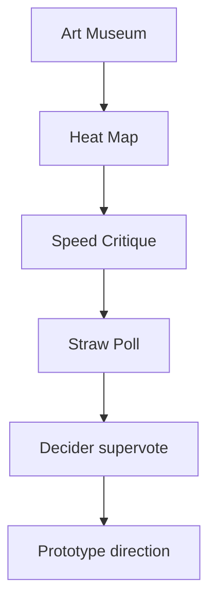

# Design Sprint Decision Making Without Debate Stalls

> Move a sprint team from a wall of sketches to one prototype direction using silent voting, timed critique and a Decider's binding supervote.

## At a Glance

| Field | Value |
|-------|-------|
| Difficulty | Intermediate |
| Time to Learn | About half a day for a typical sprint team |
| Outcome | One chosen solution, or a compatible combination of solution elements, ready to be turned into a prototype and tested with customers. |
| Prerequisites | A wall of independently produced solution sketches, A named Decider with authority over the prototype direction, A facilitator willing to enforce silence and timeboxes, Dot stickers, large supervote stickers and a place to record critique notes |
| Part of | [GV Design Sprint](../../methods/gv-design-sprint/METHOD.md) |

## Overview

Design sprint decision making is the skill of turning a wall of competing solution sketches into one direction the team will prototype. It sits inside a five-day process that GV describes as answering critical business questions through design, prototyping and customer testing ([GV's sprint overview](https://gv.com/sprint)). For the history and full structure of the method, see the [GV Design Sprint method page](https://tryhamster.com/methods/gv-design-sprint). This page covers only the decision sequence and how to run it well.

The input is specific. You start with a set of independently produced solution sketches, not a single concept that emerged from group discussion ([Zapier's walkthrough of the GV sprint](https://zapier.com/blog/google-ventures-design-sprint)). If the team arrives with one consensus sketch, there is nothing to choose between, and the sequence below collapses into a rubber stamp. The upstream skill, [sketching competing solutions individually](https://tryhamster.com/skills/sketching-competing-solutions-individually), exists to produce that wall.

The output is equally specific: the solution, or a combination of compatible elements from several solutions, that will be turned into a prototype and tested with customers ([Geyfman's GV Design Sprint dossier](https://geyfman.org/dossiers/gv-design-sprint-deep-research-report)). Not a shortlist, not a set of themes to revisit later. One direction that the people building the prototype can act on immediately.

What makes the sequence work under time pressure is that it separates three things groups usually blend together: noticing what is interesting, discussing it, and committing to it. Silent dot voting surfaces interest without debate. A timeboxed critique discusses each sketch against that visible interest. A nonbinding poll shows where people lean. Then a single designated Decider makes the call, so the team never has to reach consensus to move forward ([Geyfman's dossier](https://geyfman.org/dossiers/gv-design-sprint-deep-research-report)).

Each role needs something different from this skill. Facilitators run the sequence and enforce its silence and timeboxes. Deciders need to understand what each signal means so they can weigh the room without being captured by it. Participants need to know that their dots and poll votes are inputs, not verdicts, which keeps them honest rather than tactical.

You can tell the skill went wrong when the session ends with a compromise nobody would have sketched, when the loudest person's idea wins by default, or when the team leaves without a clear prototype brief. Each of those failures traces back to a skipped or blurred step in the sequence, which is why the steps below are worth running in order even when the answer feels obvious.

## How It Works

The sequence has five moves, each with a narrow job, ending in a single prototype direction.

**Art Museum.** Post every solution sketch on the wall so participants can inspect the alternatives side by side ([Zapier's GV sprint guide](https://zapier.com/blog/google-ventures-design-sprint)). The point is simultaneous visibility: nobody pitches and nobody presents in sequence, so early sketches do not anchor the later ones.

**Heat Map.** Participants read silently and place small dots beside the specific parts of sketches they find promising, which makes shared interest visible without starting a debate ([Zapier's GV sprint guide](https://zapier.com/blog/google-ventures-design-sprint)). The vote is on parts of concepts rather than whole sketches ([Geyfman's dossier](https://geyfman.org/dossiers/gv-design-sprint-deep-research-report)), so a weak sketch with one excellent screen still gets credit for that screen.

**Speed Critique.** The facilitator walks through each sketch, naming highlights and objections while recording the important points, and a commonly described timebox is three minutes per sketch ([Geyfman's dossier](https://geyfman.org/dossiers/gv-design-sprint-deep-research-report)). Discussion is steered toward the clusters of dots ([Zapier's GV sprint guide](https://zapier.com/blog/google-ventures-design-sprint)), and at the end the sketch's author is asked whether anything important was missed ([Geyfman's dossier](https://geyfman.org/dossiers/gv-design-sprint-deep-research-report)). The recorded notes become decision input for the Decider.

**Straw Poll.** Each participant silently picks one preferred solution ([Geyfman's dossier](https://geyfman.org/dossiers/gv-design-sprint-deep-research-report)) and should be able to explain why ([Zapier's GV sprint guide](https://zapier.com/blog/google-ventures-design-sprint)). The poll is a nonbinding signal of where the group leans and does not itself determine what gets prototyped ([Geyfman's dossier](https://geyfman.org/dossiers/gv-design-sprint-deep-research-report)).

**Decider supervote.** In the classic GV-style description, the Decider receives three large votes to place on one solution or distribute across several ([Zapier's GV sprint guide](https://zapier.com/blog/google-ventures-design-sprint)). Unlike the Straw Poll, this supervote settles which direction the team actually pursues.

The three voting moments look similar but do different jobs:

| Vote | Who votes | What is voted on | Binding | Source |
|---|---|---|---|---|
| Heat Map dots | All participants | Parts of sketches | No | [Geyfman](https://geyfman.org/dossiers/gv-design-sprint-deep-research-report) |
| Straw Poll | Each participant | One whole solution | No | [Geyfman](https://geyfman.org/dossiers/gv-design-sprint-deep-research-report) |
| Supervote | Decider only | Three votes on one or several solutions | Yes | [Zapier](https://zapier.com/blog/google-ventures-design-sprint) |

Read the table as an escalation from broad, cheap signals to one accountable commitment. The design choice behind it is that the Decider's role removes the need for consensus, so unresolved disagreement cannot stall progress ([Geyfman's dossier](https://geyfman.org/dossiers/gv-design-sprint-deep-research-report)). Disagreement is still expected. It simply gets recorded and weighed instead of argued to exhaustion.

## Step-by-Step Guide

### Step 1: Hang the Art Museum

Tape every solution sketch to one wall in a row at eye level, with its title visible and the author's name absent. Leave space beneath each sketch for dots and sticky notes. Confirm before starting that every participant's sketch is up, because a missing sketch cannot be recovered once voting begins. Brief the room on the whole sequence so nobody treats the first silent read as the moment to argue.

The output is a single wall where all alternatives can be compared side by side.

> **Pro tip:** Number the sketches as well as titling them, so critique notes and poll votes can reference them unambiguously.

### Step 2: Run the silent Heat Map

Hand each participant a supply of small dots, for example 20 each, and ask them to read every sketch in silence. They place dots next to specific screens, phrases or mechanics they find promising, not on the sketch as a whole. Allow several dots on one element if someone finds it especially strong. Enforce silence firmly, because a single spoken comment can pull the group toward one sketch.

The output is a visible map of where interest clusters.

> **Pro tip:** Give people a written question to jot on a sticky note if they are confused by a sketch, and let them post it under the sketch instead of asking aloud.

### Step 3: Facilitate Speed Critiques

Stand at each sketch in turn and narrate what it shows, starting with the dot clusters and naming the highlights and concerns the room raises. Keep to a fixed timebox per sketch and move on when it expires, even mid-thought. A scribe writes standout ideas and objections on sticky notes and places them above the sketch. The author stays silent until the end, when you ask whether anything important was missed.

The output is a set of recorded critiques the Decider can use.

> **Pro tip:** Use a visible timer rather than your own judgement; it depersonalises the moment you cut someone off.

### Step 4: Take the Straw Poll

Give each participant one distinct dot and a few minutes to choose a single preferred solution in silence. Everyone votes at the same time so nobody waits to see where the favourite is heading. Ask each person to write a sentence explaining their choice, then have them briefly share it. Remind the room explicitly that this poll does not decide the outcome.

The output is a clear signal of where the group leans and why.

### Step 5: Hand the call to the Decider

Give the Decider the large supervote stickers and a short, quiet moment to review the heat map, critique notes and straw poll. The Decider may put all votes on one solution or split them across compatible elements from several. Ask the Decider to say aloud why they chose as they did, especially where it departs from the poll. No further debate follows, because the purpose of the role is to avoid needing consensus.

The output is the binding choice of what will be prototyped.

> **Pro tip:** If the Decider hesitates for long, ask them which customer risk they most want Friday's test to answer; that question usually breaks the tie.

### Step 6: Lock the prototype direction

Write down the chosen solution, or the list of combined elements, as a short brief the prototype builders can act on. Record which strong ideas were not chosen and park them visibly so their authors know they were seen. Check that combined elements actually fit together into one customer journey, rather than forming a feature pile. Confirm the brief with the Decider before the team disperses.

The output is a documented, testable direction with no open question about what gets built.

## Best Practices

- Keep the Heat Map fully silent. Its value is that interest becomes visible before anyone argues, so a spoken aside destroys the one signal the step exists to produce.
- Vote on elements, not authors. Anonymous sketches and dots on specific parts keep attention on ideas, and they let good pieces of weaker sketches survive into the final direction.
- Treat the timebox as a feature. A hard limit on each critique stops the first sketch from absorbing half the session and forces the room to name only the points that matter.
- Record everything the Decider might need. Critique notes written above each sketch turn discussion into evidence, so the Decider is weighing a record rather than trying to remember who said what.
- Name the Decider before the sprint starts. A Decider appointed mid-session has less legitimacy, and the team will keep lobbying rather than letting the sequence do its job.
- Ask voters to explain their Straw Poll choice. A one-line reason exposes whether a vote reflects the sprint goal or just personal taste, which is exactly what the Decider needs to know.

## Common Mistakes

- **Treating the Straw Poll as the final decision.** — The poll is a nonbinding signal of where people lean. Make that explicit before voting, and reserve the binding choice for the Decider's supervote so the most accountable person owns the outcome.
- **Letting open debate replace the Speed Critique.** — Unstructured discussion rewards the most confident speaker and blows through the schedule. Keep a fixed timebox per sketch, steer talk toward the dot clusters, and write objections down rather than arguing them out.
- **Pushing for consensus before moving forward.** — Consensus tends to produce a blended compromise nobody would have sketched. The Decider role exists so the team can proceed with disagreement recorded, not resolved.
- **Placing Heat Map dots on whole sketches.** — Dots on a sketch's title say nothing about which part is promising. Ask participants to mark specific screens, words or mechanics so the Decider can combine strong elements across sketches.
- **Skipping the author's final check.** — Without it, a critical detail the narrator misread can sink a strong idea. Close every critique by asking the author whether anything important was missed, and keep their answer brief.
- **Supervoting on elements that cannot coexist.** — Splitting supervotes across incompatible ideas leaves the prototype team with a contradiction. Before finalising, check that the chosen parts form one coherent customer journey.

## References

- [Examples](references/examples.md) — Worked examples and scenarios
- [FAQ](references/faq.md) — Frequently asked questions
- [Parent Method](../../methods/gv-design-sprint/METHOD.md) — GV Design Sprint

## Related Skills

- [Sketching Competing Solutions Individually](../sketching-competing-solutions-individually/SKILL.md)
- [Mapping the Challenge and Setting Sprint Goals](../mapping-the-challenge-and-setting-sprint-goals/SKILL.md)

## Sources

- [The Design Sprint — GV](https://gv.com/sprint)
- [Dossier — The GV Design Sprint · Igor Geyfman](https://geyfman.org/dossiers/gv-design-sprint-deep-research-report)
- [Solve Problems and Test Ideas Faster with Google](https://zapier.com/blog/google-ventures-design-sprint)
