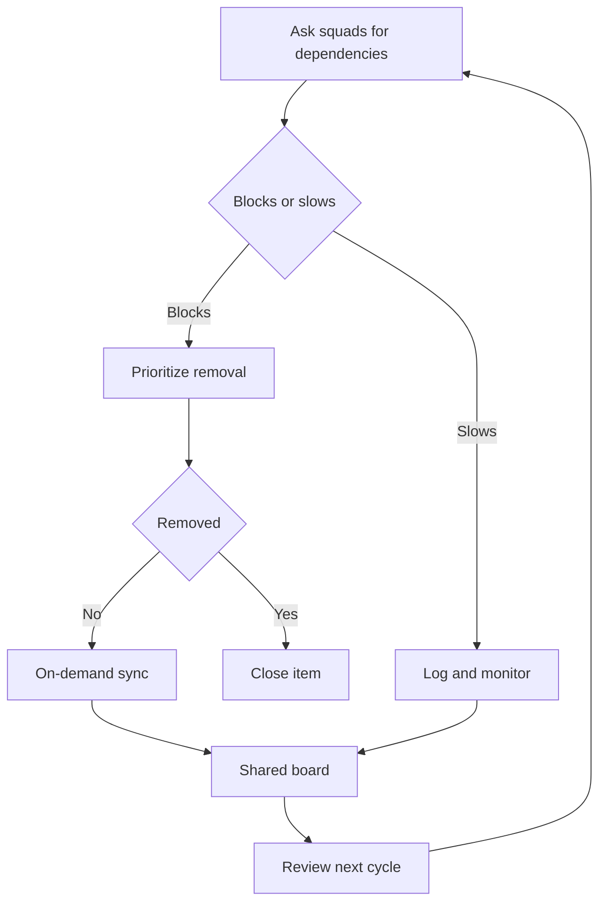

# Managing dependencies agile teams share across tribes

> Inventory cross-squad dependencies, triage blocking versus slowing ones, remove what you can, and sync the rest on demand with a shared board.

## At a Glance

| Field | Value |
|-------|-------|
| Difficulty | Intermediate |
| Time to Learn | One working session for the first inventory, then a short review each planning cycle |
| Outcome | A current, triaged inventory of cross-squad dependencies, a short list being designed away, and a visible board of unresolved items each with an owner and next action. |
| Prerequisites | Squads with defined product ownership areas, Squads grouped into tribes or a similar larger unit, A shared place, physical or digital, where all squads in a tribe can see the same board, Agreement from squad members to report where they are actually stuck |
| Part of | [Spotify Squads](../../methods/spotify-squads/METHOD.md) |

## Overview

Every organization that splits product work across autonomous squads eventually finds that some work cannot finish inside one squad. This skill covers what to do about it: find the dependencies, judge how much each one hurts, remove the ones you can, and coordinate the rest without building a standing layer of meetings. For background on squads, tribes and the rest of the structure, see the [Spotify Squads method page](https://tryhamster.com/methods/spotify-squads).

The starting position matters. In the [Scaling Agile @ Spotify paper](https://blog.crisp.se/wp-content/uploads/2012/11/SpotifyScaling.pdf), the goal is not zero dependencies but squads that are as autonomous as possible, with particular effort spent on dependencies that block or slow delivery. The [same paper](https://blog.crisp.se/wp-content/uploads/2012/11/SpotifyScaling.pdf) notes that dependencies are not necessarily bad, because squads sometimes need to work together to build something valuable. So the job is triage, not elimination at any cost.

Spotify's described practice has three working parts. First, a regular inventory: squads are asked which other squads they depend on and how much each dependency blocks or slows them down, according to the [original Spotify scaling paper](https://blog.crisp.se/wp-content/uploads/2012/11/SpotifyScaling.pdf). Second, a response: the answers feed discussions about eliminating problematic dependencies, with blocking and cross-tribe dependencies getting priority. Third, coordination for what remains: a Scrum of Scrums held on demand rather than as a standing meeting, and a board with sticky notes for unresolved items. A [Scrum Alliance case study of Spotify](https://prod-resources.scrumalliance.org/Article/spotify-scrum@scale-case-study) describes the same pattern as an analog of scaled daily scrums used for on-demand meetings as needed.

The creator material leaves a lot unspecified. It does not define a permanent liaison role, a board template, fixed item fields, a mandated meeting cadence, a numeric dependency limit or a resolution-time target, per [the Spotify paper](https://blog.crisp.se/wp-content/uploads/2012/11/SpotifyScaling.pdf). That gives you room, and it also means the specific fields, thresholds and cadences suggested on this page are recommendations, not Spotify rules.

The output of the skill is concrete: a current dependency inventory per squad, a short list of dependencies being redesigned away, a visible board of unresolved items each with an owner and next action, and fewer squads waiting on each other. You know it is going wrong when the board grows every cycle, when the same pair of squads keeps meeting about the same interface, or when squads stop reporting dependencies because nothing happens after they do.

Agile leads, tribe leads and product owners usually run this work, but the inventory only works if squad members answer honestly about where they wait. Treat their answers as data about the organization's design, not as a scorecard of which squads are slow.

## How It Works

Spotify's described workflow has five moves: ask squads to identify dependencies, assess whether each one blocks or slows work, discuss ways to remove the problematic ones, synchronize the affected squads when needed, and track unresolved items on a shared board, as set out in the [Scaling Agile @ Spotify paper](https://blog.crisp.se/wp-content/uploads/2012/11/SpotifyScaling.pdf). The loop below shows how the moves connect.

**The inventory is the input.** A practical inventory is a squad-level list naming the squad depended on, the dependency's effect on delivery, and whether it blocks or merely slows work, the things Spotify asks its squads about according to the [original paper](https://blog.crisp.se/wp-content/uploads/2012/11/SpotifyScaling.pdf). Blocking means the squad cannot deliver in that area until the other squad acts. Slowing means the squad can proceed, but with delay, workarounds or rework. The distinction drives everything downstream, because the two categories get different responses.

**Removal comes before coordination.** The [same paper](https://blog.crisp.se/wp-content/uploads/2012/11/SpotifyScaling.pdf) treats blocking and slowing dependencies as problems to eliminate where possible and singles out dependencies that cross tribe boundaries for particular attention. Coordination is the fallback, not the default. A dependency you coordinate well still costs meeting time every cycle; a dependency you design away costs nothing after the change. The paper also says dependencies are not necessarily bad, since squads sometimes need to work together to build something valuable, so removal targets the ones that hurt delivery.

**Sync happens on demand.** A Scrum of Scrums, in the creator's description, is a synchronization meeting where one person from each team meets to discuss dependencies, and Spotify usually holds it on demand rather than as a standing meeting, according to [the Spotify paper](https://blog.crisp.se/wp-content/uploads/2012/11/SpotifyScaling.pdf). A [Scrum Alliance case study of Spotify](https://prod-resources.scrumalliance.org/Article/spotify-scrum@scale-case-study) describes this as an analog of scaled daily scrums used for on-demand meetings as needed. In the [described implementation](https://blog.crisp.se/wp-content/uploads/2012/11/SpotifyScaling.pdf), representatives of the affected squads meet daily while the dependency is live, and the meeting produces decisions or follow-up actions.

**The board holds what is still open.** Spotify tracks unresolved dependencies on a board with sticky notes, which makes them visible and gives the squads involved a shared working list, per [the paper](https://blog.crisp.se/wp-content/uploads/2012/11/SpotifyScaling.pdf). An [MIT thesis on cross-team interfaces](https://dspace.mit.edu/bitstream/handle/1721.1/132811/1262990574-MIT.pdf?sequence=1&isAllowed=y) describes coordination duties that fill some of the gaps the Spotify material leaves: facilitating meetings, tracking and monitoring dependencies, proposing and enforcing agreements on cross-team interactions, removing obstacles, and creating fall-back plans for when dependencies fail.

**How to tell it is working.** The board should churn or shrink, not only grow. Pairs of squads that repeatedly land in the same sync are telling you an ownership boundary is wrong, and that finding belongs back in the removal step rather than in another meeting.

## Step-by-Step Guide

### Step 1: Run the dependency inventory

Ask every squad the same two questions: which other squads do you depend on, and how much does each dependency block or slow you down, which is what Spotify asks its squads regularly according to the [Scaling Agile @ Spotify paper](https://blog.crisp.se/wp-content/uploads/2012/11/SpotifyScaling.pdf). Capture one row per dependency with the squad depended on, the work affected, and the effect on delivery. Ask the squad as a group rather than only its product owner, because the people doing the work know where they actually wait. Keep the wording neutral so that naming a dependency does not read as blaming the other squad.

> **Pro tip:** Collect answers in writing before any group discussion, for example a short form each squad fills in during its own retrospective, so louder squads do not set the agenda.

### Step 2: Classify each dependency as blocking or slowing

For each row, decide whether the dependency stops the squad from delivering or only makes delivery slower, since Spotify explicitly asks squads to assess the degree of impact per the [original paper](https://blog.crisp.se/wp-content/uploads/2012/11/SpotifyScaling.pdf). A useful test is whether the squad could ship anything in the affected area this cycle if the other squad did nothing. If not, it is blocking. If it could ship with a workaround or a delay, it is slowing.

Record the call with a one-line reason so the classification can be challenged later.

> **Pro tip:** When a squad cannot decide, mark the item blocking for now. An overstated dependency gets corrected at the next review, while an understated one quietly stalls work.

### Step 3: Flag cross-tribe dependencies

Mark every dependency where the other squad sits in a different tribe. Spotify's material identifies dependencies crossing tribe boundaries, along with blocking ones, as the priority for elimination, according to the [Scaling Agile @ Spotify paper](https://blog.crisp.se/wp-content/uploads/2012/11/SpotifyScaling.pdf). Cross-tribe items tend to be harder to resolve because the squads involved share fewer planning conversations and priorities. Sort the inventory so blocking cross-tribe items sit at the top of the discussion list.

### Step 4: Attempt removal first

Before arranging any coordination, ask whether the dependency can be designed away, because Spotify treats blocking and slowing dependencies as problems to eliminate where possible, per the [creator material](https://blog.crisp.se/wp-content/uploads/2012/11/SpotifyScaling.pdf). Options include, for example, moving a capability into the dependent squad, redrawing an ownership boundary, or turning a recurring request into a self-service interface. Weigh the cost of the change against how often the dependency bites. Leave genuinely valuable collaboration alone, since the same paper notes that squads sometimes need to work together to build something valuable.

> **Pro tip:** Bring people from both squads into the removal discussion. A redesign agreed by only one side usually just moves the dependency somewhere else.

### Step 5: Convene an on-demand Scrum of Scrums

When a dependency cannot be removed quickly and needs live coordination, call a Scrum of Scrums with one person from each affected squad, which is how Spotify's [scaling paper](https://blog.crisp.se/wp-content/uploads/2012/11/SpotifyScaling.pdf) describes the meeting. Spotify does not usually run it as a standing meeting; the trigger is an identified dependency that requires coordination between squads. While it runs, representatives meet daily to identify and resolve the dependencies, and each session should end in a decision or a follow-up action. Disband it once the dependency is resolved rather than letting it harden into a permanent ritual.

> **Pro tip:** Name an exit condition when you convene the sync, for example that the shared interface is merged and both squads have released against it.

### Step 6: Track unresolved items on a shared board

Put every unresolved dependency on a board all involved squads can see; Spotify's described implementation uses sticky notes on a board, per the [Scaling Agile @ Spotify paper](https://blog.crisp.se/wp-content/uploads/2012/11/SpotifyScaling.pdf). The source does not prescribe fields, so choose a minimal set, for example the two squads, the blocking or slowing call, the owner, the next action and a fall-back. The fall-back field borrows from an [MIT thesis on cross-team interfaces](https://dspace.mit.edu/bitstream/handle/1721.1/132811/1262990574-MIT.pdf?sequence=1&isAllowed=y), which lists creating fall-back plans for when dependencies fail among coordination duties. Move cards only when something has actually changed, so the board reflects reality rather than activity.

> **Pro tip:** Keep one board per tribe with a clearly marked lane for cross-tribe items, so each dependency appears once instead of twice with conflicting status.

### Step 7: Review the inventory and close the loop

Rerun the inventory on a regular rhythm, because Spotify asks the dependency questions regularly rather than once, per [the paper](https://blog.crisp.se/wp-content/uploads/2012/11/SpotifyScaling.pdf). Compare the new list with the old one: which items were removed, which were resolved through coordination, and which reappeared. Recurring items between the same pair of squads signal that the ownership boundary, not the coordination, needs fixing. Report back to squads what changed as a result of their answers, or they will stop reporting.

## Best Practices

- Treat the inventory as a design signal, not a status report. In Spotify's practice its purpose is to drive discussions about eliminating problematic dependencies, per the [Scaling Agile @ Spotify paper](https://blog.crisp.se/wp-content/uploads/2012/11/SpotifyScaling.pdf). If it only ever feeds meetings, you are coordinating around a structural problem instead of fixing it.
- Separate blocking from slowing in every record. Blocking items call for removal or immediate sync, while slowing items can often wait for the next planning conversation. A single undifferentiated list hides the urgent items among the merely annoying ones.
- Keep sync meetings representative and temporary. One person per affected squad is enough, matching the Scrum of Scrums described in the [Spotify paper](https://blog.crisp.se/wp-content/uploads/2012/11/SpotifyScaling.pdf). Everyone else keeps delivering, and the meeting ends when the dependency does.
- Give every board item an owner, a next action and a fall-back. A card without an owner is a complaint, not a work item. The fall-back keeps squads from being stranded if the dependency fails, a duty an [MIT thesis on cross-team interfaces](https://dspace.mit.edu/bitstream/handle/1721.1/132811/1262990574-MIT.pdf?sequence=1&isAllowed=y) assigns to whoever coordinates cross-team work.
- Protect collaboration that creates value. Not every dependency is a defect, and squads sometimes need to work together to build something valuable. Aim removal effort at dependencies that block or slow delivery, not at every interaction between squads.
- Write down your own cadence and fields. The creator material does not mandate a meeting cadence, board template or resolution-time target, per [the paper](https://blog.crisp.se/wp-content/uploads/2012/11/SpotifyScaling.pdf), so record what your tribe uses and revisit it when it stops helping.

## Common Mistakes

- **Treating every dependency as a failure to be eliminated.** — Spotify's material states that dependencies are not necessarily bad because squads sometimes need to work together to build something valuable, per the [Scaling Agile @ Spotify paper](https://blog.crisp.se/wp-content/uploads/2012/11/SpotifyScaling.pdf). Target autonomy with useful collaboration, and spend removal effort on the dependencies that block or slow delivery.
- **Running a permanently scheduled Scrum of Scrums whether or not anything needs coordinating.** — Spotify holds this synchronization on demand, a pattern the [Scrum Alliance case study](https://prod-resources.scrumalliance.org/Article/spotify-scrum@scale-case-study) also describes. Convene it when a specific dependency requires coordination and close it when that dependency is resolved.
- **Recording dependencies without saying how much each one hurts.** — A list that treats a minor delay the same as a full stop cannot be prioritized. Spotify explicitly asks squads to assess whether a dependency blocks or slows them, per [the paper](https://blog.crisp.se/wp-content/uploads/2012/11/SpotifyScaling.pdf), so capture that call on every item.
- **Leaving unresolved dependencies in people's heads or scattered across chat threads.** — Invisible dependencies surface only when a release slips. Put every unresolved item on a shared board, as Spotify does with sticky notes according to the [scaling paper](https://blog.crisp.se/wp-content/uploads/2012/11/SpotifyScaling.pdf), so all affected squads work from the same list.
- **Creating a permanent layer of dependency liaisons and assuming Spotify prescribes it.** — The Spotify material describes coordination through representatives of affected squads and does not define a permanent liaison role, per [the paper](https://blog.crisp.se/wp-content/uploads/2012/11/SpotifyScaling.pdf). Rotate representatives per dependency so coordination stays close to the work rather than becoming its own job.

## References

- [Examples](references/examples.md) — Worked examples and scenarios
- [FAQ](references/faq.md) — Frequently asked questions
- [Parent Method](../../methods/spotify-squads/METHOD.md) — Spotify Squads

## Related Skills

- [Running Chapters for Discipline-Based Management](../running-chapters-for-discipline-excellence/SKILL.md)
- [Defining Squad Missions and Product Ownership Areas](../defining-squad-missions-and-ownership/SKILL.md)
- [Forming Autonomous Cross-Functional Squads](../forming-autonomous-squads/SKILL.md)
- [Organizing Squads into Tribes](../organizing-squads-into-tribes/SKILL.md)
- [Building Guilds as Cross-Cutting Communities of Practice](../building-guilds-as-communities-of-practice/SKILL.md)
- [Balancing Squad Autonomy with Organizational Alignment](../balancing-autonomy-and-alignment/SKILL.md)
- [Adapting the Spotify Model to Your Organization](../adapting-spotify-model-to-your-organization/SKILL.md)

## Sources

- [Scaling Agile @ Spotify - Crisp's Blog](https://blog.crisp.se/wp-content/uploads/2012/11/SpotifyScaling.pdf)
- [Spotify: A Scrum@Scale Case Study](https://prod-resources.scrumalliance.org/Article/spotify-scrum@scale-case-study)
- [Management of Cross-Team Interfaces in Large](https://dspace.mit.edu/bitstream/handle/1721.1/132811/1262990574-MIT.pdf?sequence=1&isAllowed=y)
