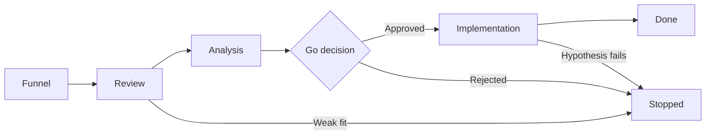

# Lean Portfolio Management SAFe: Decision Rights to Kanban

> Give one portfolio group clear decision rights and move epics through a Portfolio Kanban, committing capacity only as evidence builds.

## At a Glance

| Field | Value |
|-------|-------|
| Difficulty | Advanced |
| Time to Learn | Several weeks to set up, then ongoing review on a regular cadence |
| Outcome | A working Portfolio Kanban, owned by a Lean Portfolio Management group with explicit decision rights, that funds epics only after progressive analysis and keeps portfolio trade-offs visible. |
| Prerequisites | At least one Agile Release Train or team of teams already delivering, A named group of portfolio leaders with budget authority, A current list of large initiatives in flight or proposed, Working knowledge of epics and features in SAFe |
| Part of | [Scaled Agile Framework](../../methods/scaled-agile-framework/METHOD.md) |

## Overview

Lean Portfolio Management (LPM) is where SAFe places the portfolio's heaviest decisions. The [SAFe glossary](https://scaledagileframework.com/glossary) assigns LPM the highest level of decision-making and financial accountability for the products and solutions in a portfolio. In practice, the LPM group decides which large initiatives get explored, which get funded, which get paused and which get stopped, and it answers for those choices across the whole portfolio rather than for one train or one department.

Scaled Agile treats this as a core competency of the framework, listing Lean Portfolio Management alongside competencies such as Team and Technical Agility and Agile Product Delivery, as discussed in [Scaled Agile's business agility value stream podcast](https://scaledagile.com/podcast/navigate-the-future-with-a-business-agility-value-stream). For background on SAFe's structure, configurations and history, see the [Scaled Agile Framework method page](https://tryhamster.com/methods/scaled-agile-framework). This page stays on the work itself.

The skill breaks into four jobs. First, you map the decision rights that already exist, because every organization has steering committees, budget owners and informal veto holders before it ever hears of LPM. Second, you stand up a Portfolio Kanban, which the [SAFe glossary](https://scaledagileframework.com/glossary) positions as the backbone of the Lean portfolio process because it defines how new enterprise initiatives flow through the portfolio. Third, you analyze epics progressively, so capacity is committed only when the evidence justifies it. Fourth, you keep the Kanban alive as a decision system instead of letting it turn into a list of ideas nobody acts on.

The people doing this work are usually portfolio leaders with budget authority, the people who write and sponsor epics, architects who judge feasibility, and finance partners who track investment. Release Train Engineers and product managers feed the Kanban and receive its outputs, but they rarely own it.

You can tell the skill is working when three things hold. Anyone can see which epics are being analyzed, which are funded and why. Epics leave the Kanban, either as done or as deliberately stopped, not just enter it. And when a new idea arrives, the conversation turns to what it would displace rather than whether it can be squeezed in. If the board only ever grows, if funding still happens in a separate annual meeting that ignores the board, or if every epic reaches implementation, the LPM group has the name but not the decision rights.

## How It Works

The Portfolio Kanban is a pull system for large initiatives. The [SAFe glossary](https://scaledagileframework.com/glossary) describes it as managing the flow of initiatives from ideation through analysis and implementation, and each state should represent progressively stronger evidence and a firmer decision rather than an immediate authorization to build. The exact state names vary by SAFe configuration, so treat the flow below as a shape to adapt, not a fixed template.

Each state answers a narrower question than the one before it.

**Funnel.** Any idea large enough to be an epic lands here. The [SAFe glossary](https://scaledagileframework.com/glossary) defines an epic as a significant initiative large enough to require analysis, an MVP definition and financial approval before implementation. The funnel should cost almost nothing to enter. The only requirement is a short statement of the problem and the intended outcome.

**Review and analysis.** This is where most of the LPM group's judgment goes. The glossary frames the Kanban as a way to manage prioritization and flow, and the practice that follows from it is progressively deeper analysis before substantial capacity is committed: evidence about strategic fit, expected outcomes, feasibility, risk and the investment required. SAFe does not prescribe a single mandatory worksheet, so the group chooses its own criteria and applies them consistently. A light review filters obvious misfits cheaply. Full analysis, including an MVP definition, happens only for epics that survive it.

**Go decision.** The LPM group decides using its decision rights. Epics are prioritized according to strategic importance and available capacity, and the [glossary](https://scaledagileframework.com/glossary) expects those trade-offs to be visible in the Kanban itself. An approved epic is a commitment of real capacity, which means something else is not getting it.

**Implementation.** The epic's MVP and follow-on work flow to the release trains as features. The LPM group watches whether the epic's hypothesis is holding. If evidence says it is not, stopping the epic is a legitimate outcome, not a failure of the process.

**Done.** The epic exits when its outcome is achieved or further investment is no longer justified. This state matters because a board with no exits is a signal that the Kanban is being used as a passive idea list, which the glossary warns against: the Kanban is meant to manage prioritization, flow, analysis, implementation and completion.

This flow mirrors the broader path Scaled Agile describes in its [business agility value stream discussion](https://scaledagile.com/podcast/navigate-the-future-with-a-business-agility-value-stream), a series of steps from understanding the opportunity to building the MVP and then to continuous delivery. The Portfolio Kanban is where the first two of those steps are governed.

Two mechanics make the system pull rather than push. Limit how many epics sit in analysis at once, so the group finishes analyses instead of starting them. And link funding to the go decision, so approval on the board is the approval that releases money.

## Step-by-Step Guide

### Step 1: Mapping existing decision rights

Before creating any board, list the management teams, processes, steering committees and decision rights that already govern large initiatives, as the [SAFe glossary](https://scaledagileframework.com/glossary) recommends as a starting point. For each, record what it approves, what budget it controls and how often it meets. Include informal power: the executive whose sign-off is always sought, the architecture board that can quietly block work. The output is a one-page map showing who can start, fund and stop an initiative today.

Without it, LPM becomes one more committee layered on top of the old ones.

> **Pro tip:** Ask each committee for the last three decisions it made. Real decisions reveal real authority better than charters do.

### Step 2: Assigning decision rights to the LPM group

Decide which of the mapped rights move to the LPM group and which existing forums are retired or narrowed. SAFe places the highest level of portfolio decision-making and financial accountability with LPM, so the group needs genuine authority over funding, not an advisory role. Write down what the group decides alone, what it decides with finance, and what it escalates. Publish the change so sponsors know where to bring epics.

> **Pro tip:** If a legacy steering committee cannot be retired yet, make its approval a Kanban state rather than a parallel track, so it stays visible.

### Step 3: Defining Kanban states and exit criteria

Choose the states your epics will pass through, for example funnel, review, analysis, implementation and done, and adapt the names to your configuration. For each state, write an exit criterion that describes the evidence needed to move on. The [glossary](https://scaledagileframework.com/glossary) treats the Portfolio Kanban as the backbone of the Lean portfolio process, so these criteria are the portfolio's rules. Keep them short enough to fit on the board itself.

> **Pro tip:** Phrase exit criteria as questions, such as whether the MVP is defined and whether the investment range is estimated, so reviewers can answer yes or no.

### Step 4: Setting limits on work in analysis

Pick a cap on how many epics can be in analysis at the same time, for example three to five for a portfolio with a handful of trains. Analysis consumes scarce people, usually architects, finance partners and senior product leaders. Without a limit, many epics get half-analyzed and none reach a decision. When the cap is hit, a new epic waits in review until an analysis finishes or is abandoned.

> **Pro tip:** Set the limit by counting how many analyses your architects can realistically support at once, then subtract one.

### Step 5: Analyzing epics progressively

Run a light review first, checking strategic fit and whether the idea is really epic-sized. Only epics that pass get full analysis: expected outcomes, feasibility, risk, investment required and an MVP definition, since the [SAFe glossary](https://scaledagileframework.com/glossary) defines an epic as needing analysis, an MVP and financial approval before implementation. Increase depth as confidence grows rather than demanding a full business case at entry. The output is a concise epic brief the LPM group can decide on in one session.

> **Pro tip:** Time-box full analysis, for example to four weeks. An epic that cannot be analyzed in that window usually needs splitting or a smaller MVP.

### Step 6: Deciding and prioritizing against capacity

Bring analyzed epics to the LPM group for a go or no-go decision. Prioritize by strategic importance and available capacity, and make the trade-off explicit on the board, as the [glossary](https://scaledagileframework.com/glossary) expects. If an epic is approved, name what it displaces or delays. A rejection is recorded with its reason so the idea can be reconsidered later with new evidence.

### Step 7: Reviewing flow and pruning on a cadence

Meet on a fixed cadence to walk the board from right to left: done, then implementation, then analysis, then the funnel. Check whether implementing epics still hold their hypotheses and stop the ones that do not. Remove funnel items that have sat untouched past an agreed age. This keeps the Kanban a system for managing prioritization, flow and completion rather than a passive idea list.

> **Pro tip:** Track how many epics exited to done or stopped since the last review. A count of zero over several reviews is the clearest warning sign.

## Best Practices

- Map decision rights before designing the board. The [SAFe glossary](https://scaledagileframework.com/glossary) advises identifying existing management teams, steering committees and decision rights first, because an LPM group that ignores them ends up duplicating or being overruled by them.
- Make the Portfolio Kanban the only path to significant funding. If money can still be secured in a side meeting, the board becomes decorative and sponsors learn to bypass it.
- Keep funnel entry cheap and analysis expensive. A short problem statement is enough to enter, while full analysis is reserved for epics that survive review, which protects scarce analytical capacity.
- Write exit criteria for every state. Explicit criteria turn each move on the board into a decision with a reason, which is what separates a Kanban from a status list.
- Show capacity next to priorities. Prioritizing by strategic importance and available capacity, with the trade-offs visible on the board as the [glossary](https://scaledagileframework.com/glossary) describes, forces the group to say what a new epic displaces.
- Treat stopping an epic as a normal outcome. Epics are hypotheses, and a portfolio that never stops anything is funding sunk costs rather than learning.
- Connect the Kanban to delivery. The path Scaled Agile describes runs from understanding the opportunity to the MVP and on to continuous delivery, per its [business agility value stream podcast](https://scaledagile.com/podcast/navigate-the-future-with-a-business-agility-value-stream), so approved epics should flow straight into train backlogs as features.

## Common Mistakes

- **Treating the Portfolio Kanban as a passive idea list where initiatives are logged and then forgotten.** — Run it as a system for prioritization, flow, analysis, implementation and completion, as the [SAFe glossary](https://scaledagileframework.com/glossary) frames it. Hold regular reviews that move or remove items, and track exits as closely as entries.
- **Authorizing full implementation as soon as an epic is proposed.** — Require progressively stronger evidence at each state before committing capacity. An MVP definition and an investment estimate should exist before the go decision, not after.
- **Creating an LPM group without transferring real funding authority.** — Move specific decision rights, especially funding and stopping, to the group and retire or narrow the forums that held them. An advisory LPM group will be bypassed whenever it disagrees with the old budget process.
- **Letting unlimited epics sit in analysis at once.** — Cap work in analysis based on the people who actually do it. Finishing a few analyses produces decisions, while starting many produces a queue of half-understood ideas.
- **Prioritizing by sponsor seniority or loudness instead of strategy and capacity.** — Rank epics against stated strategic themes and the capacity actually available, and show the ranking on the board so the reasoning can be challenged.

## References

- [Examples](references/examples.md) — Worked examples and scenarios
- [FAQ](references/faq.md) — Frequently asked questions
- [Parent Method](../../methods/scaled-agile-framework/METHOD.md) — Scaled Agile Framework

## Related Skills

- [Splitting Features into User Stories and Enablers](../splitting-features-into-stories/SKILL.md)
- [Launching and Running Agile Release Trains](../launching-agile-release-trains/SKILL.md)
- [Running Inspect and Adapt Workshops](../running-inspect-and-adapt-workshops/SKILL.md)
- [Implementing the SAFe Continuous Delivery Pipeline](../implementing-devops-with-continuous-delivery-pipeline/SKILL.md)
- [Coordinating Multiple ARTs with Solution Trains](../coordinating-multiple-agile-release-trains/SKILL.md)
- [Prioritizing Work Using WSJF](../prioritizing-with-wsjf/SKILL.md)
- [Planning Program Increments \(PI Planning\)](../planning-program-increments/SKILL.md)

## Sources

- [Business Agility Value Stream in Applying SAFe](https://scaledagile.com/podcast/navigate-the-future-with-a-business-agility-value-stream)
- [SAFe Glossary](https://scaledagileframework.com/glossary)
