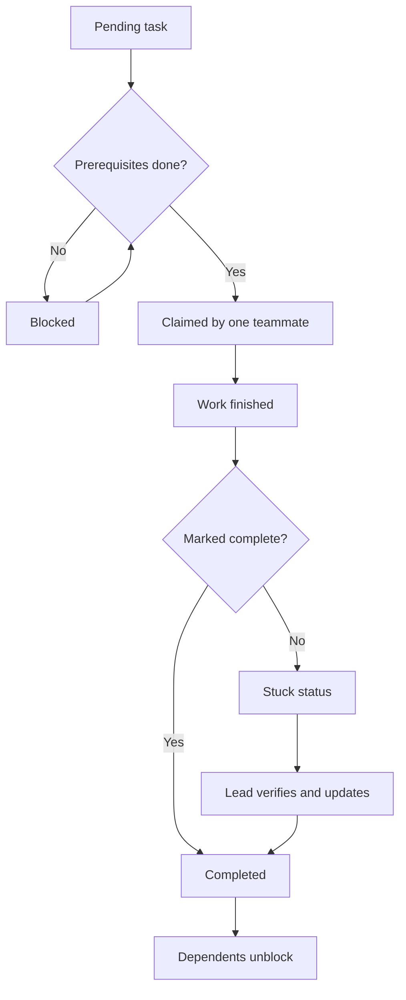

# Claude Code Agent Teams Shared Task List Management

> Keep an Agent Team's shared task list accurate so claims, completions and dependencies match reality and blocked work unblocks on time.

## At a Glance

| Field | Value |
|-------|-------|
| Difficulty | Intermediate |
| Time to Learn | Requires some learning time, then monitoring per team run |
| Outcome | A shared task list that accurately shows what is pending, blocked, claimed and done, so dependent tasks start as soon as their prerequisites are truly finished. |
| Prerequisites | Agent Teams enabled in a Claude Code environment, A decomposed plan with tasks, inputs, outputs and dependencies, Familiarity with the lead and teammate roles in an Agent Team |
| Part of | [Claude Code Agent Teams](../../methods/claude-code-agent-teams/METHOD.md) |

## Overview

The shared task list is the one place in an Agent Team where every session can see the state of the work. This page covers keeping that list truthful. For background on the feature itself, see the [Claude Code Agent Teams method page](https://tryhamster.com/methods/claude-code-agent-teams).

[Anthropic's agent teams documentation](https://code.claude.com/docs/en/agent-teams) describes a team as multiple Claude Code instances working together with shared tasks, inter-agent messaging and centralized management. One session acts as the lead and assigns and coordinates work, while each teammate runs in its own context window. That separation matters for task state. A teammate cannot see what another teammate is thinking. It can only see what the list says. If the list is wrong, teammates wait on work that is already finished or start work whose inputs do not exist yet.

Practitioners describe the list as the mechanism through which teammates claim work and blocked tasks become unblocked as their prerequisites are satisfied ([dev.to write-up on multi-agent development workflows](https://dev.to/javatarz/multi-agent-development-workflows-with-claude-code-n23)). Orchestration guides frame dependencies as sequencing constraints. Tasks without dependencies run in parallel, and dependent tasks are released only after their prerequisites complete ([Fastio orchestration guide](https://fast.io/resources/claude-code-multi-agent-orchestration)). An orchestrating lead tracks dependencies between tasks specifically to prevent conflicts ([OpenAI Tools Hub guide to advanced Agent Teams workflows](https://openaitoolshub.org/en/blog/claude-code-agent-teams-advanced)).

The list does not maintain itself. Anthropic documents a known limitation: task status can lag because teammates sometimes fail to mark tasks complete, and that can block dependent tasks ([Claude Code agent teams limitations](https://code.claude.com/docs/en/agent-teams)). The practical consequence is that automatic unblocking is only as reliable as the completion signals feeding it. A lead who assumes the list is accurate will eventually find a teammate idling on a task that was finished some time ago.

Managing shared task state therefore has four parts. The first is seeding the list with tasks and explicit prerequisites. The second is making claims unambiguous so one teammate owns each task. The third is defining completion so marking a task done means something. The fourth is detecting and repairing stale status before it stalls the dependency chain. The skill sits between decomposition, which produces the tasks, and synthesis, which consumes the finished outputs. Done well, the lead spends little time chasing status and the team's parallelism is limited by real dependencies, not bookkeeping gaps.

## How It Works

Every task on the list moves through a small lifecycle, and the lead's job is to keep each task's recorded state matched to its real state. The labels your version of Claude Code shows may differ. The shape below is what to manage.

**Pending and blocked.** A task enters the list when the lead creates it from the plan. If it needs an interface, schema, migration or architectural decision produced by another task, it should stay blocked until that prerequisite is complete. Orchestration guidance treats this as a hard sequencing rule, not a suggestion ([Fastio orchestration guide](https://fast.io/resources/claude-code-multi-agent-orchestration)). Tasks with no dependencies are available immediately and can run in parallel ([OpenAI Tools Hub guide](https://openaitoolshub.org/en/blog/claude-code-agent-teams-advanced)).

**Claimed.** An available task is picked up by a teammate, either because the lead assigned it or because the teammate claimed it from the shared list ([dev.to multi-agent workflow write-up](https://dev.to/javatarz/multi-agent-development-workflows-with-claude-code-n23)). A claim is a promise of ownership. While it holds, no other teammate should work on the same task, which is how the list prevents two sessions from producing competing versions of the same output.

**Completed and unblocking.** When the owning teammate finishes and marks the task complete, tasks that depended on it can become unblocked automatically. Practitioners report the combination of shared task lists with dependency tracking and auto-unblocking as the thing that lets genuinely dependent work proceed without the lead relaying every handoff ([dev.to write-up](https://dev.to/javatarz/multi-agent-development-workflows-with-claude-code-n23)).

**The stuck-status path.** The weak link is the transition from finished to marked complete. [Anthropic documents](https://code.claude.com/docs/en/agent-teams) that teammates sometimes fail to mark tasks complete, so status lags and dependents stay blocked. Nothing in the list itself tells you this has happened. The symptoms are indirect: a teammate reports success in a message but the task still shows as claimed, a teammate goes idle while holding a claim, or a chain of blocked tasks stops moving. The repair is always the same. The lead confirms the output actually exists and meets the task's definition of done, then updates the status or tells the owning teammate to do it. Updating without verifying is worse than leaving the task stuck, because it releases dependents onto missing or broken inputs.

**Session events.** Two further documented behaviors affect state. In-process teammates are not restored by resume or rewind, and after resuming the lead may try to message teammates that no longer exist ([Claude Code agent teams documentation](https://code.claude.com/docs/en/agent-teams)). Any claims those teammates held are now orphaned. Shutdown can also be slow, because teammates finish their current request or tool call before stopping, so a task may change state after you asked the team to stop.

## Step-by-Step Guide

### Step 1: Seed the list from the plan

Start from a decomposed plan and have the lead turn each item into a task on the shared list. Each task should name its input, its expected output and the tasks it depends on. If the lead produces only a handful of broad tasks, [Anthropic's documentation](https://code.claude.com/docs/en/agent-teams) recommends explicitly asking it to split the work into smaller pieces. Broad tasks make status meaningless, because a task that is mostly done looks identical to one that has not started.

Check the seeded list before any teammate claims work.

> **Pro tip:** Read the list once as if you were a teammate with no other context. If a task's done state is unclear from its text alone, rewrite it before release.

### Step 2: Record dependencies before releasing work

For every task, ask what it needs from another task: an interface, a schema, a migration or a design decision. Mark those as prerequisites so the task stays blocked until they complete, following the sequencing rule in the [Fastio orchestration guide](https://fast.io/resources/claude-code-multi-agent-orchestration). Leave tasks with no real prerequisites unblocked so they can run in parallel from the start. Avoid adding dependencies for comfort, since each unnecessary edge serializes work that could have overlapped.

The output of this step is a list where the only blocked tasks are ones that would fail if started now.

> **Pro tip:** Name the prerequisite artifact in the blocked task's description, for example the schema file or interface stub it waits on, so anyone can verify readiness directly.

### Step 3: Enforce one owner per claimed task

Let teammates claim available tasks or have the lead assign them, but make sure each task has exactly one owner at a time. The shared list is where teammates claim work ([dev.to write-up](https://dev.to/javatarz/multi-agent-development-workflows-with-claude-code-n23)), so a claim should be visible to everyone before work begins. If two teammates start the same task, stop one immediately and have it release the claim. Duplicate work wastes tokens and forces the lead to choose between two outputs later.

Check the list shortly after release to confirm claims landed where you expected.

> **Pro tip:** Ask teammates to claim one task at a time and finish or release it before claiming another. Parallel claims by one session hide which task it is actually working on.

### Step 4: Define what marking complete means

Tell the team, in the lead's instructions, that a task is marked complete only when its stated output exists and passes its check. For a code task that might mean the module builds and its tests pass. For an analysis task it might mean a report in the agreed format has been written. Ask teammates to mark completion in the same action as reporting results, so the message and the status never diverge.

This makes auto-unblocking trustworthy, because a completion signal then implies usable output for the dependents.

> **Pro tip:** Ask for a one-line result note with each completion, naming the file or artifact produced. It gives the lead something concrete to spot-check.

### Step 5: Watch for stale status

Monitor the list and the message stream together, because stale status shows up as a mismatch between them. [Anthropic documents](https://code.claude.com/docs/en/agent-teams) that teammates sometimes fail to mark tasks complete, which blocks dependent tasks. Look for a teammate that reported success while its task still shows as claimed, an idle teammate still holding a claim, or a blocked task whose prerequisite looks finished. Check at natural points, such as when a teammate reports in or when the number of active teammates drops.

Do not wait for the whole team to go quiet, since by then several dependents may be stuck.

### Step 6: Verify, then repair and unblock

When you find a suspect task, first confirm the output exists and meets the task's definition of done. If it does, update the status yourself or instruct the owning teammate to mark it complete, which lets dependents unblock. If it does not, leave the task claimed and message the owner about what is missing. Never mark a task complete just to get the chain moving, because dependents will then build on absent or broken inputs.

Record what went wrong so you can tighten the completion instructions for the next run.

> **Pro tip:** If a teammate repeatedly forgets to mark completion, restate the rule in a direct message rather than silently fixing its tasks each time.

### Step 7: Reconcile the list after resume or shutdown

After resuming a session, assume in-process teammates are gone, since [Anthropic notes](https://code.claude.com/docs/en/agent-teams) they are not restored and the lead may try to message teammates that no longer exist. Walk the list for claims held by missing teammates, check what partial output they left, and reassign or reset those tasks. Tell the lead explicitly which teammates to spawn again. When stopping a team, allow for slow shutdown, because teammates finish their current request or tool call first.

Re-read the list after shutdown completes, since a task may have changed state in the meantime.

> **Pro tip:** Before a planned resume, have the lead summarize every open claim and its progress so reconciliation starts from a written record.

## Best Practices

- Treat the task list as the source of truth and messages as supporting evidence. Teammates each work in their own context window, so the list is the only state they all share, and decisions about releasing work should be made from it.
- Keep blocked tasks tied to named artifacts. When a blocked task says exactly which schema, interface or decision it waits on, you can check readiness in seconds instead of asking around.
- Pair every completion with a result note. A short line naming the produced file or report makes spot-checking cheap and exposes completions that were marked without real output.
- Check for stale status whenever a teammate reports in. [Anthropic documents](https://code.claude.com/docs/en/agent-teams) that status can lag, and the moment a teammate says it finished is the easiest time to confirm the list agrees.
- Release dependents only on verified completion. Auto-unblocking, which practitioners describe as a core benefit of the shared list ([dev.to write-up](https://dev.to/javatarz/multi-agent-development-workflows-with-claude-code-n23)), amplifies whatever signal it receives, including a false one.
- Minimize dependency edges. Only prerequisites that would cause a task to fail belong on the list, since the orchestration guidance lets independent tasks run in parallel ([OpenAI Tools Hub guide](https://openaitoolshub.org/en/blog/claude-code-agent-teams-advanced)) and every extra edge removes some of that parallelism.

## Common Mistakes

- **Assuming auto-unblocking is fully reliable and never checking the list.** — Completion signals can be missing, as [Anthropic's documentation](https://code.claude.com/docs/en/agent-teams) warns. Monitor the list alongside messages and investigate any teammate that reports success while its task is still open.
- **Releasing dependent tasks before their prerequisite exists.** — Keep tasks that need an interface, schema, migration or decision blocked until that prerequisite is complete, as the [Fastio orchestration guide](https://fast.io/resources/claude-code-multi-agent-orchestration) recommends. Starting early forces rework once the real prerequisite lands.
- **Marking a stuck task complete without looking at its output.** — Verify the artifact exists and passes the task's check before updating status. A false completion unblocks every dependent onto broken input, which costs far more than a short stall.
- **Letting two teammates hold or work the same task.** — Enforce one owner per task and have duplicates release their claim immediately. Overlapping work produces competing outputs that the lead must reconcile later.
- **Resuming a session and carrying on as if the old teammates still exist.** — In-process teammates are not restored on resume, so their claims are orphaned. Audit open claims, reassign them, and tell the lead to spawn fresh teammates.

## References

- [Examples](references/examples.md) — Worked examples and scenarios
- [FAQ](references/faq.md) — Frequently asked questions
- [Parent Method](../../methods/claude-code-agent-teams/METHOD.md) — Claude Code Agent Teams

## Related Skills

- [Decomposing Tasks for Agent Teams](../decomposing-tasks-for-agent-teams/SKILL.md)
- [Designing Agent Roles and Scopes](../designing-agent-roles-and-scopes/SKILL.md)
- [Coordinating Inter-Agent Communication](../coordinating-inter-agent-communication/SKILL.md)
- [Reviewing and Synthesizing Teammate Outputs](../reviewing-and-synthesizing-teammate-outputs/SKILL.md)
- [Parallelizing Independent Work Across Sessions](../parallelizing-independent-work-across-sessions/SKILL.md)
- [Choosing Agent Teams Versus Subagents](../choosing-agent-teams-versus-subagents/SKILL.md)

## Sources

- [Orchestrate teams of Claude Code sessions - Claude Code Docs](https://code.claude.com/docs/en/agent-teams)
- [How to Orchestrate Multi-Agent Workflows in Claude Code \| Fastio](https://fast.io/resources/claude-code-multi-agent-orchestration)
- [Claude Code Agent Teams: Advanced Multi-Agent Workflows](https://openaitoolshub.org/en/blog/claude-code-agent-teams-advanced)
- [Multi-Agent Development Workflows with Claude Code](https://dev.to/javatarz/multi-agent-development-workflows-with-claude-code-n23)
