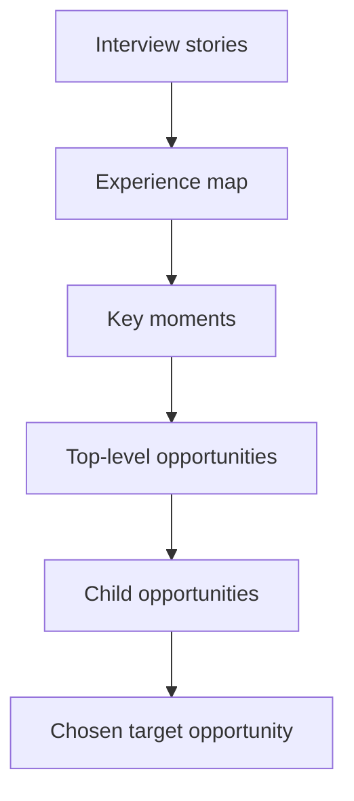

# Customer Opportunity Mapping: Find and Prioritize Problems

> Synthesize customer interview insights into a structured map of opportunities, then prioritize which one your team should pursue next.

## At a Glance

| Field | Value |
|-------|-------|
| Difficulty | Intermediate |
| Time to Learn | 2-4 hours for initial map; 30-60 minutes per weekly update |
| Outcome | You produce a living, prioritized opportunity map that gives your team a clear, evidence-based answer to 'what customer problem should we solve next?', replacing opinion-driven roadmaps with a structured artifact grounded in real customer data. |
| Prerequisites | Completed at least 5-8 customer interviews with notes or transcripts, A defined product outcome or desired business result (see defining-product-outcomes-over-outputs), Basic familiarity with affinity mapping or thematic grouping, Understanding of the Opportunity Solution Tree concept (see building-opportunity-solution-trees) |
| Part of | [Continuous Discovery Habits](../../methods/continuous-discovery-habits/METHOD.md) |

## Overview

Customer opportunity mapping is the practice of taking the raw, messy output of customer interviews, stories, complaints, workarounds, wishes, and transforming it into a structured landscape of distinct problem spaces your team can evaluate and act on. An opportunity, in the [Continuous Discovery Habits](https://tryhamster.com/methods/continuous-discovery-habits) framework, is a customer need, pain point, or desire. Teresa Torres describes the opportunity space as [the customer needs, pain points, and desires that, if addressed, will drive your desired outcome](https://producttalk.org/opportunity-solution-trees). It is not a feature request or a solution idea. The distinction matters because opportunities are durable, they persist even as solutions change, while feature requests are ephemeral and anchored to a single implementation. When you map opportunities well, you create a stable foundation for your product strategy that survives individual sprints and shifting stakeholder opinions.

The specific artifact you produce is an opportunity map: a visual or tabular representation of every meaningful opportunity space your team has identified, organized into a hierarchy (broad themes broken into specific sub-opportunities), with each opportunity scored or ranked against explicit criteria. This map feeds directly into your [Opportunity Solution Tree](https://tryhamster.com/skills/building-opportunity-solution-trees), where the highest-priority opportunities become the branches you explore with solution ideas and assumption tests. [One guide to the tree](https://chameleon.io/blog/opportunity-solution-tree) describes it as a tool for making visual connections between business goals, customer needs, opportunities, solutions, and ideas to experiment with. Without a well-constructed opportunity map, teams either chase the loudest voice in the room or default to whatever opportunity was mentioned most recently, recency bias masquerading as strategy.

The skill sits at the critical junction between customer research and product decision-making. Upstream, it depends on a steady stream of customer interview data (see [conducting weekly customer interviews](https://tryhamster.com/skills/conducting-weekly-customer-interviews)). Downstream, it shapes which solutions you ideate on, which assumptions you test (see [running assumption tests](https://tryhamster.com/skills/running-assumption-tests)), and ultimately what ends up on your roadmap. Done well, customer opportunity mapping gives your team a shared vocabulary for discussing customer problems, a defensible rationale for prioritization decisions, and a living document that evolves as you learn more each week. Done poorly, it becomes a one-time artifact that gathers dust while the team reverts to gut-feel prioritization.

Success looks like this: any team member can point to the opportunity map, explain why the top opportunity is the top opportunity, trace it back to specific customer quotes, and articulate what would need to change for a different opportunity to rise to the top. The map is consulted weekly, updated with fresh interview data, and used as the primary input for sprint planning and roadmap conversations.

## How It Works

Customer opportunity mapping works by imposing structure on qualitative data through two distinct cognitive operations: divergent synthesis (grouping raw data into meaningful categories) and convergent evaluation (scoring those categories against consistent criteria). Understanding why each operation matters will help you adapt the skill to different team sizes, data volumes, and product contexts.

The first operation, divergent synthesis, is essentially affinity mapping applied to customer interview data. Torres stresses that mapping the opportunity space is [a messy process of synthesis](https://producttalk.org/opportunity-solution-trees), not a mechanical transcription of interview notes. You extract individual data points from interview notes (a complaint about onboarding speed, a workaround for exporting data, a wish for mobile access) and group them by the underlying need they represent, not by the feature they mention. This distinction is the core intellectual move of opportunity mapping. When a customer says 'I wish I could export to CSV,' the data point is the quote, but the opportunity is 'I need to get my data into other tools I use.' The same opportunity might surface as requests for API access, Zapier integration, or copy-paste formatting. By mapping to the underlying need, you create opportunities that are solution-agnostic and therefore more durable and more useful for ideation. Practitioner guidance recommends [framing opportunity statements from the customer's perspective](https://github.com/phuryn/pm-skills/blob/main/pm-product-discovery/skills/opportunity-solution-tree/SKILL.md), such as a customer struggling to accomplish something or wishing they could do something, and [linking each opportunity to supporting evidence](https://pelin.ai/blog/opportunity-solution-trees) such as customer quotes, usage data, or support tickets.

One sequence Torres recommends is to [create an experience map representing all the stories collected in interviews](https://producttalk.org/opportunity-solution-trees), map moments from that experience map to top-level opportunities, and then group individual opportunities from customer stories under the moment in which each one occurred.

The grouping follows a hierarchy. At the top level, you have broad opportunity themes (e.g., 'Getting started is too slow'). Each theme breaks into more specific sub-opportunities (e.g., 'Understanding which features to set up first,' 'Importing existing data from legacy tools,' 'Configuring team permissions'). The right level of specificity for a sub-opportunity is one where a team could meaningfully ideate on solutions, specific enough to constrain the solution space, broad enough that multiple solutions are viable. If you can only think of one solution, you have probably written a feature request, not an opportunity. If you can think of dozens of unrelated solutions, the opportunity is too broad and needs further decomposition.

The second operation, convergent evaluation, is where you assess each opportunity's relative importance. The most common mistake here is relying on a single dimension, usually frequency ('how many customers mentioned this'). Frequency matters, but it conflates volume with importance. An opportunity mentioned by a few high-value enterprise customers may outweigh one mentioned by many free-tier users. Effective prioritization uses multiple dimensions. The most practical set is: frequency (how many customers experience this), intensity (how painful or urgent it is when they do), breadth (how large the addressable segment is), and alignment (how directly it connects to your current product outcome). Each dimension captures something the others miss, and scoring across all four produces a more robust ranking.

The scoring itself should be simple, a 1-3 or 1-5 scale per dimension, with clear anchor definitions. Resist the urge to build elaborate weighted formulas. The point of scoring is to force explicit reasoning and surface disagreements, not to produce a precise number. When two team members score the same opportunity differently, the disagreement is the value, it reveals different assumptions about the customer or the market that you can resolve with data rather than authority.

Finally, the map is designed to be a living artifact within [Continuous Discovery Habits](https://tryhamster.com/methods/continuous-discovery-habits). Each week, as you conduct new interviews, you add new data points to existing opportunities or create new ones. Scores shift as evidence accumulates. An opportunity that seemed moderate in week one may become urgent by week four as multiple unrelated customers surface the same pain. This iterative refinement is what makes opportunity mapping a habit rather than a one-time exercise, and it is what separates it from traditional discovery workshops that produce a prioritized list and then stop updating it.

## Step-by-Step Guide

### Step 1: Extract Raw Data Points from Interview Notes

Go through each customer interview transcript or set of notes and pull out every distinct customer statement that expresses a need, pain point, desire, or workaround. Write each data point on a separate sticky note (physical or digital, tools like Miro, FigJam, or a simple spreadsheet all work). A single interview typically yields 8-15 data points. Include the customer's own words, not your interpretation.

Tag each data point with a customer identifier and the interview date so you can trace any opportunity back to its source quotes later. Aim for atomic statements, one need per sticky, not compound sentences that bundle multiple issues together. If a customer said 'The onboarding is slow and I couldn't figure out how to invite my team,' that is two data points, not one.

> **Pro tip:** Keep a running 'data point bank' in a shared doc or spreadsheet so that new interview data gets added incrementally each week rather than piling up for a big batch session. Teams that batch this work monthly end up with 60-80 unsorted data points and dread the process.

### Step 2: Cluster Data Points into Opportunity Themes Using Affinity Mapping

Spread all data points out where the team can see them (a virtual whiteboard or physical wall). Silently group related data points together based on the underlying need they represent, not the solution they mention or the feature they reference. Work silently at first to avoid groupthink, each team member moves stickies for 5-10 minutes before any discussion. After silent sorting, discuss clusters where team members disagree on grouping.

Name each cluster with a clear opportunity statement that starts with a verb or describes the customer's perspective: 'Understanding which features to configure first' rather than 'Better onboarding' or 'Onboarding wizard.' The statement should be solution-agnostic. A good test: if the name sounds like a feature, rewrite it as a need.

> **Pro tip:** If you're struggling to name a cluster, read all the data points in it aloud. The common thread usually becomes obvious when you hear the customer's words sequentially rather than reading them individually.

### Step 3: Organize Opportunities into a Two-Level Hierarchy

Review your clusters and identify which ones are actually sub-opportunities of a broader theme. Group related clusters under parent opportunity statements. You should end up with 4-8 top-level opportunity themes, each containing 2-5 specific sub-opportunities. The top level should be broad enough to represent a strategic area (e.g., 'Reducing time to first value') while sub-opportunities should be specific enough that a team could brainstorm solutions against them (e.g., 'Knowing which integrations to set up based on my role').

If a top-level theme has only one sub-opportunity, it is probably already at the right level of specificity and does not need a parent. If it has more than 6-7, consider splitting the parent into two themes.

> **Pro tip:** Don't force every data point into the hierarchy. Some data points are one-off observations that don't yet form a pattern. Park them in a 'watch list', if the same theme surfaces in future interviews, promote it to a real opportunity.

### Step 4: Define Scoring Criteria and Anchor Descriptions

Before anyone scores, agree on the dimensions you will evaluate and write explicit anchor descriptions for each score level. A practical starting set is four dimensions: Frequency (how many customers mentioned this, 1 = one customer, 3 = half or more), Intensity (how painful this is, 1 = mild annoyance, 3 = blocks a key workflow or causes churn risk), Breadth (how large the addressable segment, 1 = niche segment, 3 = core persona), and Alignment (how directly it connects to your current product outcome, 1 = tangential, 3 = directly drives the outcome). Write these anchors down and share them before scoring begins. Teams that skip anchor definitions end up with scores that are not comparable across raters because each person interpreted '3' differently.

> **Pro tip:** If your team also tracks business impact separately (revenue potential, strategic accounts affected), add it as a fifth dimension rather than conflating it with breadth. Keep dimensions independent so each captures distinct information.

### Step 5: Score Each Sub-Opportunity Independently

Have each team member score every sub-opportunity across all dimensions independently before sharing scores. This is critical, if you discuss before scoring, the first person to speak anchors everyone else. Use a simple spreadsheet or scoring template where each row is a sub-opportunity and each column is a scoring dimension. Each person fills in their scores privately, then you reveal all scores simultaneously.

Do not score top-level themes, they are organizational containers, not actionable opportunities. You will prioritize at the sub-opportunity level.

> **Pro tip:** The most valuable moments in this process are when scores diverge by 2 or more points on the same opportunity. Don't average these away, discuss them. The disagreement usually reveals that one person has information the others don't (a specific customer story, a data point from analytics, knowledge of a competitor's move).

### Step 6: Discuss Divergent Scores and Converge on a Team Assessment

After revealing scores, identify the sub-opportunities with the largest score spread across team members. For each divergent opportunity, have the highest scorer and lowest scorer briefly explain their reasoning. This is where customer quotes become essential, 'I scored intensity as 3 because Customer X described spending two hours per week on this workaround, and Customer Y said they almost cancelled because of it.' After discussion, arrive at a consensus score for each dimension.

You are not averaging, you are building shared understanding. Update the scoring sheet with consensus scores. Total each sub-opportunity's score by summing across dimensions (or use a simple weighted sum if you agreed on weights in Step 4). This discussion typically takes 20-40 minutes depending on how many divergent scores exist.

> **Pro tip:** Timebox each divergent score discussion to 3 minutes. If you cannot resolve it, flag it as a data gap, you need more interview data on that opportunity before you can confidently score it.

### Step 7: Rank and Select Target Opportunities

Sort sub-opportunities by total score, highest first. Review the top 3-5 to sanity-check the ranking, does the prioritization match your team's intuition about where the biggest customer pain lies? If the top-ranked opportunity surprises you, that is often a good sign, it means the scoring revealed something your intuition missed. If it feels clearly wrong, examine which dimension is driving the result and whether the anchor definitions were applied consistently.

Select the top 1-2 sub-opportunities as your current focus. You are not abandoning the others, they stay on the map and may rise in priority as new data arrives. The selected opportunities become the branches of your Opportunity Solution Tree where you will ideate solutions and run assumption tests.

> **Pro tip:** Resist the temptation to select more than two target opportunities at a time. Teams that try to pursue four or five simultaneously end up doing shallow work on all of them. Depth on one opportunity produces better outcomes than breadth across many.

### Step 8: Visualize the Opportunity Map

Create a visual representation of your opportunity landscape that the team will reference regularly. This can be a tree diagram (similar to the top section of an [Opportunity Solution Tree](https://tryhamster.com/skills/building-opportunity-solution-trees)), a prioritized table with scores visible, or a 2x2 matrix plotting importance against alignment. The key requirement is that it shows: all identified opportunities, their hierarchical relationship, their scores, and which ones are currently selected for active pursuit. Store this artifact somewhere accessible to the entire team, a shared whiteboard, a Notion page, a Miro board, or even a wall in the team room.

It should be visible during sprint planning, retrospectives, and stakeholder check-ins.

> **Pro tip:** Color-code opportunities by status: green for actively pursued, yellow for high-priority but waiting, gray for lower priority. This makes it immediately visually clear where the team's focus is and what the backlog looks like.

### Step 9: Update the Map Weekly with New Interview Data

Each week, after conducting customer interviews, repeat Steps 1-2 with the new data points. Add new data points to existing opportunities or create new sub-opportunities if the data doesn't fit existing clusters. Re-score any opportunity whose evidence base has materially changed, for example, if three new customers independently surfaced the same pain, frequency and possibly intensity scores should increase. Review the ranking after updates and decide whether the current target opportunities should stay or shift.

This weekly update cycle should take 30-60 minutes once the initial map is built. Over time, the map becomes increasingly accurate and the team develops strong intuition about which opportunities are real and which were anomalies.

> **Pro tip:** Set a calendar reminder to update the map shortly after each interview while the conversation is still fresh. If you wait until a weekly batch session, you lose nuance and context that affects how you categorize and score new data points.

## Best Practices

- Write opportunity statements from the customer's perspective using their language, not your product's language. 'I need to understand which features to set up for my specific role' is an opportunity. 'We need better onboarding UX' is an internal hypothesis wearing an opportunity costume. Using customer language keeps the team grounded in real needs and prevents premature solution framing.
- Score each dimension independently in writing before group discussion, because verbal discussion anchors scores toward whoever speaks first and compresses the spread. Independent scoring surfaces genuine disagreement, which is the most valuable output of the prioritization process, it reveals hidden assumptions and information gaps that group discussion would paper over.
- Maintain a 'data point count' for each opportunity showing how many distinct customer quotes support it. This count serves as a built-in confidence indicator. An opportunity with a high score but only two supporting data points needs more validation before you commit resources. An opportunity with a moderate score backed by fifteen data points from different customer segments is much more trustworthy.
- Separate opportunity mapping sessions from solution ideation sessions. When you allow solution ideas during mapping, teams unconsciously prioritize opportunities where they already have a solution in mind, creating a bias toward familiar problems rather than important ones. Map and prioritize first; ideate solutions only after you have committed to a target opportunity.
- Re-read the raw customer quotes behind your top-ranked opportunities before finalizing your selection. Scores are abstractions, they compress rich qualitative data into numbers. Before committing to pursue an opportunity, re-immerse yourself in the actual customer stories. This catches cases where the scoring math elevated an opportunity that feels less compelling when you revisit the underlying evidence.
- Keep opportunity statements stable over time and add data points to them rather than rewriting them each week. Stability in naming allows you to track how an opportunity's evidence base and scores evolve over weeks and months, which provides valuable trend data, an opportunity that has been steadily rising for six weeks is a stronger signal than one that spiked based on a single interview.
- Include at least one team member who interacts with customers directly (support, sales, success) in the scoring session. Product and design team members often underweight intensity because they do not experience the emotional urgency that customer-facing colleagues observe daily. Cross-functional scoring produces more accurate intensity and frequency assessments.
- Archive opportunities you decide not to pursue with a clear rationale rather than deleting them. When stakeholders ask 'why aren't we working on X?' you can point to the archived opportunity, its score, and the reasoning. This makes prioritization decisions transparent and repeatable, and it prevents the same low-priority opportunity from being re-debated every quarter.

## Common Mistakes

- **Writing opportunities that are actually disguised solutions or feature requests** — This is the single most common failure mode. It looks like writing 'Add a CSV export button' or 'Build a Slack integration' as an opportunity instead of 'Getting my data into the other tools I use daily.' It happens because teams are so accustomed to thinking in solutions that they unconsciously skip the need and jump to implementation. To catch it, apply the 'multiple solutions test', if you can only think of one way to address the opportunity, you have probably written a solution. A genuine opportunity should have at least three plausible solutions. Rewrite by asking 'what underlying need would this feature serve?' and use that answer as the opportunity statement.
- **Prioritizing solely by frequency, counting how many customers mentioned an opportunity and treating that as the ranking** — This happens because frequency is the easiest dimension to measure, you just count stickies. But frequency conflates volume with importance. A pain point mentioned by two enterprise accounts paying $50K/year each may matter more than one mentioned by twenty free-trial users who never converted. Teams that rank by frequency alone systematically underweight high-intensity, lower-frequency opportunities that affect the most valuable customer segments. Use multi-dimensional scoring (frequency, intensity, breadth, alignment) to prevent any single dimension from dominating. When you see your ranking changing significantly after adding intensity scores, that is the system working correctly.
- **Building the opportunity map once and never updating it** — This usually happens when the initial mapping session is treated as a heavyweight workshop, a two-day offsite that produces a 'definitive' prioritized list. Because the session was expensive and exhausting, no one wants to repeat it. The map calcifies, new interview data goes unincorporated, and within a month the team is back to prioritizing by intuition. The fix is to make the initial map lighter (2-4 hours, not two days) and build in a weekly 30-minute update ritual. Connect the update to your interview cadence, every interview produces new data points that feed the map. If the map is not changing, either you are not conducting interviews or you are not processing the data.
- **Creating too many granular sub-opportunities that fragment the map into dozens of tiny items** — This over-decomposition usually stems from anxiety about losing specificity, teams worry that grouping data points will erase important nuance. The result is a map with 40-50 sub-opportunities where no single one has enough evidence to score confidently, and prioritization becomes meaningless because scores are all within one point of each other. The right granularity for a sub-opportunity is one that a team could spend a sprint or two exploring solutions for. If the sub-opportunity could be addressed with a single afternoon's work, it is too narrow, merge it with related sub-opportunities. Aim for 15-25 total sub-opportunities across your entire map.
- **Scoring opportunities in a group discussion where one person's assessment anchors everyone else** — This shows up as suspiciously uniform scores, everyone rates intensity as a 3, breadth as a 2, alignment as a 3, because the product manager spoke first and stated their scores aloud. Anchoring bias is one of the best-documented cognitive biases, and it is especially strong when there is a status differential in the room (a director's opinion carries implicit weight). The fix is simple and non-negotiable: score independently first, reveal simultaneously, then discuss only the divergent scores. The brief awkward silence while everyone writes down their scores saves a long stretch of false consensus and produces materially better prioritization.
- **Conflating an opportunity's importance with your team's ability to address it** — Teams sometimes score an opportunity low because they cannot imagine how to solve it, or score it high because they already have a ready-made solution. This conflation means the map reflects engineering feasibility rather than customer need. Opportunity mapping should be solution-agnostic, you are assessing how important the problem is to customers, full stop. Feasibility and effort enter the picture later, when you are comparing specific solution ideas against the opportunity (see [comparing solutions with compare-and-contrast decisions](https://tryhamster.com/skills/comparing-solutions-with-compare-and-contrast)). If you notice the team saying 'but that would be really hard to build' during scoring, flag it and redirect: 'We are scoring customer importance, not implementation effort.'

## References

- [Examples](references/examples.md) — Worked examples and scenarios
- [FAQ](references/faq.md) — Frequently asked questions
- [Parent Method](../../methods/continuous-discovery-habits/METHOD.md) — Continuous Discovery Habits

## Related Skills

- [Building Opportunity Solution Trees](../building-opportunity-solution-trees/SKILL.md)
- [Conducting Weekly Customer Interviews](../conducting-weekly-customer-interviews/SKILL.md)
- [Defining Product Outcomes Over Outputs](../defining-product-outcomes-over-outputs/SKILL.md)
- [Running Assumption Tests](../running-assumption-tests/SKILL.md)
- [Story Mapping Customer Experiences](../story-mapping-customer-experiences/SKILL.md)
- [Automating Continuous Research Recruitment](../automating-participant-recruitment/SKILL.md)
- [Comparing Solutions with Compare-and-Contrast Decisions](../comparing-solutions-with-compare-and-contrast/SKILL.md)

## Sources

- [How the Opportunity Solution Tree Can Change the Way You Work](https://chameleon.io/blog/opportunity-solution-tree)
- [Opportunity Solution Trees: Visualize Your Discovery to Stay](https://producttalk.org/opportunity-solution-trees)
- [Opportunity Solution Tree \(OST\) - pm-skills - GitHub](https://github.com/phuryn/pm-skills/blob/main/pm-product-discovery/skills/opportunity-solution-tree/SKILL.md)
- [Opportunity Solution Trees: Visual Framework for Product](https://pelin.ai/blog/opportunity-solution-trees)
