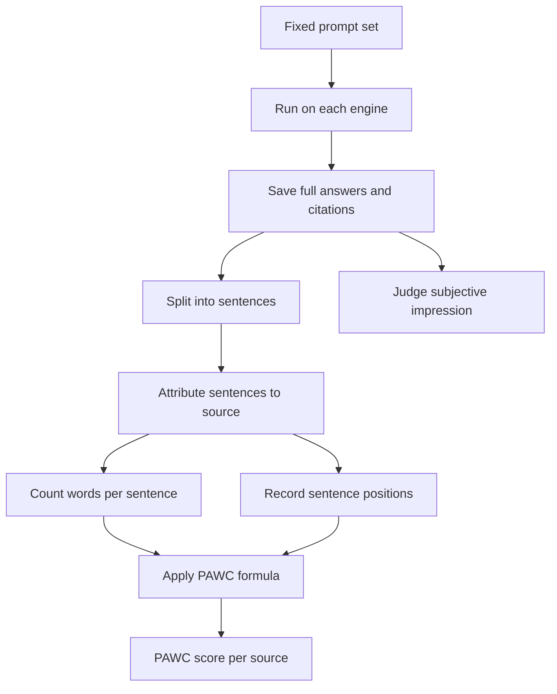

# Using Generative Engine Visibility Metrics

> Compute PAWC, Subjective Impression and brand-level rates on a fixed prompt set to show how prominently a source appears in AI answers.

## At a Glance

| Field | Value |
|-------|-------|
| Difficulty | Intermediate |
| Time to Learn | Half a day for a first baseline, then about an hour per repeat run |
| Outcome | A repeatable measurement sheet that reports per-source PAWC, impression scores and citation rates by query class for a fixed prompt set. |
| Prerequisites | A list of target pages or brand names to track, Access to the generative engines your audience uses, A spreadsheet or script that can split text into sentences and count words, Basic comfort with exponents and ratios |
| Part of | [Generative Engine Optimization \(GEO\)](../../methods/generative-engine-optimization-geo/METHOD.md) |

## Overview

Measuring visibility in AI answers means scoring how much of a generated response depends on your source and how early that material appears, not only whether your link shows up. This page covers the arithmetic and the reporting. For background on where GEO came from and how it compares with SEO, see the [Generative Engine Optimization method page](https://tryhamster.com/methods/generative-engine-optimization-geo).

The research core comes from the original GEO paper, which scores a source by the share of response words attributed to it and discounts sentences that appear later in the answer ([the GEO paper's impression metrics](https://arxiv.org/html/2311.09735v3)). A later critical survey summarizes the three metrics from that work as Word Count, Position-Adjusted Word Count (PAWC) and Subjective Impression, the last being an LLM judgment inspired by G-Eval ([critical survey of GEO research](https://arxiv.org/html/2607.14035v1)). Practitioners have added brand-level measures such as Share of Model, Generative Position and Query Coverage ([Foundation's GEO guide](https://foundationinc.co/lab/generative-engine-optimization)), plus citation rate tracked separately for groups of prompts ([the 2026 GEO playbook](https://wetheflywheel.com/en/ai-search/generative-engine-optimization)).

Know which kind of metric you are reporting. The formulas were defined in a controlled research setup, while the monitoring metrics come from later practitioner guides, and no single standardized protocol ties the two together ([Foundation's metric definitions](https://foundationinc.co/lab/generative-engine-optimization)).

| Metric | What it measures | Origin | Common misuse |
|---|---|---|---|
| PAWC | Share of answer words citing a source, discounted by position | Paper ([GEO paper](https://arxiv.org/html/2311.09735v3)) | Reporting a score without the saved answer |
| Subjective Impression | LLM-judged relevance, influence and prominence | Paper ([GEO survey](https://arxiv.org/html/2607.14035v1)) | Trusting one judge run as ground truth |
| Share of Model | Percentage of category prompts where a brand appears | Practitioner ([Foundation](https://foundationinc.co/lab/generative-engine-optimization)) | Blending all prompt types into one number |
| Generative Position | Where a brand lands in an AI-generated list | Practitioner ([Foundation](https://foundationinc.co/lab/generative-engine-optimization)) | Treating first and fifth mention as equal |
| Query Coverage | Presence across related buyer-intent prompts | Practitioner ([Foundation](https://foundationinc.co/lab/generative-engine-optimization)) | Tracking only head prompts |
| Citation rate by query class | Citation rate per prompt group tied to key pages | Practitioner ([GEO playbook](https://wetheflywheel.com/en/ai-search/generative-engine-optimization)) | Reporting raw mention totals |

The inputs are your target prompts, the engines that matter to your audience, and the source URLs or brand names you want to track. The output is a measurement sheet: saved answers, per-source PAWC and impression scores, and brand-level rates broken out by query class. The decision it supports is whether a content change, a competitor move or an engine update shifted how prominently you appear, and for which intents. If you cannot trace a reported number back to a saved answer, the measurement has failed, whatever the number says.

## How It Works

Everything starts from a single saved answer. The original study compares how prominently a source appears in answers generated for the same information needs with and without optimization ([GEO paper methodology](https://arxiv.org/html/2311.09735v3)). Its practical translation is a pipeline: fix the prompts, run them, save every complete answer with its citations, attribute sentences to sources, count words and record positions, then apply the formula ([GEO paper, PAWC definition](https://arxiv.org/html/2311.09735v3)).

For a response r, let S_r be all its sentences and S_c the sentences citing source c. The unadjusted Word Count impression divides the words in cited sentences by the words in the whole response: `Imp_wc(c, r) = sum(|s| for s in S_c) / sum(|s| for s in S_r)` ([word count impression formula](https://arxiv.org/html/2311.09735v3)). PAWC multiplies each cited sentence's word count by an exponential position discount before dividing: `Imp_pwc(c, r) = sum(|s| * e^(-pos(s)/|S|) for s in S_c) / sum(|s| for s in S_r)`, where |s| is the sentence's word count, pos(s) its position and |S| the number of sentences in the response ([GEO paper, equation 3](https://arxiv.org/html/2311.09735v3)).

The consequence is that two sources credited with the same number of words can score differently depending on where those words sit, because earlier material gets more weight ([Rich Sanger's summary of the GEO metrics](https://richsanger.com/generative-engine-optimization-maximizing-visibility-in-ai)). One practitioner account ties this weighting to research showing that user attention follows a power-law distribution by position ([Elementera's reading of the paper](https://elementera.com/blog/generative-engine-optimization-what-geo-aeo-ai-search-paper-shows-your-business)). Dividing the exponent by the sentence count scales the discount to answer length, so a late sentence in a long answer is not wiped out.

Sources disagree on that detail. The paper's equation divides position by sentence count, while one practitioner audit writes the discount as e^(-pos(si)) with no normalization ([rawmktg's GEO audit notes](https://rawmktg.com/blogs/geo-foundation-audit)), which decays far faster. Pick one form, write it into your measurement sheet, choose whether positions start at 0 or 1, and never compare scores computed under different conventions.

Subjective Impression covers what counting misses. It is an LLM judgment inspired by G-Eval rather than a word tally ([critical survey of GEO metrics](https://arxiv.org/html/2607.14035v1)). The dimensions reported for impression evaluation include relevance to the query, influence on the answer's logic, uniqueness, positional prominence, volume contributed, likelihood of a click and information diversity ([Elementera's breakdown of impression dimensions](https://elementera.com/blog/generative-engine-optimization-what-geo-aeo-ai-search-paper-shows-your-business)). The output is an overall assessment of how meaningfully a source shapes the answer.

Brand-level metrics sit on top. Share of Model is the percentage of category prompts where a brand appears, Generative Position records placement in AI-generated lists, and Query Coverage checks presence across related buyer-intent prompts ([Foundation's GEO metrics](https://foundationinc.co/lab/generative-engine-optimization)). Comparability depends on holding the prompt set, engine, date, locale and answer conditions steady across runs, and the cited sources describe the metrics without a universal standard for those controls ([Foundation's guide](https://foundationinc.co/lab/generative-engine-optimization)).

## Step-by-Step Guide

### Step 1: Build a fixed prompt set by query class

List the information needs you care about and group them into classes, for example by product line, buyer stage or the page they map to. One practitioner guide recommends selecting 50 queries for high-value pages and tracking citation rate weekly across relevant engines ([the 2026 GEO playbook](https://wetheflywheel.com/en/ai-search/generative-engine-optimization)). Include related follow-up phrasings so you can later report query coverage, not only head terms. Freeze the list and give each prompt a stable ID.

If prompts drift between runs, every later comparison becomes noise.

> **Pro tip:** Store prompts in a versioned file and bump the version when you add or retire one, so reports can say which prompt set produced them.

### Step 2: Lock the run conditions

Decide which engines, locale, account state and time window each run uses, and record them alongside the prompt set version. Practitioners are advised to keep prompt set, engine, date, locale and answer conditions consistent across measurement runs ([Foundation's measurement guidance](https://foundationinc.co/lab/generative-engine-optimization)). No universal protocol exists for these controls, so your own written conditions are the standard. Note anything you cannot control, such as engine model updates.

That log is what lets you explain a sudden jump later.

> **Pro tip:** Use a fresh, logged-out or neutral session where the engine allows it, so personalization does not leak into the baseline.

### Step 3: Run prompts and archive complete answers

Run every prompt on every engine and save the full answer text plus its citation list, with a timestamp. The measurement workflow grounded in the paper depends on saving each complete answer and its citations before any scoring ([GEO paper workflow basis](https://arxiv.org/html/2311.09735v3)). Do not save only the citation list, because PAWC needs sentence text and order. Keep raw files immutable and do all scoring on copies.

> **Pro tip:** Name files by prompt ID, engine and date so any score in the report can be traced to its source answer in seconds.

### Step 4: Attribute sentences, count words, record positions

Split each answer into sentences and mark which ones cite the target source and each competitor. For every cited sentence, record its word count and its position in the answer, and record the total sentence count and total word count. Attribution follows the engine's inline citations, so decide in advance how to handle a sentence citing two sources. A common rule is to credit the sentence to both and flag it.

Spot-check a sample by hand, because sentence splitters mishandle lists and abbreviations.

> **Pro tip:** Treat each list item in an answer as a sentence and write that rule down; list-heavy answers otherwise distort positions.

### Step 5: Compute Word Count share and PAWC

Apply the unadjusted impression and the PAWC formula to each source in each answer, using the exponential discount defined in the paper ([GEO paper formulas](https://arxiv.org/html/2311.09735v3)). Report both numbers side by side. A source with a high word share but a low PAWC is being cited late; a gap in the other direction means short but early citations. Average per query class, not across the whole prompt set, so one class does not mask another.

### Step 6: Score Subjective Impression with a separate judge

Send each saved answer and the target source to an LLM judge with a rubric covering relevance, influence on the answer's logic, uniqueness, prominence, volume, click likelihood and diversity ([impression dimensions](https://elementera.com/blog/generative-engine-optimization-what-geo-aeo-ai-search-paper-shows-your-business)). The paper's version is an LLM judgment inspired by G-Eval ([critical survey of GEO metrics](https://arxiv.org/html/2607.14035v1)). Keep the rubric prompt fixed across runs. Hand-check a sample of judgments against your own reading of the answers before trusting trends.

> **Pro tip:** Run the judge twice on a subset; if scores swing widely between identical runs, tighten the rubric before scaling.

### Step 7: Roll up brand metrics and citation rates

From the same archive, compute Share of Model as the percentage of prompts in a category where the brand appears, Generative Position as its placement in listed answers, and Query Coverage across related prompts ([Foundation's GEO metrics](https://foundationinc.co/lab/generative-engine-optimization)). Express citations as a rate per query class rather than a raw count ([the 2026 GEO playbook](https://wetheflywheel.com/en/ai-search/generative-engine-optimization)). Put competitors in the same table. The final report should show, per class and engine, rate, position, PAWC and impression together.

> **Pro tip:** Show period-over-period change next to each rate, and mark any run where conditions changed so readers do not misread an engine update as a win.

## Best Practices

- Report PAWC and a citation rate together. Inclusion tells you whether you are present, PAWC tells you how much of the answer rests on you and how early, and one practitioner audit calls inclusion alone too crude a metric ([rawmktg's GEO audit](https://rawmktg.com/blogs/geo-foundation-audit)).
- Label every metric as research-defined or practitioner-defined. The formulas come from the GEO paper while share of model and query coverage come from later guides ([GEO paper](https://arxiv.org/html/2311.09735v3), [Foundation](https://foundationinc.co/lab/generative-engine-optimization)), and readers should not assume they were validated the same way.
- Segment every number by query class and engine. Visibility can differ across buyer intents and topic groups ([the 2026 ([source](https://foundationinc.co/lab/generative-engine-optimization)) GEO playbook](https://wetheflywheel.com/en/ai-search/generative-engine-optimization)), so a blended average can hide a collapse in the class that matters most.
- Document your PAWC convention in the report header. State whether positions start at 0 or 1 and which discount form you use, since the paper and at least one practitioner audit write the exponent differently ([rawmktg's formula](https://rawmktg.com/blogs/geo-foundation-audit)).
- Keep the judge model and rubric fixed for Subjective Impression, and revalidate on a hand-scored sample whenever you change either. An LLM judgment inspired by G-Eval is still a model output ([critical survey](https://arxiv.org/html/2607.14035v1)), and silent rubric drift looks exactly like a real trend.
- Archive raw answers indefinitely. Engines change, and the only way to recompute a metric under a corrected rule is to still have the original text.

## Common Mistakes

- **Treating a citation as a win regardless of what it contributes.** — A source can be cited while contributing little text or appearing late in the answer ([rawmktg's audit notes](https://rawmktg.com/blogs/geo-foundation-audit)). Pair inclusion with PAWC so a one-line mention at the bottom does not count the same as the opening paragraph.
- **Counting citations without accounting for position.** — The GEO metrics explicitly discount information appearing later in the response ([GEO paper](https://arxiv.org/html/2311.09735v3)). Record sentence positions during attribution, not afterwards, because they cannot be recovered from a citation list alone.
- **Reporting raw mention totals.** — Raw counts rise and fall with the number of prompts you ran. Convert mentions into a citation rate per query class as practitioner guidance recommends ([the 2026 GEO playbook](https://wetheflywheel.com/en/ai-search/generative-engine-optimization)).
- **Treating first and fifth mention in a list as equally visible.** — Generative Position exists because first-mentioned versus fifth-mentioned carries very different weight in how users read an answer ([Foundation's GEO guide](https://foundationinc.co/lab/generative-engine-optimization)). Report placement alongside presence for any list-style prompt.
- **Relying only on word counts.** — Word counts miss whether a source actually shaped the answer's reasoning. Add Subjective Impression, which is meant to capture relevance, influence, uniqueness, prominence, click likelihood and diversity ([Elementera's impression breakdown](https://elementera.com/blog/generative-engine-optimization-what-geo-aeo-ai-search-paper-shows-your-business), [critical survey](https://arxiv.org/html/2607.14035v1)).
- **Comparing runs made under different conditions.** — A different locale, engine version or prompt wording can move scores more than any content change. Log conditions with every run and only compare runs that share them ([Foundation's guidance on consistency](https://foundationinc.co/lab/generative-engine-optimization)).

## References

- [Examples](references/examples.md) — Worked examples and scenarios
- [FAQ](references/faq.md) — Frequently asked questions
- [Parent Method](../../methods/generative-engine-optimization-geo/METHOD.md) — Generative Engine Optimization \(GEO\)

## Related Skills

- [Designing Controlled GEO Experiments](../designing-controlled-geo-experiments/SKILL.md)
- [Adapting GEO Tactics Across Domains](../adapting-geo-tactics-across-domains/SKILL.md)
- [Running Iterative Black-Box Optimization Cycles](../running-iterative-black-box-optimization-cycles/SKILL.md)
- [Optimizing Content Presentation for Generative Search](../optimizing-content-presentation-for-generative-search/SKILL.md)
- [Building Source Authority and Citation Signals](../building-source-authority-and-citation-signals/SKILL.md)
- [Strengthening AI Answer Integration](../strengthening-ai-answer-integration/SKILL.md)
- [Structuring Content for AI Retrieval](../structuring-content-for-ai-retrieval/SKILL.md)

## Sources

- [Generative Engine Optimization \(GEO\): The 2026 Playbook](https://wetheflywheel.com/en/ai-search/generative-engine-optimization)
- [\[2607.14035\] Optimizing Visibility in Generative Engines: A Critical](https://arxiv.org/abs/2607.14035)
- [GEO: Generative Engine Optimization](https://arxiv.org/html/2311.09735v3)
- [Optimizing Visibility in Generative Engines: A Critical](https://arxiv.org/html/2607.14035v1)
- [What’s Generative Engine Optimization \(GEO\) \& How To Do It?](https://foundationinc.co/lab/generative-engine-optimization)
- [Generative Engine Optimization: What the GEO Study Found](https://richsanger.com/generative-engine-optimization-maximizing-visibility-in-ai)
- [Generative Engine Optimization: What the GEO Paper](https://elementera.com/blog/generative-engine-optimization-what-geo-aeo-ai-search-paper-shows-your-business)
- [How We Run a GEO Foundation Audit - rawmktg.](https://rawmktg.com/blogs/geo-foundation-audit)
