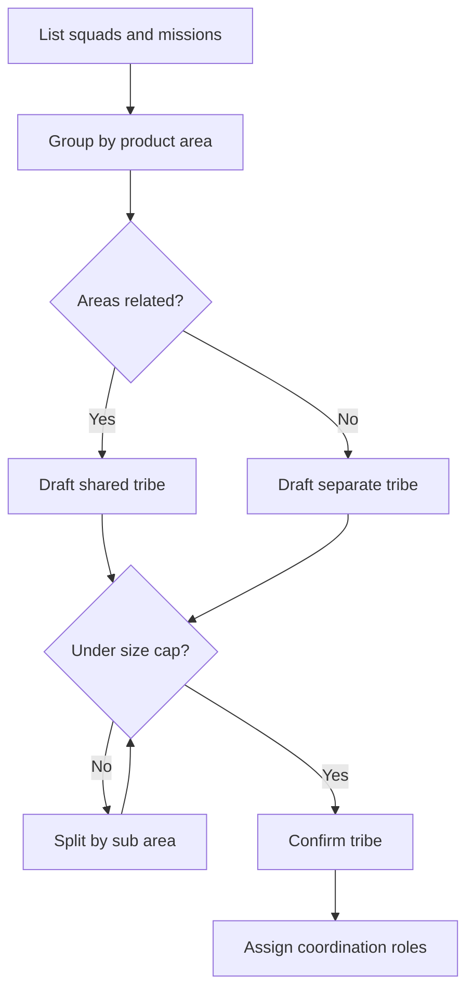

# Organizing Squads with the Spotify Tribe Model

> Group related squads into tribes of manageable size and give each tribe just enough coordination to stay aligned without slowing squads down.

## At a Glance

| Field | Value |
|-------|-------|
| Difficulty | Advanced |
| Time to Learn | 2-4 weeks for an initial tribe design, then quarterly reviews |
| Outcome | A tribe map where every squad sits in a tribe of related work, each tribe stays under a size cap, and each tribe has named coordination roles. |
| Prerequisites | Existing or planned squads with defined product areas, A current org chart showing who works in which squad, Visibility into which squads collaborate or depend on each other, Authority to change reporting and team groupings |
| Part of | [Spotify Squads](../../methods/spotify-squads/METHOD.md) |

## Overview

A tribe is the layer that sits above squads. The creators' material describes a tribe as [a collection of squads that work in related areas, such as the music player or backend infrastructure](https://blog.crisp.se/wp-content/uploads/2012/11/SpotifyScaling.pdf). The grouping exists so that squads keep their day-to-day autonomy while still having a nearby set of peers who share users, code and goals. For the background on the model as a whole, see the [Spotify Squads method page](https://tryhamster.com/methods/spotify-squads); this page covers only the work of drawing tribe boundaries and running a tribe.

Three decisions shape a tribe. The first is relatedness: which squads belong together because their work touches the same product area. The second is size: a later analysis describes Spotify tribes as [capped at roughly 100 people to preserve communication](https://stratrix.com/vault/spotify-squad-model), which keeps a tribe small enough that people can recognise each other and coordinate informally. The third is coordination: which roles and forums exist at tribe level, and which problems they handle so squads do not have to.

Getting these decisions wrong shows up quickly. A tribe drawn around a reporting line instead of a product area produces constant cross-tribe negotiation. A tribe that grows past its cap starts to need formal process to replace the informal contact it has lost. A tribe with no coordination roles leaves squads to resolve shared problems one conversation at a time.

The flow below is the decision sequence this skill follows. Start from squads and their missions, not from managers, and loop on splitting until every draft tribe fits under the cap you have chosen.

The output is a tribe map: each tribe named after the product area it covers, the squads inside it, its headcount against the cap, and the people who hold its coordination roles. That map becomes the input for placing chapters, which in the original design group specialists [across squads within one tribe](https://atlassian.com/agile/agile-at-scale/spotify), so tribe boundaries also decide who shares a chapter.

## How It Works

Tribes work because they shorten the distance between squads that need each other. When two squads share a user journey or a codebase, putting them in the same tribe means their people see each other's demos, sit in the same chapters and hear about changes early. The creators' examples, [the music player and backend infrastructure](https://blog.crisp.se/wp-content/uploads/2012/11/SpotifyScaling.pdf), show that a tribe can be organized around a user-facing product area or a technical platform. What matters is that the squads inside it are related by the work, not by who manages whom.

The size cap protects that closeness. A later description of Spotify's structure gives [tribes capped at roughly 100 people](https://stratrix.com/vault/spotify-squad-model) alongside squads of 6-12 people. Treat the cap as a design constraint rather than a quota: once a tribe outgrows the point where members can know each other, informal coordination stops working and the tribe starts adding meetings and approvals to compensate. For a sense of scale, Spotify's early organization has been described as roughly [250 engineers in 30 squads and 6 tribes across 3 development offices](https://slideshare.net/slideshow/empowering-engineering-talent/41128818?nway-=,). Your numbers will differ, and the dossier sources do not give a universal tribe count or squad count per tribe.

Coordination at tribe level should handle only what squads cannot. Accounts of Spotify describe two kinds of mechanism. For cross-squad issues, a Scrum@Scale case study reports that Spotify used [on-demand meetings, and chapters within a tribe met regularly](https://prod-resources.scrumalliance.org/Article/spotify-scrum@scale-case-study) to discuss shared impediments in areas like testing and web development. For larger problems, the same analysis describes [an Executive Action Team of Product Owners, Chapter Leads and Agile Coaches meeting daily](https://scrumatscale.com/spotify-a-scrumscale-case-study) to solve high-level, high-impact issues. Note that this framing comes from the Scrum@Scale community mapping its own concepts onto Spotify, not from the original 2012 paper.

Tribe boundaries are also dependency boundaries. The creators' material singles out [dependencies that cross tribe boundaries](https://blog.crisp.se/wp-content/uploads/2012/11/SpotifyScaling.pdf) as a priority for elimination, which makes the dependency picture a useful test of any draft tribe map. The inventory and triage process itself is covered in [Managing Dependencies Across Squads and Tribes](https://tryhamster.com/skills/managing-dependencies-across-squads); here you only use its results to check whether your boundaries are in the right place.

Finally, tribes are not permanent. The same later analysis notes that Spotify itself [moved beyond the original arrangement, adding more traditional management layers](https://stratrix.com/vault/spotify-squad-model) as the company grew. Expect to redraw tribes as products, headcount and strategy change, and build a review into the design from the start.

## Step-by-Step Guide

### Step 1: Inventory squads and their product areas

List every squad with its mission, the product area or platform it owns, its headcount and its main stakeholders. Use the squad's actual scope of work, not its current manager or department. Where a squad's area is vague, fix that first, because you cannot group squads whose ownership is unclear. The output is a one-line entry per squad that anyone could use to judge whether two squads are related.

> **Pro tip:** If a squad cannot describe its area in one sentence, send it through mission definition before placing it in any tribe.

### Step 2: Cluster squads by related area

Group squads whose work touches the same users, the same codebase or the same outcome. The creators' examples of tribes, such as the music player and backend infrastructure, show both user-facing and platform clusters are valid. Draft each cluster and name it after the area it covers, not after a leader. A good name makes the boundary self-explanatory to a new hire.

> **Pro tip:** Sort squads by user journey first and by shared code second; when the two conflict, favour the grouping that matches who ships changes together.

### Step 3: Check each cluster against a size cap

Add up headcount per draft tribe, including product owners, coaches and chapter leads who sit in the tribe. Compare it with the cap you have chosen; one description of Spotify used roughly 100 ([source](https://stratrix.com/vault/spotify-squad-model)) people. If a cluster is over, split it along a natural seam in the product area rather than cutting it in half by headcount. Rerun the check after every split until all tribes fit.

> **Pro tip:** Set a warning threshold below the cap, for example at around 80% of it, so you plan a split before the tribe is already strained.

### Step 4: Test boundaries against cross-tribe work

Take the current list of cross-squad dependencies and mark which ones would cross your proposed tribe lines. Many crossings on one boundary suggest the line is in the wrong place or two tribes should merge. A few crossings are normal, since some collaboration between tribes is useful. Adjust the map until the heavy, frequent dependencies sit inside tribes.

> **Pro tip:** Count blocking dependencies separately from slowing ones; a single blocking crossing matters more than several minor ones.

### Step 5: Assign tribe-level coordination roles

Decide who holds the tribe's shared context and who convenes it when squads face a common problem. Accounts of Spotify describe product owners, chapter leads and agile coaches meeting to solve high-impact issues. Name the people, the forum they use and the kinds of problem it owns. Keep the list short so the roles support squads instead of adding an approval layer.

> **Pro tip:** Write down what the tribe forum does not decide, such as squad backlogs or process choice, so it cannot drift into approving squad work.

### Step 6: Place chapters inside each tribe

With tribe boundaries set, group specialists of the same discipline across the tribe's squads into chapters. Check each discipline has enough people in the tribe to form a useful chapter. Where a discipline is too thin, decide whether it joins a chapter in a neighbouring tribe or relies on a guild. This step is where tribe size and chapter design meet, so revisit the map if chapters come out unworkable.

### Step 7: Schedule tribe reviews

Set a regular review of the tribe map, for example once a quarter, and trigger an extra one when a tribe nears its cap or a strategy shift creates a new product area. At each review, recheck headcount, cross-tribe dependencies and whether each tribe's name still describes its work. Record changes and the reason for them. The aim is gradual adjustment instead of occasional large reorganizations.

> **Pro tip:** Ask squad members, not only leads, whether they know most people in their tribe; a falling answer is an early sign the tribe is too big.

## Best Practices

- Draw tribes around product areas or platforms, the way the creators described them, rather than around existing managers. Reporting-line tribes inherit old silos and force squads that share work to coordinate across boundaries.
- Treat the size cap as a hard design constraint. Once a tribe is too large for people to know each other, it replaces informal contact with meetings, which erodes the speed the structure was meant to protect.
- Split along seams in the product, not along headcount. A split that cuts a user journey in half creates permanent cross-tribe dependencies that the new tribes will spend their time negotiating.
- Use dependency data to validate the map before announcing it. If the heaviest dependencies cross tribe lines, the boundary is wrong, and it is cheaper to fix on paper than after people have moved.
- Keep tribe-level coordination for problems squads cannot solve alone. The more a tribe forum decides, the less autonomy squads have, so define its remit narrowly and in writing.
- Name tribes after what they own. A clear name helps stakeholders find the right tribe and makes it obvious when a squad's work no longer fits.
- Plan for the map to change. Spotify itself later added management layers, so build in regular reviews instead of treating the first tribe design as final.

## Common Mistakes

- **Grouping squads by who currently manages them instead of by related product area.** — Start from each squad's mission and area, cluster by shared users and code, and only then decide reporting. Managers follow the tribe map, not the reverse.
- **Letting a successful tribe keep growing past its cap because splitting feels disruptive.** — Set a warning threshold below the cap and plan the split in advance along a product seam. Late splits happen under pressure and tend to cut through active work.
- **Creating a tribe-level forum that starts approving squad backlogs, releases or process choices.** — Write down what the forum decides and what it never decides. Its job is shared, high-impact problems, and squads keep ownership of their own delivery.
- **Ignoring cross-tribe dependencies when drawing boundaries.** — Overlay the dependency inventory on the draft map and move boundaries until heavy and blocking dependencies sit inside tribes. The creators treat cross-tribe dependencies as a priority to eliminate.
- **Copying another company's tribe count or tribe sizes as targets.** — Use published figures only as reference points. Derive your tribe count from your own product areas and headcount, and adjust as they change.

## References

- [Examples](references/examples.md) — Worked examples and scenarios
- [FAQ](references/faq.md) — Frequently asked questions
- [Parent Method](../../methods/spotify-squads/METHOD.md) — Spotify Squads

## Related Skills

- [Running Chapters for Discipline-Based Management](../running-chapters-for-discipline-excellence/SKILL.md)
- [Defining Squad Missions and Product Ownership Areas](../defining-squad-missions-and-ownership/SKILL.md)
- [Forming Autonomous Cross-Functional Squads](../forming-autonomous-squads/SKILL.md)
- [Managing Dependencies Across Squads and Tribes](../managing-dependencies-across-squads/SKILL.md)
- [Building Guilds as Cross-Cutting Communities of Practice](../building-guilds-as-communities-of-practice/SKILL.md)
- [Balancing Squad Autonomy with Organizational Alignment](../balancing-autonomy-and-alignment/SKILL.md)
- [Adapting the Spotify Model to Your Organization](../adapting-spotify-model-to-your-organization/SKILL.md)

## Sources

- [Spotify's Squad Model of Organization \| Stratrix Vault](https://stratrix.com/vault/spotify-squad-model)
- [Discover the Spotify model](https://atlassian.com/agile/agile-at-scale/spotify)
- [Empowering Engineering Talent - an update from Spotify](https://slideshare.net/slideshow/empowering-engineering-talent/41128818?nway-=,)
- [Spotify: A Scrum@Scale Case Study](https://scrumatscale.com/spotify-a-scrumscale-case-study)
- [Scaling Agile @ Spotify - Crisp's Blog](https://blog.crisp.se/wp-content/uploads/2012/11/SpotifyScaling.pdf)
- [Spotify: A Scrum@Scale Case Study](https://prod-resources.scrumalliance.org/Article/spotify-scrum@scale-case-study)
