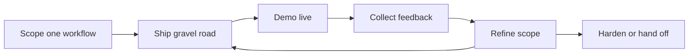

# Workflow skill: rapid prototyping with customer feedback

> Ship a narrow, working slice of one customer workflow, demo it live with real users, and refine scope from their feedback each cycle.

## At a Glance

| Field | Value |
|-------|-------|
| Difficulty | Intermediate |
| Time to Learn | Varies by engagement; for example, one to three weeks for a first working slice, then short repeating cycles. |
| Outcome | A working prototype of one workflow in real use by a small group of users, with a feedback log, scope decisions and a list of reusable components. |
| Prerequisites | A defined outcome and success metric agreed with the customer, Named executive sponsor and day-to-day users, Confirmed access to the relevant data, systems and security constraints, Working knowledge of the customer's workflow from domain discovery |
| Part of | [Forward Deployed Engineering \(FDE\)](../../methods/forward-deployed-engineering-fde/METHOD.md) |

## Overview

Prototyping solution workflows with users is the part of forward deployed work where discovery turns into something people can touch. Instead of writing a specification and disappearing for a quarter, the engineer builds a narrow working slice inside the customer's environment and lets real users push on it. For background on the operating model this skill belongs to, see the [Forward Deployed Engineering method page](https://tryhamster.com/methods/forward-deployed-engineering-fde).

The skill has a specific shape. A [field playbook for enterprise FDE teams](https://blockchain-council.org/ai/forward-deployed-engineering-playbook-best-practices-shipping-fast-enterprise) recommends targeting one narrow, high-value workflow, such as one team, one queue or one process step, rather than attempting to automate an entire business process, and defining scope as the smallest usable deployment that can test the intended outcome. The same guide's rule of thumb is to ship the "gravel road" first and iterate toward quality instead of waiting for a polished system. The org-design lessons drawn from Palantir by [Perspective AI](https://getperspective.ai/blog/palantir-forward-deployed-engineering-playbook-anthropic-openai-copying) point the same way: ship on day one and treat customer discovery as engineering work, so the prototype itself becomes the discovery instrument.

Why narrow and rough? Because the first version exists to produce learning, not coverage. A prototype that touches one queue gives you a clear before and after, a small group of users who can tell you exactly what broke, and a short path from feedback to fix. A prototype that tries to cover a whole process gives you vague reactions, negotiation over priorities, and a long wait before anyone uses it.

Live demos are the second half of the skill. The [enterprise FDE playbook](https://blockchain-council.org/ai/forward-deployed-engineering-playbook-best-practices-shipping-fast-enterprise) describes FDEs using live demonstrations to align stakeholders, expose misunderstandings and refine scope while building. A working screen in front of a sponsor and a frontline user surfaces disagreements between them that no requirements document would.

The third element is discipline about customization. That playbook lists over-customizing the initial solution, without asking whether the work can be standardized, reused or productized, as a common mistake, and advises challenging every customization request for reuse potential. [Perspective AI's summary](https://getperspective.ai/blog/palantir-forward-deployed-engineering-playbook-anthropic-openai-copying) frames the same idea as refusing the systems-integrator role.

Inputs: a defined outcome and success metric, named users, and confirmed access to data and systems. Outputs: a working slice used by a few real people, a log of feedback and scope decisions, and a short list of candidate reusable components. You know it went wrong when users have not touched the prototype after the first cycle, or when every request has been built as a one-off.

## How It Works

The skill runs as a loop, not a phase. Each pass narrows uncertainty about what the workflow actually needs, and each pass ends with a decision about scope.

**Entry conditions.** Before the loop starts, the [enterprise FDE playbook](https://blockchain-council.org/ai/forward-deployed-engineering-playbook-best-practices-shipping-fast-enterprise) has FDEs identify one high-value outcome, define its success metric, identify the executive sponsor and day-to-day users, confirm access to data and systems, and establish security and governance constraints. Skipping these does not make you faster. It means your first demo gets derailed by a missing data feed or a compliance objection you could have found in a day.

**Scope one workflow.** Choose a unit small enough that one person can describe its start and end: one team, one queue, one process step. The test is whether the smallest usable deployment of that unit can show movement on the success metric. If you cannot say what the metric would look like after the prototype runs for a while, the scope is still too wide or too vague.

**Ship the gravel road.** The gravel road is a version that works end to end on real data for the chosen workflow but is rough everywhere else: minimal interface, manual steps where automation is not yet proven, limited error handling. It is not a mockup. Users must be able to do their actual job with it, even if slowly. The [Palantir-derived lessons](https://getperspective.ai/blog/palantir-forward-deployed-engineering-playbook-anthropic-openai-copying) on shipping from day one reflect the same bet: working software in context teaches you more than a polished design reviewed in a meeting room.

**Demo live.** Put the running prototype in front of both the sponsor and the people who do the work, ideally in the same session. Walk through a real case, not a scripted happy path. The point is to expose misunderstandings: the sponsor expected a different output, the user does a step the process map never showed, the data means something other than its label suggests.

**Collect feedback.** Record each reaction as one of three things: a defect in what you built, a gap in your understanding of the workflow, or a request for something new. Only the first two feed the next cycle by default. New requests go through a reuse check: is this a pattern other customers or teams would need, or is it specific to this site?

**Refine scope.** Each cycle ends with an explicit decision. Iterate on the same slice, widen to an adjacent step, or declare the slice good enough and move to hardening. Widening too early is the usual failure; the playbook's warning about over-customizing the initial solution applies here because every widening adds surface area that may never generalize.

**Exit.** When the slice reliably moves the success metric and users rely on it, it leaves the prototype loop. Production hardening belongs to [deploying and operating production systems on-site](https://tryhamster.com/skills/deploying-and-operating-production-systems-on-site), and recurring patterns go to [generalizing deployment learnings into platform capabilities](https://tryhamster.com/skills/generalizing-deployment-learnings-into-platform-capabilities).

## Step-by-Step Guide

### Step 1: Confirm the entry conditions

Write down the single outcome the prototype should move, the metric that proves it, the executive sponsor and the day-to-day users by name. Confirm you can actually read and write the data and systems the workflow touches, and list the security and governance constraints that apply. This checklist mirrors what the [enterprise FDE playbook](https://blockchain-council.org/ai/forward-deployed-engineering-playbook-best-practices-shipping-fast-enterprise) has FDEs settle before building. Any item you cannot confirm becomes the first blocker to clear, not something to work around later.

> **Pro tip:** Test data access with a real query or API call on the first day; a promised credential is not access.

### Step 2: Choose one narrow workflow

From the processes you learned about in discovery, pick one team, queue or process step where the outcome is visible and the users are reachable. Prefer a workflow with a clear start and end and a painful current state users will readily describe. Reject candidates that depend on several other teams changing their behavior before any value appears. The output is a one-paragraph scope statement naming the workflow, its users and what changes for them.

> **Pro tip:** If you need a diagram with more than a handful of boxes to describe the workflow, split it and pick one piece.

### Step 3: Define the smallest usable deployment

Decide the minimum set of capabilities that lets a real user complete the chosen workflow on real data and lets you observe the metric. Cut everything else: extra views, edge-case automation, admin screens, integrations the slice does not need yet. Manual steps are acceptable where they let you test the outcome sooner. Write the cut list down so you can defend it when stakeholders ask why a feature is missing.

### Step 4: Ship the gravel road version

Build and put into use a rough version that works end to end for the chosen workflow. Keep the interface plain and the code simple enough to change quickly, because the next demo will change it. Get it into the hands of a few named users in their real environment rather than a sandbox with sample data. The [enterprise FDE playbook](https://blockchain-council.org/ai/forward-deployed-engineering-playbook-best-practices-shipping-fast-enterprise) frames this as shipping the gravel road first and iterating toward quality.

> **Pro tip:** Set a time box before you start, for example one week, and ship whatever works when it expires.

### Step 5: Run live demos with sponsor and users

Demo the running prototype on a real case with both the sponsor and frontline users present. Let a user drive where possible, and watch where they hesitate or work around the tool. Ask what they expected at each step and note every place where expectations differ between the sponsor and the user. These sessions are how you align stakeholders and surface misunderstandings while you still have cheap options to change course.

> **Pro tip:** Avoid scripted happy paths; bring an awkward real case that exercises the edge conditions users mentioned in discovery.

### Step 6: Triage feedback and customization requests

Sort every piece of feedback into defects, understanding gaps and new requests. Fix defects and gaps in the next cycle. For each new request, ask whether it reflects a pattern other teams or customers would share or a site-specific preference, as the playbook's advice to challenge every customization request for reuse potential suggests. Park or decline site-specific requests that do not move the outcome metric, and tell the requester why.

> **Pro tip:** Keep a visible request log with the decision and reason next to each item, so declined requests do not resurface as surprises.

### Step 7: Decide to iterate, widen or harden

End each cycle with an explicit scope decision recorded in the log. Iterate on the same slice if users still struggle, widen to an adjacent step only when the current slice reliably moves the metric, and move to hardening when users depend on it. Hand recurring patterns to the platform team rather than keeping them in the prototype. If several cycles pass without the metric moving, revisit the outcome definition instead of adding features.

## Best Practices

- Tie every prototype to one outcome and one metric agreed before building. Without it, demos turn into taste debates and you cannot tell whether a cycle helped.
- Put real data in the first version. Sample data hides the quirks, gaps and meanings that decide whether the workflow actually works, and users disengage from a tool that does not show their own cases.
- Invite sponsor and frontline users to the same demo. Their disagreements are the most valuable thing a demo surfaces, and you only see them when both are in the room.
- Treat each demo as a discovery session, not a sign-off. Perspective AI's summary of Palantir lessons describes treating [customer discovery as engineering work](https://getperspective.ai/blog/palantir-forward-deployed-engineering-playbook-anthropic-openai-copying); the prototype is your best question.
- Write down what you cut and why. A visible cut list protects the narrow scope under pressure and later tells the platform team which gaps users actually felt.
- Run every customization request through a reuse check. The [enterprise FDE playbook](https://blockchain-council.org/ai/forward-deployed-engineering-playbook-best-practices-shipping-fast-enterprise) recommends distinguishing customer-specific work from components that can become reusable integrations or product features.
- Keep the code disposable until the slice proves itself. Investing in structure before users confirm the workflow means refactoring twice.

## Common Mistakes

- **Scoping the prototype as an entire business process.** — Target one team, queue or process step, as the [enterprise FDE playbook](https://blockchain-council.org/ai/forward-deployed-engineering-playbook-best-practices-shipping-fast-enterprise) advises. A narrow slice gives clear feedback and a short fix cycle; a broad one gives vague reactions and delays first use.
- **Polishing before anyone uses it.** — Ship the gravel road version and iterate toward quality. If the first user session happens after the interface is refined, you have spent effort on screens that the feedback may throw away.
- **Building every request as a one-off customization.** — The playbook names over-customizing the initial solution without considering reuse as a common mistake. Challenge each request, and refuse the systems-integrator role described in [Perspective AI's lessons](https://getperspective.ai/blog/palantir-forward-deployed-engineering-playbook-anthropic-openai-copying).
- **Demoing only to the sponsor.** — Sponsors describe the process they believe exists. Include the day-to-day users, let them drive, and watch for workarounds that reveal the real workflow.
- **Widening scope before the slice works.** — Only extend to adjacent steps once the current slice reliably moves the metric. Widening early multiplies surface area and hides which part is failing.

## References

- [Examples](references/examples.md) — Worked examples and scenarios
- [FAQ](references/faq.md) — Frequently asked questions
- [Parent Method](../../methods/forward-deployed-engineering-fde/METHOD.md) — Forward Deployed Engineering \(FDE\)

## Related Skills

- [Generalizing Deployment Learnings into Platform Capabilities](../generalizing-deployment-learnings-into-platform-capabilities/SKILL.md)
- [Integrating Heterogeneous Data Sources](../integrating-heterogeneous-data-sources/SKILL.md)
- [Facilitating Technical Customer Collaboration](../facilitating-technical-customer-collaboration/SKILL.md)
- [Conducting Domain Discovery with Customers](../conducting-domain-discovery-with-customers/SKILL.md)
- [Owning Outcome-Oriented Delivery End to End](../owning-outcome-oriented-delivery-end-to-end/SKILL.md)
- [Translating Operational Problems into Technical Requirements](../translating-operational-problems-into-technical-requirements/SKILL.md)
- [Deploying and Operating Production Systems On-Site](../deploying-and-operating-production-systems-on-site/SKILL.md)

## Sources

- [Forward Deployed Engineering Playbook for Enterprise](https://blockchain-council.org/ai/forward-deployed-engineering-playbook-best-practices-shipping-fast-enterprise)
- [Palantir's Forward-Deployed Engineering Playbook - Perspective AI](https://getperspective.ai/blog/palantir-forward-deployed-engineering-playbook-anthropic-openai-copying)
