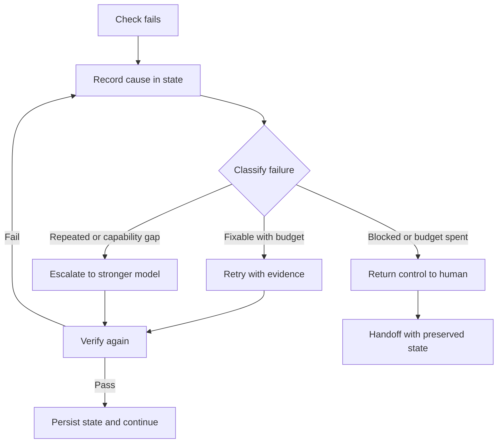

# How to do agent error recovery and failure handling

> Decide what happens after a failed check: feed evidence back, retry within bounds, escalate to a stronger model, or hand off to a human.

## At a Glance

| Field | Value |
|-------|-------|
| Difficulty | Intermediate |
| Time to Learn | 1-2 hours to design a failure policy for one loop |
| Outcome | A written failure policy that routes every failed check to a bounded retry, an escalation, or a human handoff, with the cause and state preserved. |
| Prerequisites | A loop with an explicit verification step that returns pass or fail, State persisted outside the model, such as a progress file or checkpoint, Defined success criteria for the task being run |
| Part of | [State–Questions–Action–Verify Loop](../../methods/state-questions-action-verify-loop/METHOD.md) |

## Overview

A verification step is only useful if something sensible happens when it says no. This skill covers the branch of the [State, Questions, Action, Verify loop](https://tryhamster.com/methods/state-questions-action-verify-loop) that runs after a check fails: what gets written down, how many times the agent may try again, when a more capable model takes over, and when a person gets the case back.

The core move is simple to state. A loop-engineering reference lays out that if [verification fails, the failure evidence goes back into state and the agent retries](https://huggingface.co/datasets/cy0307/awesome-loop-engineering/blob/refs%2Fpr%2F3/README.md), while a pass means the updated state is persisted and the next step is decided. The failure itself becomes input. The next attempt sees the failing test output, the rejected field or the diff that strayed out of scope, instead of starting from the same blind spot.

Retrying alone is not a policy. A practitioner guide on loop engineering argues that when the loop hits a dead end, the failure output should [preserve the current state, record the cause and return control to a human](https://changyou.medium.com/loop-engineering-turning-goal-and-loop-into-verifiable-ai-agent-workflows-0062fb44de92) rather than keep consuming resources. The same guide flags a common design gap: defining only a success exit and leaving out failure, escalation, budget or stall conditions.

Between retry and human handoff sits escalation. TypeSafe's SDE cascade cookbook describes a pattern where a cheap model extracts, per-field yes/no verifier questions check the result, and the case [escalates to a more expensive model](https://docs.typesafe.ai/cookbooks/sde_cascade) when a verifier signal fires. That gives you a middle rung: spend more compute before spending human attention.

The inputs to this skill are a failed check, the evidence it produced, the accumulated state and the remaining budget. The output is a routing decision plus a state update that makes the decision auditable later. You know it went wrong when the same failure repeats with no new information in state, when a loop runs until someone notices the bill, or when a human receives a handoff and has to reconstruct what happened from scratch.

This page does not cover how to write the checks themselves or how to decide the loop is done. Those belong to the skills on post-action verification and on termination rules. Here the check has already failed, and the question is what to do next.

## How It Works

Failure handling is a small decision procedure that runs every time a check returns fail. It has four parts: capture, classify, route and persist.

**Capture.** The failed check produces evidence: a failing test name and message, a verifier answer that flagged a field, a diff that touched files outside scope. That evidence goes into the persistent state alongside the attempt number and what was tried. The loop-engineering reference lists the usual homes for state as a [progress file, database checkpoint, trace or issue comment](https://huggingface.co/datasets/cy0307/awesome-loop-engineering/blob/refs%2Fpr%2F3/README.md), and failure evidence belongs in the same place so it survives the next run.

**Classify.** Not every failure deserves the same response. A useful split is three buckets. Fixable failures have concrete evidence the agent can act on, such as a specific assertion or a missing field. Capability failures recur after retries with evidence, which suggests the current model cannot solve the case. Blocked failures need something the agent does not have: a permission, a decision, missing input, or an action that requires approval. The practitioner guide on loop engineering says approval points should be [defined before execution rather than improvised](https://changyou.medium.com/loop-engineering-turning-goal-and-loop-into-verifiable-ai-agent-workflows-0062fb44de92), so blocked cases should match a pre-written list, not a judgment call made mid-run.

**Route.** Fixable failures get a retry with the evidence attached, counted against a fixed budget. A loop-engineering resource recommends comparing recurring loops against a [bounded fixed-retry policy](https://huggingface.co/datasets/cy0307/awesome-loop-engineering/blob/main/FUTURE-DIRECTIONS.md) as a baseline, which is a reminder that the retry count should be explicit and measurable. Capability failures escalate. TypeSafe's cookbook shows the shape: verify with cheap per-field questions and [escalate to an expensive reasoning model](https://docs.typesafe.ai/cookbooks/sde_cascade) only when a verifier signal fires. Blocked failures, and anything still failing after escalation, return to a human.

**Persist.** Whatever the route, the state is written before the next action. Every retry, escalation and handoff should leave a record of cause, evidence and decision. The same resource recommends reporting [unsuccessful runs, human interventions and verifier ownership](https://huggingface.co/datasets/cy0307/awesome-loop-engineering/blob/main/FUTURE-DIRECTIONS.md), which is only possible if the failure branch writes them down.

One caution shapes the whole design: the verifier can be wrong too. A survey of robot-policy verifiers treats verifier design as its own research problem and describes KnowNo, which [requests human assistance when multiple actions remain plausible](https://arxiv.org/html/2609.09250v1). Uncertainty is itself a reason to route to a person, not only a hard fail.

## Step-by-Step Guide

### Step 1: Capture the failure evidence

When a check fails, collect the concrete output it produced, not a summary. For a test, that is the test name, assertion and error text. For a verifier question, it is which field was flagged and what the question asked. Store the attempt number and the action that preceded the failure. Without this, the next attempt has nothing new to work with.

> **Pro tip:** Keep raw evidence and a one-line cause separately, so both the agent and a human reviewer can read the record quickly.

### Step 2: Write the cause into persistent state

Append the evidence and a short cause to the same artifact that holds the loop's progress, such as a progress file, checkpoint or issue comment. Do this before choosing the next action, so a crash or timeout does not lose it. The next iteration reads state first, which means it sees what failed and why. State that lives only in the model's context disappears between runs.

### Step 3: Classify the failure

Sort the failure into fixable, capability or blocked. Fixable means the evidence points at a specific change the agent can make. Capability means the same kind of failure has recurred despite retries that included evidence. Blocked means the agent needs a permission, a decision or input it cannot get, or the next action is on the pre-defined approval list.

> **Pro tip:** If the verifier result is uncertain or several fixes look equally plausible, treat it as blocked and route to a person rather than guessing.

### Step 4: Retry within a fixed budget

For fixable failures, rerun the action with the failure evidence included in the input. Count each retry against a budget set before the loop starts, for example three attempts per step. Check that each retry actually changes something; an identical input will produce the same failure. When the budget is spent, move on to escalation or handoff instead of resetting the counter.

> **Pro tip:** Track a stall signal too: if two consecutive attempts produce the same failure evidence, stop retrying even if budget remains.

### Step 5: Escalate to a stronger model

When cheap retries do not fix the case, hand it to a more capable and more expensive model with the full state and failure history. This mirrors a cascade where a small model does the first pass and a stronger one takes over only when verification flags a problem. Run the same verification on the escalated result; a stronger model is not automatically right. Escalation should also have its own budget.

> **Pro tip:** Log which cases escalated and why. A high escalation rate usually means the cheap model is mis-scoped for the task.

### Step 6: Hand off to a human with preserved state

For blocked cases, or cases still failing after escalation, stop the loop and return control to a person. The handoff should include the goal, the current state, every attempt, the evidence from each failed check and the reason the loop stopped. The reviewer should be able to resume or close the case without rerunning anything to understand it. Record the human's decision back into state so the loop can continue from there if appropriate.

> **Pro tip:** Write the handoff as a structured note with fixed sections, such as goal, last state, attempts, cause and what is needed, so reviewers learn where to look.

## Best Practices

- Write the failure policy before the loop runs. Retry budget, escalation trigger and approval list should exist as configuration, because rules improvised mid-run are inconsistent and hard to audit.
- Make every retry carry new information. Attach the failure evidence to the next attempt's input; a retry that sees the same input as the failed one is just a slower way to fail again.
- Separate retry budgets from escalation budgets. Cheap retries and expensive escalations have different costs, so cap them independently and report how often each is used.
- Rerun the same verification after escalation. A stronger model changes who produced the answer, not whether it is correct, so the check that caught the original failure must pass again.
- Treat verifier uncertainty as a routing signal. When the check is unsure or several actions remain plausible, route to a person, because acting on a low-confidence verdict moves the error downstream.
- Record human decisions back into state. When a person resolves a handoff, their decision and reasoning become part of the case history, which lets the loop resume and lets you review patterns later.

## Common Mistakes

- **Retrying without a feedback signal that can tell success from failure.** — Confirm the loop has a test, evaluation, policy check or reviewer decision before allowing any retry. Without it, retries cannot converge and you have no evidence to feed back.
- **Defining only a success exit.** — Add explicit failure, escalation, budget and stall exits alongside the success condition. A loop with only a done condition runs until it succeeds or someone kills it.
- **Handing a case to a human with no context.** — Preserve the goal, state, attempts and failure evidence in the handoff. A reviewer who has to reconstruct the run will either redo the work or approve it without understanding it.
- **Treating the agent's own explanation of the failure as the cause.** — Record the check's actual output as the evidence and keep any agent-written summary secondary. Prose reports can be wrong in the same way the original action was.
- **Resetting the retry counter after escalation or on each new run.** — Keep attempt counts in persistent state and cap total attempts per case. Resetting counters hides dead ends and inflates cost.

## References

- [Examples](references/examples.md) — Worked examples and scenarios
- [FAQ](references/faq.md) — Frequently asked questions
- [Parent Method](../../methods/state-questions-action-verify-loop/METHOD.md) — State–Questions–Action–Verify Loop

## Related Skills

- [Checking Post-Action Results](../checking-post-action-results/SKILL.md)
- [Defining Verifiable Success Criteria](../defining-verifiable-success-criteria/SKILL.md)
- [Applying Loop Termination and Continuation Rules](../applying-loop-termination-and-continuation-rules/SKILL.md)
- [Formulating Typed Decision Questions](../formulating-typed-decision-questions/SKILL.md)
- [Representing Current Agent State](../representing-current-agent-state/SKILL.md)
- [Selecting and Executing Bounded Actions](../selecting-and-executing-bounded-actions/SKILL.md)

## Sources

- [SDE cascade - Introduction - TypeSafe AI](https://docs.typesafe.ai/cookbooks/sde_cascade)
- [Turning /goal and /loop into Verifiable AI Agent Workflows \| by](https://changyou.medium.com/loop-engineering-turning-goal-and-loop-into-verifiable-ai-agent-workflows-0062fb44de92)
- [FUTURE-DIRECTIONS.md · cy0307/awesome-loop-engineering](https://huggingface.co/datasets/cy0307/awesome-loop-engineering/blob/main/FUTURE-DIRECTIONS.md)
- [README.md · cy0307/awesome-loop-engineering at refs/pr/3](https://huggingface.co/datasets/cy0307/awesome-loop-engineering/blob/refs%2Fpr%2F3/README.md)
- [No Free Checker: A Survey of Verifiers for Robot Policies - arXiv](https://arxiv.org/html/2609.09250v1)
