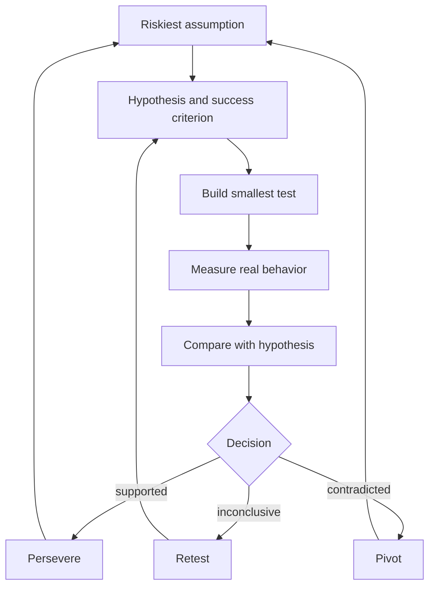

# How to Run the Build Measure Learn Loop End to End

> Run one full Build-Measure-Learn iteration, from riskiest assumption to a recorded pivot, persevere or retest decision, with short cycle time.

## At a Glance

| Field | Value |
|-------|-------|
| Difficulty | Intermediate |
| Time to Learn | A few days to a few weeks per cycle, depending on the test |
| Outcome | One completed, documented loop that ends in an explicit persevere, pivot or retest decision and sets up the next cycle. |
| Prerequisites | A product or business idea with assumptions that have not been tested with customers, Access to a small group of the customers the idea targets, A way to observe customer behavior, such as product analytics, a landing page or manual tracking, Basic familiarity with the Lean Startup Framework |
| Part of | [Lean Startup Framework](../../methods/lean-startup-framework/METHOD.md) |

## Overview

The build measure learn loop is the operating cycle of the [Lean Startup Framework](https://tryhamster.com/methods/lean-startup-framework): you turn an idea into a product or experiment, measure how customers respond, and use what you learn to decide whether to pivot or persevere, as [the official Lean Startup methodology page](https://theleanstartup.com/principles) describes it. This page covers running that cycle well, one full iteration at a time, while keeping the total time around the loop short.

Running a cycle is mostly a sequencing skill. [Lean Startup Co.'s outline of the method](https://leanstartup.co/resources/articles/lean-startup-method) gives the order: identify your assumptions, home in on the one carrying the biggest risk, determine how to test it (often with an MVP), state your hypothesis about the MVP, run the test, review the results, incorporate what you found, and iterate. Each stage has a defined input and output. Build turns a high-risk assumption into the smallest thing that can test it, measure turns that experiment into evidence about real outcomes, and learn turns evidence into knowledge, which is why [Umbrex's summary of the loop](https://umbrex.com/resources/frameworks/organization-frameworks/lean-startup-build-measure-learn-loop) calls it a disciplined cycle for turning assumptions into knowledge.

The practical twist is that you plan the loop backwards. [A summary of Ries's book](https://mooncamp.com/blog/the-lean-startup-book-summary) puts it as planning from what you need to learn, then running forwards while minimizing total time round the cycle. You fix the question first, then the metric that would answer it, then the smallest build that would produce that metric. Teams that start from the build tend to finish with a product and a pile of numbers but no answer.

The skill is also defined by how it ends. [RealGrowthMatters' guide to the loop](https://realgrowthmatters.com/learn/frameworks/lean-startup-build-measure-learn) stresses that building and collecting data without making a decision is not meaningful learning. A cycle is complete only when the team has written down what the evidence showed and what it will do next: persevere, pivot, or rerun a sharper test.

Use this skill whenever a product decision rests on an assumption nobody has tested with real customers: a new feature bet, a pricing change, a new segment, a new acquisition channel. You need a named assumption, access to target customers, and a way to observe what they do. The output is a dated record of one completed loop that changes the next decision. Neighbouring skills go deeper on single stages: [building minimum viable products](https://tryhamster.com/skills/building-minimum-viable-products), [choosing actionable over vanity metrics](https://tryhamster.com/skills/choosing-actionable-over-vanity-metrics) and [making pivot-or-persevere decisions](https://tryhamster.com/skills/identifying-pivot-or-persevere-decisions).

## How It Works

Every iteration passes through three stages, but the work starts before Build. [Lean Startup Co.](https://leanstartup.co/resources/articles/lean-startup-method) begins by homing in on the assumption that carries the biggest risk, and Yu-kai Chou's breakdown of the loop describes it as build a small test, measure real behavior, learn what is true, repeat. Riskiest means both uncertain and consequential: if it proves false, the plan does not survive.

The hypothesis and success criterion sit between the assumption and the build because the Learn stage needs something to compare against. Without them, almost any result can be read as encouraging. The three exits from Learn are the only legitimate endings for a cycle. Persevere and pivot both send you back to the top to pick the next riskiest assumption. An inconclusive result sends you back to rewrite the test, not to build more product.

| Stage   | Input                                       | Activity                               | Output                              |
| ------- | ------------------------------------------- | -------------------------------------- | ----------------------------------- |
| Build   | Riskiest assumption and testable hypothesis | Make the smallest test that answers it | MVP, prototype or experiment        |
| Measure | Experiment in use by target customers       | Track behavior with actionable metrics | Behavioral evidence                 |
| Learn   | Evidence, original hypothesis and criteria  | Compare, interpret, decide             | Persevere, pivot or retest decision |

In the Build stage, the output is the smallest product, prototype or experiment capable of testing the hypothesis, per [Umbrex](https://umbrex.com/resources/frameworks/organization-frameworks/lean-startup-build-measure-learn-loop). [The official methodology](https://theleanstartup.com/principles) is explicit that the MVP exists to begin learning as quickly as possible, not to stand in for a complete product.

In the Measure stage, the experiment goes to real customers, because the cycle measures customer behavior rather than internal opinion. [The Tessl lean-startup skill](https://tessl.io/registry/skills/github/wondelai/skills/lean-startup) frames this as learning through experiments on real behavior rather than feature requests, surveys or focus groups. Choose actionable metrics that support cause-and-effect reasoning; [RealGrowthMatters](https://realgrowthmatters.com/learn/frameworks/lean-startup-build-measure-learn) warns that vanity metrics such as cumulative totals create an appearance of progress. Where you can, compare cohorts over time instead of reading aggregate totals.

In the Learn stage, you set the evidence against the original hypothesis and goal. [GUVI's explainer](https://guvi.in/blog/lean-startup-methodology) describes the result as a decision about what to improve, change or stop. If the evidence supports the hypothesis, persevere. If it contradicts it, pivot and keep what the test taught you. If it is inconclusive, fold the new information into a revised test and run the loop again, as [Lean Startup Co.](https://leanstartup.co/resources/articles/lean-startup-method) recommends.

Cadence comes from planning in reverse and running forwards. Cycle time is the span from choosing the assumption to recording the decision. Shorten it by shrinking the build, never by skipping measurement or the decision. You know the cadence is slipping when the build keeps growing, the measurement window has no stop date, or the decision meeting keeps moving.

## Step-by-Step Guide

### Step 1: Name the riskiest assumption

List the assumptions your plan depends on: who the customer is, what problem they have, whether your solution solves it, how you reach them, and whether they will pay. Score each on two questions: how uncertain is it, and how badly does the plan fail if it is false. Pick the one that is highest on both, which is the starting point [Lean Startup Co.](https://leanstartup.co/resources/articles/lean-startup-method) prescribes. Resist picking the assumption that is easiest to test.

Write it as one plain sentence the whole team agrees with.

> **Pro tip:** If the team cannot agree on which assumption is riskiest, ask which one, if false, would make you stop the project entirely. That one usually wins.

### Step 2: Write the hypothesis and success criterion

Turn the assumption into a prediction about observable customer behavior, with a specific group, action and time window. Add the result that would count as support and the result that would count as a contradiction. [Lean Startup Co.](https://leanstartup.co/resources/articles/lean-startup-method) places formulating the hypothesis before running the test for exactly this reason. Agree now on what you will do in each case.

This is what lets the Learn stage end in a decision instead of a debate.

> **Pro tip:** State the thresholds as examples you commit to, such as a share of trial users who return in the second week, and write them where everyone can see them before launch.

### Step 3: Plan the loop backwards

Start from the decision you need to make, then name the metric that would inform it, then design the build that produces that metric. [A summary of Ries's book](https://mooncamp.com/blog/the-lean-startup-book-summary) describes this as planning the loop in reverse and running it forwards while minimizing time round the cycle. Set a stop date for measurement and a date for the decision meeting. Check that the planned build produces the data you named and nothing extraneous.

If it does not, redesign the build rather than the question.

> **Pro tip:** Put the decision meeting on the calendar during planning. A fixed date is the simplest guard against open-ended measurement.

### Step 4: Build the smallest test

Build only what is needed to test this hypothesis with real customers. [Umbrex](https://umbrex.com/resources/frameworks/organization-frameworks/lean-startup-build-measure-learn-loop) describes the build output as the smallest thing that can test a hypothesis, which may be a prototype, a landing page, a manual service or a feature flag rather than product. Cut every feature that does not change what you will measure. Instrument the test so the chosen metric is captured from the first user.

For scoping and MVP types in depth, see [building minimum viable products](https://tryhamster.com/skills/building-minimum-viable-products).

### Step 5: Measure real behavior

Put the test in front of the customers named in the hypothesis, not colleagues or friends. Record what they do rather than what they say they would do, since Yu-kai Chou and [the Tessl lean-startup skill](https://tessl.io/registry/skills/github/wondelai/skills/lean-startup) both treat observed behavior as the stronger evidence. Track the actionable metric you chose, broken out by cohort where possible. Keep the test stable during the window so results are interpretable.

Stop on the planned date.

> **Pro tip:** Resist tweaking the test mid-window. A change halfway through turns one experiment into two half-experiments that answer nothing.

### Step 6: Complete the learning step

Hold the decision meeting on schedule and set the evidence beside the hypothesis and the criteria written in step two. Classify the result as supported, contradicted or inconclusive, and take the matching action: persevere, pivot, or revise the test. [RealGrowthMatters](https://realgrowthmatters.com/learn/frameworks/lean-startup-build-measure-learn) is clear that collecting data without deciding is not learning. Write a short record: the hypothesis, the evidence, the classification, the decision and the next assumption.

Share it with anyone whose work depends on the outcome.

> **Pro tip:** Have someone who did not build the test read the evidence first. It reduces the pull to rationalize a result the builders hoped for.

### Step 7: Restart with the next assumption

Carry what you learned into the next cycle instead of starting from scratch. [Lean Startup Co.](https://leanstartup.co/resources/articles/lean-startup-method) closes its sequence with incorporating the findings and iterating, and [Umbrex](https://umbrex.com/resources/frameworks/organization-frameworks/lean-startup-build-measure-learn-loop) frames the loop as rapid repetition. After a persevere decision, the next riskiest assumption is usually one step further down the business model. After a pivot, re-rank the whole list, because the new direction changes what matters.

Compare this cycle's duration with the last one and look for the stage that stretched.

> **Pro tip:** Keep a running log of cycles with start and decision dates. Rising cycle time is the earliest sign the build is growing again.

## Best Practices

- Test the assumption most capable of killing the idea first. A comfortable, low-risk assumption produces a pass that tells you little, which is why Yu-kai Chou flags it as a common trap.
- Plan backwards from the question you need answered. Deciding the metric before the build keeps the build small and guarantees the data you collect maps to a decision, the approach summarized in [this book summary](https://mooncamp.com/blog/the-lean-startup-book-summary).
- Write the success criterion and pivot criteria before launch. Criteria set afterwards drift toward whatever the data shows, and [the Tessl lean-startup skill](https://tessl.io/registry/skills/github/wondelai/skills/lean-startup) warns that missing pivot criteria let teams rationalize weak results.
- Prefer behavioral evidence to stated intent. People predict their own behavior poorly, so observed actions from the target group are the evidence the loop runs on, per Yu-kai Chou.
- Read metrics by cohort rather than as running totals. Comparing groups over time shows whether changes are improving behavior, while cumulative numbers only ever go up, a distinction [RealGrowthMatters](https://realgrowthmatters.com/learn/frameworks/lean-startup-build-measure-learn) draws between actionable and vanity metrics.
- Shorten cycles by shrinking the build, never by skipping stages. The [official methodology](https://theleanstartup.com/principles) positions the MVP as the fastest way to begin learning, so the build is where time can safely come out.
- End every cycle with a written decision. A one-paragraph record of hypothesis, evidence and action makes learning cumulative across cycles and team members.

## Common Mistakes

- **Building too much before validating the critical assumption.** — [The Tessl lean-startup skill](https://tessl.io/registry/skills/github/wondelai/skills/lean-startup) names this as waste created before the team knows the idea is viable. Cut the build to what the current hypothesis needs and move everything else to a later cycle.
- **Starting an experiment without a hypothesis or success criterion.** — Without a prediction, results cannot be read as support or contradiction, a problem Yu-kai Chou highlights. Write the prediction and threshold in step two and refuse to launch until they exist.
- **Treating signups, downloads or page views as proof of learning.** — [RealGrowthMatters](https://realgrowthmatters.com/learn/frameworks/lean-startup-build-measure-learn) classes cumulative totals like these as vanity metrics when they are not tied to engagement, retention, conversion or a decision. Replace them with a metric that would change what you do next.
- **Asking customers what they would do and counting the answers as evidence.** — Stated intentions are not observed behavior, as [the Tessl lean-startup skill](https://tessl.io/registry/skills/github/wondelai/skills/lean-startup) points out. Design the test so customers take a real action, such as paying, returning or completing a task.
- **Measuring without completing the learning step.** — Collecting data and moving on leaves the loop open, which [RealGrowthMatters](https://realgrowthmatters.com/learn/frameworks/lean-startup-build-measure-learn) says does not count as learning. Schedule the decision meeting at planning time and do not start the next build until the decision is recorded.

## References

- [Examples](references/examples.md) — Worked examples and scenarios
- [FAQ](references/faq.md) — Frequently asked questions
- [Parent Method](../../methods/lean-startup-framework/METHOD.md) — Lean Startup Framework

## Related Skills

- [Making Pivot-or-Persevere Decisions](../identifying-pivot-or-persevere-decisions/SKILL.md)
- [Building Minimum Viable Products \(MVPs\)](../building-minimum-viable-products/SKILL.md)
- [Setting Up Innovation Accounting](../setting-up-innovation-accounting/SKILL.md)
- [Conducting Customer Discovery Interviews](../conducting-customer-discovery-interviews/SKILL.md)
- [Choosing Actionable Over Vanity Metrics](../choosing-actionable-over-vanity-metrics/SKILL.md)
- [Designing Validated Learning Experiments](../designing-validated-learning-experiments/SKILL.md)

## Sources

- [The Lean Startup Book Summary: 7 Key Takeaways](https://mooncamp.com/blog/the-lean-startup-book-summary)
- [The Lean Startup Method 101: The Essential Ideas](https://leanstartup.co/resources/articles/lean-startup-method)
- [lean-startup - wondelai • Skills • Registry](https://tessl.io/registry/skills/github/wondelai/skills/lean-startup)
- [Lean Startup Methodology: Build-Measure-Learn Explained](https://guvi.in/blog/lean-startup-methodology)
- [Lean Startup Build–Measure–Learn Loop \| Agile - Umbrex](https://umbrex.com/resources/frameworks/organization-frameworks/lean-startup-build-measure-learn-loop)
- [Lean Startup \& Build-Measure-Learn · Eric Ries' Validated](https://realgrowthmatters.com/learn/frameworks/lean-startup-build-measure-learn)
- [Methodology - The Lean Startup](https://theleanstartup.com/principles)
