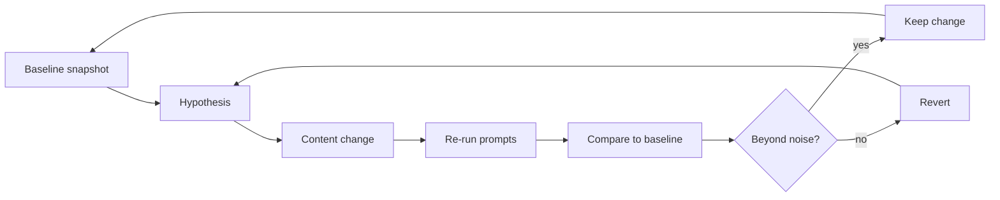

# Running Black Box Optimization for AI Search in Cycles

> Improve AI search visibility through repeated cycles of baseline, single change, re-measurement and a keep-or-revert decision.

## At a Glance

| Field | Value |
|-------|-------|
| Difficulty | Intermediate |
| Time to Learn | 2-4 hours per cycle, repeated over several weeks |
| Outcome | A change log of tested hypotheses with before-and-after visibility on a fixed prompt set, and a page that keeps only the edits that beat run-to-run noise. |
| Prerequisites | A page or set of pages you can edit and redeploy, Access to the generative engines your audience uses, A working visibility metric such as citation rate or position-adjusted word count, A shared log or spreadsheet for recording runs and decisions |
| Part of | [Generative Engine Optimization \(GEO\)](../../methods/generative-engine-optimization-geo/METHOD.md) |

## Overview

Generative engines do not publish how they pick and weight sources, so you cannot reason your way to a better citation rate. You can only observe inputs and outputs. This skill turns that constraint into a working routine: a fixed prompt set, a recorded baseline, one deliberate change, a re-run, and a keep-or-revert decision. For the definition and history of the method this skill sits inside, see [Generative Engine Optimization (GEO)](https://tryhamster.com/methods/generative-engine-optimization-geo).

The routine starts where a critical survey of the field says a practical cycle should start: by [defining a fixed set of target prompts and recording which pages, brands and competitors the engine cites or mentions for them](https://arxiv.org/html/2607.14035v1), an approach that also appears in [practitioner explanations of GEO](https://everything-pr.com/what-is-generative-engine-optimization-geo). Without that fixed set, every later comparison is between different questions, and any shift you see could come from the prompts rather than from your page.

Cadence matters because engines drift. One practitioner playbook suggests [selecting 50 queries for high-value pages and tracking citation rate weekly across relevant engines](https://wetheflywheel.com/en/ai-search/generative-engine-optimization). Weekly is a sensible starting rhythm, but the right cadence is whatever lets a change get picked up by the engines and gives you enough repeated runs to separate signal from noise.

Noise is the central difficulty. A critical review of GEO research reports [low source overlap, substantial run-to-run variability and persistent fidelity gaps in commercial generative-engine audits](https://arxiv.org/abs/2607.14035). The same prompt can cite you on one run and ignore you on the next with nothing changed. A cycle that reads a single run as a result will keep and revert edits more or less at random.

The same review also sets limits on what any cycle can prove. It found that [no technique in the reviewed evidence established a stable, longitudinal, cross-platform causal effect on organic discoverability or downstream user behavior](https://arxiv.org/abs/2607.14035), and that topical relevance and context position were the most reproducible levers while generic heuristics transferred poorly. Treat every kept change as a local, provisional win on the engines and prompts you tested, not as a rule.

The output of this skill is a change log. For each cycle it records the hypothesis, the exact edit, the before-and-after visibility on the fixed prompt set, the spread across repeated runs, and the decision. That log is what lets a team learn across cycles instead of rediscovering the same dead ends every quarter.

## How It Works

Each cycle is one pass through a closed loop. You never see inside the engine; you only compare what it outputs before and after a change you control.

**Baseline snapshot.** Run every prompt in the fixed set on each target engine and save the full answer, its citations, and every brand or competitor mentioned, which is the starting point a [critical survey of GEO describes for practical cycles](https://arxiv.org/html/2607.14035v1). Run each prompt more than once, for example three to five times, because a single answer tells you nothing about spread. Convert what you see into rates, since practitioner guidance recommends [tracking citation rate rather than raw count](https://wetheflywheel.com/en/ai-search/generative-engine-optimization). If you need richer scoring than inclusion, use the metrics described in [Measuring Generative Engine Visibility](https://tryhamster.com/skills/measuring-generative-engine-visibility).

**Hypothesis.** Write down one expected effect in one sentence: which edit, on which page, should move which metric on which prompt group. Favor levers with the best evidence behind them; a review of the field names [topical relevance and context position as the most reproducible levers](https://arxiv.org/abs/2607.14035). A hypothesis that names no prompt group and no metric cannot fail, so it cannot teach you anything.

**Content change.** Make exactly one change. Changing wording, structure and citations together means you cannot tell which one mattered, which is why controlled designs [change one experimental factor at a time](https://arxiv.org/html/2607.14035v1). Be careful with edits aimed purely at being quoted: the same review warns that [citation-oriented rewrites can impair retrieval](https://arxiv.org/abs/2607.14035), so a change that helps prominence can cost you inclusion.

**Re-run prompts.** Wait until the engines have plausibly picked up the new version, then re-run the same prompts on the same engines, locale and settings. The original paper defines its visibility metrics but, as dossier sources note, there is [no universal practitioner standard for these operational controls](https://arxiv.org/html/2311.09735v3), so you have to set and document them yourself.

**Compare, then keep or revert.** Compare the new rates against the baseline spread, not against a single baseline number. If the gain sits inside the range you saw across repeated baseline runs, treat it as noise and revert or extend the test. If it clears that range on the prompt group you targeted, keep it, and that result becomes the next baseline. Remember that rivals are optimizing too: the review reports that [competition can reduce individual optimization gains](https://arxiv.org/abs/2607.14035), so a flat result can still be a defensive win if competitors moved up around you.

## Step-by-Step Guide

### Step 1: Fix the target prompt set

List the information needs that matter commercially and write each as a prompt a real buyer would type, grouped by intent or page. Freeze this list for the life of the program so every cycle measures the same questions. One practitioner playbook suggests [selecting 50 queries for high-value pages](https://wetheflywheel.com/en/ai-search/generative-engine-optimization), which is a workable size for manual runs. Store the exact wording, because small phrasing changes can shift which sources appear.

Add new prompts only as a separate, versioned set so old comparisons stay valid.

> **Pro tip:** Tag each prompt with the page you want cited and an intent label, so later you can report citation rate per group instead of one blended number.

### Step 2: Record the competitor baseline

Run every prompt on each target engine and save the complete answer, cited URLs and every brand named. Record your own position and the competitors that appear above you, as the [critical survey of GEO recommends for starting a cycle](https://arxiv.org/html/2607.14035v1). Note the date, engine, locale and whether you were logged in. This snapshot is the reference every later cycle compares against.

It also shows you which competitor pages the engine already trusts for each prompt.

> **Pro tip:** Save raw answers, not just your tally. When a result surprises you three cycles later, the saved text is the only way to check what actually changed.

### Step 3: Measure your noise band

Before touching the page, repeat the baseline runs several times, for example three to five runs per prompt across a few days. Calculate the range of your citation rate for each prompt group. This range is your noise band; a later change has to clear it before you believe it. The need for this step comes from reported [substantial run-to-run variability in commercial engine audits](https://arxiv.org/abs/2607.14035).

Skipping it is the most common reason teams keep changes that did nothing.

> **Pro tip:** If the band is very wide for a prompt group, add more runs or more prompts to that group before testing, rather than testing anyway.

### Step 4: Write one hypothesis and make one change

State the edit, the page, the target prompt group and the metric you expect to move. Then make only that edit, leaving everything else on the page as it was. Changing a single factor is what makes the result interpretable, as [controlled GEO designs emphasize](https://arxiv.org/html/2607.14035v1). Prefer edits that improve topical relevance or bring the key answer earlier on the page, since those levers reproduced best in the reviewed research.

If you want a stricter setup with placebos and blinded judging, use [Designing Controlled GEO Experiments](https://tryhamster.com/skills/designing-controlled-geo-experiments).

> **Pro tip:** Write the hypothesis in the change log before you edit, including what result would make you revert. Deciding afterward invites rationalization.

### Step 5: Re-run under matched conditions

Give the engines time to see the updated page, then re-run the full prompt set on the same engines, locale and settings as the baseline. Use the same number of repeated runs per prompt so the spread is comparable. Record the date and any known engine changes during the gap. Include prompts you did not target as a control group.

If untargeted prompts moved as much as targeted ones, something outside your edit is driving the change.

### Step 6: Decide keep, revert or extend

Compare the new citation rate for the targeted group against the baseline noise band, not a single number. Keep the change if it clears the band on the targeted group and does not hurt other groups. Revert if it lands inside the band or drops inclusion elsewhere, since [citation-oriented rewrites can impair retrieval](https://arxiv.org/abs/2607.14035). Extend the test with more runs if the result sits right at the edge of the band.

A kept change becomes part of the new baseline for the next cycle.

### Step 7: Log and schedule the next cycle

Write the outcome in the change log with the hypothesis, the edit, before-and-after rates, the noise band and the decision. Mark reverted ideas clearly so nobody retries them next quarter without new reasoning. Pick the next hypothesis from what the latest snapshot revealed, such as a competitor gaining ground on a specific prompt group. Hold a steady cadence; one playbook suggests [tracking citation rate weekly across relevant engines](https://wetheflywheel.com/en/ai-search/generative-engine-optimization).

Re-baseline fully if an engine announces a major change, because old comparisons may no longer hold.

> **Pro tip:** Review the log every few cycles for patterns. Several small reverted edits pointing the same way can justify one larger, better-designed test.

## Best Practices

- Freeze the prompt set and version any additions. Comparisons across cycles only mean something if the questions are identical, and a silently edited prompt list makes every trend line unreliable.
- Measure noise before measuring effects. Commercial engines show [substantial run-to-run variability](https://arxiv.org/abs/2607.14035), so a change is only credible once it clears the range you already see with nothing changed.
- Report rates per prompt group, not raw mention totals. Practitioner guidance recommends [tracking citation rate rather than raw count](https://wetheflywheel.com/en/ai-search/generative-engine-optimization), and grouping by intent shows where a change helped and where it did not.
- Change one thing per cycle. Bundled edits can feel efficient, but when the number moves you will not know which part to keep, and you will carry dead weight into every future page.
- Track competitors in every snapshot, not just yourself. Because [competition can reduce individual optimization gains](https://arxiv.org/abs/2607.14035), your flat result may reflect rivals improving, and you need their positions to read your own.
- Keep claims local to what you tested. The reviewed evidence shows [no stable, longitudinal, cross-platform causal effect for any technique](https://arxiv.org/abs/2607.14035), so a win on one engine and prompt group is a hypothesis for others, not a rule.

## Common Mistakes

- **Reading a single run as a result and keeping the change because the page was cited once afterward.** — Repeat each prompt several times before and after the change and compare against the baseline spread. With reported [run-to-run variability in commercial engines](https://arxiv.org/abs/2607.14035), one citation is not evidence.
- **Editing the prompt list between cycles to add trending questions or reword old ones.** — Keep the core set frozen, as the [fixed-prompt approach to GEO cycles](https://arxiv.org/html/2607.14035v1) requires, and run any new prompts as a separately versioned group with its own baseline.
- **Rewriting large parts of a page in one cycle, then crediting the whole rewrite for any movement.** — Split the rewrite into single-factor edits and test them in sequence. It is slower, but it tells you which edits earn their place and which ones only add risk.
- **Optimizing purely to be quoted and never checking whether the page is still retrieved for its core prompts.** — Watch inclusion on untargeted prompts after every edit, because [citation-oriented rewrites can impair retrieval](https://arxiv.org/abs/2607.14035). Revert if prominence rises while inclusion drops.
- **Treating a visibility gain as proof of traffic or revenue impact.** — Report visibility and business outcomes separately. A cycle measures how the engine represents your page on tested prompts; it does not show that users clicked or bought.

## References

- [Examples](references/examples.md) — Worked examples and scenarios
- [FAQ](references/faq.md) — Frequently asked questions
- [Parent Method](../../methods/generative-engine-optimization-geo/METHOD.md) — Generative Engine Optimization \(GEO\)

## Related Skills

- [Designing Controlled GEO Experiments](../designing-controlled-geo-experiments/SKILL.md)
- [Measuring Generative Engine Visibility](../measuring-generative-engine-visibility/SKILL.md)
- [Adapting GEO Tactics Across Domains](../adapting-geo-tactics-across-domains/SKILL.md)
- [Optimizing Content Presentation for Generative Search](../optimizing-content-presentation-for-generative-search/SKILL.md)
- [Building Source Authority and Citation Signals](../building-source-authority-and-citation-signals/SKILL.md)
- [Strengthening AI Answer Integration](../strengthening-ai-answer-integration/SKILL.md)
- [Structuring Content for AI Retrieval](../structuring-content-for-ai-retrieval/SKILL.md)

## Sources

- [Generative Engine Optimization \(GEO\): The 2026 Playbook](https://wetheflywheel.com/en/ai-search/generative-engine-optimization)
- [What Is Generative Engine Optimization? Definition \& Pillars](https://everything-pr.com/what-is-generative-engine-optimization-geo)
- [\[2607.14035\] Optimizing Visibility in Generative Engines: A Critical](https://arxiv.org/abs/2607.14035)
- [GEO: Generative Engine Optimization](https://arxiv.org/html/2311.09735v3)
- [Optimizing Visibility in Generative Engines: A Critical](https://arxiv.org/html/2607.14035v1)
