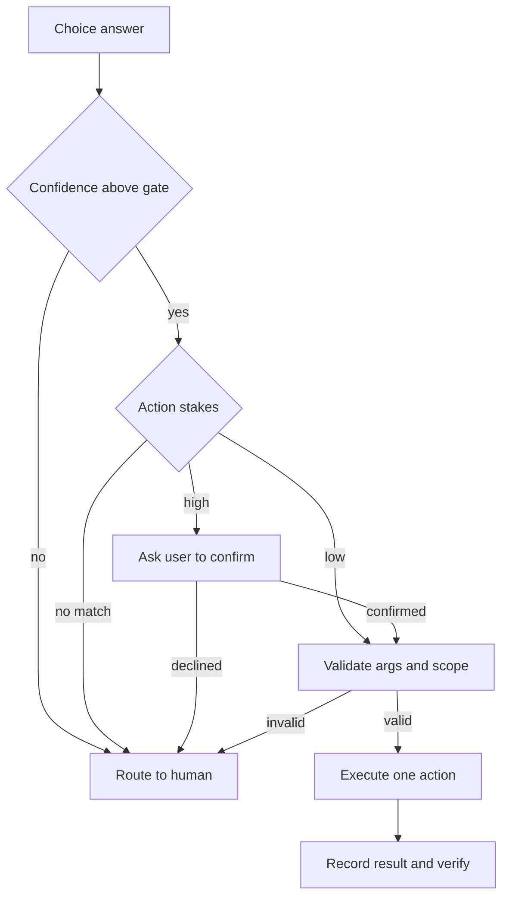

# Skill guide: bounded action selection in agent systems

> Turn a model's typed answer into one validated action from a closed set, gated by confidence, with a no-match route and a human fallback.

## At a Glance

| Field | Value |
|-------|-------|
| Difficulty | Intermediate |
| Time to Learn | 2-4 hours to design an action set and gating rules for one workflow |
| Outcome | A constrained action layer where every model decision maps to a validated, confidence-gated operation or an explicit handoff. |
| Prerequisites | A persisted representation of the current agent state, Typed decision questions (Choice, Score or yes/no) that return a confidence, A list of the operations your system is allowed to perform, A verification signal for each consequential action |
| Part of | [State–Questions–Action–Verify Loop](../../methods/state-questions-action-verify-loop/METHOD.md) |

## Overview

Bounded action selection in agent systems is the step where a model's judgment turns into something the system actually does. The model does not compose the command. It picks from a closed list of actions you defined in advance, your code checks that the pick is confident and valid, and only then does anything run. For background on how this step sits between building state and verifying results, see the [State, Questions, Action, Verify loop](https://tryhamster.com/methods/state-questions-action-verify-loop).

The central rule is that a choice should be represented as a typed action an interpreter or executor can carry out, not as unrestricted natural-language instructions, as [community guidance on TypeSafe question shapes](https://github.com/AbdelStark/awesome-typesafe) recommends. The same guidance advises keeping the state description short, making options non-overlapping, and including a no-match option when the task permits it. Those three habits prevent the two most common failures: the model inventing an operation you never wired up, and the model being forced to pick a wrong option because none fit.

The decision itself is not the whole story. [TypeSafe's System One documentation](https://docs.typesafe.ai/concepts/system-one) describes an application that builds state, asks independent questions, combines the answers with deterministic checks in code, and then routes the case for action or review. That split matters: the model supplies a judgment and a probability, while your code owns the policy about what a given judgment is allowed to trigger.

Confidence is where that policy lives. The [TypeSafe confidence-gated routing pattern](https://docs.typesafe.ai/patterns/confidence-routing) selects actions from question results, including routing a case, approving a transfer, or requesting human confirmation depending on confidence. Low-stakes actions can proceed on modest confidence, higher-stakes ones need more certainty or a confirmation step, and anything uncertain goes to a person.

The inputs to this skill are the typed answer (a choice plus its confidence), your action catalog, the current state, and a stakes tier for each action. The output is one of three things: an executed action with its result recorded, a confirmation request, or a handoff to a human with the state attached. You can tell the skill is failing when logs show operations outside the catalog, when forced choices appear on cases that clearly fit nothing, or when the system reports success because a call returned rather than because the intended change happened.

## How It Works

The action layer is a short pipeline with a gate in the middle. A generic agent loop, as laid out in an [agent architecture guide on loops and verification](https://aakashx.com/blog/agent-architecture-loops-planning-verification), runs observe, reason, choose action, act, observe result, update state, verify, then continue or terminate. Bounded selection is the choose and act portion of that loop, made strict.

**Selection.** You ask a Choice question against the current state, where each option corresponds to a handler in your code. The answer comes back as a typed value with a confidence. Because every option maps to a known handler, the executor never has to interpret prose, which is the reason [the awesome-typesafe guidance](https://github.com/AbdelStark/awesome-typesafe) warns against letting the model emit arbitrary or incompatible operations. A no-match or blocked option gives the model a legitimate way to say nothing fits.

**Gating.** Your code, not the model, decides what the answer permits. In the [TypeSafe confidence-routing example](https://docs.typesafe.ai/patterns/confidence-routing), any action below 0.6 confidence routes to a human support agent, while a low-stakes action such as checking a balance treats 0.6 ([source](https://docs.typesafe.ai/patterns/confidence-routing)) confidence as sufficient. Higher-stakes actions, like approving a transfer, can require more confidence or an explicit user confirmation. The threshold values are yours to set per action; the documented example simply shows the shape.

**Validation.** A confident choice still carries arguments: an account, an amount, a file path. Before execution, check that the arguments are well formed and that the target is inside the allowed scope. [TypeSafe's System One page](https://docs.typesafe.ai/concepts/system-one) describes combining model answers with deterministic checks in code, and argument validation is exactly such a check. If validation fails, the action does not run; the failure is recorded in state and the case is rerouted.

**Execution and hand-off to verification.** The executor runs one operation, records what it attempted and what came back, and then observes the environment again. The [agent architecture guide](https://aakashx.com/blog/agent-architecture-loops-planning-verification) recommends assigning every consequential action an expected outcome, executing it, observing the result, and verifying against that expectation, using fresh post-action evidence rather than a stale observation.

The routing logic looks like this:

Two design choices keep this reliable. First, every branch ends in a defined place, including the unhappy ones, so the loop never stalls on an answer it cannot handle. Second, the policy is readable in one spot: someone reviewing the system can see which actions run automatically, which need confirmation, and which always go to a person, without reading prompts.

## Step-by-Step Guide

### Step 1: Define the typed action catalog

List every operation the agent may perform in this workflow and give each a stable identifier, a handler in code, and a typed argument schema. Treat the list as closed: if an operation is not in the catalog, the agent cannot do it. This follows the guidance to represent choices as typed actions an executor can carry out rather than free-form instructions. Keep each action narrow enough that its expected outcome can be stated in one sentence.

Broad actions like handle the request hide multiple operations and make verification vague.

> **Pro tip:** If you cannot write the expected post-action state for an action in one line, split it into smaller actions.

### Step 2: Make options non-overlapping and add no-match

Review the catalog as a set of Choice options and check that no two options could both be correct for the same state. Overlap produces unstable picks and confidence split between near-duplicates. Add a no-match or blocked option so the model can decline rather than force a fit. Write each option label so it describes the situation it applies to, not just the verb.

A reviewer should be able to classify a sample case into exactly one option.

> **Pro tip:** Take a handful of real past cases and classify them by hand; any case you hesitate on points to an overlap or a missing option.

### Step 3: Assign stakes tiers and confidence gates

Sort actions into tiers by reversibility and impact, for example read-only, reversible writes, and irreversible or financial actions. Set a confidence gate per tier and decide which tiers need explicit user confirmation even above the gate. The documented TypeSafe pattern routes anything below 0.6 ([source](https://docs.typesafe.ai/patterns/confidence-routing)) confidence to a human while treating that level as enough for a low-stakes balance check. Stricter tiers can use a higher gate, for example 0.8 or 0.9, which you should tune against logged outcomes.

Record the tier and gate beside each action in code so the policy is auditable.

> **Pro tip:** Start conservative on irreversible actions and loosen only after reviewing logged cases where the human route agreed with the model.

### Step 4: Ask the Choice question against current state

Build a short, current state containing only what the decision needs: the user message, relevant records, and any policy text. Ask the action-selection question with the catalog as its options. If other judgments matter, such as urgency or policy eligibility, ask them as separate independent questions rather than folding them into the action choice. Capture the chosen option and its confidence as typed values.

Store the question, options and answer with the case so later review can reconstruct the decision.

### Step 5: Gate and route the answer

Apply the rules in code: below the gate or no-match goes to a human, low-stakes actions proceed to validation, and high-stakes actions trigger a confirmation request first. Combine the model answer with deterministic checks you already have, such as account status or permission flags, before allowing the action. A declined confirmation is a routing outcome, not an error, and should go to a human or back to state. Every path should end in a named handler.

If you find an answer your router cannot place, the router has a gap.

> **Pro tip:** Log the branch taken for every case; the distribution across branches tells you whether gates are too loose or too tight.

### Step 6: Validate arguments and scope

Check every argument against its schema and against the allowed scope before calling the handler. Scope checks include whether the target record belongs to this user, whether an amount is within the permitted range, and whether a file path is inside the working area. A confident choice with an out-of-scope argument must not run. On failure, write the reason into state and reroute rather than silently correcting the argument.

Silent fixes hide model errors that you need to see.

> **Pro tip:** Keep validation deterministic and separate from the model call so it cannot be talked around by the input text.

### Step 7: Execute, record, and hand off to verification

Run exactly one operation, then record what was attempted, the arguments, and what the call returned. Observe the environment again to get fresh evidence of the effect. Compare that evidence with the expected outcome you wrote for the action in the catalog. A returned call is not proof that the intended change happened, so pass the fresh observation to your verification step.

Only after verification should the loop update state and decide whether to continue.

> **Pro tip:** Re-read the target after writing to it, for example fetch the record you just updated, instead of trusting the write response.

## Best Practices

- Keep the action set closed and typed. When the executor only accepts identifiers from the catalog, a malformed or invented operation fails fast at parse time instead of reaching production systems, which is why [the awesome-typesafe guidance](https://github.com/AbdelStark/awesome-typesafe) favours typed actions over natural-language instructions.
- Always offer a no-match or blocked option. Without one, a case that fits nothing is forced into the least-bad option, and the confidence on that wrong pick can still look acceptable.
- Put routing policy in code, not in the prompt. [TypeSafe's System One docs](https://docs.typesafe.ai/concepts/system-one) describe combining typed answers with deterministic checks and then routing; that keeps thresholds reviewable and prevents input text from changing what an answer is allowed to trigger.
- Set confidence gates per stakes tier rather than one global number. The [confidence-routing pattern](https://docs.typesafe.ai/patterns/confidence-routing) treats a balance check differently from a transfer approval, and your gates should reflect the cost of being wrong for each action.
- Execute one action per iteration. Single operations make the expected outcome clear and let verification attribute a failure to a specific step instead of a bundle.
- Write an expected outcome for every consequential action before it runs. The [agent architecture guide](https://aakashx.com/blog/agent-architecture-loops-planning-verification) ties verification to that expectation, and without it the verify step has nothing concrete to compare against.

## Common Mistakes

- **Letting the model emit arbitrary commands or tool calls instead of choosing from a defined set.** — Constrain the decision to a typed, validated action set, as [community TypeSafe guidance](https://github.com/AbdelStark/awesome-typesafe) advises. Anything outside the catalog should be impossible to execute, not merely discouraged.
- **Omitting a no-match or blocked outcome from the options.** — Add an explicit option for when nothing fits and route it to a human or back to state. Leaving it out forces an invalid choice whenever the state does not match any available operation.
- **Using a single confidence threshold for every action regardless of risk.** — Tier actions by reversibility and impact and gate each tier separately. The [TypeSafe routing example](https://docs.typesafe.ai/patterns/confidence-routing) shows a low-stakes action accepting a level of confidence that riskier actions should not.
- **Trusting a confident choice without checking its arguments and scope.** — Validate every argument against its schema and permitted scope in deterministic code before execution. A correct action with a wrong target is still a wrong action.
- **Verifying against a stale observation or treating a successful call as success.** — Observe the environment again after acting and compare fresh evidence with the expected outcome, as the [agent loop guide](https://aakashx.com/blog/agent-architecture-loops-planning-verification) recommends. The call returning only tells you it ran.

## References

- [Examples](references/examples.md) — Worked examples and scenarios
- [FAQ](references/faq.md) — Frequently asked questions
- [Parent Method](../../methods/state-questions-action-verify-loop/METHOD.md) — State–Questions–Action–Verify Loop

## Related Skills

- [Recovering from Verification Failures](../recovering-from-verification-failures/SKILL.md)
- [Checking Post-Action Results](../checking-post-action-results/SKILL.md)
- [Defining Verifiable Success Criteria](../defining-verifiable-success-criteria/SKILL.md)
- [Applying Loop Termination and Continuation Rules](../applying-loop-termination-and-continuation-rules/SKILL.md)
- [Formulating Typed Decision Questions](../formulating-typed-decision-questions/SKILL.md)
- [Representing Current Agent State](../representing-current-agent-state/SKILL.md)

## Sources

- [System One - TypeSafe AI](https://docs.typesafe.ai/concepts/system-one)
- [Confidence-gated routing - TypeSafe AI](https://docs.typesafe.ai/patterns/confidence-routing)
- [AbdelStark/awesome-typesafe: A curated list of official](https://github.com/AbdelStark/awesome-typesafe)
- [Agent Architecture: Loops, Planning, Verification, Termination](https://aakashx.com/blog/agent-architecture-loops-planning-verification)
