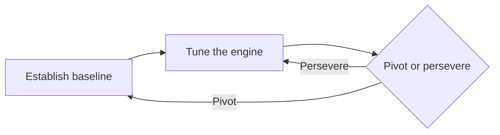

# How to Set Up Innovation Accounting for Your Product

> Track a new product's progress against a real-behavior baseline and cohort metrics, so stakeholders see learning instead of forecasts.

## At a Glance

| Field | Value |
|-------|-------|
| Difficulty | Intermediate |
| Time to Learn | About 2-4 weeks to set up, then ongoing each reporting period |
| Outcome | A small set of cohort-based metrics with a recorded baseline, a target for each, pre-set pivot criteria, and a recurring progress report tied to experiments. |
| Prerequisites | A working MVP or experiment in front of real customers, A written list of the business model's riskiest assumptions, Basic event tracking or a way to log customer actions, Agreement from stakeholders to review progress on a fixed cadence |
| Part of | [Lean Startup Framework](../../methods/lean-startup-framework/METHOD.md) |

## Overview

Innovation accounting is the part of Lean Startup that answers a question every funded team eventually faces: are we making progress, or just staying busy? It sits alongside the Build-Measure-Learn loop, the MVP, validated learning and the pivot-or-persevere decision as one of the [five core components of the Lean Startup principles](https://libraryofllm.com/sources/lean-startup-principles). For background on where the framework comes from, see the [Lean Startup Framework method page](https://tryhamster.com/methods/lean-startup-framework).

The problem it solves is that a new product has no reliable history. Revenue is near zero, the business plan is a guess, and conventional progress measures reward shipping. Innovation accounting replaces the plan's projections with numbers you actually observed. The practice starts by building an MVP to test your riskiest assumptions and using it to [establish a quantitative baseline of actual customer behavior rather than relying on forecasts](https://yukaichou.com/gamification-analysis/lean-startup-ries-build-measure-learn-mvp). From there, every experiment is judged by whether it moves that baseline toward the value your business model needs.

The work runs in three stages:

Establishing the baseline means picking the handful of metrics your model depends on, such as activation, retention or conversion to paid, and recording where real customers land today. Tuning the engine means running experiments aimed at one metric at a time and watching whether the numbers move. Deciding means comparing the trend against criteria you wrote down before the experiments started. A pivot sends you back to a new baseline, because the old numbers describe a strategy you have abandoned.

Two measurement habits keep the system honest. First, track behavior by cohort: [measuring by cohort lets you compare how different groups behave over time](https://tessl.io/registry/skills/github/wondelai/skills/lean-startup) instead of watching an aggregate total that grows as long as anyone signs up. Second, prefer [actionable metrics that support cause-and-effect reasoning over vanity metrics that only create the appearance of progress](https://tessl.io/registry/skills/github/wondelai/skills/lean-startup). [Cumulative signups and page views are the classic vanity examples](https://realgrowthmatters.com/learn/frameworks/lean-startup-build-measure-learn) when they are not connected to engagement, retention or a decision.

The output of this skill is a stable set of cohort metrics with a recorded baseline, a target for each, a log of experiments tied to those metrics, and a recurring progress report stakeholders can read without a translator. You will know it has gone wrong when the report shows rising totals, the team cannot say which experiment caused which change, and nobody can state the conditions under which they would pivot.

## How It Works

Innovation accounting forces three numbers into the open for every metric that matters: where you are (the baseline), where the business model needs you to be (the target), and how far the latest experiment moved you (the change). Everything else is bookkeeping around those three.

**Choosing what to account for.** Start from the business model, not from whatever the analytics tool shows by default. Write down the chain of customer behaviors that must happen for the model to work: a visitor starts a trial, a trial user reaches first value, a user returns, a returning user pays. Each link is a candidate metric. Keep only the links tied to your riskiest assumptions, because those are where a bad number would change your strategy. Measure what people do rather than what they say, since [observed behavior is treated as stronger evidence of demand than feature requests, surveys or focus groups](https://tessl.io/registry/skills/github/wondelai/skills/lean-startup).

**Qualifying each metric.** Lean Startup summaries call for [actionable, accessible and auditable metrics rather than vanity metrics](https://mooncamp.com/blog/the-lean-startup-book-summary). In practice, actionable means a change in the number would change a decision. Accessible means everyone on the team can read and understand it. Auditable means you can trace it back to real customer records and check it. A metric that fails any of the three gets dropped or rebuilt.

**Baselining.** The baseline comes from the MVP, not the plan: you [use the MVP to establish a quantitative baseline of actual customer behavior](https://yukaichou.com/gamification-analysis/lean-startup-ries-build-measure-learn-mvp). The first reading is often disappointing, and that is useful. It tells you how far the engine is from the target and which link in the chain is weakest.

**Tuning.** Each experiment names the metric it expects to move and the direction and size of the move. You run it on a fresh cohort, then compare that cohort with earlier ones. Because cohorts separate customers by start date or exposure, a gain can be attributed to the change rather than to overall traffic growth.

**Deciding.** Set the success threshold before an experiment launches, so you [compare observed behavior with the original hypothesis rather than changing the standard afterward](https://umbrex.com/resources/frameworks/organization-frameworks/lean-startup-build-measure-learn-loop). Do the same at the strategy level, because [failing to set pivot criteria in advance lets teams rationalize weak results and delay a necessary change](https://tessl.io/registry/skills/github/wondelai/skills/lean-startup). If tuning moves the metrics steadily toward target, persevere. If the numbers stay flat across several well-run experiments, treat that as the pivot signal you agreed on.

**Reporting.** The stakeholder view is one compact table per period: metric, baseline, target, latest cohort value, and the experiments run since the last report. It reports validated learning, which the Lean Startup treats as [the unit of progress](https://yukaichou.com/gamification-analysis/lean-startup-ries-build-measure-learn-mvp), rather than features shipped or hours spent.

## Step-by-Step Guide

### Step 1: Map the business model to customer behaviors

List the sequence of customer actions your business model needs, from first contact to payment or referral. Mark each action with the assumption it depends on, such as 'small agencies will return weekly'. Highlight the actions tied to your riskiest assumptions, since those carry the decisions. The output is a short chain of behaviors, usually a handful, not a full analytics taxonomy.

> **Pro tip:** If a behavior would not change your strategy whether it doubled or halved, leave it off the chain.

### Step 2: Qualify each metric as actionable, accessible and auditable

For each behavior, define the metric precisely: numerator, denominator, time window and which customers count. Test it against the three criteria. Ask whether a change would alter a decision, whether a new teammate could read it, and whether you could trace it to raw customer records. Rewrite or drop any metric that fails, and replace totals with rates wherever possible.

> **Pro tip:** Write the metric definition in one sentence. If it takes a paragraph, stakeholders will misread it.

### Step 3: Instrument tracking by cohort

Make sure every tracked event carries the customer's cohort, typically the week they started or the experiment variant they saw. Build views that show each metric per cohort rather than as a running total. Check the data against a sample of real accounts before trusting it. The output is a cohort table you can refresh each period without manual cleanup.

### Step 4: Establish the baseline from the MVP

Put the MVP in front of the customers named in your hypothesis and let enough of them move through the chain to produce a stable reading. Record the baseline value for each metric with the date and cohort it came from. Resist adjusting the numbers to match the business plan; the gap between the two is the finding. Share the baseline with stakeholders before any tuning starts so later progress has an agreed starting point.

> **Pro tip:** Freeze the baseline in a dated record. Teams that recompute it later tend to drift toward flattering definitions.

### Step 5: Set targets and pivot criteria in advance

For each metric, write the value the business model needs to work, for example the retention rate that makes acquisition costs pay back. Then write the strategy-level rule: what pattern of results after how many experiments would trigger a pivot discussion. Get stakeholders to sign off on both before tuning begins. These pre-commitments are what stop a team from explaining away flat results later.

> **Pro tip:** Phrase pivot criteria as a condition anyone can check, for example 'no cohort beats baseline retention after four experiments'.

### Step 6: Run tuning experiments one metric at a time

Pick the weakest link in the chain and design an experiment aimed squarely at it. State the expected change before launch and run it on a new cohort. Compare the new cohort with the baseline and earlier cohorts, and log the result whether it helped, hurt or did nothing. Move to the next experiment only after the log entry is written.

> **Pro tip:** Avoid stacking several changes into one cohort. If the number moves, you will not know which change earned it.

### Step 7: Report progress and make the call

On a fixed cadence, publish the table of metric, baseline, target and latest cohort value, with the experiments run since last time. Walk stakeholders through what was learned, not what was built. Check the results against the pre-set pivot criteria and record the decision: persevere, pivot, or run one more defined test. After a pivot, restart at a new baseline rather than comparing against numbers from the old strategy.

## Best Practices

- Derive metrics from the business model's riskiest assumptions, not from default dashboards. This keeps every number connected to a decision you might actually make.
- Report rates per cohort instead of cumulative totals. Totals rise whenever anyone signs up, so they hide whether newer customers behave better than older ones.
- Record the baseline before tuning starts and freeze it with a date. A fixed starting point is the only way to show stakeholders that an experiment moved something.
- Write targets and pivot criteria before the first experiment and get sign-off. Agreed rules make the pivot conversation about evidence rather than morale.
- Change one variable per cohort when tuning. Isolated changes let you attribute movement to a cause, which is the point of an actionable metric.
- Keep the stakeholder report to a single table plus a short learning summary. If the report needs a long explanation, the metrics are probably not accessible enough.
- Audit metrics against raw customer records periodically. Instrumentation bugs can fake progress as convincingly as vanity metrics.

## Common Mistakes

- **Using business-plan projections as the starting point for progress.** — Take the baseline from real MVP behavior. Projections describe what you hoped, and measuring against them turns every report into an argument about the plan.
- **Reporting cumulative signups, downloads or page views as proof of progress.** — Replace them with cohort rates such as activation or week-four retention. Ask of each number what decision it would change; if none, it is a vanity metric.
- **Deciding the success threshold after seeing the results.** — Write the expected change and the threshold before launch. Moving the bar afterward lets any result look like a win and teaches the team nothing.
- **Running several changes at once and crediting whichever one the team liked best.** — Tune one metric with one change per cohort. If speed demands bundling, label the result as untested for attribution and follow up with isolated tests.
- **Comparing post-pivot results with the pre-pivot baseline.** — Start a fresh baseline after a pivot. The old numbers describe different customers or a different value proposition, so the comparison is meaningless.

## References

- [Examples](references/examples.md) — Worked examples and scenarios
- [FAQ](references/faq.md) — Frequently asked questions
- [Parent Method](../../methods/lean-startup-framework/METHOD.md) — Lean Startup Framework

## Related Skills

- [Making Pivot-or-Persevere Decisions](../identifying-pivot-or-persevere-decisions/SKILL.md)
- [Running Build-Measure-Learn Cycles](../running-build-measure-learn-cycles/SKILL.md)
- [Building Minimum Viable Products \(MVPs\)](../building-minimum-viable-products/SKILL.md)
- [Conducting Customer Discovery Interviews](../conducting-customer-discovery-interviews/SKILL.md)
- [Choosing Actionable Over Vanity Metrics](../choosing-actionable-over-vanity-metrics/SKILL.md)
- [Designing Validated Learning Experiments](../designing-validated-learning-experiments/SKILL.md)

## Sources

- [The Lean Startup Book Summary: 7 Key Takeaways](https://mooncamp.com/blog/the-lean-startup-book-summary)
- [Lean Startup: What Build-Measure-Learn Really Means](https://yukaichou.com/gamification-analysis/lean-startup-ries-build-measure-learn-mvp)
- [lean-startup - wondelai • Skills • Registry](https://tessl.io/registry/skills/github/wondelai/skills/lean-startup)
- [Lean Startup Build–Measure–Learn Loop \| Agile - Umbrex](https://umbrex.com/resources/frameworks/organization-frameworks/lean-startup-build-measure-learn-loop)
- [Lean Startup \& Build-Measure-Learn · Eric Ries' Validated](https://realgrowthmatters.com/learn/frameworks/lean-startup-build-measure-learn)
- [The Lean Startup Principles — Eric Ries](https://libraryofllm.com/sources/lean-startup-principles)
