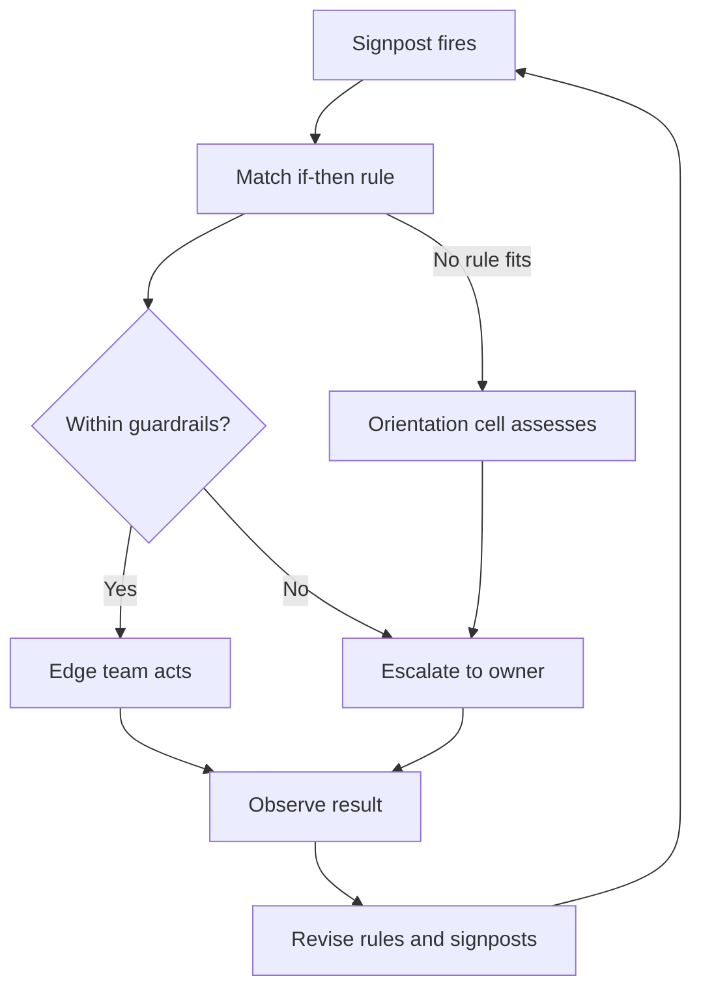

# How to Gain OODA Loop Speed Competitive Advantage

> Cut the waiting out of your decision cycle with predefined signposts, if-then rules, standing orientation cells and delegated authority.

## At a Glance

| Field | Value |
|-------|-------|
| Difficulty | Advanced |
| Time to Learn | 2-4 weeks to set up, then ongoing review each cycle |
| Outcome | A decision system where known triggers lead to fast, delegated action within guardrails, and only novel or high-risk situations escalate. |
| Prerequisites | Working knowledge of the four OODA phases, A clearly stated team mission and success metrics, Authority to delegate decisions within your area, Access to the data sources your key decisions depend on |
| Part of | [OODA Loop](../../methods/ooda-loop/METHOD.md) |

## Overview

Most teams do not lose time in the act itself. They lose it in the gaps between phases: waiting for someone to notice a change, convening the right people to interpret it, reopening a decision that was effectively made months ago, and waiting for approval from someone far from the work. This skill is about removing those gaps by design, so the loop runs faster without anyone having to rush. For the background on the loop and its origins, see the [OODA Loop method page](https://tryhamster.com/methods/ooda-loop).

There are four structural levers, one per phase. For Observe, a [practitioner guide to the OODA Loop](https://umbrex.com/resources/frameworks/strategy-frameworks/ooda-loop) recommends instrumenting the environment with data feeds, alerts, signposts and early-warning indicators tied to the decisions that matter, and defining in advance which signals matter instead of collecting unlimited data. For Orient, the same [guide recommends cross-functional orientation cells](https://umbrex.com/resources/frameworks/strategy-frameworks/ooda-loop), for example combining risk, operations, legal, finance and product perspectives, to interpret signals quickly. For Decide, it recommends translating signposts into explicit if-then rules. For Act, it recommends pushing decisions to the edge through mission command, clear intent, guardrails and escalation triggers, to avoid centralization bottlenecks.

There is a precondition. The [guide advises defining the mission, metrics, scope, target outcomes, risk appetite and constraints](https://umbrex.com/resources/frameworks/strategy-frameworks/ooda-loop) before attempting to accelerate the loop. Without that frame, a faster cycle only produces faster drift, because nobody can tell which signals matter or which actions are safe to delegate.

The working output of the orientation step is not a slide deck. A [guide to rapid decision cycles](https://goalsandprogress.com/ooda-loop-personal-decisions-master-rapid-decision-cycles) and the Umbrex framework both point to a shared assessment of what is happening, what assumptions are being made, what may change the assessment, and which response options fit. That assessment is what your rules and delegations are built on.

You can tell the skill is working when triggers fire and the people closest to the problem act without a meeting, when escalations are rare and concern genuinely new situations, and when the rule set changes after each cycle because results taught you something. You can tell it is failing when every alert still ends in a group call, or when speed has come from quietly dropping reviews that existed for good reason.

## How It Works

Think of cycle time as the sum of the waiting at each phase. A fast team is rarely one that thinks faster. It is one that has already done part of the thinking before the situation arrives, so the moment of change only needs recognition and a short check, not a fresh analysis.

The mechanism has four parts that feed each other.

Signposts compress Observe. A signpost is an observable indicator linked to a specific decision. A useful observation output, according to [the Umbrex OODA framework](https://umbrex.com/resources/frameworks/strategy-frameworks/ooda-loop), is a current view of the situation: the relevant variables, their recent changes, and the indicators that may trigger action. Because you chose the variables in advance, nobody has to decide what to look at when pressure rises.

Standing cells compress Orient. Interpretation slows down when the right perspectives have to be found and briefed from scratch. A standing cross-functional group that already knows the mission and the signposts can produce the shared assessment quickly. To keep speed from turning into shared blindness, the same source recommends [red teaming, diverse viewpoints, explicit hypothesis lists, premortems and Bayesian updating](https://umbrex.com/resources/frameworks/strategy-frameworks/ooda-loop) as defenses against confirmation bias and groupthink.

If-then rules compress Decide. An if-then rule links an observable condition to a predefined response, such as [shifting volume when specified operational indicators cross stated thresholds](https://umbrex.com/resources/frameworks/strategy-frameworks/ooda-loop). The value is that a known trigger no longer reopens the entire analysis. The debate happened once, calmly, when the rule was written.

Delegation compresses Act. Approval chains are often the longest wait in the loop. The fix is not removing safeguards: the [recommended approach is to make low-risk actions routine while reserving escalation for decisions outside established guardrails](https://umbrex.com/resources/frameworks/strategy-frameworks/ooda-loop). Guardrails say what the edge team may do on its own; escalation triggers say exactly when it must stop and hand up.

The flow below shows how a single signal moves through the system.

Two branches matter as much as the fast path. When no rule fits, the situation is new, and it goes to the orientation cell rather than being forced into the nearest rule. And every outcome, fast or escalated, feeds back into revising the rule set. That last step is what keeps the system honest. Rules written once and never revised slowly drift away from the environment they were meant to track, and the team ends up acting quickly on an out-of-date picture.

The practical test of the whole mechanism is where time goes. If most of the elapsed time between a signal and a response is now spent acting and observing results, the loop has been shortened. If it is still spent in meetings, inboxes and approval queues, one of the four parts is missing.

## Step-by-Step Guide

### Step 1: Frame the mission and risk appetite

Before speeding anything up, write down the mission, the metrics that define success, the scope, target outcomes, risk appetite and hard constraints, as the [Umbrex framework advises](https://umbrex.com/resources/frameworks/strategy-frameworks/ooda-loop). Keep it to one page that anyone on the team can read in a few minutes. This document is the reference every later rule and delegation is checked against. If two senior people read it and disagree about whether an action is allowed, it is not specific enough yet.

> **Pro tip:** State risk appetite as concrete examples of acceptable and unacceptable outcomes, not as adjectives like low or moderate.

### Step 2: Choose signposts tied to decisions

List the handful of recurring decisions that most affect your mission, then for each one name the observable indicators that should prompt it. Work backwards from decisions to data, not forwards from whatever dashboards already exist. The guide recommends [defining in advance which signals matter instead of collecting unlimited data](https://umbrex.com/resources/frameworks/strategy-frameworks/ooda-loop). An indicator with no decision attached is noise and should be dropped or parked.

> **Pro tip:** For each signpost, write the decision it feeds in the same line. If you cannot, delete the signpost.

### Step 3: Stand up an orientation cell

Name a small standing group that covers the perspectives your decisions touch, for example risk, operations, legal, finance and product, following the [recommendation for cross-functional orientation cells](https://umbrex.com/resources/frameworks/strategy-frameworks/ooda-loop). Brief them once on the mission and signposts so they never start from zero. Define their output as a short shared assessment: what is happening, the assumptions in play, what would change the view, and the response options that fit. Agree how fast they are expected to return that assessment when a signal has no rule.

> **Pro tip:** Rotate one member each cycle or assign a standing red-team role so the cell does not settle into a single comfortable view.

### Step 4: Write if-then rules for known situations

For each signpost, write a rule of the form: if this observable condition holds, then take this predefined response. Make the condition measurable and the response specific enough that two people would carry it out the same way. Rules pay off because they [reduce the need to reopen the entire analysis when a known trigger occurs](https://umbrex.com/resources/frameworks/strategy-frameworks/ooda-loop). Record who wrote each rule and why, so later reviewers can judge whether the reasoning still holds.

> **Pro tip:** Start with the situations you have already handled several times. Repetition is the best evidence that a rule is safe.

### Step 5: Draw guardrails and escalation triggers

For every rule, state the boundary inside which the edge team may act alone, and the conditions that force escalation. The aim, per the [Umbrex guidance on safeguards](https://umbrex.com/resources/frameworks/strategy-frameworks/ooda-loop), is to make low-risk actions routine while reserving escalation for decisions outside established guardrails. Name the escalation owner and how to reach them outside working hours. An escalation path nobody can reach quickly just moves the bottleneck.

### Step 6: Delegate to the edge with clear intent

Hand the rules and guardrails to the people closest to the signals and tell them the intent behind each rule, not only the rule text. Intent lets them handle small variations sensibly without escalating. This mirrors the recommendation to [push decisions to the edge through mission command, clear intent, guardrails and escalation triggers](https://umbrex.com/resources/frameworks/strategy-frameworks/ooda-loop). Make it explicit that acting within guardrails will be backed even if the outcome is poor, or people will escalate everything to protect themselves.

> **Pro tip:** Ask each edge owner to explain a rule's intent back in their own words before they take it on.

### Step 7: Review results and prune the rule set

After each cycle, look at what fired, what was done, what escalated and what happened next. Retire signposts that never fired or never changed a decision, and tighten rules whose actions produced surprises. Update the shared assessment so assumptions that proved wrong are marked, as the [rapid decision cycle guide](https://goalsandprogress.com/ooda-loop-personal-decisions-master-rapid-decision-cycles) frames the output around what may change the assessment. Treat a rising escalation count as a signal that the environment has moved beyond your rules.

> **Pro tip:** Keep the review short and recurring. A brief regular review beats a long annual overhaul that nobody schedules.

## Best Practices

- Tie every signpost to a named decision. This keeps observation focused and makes it obvious when an indicator can be retired because nothing depends on it.
- Write rules in calm conditions, never during the incident they cover. The whole point is to move the argument out of the high-pressure moment, where anchoring and haste distort judgment.
- Keep guardrails concrete and few. Edge teams act quickly only when they can check a boundary in seconds; long policy documents recreate the approval wait you were trying to remove.
- Build dissent into the orientation cell with red teaming or premortems, as [the Umbrex framework recommends](https://umbrex.com/resources/frameworks/strategy-frameworks/ooda-loop). Speed amplifies whatever view the group already holds, so the defense has to be structural rather than left to goodwill.
- Record the reasoning behind each rule alongside the rule. When the environment shifts, reviewers can tell whether the premise broke or only the threshold needs adjusting.
- Measure elapsed time from signal to action, not the speed of individual people. That shows which phase is actually holding the loop back and where the next structural fix belongs.

## Common Mistakes

- **Accelerating before the mission and risk appetite are defined.** — Write the frame first, as the [guide recommends](https://umbrex.com/resources/frameworks/strategy-frameworks/ooda-loop). Without it nobody can judge which signals matter or which actions are safe to delegate, so faster cycles only produce faster drift.
- **Collecting every available metric in the hope that something useful appears.** — Define in advance which signals matter and link each to a decision. Unlimited data slows Observe and buries the few indicators that should trigger action.
- **Getting speed by removing reviews and approvals wholesale.** — Keep necessary safeguards and move only low-risk actions into routine delegation, reserving escalation for anything outside the guardrails, per the [Umbrex guidance](https://umbrex.com/resources/frameworks/strategy-frameworks/ooda-loop). Speed built on missing safeguards tends to end in one costly error.
- **Forcing a new situation into the closest existing rule.** — When no rule clearly fits, route the signal to the orientation cell for a fresh shared assessment. Rules are for known situations; stretching them hides the fact that the environment has changed.
- **Treating the rule set as finished once it is written.** — Review what fired and what happened after each cycle, and prune or revise. A static rule set gradually encodes an outdated picture, so the team acts quickly in the wrong direction.

## References

- [Examples](references/examples.md) — Worked examples and scenarios
- [FAQ](references/faq.md) — Frequently asked questions
- [Parent Method](../../methods/ooda-loop/METHOD.md) — OODA Loop

## Related Skills

- [Detecting and Correcting Cognitive Biases in Orientation](../detecting-and-correcting-orientation-biases/SKILL.md)
- [Scanning the Environment for Relevant Signals](../scanning-environment-for-signals/SKILL.md)
- [Accelerating Decision Tempo Under Uncertainty](../accelerating-decision-tempo/SKILL.md)
- [Building Mental Models for Rapid Orientation](../building-orientation-mental-models/SKILL.md)
- [Executing Actions with Implicit Guidance and Control](../executing-with-implicit-guidance/SKILL.md)
- [Applying the OODA Loop to Business and Product Strategy](../applying-ooda-to-business-strategy/SKILL.md)
- [Disrupting an Opponent's Decision Cycle](../disrupting-opponent-ooda-loops/SKILL.md)

## Sources

- [OODA Loop \(Observe-Orient-Decide-Act\) Explained](https://umbrex.com/resources/frameworks/strategy-frameworks/ooda-loop)
- [Frequently Asked Questions](https://goalsandprogress.com/ooda-loop-personal-decisions-master-rapid-decision-cycles)
