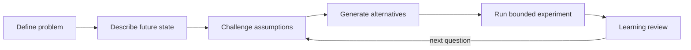

# Challenging Ideas in a Transformational Leadership Style

> Get your team questioning assumptions and testing new approaches through bounded experiments, without losing execution discipline.

## At a Glance

| Field | Value |
|-------|-------|
| Difficulty | Intermediate |
| Time to Learn | 2-4 weeks to run a first full cycle with a team |
| Outcome | A team that surfaces and tests its own assumptions through structured experiments while still meeting its commitments. |
| Prerequisites | A team with a recurring problem worth rethinking, Basic understanding of the Four I's of transformational leadership, Authority to approve small, time-boxed experiments |
| Part of | [Transformational Leadership](../../methods/transformational-leadership/METHOD.md) |

## Overview

Intellectual stimulation is the part of transformational leadership that turns a team from executing instructions into rethinking the work. For background on where the model came from and how its four components fit together, see the [Transformational Leadership method page](https://tryhamster.com/methods/transformational-leadership). This page is about doing the skill.

The core behavior is well described in the literature: leaders [stimulate followers to be innovative and creative by questioning assumptions, reframing problems, and approaching old situations in new ways](https://api.pageplace.de/preview/DT0400.9781135618896_A23805652/preview-9781135618896_A23805652.pdf). The leader is not the source of every idea. The leader creates conditions where the team produces ideas and tests them. One practical framing is that leaders [give people the broader picture and a way of working that lets them question conventional wisdom and develop fresh solutions to old problems](https://businessballs.com/leadership-styles/transformational-and-transactional-leadership). Without the broader picture, people cannot tell which assumptions matter. Without a way of working, questioning turns into open-ended debate.

Two safety conditions make the skill work. First, leaders [actively solicit new ideas and new ways of doing things while avoiding public correction or criticism of followers](https://files.eric.ed.gov/fulltext/EJ843441.pdf). People stop offering half-formed ideas the first time one earns them a public rebuke. Second, challenge has to be aimed at the work, not the person. A practitioner guide puts it as a rule of thumb: [challenge the work or assumption without attacking the person who proposed it](https://itechguides.com/what-is-transformational-leadership-a-model-for-sparking-innovation).

The skill also has a discipline side that is easy to skip. The same guide argues that intellectual stimulation should be [paired with clear roles, deadlines, standards, responsibilities, and consequences so that inspiration does not replace reliable execution](https://itechguides.com/what-is-transformational-leadership-a-model-for-sparking-innovation). A team encouraged to question everything but held to nothing will generate interesting conversations and miss its commitments.

You will know the skill is working when team members bring you a challenged assumption with evidence attached, when experiments end with a clear keep, change or drop decision, and when someone reports a failed test without hedging. You will know it has gone wrong when brainstorms repeat without decisions, when the same two people do all the questioning, or when delivery dates start slipping because every task has become an open question.

## How It Works

The skill runs as a cycle. Each stage produces an output the next stage depends on, and skipping a stage is the most common way the whole thing collapses into either vague brainstorming or unchanged habits.

The cycle starts with a concrete problem. A practitioner sequence is to [define a meaningful problem, explain why it matters, and describe the consequences of leaving it unchanged](https://itechguides.com/what-is-transformational-leadership-a-model-for-sparking-innovation). The output is a short problem statement the team can argue with.

Next comes the target. The leader [describes a specific future state by stating what will be observably different and which constraints must remain in place](https://itechguides.com/what-is-transformational-leadership-a-model-for-sparking-innovation). Constraints matter as much as the goal: they tell people which assumptions are open for challenge and which are fixed by regulation, budget or customer commitments.

With the frame set, the team questions assumptions. The working questions are [what the team treats as fixed, what evidence supports that belief, and which parts of the current process exist only because they have always existed](https://itechguides.com/what-is-transformational-leadership-a-model-for-sparking-innovation). The output is a list of assumptions, each tagged as supported by evidence or merely inherited.

Then the team generates options. Leaders can [ask followers to produce an alternative explanation or approach before selecting a preferred solution](https://itechguides.com/what-is-transformational-leadership-a-model-for-sparking-innovation), and they [invite dissent while separating disagreement with an idea from judgment of the person proposing it](https://itechguides.com/what-is-transformational-leadership-a-model-for-sparking-innovation).

The most promising option becomes an experiment. A bounded experiment should [specify a hypothesis, owner, time frame, resources, measures, decision rule, and learning review before testing begins](https://itechguides.com/what-is-transformational-leadership-a-model-for-sparking-innovation). Writing the decision rule first stops the team from reinterpreting results after the fact.

Finally, the learning review closes the loop and usually feeds a new question back into assumption challenging. What gets recognized here shapes the next cycle, so practitioners should [recognize useful evidence, honest reporting, and adaptation, not only experiments that produce a successful final result](https://itechguides.com/what-is-transformational-leadership-a-model-for-sparking-innovation).

The mistakes that break this cycle map directly onto corrective practices from the same [practitioner guide](https://itechguides.com/what-is-transformational-leadership-a-model-for-sparking-innovation):

| Common mistake | Corrective practice |
|---|---|
| Vague inspiration treated as strategy | State an observable future state and its constraints |
| Keeping processes because they always existed | Ask what evidence supports each fixed belief |
| Judging the person, not the idea | Separate disagreement with ideas from the proposer |
| Rewarding only successful outcomes | Recognize evidence, honest reporting and adaptation |
| Inspiring language without clarity | Keep roles, deadlines, standards and consequences explicit |

## Step-by-Step Guide

### Step 1: Define a meaningful problem

Pick one problem the team encounters repeatedly and write it down in plain terms. Explain why it matters to customers, colleagues or the mission, and describe what happens if nothing changes, following the sequence in this [practitioner guide](https://itechguides.com/what-is-transformational-leadership-a-model-for-sparking-innovation). The output is a statement of a few sentences that the whole team reads before any discussion. If people cannot agree on the problem, stop here and resolve that first, because alternatives generated against different problems cannot be compared.

> **Pro tip:** Test the statement by asking a team member to explain the cost of inaction back to you. If they cannot, the problem is not yet concrete enough.

### Step 2: Describe the future state and its constraints

State what will be observably different when the problem is solved and list the constraints that must stay in place. Constraints might be a compliance requirement, a fixed budget or a promised delivery date. This tells the team where questioning is welcome and where it is not, which keeps challenge productive. The output is a short target description with a separate constraints list.

> **Pro tip:** Phrase the future state as something a newcomer could verify by watching the work, for example, a handoff that no longer needs a follow-up message.

### Step 3: Surface and test assumptions

Run a session where the team lists everything it treats as fixed about the current process. For each item, ask what evidence supports it and whether it exists only because it always has, using the questions from this [guide to intellectual stimulation](https://itechguides.com/what-is-transformational-leadership-a-model-for-sparking-innovation). Tag each assumption as evidenced, inherited or unknown. The inherited and unknown ones become candidates for experiments.

> **Pro tip:** Ask quieter team members to list assumptions in writing before the group discussion so the loudest voice does not set the list.

### Step 4: Invite dissent and generate alternatives

Before anyone picks a solution, require at least one alternative explanation or approach for the chosen assumption. Invite disagreement explicitly and keep it aimed at ideas, following the rule to [challenge the work or assumption without attacking the person who proposed it](https://itechguides.com/what-is-transformational-leadership-a-model-for-sparking-innovation). If you need to correct someone, do it privately, since transformational leaders are described as [soliciting new ideas while avoiding public correction or criticism](https://files.eric.ed.gov/fulltext/EJ843441.pdf). The output is a short list of options with the reasoning for each.

> **Pro tip:** Model the behavior by putting one of your own ideas up for challenge first and thanking the person who finds its weakness.

### Step 5: Design a bounded experiment

Turn the strongest option into a written experiment plan before any testing starts. Include the hypothesis, a single owner, a time box, the resources allowed, the measures, the decision rule and the date of the learning review. The decision rule, for example, adopt if the handoff error count drops and delivery dates hold, prevents the team from reading results to fit its hopes. Keep the experiment small enough that failure costs little.

> **Pro tip:** If the plan cannot fit on one page, the experiment is too large. Split it.

### Step 6: Run the learning review

At the scheduled date, compare results against the decision rule and decide to keep, change or drop the approach. Ask what the team learned about the original assumption, whether the result supports it or not. Recognize the owner for clear evidence and honest reporting even when the hypothesis failed. Record the decision and any new assumption the test revealed, which becomes the input to the next cycle.

### Step 7: Hold execution standards steady

While experiments run, keep ordinary commitments visible: who owns what, when it is due and what standard it must meet. The [practitioner guide](https://itechguides.com/what-is-transformational-leadership-a-model-for-sparking-innovation) warns against letting inspiration replace reliable execution. Check at each regular team review that experiment work has not quietly displaced committed work. If delivery slips, pause new experiments until the baseline recovers.

## Best Practices

- Make the problem and the desired future state concrete before asking anyone to innovate. People can only question assumptions productively when they know what the assumptions are supposed to serve, which is why this [guide](https://itechguides.com/what-is-transformational-leadership-a-model-for-sparking-innovation) treats concreteness as a precondition.
- Give people the broader picture, not just their task. Leaders who share context and a way of working let people [question conventional wisdom and develop fresh solutions to old problems](https://businessballs.com/leadership-styles/transformational-and-transactional-leadership), because they can see which constraints are real.
- Keep criticism of ideas public and criticism of people private. Leaders are described as [soliciting new ideas while avoiding public correction of followers](https://files.eric.ed.gov/fulltext/EJ843441.pdf), and a single public rebuke can silence a team for months.
- Treat experimentation as structured learning, not an open invitation to be creative. Explicit measures and decision rules are what turn a new idea into a decision the team can act on.
- Recognize evidence and honest reporting, including failed tests. If only wins are celebrated, people stop running risky tests and start reporting ambiguous results as successes.
- Support people's own problem-solving rather than supplying answers. The leader's role is to [encourage and support followers to think, be more creative and innovative](https://eprints.usm.my/33987/1/9Kamariah_OK.pdf), so resist the urge to solve the problem in the room.
- Pair every round of questioning with clear roles and deadlines. Challenge without accountability erodes delivery and eventually discredits the whole practice.

## Common Mistakes

- **Treating vague inspiration as a strategy, such as asking the team to think outside the box with no defined target.** — Specify an observable future state and the constraints that remain, as the [practitioner guide](https://itechguides.com/what-is-transformational-leadership-a-model-for-sparking-innovation) recommends. Then ask for ideas against that target.
- **Preserving inherited processes simply because they have always been used.** — Ask what evidence supports each fixed belief and tag assumptions as evidenced or inherited. Inherited assumptions go on the experiment list.
- **Suppressing dissent by judging the person who raised it rather than examining the idea.** — Separate disagreement with an idea from judgment of the proposer, and handle any personal correction privately. Watch for who stops speaking after a heated discussion, since that is the early signal.
- **Rewarding only experiments that end in success.** — Recognize useful evidence, honest reporting and adaptation in the learning review. Otherwise people will avoid uncertain tests or dress up weak results.
- **Using inspiring transformational language while letting roles, deadlines and standards go vague.** — Keep transactional clarity about ownership, due dates, standards and consequences alongside the experiments. If delivery slips, pause new experiments until commitments are back on track.

## References

- [Examples](references/examples.md) — Worked examples and scenarios
- [FAQ](references/faq.md) — Frequently asked questions
- [Parent Method](../../methods/transformational-leadership/METHOD.md) — Transformational Leadership

## Related Skills

- [Providing Individualized Consideration and Coaching](../providing-individualized-consideration/SKILL.md)
- [Building Idealized Influence as a Role Model Leader](../building-idealized-influence/SKILL.md)
- [Comparing Transformational Leadership to Servant and Authentic Leadership](../comparing-transformational-to-other-leadership-models/SKILL.md)
- [Applying Transformational Leadership in Industry-Specific Contexts](../applying-transformational-leadership-in-practice/SKILL.md)
- [Differentiating Transformational from Transactional Leadership](../differentiating-transformational-from-transactional-leadership/SKILL.md)
- [Assessing Transformational Leadership Effectiveness](../assessing-transformational-leadership-effectiveness/SKILL.md)
- [Crafting and Communicating an Inspirational Vision](../crafting-inspirational-vision/SKILL.md)

## Sources

- [Instructional and Transformational Leadership: Burns, Bass](https://files.eric.ed.gov/fulltext/EJ843441.pdf)
- [What Is Transformational Leadership? The Four I’s and Innovation](https://itechguides.com/what-is-transformational-leadership-a-model-for-sparking-innovation)
- [Transformational and Transactional Leadership - BusinessBalls](https://businessballs.com/leadership-styles/transformational-and-transactional-leadership)
- [Transformational Leadership Second Edition](https://api.pageplace.de/preview/DT0400.9781135618896_A23805652/preview-9781135618896_A23805652.pdf)
- [Jurnal PPM Vol. 4, 2010](https://eprints.usm.my/33987/1/9Kamariah_OK.pdf)
