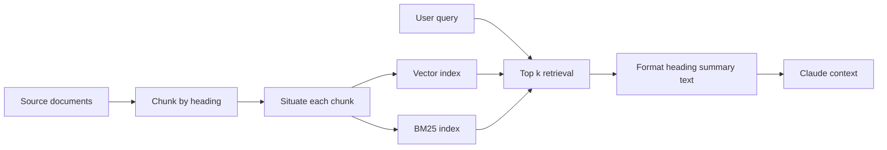

# Structuring Claude Topic Clusters for Retrieval Context

> Split documents by heading, add situating context to each chunk, index it for semantic and keyword search, and hand Claude structured results.

## At a Glance

| Field | Value |
|-------|-------|
| Difficulty | Intermediate |
| Time to Learn | 2-4 hours for a first pipeline over one document set |
| Outcome | A retrieval pipeline that returns self-explanatory, topic-scoped chunks and places them into Claude's context in a consistent, structured format. |
| Prerequisites | A document set with consistent headings or a way to add them, Access to an embedding model and a vector store, Basic familiarity with keyword search such as BM25, Working knowledge of how Claude's context window is filled |
| Part of | [Claude Code Context Engineering: 6 Pillars Framework](../../methods/claude-code-context-engineering-6-pillars-framework/METHOD.md) |

## Overview

Retrieval is the pillar that decides which outside knowledge reaches Claude's context window at the moment a question needs it. For background on the six pillars and the framework's origins, see the [context engineering method page](https://tryhamster.com/methods/claude-code-context-engineering-6-pillars-framework). This page covers the hands-on part: cutting documents into chunks, making each chunk findable, and packaging what comes back so Claude can reason over it.

Anthropic describes retrieval as a two-stage process in which relevant information is pulled from an external knowledge base at runtime and then passed into the model context together with the original query, per its [Claude with Amazon Bedrock course material](https://anthropic.com/aws-reinvent-2024/course). Both stages matter. A perfect index is wasted if the results arrive as an unlabeled wall of text, and a clean prompt format cannot rescue chunks that were never retrieved.

The central design decision is chunk size. The framework notes that [small chunks improve precision but can lose surrounding context, while large chunks preserve context but consume more tokens](https://support.anthropic.com/en/articles/11473015-retrieval-augmented-generation-rag-for-projects). Chunking by heading is a practical middle ground: Anthropic's cookbook starts its basic pipeline by [chunking documents by heading so each chunk contains only the content from one subheading](https://platform.claude.com/cookbook/capabilities-retrieval-augmented-generation-guide). Treat each heading-scoped chunk as a topic cluster, a unit that answers one kind of question and carries its own label.

Heading chunks still lose document-level meaning. A passage that says "the limit was raised" does not say which product or which quarter. Contextual retrieval fixes this by [prepending chunk-specific explanatory context to each chunk before embedding and before building the BM25 index](https://anthropic.com/news/contextual-retrieval?_bhlid=a960fa4c634372a583b1aa394fd584d859fc4447), so both semantic and keyword search can match on terms the raw chunk never contained.

If you work in Claude Code, the framework points out that [Claude Code does not have native retrieval; MCP servers and command-line tools serve as workarounds, while CLAUDE.md files and Skills can act as an internal retrieval layer](https://support.anthropic.com/en/articles/11473015-retrieval-augmented-generation-rag-for-projects). That shifts part of this skill from building indexes to organizing project knowledge so Claude loads the right piece on demand.

The output of the skill is concrete: a set of contextualized, heading-labeled chunks stored in searchable indexes, a retrieval step that returns the best matches, and a fixed template that places those matches into Claude's context for synthesis.

## How It Works

The pipeline has a preprocessing half that runs once per document version and a runtime half that runs per query. A practical design, drawn from Anthropic's guidance, takes [source documents plus metadata and a user query as input, produces heading-based chunks, summaries or contextual descriptions and searchable vector and BM25 records during preprocessing, and at runtime places the most relevant chunks with headings, summaries and source text into Claude's context](https://anthropic.com/news/contextual-retrieval?_bhlid=a960fa4c634372a583b1aa394fd584d859fc4447).

**Chunking.** The cookbook's baseline is three moves: [chunk by heading, embed each chunk, and retrieve with cosine similarity](https://platform.claude.com/cookbook/capabilities-retrieval-augmented-generation-guide). Heading boundaries keep a definition next to the text that depends on it, which arbitrary fixed-length slices often break.

**Contextualization.** For each chunk, [you send both the chunk and the original source document to Claude and ask it to add context before storing the chunk in your retriever database](https://academy.claude.com/courses/claude-with-amazon-bedrock/contextual-retrieval). The result is [a brief description that situates the chunk within its source document](https://platform.claude.com/cookbook/capabilities-contextual-embeddings-guide). The prompt should [request succinct context and nothing else](https://anthropic.com/engineering/contextual-retrieval?_bhlid=b8f2ccb8c90dc5377e96317477b252ecd19877d0) so the output concatenates cleanly. Because the same full document is sent once per chunk, the reference notebook passes the full document with cache\_control set to ephemeral to leverage prompt caching. When a document is too large to send, [supply a few chunks from the beginning of the document plus the chunks immediately preceding the target](https://platform.claude.com/cookbook/capabilities-retrieval-augmented-generation-guide). What you store is [the generated situating context combined with the original chunk text](https://platform.claude.com/cookbook/capabilities-retrieval-augmented-generation-guide).

**Dual indexing.** The contextualized chunk goes into [both a vector index and a BM25 keyword index](https://anthropic.com/news/contextual-retrieval?_bhlid=a960fa4c634372a583b1aa394fd584d859fc4447). Vectors catch paraphrases; BM25 catches exact identifiers, error codes and product names that embeddings blur.

**Delivery.** At query time the workflow [searches for the top k most similar documents using the query embedding](https://anthropic.com/engineering/multi-agent-research-system), and the cookbook pattern [includes each chunk's heading, summary and full text](https://anthropic.com/engineering/multi-agent-research-system) in what it sends to Claude.

| Chunk style                   | Precision | Token cost | Main risk                                                                                                                                  |
| ----------------------------- | --------- | ---------- | ------------------------------------------------------------------------------------------------------------------------------------------ |
| Small raw chunks              | High      | Low        | Missing definitions and scope ([S31](https://support.anthropic.com/en/articles/11473015-retrieval-augmented-generation-rag-for-projects))  |
| Large raw chunks              | Lower     | High       | Irrelevant text crowds context ([S31](https://support.anthropic.com/en/articles/11473015-retrieval-augmented-generation-rag-for-projects)) |
| Contextualized heading chunks | High      | Moderate   | Extra preprocessing calls per chunk ([S40](https://academy.claude.com/courses/claude-with-amazon-bedrock/contextual-retrieval))            |

## Step-by-Step Guide

### Step 1: Inventory sources and metadata

List every document the retriever should cover and record metadata you will need at answer time: title, owner, version or date, and URL or path. Metadata travels with each chunk, so Claude can cite where an answer came from and you can filter stale versions. Decide which documents change often, because those need re-indexing on update. The output is a manifest that the rest of the pipeline reads from.

> **Pro tip:** Drop documents nobody would accept as an authoritative answer; every extra source is another way for a wrong chunk to outrank a right one.

### Step 2: Chunk by heading

Split each document at its subheadings so every chunk holds exactly one section's content, following the cookbook's [heading-based chunking](https://platform.claude.com/cookbook/capabilities-retrieval-augmented-generation-guide). Keep the heading path (for example, Billing, then Refunds, then Partial refunds) attached to the chunk as a label. For documents without headings, add them or fall back to paragraph groups that each answer one question. Inspect a sample of chunks by eye before moving on.

> **Pro tip:** If a heading path reads like a question someone would ask, the chunk is a good topic cluster; if it reads like 'Miscellaneous', split or merge it.

### Step 3: Check chunk size against meaning

Review the smallest and largest chunks, since the framework warns that [small chunks can lose surrounding context while large chunks consume more tokens](https://support.anthropic.com/en/articles/11473015-retrieval-augmented-generation-rag-for-projects). A small chunk fails if a reader cannot interpret it without the section above. A large chunk fails if most of it is irrelevant to the questions that would retrieve it. Merge orphaned fragments into their parent section and split sprawling sections at their next heading level.

> **Pro tip:** Set your own guardrails, for example flagging chunks under 50 words or over 800 words for manual review.

### Step 4: Generate situating context

For each chunk, send Claude the chunk plus its source document and ask for [succinct context and nothing else](https://anthropic.com/engineering/contextual-retrieval?_bhlid=b8f2ccb8c90dc5377e96317477b252ecd19877d0) that places it within the document. Cache the full document across calls, as the reference notebook does with ephemeral cache\_control. For oversized documents, send the opening chunks and the chunks just before the target instead. Prepend the generated sentence or two to the chunk and store the combined text.

> **Pro tip:** Spot-check outputs for invented facts; the situating context should only restate what the document says.

### Step 5: Build vector and BM25 indexes

Embed the contextualized chunks into a vector index and load the same text into a BM25 keyword index, as the [contextual retrieval method](https://anthropic.com/news/contextual-retrieval?_bhlid=a960fa4c634372a583b1aa394fd584d859fc4447) prescribes. Store heading, summary and metadata as fields next to each record rather than only inside the embedded text. Decide how you will merge results from the two indexes, such as interleaving ranks or deduplicating by chunk ID. Test with queries that use exact codes and queries that paraphrase.

### Step 6: Retrieve and format for Claude

At query time, pull the top k candidates and render each one in a fixed template with heading, summary and full text, the structure the cookbook uses. Place the formatted chunks and the user's original question together in the prompt, matching Anthropic's [two-stage retrieval description](https://anthropic.com/aws-reinvent-2024/course). Tell Claude to answer from the supplied material and to say when it is insufficient. Log which chunks were retrieved so you can debug wrong answers later.

> **Pro tip:** Wrap each chunk in a consistent tag or delimiter with its source label so Claude can attribute claims to specific chunks.

### Step 7: Wire retrieval into Claude Code

In Claude Code, retrieval is not built in, so connect an index through an MCP server or a command-line search tool. For project knowledge that does not need a vector store, [document recurring patterns in CLAUDE.md so Claude can find them when needed](https://support.anthropic.com/en/articles/11473015-retrieval-augmented-generation-rag-for-projects). Move repeated workflows into Skills, which the same guidance says [load expertise on demand and reduce context confusion](https://support.anthropic.com/en/articles/11473015-retrieval-augmented-generation-rag-for-projects). Keep each file topic-scoped so loading one does not drag in unrelated material.

## Best Practices

- Chunk on the document's own structure before reaching for fixed token windows. Headings mark where an author decided one topic ends, so heading chunks tend to be self-contained and easy to label.
- Contextualize every chunk, not just the ones that look ambiguous. Isolated passages often lack the product name, version or subject that a query uses, and [contextual retrieval](https://anthropic.com/news/contextual-retrieval?_bhlid=a960fa4c634372a583b1aa394fd584d859fc4447) exists to put those terms back.
- Run keyword and semantic search side by side. BM25 finds exact identifiers that embeddings treat as noise, while vectors find paraphrases BM25 misses; together they cover each other's blind spots.
- Keep the contextualization prompt narrow and its output short. Asking for [succinct context and nothing else](https://anthropic.com/engineering/contextual-retrieval?_bhlid=b8f2ccb8c90dc5377e96317477b252ecd19877d0) keeps the prepended text from drowning the chunk or introducing claims the document never made.
- Deliver chunks in a fixed, labeled template. Consistent heading, summary and body fields let Claude weigh evidence and cite it, and they make retrieval failures visible when you read logs.
- Re-index on document change and store version metadata. Stale chunks that outrank current ones produce confident, outdated answers that are hard to trace without version fields.
- Retrieve fewer, better chunks rather than padding the context. Every extra chunk spends tokens and adds a chance that loosely related text pulls the answer off course.

## Common Mistakes

- **Choosing chunk size purely for retrieval precision, producing tiny fragments.** — Very small chunks can [omit the definitions, scope or preceding explanation needed to interpret a passage](https://support.anthropic.com/en/articles/11473015-retrieval-augmented-generation-rag-for-projects), while very large ones waste context. Chunk by heading and merge fragments that cannot stand alone.
- **Indexing raw chunks with no document-level context.** — Isolated passages [may not contain the terms or references needed for accurate retrieval](https://anthropic.com/news/contextual-retrieval?_bhlid=a960fa4c634372a583b1aa394fd584d859fc4447). Prepend a situating description before embedding and before building the keyword index.
- **Pasting retrieved text into the prompt as one undifferentiated block.** — Without headings or summaries, Claude cannot tell where one source ends and another begins. Render each chunk with its heading, summary and full text, the pattern the cookbook follows.
- **Sending the entire oversized source document with every chunk during contextualization.** — When a document is too large, [provide a smaller representative context of opening material and nearby preceding chunks](https://platform.claude.com/cookbook/capabilities-retrieval-augmented-generation-guide). This keeps preprocessing affordable while still situating the chunk.
- **Assuming Claude Code will retrieve from your documents on its own.** — The framework describes [MCP and CLI integrations as workarounds and CLAUDE.md and Skills as practical retrieval mechanisms](https://support.anthropic.com/en/articles/11473015-retrieval-augmented-generation-rag-for-projects). Build or connect retrieval explicitly and organize project files so they can be loaded on demand.

## References

- [Examples](references/examples.md) — Worked examples and scenarios
- [FAQ](references/faq.md) — Frequently asked questions
- [Parent Method](../../methods/claude-code-context-engineering-6-pillars-framework/METHOD.md) — Claude Code Context Engineering: 6 Pillars Framework

## Related Skills

- [Writing Effective System Prompts for Claude AI](../writing-system-prompts-for-claude/SKILL.md)
- [Preventing Context Poisoning, Distraction, and Clashes](../preventing-context-poisoning-and-clashes/SKILL.md)
- [Engineering Tool Output Context Flows for Claude Agents](../engineering-tool-output-context-flows/SKILL.md)
- [Managing Context Window Token Budgets in Claude](../managing-context-window-token-budgets/SKILL.md)
- [Layering Instruction Hierarchies in Claude Prompts](../layering-instruction-hierarchies-in-prompts/SKILL.md)
- [Designing Multi-Turn Conversation Context Strategies](../designing-multi-turn-conversation-context/SKILL.md)

## Sources

- [Retrieval augmented generation \(RAG\) for projects - Claude support](https://support.anthropic.com/en/articles/11473015-retrieval-augmented-generation-rag-for-projects)
- [How we built our multi-agent research system - Anthropic](https://anthropic.com/engineering/multi-agent-research-system)
- [Introducing Contextual Retrieval](https://anthropic.com/news/contextual-retrieval?_bhlid=a960fa4c634372a583b1aa394fd584d859fc4447)
- [Enhancing RAG with contextual retrieval \| Claude Cookbook](https://platform.claude.com/cookbook/capabilities-contextual-embeddings-guide)
- [Introducing Contextual Retrieval \\ Anthropic](https://anthropic.com/engineering/contextual-retrieval?_bhlid=b8f2ccb8c90dc5377e96317477b252ecd19877d0)
- [Retrieval augmented generation \| Claude Cookbook](https://platform.claude.com/cookbook/capabilities-retrieval-augmented-generation-guide)
- [Claude with Amazon Bedrock - Anthropic Courses](https://anthropic.com/aws-reinvent-2024/course)
- [Contextual retrieval · Claude with Amazon Bedrock](https://academy.claude.com/courses/claude-with-amazon-bedrock/contextual-retrieval)
