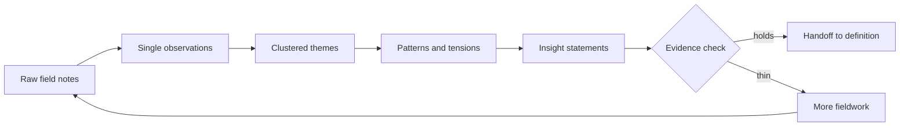

# A Guide to Synthesizing Qualitative Research Design

> Turn raw interviews and observation notes into clustered themes, patterns and tensions, and evidence-backed insight statements a team can design against.

## At a Glance

| Field | Value |
|-------|-------|
| Difficulty | Intermediate |
| Time to Learn | Half a day to two days per research round, depending on the volume of field data |
| Outcome | A short set of insight statements, each linking observed behavior to an underlying need, with a traceable evidence trail and an honest note of where the sample is thin. |
| Prerequisites | Completed contextual interviews or observation sessions with notes, quotes or recordings, A defined research question and scope for the project, A shared wall or digital board where the team can move notes around, At least two people available to synthesize together |
| Part of | [Human-Centered Design \(HCD\)](../../methods/human-centered-design-hcd/METHOD.md) |

## Overview

Synthesis is the step between fieldwork and definition. You start with a pile of interview notes, observation logs, photos and quotes, and you end with a handful of statements the team can design against. For background on where this step sits in the overall method, see the [Human-Centered Design method page](https://tryhamster.com/methods/human-centered-design-hcd). This page covers only how to do it.

The output is specific. In [a summary of the IDEO human-centered design process](https://umbrex.com/resources/frameworks/design-thinking-frameworks/ideo-human-centered-design-process), the research stage produces user insights, unmet needs, a reframed problem statement and design principles. Synthesis owns the first of those: the insight, which connects an observed behavior or expressed experience to a deeper need or motivation. The later outputs are built from insights, so weak insights weaken everything downstream.

What makes synthesis hard is that it is interpretive. Every note feels important on the day you wrote it, and the most vivid participant tends to dominate the room. The discipline, as [the same IDEO process guide](https://umbrex.com/resources/frameworks/design-thinking-frameworks/ideo-human-centered-design-process) describes it, is to look for recurring patterns, tensions, contradictions and unmet needs rather than treating every individual comment as an equally generalizable finding. [Umbrex's human-centered design toolkit](https://umbrex.com/resources/frameworks/design-thinking-frameworks/human-centered-design-toolkit) adds two things worth hunting for explicitly: barriers, and moments that matter disproportionately to the people involved.

The main risk is overclaiming. [A 2022 analysis of human-centered design in eHealth](https://pmc.ncbi.nlm.nih.gov/articles/PMC9582917) points out that HCD methods most often rely on studying a relatively small sample in depth, which makes them prone to a range of sampling biases, and lists limited reach and a narrow contextual and temporal focus among the approach's limitations. Good synthesis does not pretend a dozen conversations represent a population. It records who each insight is based on, which contexts it covers, and where it needs more evidence.

Synthesis works best as a group activity with the people who did the fieldwork plus a few who will build or run the eventual solution. Researchers bring the context behind each note; builders bring skepticism about what is actionable. The finished insights go to the team working on [Defining User Needs and Design Requirements](https://tryhamster.com/skills/defining-user-needs-and-design-requirements), who turn them into needs, opportunity areas and principles.

## How It Works

Synthesis moves in one direction, from many specific fragments to a few general statements, with a check at the end that can send you back to the field.

**Decompose.** Raw notes mix observation, quotation and the researcher's interpretation in the same paragraph. The first move is to split them into single observations, one per note, each tagged with the participant and context it came from. This keeps interpretation from sneaking in before the data is visible, and it makes every later cluster traceable to real people.

**Cluster bottom-up.** The team lays the notes out and groups them by similarity without starting from predefined categories. Low-tech setups work well: the Veterans Affairs toolkit for human-centered design has facilitators distribute sticky notes and markers to everyone and set up a large flip chart. The point of working physically or on a shared board is that everyone can move notes, argue about placement and see the whole picture at once. Clusters get a name only after they form, written as a plain sentence about what people do or feel, not a one-word category.

**Look across clusters.** Themes on their own are descriptive. Insight comes from comparing them: where do two themes pull against each other, where does what people say contradict what you observed, and which moments carry outsized weight? [The IDEO process guide](https://umbrex.com/resources/frameworks/design-thinking-frameworks/ideo-human-centered-design-process) frames this as looking for recurring patterns, tensions, contradictions and unmet needs, and [Umbrex's toolkit](https://umbrex.com/resources/frameworks/design-thinking-frameworks/human-centered-design-toolkit) adds barriers and moments that matter disproportionately. Tensions are usually the richest material because they point to a need that current solutions fail to resolve.

**Write insights.** An insight statement names a behavior or experience, the need or motivation behind it, and ideally the tension that makes it hard to meet. A theme says what happens; an insight says why it matters. Each statement carries references to the notes and participants that support it.

**Check the evidence.** Because qualitative samples are small and deep, [the 2022 eHealth analysis](https://pmc.ncbi.nlm.nih.gov/articles/PMC9582917) warns they are prone to sampling biases and a narrow contextual and temporal focus. Before handoff, test each insight: how many participants and contexts support it, who was missing from the sample, and does other evidence agree? [Umbrex's toolkit](https://umbrex.com/resources/frameworks/design-thinking-frameworks/human-centered-design-toolkit) lists inputs such as call-center themes, complaint data, sales feedback and operational facts that can corroborate or challenge a field finding. An insight that fails the check is not discarded; it is marked as a hypothesis and fed into the next round of research.

## Step-by-Step Guide

### Step 1: Set the unit of analysis

Before touching the notes, agree what you are synthesizing about. [The IDEO process guide](https://umbrex.com/resources/frameworks/design-thinking-frameworks/ideo-human-centered-design-process) recommends defining the unit of analysis, such as a customer segment, use case, service moment, workflow or end-to-end journey, before interpreting research. Without it, clusters drift between levels, with a detail about one screen sitting next to a theme about someone's whole week. Write the unit and the research question at the top of the board so every placement decision can be tested against it.

> **Pro tip:** If the team cannot agree on one unit, run separate boards rather than mixing levels on one wall.

### Step 2: Break notes into single observations

Go through each interview and observation log and extract one observation per note: a quote, an action you saw, a workaround, a frustration. Tag each note with a participant code and the context, such as location or task. Keep verbatim quotes in quotation marks and your interpretations clearly marked, or better, left out at this stage. Include what went well as well as what went wrong, since successful interactions and missed opportunities are as informative as complaints.

> **Pro tip:** Use one color of note per participant so a cluster dominated by one person is visible at a glance.

### Step 3: Cluster bottom-up on a shared wall

Put every note up and have the group sort them into clusters by similarity, without starting from a list of categories. The Veterans Affairs HCD toolkit sets this up with sticky notes and markers for everyone and a large flip chart, which keeps everyone hands-on rather than watching one person drive. Move notes freely and split clusters that grow too broad. Once clusters settle, name each one with a full sentence describing what people do or feel.

> **Pro tip:** Sort in silence for the first round, then discuss; it stops the loudest voice from setting the categories.

### Step 4: Hunt for patterns and tensions across clusters

Step back and compare clusters rather than reading them one by one. Look for the signals [Umbrex's HCD toolkit](https://umbrex.com/resources/frameworks/design-thinking-frameworks/human-centered-design-toolkit) names: recurring needs, tensions, barriers, contradictions and moments that matter disproportionately. Pay special attention where what people said conflicts with what you observed, because that gap often hides the real need. Mark tensions directly on the board, for example with a line between two clusters labeled with what pulls them apart.

### Step 5: Write insight statements

For each strong pattern or tension, draft a statement that links a behavior or experience to the need or motivation behind it, which is how [the IDEO process guide](https://umbrex.com/resources/frameworks/design-thinking-frameworks/ideo-human-centered-design-process) characterizes a useful insight. A workable shape is: people do X because they need Y, but Z gets in the way. Keep solutions out of the statement, since an insight that names a feature has skipped a step. Attach the supporting notes and participant codes to each statement.

> **Pro tip:** Read each insight to someone who was not in the field; if they say 'obviously', it is probably still a theme, not an insight.

### Step 6: Test each insight against the sample

Check how many participants and contexts support each insight and who your sample left out. [The 2022 eHealth analysis](https://pmc.ncbi.nlm.nih.gov/articles/PMC9582917) notes that HCD's small, in-depth samples are prone to sampling biases and a narrow contextual and temporal focus, so assume some of your insights reflect who you happened to meet. Where possible, compare against other evidence such as complaint data, call-center themes or operational facts, which [Umbrex's toolkit](https://umbrex.com/resources/frameworks/design-thinking-frameworks/human-centered-design-toolkit) lists as research inputs. Label each insight as well supported, partial, or hypothesis.

> **Pro tip:** Keep a 'who we did not hear from' list next to the insights; it becomes the recruiting brief for the next round.

### Step 7: Hand off with an evidence trail

Package the insights with their confidence labels, supporting quotes and the gaps list for the team moving into definition. Include the unit of analysis and research question so readers know the boundaries of each claim. Photograph or export the clustered board so anyone can trace a statement back to raw notes. The receiving team uses this to frame needs and opportunity areas, as covered in [Defining User Needs and Design Requirements](https://tryhamster.com/skills/defining-user-needs-and-design-requirements).

## Best Practices

- Synthesize within a few days of fieldwork. Context fades quickly, and notes that were obvious in the moment become ambiguous a week later.
- Keep observation and interpretation on separate notes. Mixing them lets assumptions enter the clusters disguised as data, and you lose the ability to tell what you saw from what you guessed.
- Include at least one person who will build or operate the solution. They challenge insights that are not actionable and carry the reasoning into delivery, which reduces the loss that happens at handoff.
- Name clusters with sentences, not labels. A label like 'onboarding' hides the finding, while a sentence forces the team to state what people actually do or feel.
- Treat contradictions as signal. When a participant's words and actions diverge, or two groups want opposite things, you have usually found the need that current solutions miss.
- Make every insight traceable. Linking each statement to participant codes and notes lets reviewers check the evidence and prevents one memorable quote from becoming a headline finding.
- State the limits of the sample next to the insights. Small, deep samples are prone to bias, and saying so up front keeps the team from treating hypotheses as settled facts.

## Common Mistakes

- **Starting with predefined categories, often the sections of the interview guide, and sorting notes into them.** — Cluster bottom-up and name groups only after they form. Top-down sorting reproduces your assumptions and hides findings that do not fit the original questions.
- **Treating every comment as equally important, so the insight list becomes a long inventory of quotes.** — Prioritize recurring patterns, tensions and contradictions over one-off remarks. A single vivid comment can prompt a hypothesis, but it should be labeled as one.
- **Writing themes and calling them insights, such as 'users find scheduling confusing'.** — Push each theme to the underlying need and why it is hard to meet. If the statement does not explain motivation, it is still a description.
- **Embedding a solution in the insight, for example 'people need a reminder feature'.** — Rewrite to name the need, such as keeping track of commitments across tools, and leave solutions to ideation. Solution-shaped insights narrow the options before anyone has explored them.
- **Presenting insights from a narrow sample as if they apply to everyone.** — Record who and which contexts each insight covers, list who was missing, and corroborate with other data where possible. Mark weakly supported insights as hypotheses for further research.

## References

- [Examples](references/examples.md) — Worked examples and scenarios
- [FAQ](references/faq.md) — Frequently asked questions
- [Parent Method](../../methods/human-centered-design-hcd/METHOD.md) — Human-Centered Design \(HCD\)

## Related Skills

- [Building Rapid Prototypes](../building-rapid-prototypes/SKILL.md)
- [Conducting Contextual User Research](../conducting-contextual-user-research/SKILL.md)
- [Planning Human-Centered Implementation](../planning-human-centered-implementation/SKILL.md)
- [Conducting User-Centered Evaluation](../conducting-user-centered-evaluation/SKILL.md)
- [Facilitating Participatory Ideation](../facilitating-participatory-ideation/SKILL.md)
- [Defining User Needs and Design Requirements](../defining-user-needs-and-design-requirements/SKILL.md)
- [Iterating Design Solutions with Users](../iterating-design-solutions-with-users/SKILL.md)

## Sources

- [The Limitations of User-and Human-Centered Design in an eHealth](https://pmc.ncbi.nlm.nih.gov/articles/PMC9582917)
- [Human-Centered Design Toolkit - Umbrex](https://umbrex.com/resources/frameworks/design-thinking-frameworks/human-centered-design-toolkit)
- [IDEO Human-Centered Design Process](https://umbrex.com/resources/frameworks/design-thinking-frameworks/ideo-human-centered-design-process)
