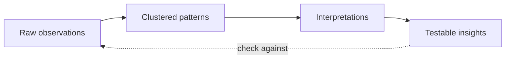

# Synthesizing user research insights from raw observations

> Turn raw observations and interviews into a small set of evidence-backed, testable insights that a team can frame problems and ideas around.

## At a Glance

| Field | Value |
|-------|-------|
| Difficulty | Intermediate |
| Time to Learn | Half a day to two days per research round |
| Outcome | A short list of testable insights, each linked to the observations that support it, ready to feed a point-of-view problem statement. |
| Prerequisites | Completed user research such as interviews, observations or site visits, Raw notes, transcripts or recordings the team can access, A small cross-functional group who took part in or reviewed the research, A wall, whiteboard or shared canvas for clustering notes |
| Part of | [Design Thinking](../../methods/design-thinking/METHOD.md) |

## Overview

Synthesis is the step between collecting research and deciding what to do about it. The Stanford d.school describes it as [making sense of information and finding insight and opportunity within it](https://dschool.stanford.edu/stories/lets-stop-talking-about-the-design-process), work that relies on frameworks, maps and abductive thinking and draws on both qualitative and quantitative data. In [Design Thinking](https://tryhamster.com/methods/design-thinking) it sits at the hinge between understanding users and defining the problem: raw material goes in, and a small set of insights the team can act on comes out.

The inputs are whatever your fieldwork produced. The d.school lists [observations, conversations, research findings, quotes, behaviors, needs, motivations and emotional states collected from people in context](https://dschool.stanford.edu/stories/lets-stop-talking-about-the-design-process). In practice that means interview transcripts or notes, photos, screen recordings, support tickets, survey responses and the field notes from a site visit. Volume is usually the problem. A team that has finished a round of interviews can hold hundreds of observations and still have no shared view of what they mean.

The output is not a summary of what people said. A summary restates the data. An insight explains something about the people that the data implies but does not state outright, and it changes what the team would build. The d.school bootleg deck reminds practitioners that [the problems you are trying to solve are rarely your own but those of particular users](https://dschool.sfo3.digitaloceanspaces.com/documents/dschool_bootleg_deck_2018_final_sm2-6.pdf), which is why synthesis has to stay anchored to what those users actually did and said rather than to what the team already believed.

Synthesis also feeds the next skill directly. The same deck describes framing as [translating empathy findings into user needs and insights, then scoping a meaningful challenge](https://dschool.sfo3.digitaloceanspaces.com/documents/dschool_bootleg_deck_2018_final_sm2-6.pdf), so the quality of your problem statement depends on the quality of the insights you hand over. Weak synthesis produces generic needs, such as wanting things to be easier or faster, and generic needs produce generic ideas.

This page covers the working mechanics: preparing inputs, externalizing and clustering observations, using frameworks and maps to expose patterns, reasoning abductively from patterns to explanations, and turning those explanations into insights you can test. It assumes you already have research material in hand. If you do not, go back to fieldwork first, because no framework can synthesize its way past thin data.

## How It Works

Synthesis moves material up a ladder with four rungs, and each rung has a different standard of proof.

Raw observations are the bottom rung: what someone did or said, captured as close to verbatim as possible, with a note of who and where. The standard here is accuracy. Clustered patterns are groups of observations that recur across people, or that belong together because they describe the same moment, need or workaround. The standard is coverage: a pattern backed by one participant is an anecdote.

Interpretations are the rung where most synthesis goes wrong. A practical rule from the d.school is to [distinguish evidence from interpretation](https://dschool.stanford.edu/stories/lets-stop-talking-about-the-design-process): observed or reported behavior belongs in the research record, while explanations of why it happened are interpretations that must stay open to testing. Keeping them on visibly different notes, or in different columns, stops a team guess from being quoted later as if a user had said it.

The move from pattern to interpretation is abductive. Deduction applies a known rule and induction generalizes from many cases, while abduction proposes the most plausible explanation for something surprising. When a pattern contradicts what the team expected, ask what would have to be true about these people for their behavior to make sense. That question produces candidate explanations, and you want more than one per pattern so the team does not lock onto the first story. This is where the method earns its reputation for helping teams [challenge assumptions and redefine problems](https://ixdf.org/literature/topics/design-thinking): abduction forces the team to name what it believed and check it against what it saw.

Frameworks and maps make patterns visible. The d.school names [frameworks, maps and abductive thinking](https://dschool.stanford.edu/stories/lets-stop-talking-about-the-design-process) as the core of sense-making. Useful shapes include an affinity wall for bottom-up clustering, an empathy map that splits what people say, do, think and feel, a journey map that lays observations along a timeline to show where pain concentrates, and a two-by-two that plots participants on two tensions to reveal distinct groups. Pick the frame that fits the question: a journey map when the problem is a process, a two-by-two when participants seem to want contradictory things. Frames are disposable. If one produces nothing, try another rather than forcing the data into it.

Testable insights are the top rung. An insight states something non-obvious about the people, points to the observations behind it, and implies a way to check it. Because the process is [non-linear and iterative](https://ixdf.org/literature/topics/design-thinking), insights stay provisional. A prototype test may confirm, sharpen or overturn one, and the ladder is climbed again with new observations at the bottom. Quantitative data fits the same ladder: analytics or survey results show how widespread a pattern is, while qualitative observation explains why it happens.

## Step-by-Step Guide

### Step 1: Unpack the raw record

Within a day or two of the research, have each researcher write one observation per note: a single quote, action or workaround. Tag every note with the participant and context so it can be traced back later. Include surprises, contradictions and emotional moments, not just the parts that relate to your original question. The output is a wall or canvas of atomic, traceable observations rather than a set of per-interview summaries.

> **Pro tip:** If a note contains the word because, it probably mixes an observation with an explanation. Split it into two notes.

### Step 2: Separate evidence from interpretation

Sort the notes into what was seen or heard and what the team thinks it means. Give interpretations a different color, column or prefix so nobody confuses them with data. This is the step that keeps synthesis honest, because later every insight must point back to evidence notes, not to other interpretations. If the interpretation pile is larger than the evidence pile, the team has been theorizing during fieldwork and should revisit the recordings.

> **Pro tip:** Ask the person who wrote an interpretation note to name the observation that prompted it, and place the two side by side.

### Step 3: Cluster observations into patterns

Move evidence notes into groups silently at first, letting similar behaviors, needs and pains collect together. Then name each cluster with a phrase that describes the people, such as a need or a workaround, not a product feature. Break up any cluster that is really one participant repeated many times. The output is a set of named patterns with a rough sense of how many participants each one covers.

> **Pro tip:** Name clusters in the users' voice, for example 'I keep a backup in case the system is wrong', rather than with a category label like 'trust'.

### Step 4: Apply a framework or map

Choose a frame that suits the problem and lay the patterns onto it. Use a journey map when the work is a sequence of steps, an empathy map when you need to contrast what people say with what they do, and a two-by-two when participants pull in opposite directions. Look for where the frame shows gaps, pile-ups or tensions, because those are where insights hide. If the frame produces nothing new after a short attempt, discard it and try another.

### Step 5: Reason abductively to explanations

For each strong or surprising pattern, ask what would have to be true about these people for their behavior to be sensible. Write at least two competing explanations per pattern and keep them on interpretation notes. Check each against the evidence wall and note which observations support or contradict it. Keep the explanation that accounts for the most evidence with the fewest extra assumptions, and record the runner-up in case later tests overturn the choice.

> **Pro tip:** Treat workarounds as gold. A workaround is behavior people invested effort in, so the explanation behind it usually points to a real need.

### Step 6: Write testable insights

Turn each surviving explanation into a one or two sentence insight that names the people, the underlying motivation or tension, and why it matters. Link every insight to its supporting observations. Add a line stating how the team could check it, such as a question to ask or a behavior to watch for in the next round. Cut insights that would not change any decision the team is facing.

> **Pro tip:** Test each insight by asking whether a teammate who skipped the research would find it surprising. If not, it is probably a finding, not an insight.

### Step 7: Hand off to problem framing

Rank the insights by how much they shift the team's perspective and how well the evidence supports them. Pass the top few to the people writing the point-of-view statement in [Framing Human-Centered Problems](https://tryhamster.com/skills/framing-human-centered-problems). Keep the full evidence wall accessible, because framing and later testing will send people back to it. Record which insights were set aside and why, so they can be revisited when new evidence arrives.

## Best Practices

- Synthesize soon after fieldwork, while memory of tone and context is fresh. Details such as hesitation or frustration fade quickly and are rarely captured fully in notes.
- Include people who were in the field alongside people who were not. Field researchers supply context, while newcomers spot the assumptions that insiders have stopped noticing.
- Keep every insight traceable to specific observations. Traceability lets anyone challenge an insight on evidence rather than on opinion, and it makes later updates straightforward.
- Generate more than one explanation for each surprising pattern. Competing explanations protect the team from anchoring on the first plausible story, which is often the one that confirms existing plans.
- Use quantitative data to size patterns, not to replace them. Numbers show how common a behavior is, but only observation and conversation explain why people do it.
- Timebox each framework attempt. Frames are tools for seeing, and if one is not revealing anything, switching early saves hours of forcing data into boxes.
- Write insights about people, not about solutions. An insight that already names a feature has skipped ahead to ideation and narrows the options before the problem is framed.

## Common Mistakes

- **Treating a summary of what users said as an insight.** — Restated quotes tell the team nothing new. Push each pattern through the question of why people behave this way until you reach a motivation or tension that is not stated outright in the data.
- **Letting interpretations masquerade as evidence.** — When guesses sit on the same notes as quotes, they get repeated as facts. Keep interpretations visibly separate and require each insight to cite evidence notes directly.
- **Clustering by product feature or team structure.** — Grouping notes under headings like onboarding or billing reproduces the org chart instead of the users' world. Cluster by need, behavior or moment, and name groups in the users' voice.
- **Building patterns from one vivid participant.** — A memorable interview can dominate a wall. Check how many participants each cluster covers and flag single-source patterns as hypotheses to probe in the next round.
- **Discarding observations that do not fit.** — Outliers and contradictions are often where the most useful insights come from. Park them in a visible surprises area and revisit them during abductive reasoning.
- **Treating synthesis as final.** — Insights are provisional explanations. Record how each could be checked and expect prototype tests to confirm, sharpen or overturn them.

## References

- [Examples](references/examples.md) — Worked examples and scenarios
- [FAQ](references/faq.md) — Frequently asked questions
- [Parent Method](../../methods/design-thinking/METHOD.md) — Design Thinking

## Related Skills

- [Generating Divergent Ideas](../generating-divergent-ideas/SKILL.md)
- [Building Rapid Prototypes](../building-rapid-prototypes/SKILL.md)
- [Balancing Desirability, Feasibility, and Viability](../balancing-desirability-feasibility-and-viability/SKILL.md)
- [Iterating from Evidence](../iterating-from-evidence/SKILL.md)
- [Framing Human-Centered Problems](../framing-human-centered-problems/SKILL.md)

## Sources

- [Let's Stop Talking about THE Design Process \| Stanford d.school](https://dschool.stanford.edu/stories/lets-stop-talking-about-the-design-process)
- [What is Design Thinking? — updated 2026 \| IxDF](https://ixdf.org/literature/topics/design-thinking)
- [dschool\_bootleg\_deck\_2018\_final\_sm2-6.pdf](https://dschool.sfo3.digitaloceanspaces.com/documents/dschool_bootleg_deck_2018_final_sm2-6.pdf)
